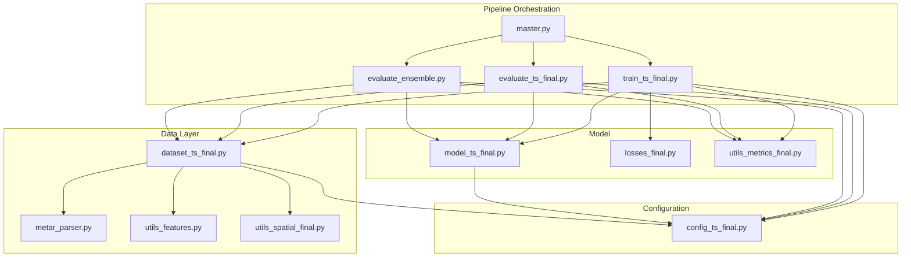
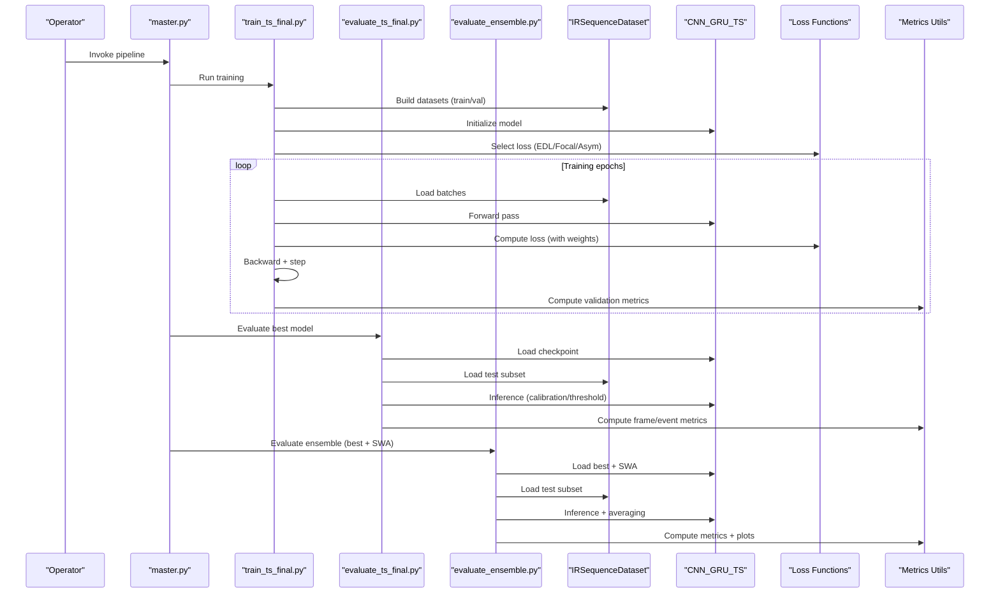
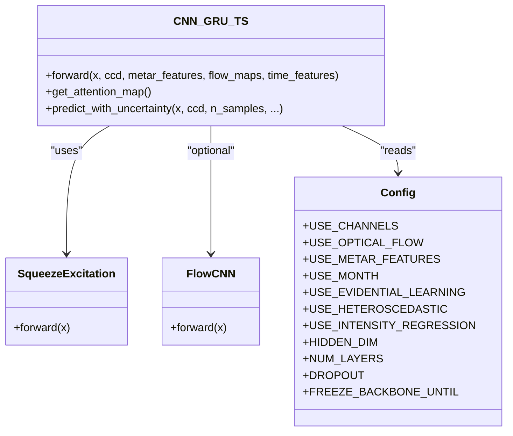
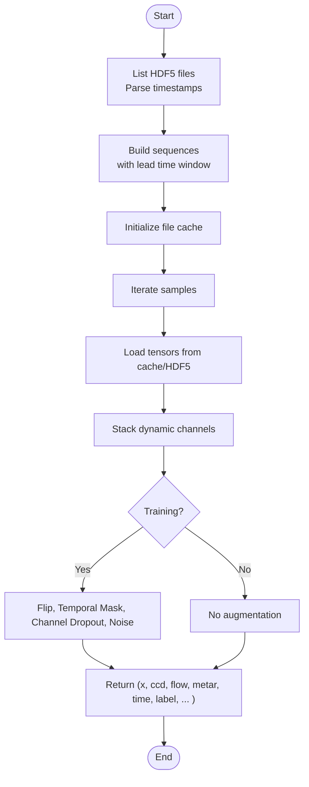
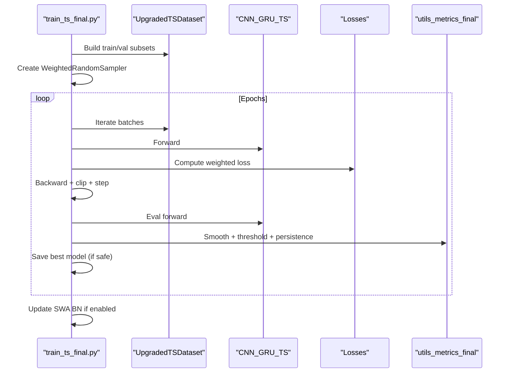
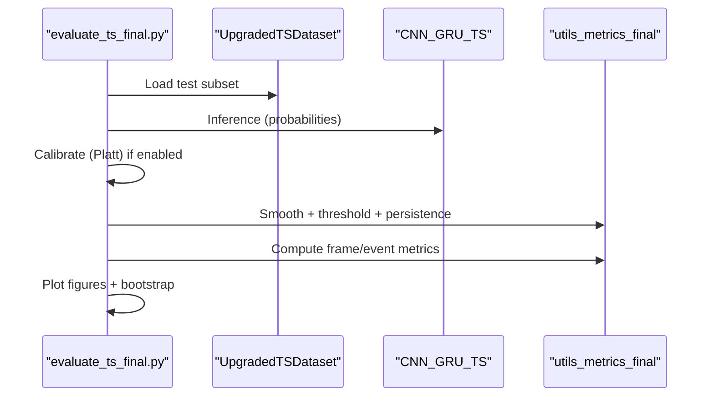
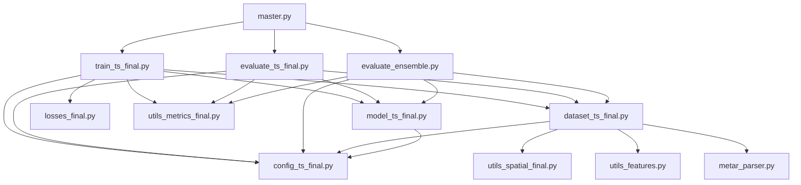

# Architecture & Design

<cite>
**Referenced Files in This Document**
- [master.py](file://master.py)
- [train_ts_final.py](file://train_ts_final.py)
- [evaluate_ts_final.py](file://evaluate_ts_final.py)
- [evaluate_ensemble.py](file://evaluate_ensemble.py)
- [model_ts_final.py](file://model_ts_final.py)
- [dataset_ts_final.py](file://dataset_ts_final.py)
- [config_ts_final.py](file://config_ts_final.py)
- [losses_final.py](file://losses_final.py)
- [utils_features.py](file://utils_features.py)
- [utils_spatial_final.py](file://utils_spatial_final.py)
- [utils_metrics_final.py](file://utils_metrics_final.py)
- [metar_parser.py](file://metar_parser.py)
</cite>

## Table of Contents
1. [Introduction](#introduction)
2. [Project Structure](#project-structure)
3. [Core Components](#core-components)
4. [Architecture Overview](#architecture-overview)
5. [Detailed Component Analysis](#detailed-component-analysis)
6. [Dependency Analysis](#dependency-analysis)
7. [Performance Considerations](#performance-considerations)
8. [Troubleshooting Guide](#troubleshooting-guide)
9. [Conclusion](#conclusion)
10. [Appendices](#appendices)

## Introduction
This document describes the architecture and design of the thunderstorm nowcasting system. It focuses on the CNN-GRU hybrid neural network, the pipeline pattern implementation, modular component organization, data flow from HDF5 storage to model training and evaluation, configuration management, and parameter optimization strategies. It also covers design decisions for computational efficiency, memory optimization, and real-time processing, along with extensibility points for future enhancements.

## Project Structure
The system is organized around a modular pipeline with clearly separated concerns:
- Configuration management centralizes all hyperparameters and paths.
- Data pipeline loads precomputed HDF5 files and constructs spatio-temporal sequences.
- Neural network model integrates CNN backbone, GRU temporal fusion, spatial attention, and multi-modal features.
- Training script orchestrates data loading, loss computation, optimization, and validation.
- Evaluation scripts compute metrics, produce calibrated predictions, and generate visualizations.
- Utilities provide spatial masks, METAR feature extraction, and temporal smoothing/post-processing.

**Diagram sources**
- [master.py:1-108](file://master.py#L1-L108)
- [train_ts_final.py:142-757](file://train_ts_final.py#L142-L757)
- [evaluate_ts_final.py:361-908](file://evaluate_ts_final.py#L361-L908)
- [evaluate_ensemble.py:84-361](file://evaluate_ensemble.py#L84-L361)
- [dataset_ts_final.py:47-515](file://dataset_ts_final.py#L47-L515)
- [model_ts_final.py:68-335](file://model_ts_final.py#L68-L335)
- [config_ts_final.py:16-208](file://config_ts_final.py#L16-L208)
- [losses_final.py:13-258](file://losses_final.py#L13-L258)
- [utils_features.py:11-191](file://utils_features.py#L11-L191)
- [utils_spatial_final.py:12-80](file://utils_spatial_final.py#L12-L80)
- [utils_metrics_final.py:14-200](file://utils_metrics_final.py#L14-L200)
- [metar_parser.py:141-186](file://metar_parser.py#L141-L186)

**Section sources**
- [master.py:1-108](file://master.py#L1-L108)
- [train_ts_final.py:142-757](file://train_ts_final.py#L142-L757)
- [evaluate_ts_final.py:361-908](file://evaluate_ts_final.py#L361-L908)
- [evaluate_ensemble.py:84-361](file://evaluate_ensemble.py#L84-L361)
- [dataset_ts_final.py:47-515](file://dataset_ts_final.py#L47-L515)
- [model_ts_final.py:68-335](file://model_ts_final.py#L68-L335)
- [config_ts_final.py:16-208](file://config_ts_final.py#L16-L208)
- [losses_final.py:13-258](file://losses_final.py#L13-L258)
- [utils_features.py:11-191](file://utils_features.py#L11-L191)
- [utils_spatial_final.py:12-80](file://utils_spatial_final.py#L12-L80)
- [utils_metrics_final.py:14-200](file://utils_metrics_final.py#L14-L200)
- [metar_parser.py:141-186](file://metar_parser.py#L141-L186)

## Core Components
- Configuration: Centralized configuration class defines data paths, model architecture, training hyperparameters, augmentation, loss functions, and post-processing parameters.
- Dataset: IRSequenceDataset builds spatio-temporal sequences from HDF5 files, computes labels with soft pre-event ramping, and supports multi-modal features (optical flow, METAR, time-of-year).
- Model: CNN-GRU hybrid with MobileNetV2 backbone, spatial skip connections, optional optical flow branch, and multi-modal projections (METAR, time).
- Training: Orchestrates data loaders, loss computation, optimization, SWA, and validation metrics.
- Evaluation: Computes calibrated predictions, applies thresholds, persistence filtering, and generates visualizations and bootstrap confidence intervals.
- Utilities: Spatial masks, METAR parsing and feature extraction, temporal smoothing, and metrics.

**Section sources**
- [config_ts_final.py:16-208](file://config_ts_final.py#L16-L208)
- [dataset_ts_final.py:47-515](file://dataset_ts_final.py#L47-L515)
- [model_ts_final.py:68-335](file://model_ts_final.py#L68-L335)
- [train_ts_final.py:142-757](file://train_ts_final.py#L142-L757)
- [evaluate_ts_final.py:361-908](file://evaluate_ts_final.py#L361-L908)
- [utils_features.py:11-191](file://utils_features.py#L11-L191)
- [utils_spatial_final.py:12-80](file://utils_spatial_final.py#L12-L80)
- [utils_metrics_final.py:14-200](file://utils_metrics_final.py#L14-L200)
- [metar_parser.py:141-186](file://metar_parser.py#L141-L186)

## Architecture Overview
The system follows a pipeline pattern with modular components:
- Entry points: master.py coordinates training, evaluation, ensemble, and ablation runs.
- Data ingestion: dataset_ts_final.py reads HDF5 files and constructs sequences with optional optical flow caching and multi-modal features.
- Model: model_ts_final.py implements the CNN-GRU architecture with optional evidential learning, heteroscedastic uncertainty, and intensity regression heads.
- Training: train_ts_final.py manages samplers, losses, scheduling, SWA, and validation scoring.
- Evaluation: evaluate_ts_final.py and evaluate_ensemble.py compute calibrated predictions, thresholds, and metrics with visualizations.

**Diagram sources**
- [master.py:39-108](file://master.py#L39-L108)
- [train_ts_final.py:142-757](file://train_ts_final.py#L142-L757)
- [evaluate_ts_final.py:361-908](file://evaluate_ts_final.py#L361-L908)
- [evaluate_ensemble.py:84-361](file://evaluate_ensemble.py#L84-L361)
- [dataset_ts_final.py:47-515](file://dataset_ts_final.py#L47-L515)
- [model_ts_final.py:68-335](file://model_ts_final.py#L68-L335)
- [losses_final.py:13-258](file://losses_final.py#L13-L258)
- [utils_metrics_final.py:14-200](file://utils_metrics_final.py#L14-L200)

## Detailed Component Analysis

### Neural Network Architecture: CNN-GRU Hybrid
The model integrates:
- CNN backbone: MobileNetV2 adapted to dynamic input channels based on configured channels.
- Spatial skip connection: Low-resolution grid features for spatial attention.
- Optical flow branch: Lightweight CNN for motion cues.
- Multi-modal projections: METAR features and time-of-year features.
- GRU temporal fusion: Temporal modeling with attention pooling.
- Multi-task heads: Binary classification, optional aleatoric uncertainty, and intensity regression.

**Diagram sources**
- [model_ts_final.py:16-335](file://model_ts_final.py#L16-L335)
- [config_ts_final.py:16-208](file://config_ts_final.py#L16-L208)

**Section sources**
- [model_ts_final.py:68-335](file://model_ts_final.py#L68-L335)
- [config_ts_final.py:16-208](file://config_ts_final.py#L16-L208)

### Data Pipeline: HDF5 to Model Training
The dataset:
- Loads precomputed HDF5 files keyed by timestamp.
- Supports dynamic channel stacking based on configuration.
- Integrates optical flow, METAR features, and time-of-year features.
- Applies augmentations during training (flip, temporal masking, channel dropout, noise).
- Uses a file cache to minimize repeated HDF5 reads.

**Diagram sources**
- [dataset_ts_final.py:268-334](file://dataset_ts_final.py#L268-L334)
- [dataset_ts_final.py:374-515](file://dataset_ts_final.py#L374-L515)

**Section sources**
- [dataset_ts_final.py:47-515](file://dataset_ts_final.py#L47-L515)
- [utils_features.py:11-191](file://utils_features.py#L11-L191)
- [utils_spatial_final.py:12-80](file://utils_spatial_final.py#L12-L80)

### Training Workflow: Losses, Samplers, and Validation
Training orchestrates:
- Class-balanced sampling with target positive rate and seasonal boosting.
- Weighted losses with focal modulation, late-detection penalty, and optional asymmetric time-aware loss.
- SWA for improved generalization.
- Validation metrics computed with temporal smoothing and persistence filtering.

**Diagram sources**
- [train_ts_final.py:200-757](file://train_ts_final.py#L200-L757)
- [losses_final.py:13-258](file://losses_final.py#L13-L258)
- [utils_metrics_final.py:14-200](file://utils_metrics_final.py#L14-L200)

**Section sources**
- [train_ts_final.py:142-757](file://train_ts_final.py#L142-L757)
- [losses_final.py:13-258](file://losses_final.py#L13-L258)
- [utils_metrics_final.py:14-200](file://utils_metrics_final.py#L14-L200)

### Evaluation and Ensemble: Calibrated Predictions and Visualizations
Evaluation:
- Derives thresholds from validation set.
- Applies temporal smoothing and persistence filtering.
- Produces calibrated probabilities (Platt scaling) and visualizations.
- Computes weighted event metrics and bootstrap confidence intervals.

Ensemble:
- Averages best and SWA models (60/40 split).
- Reuses evaluation logic for thresholding and metrics.

**Diagram sources**
- [evaluate_ts_final.py:361-908](file://evaluate_ts_final.py#L361-L908)
- [evaluate_ensemble.py:84-361](file://evaluate_ensemble.py#L84-L361)
- [utils_metrics_final.py:14-200](file://utils_metrics_final.py#L14-L200)

**Section sources**
- [evaluate_ts_final.py:361-908](file://evaluate_ts_final.py#L361-L908)
- [evaluate_ensemble.py:84-361](file://evaluate_ensemble.py#L84-L361)
- [utils_metrics_final.py:14-200](file://utils_metrics_final.py#L14-L200)

### Configuration Management and Parameter Optimization
Configuration centralizes:
- Data paths and feature sets.
- Model architecture parameters (hidden size, layers, dropout).
- Training hyperparameters (learning rate, weight decay, patience).
- Loss function parameters (focal gamma/alpha, late penalty, label smoothing).
- Post-processing parameters (smoothing, persistence, thresholds).
- Spatial masks and CCD features.

Parameter optimization strategies:
- Class-balanced sampling with target positive rate and seasonal boosting.
- OHEM to focus on hard negatives.
- SWA for generalization.
- Evidential learning and heteroscedastic loss for uncertainty modeling.
- Asymmetric time-aware loss to penalize misses and high-confidence false alarms differently.

**Section sources**
- [config_ts_final.py:16-208](file://config_ts_final.py#L16-L208)
- [train_ts_final.py:244-329](file://train_ts_final.py#L244-L329)
- [losses_final.py:13-258](file://losses_final.py#L13-L258)

## Dependency Analysis
The system exhibits strong modularity with clear boundaries:
- master.py depends on training and evaluation scripts.
- train_ts_final.py depends on dataset, model, losses, and metrics.
- evaluate_ts_final.py and evaluate_ensemble.py depend on dataset and model.
- dataset_ts_final.py depends on HDF5, METAR, and spatial utilities.
- model_ts_final.py depends on configuration and PyTorch.
- losses_final.py provides modular loss implementations.
- utils_* modules encapsulate domain-specific logic.

**Diagram sources**
- [master.py:1-108](file://master.py#L1-L108)
- [train_ts_final.py:142-757](file://train_ts_final.py#L142-L757)
- [evaluate_ts_final.py:361-908](file://evaluate_ts_final.py#L361-L908)
- [evaluate_ensemble.py:84-361](file://evaluate_ensemble.py#L84-L361)
- [dataset_ts_final.py:47-515](file://dataset_ts_final.py#L47-L515)
- [model_ts_final.py:68-335](file://model_ts_final.py#L68-L335)
- [config_ts_final.py:16-208](file://config_ts_final.py#L16-L208)
- [losses_final.py:13-258](file://losses_final.py#L13-L258)
- [utils_features.py:11-191](file://utils_features.py#L11-L191)
- [utils_spatial_final.py:12-80](file://utils_spatial_final.py#L12-L80)
- [utils_metrics_final.py:14-200](file://utils_metrics_final.py#L14-L200)
- [metar_parser.py:141-186](file://metar_parser.py#L141-L186)

**Section sources**
- [master.py:1-108](file://master.py#L1-L108)
- [train_ts_final.py:142-757](file://train_ts_final.py#L142-L757)
- [evaluate_ts_final.py:361-908](file://evaluate_ts_final.py#L361-L908)
- [evaluate_ensemble.py:84-361](file://evaluate_ensemble.py#L84-L361)
- [dataset_ts_final.py:47-515](file://dataset_ts_final.py#L47-L515)
- [model_ts_final.py:68-335](file://model_ts_final.py#L68-L335)
- [config_ts_final.py:16-208](file://config_ts_final.py#L16-L208)
- [losses_final.py:13-258](file://losses_final.py#L13-L258)
- [utils_features.py:11-191](file://utils_features.py#L11-L191)
- [utils_spatial_final.py:12-80](file://utils_spatial_final.py#L12-L80)
- [utils_metrics_final.py:14-200](file://utils_metrics_final.py#L14-L200)
- [metar_parser.py:141-186](file://metar_parser.py#L141-L186)

## Performance Considerations
- Computational efficiency:
  - MobileNetV2 backbone reduces parameter count compared to transformers.
  - GRU replaces transformer for better parameter efficiency.
  - Freezing backbone layers prevents overfitting and reduces compute.
- Memory optimization:
  - File cache for HDF5 tensors avoids repeated disk I/O.
  - Adaptive pooling and spatial skip reduce feature dimensionality.
  - Dropout and layer normalization stabilize training.
- Real-time processing:
  - Configurable CPU-friendly inference target.
  - Temporal smoothing and persistence filtering reduce false alarms.
  - Dynamic channel stacking allows efficient input selection.

[No sources needed since this section provides general guidance]

## Troubleshooting Guide
Common issues and remedies:
- Missing model weights: strict load failures are handled by partial loading; ensure compatible architectures.
- METAR interpolation: default values are provided when data is missing; verify file format and timestamps.
- HDF5 cache: ensure sufficient disk space and correct file permissions.
- Validation leakage: thresholds are derived from validation set and not leaked to test.
- Persistence filter: adjust min_len to balance false alarms and missed detections.

**Section sources**
- [train_ts_final.py:335-379](file://train_ts_final.py#L335-L379)
- [evaluate_ts_final.py:430-447](file://evaluate_ts_final.py#L430-L447)
- [metar_parser.py:141-186](file://metar_parser.py#L141-L186)
- [dataset_ts_final.py:268-303](file://dataset_ts_final.py#L268-L303)

## Conclusion
The thunderstorm nowcasting system employs a modular, pipeline-driven architecture with a CNN-GRU hybrid neural network. It integrates multi-modal features, temporal attention, and robust configuration management. The design emphasizes computational efficiency, memory optimization, and real-time processing while maintaining strong evaluation and visualization capabilities. Extensibility points include adding new modalities, adjusting temporal fusion, and integrating additional uncertainty modeling strategies.

[No sources needed since this section summarizes without analyzing specific files]

## Appendices

### System Boundary Definitions
- Internal boundaries:
  - Data ingestion boundary: HDF5 files and METAR parsing.
  - Model boundary: CNN backbone, GRU temporal fusion, and multi-task heads.
  - Training boundary: samplers, losses, and validation scoring.
  - Evaluation boundary: threshold selection, calibration, and metrics.
- External boundaries:
  - Data sources: HDF5 precomputed files and METAR observations.
  - Outputs: trained checkpoints, evaluation artifacts, and visualizations.

[No sources needed since this section provides general guidance]