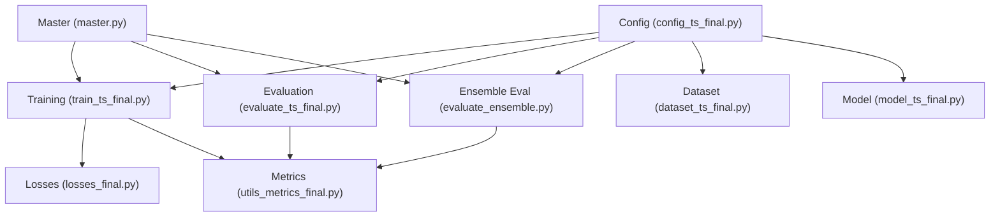
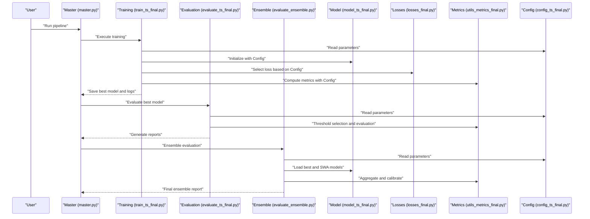
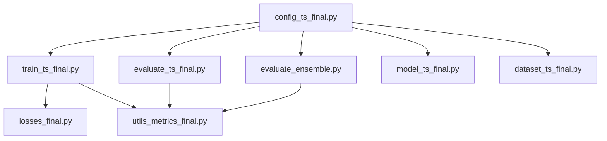

# Configuration Management

<cite>
**Referenced Files in This Document**
- [config_ts_final.py](file://config_ts_final.py)
- [train_ts_final.py](file://train_ts_final.py)
- [model_ts_final.py](file://model_ts_final.py)
- [dataset_ts_final.py](file://dataset_ts_final.py)
- [evaluate_ts_final.py](file://evaluate_ts_final.py)
- [evaluate_ensemble.py](file://evaluate_ensemble.py)
- [master.py](file://master.py)
- [losses_final.py](file://losses_final.py)
- [utils_metrics_final.py](file://utils_metrics_final.py)
</cite>

## Table of Contents
1. [Introduction](#introduction)
2. [Project Structure](#project-structure)
3. [Core Components](#core-components)
4. [Architecture Overview](#architecture-overview)
5. [Detailed Component Analysis](#detailed-component-analysis)
6. [Dependency Analysis](#dependency-analysis)
7. [Performance Considerations](#performance-considerations)
8. [Troubleshooting Guide](#troubleshooting-guide)
9. [Conclusion](#conclusion)
10. [Appendices](#appendices)

## Introduction
This document describes the centralized configuration management system used across the Nagpur TS Nowcasting pipeline. It explains the Config class architecture, parameter organization, and how runtime configuration updates propagate through training, evaluation, and inference stages. The system supports modular configuration for model variants, training modes, and evaluation settings, with explicit inheritance patterns, default value management, and environment-specific overrides. It also documents configuration-to-code mapping, validation strategies, parameter bounds considerations, and backward compatibility mechanisms.

## Project Structure
The configuration system is encapsulated in a single module that is imported and consumed by all major pipeline components. The following diagram shows how the central configuration module integrates with training, evaluation, and model components.



**Diagram sources**
- [config_ts_final.py:16-208](file://config_ts_final.py#L16-L208)
- [train_ts_final.py:41-41](file://train_ts_final.py#L41-L41)
- [evaluate_ts_final.py:34-34](file://evaluate_ts_final.py#L34-L34)
- [evaluate_ensemble.py:34-34](file://evaluate_ensemble.py#L34-L34)
- [model_ts_final.py:75-201](file://model_ts_final.py#L75-L201)
- [dataset_ts_final.py:47-92](file://dataset_ts_final.py#L47-L92)
- [losses_final.py:13-258](file://losses_final.py#L13-L258)
- [utils_metrics_final.py:192-314](file://utils_metrics_final.py#L192-L314)
- [master.py:39-108](file://master.py#L39-L108)

**Section sources**
- [config_ts_final.py:16-208](file://config_ts_final.py#L16-L208)
- [train_ts_final.py:41-41](file://train_ts_final.py#L41-L41)
- [evaluate_ts_final.py:34-34](file://evaluate_ts_final.py#L34-L34)
- [evaluate_ensemble.py:34-34](file://evaluate_ensemble.py#L34-L34)
- [model_ts_final.py:75-201](file://model_ts_final.py#L75-L201)
- [dataset_ts_final.py:47-92](file://dataset_ts_final.py#L47-L92)
- [losses_final.py:13-258](file://losses_final.py#L13-L258)
- [utils_metrics_final.py:192-314](file://utils_metrics_final.py#L192-L314)
- [master.py:39-108](file://master.py#L39-L108)

## Core Components
- Centralized Config class: Defines all hyperparameters, paths, and behavioral switches for the pipeline. It exposes a singleton instance for global access and provides a method to validate paths.
- Training pipeline: Consumes configuration for model construction, loss selection, augmentation, scheduling, and evaluation metrics.
- Evaluation pipeline: Uses configuration for threshold selection, persistence filtering, Platt scaling, and post-processing.
- Model: Reads configuration to adapt input channels, enable/disable auxiliary heads, and configure uncertainty estimation.
- Dataset: Applies configuration for channel stacking, masking, augmentation, and feature engineering.
- Losses and Metrics: Respect configuration flags to select among multiple loss formulations and evaluation strategies.

Key configuration categories:
- Paths and I/O
- Model architecture and regularization
- Training schedule and optimization
- Loss functions and uncertainty modeling
- Data augmentation and sampling
- Post-processing and evaluation thresholds
- Spatial masks and auxiliary features

**Section sources**
- [config_ts_final.py:16-208](file://config_ts_final.py#L16-L208)
- [train_ts_final.py:142-757](file://train_ts_final.py#L142-L757)
- [evaluate_ts_final.py:84-700](file://evaluate_ts_final.py#L84-L700)
- [evaluate_ensemble.py:84-200](file://evaluate_ensemble.py#L84-L200)
- [model_ts_final.py:68-335](file://model_ts_final.py#L68-L335)
- [dataset_ts_final.py:47-515](file://dataset_ts_final.py#L47-L515)
- [losses_final.py:13-258](file://losses_final.py#L13-L258)
- [utils_metrics_final.py:192-760](file://utils_metrics_final.py#L192-L760)

## Architecture Overview
The configuration system follows a centralized, immutable configuration pattern with runtime overrides and fallbacks. The Config class acts as a single source of truth, and downstream components access it via a shared instance. Components use getattr and hasattr checks to safely handle optional or environment-specific parameters.

```mermaid
classDiagram
class Config {
+DATA_DIR
+PRECOMPUTED_DIR
+METAR_FILE
+CCD_FILE
+MODEL_OUT
+LOG_DIR
+CACHE_DIR
+DEVICE
+SEED
+SEQ_LEN
+LEAD
+HIDDEN_DIM
+NUM_LAYERS
+DROPOUT
+FREEZE_BACKBONE_UNTIL
+USE_CHANNELS[]
+USE_OPTICAL_FLOW
+USE_METAR_FEATURES
+USE_MONTH
+USE_CCD
+USE_MASK
+MASK_CENTER
+MASK_SIGMA
+STATION_RADIUS_PX
+EPOCHS
+BATCH_SIZE
+LEARNING_RATE
+WEIGHT_DECAY
+PATIENCE
+USE_SWA
+SWA_START_EPOCH
+AUG_CHANNEL_DROPOUT
+AUG_NOISE_PROB
+AUG_GAUSSIAN_NOISE
+SEASONAL_BOOST{...}
+GAMMA
+ALPHA
+POS_WEIGHT_FACTOR
+LATE_PENALTY_WEIGHT
+LABEL_SMOOTHING
+USE_ASYMMETRIC_LOSS
+USE_EVIDENTIAL_LEARNING
+LAMBDA_TC
+USE_HETEROSCEDASTIC
+HETEROSCEDASTIC_WEIGHT
+USE_INTENSITY_REGRESSION
+LAMBDA_REGRESSION
+PRE_EVENT_WINDOW
+SMOOTH_WINDOW
+SMOOTH_METHOD
+PERSISTENCE_MIN_LEN
+MAX_LEAD_MINUTES
+THRESHOLD_METRIC
+MIN_THRESHOLD
+USE_SCHMITT_TRIGGER
+SEVERITY_WEIGHTS{...}
+METAR_FEATURE_WINDOWS[]
+METAR_WEIGHT
+SAMPLER_POS_RATE
+OHEM_RATIO
+USE_PLATT_SCALING
+USE_MC_DROPOUT
+MC_DROPOUT_SAMPLES
+MC_UNCERTAINTY_THRESHOLD
+SEVERE_FAST_TRACK
+USE_SAMPLE
+TRAIN_SAMPLE_IDX
+VAL_SAMPLE_IDX
+TRAIN_END
+VAL_END
+get_paths()
+classify_ts_severity(...)
}
class TrainingPipeline {
+main()
+set_seed(seed)
+WarmupCosineScheduler
+custom_update_bn(loader, model, device)
}
class EvaluationPipeline {
+main()
+find_best_threshold(...)
+find_best_dual_threshold(...)
+apply_persistence(...)
+temporal_smooth_probs(...)
}
class Model {
+CNN_GRU_TS(config)
+forward(...)
+predict_with_uncertainty(...)
}
class Dataset {
+IRSequenceDataset(...)
+UpgradedTSDataset(...)
}
class Losses {
+FocalLossWithLatePenalty
+AsymmetricTimeAwareLoss
+EvidentialBinaryLoss
+TemporalConsistencyLoss
+HeteroscedasticLoss
+IntensityRegressionLoss
}
class Metrics {
+compute_binary_metrics(...)
+compute_event_metrics(...)
+compute_weighted_event_metrics(...)
+compute_lead_times(...)
+summarize_lead_times(...)
}
Config --> TrainingPipeline : "consumed by"
Config --> EvaluationPipeline : "consumed by"
Config --> Model : "consumed by"
Config --> Dataset : "consumed by"
TrainingPipeline --> Losses : "selects"
TrainingPipeline --> Metrics : "computes"
EvaluationPipeline --> Metrics : "computes"
Model --> Config : "reads"
Dataset --> Config : "reads"
```

**Diagram sources**
- [config_ts_final.py:16-208](file://config_ts_final.py#L16-L208)
- [train_ts_final.py:142-757](file://train_ts_final.py#L142-L757)
- [evaluate_ts_final.py:84-700](file://evaluate_ts_final.py#L84-L700)
- [model_ts_final.py:68-335](file://model_ts_final.py#L68-L335)
- [dataset_ts_final.py:47-515](file://dataset_ts_final.py#L47-L515)
- [losses_final.py:13-258](file://losses_final.py#L13-L258)
- [utils_metrics_final.py:192-760](file://utils_metrics_final.py#L192-L760)

## Detailed Component Analysis

### Config Class Architecture
- Centralized storage of all pipeline parameters.
- Provides a singleton instance for global access.
- Includes a method to validate and return path configurations.
- Supports environment-specific device selection and optional dependencies.

Runtime configuration updates:
- Parameters are read via getattr and hasattr checks to support optional or environment-dependent values.
- Default values are provided inline for optional keys to avoid KeyError exceptions.

Configuration inheritance patterns:
- Downstream components inherit behavior from the central Config instance without duplicating defaults.
- Optional keys are handled gracefully with fallbacks.

Environment-specific overrides:
- Device selection adapts to CUDA availability.
- Optional features (e.g., optical flow, METAR) are toggled via flags.

**Section sources**
- [config_ts_final.py:16-208](file://config_ts_final.py#L16-L208)

### Training Pipeline Integration
- Imports the shared configuration instance and seeds the RNG.
- Uses configuration for model initialization, loss selection, optimizer, scheduler, and SWA.
- Applies configuration-driven augmentation and sampling strategies.
- Computes metrics and saves checkpoints with configuration-dependent naming.

Key flows:
- Model construction respects USE_CHANNELS, HIDDEN_DIM, NUM_LAYERS, DROPOUT, and FREEZE_BACKBONE_UNTIL.
- Loss selection depends on USE_EVIDENTIAL_LEARNING, USE_ASYMMETRIC_LOSS, and LABEL_SMOOTHING.
- Evaluation metrics incorporate SEVERITY_WEIGHTS, THRESHOLD_METRIC, and PERSISTENCE_MIN_LEN.

**Section sources**
- [train_ts_final.py:142-757](file://train_ts_final.py#L142-L757)

### Evaluation Pipeline Integration
- Loads validation and test datasets with configuration-driven splits.
- Derives thresholds from validation data using configuration flags for Schmitt trigger and persistence.
- Applies Platt scaling when applicable and computes weighted event metrics with lead-time bonuses.

Key flows:
- Threshold search uses configuration for metric selection and persistence filtering.
- Metrics computation respects configuration for smoothing, persistence, and severity weighting.

**Section sources**
- [evaluate_ts_final.py:84-700](file://evaluate_ts_final.py#L84-L700)

### Model Integration
- Adapts input channels dynamically based on USE_CHANNELS.
- Enables/disables auxiliary heads (uncertainty, intensity) according to configuration.
- Supports uncertainty estimation via evidential learning or Monte Carlo dropout.

Key flows:
- Channel adaptation ensures the CNN backbone accepts the configured number of input channels.
- Auxiliary heads are conditionally included based on configuration flags.

**Section sources**
- [model_ts_final.py:68-335](file://model_ts_final.py#L68-L335)

### Dataset Integration
- Stacks channels dynamically based on USE_CHANNELS.
- Applies configuration-driven augmentation during training.
- Uses configuration for masking, spatial features, and feature normalization.

Key flows:
- Channel stacking concatenates tensors for the configured channels.
- Augmentation includes flip, temporal masking, channel dropout, and Gaussian noise.

**Section sources**
- [dataset_ts_final.py:47-515](file://dataset_ts_final.py#L47-L515)

### Loss Functions and Metrics
- Losses respect configuration flags for asymmetric weighting, label smoothing, and uncertainty modeling.
- Metrics rely on configuration for threshold selection, smoothing, and persistence filtering.

Key flows:
- Focal loss incorporates late penalty and severity weighting.
- Metrics support dual-threshold Schmitt trigger and weighted event scoring.

**Section sources**
- [losses_final.py:13-258](file://losses_final.py#L13-L258)
- [utils_metrics_final.py:192-760](file://utils_metrics_final.py#L192-L760)

### Configuration-to-Code Mapping
The following sequence diagram illustrates how configuration influences training and evaluation:



**Diagram sources**
- [master.py:39-108](file://master.py#L39-L108)
- [train_ts_final.py:142-757](file://train_ts_final.py#L142-L757)
- [evaluate_ts_final.py:84-700](file://evaluate_ts_final.py#L84-L700)
- [evaluate_ensemble.py:84-200](file://evaluate_ensemble.py#L84-L200)
- [model_ts_final.py:68-335](file://model_ts_final.py#L68-L335)
- [losses_final.py:13-258](file://losses_final.py#L13-L258)
- [utils_metrics_final.py:192-760](file://utils_metrics_final.py#L192-L760)
- [config_ts_final.py:16-208](file://config_ts_final.py#L16-L208)

## Dependency Analysis
The configuration module is a central dependency across training, evaluation, and model components. The following diagram highlights key dependencies:



**Diagram sources**
- [config_ts_final.py:16-208](file://config_ts_final.py#L16-L208)
- [train_ts_final.py:41-41](file://train_ts_final.py#L41-L41)
- [evaluate_ts_final.py:34-34](file://evaluate_ts_final.py#L34-L34)
- [evaluate_ensemble.py:34-34](file://evaluate_ensemble.py#L34-L34)
- [model_ts_final.py:75-201](file://model_ts_final.py#L75-L201)
- [dataset_ts_final.py:47-92](file://dataset_ts_final.py#L47-L92)
- [losses_final.py:13-258](file://losses_final.py#L13-L258)
- [utils_metrics_final.py:192-314](file://utils_metrics_final.py#L192-L314)

**Section sources**
- [config_ts_final.py:16-208](file://config_ts_final.py#L16-L208)
- [train_ts_final.py:41-41](file://train_ts_final.py#L41-L41)
- [evaluate_ts_final.py:34-34](file://evaluate_ts_final.py#L34-L34)
- [evaluate_ensemble.py:34-34](file://evaluate_ensemble.py#L34-L34)
- [model_ts_final.py:75-201](file://model_ts_final.py#L75-L201)
- [dataset_ts_final.py:47-92](file://dataset_ts_final.py#L47-L92)
- [losses_final.py:13-258](file://losses_final.py#L13-L258)
- [utils_metrics_final.py:192-314](file://utils_metrics_final.py#L192-L314)

## Performance Considerations
- Device selection adapts to CUDA availability to balance speed and portability.
- Channel dropout and augmentation introduce minimal overhead while improving generalization.
- SWA and early stopping improve generalization without significantly increasing training time.
- Temporal smoothing and persistence filtering reduce false alarms with manageable computational cost.

[No sources needed since this section provides general guidance]

## Troubleshooting Guide
Common configuration issues and resolutions:
- Missing optional keys: Use getattr with defaults to avoid KeyError exceptions.
- Device mismatch: Verify CUDA availability and adjust configuration accordingly.
- Channel mismatch: Ensure USE_CHANNELS aligns with the number of channels produced by preprocessing.
- Metric drift: Validate threshold selection and persistence parameters for the target deployment environment.

**Section sources**
- [train_ts_final.py:142-757](file://train_ts_final.py#L142-L757)
- [evaluate_ts_final.py:84-700](file://evaluate_ts_final.py#L84-L700)
- [evaluate_ensemble.py:84-200](file://evaluate_ensemble.py#L84-L200)
- [model_ts_final.py:68-335](file://model_ts_final.py#L68-L335)
- [dataset_ts_final.py:47-515](file://dataset_ts_final.py#L47-L515)

## Conclusion
The centralized configuration management system provides a robust, modular foundation for the Nagpur TS Nowcasting pipeline. By consolidating all parameters in a single Config class and using safe access patterns, the system enables flexible experimentation, reliable deployment, and consistent evaluation across training, validation, and inference stages. The design supports environment-specific overrides, optional features, and backward compatibility while maintaining clear separation of concerns.

[No sources needed since this section summarizes without analyzing specific files]

## Appendices

### Configuration Scenarios and Examples
- Deployment environments:
  - CPU-only: Set DEVICE to CPU and reduce batch sizes for memory constraints.
  - GPU-enabled: Ensure CUDA availability and leverage larger batch sizes and SWA.
- Model optimization settings:
  - Reduce HIDDEN_DIM and NUM_LAYERS for faster inference; increase DROPOUT for regularization.
  - Adjust FREEZE_BACKBONE_UNTIL to balance fine-tuning and overfitting.
- Experimental parameter variations:
  - Toggle USE_EVIDENTIAL_LEARNING to switch between probabilistic and deterministic uncertainty.
  - Enable USE_SCHMITT_TRIGGER for hysteresis-based triggering; tune thresholds via validation.
  - Modify SEASONAL_BOOST to emphasize specific periods during training.

[No sources needed since this section provides general guidance]

### Configuration Validation and Bounds Checking
- Path validation: Use the provided method to verify I/O paths before training or evaluation.
- Parameter bounds: Ensure thresholds, ratios, and weights fall within expected ranges; use getattr with defaults to avoid invalid values.
- Backward compatibility: Maintain optional keys with sensible defaults; deprecate flags gradually.

[No sources needed since this section provides general guidance]