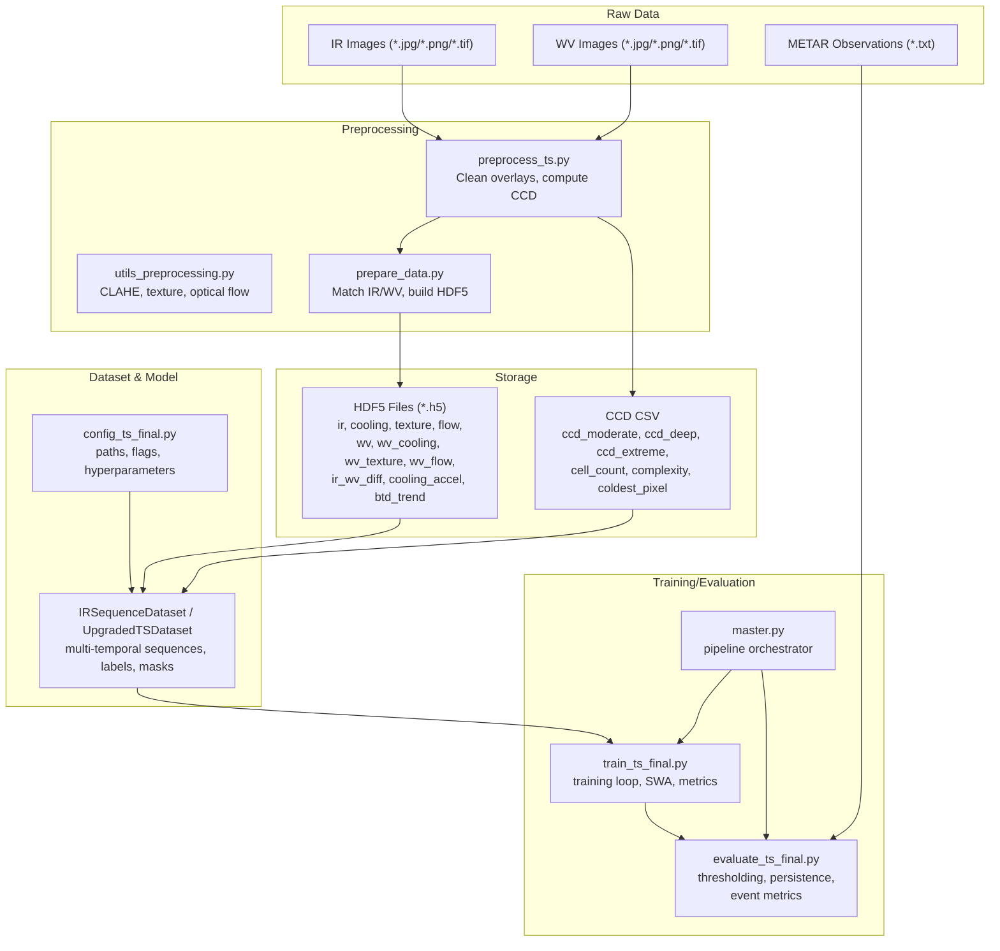
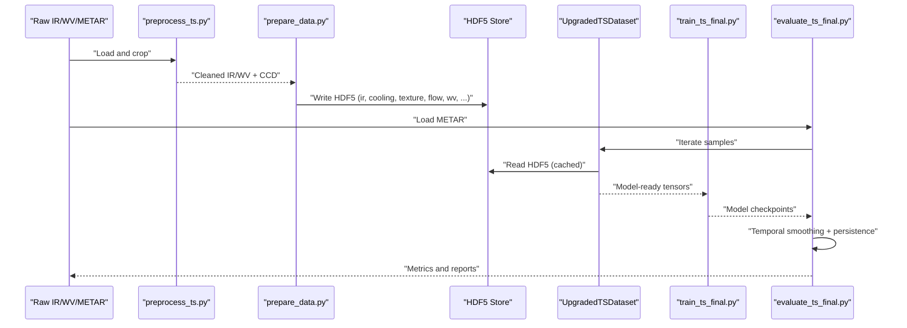
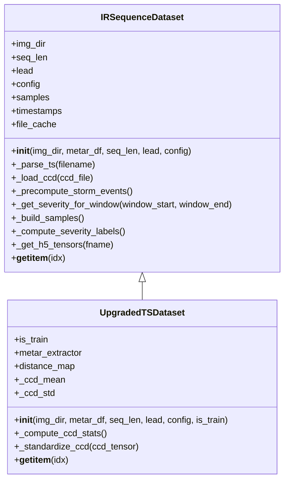
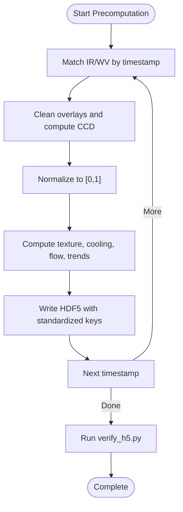
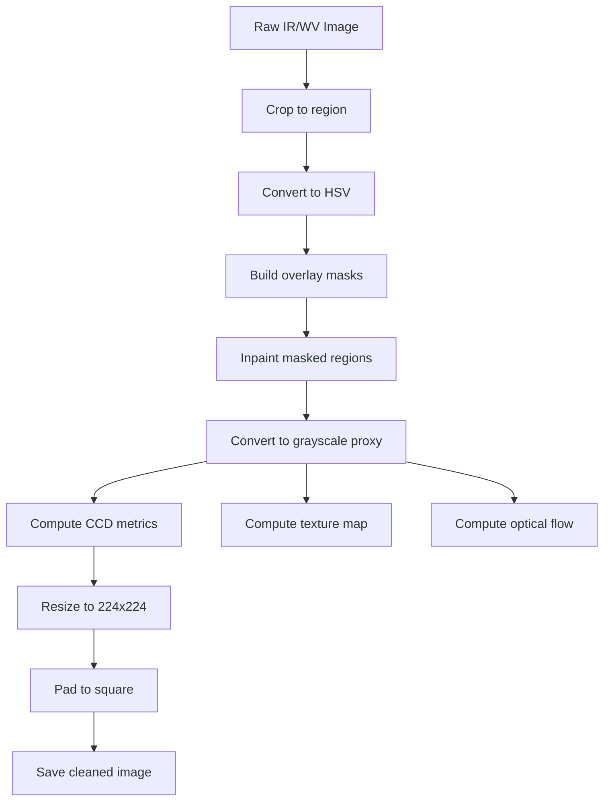
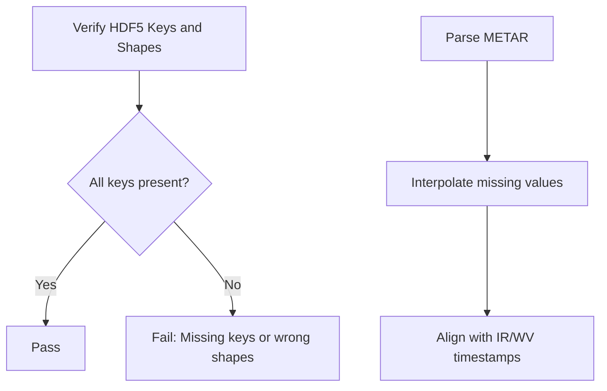
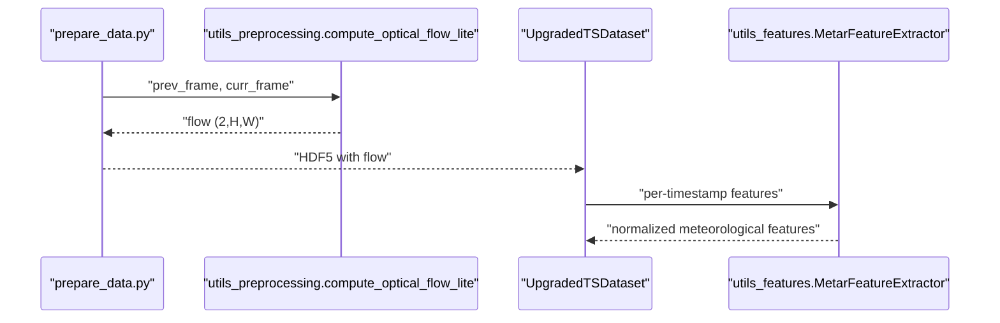
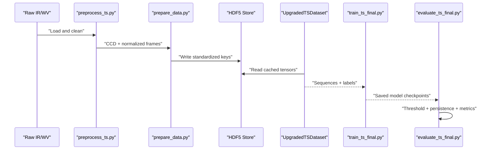
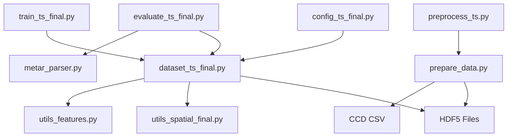

# Data Pipeline Design

<cite>
**Referenced Files in This Document**
- [dataset_ts_final.py](file://dataset_ts_final.py)
- [prepare_data.py](file://prepare_data.py)
- [preprocess_ts.py](file://preprocess_ts.py)
- [utils_preprocessing.py](file://utils_preprocessing.py)
- [utils_features.py](file://utils_features.py)
- [utils_spatial_final.py](file://utils_spatial_final.py)
- [config_ts_final.py](file://config_ts_final.py)
- [verify_h5.py](file://verify_h5.py)
- [master.py](file://master.py)
- [train_ts_final.py](file://train_ts_final.py)
- [evaluate_ts_final.py](file://evaluate_ts_final.py)
- [metar_parser.py](file://metar_parser.py)
- [utils_metrics_final.py](file://utils_metrics_final.py)
</cite>

## Table of Contents
1. [Introduction](#introduction)
2. [Project Structure](#project-structure)
3. [Core Components](#core-components)
4. [Architecture Overview](#architecture-overview)
5. [Detailed Component Analysis](#detailed-component-analysis)
6. [Dependency Analysis](#dependency-analysis)
7. [Performance Considerations](#performance-considerations)
8. [Troubleshooting Guide](#troubleshooting-guide)
9. [Conclusion](#conclusion)
10. [Appendices](#appendices)

## Introduction
This document describes the end-to-end data processing pipeline for multi-temporal satellite nowcasting. It explains how raw infrared (IR) and water vapor (WV) imagery is transformed into HDF5-based datasets, how preprocessing and feature engineering are performed, and how the resulting tensors feed into training and evaluation workflows. It also documents validation systems, quality control, and integrity checks, along with memory optimization and parallel loading strategies.

## Project Structure
The pipeline is organized around a dataset class that reads precomputed HDF5 files, a preprocessing stage that builds HDF5 features from raw images, and orchestration scripts that drive training and evaluation.

**Diagram sources**
- [prepare_data.py:39-132](file://prepare_data.py#L39-L132)
- [preprocess_ts.py:27-112](file://preprocess_ts.py#L27-L112)
- [utils_preprocessing.py:136-162](file://utils_preprocessing.py#L136-L162)
- [dataset_ts_final.py:47-333](file://dataset_ts_final.py#L47-L333)
- [config_ts_final.py:16-208](file://config_ts_final.py#L16-L208)
- [master.py:39-105](file://master.py#L39-L105)
- [train_ts_final.py:142-200](file://train_ts_final.py#L142-L200)
- [evaluate_ts_final.py:1-200](file://evaluate_ts_final.py#L1-200)

**Section sources**
- [prepare_data.py:39-132](file://prepare_data.py#L39-L132)
- [dataset_ts_final.py:47-333](file://dataset_ts_final.py#L47-L333)
- [config_ts_final.py:16-208](file://config_ts_final.py#L16-L208)
- [master.py:39-105](file://master.py#L39-L105)

## Core Components
- IRSequenceDataset and UpgradedTSDataset: construct multi-temporal sequences from HDF5, assemble labels, integrate CCD and meteorological features, and apply spatial masks and optional dynamic upwind masking.
- Precomputation pipeline: align IR and WV imagery, clean overlays, compute CCD, compute optical flow and derived features, and write HDF5 files.
- Configuration: centralizes paths, flags, and hyperparameters for the entire pipeline.
- Training and evaluation: orchestrate data loading, model training with SWA, and post-processing thresholds and persistence filtering.

**Section sources**
- [dataset_ts_final.py:47-515](file://dataset_ts_final.py#L47-L515)
- [prepare_data.py:39-132](file://prepare_data.py#L39-L132)
- [config_ts_final.py:16-208](file://config_ts_final.py#L16-L208)
- [train_ts_final.py:142-200](file://train_ts_final.py#L142-L200)
- [evaluate_ts_final.py:1-200](file://evaluate_ts_final.py#L1-200)

## Architecture Overview
The pipeline follows a staged architecture:
- Raw data ingestion: IR and WV images plus METAR observations.
- Feature precomputation: produce cleaned frames, CCD features, and optical flow-derived quantities.
- Storage: persist multi-temporal features in HDF5 with fixed shapes and keys.
- Dataset assembly: read HDF5, label sequences, and compose model-ready tensors.
- Training and evaluation: apply temporal smoothing, persistence filtering, and severity-aware scoring.

**Diagram sources**
- [preprocess_ts.py:27-112](file://preprocess_ts.py#L27-L112)
- [prepare_data.py:39-132](file://prepare_data.py#L39-L132)
- [dataset_ts_final.py:268-333](file://dataset_ts_final.py#L268-L333)
- [train_ts_final.py:142-200](file://train_ts_final.py#L142-L200)
- [evaluate_ts_final.py:1-200](file://evaluate_ts_final.py#L1-200)

## Detailed Component Analysis

### IRSequenceDataset Implementation for Multi-Temporal Sequences
- Multi-temporal construction: scans sorted HDF5 filenames, ensures ≤ 45-minute gaps, builds sequences of length seq_len, and defines a lead-time target window for classification.
- Labeling: identifies TS events within a window around the lead time and assigns severity labels via a storm clustering routine.
- HDF5 access: caches up to a configured maximum number of files in memory to avoid repeated disk I/O; reads standardized keys and fills missing keys with zeros.
- Spatial masking: applies a Gaussian mask centered on Nagpur; supports dynamic upwind masking driven by optical flow.
- Meteorological features: integrates CCD features (cold cloud density and related metrics) and optional METAR-derived features; time features include month and solar zenith angle.

**Diagram sources**
- [dataset_ts_final.py:47-515](file://dataset_ts_final.py#L47-L515)

**Section sources**
- [dataset_ts_final.py:47-333](file://dataset_ts_final.py#L47-L333)
- [dataset_ts_final.py:337-515](file://dataset_ts_final.py#L337-L515)

### HDF5 Storage Management
- Keys and shapes: each HDF5 file contains standardized keys with fixed shapes (e.g., (224, 224) or (2, 224, 224)), including IR and WV channels, cooling rates, textures, optical flow vectors, IR–WV differences, acceleration of cooling, and trend of brightness temperature difference.
- Compression: uses LZF compression to reduce disk footprint.
- Integrity verification: a dedicated script validates presence and shapes of expected keys.

**Diagram sources**
- [prepare_data.py:39-132](file://prepare_data.py#L39-L132)
- [verify_h5.py:5-58](file://verify_h5.py#L5-L58)

**Section sources**
- [prepare_data.py:39-132](file://prepare_data.py#L39-L132)
- [verify_h5.py:5-58](file://verify_h5.py#L5-L58)

### Preprocessing Workflows for Multi-Spectral Imagery
- Overlay cleaning: cleans labels, grids, cyan annotations, and other artifacts using HSV masks and inpainting.
- CCD extraction: computes fractions of extremely cold pixels, counts connected cells, and estimates texture complexity.
- Resizing and padding: resizes to 224×224 with padding to maintain aspect ratio.
- Optical flow: computes dense optical flow using a lightweight variant of Farneback; flow is stored as a (2, H, W) tensor.

**Diagram sources**
- [preprocess_ts.py:27-112](file://preprocess_ts.py#L27-L112)
- [utils_preprocessing.py:136-162](file://utils_preprocessing.py#L136-L162)

**Section sources**
- [preprocess_ts.py:27-112](file://preprocess_ts.py#L27-L112)
- [utils_preprocessing.py:136-162](file://utils_preprocessing.py#L136-L162)

### Data Validation, Quality Control, and Integrity Verification
- HDF5 structure verification: confirms all expected keys and shapes are present.
- METAR parsing: extracts and interpolates weather parameters; handles missing values and formats.
- Dataset-level checks: labels are soft pre-event ramps; storm clustering aggregates TS events into severity windows; optional regression intensity labels.

**Diagram sources**
- [verify_h5.py:5-58](file://verify_h5.py#L5-L58)
- [metar_parser.py:141-186](file://metar_parser.py#L141-L186)

**Section sources**
- [verify_h5.py:5-58](file://verify_h5.py#L5-L58)
- [metar_parser.py:141-186](file://metar_parser.py#L141-L186)

### Feature Engineering Pipeline
- Optical flow computation: dense flow using Farneback; stored as 2-channel displacement maps.
- Cold cloud density (CCD): fractions of pixels above thresholds, connected component count, and texture variance.
- Meteorological features: pressure drops, wind trends, dewpoint metrics, cloud coverage, and risk index; integrated as per-timestamp sequences.
- Time features: month sine/cosine and normalized solar zenith angle.

**Diagram sources**
- [prepare_data.py:39-132](file://prepare_data.py#L39-L132)
- [utils_preprocessing.py:136-162](file://utils_preprocessing.py#L136-L162)
- [utils_features.py:11-171](file://utils_features.py#L11-L171)
- [dataset_ts_final.py:374-515](file://dataset_ts_final.py#L374-L515)

**Section sources**
- [utils_preprocessing.py:136-162](file://utils_preprocessing.py#L136-L162)
- [utils_features.py:11-171](file://utils_features.py#L11-L171)
- [dataset_ts_final.py:374-515](file://dataset_ts_final.py#L374-L515)

### Data Flow Through the Pipeline
- Raw IR/WV images are cleaned and CCD features are extracted.
- HDF5 files are written with standardized keys and shapes.
- The dataset reads HDF5 entries, constructs sequences, and returns tensors ready for training or evaluation.
- Training applies SWA and temporal smoothing; evaluation applies persistence filtering and severity-weighted metrics.

**Diagram sources**
- [preprocess_ts.py:27-112](file://preprocess_ts.py#L27-L112)
- [prepare_data.py:39-132](file://prepare_data.py#L39-L132)
- [dataset_ts_final.py:268-333](file://dataset_ts_final.py#L268-L333)
- [train_ts_final.py:142-200](file://train_ts_final.py#L142-L200)
- [evaluate_ts_final.py:1-200](file://evaluate_ts_final.py#L1-200)

## Dependency Analysis
- Dataset depends on HDF5 storage, spatial utilities, and feature extractors.
- Preprocessing depends on OpenCV and NumPy; optical flow relies on OpenCV.
- Training and evaluation depend on the dataset and configuration.

**Diagram sources**
- [config_ts_final.py:16-208](file://config_ts_final.py#L16-L208)
- [dataset_ts_final.py:47-515](file://dataset_ts_final.py#L47-L515)
- [preprocess_ts.py:27-112](file://preprocess_ts.py#L27-L112)
- [prepare_data.py:39-132](file://prepare_data.py#L39-L132)
- [utils_spatial_final.py:12-80](file://utils_spatial_final.py#L12-L80)
- [utils_features.py:11-171](file://utils_features.py#L11-L171)
- [train_ts_final.py:142-200](file://train_ts_final.py#L142-L200)
- [evaluate_ts_final.py:1-200](file://evaluate_ts_final.py#L1-200)
- [metar_parser.py:141-186](file://metar_parser.py#L141-L186)

**Section sources**
- [dataset_ts_final.py:47-515](file://dataset_ts_final.py#L47-L515)
- [prepare_data.py:39-132](file://prepare_data.py#L39-L132)
- [train_ts_final.py:142-200](file://train_ts_final.py#L142-L200)
- [evaluate_ts_final.py:1-200](file://evaluate_ts_final.py#L1-200)

## Performance Considerations
- Memory optimization:
  - Dataset file cache: maintains a bounded number of HDF5 files in memory to reduce I/O latency.
  - Dynamic channel stacking: only requested channels are concatenated, minimizing tensor size.
  - Optional optical flow: disabled by default to save compute; when enabled, flow tensors are concatenated carefully.
- Batch processing patterns:
  - DataLoader uses a small worker count and modest batch size to balance throughput and memory.
  - Weighted sampling targets a desired positive rate to address class imbalance.
- Parallel data loading:
  - HDF5 reading is parallelized implicitly by the filesystem; caching reduces contention.
  - Optical flow is recomputed per pair and optionally cached externally (see cache directory in config).

[No sources needed since this section provides general guidance]

## Troubleshooting Guide
- HDF5 structure mismatches: run the verification script to confirm keys and shapes.
- Missing or misaligned timestamps: ensure IR and WV files share timestamps within 45 minutes; the dataset builder skips gaps larger than this threshold.
- METAR interpolation issues: the parser forwards fills missing values up to a limit; verify that gaps are not too long.
- Dynamic upwind mask anomalies: check that optical flow is available and that the upwind scaling factor is reasonable.
- Post-processing artifacts: adjust smoothing window, persistence minimum length, and Schmitt trigger settings.

**Section sources**
- [verify_h5.py:5-58](file://verify_h5.py#L5-L58)
- [dataset_ts_final.py:238-261](file://dataset_ts_final.py#L238-L261)
- [metar_parser.py:141-186](file://metar_parser.py#L141-L186)
- [config_ts_final.py:106-131](file://config_ts_final.py#L106-L131)
- [utils_metrics_final.py:23-77](file://utils_metrics_final.py#L23-L77)

## Conclusion
The pipeline integrates robust preprocessing, standardized HDF5 storage, and a flexible dataset interface to support multi-spectral nowcasting. It incorporates meteorological and CCD features, spatial attention, and dynamic masking, while maintaining strong validation and integrity checks. The design emphasizes memory efficiency, modularity, and reproducibility across training and evaluation.

[No sources needed since this section summarizes without analyzing specific files]

## Appendices

### Data Validation Protocols
- HDF5 verification: confirm all expected keys and shapes.
- METAR parsing: ensure timestamps align and interpolated values are sensible.
- Dataset labeling: review soft pre-event ramp and storm clustering behavior.

**Section sources**
- [verify_h5.py:5-58](file://verify_h5.py#L5-L58)
- [metar_parser.py:141-186](file://metar_parser.py#L141-L186)
- [dataset_ts_final.py:238-261](file://dataset_ts_final.py#L238-L261)

### Error Handling Mechanisms
- Graceful fallbacks: missing keys in HDF5 are filled with zeros; missing CCD entries yield zero vectors; missing METAR records are filled with defaults.
- Robust timestamp parsing: supports multiple filename patterns and tolerates malformed entries.
- Safe tensor creation: ensures 2D arrays are expanded to 3D when needed.

**Section sources**
- [dataset_ts_final.py:268-303](file://dataset_ts_final.py#L268-L303)
- [dataset_ts_final.py:93-102](file://dataset_ts_final.py#L93-L102)
- [preprocess_ts.py:83-88](file://preprocess_ts.py#L83-L88)

### Data Consistency Checks Throughout the Pipeline
- Temporal alignment: IR/WV cadence and METAR alignment introduce up to ±15 minutes jitter; this is handled by nearest-neighbor matching.
- Spatial alignment: METAR is a point observation while imagery covers a regional field; consider this when interpreting event proximity.
- Normalization: IR/WV normalization uses standardization; CCD features are optionally standardized per dataset statistics.

**Section sources**
- [dataset_ts_final.py:250-258](file://dataset_ts_final.py#L250-L258)
- [utils_metrics_final.py:23-77](file://utils_metrics_final.py#L23-L77)