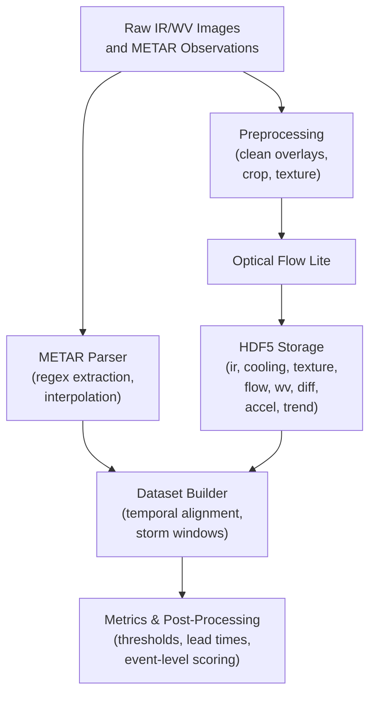
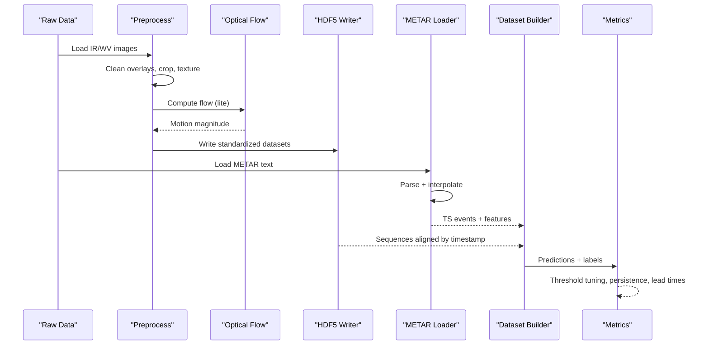
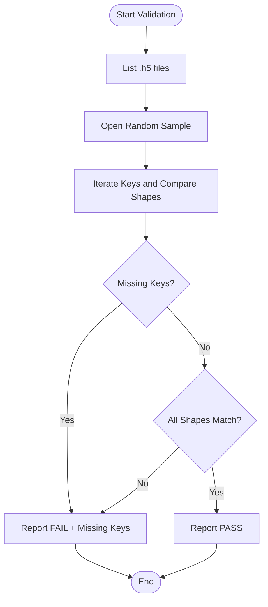
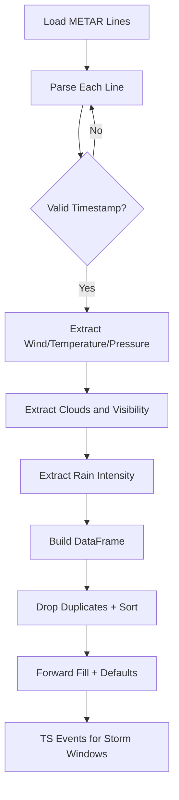
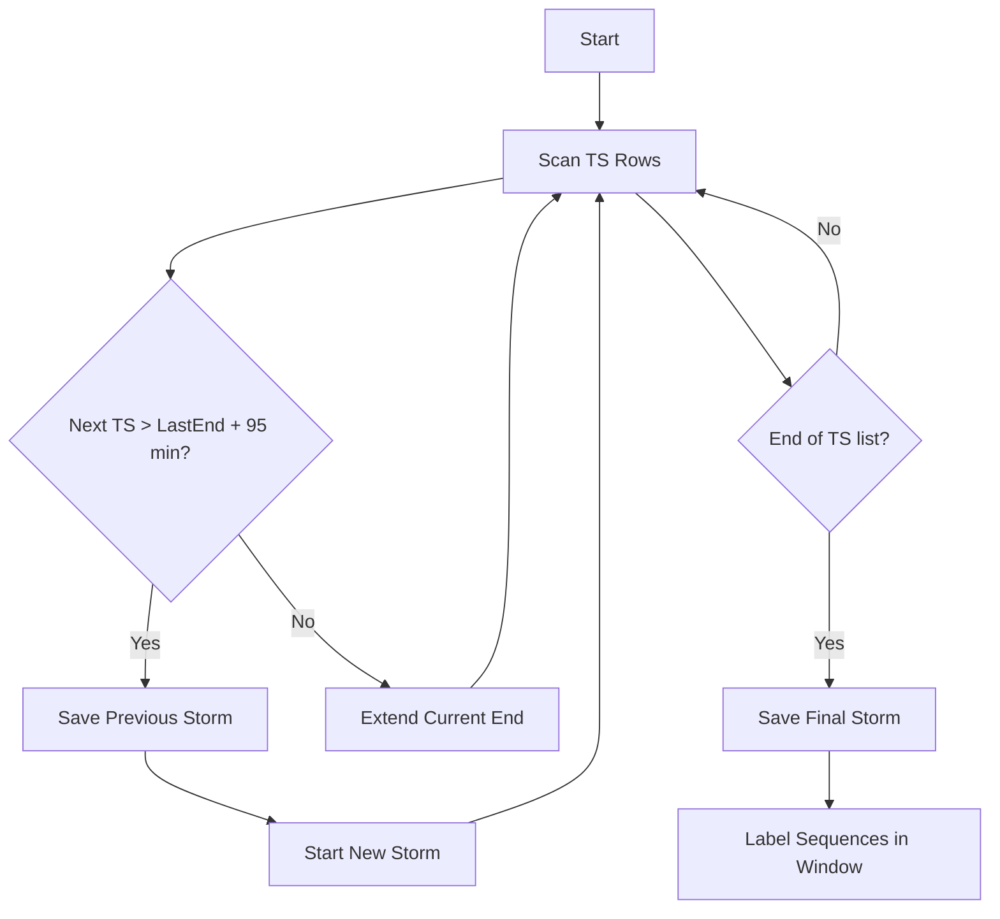
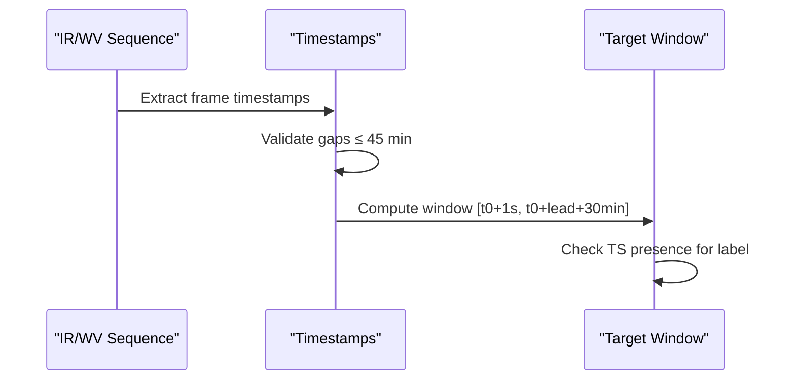
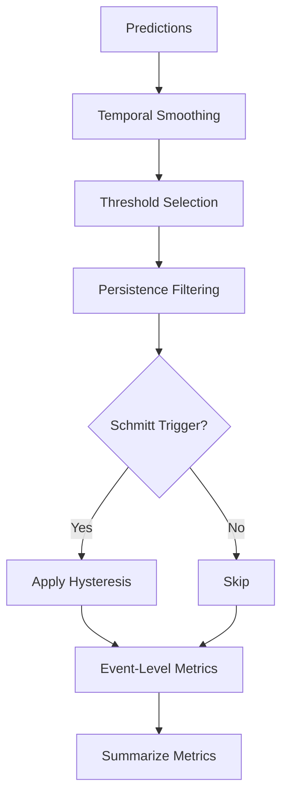
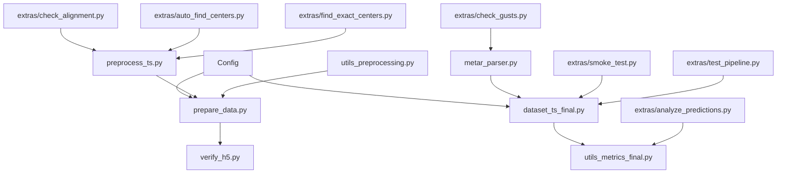

# Data Validation & Quality Control

<cite>
**Referenced Files in This Document**
- [prepare_data.py](file://prepare_data.py)
- [preprocess_ts.py](file://preprocess_ts.py)
- [verify_h5.py](file://verify_h5.py)
- [utils_preprocessing.py](file://utils_preprocessing.py)
- [metar_parser.py](file://metar_parser.py)
- [dataset_ts_final.py](file://dataset_ts_final.py)
- [config_ts_final.py](file://config_ts_final.py)
- [utils_metrics_final.py](file://utils_metrics_final.py)
- [extras/check_alignment.py](file://extras/check_alignment.py)
- [extras/check_gusts.py](file://extras/check_gusts.py)
- [extras/smoke_test.py](file://extras/smoke_test.py)
- [extras/test_pipeline.py](file://extras/test_pipeline.py)
- [extras/auto_find_centers.py](file://extras/auto_find_centers.py)
- [extras/find_exact_centers.py](file://extras/find_exact_centers.py)
- [extras/analyze_predictions.py](file://extras/analyze_predictions.py)
</cite>

## Table of Contents
1. [Introduction](#introduction)
2. [Project Structure](#project-structure)
3. [Core Components](#core-components)
4. [Architecture Overview](#architecture-overview)
5. [Detailed Component Analysis](#detailed-component-analysis)
6. [Dependency Analysis](#dependency-analysis)
7. [Performance Considerations](#performance-considerations)
8. [Troubleshooting Guide](#troubleshooting-guide)
9. [Conclusion](#conclusion)
10. [Appendices](#appendices)

## Introduction
This document describes the comprehensive data validation and quality control systems implemented in the TS forecasting pipeline. It explains storm event detection and validation logic, METAR data consistency checks, temporal alignment verification, HDF5 structure validation, missing data handling, and data integrity verification. It also documents quality metrics calculation, outlier detection mechanisms, automated testing procedures, data cleaning workflows, and error reporting systems. Finally, it covers integration of external validation sources, cross-dataset consistency checks, and automated quality assurance pipelines.

## Project Structure
The validation and QA system spans preprocessing, parsing, dataset construction, and evaluation utilities:
- Preprocessing and feature extraction: image cleaning, cropping, texture computation, optical flow, and HDF5 emission.
- METAR parsing and interpolation for temporal consistency.
- Dataset assembly with storm event precomputation and temporal alignment.
- Validation utilities for HDF5 structure, alignment, and smoke tests.
- Metrics and post-processing for quality assessment and threshold optimization.

**Diagram sources**
- [prepare_data.py:39-132](file://prepare_data.py#L39-L132)
- [preprocess_ts.py:27-117](file://preprocess_ts.py#L27-L117)
- [utils_preprocessing.py:136-162](file://utils_preprocessing.py#L136-L162)
- [metar_parser.py:141-186](file://metar_parser.py#L141-L186)
- [dataset_ts_final.py:47-334](file://dataset_ts_final.py#L47-L334)
- [utils_metrics_final.py:23-47](file://utils_metrics_final.py#L23-L47)

**Section sources**
- [prepare_data.py:39-132](file://prepare_data.py#L39-L132)
- [preprocess_ts.py:27-117](file://preprocess_ts.py#L27-L117)
- [utils_preprocessing.py:136-162](file://utils_preprocessing.py#L136-L162)
- [metar_parser.py:141-186](file://metar_parser.py#L141-L186)
- [dataset_ts_final.py:47-334](file://dataset_ts_final.py#L47-L334)
- [utils_metrics_final.py:23-47](file://utils_metrics_final.py#L23-L47)

## Core Components
- HDF5 emission and structure validation: emission of standardized datasets with fixed shapes and keys; verification script ensures structural integrity.
- METAR parsing and interpolation: robust extraction of wind, pressure, cloud, visibility, and precipitation indicators with forward-fill and default imputation.
- Storm event detection and temporal alignment: detection of TS events from METAR, aggregation into storm windows, and alignment with IR/WV sequences.
- Outlier handling and normalization: percentile-based clipping and normalization to mitigate extreme values.
- Automated testing and smoke tests: quick validation of parser, dataset, and model integration.
- Metrics and post-processing: temporal smoothing, persistence filtering, Schmitt trigger hysteresis, and event-level scoring.

**Section sources**
- [prepare_data.py:103-118](file://prepare_data.py#L103-L118)
- [verify_h5.py:16-55](file://verify_h5.py#L16-L55)
- [metar_parser.py:141-186](file://metar_parser.py#L141-L186)
- [dataset_ts_final.py:137-209](file://dataset_ts_final.py#L137-L209)
- [utils_preprocessing.py:65-83](file://utils_preprocessing.py#L65-L83)
- [extras/smoke_test.py:1-27](file://extras/smoke_test.py#L1-L27)
- [utils_metrics_final.py:23-47](file://utils_metrics_final.py#L23-L47)

## Architecture Overview
The validation pipeline integrates ingestion, preprocessing, storage, alignment, and evaluation:

**Diagram sources**
- [prepare_data.py:64-125](file://prepare_data.py#L64-L125)
- [utils_preprocessing.py:136-162](file://utils_preprocessing.py#L136-L162)
- [metar_parser.py:141-186](file://metar_parser.py#L141-L186)
- [dataset_ts_final.py:238-261](file://dataset_ts_final.py#L238-L261)
- [utils_metrics_final.py:120-153](file://utils_metrics_final.py#L120-L153)

## Detailed Component Analysis

### HDF5 Structure Validation and Integrity
- Emission: The precomputation loop writes standardized datasets with fixed keys and shapes to HDF5 files.
- Verification: A dedicated script checks presence and exact shapes of expected keys and reports mismatches.

**Diagram sources**
- [verify_h5.py:5-55](file://verify_h5.py#L5-L55)

**Section sources**
- [prepare_data.py:103-118](file://prepare_data.py#L103-L118)
- [verify_h5.py:16-55](file://verify_h5.py#L16-L55)

### METAR Data Consistency Checks and Temporal Alignment
- Parsing: Regex-based extraction of TS presence, wind, temperature/dewpoint, QNH, cloud coverage/types, visibility, and precipitation intensity.
- Interpolation: Forward-fill with limits and default imputation to maintain smoothness and avoid leakage.
- Alignment: Storm windows derived from METAR TS events are used to label sequences and compute severity.

**Diagram sources**
- [metar_parser.py:13-186](file://metar_parser.py#L13-L186)
- [dataset_ts_final.py:137-209](file://dataset_ts_final.py#L137-L209)

**Section sources**
- [metar_parser.py:13-186](file://metar_parser.py#L13-L186)
- [dataset_ts_final.py:137-209](file://dataset_ts_final.py#L137-L209)

### Storm Event Detection and Validation Logic
- Detection: TS flag presence in METAR drives event grouping with a maximum gap threshold.
- Aggregation: Consecutive TS events within a time window form a storm; severity computed from wind, rain, visibility, and coldest pixel.
- Labeling: Sequences are labeled if a TS event occurs within the target window.

**Diagram sources**
- [dataset_ts_final.py:137-209](file://dataset_ts_final.py#L137-L209)

**Section sources**
- [dataset_ts_final.py:137-209](file://dataset_ts_final.py#L137-L209)

### Temporal Alignment Verification
- Gap checks: Sequences enforce maximum gaps between frames to ensure continuity.
- Window alignment: Target timestamps and lead windows align with METAR-derived storm windows.

**Diagram sources**
- [dataset_ts_final.py:238-261](file://dataset_ts_final.py#L238-L261)

**Section sources**
- [dataset_ts_final.py:238-261](file://dataset_ts_final.py#L238-L261)

### Missing Data Handling and Data Integrity
- Missing keys: Dataset loader substitutes zeros for missing optical flow channels and single-channel tensors for missing spatial channels.
- Integrity: Precomputation validates image loading and skips invalid frames; HDF5 verification ensures all expected keys are present.

**Section sources**
- [dataset_ts_final.py:292-297](file://dataset_ts_final.py#L292-L297)
- [prepare_data.py:67-69](file://prepare_data.py#L67-L69)
- [verify_h5.py:42-48](file://verify_h5.py#L42-L48)

### Outlier Detection Mechanisms and Normalization
- Percentile clipping: Normalization uses robust percentiles to cap outliers before scaling to [0,1].
- Contrast and texture enhancement: Optional CLAHE and unsharp masking improve feature visibility without altering physical proxies.

**Section sources**
- [utils_preprocessing.py:65-83](file://utils_preprocessing.py#L65-L83)
- [utils_preprocessing.py:16-62](file://utils_preprocessing.py#L16-L62)

### Quality Metrics Calculation and Post-Processing
- Metrics: POD, FAR, CSI, ETS, SEDI, and F-scores computed from thresholded predictions.
- Temporal smoothing: Exponential or rolling mean smoothing reduces noise.
- Persistence filtering: Removes short-lived false alarms; optional severe-event fast-track.
- Schmitt trigger: Hysteresis-based event activation/deactivation to reduce chattering.
- Event-level scoring: Overlap-based metrics with lead-time bonuses.

**Diagram sources**
- [utils_metrics_final.py:23-47](file://utils_metrics_final.py#L23-L47)
- [utils_metrics_final.py:50-77](file://utils_metrics_final.py#L50-L77)
- [utils_metrics_final.py:243-260](file://utils_metrics_final.py#L243-L260)
- [utils_metrics_final.py:338-393](file://utils_metrics_final.py#L338-L393)

**Section sources**
- [utils_metrics_final.py:120-153](file://utils_metrics_final.py#L120-L153)
- [utils_metrics_final.py:243-260](file://utils_metrics_final.py#L243-L260)
- [utils_metrics_final.py:338-393](file://utils_metrics_final.py#L338-L393)

### Automated Testing Procedures and Error Reporting
- Smoke test: Builds model and runs a forward pass with synthetic inputs to detect integration issues.
- Pipeline test: Validates METAR parser and dataset initialization, checks shapes and non-zero features.
- Prediction analysis: Loads CSV logs to inspect distributions, calibration, and severity counts.

**Section sources**
- [extras/smoke_test.py:1-27](file://extras/smoke_test.py#L1-L27)
- [extras/test_pipeline.py:13-54](file://extras/test_pipeline.py#L13-L54)
- [extras/analyze_predictions.py:1-64](file://extras/analyze_predictions.py#L1-L64)

### Data Cleaning Workflows and Cross-Dataset Consistency
- Overlay cleaning: HSV-based masks isolate and inpaint labels/grids/cyan annotations; optional static masks.
- Center alignment: Automatic center detection via masked template matching and MSE refinement.
- Alignment verification: Red-line crop overlays confirm geometric consistency across resolutions.

**Section sources**
- [preprocess_ts.py:50-67](file://preprocess_ts.py#L50-L67)
- [extras/auto_find_centers.py:22-98](file://extras/auto_find_centers.py#L22-L98)
- [extras/find_exact_centers.py:13-62](file://extras/find_exact_centers.py#L13-L62)
- [extras/check_alignment.py:6-51](file://extras/check_alignment.py#L6-L51)

### Integration of External Validation Sources and Cross-Dataset Checks
- METAR integration: Wind, pressure, cloud, visibility, and precipitation features are extracted and normalized for sequence-level modeling.
- Severity mapping: Multi-modal categorization combines wind, visibility, and cold cloud top proxies to assign severity classes.
- Bootstrapped evaluation: Temporal block bootstrapping by calendar day estimates confidence intervals for frame/event/weighted metrics.

**Section sources**
- [metar_parser.py:13-186](file://metar_parser.py#L13-L186)
- [dataset_ts_final.py:39-46](file://dataset_ts_final.py#L39-L46)
- [utils_metrics_final.py:575-651](file://utils_metrics_final.py#L575-L651)
- [utils_metrics_final.py:653-760](file://utils_metrics_final.py#L653-L760)

## Dependency Analysis
The following diagram highlights key dependencies among validation and QA components:

**Diagram sources**
- [config_ts_final.py:16-208](file://config_ts_final.py#L16-L208)
- [prepare_data.py:39-132](file://prepare_data.py#L39-L132)
- [preprocess_ts.py:27-117](file://preprocess_ts.py#L27-L117)
- [utils_preprocessing.py:136-162](file://utils_preprocessing.py#L136-L162)
- [verify_h5.py:5-55](file://verify_h5.py#L5-L55)
- [metar_parser.py:141-186](file://metar_parser.py#L141-L186)
- [dataset_ts_final.py:47-334](file://dataset_ts_final.py#L47-L334)
- [utils_metrics_final.py:23-47](file://utils_metrics_final.py#L23-L47)
- [extras/check_alignment.py:6-51](file://extras/check_alignment.py#L6-L51)
- [extras/check_gusts.py:4-34](file://extras/check_gusts.py#L4-L34)
- [extras/smoke_test.py:1-27](file://extras/smoke_test.py#L1-L27)
- [extras/test_pipeline.py:13-54](file://extras/test_pipeline.py#L13-L54)
- [extras/auto_find_centers.py:22-98](file://extras/auto_find_centers.py#L22-L98)
- [extras/find_exact_centers.py:13-62](file://extras/find_exact_centers.py#L13-L62)
- [extras/analyze_predictions.py:1-64](file://extras/analyze_predictions.py#L1-L64)

**Section sources**
- [config_ts_final.py:16-208](file://config_ts_final.py#L16-L208)
- [prepare_data.py:39-132](file://prepare_data.py#L39-L132)
- [preprocess_ts.py:27-117](file://preprocess_ts.py#L27-L117)
- [utils_preprocessing.py:136-162](file://utils_preprocessing.py#L136-L162)
- [verify_h5.py:5-55](file://verify_h5.py#L5-L55)
- [metar_parser.py:141-186](file://metar_parser.py#L141-L186)
- [dataset_ts_final.py:47-334](file://dataset_ts_final.py#L47-L334)
- [utils_metrics_final.py:23-47](file://utils_metrics_final.py#L23-L47)
- [extras/check_alignment.py:6-51](file://extras/check_alignment.py#L6-L51)
- [extras/check_gusts.py:4-34](file://extras/check_gusts.py#L4-L34)
- [extras/smoke_test.py:1-27](file://extras/smoke_test.py#L1-L27)
- [extras/test_pipeline.py:13-54](file://extras/test_pipeline.py#L13-L54)
- [extras/auto_find_centers.py:22-98](file://extras/auto_find_centers.py#L22-L98)
- [extras/find_exact_centers.py:13-62](file://extras/find_exact_centers.py#L13-L62)
- [extras/analyze_predictions.py:1-64](file://extras/analyze_predictions.py#L1-L64)

## Performance Considerations
- HDF5 compression: LZF compression reduces disk footprint with minimal CPU overhead during training.
- Cache management: Dataset maintains an LRU cache of opened HDF5 files to minimize I/O latency.
- Temporal smoothing and persistence: Tunable parameters balance sensitivity and stability.
- Optical flow: Lite method computes motion magnitudes efficiently; optional usage reduces compute cost.

[No sources needed since this section provides general guidance]

## Troubleshooting Guide
- HDF5 structure mismatch: Run the verification script to list missing keys and shape mismatches.
- Missing optical flow: Dataset substitutes zeros; ensure optical flow is enabled in configuration if required.
- METAR parsing failures: Confirm file existence and format; the loader raises explicit errors for missing files.
- Smoke test failures: Verify model build and input shapes; adjust sequence length and channel configuration accordingly.
- Prediction CSV analysis: Use the analyzer to inspect label distributions, calibration bins, and severity counts.

**Section sources**
- [verify_h5.py:5-55](file://verify_h5.py#L5-L55)
- [dataset_ts_final.py:292-297](file://dataset_ts_final.py#L292-L297)
- [metar_parser.py:147-149](file://metar_parser.py#L147-L149)
- [extras/smoke_test.py:10-27](file://extras/smoke_test.py#L10-L27)
- [extras/analyze_predictions.py:14-64](file://extras/analyze_predictions.py#L14-L64)

## Conclusion
The pipeline implements robust validation and quality control across data ingestion, preprocessing, storage, alignment, and evaluation. It ensures structural integrity of HDF5 datasets, temporal consistency of METAR-derived storm windows, and reliable metrics computation with post-processing safeguards. Automated tests and analysis utilities support continuous monitoring and improvement of data quality and model performance.

[No sources needed since this section summarizes without analyzing specific files]

## Appendices

### Example Validation Scripts and Tools
- HDF5 structure verification: [verify_h5.py:5-55](file://verify_h5.py#L5-L55)
- METAR parsing and interpolation: [metar_parser.py:141-186](file://metar_parser.py#L141-L186)
- Dataset smoke test: [extras/smoke_test.py:1-27](file://extras/smoke_test.py#L1-L27)
- Pipeline integration test: [extras/test_pipeline.py:13-54](file://extras/test_pipeline.py#L13-L54)
- Prediction CSV analysis: [extras/analyze_predictions.py:1-64](file://extras/analyze_predictions.py#L1-L64)
- Alignment and center-finding utilities: [extras/check_alignment.py:6-51](file://extras/check_alignment.py#L6-L51), [extras/auto_find_centers.py:22-98](file://extras/auto_find_centers.py#L22-L98), [extras/find_exact_centers.py:13-62](file://extras/find_exact_centers.py#L13-L62)
- METAR wind statistics: [extras/check_gusts.py:4-34](file://extras/check_gusts.py#L4-34)

### Data Correction Procedures
- Image cleaning: Use overlay masks and inpainting to remove artifacts prior to normalization and feature extraction.
- Center alignment: Automatically detect centers via masked template matching and refine with MSE minimization.
- Missing data: Substitute zeros for missing optical flow channels; ensure configuration enables optical flow if needed.
- METAR gaps: Rely on forward-fill and defaults to maintain continuity; review interpolated values for plausibility.

**Section sources**
- [preprocess_ts.py:50-67](file://preprocess_ts.py#L50-L67)
- [extras/auto_find_centers.py:22-98](file://extras/auto_find_centers.py#L22-L98)
- [extras/find_exact_centers.py:13-62](file://extras/find_exact_centers.py#L13-L62)
- [dataset_ts_final.py:292-297](file://dataset_ts_final.py#L292-L297)
- [metar_parser.py:164-181](file://metar_parser.py#L164-L181)