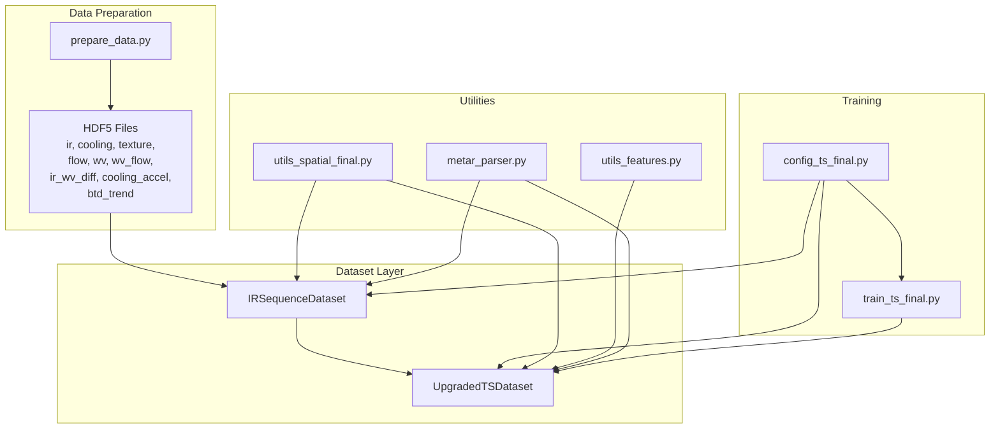
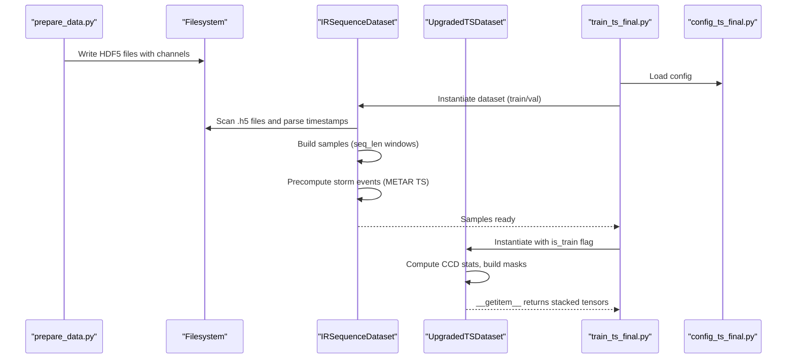
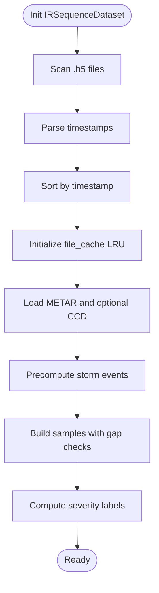
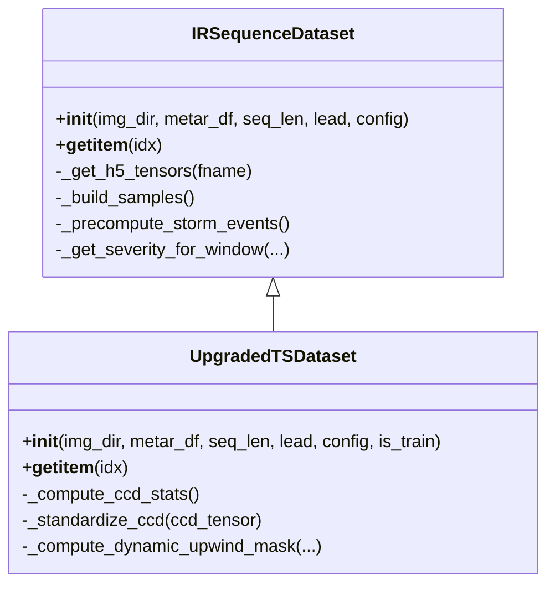
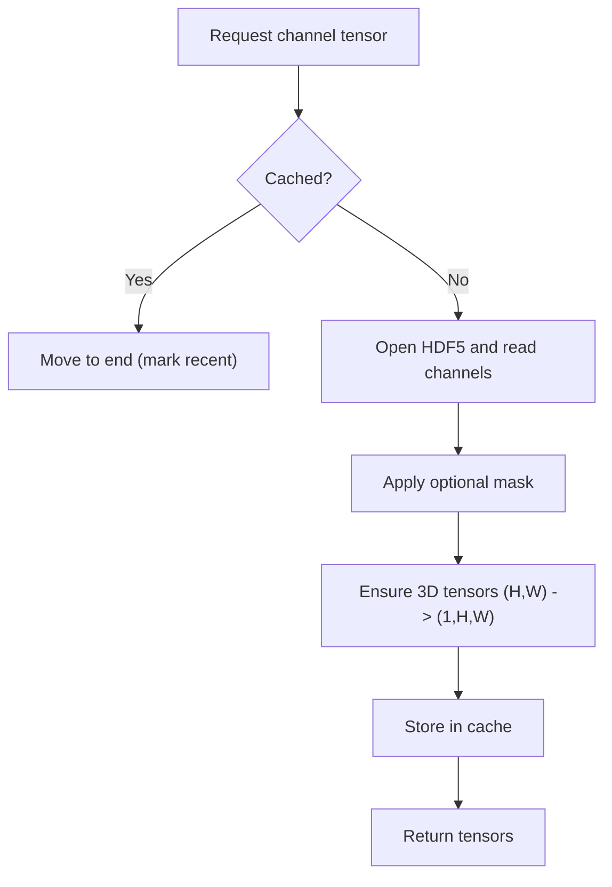
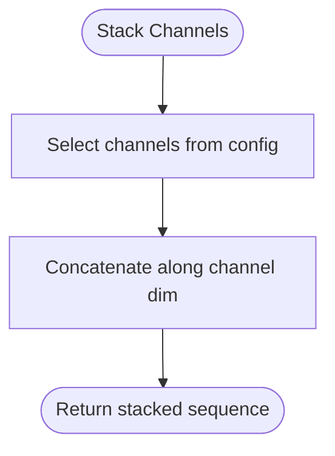
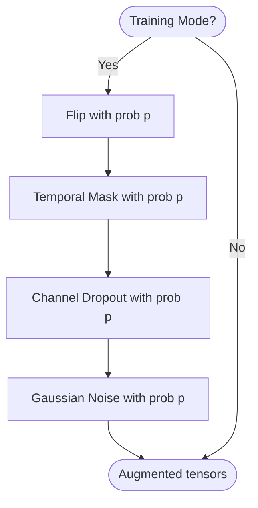
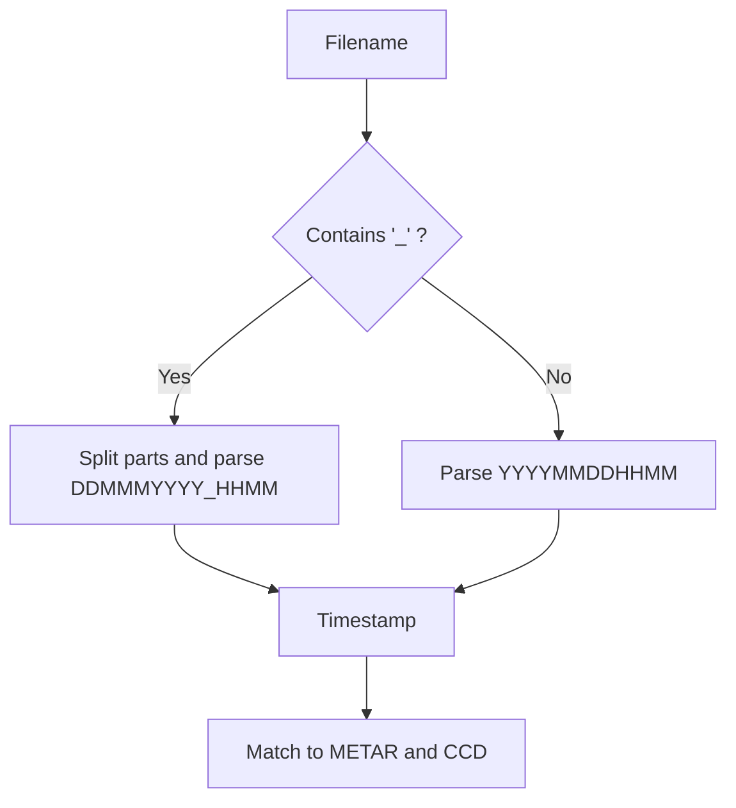
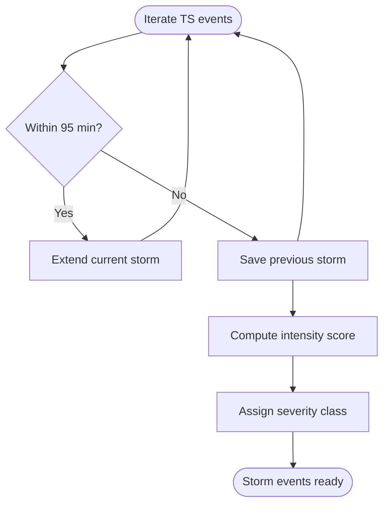
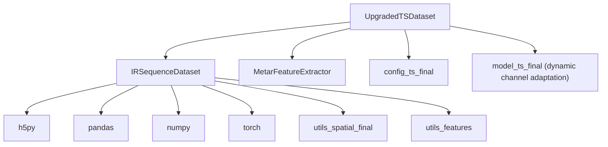

# Dataset Architecture & Implementation

<cite>
**Referenced Files in This Document**
- [dataset_ts_final.py](file://dataset_ts_final.py)
- [config_ts_final.py](file://config_ts_final.py)
- [train_ts_final.py](file://train_ts_final.py)
- [model_ts_final.py](file://model_ts_final.py)
- [utils_spatial_final.py](file://utils_spatial_final.py)
- [utils_features.py](file://utils_features.py)
- [metar_parser.py](file://metar_parser.py)
- [prepare_data.py](file://prepare_data.py)
</cite>

## Table of Contents
1. [Introduction](#introduction)
2. [Project Structure](#project-structure)
3. [Core Components](#core-components)
4. [Architecture Overview](#architecture-overview)
5. [Detailed Component Analysis](#detailed-component-analysis)
6. [Dependency Analysis](#dependency-analysis)
7. [Performance Considerations](#performance-considerations)
8. [Troubleshooting Guide](#troubleshooting-guide)
9. [Conclusion](#conclusion)
10. [Appendices](#appendices)

## Introduction
This document explains the IRSequenceDataset and UpgradedTSDataset implementations used for multi-temporal satellite nowcasting. It covers:
- Multi-temporal sequence construction from HDF5 precomputed files
- HDF5 caching and memory optimization
- Dynamic channel stacking and augmentation patterns
- File parsing and timestamp management
- Storm event precomputation and severity classification
- Label generation and training-time augmentations
- Practical usage examples and performance guidance for large-scale processing

## Project Structure
The dataset pipeline integrates several modules:
- Dataset classes (IRSequenceDataset, UpgradedTSDataset) build sequences and labels
- Configuration defines runtime behavior (channels, masks, augmentation, metrics)
- Training script orchestrates dataset creation, sampling, and model training
- Utilities provide spatial masks, METAR feature extraction, and solar zenith computation
- Preprocessing script generates HDF5 files with multi-modal channels

**Diagram sources**
- [prepare_data.py:39-128](file://prepare_data.py#L39-L128)
- [dataset_ts_final.py:47-334](file://dataset_ts_final.py#L47-L334)
- [train_ts_final.py:199-203](file://train_ts_final.py#L199-L203)
- [config_ts_final.py:16-207](file://config_ts_final.py#L16-L207)
- [utils_spatial_final.py:12-65](file://utils_spatial_final.py#L12-L65)
- [utils_features.py:11-171](file://utils_features.py#L11-L171)
- [metar_parser.py:141-185](file://metar_parser.py#L141-L185)

**Section sources**
- [dataset_ts_final.py:47-334](file://dataset_ts_final.py#L47-L334)
- [config_ts_final.py:16-207](file://config_ts_final.py#L16-L207)
- [train_ts_final.py:199-203](file://train_ts_final.py#L199-L203)
- [prepare_data.py:39-128](file://prepare_data.py#L39-L128)
- [utils_spatial_final.py:12-65](file://utils_spatial_final.py#L12-L65)
- [utils_features.py:11-171](file://utils_features.py#L11-L171)
- [metar_parser.py:141-185](file://metar_parser.py#L141-L185)

## Core Components
- IRSequenceDataset: Base dataset that builds multi-temporal sequences, parses timestamps, loads HDF5 channels, computes storm events, and generates labels.
- UpgradedTSDataset: Extended dataset adding dynamic channel stacking, CCD standardization, METAR features, time-of-year features, optical flow handling, and training-time augmentations.

Key responsibilities:
- Sequence building: Sliding window over time-aligned HDF5 files with gap checks and lead-time labeling.
- Label generation: Binary label for TS presence plus severity classification.
- HDF5 caching: In-memory cache with LRU eviction to reduce disk I/O.
- Dynamic stacking: Select subset of channels per training run.
- Augmentations: Random flip, temporal masking, channel dropout, and Gaussian noise during training.

**Section sources**
- [dataset_ts_final.py:47-334](file://dataset_ts_final.py#L47-L334)
- [dataset_ts_final.py:337-515](file://dataset_ts_final.py#L337-L515)

## Architecture Overview
The dataset architecture connects HDF5 precomputation, dataset classes, and training orchestration.

**Diagram sources**
- [prepare_data.py:39-128](file://prepare_data.py#L39-L128)
- [dataset_ts_final.py:47-334](file://dataset_ts_final.py#L47-L334)
- [dataset_ts_final.py:337-515](file://dataset_ts_final.py#L337-L515)
- [train_ts_final.py:199-203](file://train_ts_final.py#L199-L203)
- [config_ts_final.py:16-207](file://config_ts_final.py#L16-L207)

## Detailed Component Analysis

### IRSequenceDataset
Responsibilities:
- Initialize with image directory, METAR DataFrame, sequence length, and lead time.
- Parse filenames to extract timestamps for both legacy and MOSDAC formats.
- Build an ordered list of HDF5 files and timestamps.
- Load and cache HDF5 channels with a configurable LRU cache.
- Precompute storm events from METAR TS occurrences and derive severity scores.
- Construct samples as sliding windows with gap checks and lead-time labeling.
- Generate severity labels for positive samples.

Key methods and logic:
- Timestamp parsing: Supports two filename patterns and returns pandas timestamps.
- File cache: Uses an OrderedDict to maintain insertion order and evict oldest entries when capacity is exceeded.
- Storm precomputation: Groups contiguous TS events separated by up to 95 minutes, computes duration, max wind/gust, rain intensity, min visibility, and coldest pixel, then assigns severity class.
- Sample building: Ensures <= 45-minute gaps between frames, constructs a target window around the lead time, and labels based on TS presence.
- Label generation: Binary label for TS presence; severity label derived from overlapping storm windows.

**Diagram sources**
- [dataset_ts_final.py:47-92](file://dataset_ts_final.py#L47-L92)
- [dataset_ts_final.py:93-102](file://dataset_ts_final.py#L93-L102)
- [dataset_ts_final.py:104-135](file://dataset_ts_final.py#L104-L135)
- [dataset_ts_final.py:137-208](file://dataset_ts_final.py#L137-L208)
- [dataset_ts_final.py:238-261](file://dataset_ts_final.py#L238-L261)
- [dataset_ts_final.py:263-264](file://dataset_ts_final.py#L263-L264)

**Section sources**
- [dataset_ts_final.py:47-92](file://dataset_ts_final.py#L47-L92)
- [dataset_ts_final.py:93-102](file://dataset_ts_final.py#L93-L102)
- [dataset_ts_final.py:104-135](file://dataset_ts_final.py#L104-L135)
- [dataset_ts_final.py:137-208](file://dataset_ts_final.py#L137-L208)
- [dataset_ts_final.py:238-264](file://dataset_ts_final.py#L238-L264)

### UpgradedTSDataset
Extends IRSequenceDataset with:
- Dynamic channel stacking based on config.USE_CHANNELS.
- CCD feature standardization using dataset-wide mean/std.
- METAR features extracted per frame using a feature extractor.
- Time-of-year features computed from solar zenith angle.
- Training-time augmentations: horizontal flip, temporal masking, channel dropout, and Gaussian noise.
- Dynamic upwind mask that adapts based on recent optical flow.

**Diagram sources**
- [dataset_ts_final.py:47-334](file://dataset_ts_final.py#L47-L334)
- [dataset_ts_final.py:337-515](file://dataset_ts_final.py#L337-L515)

**Section sources**
- [dataset_ts_final.py:337-515](file://dataset_ts_final.py#L337-L515)

### HDF5 File Caching System
- Cache structure: OrderedDict keyed by filename with values containing per-channel tensors.
- Eviction policy: When cache reaches MAX_CACHE_SIZE, the least recently used item is removed.
- Channel keys: ir, cooling, texture, flow, wv, wv_cooling, wv_texture, wv_flow, ir_wv_diff, cooling_accel, btd_trend.
- Missing keys: Defaults to zero tensors sized appropriately.

**Diagram sources**
- [dataset_ts_final.py:268-303](file://dataset_ts_final.py#L268-L303)

**Section sources**
- [dataset_ts_final.py:268-303](file://dataset_ts_final.py#L268-L303)

### Dynamic Channel Stacking
- Selection: USE_CHANNELS controls which channels are concatenated along the channel dimension.
- Options: ir, cooling, texture, wv, wv_cooling, wv_texture, ir_wv_diff, cooling_accel, btd_trend.
- Flow stacking: flow and wv_flow are concatenated when optical flow is enabled.

**Diagram sources**
- [dataset_ts_final.py:378-396](file://dataset_ts_final.py#L378-L396)

**Section sources**
- [dataset_ts_final.py:378-396](file://dataset_ts_final.py#L378-L396)

### Training-Specific Augmentations
- Horizontal flip: Randomly flips entire sequences and adjusts optical flow accordingly.
- Temporal masking: Randomly zeros out frames with a small probability.
- Channel dropout: Zeros out a random channel group per sequence.
- Gaussian noise: Adds mild noise to simulate sensor variance.

**Diagram sources**
- [dataset_ts_final.py:437-468](file://dataset_ts_final.py#L437-L468)

**Section sources**
- [dataset_ts_final.py:437-468](file://dataset_ts_final.py#L437-L468)

### File Parsing and Timestamp Management
- Filename patterns:
  - Legacy: YYYYMMDDHHMM.ext
  - MOSDAC: 3SIMG_DDMMMYYYY_HHMM_...
- Timestamp parsing uses pandas to_datetime with appropriate formats.
- METAR parsing extracts TS presence, wind, temperature, dewpoint, pressure, clouds, visibility, and rainfall intensity.

**Diagram sources**
- [dataset_ts_final.py:93-102](file://dataset_ts_final.py#L93-L102)
- [metar_parser.py:13-139](file://metar_parser.py#L13-L139)

**Section sources**
- [dataset_ts_final.py:93-102](file://dataset_ts_final.py#L93-L102)
- [metar_parser.py:13-139](file://metar_parser.py#L13-L139)

### Storm Event Precomputation and Severity Classification
- Storm grouping: Iterates TS events and merges those within 95 minutes.
- Severity scoring: Computes an intensity score combining wind, rain, visibility, and coldest pixel.
- Severity class: Uses a centralized classifier that maps thresholds to categories.

**Diagram sources**
- [dataset_ts_final.py:137-208](file://dataset_ts_final.py#L137-L208)
- [config_ts_final.py:138-175](file://config_ts_final.py#L138-L175)

**Section sources**
- [dataset_ts_final.py:137-208](file://dataset_ts_final.py#L137-L208)
- [config_ts_final.py:138-175](file://config_ts_final.py#L138-L175)

### Label Generation Methods
- Binary label: 1 if any TS occurs in the target window; 0 otherwise.
- Severity label: Highest priority category among overlapping storms; or maximum intensity score if regression is enabled.

**Section sources**
- [dataset_ts_final.py:250-258](file://dataset_ts_final.py#L250-L258)
- [dataset_ts_final.py:210-236](file://dataset_ts_final.py#L210-L236)

## Dependency Analysis
- IRSequenceDataset depends on:
  - HDF5 file cache for fast channel access
  - METAR DataFrame for TS presence and storm precomputation
  - Spatial utilities for optional masks
  - Feature utilities for solar zenith computation
- UpgradedTSDataset additionally depends on:
  - METAR feature extractor for per-frame features
  - CCD statistics for standardization
  - Dynamic upwind mask computation

**Diagram sources**
- [dataset_ts_final.py:21-23](file://dataset_ts_final.py#L21-L23)
- [dataset_ts_final.py:47-334](file://dataset_ts_final.py#L47-L334)
- [dataset_ts_final.py:337-515](file://dataset_ts_final.py#L337-L515)
- [utils_spatial_final.py:12-65](file://utils_spatial_final.py#L12-L65)
- [utils_features.py:11-171](file://utils_features.py#L11-L171)
- [model_ts_final.py:75-100](file://model_ts_final.py#L75-L100)

**Section sources**
- [dataset_ts_final.py:21-23](file://dataset_ts_final.py#L21-L23)
- [dataset_ts_final.py:47-334](file://dataset_ts_final.py#L47-L334)
- [dataset_ts_final.py:337-515](file://dataset_ts_final.py#L337-L515)
- [utils_spatial_final.py:12-65](file://utils_spatial_final.py#L12-L65)
- [utils_features.py:11-171](file://utils_features.py#L11-L171)
- [model_ts_final.py:75-100](file://model_ts_final.py#L75-L100)

## Performance Considerations
- HDF5 caching:
  - LRU cache reduces repeated disk reads; tune MAX_CACHE_SIZE according to available RAM.
  - Channels are stored compressed; consider SSD storage for faster I/O.
- Memory optimization:
  - Use smaller seq_len and batch_size for constrained environments.
  - Disable optical flow if not needed to save compute and memory.
- Data loading:
  - Use multiple workers in DataLoader to parallelize file reads.
  - Pin memory to accelerate GPU transfer.
- Precomputation:
  - Ensure HDF5 files are generated with consistent shapes and minimal metadata overhead.
- Model alignment:
  - The model adapts its first convolution to the number of channels; mismatches between old checkpoints and new channel sets are handled by partial loading.

**Section sources**
- [dataset_ts_final.py:58](file://dataset_ts_final.py#L58)
- [dataset_ts_final.py:299-300](file://dataset_ts_final.py#L299-L300)
- [train_ts_final.py:281-283](file://train_ts_final.py#L281-L283)
- [model_ts_final.py:82-100](file://model_ts_final.py#L82-L100)

## Troubleshooting Guide
- No samples found:
  - Verify the data directory contains .h5 files and METAR file is readable.
  - Check that filenames match expected patterns and timestamps parse correctly.
- Missing channels in HDF5:
  - The dataset writes default zero tensors for missing keys; confirm preprocessing script generated all expected datasets.
- METAR mismatch:
  - Ensure METAR timestamps align with HDF5 timestamps; the extractor interpolates missing values.
- Channel mismatch during resume:
  - The training script attempts strict load first, then falls back to partial load for dynamic channel changes.
- Cache exhaustion:
  - Increase MAX_CACHE_SIZE or reduce batch size to fit available memory.

**Section sources**
- [train_ts_final.py:206-208](file://train_ts_final.py#L206-L208)
- [dataset_ts_final.py:282-296](file://dataset_ts_final.py#L282-L296)
- [metar_parser.py:141-185](file://metar_parser.py#L141-L185)
- [train_ts_final.py:346-354](file://train_ts_final.py#L346-L354)
- [dataset_ts_final.py:58](file://dataset_ts_final.py#L58)

## Conclusion
The IRSequenceDataset and UpgradedTSDataset provide a robust, scalable framework for multi-temporal satellite nowcasting:
- Efficient HDF5 caching minimizes I/O bottlenecks.
- Dynamic channel stacking enables flexible feature combinations.
- Comprehensive storm precomputation and severity labeling support both classification and regression objectives.
- Training-time augmentations improve generalization while preserving physical realism.
- The architecture scales to large datasets with careful memory and I/O management.

## Appendices

### Code Examples (Paths Only)
- Dataset instantiation:
  - [train_ts_final.py:200-202](file://train_ts_final.py#L200-L202)
- Sample retrieval:
  - [dataset_ts_final.py:305-333](file://dataset_ts_final.py#L305-L333)
- Sequence building:
  - [dataset_ts_final.py:238-261](file://dataset_ts_final.py#L238-L261)
- HDF5 channel loading:
  - [dataset_ts_final.py:268-303](file://dataset_ts_final.py#L268-L303)
- Dynamic channel stacking:
  - [dataset_ts_final.py:378-396](file://dataset_ts_final.py#L378-L396)
- Training augmentations:
  - [dataset_ts_final.py:437-468](file://dataset_ts_final.py#L437-L468)

### Configuration Highlights
- Channel selection:
  - [config_ts_final.py:32-33](file://config_ts_final.py#L32-L33)
- Spatial mask:
  - [config_ts_final.py:106-116](file://config_ts_final.py#L106-L116)
- Optical flow:
  - [config_ts_final.py:35-37](file://config_ts_final.py#L35-L37)
- Augmentations:
  - [config_ts_final.py:48-51](file://config_ts_final.py#L48-L51)
- Severity weights:
  - [config_ts_final.py:96-104](file://config_ts_final.py#L96-L104)