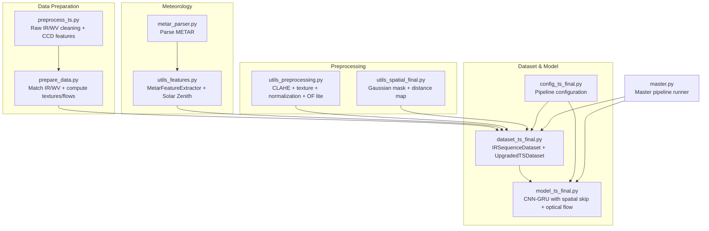
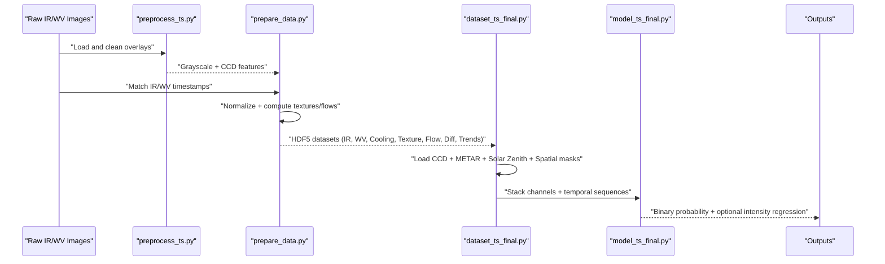
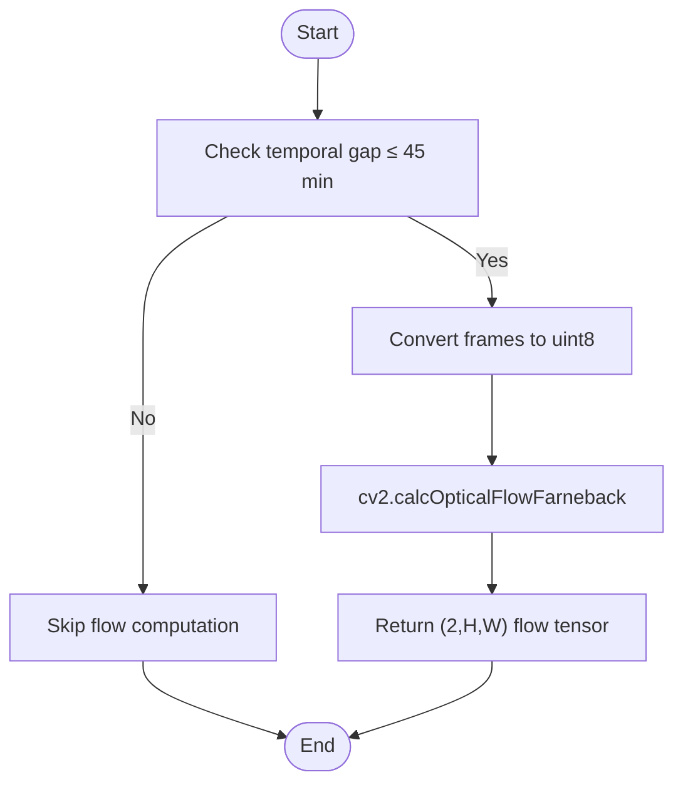
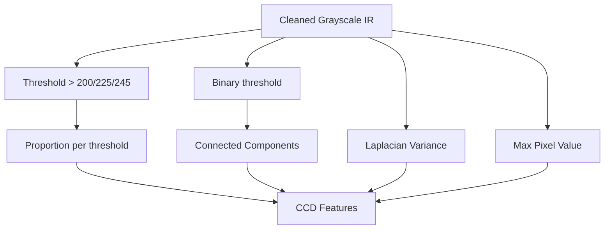
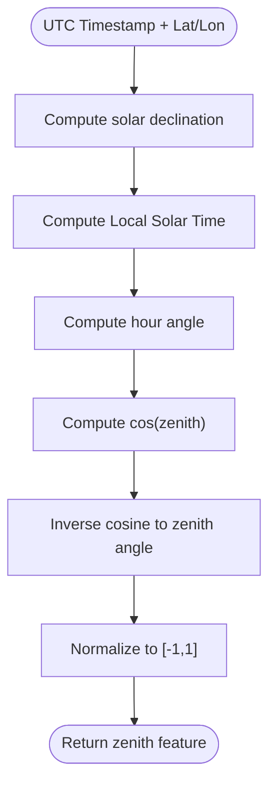
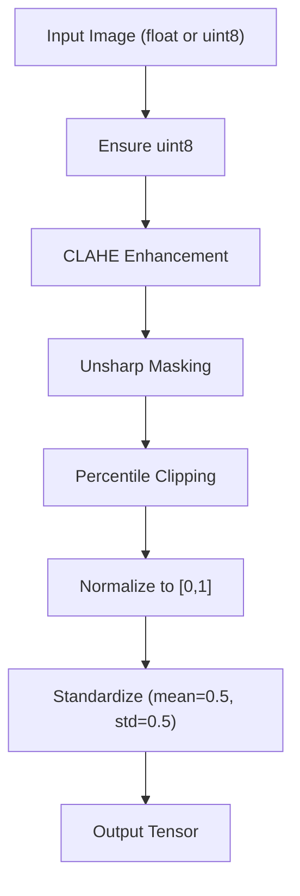
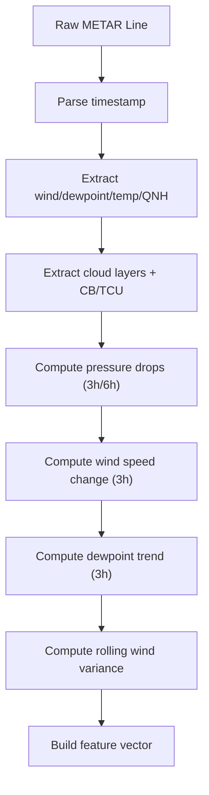
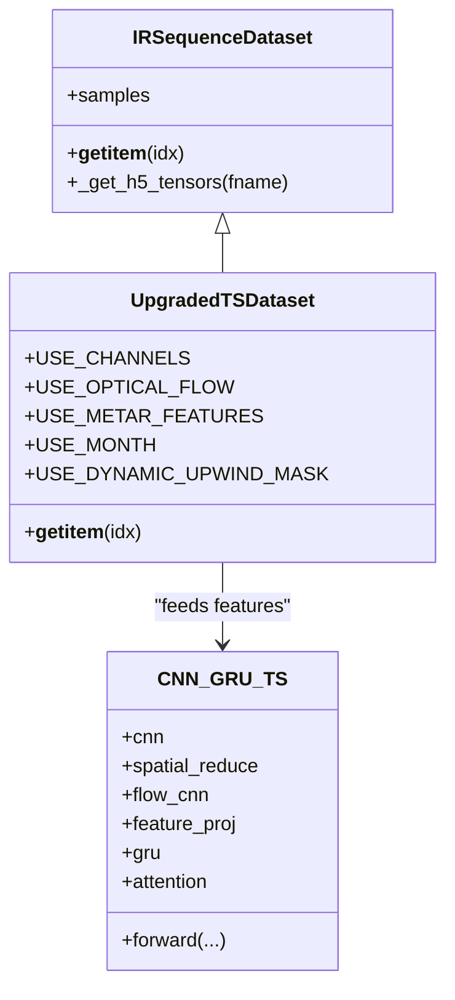
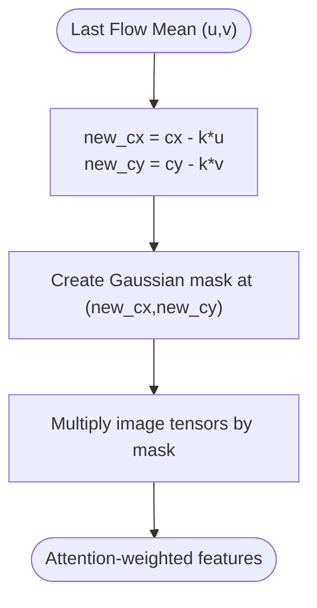
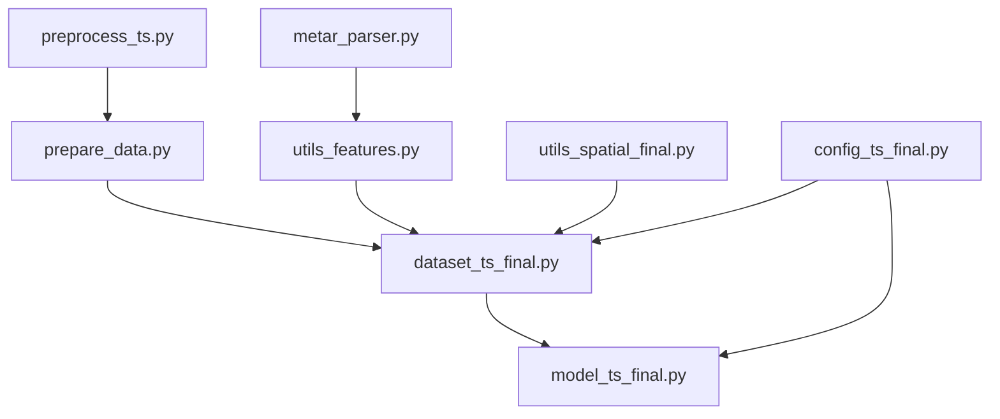

# Feature Engineering & Preprocessing

<cite>
**Referenced Files in This Document**
- [utils_features.py](file://utils_features.py)
- [utils_preprocessing.py](file://utils_preprocessing.py)
- [metar_parser.py](file://metar_parser.py)
- [utils_spatial_final.py](file://utils_spatial_final.py)
- [preprocess_ts.py](file://preprocess_ts.py)
- [prepare_data.py](file://prepare_data.py)
- [dataset_ts_final.py](file://dataset_ts_final.py)
- [model_ts_final.py](file://model_ts_final.py)
- [config_ts_final.py](file://config_ts_final.py)
- [master.py](file://master.py)
</cite>

## Table of Contents
1. [Introduction](#introduction)
2. [Project Structure](#project-structure)
3. [Core Components](#core-components)
4. [Architecture Overview](#architecture-overview)
5. [Detailed Component Analysis](#detailed-component-analysis)
6. [Dependency Analysis](#dependency-analysis)
7. [Performance Considerations](#performance-considerations)
8. [Troubleshooting Guide](#troubleshooting-guide)
9. [Conclusion](#conclusion)
10. [Appendices](#appendices)

## Introduction
This document explains the multi-spectral feature engineering pipeline used for convective thunderstorm nowcasting over Nagpur. It covers:
- Optical flow computation for motion tracking
- Cold cloud density (CCD) feature extraction
- Solar zenith angle calculations
- CLAHE preprocessing and texture enhancement
- Multi-modal feature fusion strategies
- Meteorological feature integration (METAR parsing, pressure trends, wind patterns, cloud characteristics)
- Dynamic upwind masking, distance map generation, and spatial attention mechanisms
- Example workflows, preprocessing chains, and data transformation pipelines
- Computational efficiency, memory optimization, and real-time processing considerations

## Project Structure
The pipeline is organized around modular utilities and a dataset/model architecture designed for efficient CPU inference and robust multi-modal fusion.

**Diagram sources**
- [preprocess_ts.py:1-117](file://preprocess_ts.py#L1-L117)
- [prepare_data.py:1-132](file://prepare_data.py#L1-L132)
- [metar_parser.py:1-186](file://metar_parser.py#L1-L186)
- [utils_features.py:1-191](file://utils_features.py#L1-L191)
- [utils_preprocessing.py:1-162](file://utils_preprocessing.py#L1-L162)
- [utils_spatial_final.py:1-80](file://utils_spatial_final.py#L1-L80)
- [dataset_ts_final.py:1-515](file://dataset_ts_final.py#L1-L515)
- [model_ts_final.py:1-335](file://model_ts_final.py#L1-L335)
- [config_ts_final.py:1-208](file://config_ts_final.py#L1-L208)
- [master.py:1-108](file://master.py#L1-L108)

**Section sources**
- [master.py:1-108](file://master.py#L1-L108)
- [config_ts_final.py:1-208](file://config_ts_final.py#L1-L208)

## Core Components
- Optical flow computation: Dense optical flow using Farneback for motion tracking between IR and water vapor channels.
- Cold cloud density (CCD): Proportions of extremely cold pixels, connected cell count, and image complexity derived from raw grayscale.
- Solar zenith angle: Diurnal proxy computed from UTC timestamp and geographic coordinates.
- CLAHE and texture enhancement: Contrast-limited adaptive histogram equalization and unsharp masking for cloud edge sharpening.
- Meteorological features: METAR parsing and derived features including pressure trends, wind changes, dewpoint trends, and cloud coverage.
- Spatial attention and masking: Static Gaussian mask and dynamic upwind mask based on recent flow fields.
- Multi-modal fusion: Concatenation of CNN features, spatial skip features, optical flow features, CCD, METAR, and time features; temporal attention pooling.

**Section sources**
- [utils_preprocessing.py:136-162](file://utils_preprocessing.py#L136-L162)
- [preprocess_ts.py:69-103](file://preprocess_ts.py#L69-L103)
- [utils_features.py:173-191](file://utils_features.py#L173-L191)
- [utils_preprocessing.py:16-83](file://utils_preprocessing.py#L16-L83)
- [metar_parser.py:13-186](file://metar_parser.py#L13-L186)
- [utils_spatial_final.py:12-65](file://utils_spatial_final.py#L12-L65)
- [dataset_ts_final.py:374-515](file://dataset_ts_final.py#L374-L515)

## Architecture Overview
The pipeline integrates multi-spectral imagery with meteorological data and spatial attention to produce a robust nowcasting model.

**Diagram sources**
- [preprocess_ts.py:27-112](file://preprocess_ts.py#L27-L112)
- [prepare_data.py:39-128](file://prepare_data.py#L39-L128)
- [dataset_ts_final.py:268-333](file://dataset_ts_final.py#L268-L333)
- [model_ts_final.py:202-268](file://model_ts_final.py#L202-L268)

## Detailed Component Analysis

### Optical Flow Computation for Motion Tracking
- Dense optical flow is computed using the Farneback method between successive frames for both IR and water vapor channels.
- The function converts frames to uint8 and returns a (2, H, W) magnitude representation suitable for downstream CNN processing.
- Flow is only computed when temporal gaps are within a configured threshold to ensure reliable motion estimates.

**Diagram sources**
- [utils_preprocessing.py:136-162](file://utils_preprocessing.py#L136-L162)
- [prepare_data.py:90-101](file://prepare_data.py#L90-L101)

**Section sources**
- [utils_preprocessing.py:136-162](file://utils_preprocessing.py#L136-L162)
- [prepare_data.py:90-101](file://prepare_data.py#L90-L101)

### Cold Cloud Density (CCD) Feature Extraction
- Raw grayscale IR images are used to compute:
  - Proportion of pixels above thresholds (moderate/deep/extreme cold)
  - Connected component count (cellularity)
  - Image complexity via Laplacian variance
  - Coldest pixel value
- These features are standardized per-sample during dataset construction.

**Diagram sources**
- [preprocess_ts.py:72-103](file://preprocess_ts.py#L72-L103)

**Section sources**
- [preprocess_ts.py:72-103](file://preprocess_ts.py#L72-L103)
- [dataset_ts_final.py:104-136](file://dataset_ts_final.py#L104-L136)

### Solar Zenith Angle Calculation
- Computes the solar zenith angle for a given UTC timestamp and geographic coordinates.
- Used to derive monthly sine/cosine features and a normalized zenith proxy for temporal modeling.

**Diagram sources**
- [utils_features.py:173-191](file://utils_features.py#L173-L191)

**Section sources**
- [utils_features.py:173-191](file://utils_features.py#L173-L191)

### CLAHE Preprocessing and Texture Enhancement
- CLAHE enhances contrast locally to improve cloud structure visibility.
- Unsharp masking sharpens cloud edges.
- Outlier clipping normalizes to [0,1] using percentile-based clipping.
- The improved transform pipeline applies these steps and standardization.

**Diagram sources**
- [utils_preprocessing.py:16-83](file://utils_preprocessing.py#L16-L83)
- [utils_preprocessing.py:86-134](file://utils_preprocessing.py#L86-L134)

**Section sources**
- [utils_preprocessing.py:16-83](file://utils_preprocessing.py#L16-L83)
- [utils_preprocessing.py:86-134](file://utils_preprocessing.py#L86-L134)

### METAR Data Parsing and Meteorological Features
- METAR lines are parsed to extract wind, temperature/dewpoint, QNH pressure, cloud layers, visibility, and precipitation intensity.
- The extractor derives:
  - Current conditions (wind direction/speed, dewpoint, temperature, pressure)
  - Cloud composition (CB/TCU presence, low/mid/high cover, base, layer count, base spread)
  - Pressure drops over 3h/6h windows
  - Wind speed change over 3h
  - Dewpoint trend over 3h
  - Rolling wind variance
  - Composite risk index
- Features are aligned to image timestamps via nearest neighbor interpolation.

**Diagram sources**
- [metar_parser.py:13-186](file://metar_parser.py#L13-L186)
- [utils_features.py:39-126](file://utils_features.py#L39-L126)

**Section sources**
- [metar_parser.py:13-186](file://metar_parser.py#L13-L186)
- [utils_features.py:39-126](file://utils_features.py#L39-L126)

### Multi-Modal Feature Fusion Strategies
- Channel stacking: IR, cooling rate, texture, water vapor, water vapor cooling, water vapor texture, IR-WV difference, cooling acceleration, BTD trend.
- Optical flow branch: A lightweight CNN extracts 32D features from (u,v) flow channels.
- METAR features: 19-dimensional projection integrated per sequence.
- Time features: Monthly sine/cosine plus normalized zenith proxy.
- Spatial attention: Static Gaussian mask and dynamic upwind mask based on recent flow mean.
- Temporal attention: GRU outputs are weighted by attention scores for final classification/regression.

**Diagram sources**
- [dataset_ts_final.py:47-92](file://dataset_ts_final.py#L47-L92)
- [dataset_ts_final.py:337-515](file://dataset_ts_final.py#L337-L515)
- [model_ts_final.py:68-268](file://model_ts_final.py#L68-L268)

**Section sources**
- [dataset_ts_final.py:374-515](file://dataset_ts_final.py#L374-L515)
- [model_ts_final.py:68-268](file://model_ts_final.py#L68-L268)

### Dynamic Upwind Masking and Distance Map Generation
- Static Gaussian mask focuses attention on Nagpur center; mean normalized to preserve brightness.
- Distance map highlights the 10 NM boundary region around the station.
- Dynamic upwind mask shifts the center based on recent mean flow components, scaling by a configurable factor.

**Diagram sources**
- [utils_spatial_final.py:12-34](file://utils_spatial_final.py#L12-L34)
- [dataset_ts_final.py:497-511](file://dataset_ts_final.py#L497-L511)

**Section sources**
- [utils_spatial_final.py:12-65](file://utils_spatial_final.py#L12-L65)
- [dataset_ts_final.py:497-511](file://dataset_ts_final.py#L497-L511)

### Example Workflows and Pipelines
- Raw image processing:
  - Clean overlays, compute CCD features, resize and pad to 224x224.
- Precomputation:
  - Match IR and WV timestamps, normalize, compute textures, optical flow, cooling rates, differences, trends.
- Dataset assembly:
  - Load HDF5 features, align with METAR and CCD, build sequences, apply augmentations, fuse features.
- Model inference:
  - Stack channels, integrate optical flow and meteorological/time features, apply temporal attention, produce probability/intensity.

**Section sources**
- [preprocess_ts.py:27-112](file://preprocess_ts.py#L27-L112)
- [prepare_data.py:39-128](file://prepare_data.py#L39-L128)
- [dataset_ts_final.py:268-333](file://dataset_ts_final.py#L268-L333)
- [model_ts_final.py:202-268](file://model_ts_final.py#L202-L268)

## Dependency Analysis
Key dependencies and coupling:
- Dataset depends on HDF5 features produced by the precomputation stage.
- METAR parsing feeds the feature extractor used by the dataset.
- Spatial utilities support static and dynamic masking.
- Model depends on channel configuration and feature projections.

**Diagram sources**
- [preprocess_ts.py:1-117](file://preprocess_ts.py#L1-L117)
- [prepare_data.py:1-132](file://prepare_data.py#L1-L132)
- [metar_parser.py:1-186](file://metar_parser.py#L1-L186)
- [utils_features.py:1-191](file://utils_features.py#L1-L191)
- [utils_spatial_final.py:1-80](file://utils_spatial_final.py#L1-L80)
- [dataset_ts_final.py:1-515](file://dataset_ts_final.py#L1-L515)
- [model_ts_final.py:1-335](file://model_ts_final.py#L1-L335)
- [config_ts_final.py:1-208](file://config_ts_final.py#L1-L208)

**Section sources**
- [dataset_ts_final.py:268-333](file://dataset_ts_final.py#L268-L333)
- [model_ts_final.py:202-268](file://model_ts_final.py#L202-L268)

## Performance Considerations
- Memory optimization:
  - HDF5 caching with LZF compression and bounded cache size prevents repeated I/O.
  - File cache eviction policy keeps hot files resident.
- Computational efficiency:
  - Optical flow disabled by default to reduce compute; when enabled, it uses a lightweight CNN branch.
  - CNN backbone adapted to dynamic input channels to minimize unnecessary computations.
  - GRU replaces transformer to reduce parameters and improve CPU throughput.
- Real-time processing:
  - Precomputation of textures and flows reduces runtime cost.
  - Standardized transforms and minimal augmentations preserve speed.
  - Dynamic upwind mask recomputed per sample to focus attention efficiently.

[No sources needed since this section provides general guidance]

## Troubleshooting Guide
- Empty METAR DataFrame: The extractor raises an error if the input is empty; ensure the METAR file is present and correctly formatted.
- Missing HDF5 keys: Dataset gracefully falls back to zeros for missing keys; verify precomputation produced all expected datasets.
- Unknown image dimensions: Preprocessing warns and skips unknown sizes; ensure crops match expected dimensions.
- METAR alignment gaps: Interpolation and forward-fill handle missing values; verify cadence and tolerance.
- Flow computation failures: Ensure temporal gaps are within the allowed threshold; otherwise, flow tensors are zero-padded.

**Section sources**
- [utils_features.py:24-28](file://utils_features.py#L24-L28)
- [dataset_ts_final.py:282-296](file://dataset_ts_final.py#L282-L296)
- [preprocess_ts.py:37-41](file://preprocess_ts.py#L37-L41)
- [metar_parser.py:147-185](file://metar_parser.py#L147-L185)

## Conclusion
The pipeline integrates multi-spectral imagery with meteorological and spatial cues to enable robust nowcasting. By combining CCD proxies, optical flow motion features, and dynamic spatial attention with a compact CNN-GRU architecture, it achieves strong performance with practical efficiency. The modular design allows easy experimentation with channel sets, masking strategies, and feature fusion configurations.

[No sources needed since this section summarizes without analyzing specific files]

## Appendices

### Configuration Highlights
- Channel selection, optical flow usage, augmentation probabilities, seasonal boosting, and spatial mask parameters are centrally configured.
- Intensity regression and evidential learning options are exposed for advanced tasks.

**Section sources**
- [config_ts_final.py:32-124](file://config_ts_final.py#L32-L124)
- [config_ts_final.py:137-176](file://config_ts_final.py#L137-L176)

### Master Pipeline Runner
- Orchestrates end-to-end execution: training, evaluation, ensemble, and ablation studies.

**Section sources**
- [master.py:39-104](file://master.py#L39-L104)