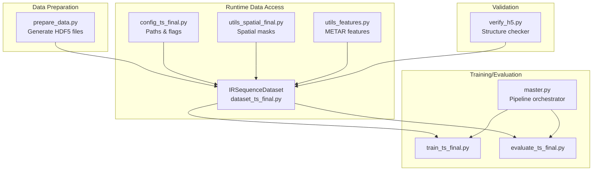
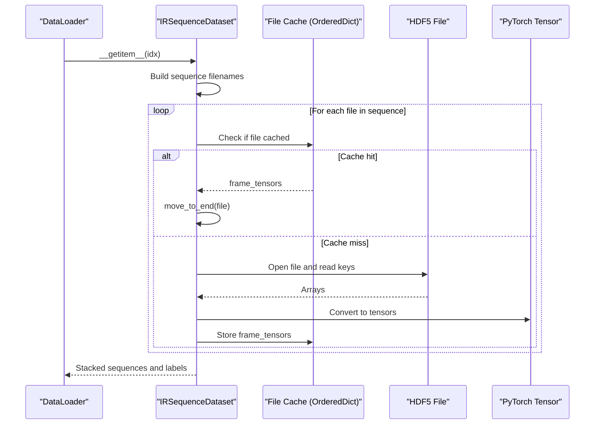
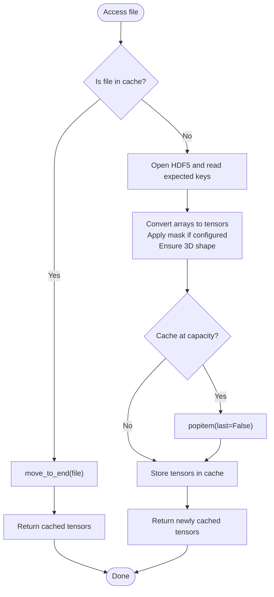
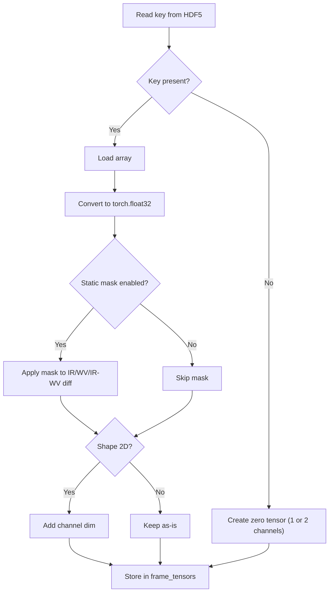
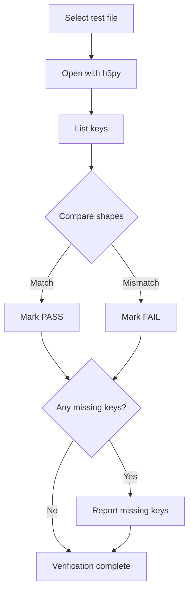
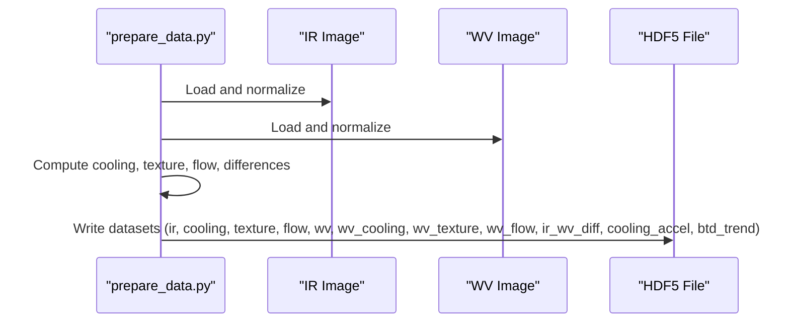
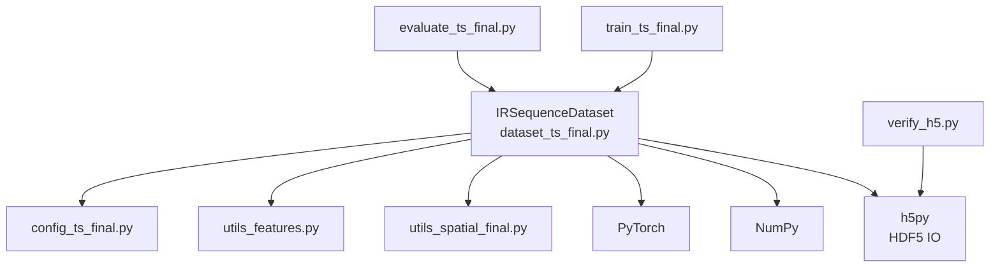

# HDF5 Storage & Data Access

<cite>
**Referenced Files in This Document**
- [dataset_ts_final.py](file://dataset_ts_final.py)
- [verify_h5.py](file://verify_h5.py)
- [config_ts_final.py](file://config_ts_final.py)
- [utils_spatial_final.py](file://utils_spatial_final.py)
- [utils_features.py](file://utils_features.py)
- [prepare_data.py](file://prepare_data.py)
- [master.py](file://master.py)
- [train_ts_final.py](file://train_ts_final.py)
- [evaluate_ts_final.py](file://evaluate_ts_final.py)
</cite>

## Table of Contents
1. [Introduction](#introduction)
2. [Project Structure](#project-structure)
3. [Core Components](#core-components)
4. [Architecture Overview](#architecture-overview)
5. [Detailed Component Analysis](#detailed-component-analysis)
6. [Dependency Analysis](#dependency-analysis)
7. [Performance Considerations](#performance-considerations)
8. [Troubleshooting Guide](#troubleshooting-guide)
9. [Conclusion](#conclusion)
10. [Appendices](#appendices)

## Introduction
This document explains the HDF5-based storage and access patterns used for multi-spectral satellite imagery in the Nagpur Thunderstorm Nowcasting system. It focuses on how IR, water vapor (WV), cooling, texture, and optical flow datasets are organized within HDF5 files, how the system caches frequently accessed files in memory, and how tensors are retrieved, converted, and validated. It also documents error handling, missing key fallbacks, and performance strategies for large-scale satellite data handling.

## Project Structure
The repository organizes satellite data processing and model training around a dataset class that reads precomputed HDF5 files and exposes multi-spectral sequences for training and evaluation. Supporting utilities handle spatial masks, METAR features, and validation scripts.

**Diagram sources**
- [prepare_data.py:103-117](file://prepare_data.py#L103-L117)
- [dataset_ts_final.py:47-92](file://dataset_ts_final.py#L47-L92)
- [verify_h5.py:16-28](file://verify_h5.py#L16-L28)
- [master.py:75-98](file://master.py#L75-L98)

**Section sources**
- [dataset_ts_final.py:47-92](file://dataset_ts_final.py#L47-L92)
- [config_ts_final.py:17-22](file://config_ts_final.py#L17-L22)
- [prepare_data.py:103-117](file://prepare_data.py#L103-L117)

## Core Components
- HDF5 file organization: Each HDF5 file contains multi-spectral channels and derived features for a single time step. Keys include IR, WV, cooling, texture, flow, wv_flow, ir_wv_diff, cooling_accel, and btd_trend.
- File caching: An OrderedDict-backed cache stores recently accessed HDF5 frames to reduce repeated disk I/O.
- Tensor retrieval: On demand, the dataset reads HDF5 keys, converts arrays to PyTorch tensors, applies optional masking and shape normalization, and returns stacked sequences.
- Validation: A dedicated script verifies expected keys and shapes to ensure data integrity.

**Section sources**
- [dataset_ts_final.py:268-303](file://dataset_ts_final.py#L268-L303)
- [verify_h5.py:16-28](file://verify_h5.py#L16-L28)

## Architecture Overview
The runtime architecture couples a dataset class with HDF5 files, a cache, and optional spatial/temporal augmentations. The training and evaluation scripts consume the dataset to build batches.

**Diagram sources**
- [dataset_ts_final.py:305-333](file://dataset_ts_final.py#L305-L333)
- [dataset_ts_final.py:268-303](file://dataset_ts_final.py#L268-L303)

## Detailed Component Analysis

### HDF5 File Organization
- Keys and shapes:
  - ir: (224, 224)
  - cooling: (224, 224)
  - texture: (224, 224)
  - flow: (2, 224, 224)
  - wv: (224, 224)
  - wv_cooling: (224, 224)
  - wv_texture: (224, 224)
  - wv_flow: (2, 224, 224)
  - ir_wv_diff: (224, 224)
  - cooling_accel: (224, 224)
  - btd_trend: (224, 224)
- Compression: LZF compression is used when writing HDF5 datasets.

**Section sources**
- [verify_h5.py:16-28](file://verify_h5.py#L16-L28)
- [prepare_data.py:103-117](file://prepare_data.py#L103-L117)

### File Caching Mechanism (OrderedDict)
- Purpose: Reduce repeated disk I/O by keeping recent HDF5 frames in memory.
- Implementation:
  - Cache type: OrderedDict to preserve insertion order and enable LRU-like eviction.
  - Eviction policy: When cache reaches capacity, the oldest item is removed (move_to_end on hit, popitem(last=False) on overflow).
  - Capacity: Controlled by config.MAX_CACHE_SIZE (default 2000).
- Behavior:
  - On cache hit, the file key is moved to the end to mark it as recently used.
  - On cache miss, the file is opened, tensors are prepared, and stored under the filename key.

**Diagram sources**
- [dataset_ts_final.py:268-303](file://dataset_ts_final.py#L268-L303)

**Section sources**
- [dataset_ts_final.py:56-58](file://dataset_ts_final.py#L56-L58)
- [dataset_ts_final.py:268-303](file://dataset_ts_final.py#L268-L303)

### Tensor Retrieval, Data Type Conversions, and Missing Key Handling
- Retrieval:
  - Reads expected keys from HDF5.
  - Converts NumPy arrays to PyTorch tensors with float dtype.
  - Applies optional spatial mask for IR, WV, and IR-WV difference channels when static masking is enabled.
  - Ensures 3D shape by adding a channel dimension if the array is 2D.
- Missing key handling:
  - If a key is absent, returns zero tensors:
    - 2-channel zero tensors for flow/wv_flow.
    - 1-channel zero tensors for other keys.
- Dynamic upwind masking:
  - Optionally adjusts mask center based on mean optical flow components from the last frame.

**Diagram sources**
- [dataset_ts_final.py:277-296](file://dataset_ts_final.py#L277-L296)

**Section sources**
- [dataset_ts_final.py:277-296](file://dataset_ts_final.py#L277-L296)
- [utils_spatial_final.py:12-34](file://utils_spatial_final.py#L12-L34)

### Validation Procedures for HDF5 Structure Verification
- Purpose: Ensure each HDF5 file contains the expected keys with correct shapes.
- Procedure:
  - Enumerates .h5 files in a directory.
  - Iterates keys and compares shapes against expected values.
  - Reports missing keys and mismatches.
- Output:
  - PASS/FAIL per key and overall verification status.

**Diagram sources**
- [verify_h5.py:30-48](file://verify_h5.py#L30-L48)

**Section sources**
- [verify_h5.py:16-28](file://verify_h5.py#L16-L28)
- [verify_h5.py:30-54](file://verify_h5.py#L30-L54)

### Data Generation and Storage (Preparation)
- The preparation script matches IR and WV images by timestamp, computes derived features (cooling, texture, flow, differences), and writes them to HDF5 with LZF compression.

**Diagram sources**
- [prepare_data.py:103-117](file://prepare_data.py#L103-L117)

**Section sources**
- [prepare_data.py:103-117](file://prepare_data.py#L103-L117)

### Pipeline Orchestration and Usage
- The master script runs the training and evaluation pipeline in sequence, enabling controlled execution and logging.
- Training and evaluation scripts instantiate datasets and build loaders to consume HDF5-backed sequences.

**Section sources**
- [master.py:75-98](file://master.py#L75-L98)
- [train_ts_final.py:199-200](file://train_ts_final.py#L199-L200)
- [evaluate_ts_final.py:200-200](file://evaluate_ts_final.py#L200-L200)

## Dependency Analysis
The dataset depends on HDF5 for storage, NumPy and PyTorch for tensor operations, and optional spatial utilities for masking. Validation utilities depend on h5py for structure checks.

**Diagram sources**
- [dataset_ts_final.py:21-23](file://dataset_ts_final.py#L21-L23)
- [verify_h5.py:1](file://verify_h5.py#L1)
- [train_ts_final.py:30-41](file://train_ts_final.py#L30-L41)
- [evaluate_ts_final.py:27-34](file://evaluate_ts_final.py#L27-L34)

**Section sources**
- [dataset_ts_final.py:21-23](file://dataset_ts_final.py#L21-L23)
- [verify_h5.py:1](file://verify_h5.py#L1)
- [train_ts_final.py:30-41](file://train_ts_final.py#L30-L41)
- [evaluate_ts_final.py:27-34](file://evaluate_ts_final.py#L27-L34)

## Performance Considerations
- Disk I/O efficiency:
  - LZF compression reduces file sizes and speeds up read/write throughput.
  - HDF5 chunking and compression are beneficial for large raster datasets.
- Memory management:
  - OrderedDict cache avoids repeated disk reads; eviction removes least-recently-used entries.
  - Cache size limit (configurable) balances memory usage and speed.
- Data type conversions:
  - Efficient conversion to float32 tensors minimizes memory overhead and aligns with typical neural network expectations.
- Spatial masking:
  - Static masks reduce computation by zeroing out irrelevant regions; dynamic masks adapt to motion fields.
- Pipeline orchestration:
  - Master script coordinates long-running jobs and logs execution timing.

[No sources needed since this section provides general guidance]

## Troubleshooting Guide
- Missing keys in HDF5:
  - The dataset returns zero tensors for missing keys. Verify with the structure checker to confirm expected keys and shapes.
- Shape mismatches:
  - Ensure arrays are 2D or 3D as expected; the dataset adds a channel dimension for 2D arrays.
- Cache-related issues:
  - If cache appears stale or memory grows unexpectedly, adjust MAX_CACHE_SIZE or clear the cache by restarting the process.
- Spatial mask anomalies:
  - Confirm mask center and sigma values in configuration and verify dynamic mask logic when optical flow is available.
- METAR synchronization:
  - METAR features are interpolated and filled; missing records are handled gracefully, but ensure timestamps align approximately with satellite cadence.

**Section sources**
- [verify_h5.py:30-54](file://verify_h5.py#L30-L54)
- [dataset_ts_final.py:277-296](file://dataset_ts_final.py#L277-L296)
- [utils_features.py:24-38](file://utils_features.py#L24-L38)

## Conclusion
The system employs HDF5 to store multi-spectral satellite data and derived features, with an efficient in-memory cache to minimize disk I/O. The dataset class provides robust tensor retrieval, data type conversions, and missing key fallbacks. Validation utilities ensure structural integrity, while configuration controls performance-sensitive parameters like cache size and masking strategies. Together, these components support scalable training and evaluation of nowcasting models on large volumes of satellite imagery.

[No sources needed since this section summarizes without analyzing specific files]

## Appendices

### Example Workflows

- Reading and validating an HDF5 file:
  - Use the verification script to check keys and shapes.
  - Inspect the expected keys and shapes defined in the validation script.

- Building a dataset and extracting tensors:
  - Instantiate the dataset with data paths and configuration.
  - Iterate samples to retrieve stacked sequences for IR, WV, cooling, texture, flow, and derived channels.

- Managing cache:
  - Adjust MAX_CACHE_SIZE in configuration to balance memory and speed.
  - Monitor cache hits/misses by observing repeated access patterns.

**Section sources**
- [verify_h5.py:16-28](file://verify_h5.py#L16-L28)
- [dataset_ts_final.py:47-92](file://dataset_ts_final.py#L47-L92)
- [config_ts_final.py:56-58](file://config_ts_final.py#L56-L58)