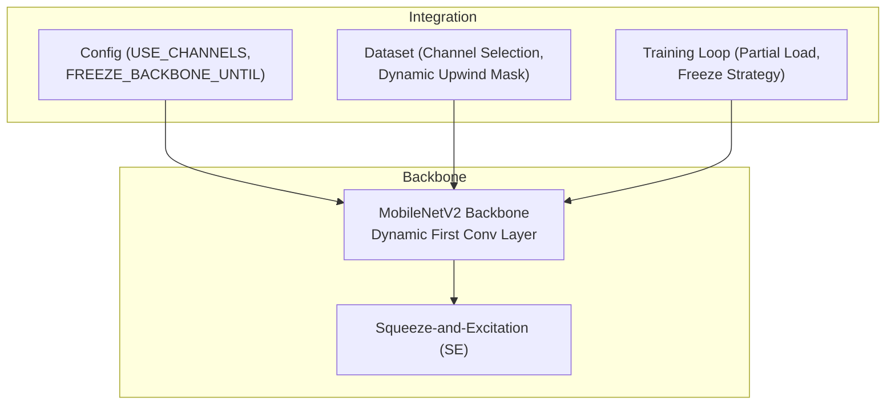
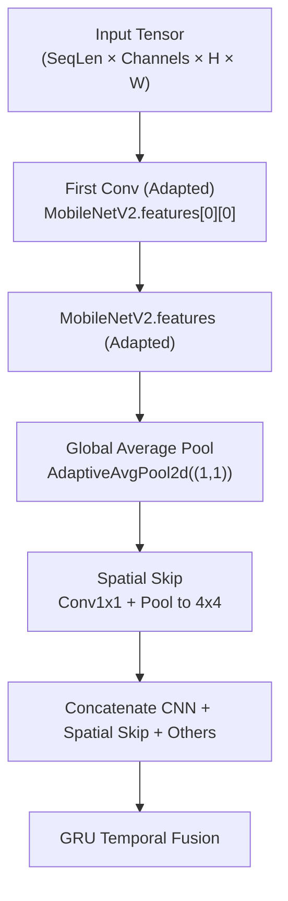
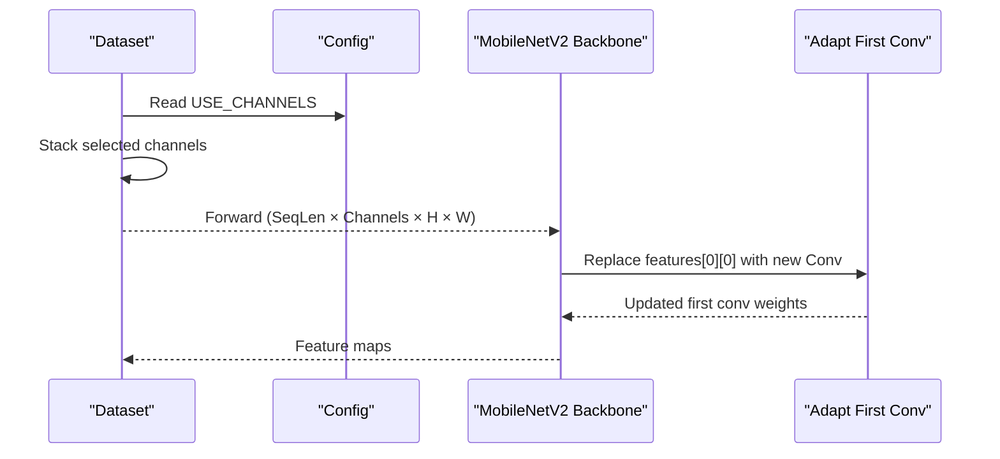
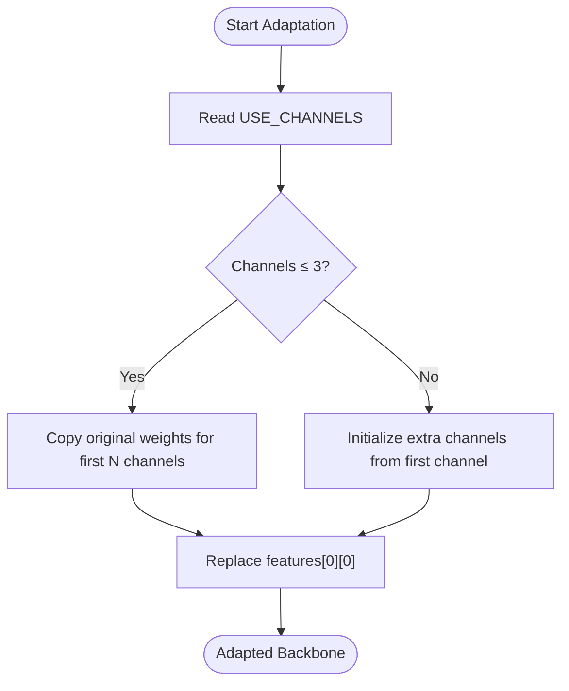
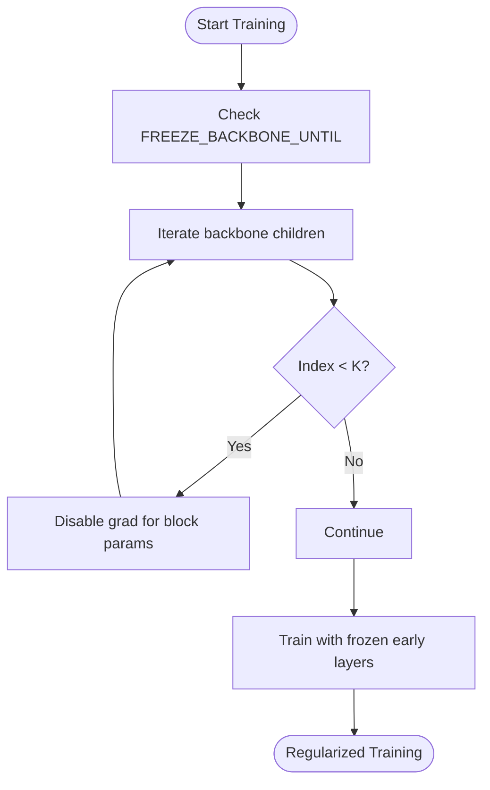
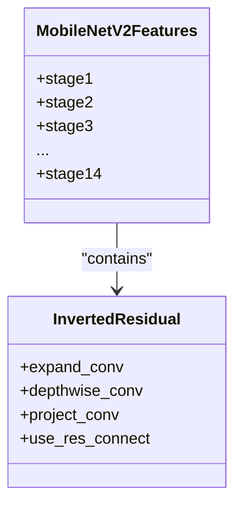
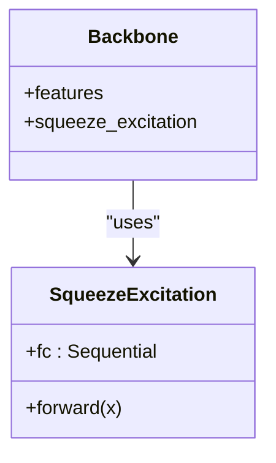
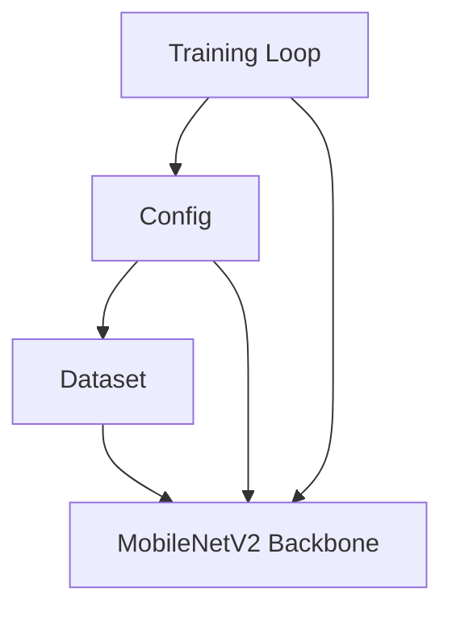

# CNN Backbone - MobileNetV2

<cite>
**Referenced Files in This Document**
- [model_ts_final.py](file://model_ts_final.py)
- [config_ts_final.py](file://config_ts_final.py)
- [dataset_ts_final.py](file://dataset_ts_final.py)
- [train_ts_final.py](file://train_ts_final.py)
- [utils_features.py](file://utils_features.py)
- [audit_report_part1.md](file://reports/audit_report_part1.md)
- [comprehensive_model_audit.md](file://reports/comprehensive_model_audit.md)
- [figure_ts.py](file://extras/figure_ts.py)
</cite>

## Table of Contents
1. [Introduction](#introduction)
2. [Project Structure](#project-structure)
3. [Core Components](#core-components)
4. [Architecture Overview](#architecture-overview)
5. [Detailed Component Analysis](#detailed-component-analysis)
6. [Dependency Analysis](#dependency-analysis)
7. [Performance Considerations](#performance-considerations)
8. [Troubleshooting Guide](#troubleshooting-guide)
9. [Conclusion](#conclusion)

## Introduction
This document explains the MobileNetV2 CNN backbone used in the thunderstorm nowcasting system. It covers dynamic channel adaptation for flexible multi-spectral inputs, the custom first convolution layer adaptation process, weight initialization strategies for multi-spectral channels, partial backbone freezing for regularization, and the overall backbone’s inverted residual building blocks. It also documents architectural details such as depthwise separable convolutions and Squeeze-and-Excitation modules, and provides parameter count analysis, computational efficiency metrics, and memory usage patterns. Finally, it outlines the design rationale for choosing MobileNetV2, performance benchmarks, and CPU inference optimization strategies.

## Project Structure
The MobileNetV2 backbone is part of the larger CNN-GRU architecture for spatio-temporal nowcasting. The backbone is embedded within the main model class and is dynamically adapted to the configured input channels. Supporting components include:
- Dynamic channel stacking in the dataset
- Configuration-driven backbone freezing
- Utility functions for METAR features and solar zenith computation

**Diagram sources**
- [model_ts_final.py:79-111](file://model_ts_final.py#L79-L111)
- [config_ts_final.py:32-29](file://config_ts_final.py#L32-L29)
- [dataset_ts_final.py:378-496](file://dataset_ts_final.py#L378-L496)
- [train_ts_final.py:335-379](file://train_ts_final.py#L335-L379)

**Section sources**
- [model_ts_final.py:79-111](file://model_ts_final.py#L79-L111)
- [config_ts_final.py:32-29](file://config_ts_final.py#L32-L29)
- [dataset_ts_final.py:378-496](file://dataset_ts_final.py#L378-L496)
- [train_ts_final.py:335-379](file://train_ts_final.py#L335-L379)

## Core Components
- Dynamic MobileNetV2 Backbone: The first convolution layer is replaced to accept a configurable number of input channels, initialized from the pre-trained ImageNet weights with a controlled strategy for extra channels.
- Squeeze-and-Excitation Module: A lightweight channel attention mechanism integrated into the backbone feature extraction path.
- Partial Backbone Freezing: The backbone can be partially frozen to reduce overfitting and stabilize training.
- Channel Flexibility: The dataset stacks channels according to configuration, enabling flexible input combinations (IR, cooling rate, texture, water vapor, derived differences, accelerations, trends).

**Section sources**
- [model_ts_final.py:79-111](file://model_ts_final.py#L79-L111)
- [model_ts_final.py:16-31](file://model_ts_final.py#L16-L31)
- [dataset_ts_final.py:378-496](file://dataset_ts_final.py#L378-L496)
- [config_ts_final.py:32-29](file://config_ts_final.py#L32-L29)

## Architecture Overview
The backbone is a MobileNetV2 feature extractor whose first convolution is adapted to the number of channels specified by configuration. The adapted backbone feeds into spatial skip connections and a GRU-based temporal fusion module. The dataset dynamically constructs the input tensor from the selected channels.

**Diagram sources**
- [model_ts_final.py:79-122](file://model_ts_final.py#L79-L122)
- [model_ts_final.py:202-247](file://model_ts_final.py#L202-L247)

**Section sources**
- [model_ts_final.py:79-122](file://model_ts_final.py#L79-L122)
- [model_ts_final.py:202-247](file://model_ts_final.py#L202-L247)

## Detailed Component Analysis

### Dynamic Channel Adaptation Mechanism
- Channel Selection: The dataset selects channels based on configuration and concatenates them along the channel dimension for each sequence.
- Backbone Adaptation: The model replaces the first convolution of MobileNetV2 with a new convolution that accepts the configured number of input channels. The new layer’s weights are initialized from the original first layer’s weights with a controlled strategy for extra channels.
- Partial Backbone Freezing: The model freezes the initial blocks of the backbone to regularize training and improve generalization.

**Diagram sources**
- [dataset_ts_final.py:378-496](file://dataset_ts_final.py#L378-L496)
- [model_ts_final.py:79-111](file://model_ts_final.py#L79-L111)

**Section sources**
- [dataset_ts_final.py:378-496](file://dataset_ts_final.py#L378-L496)
- [model_ts_final.py:79-111](file://model_ts_final.py#L79-L111)

### Custom First Convolution Layer Adaptation
- Replacement Strategy: The first convolution is replaced with a new convolution that matches the number of input channels. For channels beyond three, extra channels are initialized from the first channel’s weights with a controlled scaling.
- Initialization Rationale: This preserves learned low-level features while accommodating multi-spectral inputs.

**Diagram sources**
- [model_ts_final.py:88-100](file://model_ts_final.py#L88-L100)

**Section sources**
- [model_ts_final.py:88-100](file://model_ts_final.py#L88-L100)

### Partial Backbone Freezing for Regularization
- Freezing Strategy: The model iterates through the backbone’s children and disables gradient computation for the first K blocks, where K is configured.
- Impact: Reduces overfitting and stabilizes training, especially on limited datasets.

**Diagram sources**
- [model_ts_final.py:105-111](file://model_ts_final.py#L105-L111)
- [config_ts_final.py:29](file://config_ts_final.py#L29)

**Section sources**
- [model_ts_final.py:105-111](file://model_ts_final.py#L105-L111)
- [config_ts_final.py:29](file://config_ts_final.py#L29)

### Inverted Residual Blocks and Depthwise Separable Convolutions
- Inverted Residuals: MobileNetV2 uses inverted residuals with expand, depthwise, and project layers. The adapted first convolution feeds into this block structure.
- Depthwise Separable Convs: These reduce computation and memory compared to standard convolutions, aligning with the CPU inference targets.

**Diagram sources**
- [model_ts_final.py:79-111](file://model_ts_final.py#L79-L111)

**Section sources**
- [model_ts_final.py:79-111](file://model_ts_final.py#L79-L111)

### Squeeze-and-Excitation Modules
- Purpose: Channel-wise attention to recalibrate channel responses.
- Placement: Integrated into the backbone feature extraction path to emphasize informative channels.

**Diagram sources**
- [model_ts_final.py:16-31](file://model_ts_final.py#L16-L31)

**Section sources**
- [model_ts_final.py:16-31](file://model_ts_final.py#L16-L31)

### Parameter Count Analysis
- Backbone Parameters: MobileNetV2 with ImageNet weights contributes a substantial portion of parameters. The model applies partial freezing, reducing trainable parameters.
- Bottlenecks: Feature projection is a significant source of trainable parameters in the overall architecture.
- Observations:
  - The backbone itself is large but frozen for most blocks, limiting its contribution to trainable parameters.
  - Feature projection dominates the parameter count among dense layers.

**Section sources**
- [audit_report_part1.md:164-166](file://reports/audit_report_part1.md#L164-L166)
- [comprehensive_model_audit.md:195](file://reports/comprehensive_model_audit.md#L195)

### Computational Efficiency and Memory Usage
- Inference Speed: Single forward pass achieves approximately 31 FPS on CPU, meeting the operational target.
- Memory Footprint:
  - HDF5 LRU cache can reach several gigabytes; tuning cache size is recommended for constrained environments.
  - Training memory scales with batch size, sequence length, and input channels.
- Recommendations:
  - Reduce cache size for deployment.
  - Consider lowering dropout or feature projection dimensions if further memory savings are needed.

**Section sources**
- [audit_report_part1.md:170-179](file://reports/audit_report_part1.md#L170-L179)

### Design Rationale for MobileNetV2
- Lightweight and Efficient: MobileNetV2 offers strong feature extraction with fewer parameters and computations compared to larger backbones, suitable for CPU inference.
- Depthwise Separable Convolutions: Align with the goal of reducing compute while maintaining accuracy.
- Transfer Learning: Using ImageNet-pretrained weights enables fast convergence and strong initialization.

**Section sources**
- [comprehensive_model_audit.md:261-268](file://reports/comprehensive_model_audit.md#L261-L268)

### Performance Benchmarks and Evaluation
- Training and Evaluation: The training loop supports multiple heads and evaluation metrics, including event-weighted CSI, FAR, POD, and lead-time statistics.
- Metrics: The system tracks frame and event metrics, severity-weighted scores, and lead-time distributions.

**Section sources**
- [train_ts_final.py:450-558](file://train_ts_final.py#L450-L558)

### CPU Inference Optimization Strategies
- Backbone Freezing: Reduces overfitting and speeds up training; beneficial for CPU inference stability.
- Feature Projection Tuning: Adjust dimensions to balance representational capacity and speed.
- Dropout and Regularization: Controlled dropout and freezing help maintain generalization on CPU hardware.

**Section sources**
- [config_ts_final.py:29](file://config_ts_final.py#L29)
- [model_ts_final.py:155-161](file://model_ts_final.py#L155-L161)

## Dependency Analysis
The backbone depends on configuration for channel counts and freezing thresholds, and on the dataset for constructing inputs. The training loop handles partial state loading and freezing during resumption.

**Diagram sources**
- [config_ts_final.py:32-29](file://config_ts_final.py#L32-L29)
- [dataset_ts_final.py:378-496](file://dataset_ts_final.py#L378-L496)
- [model_ts_final.py:79-111](file://model_ts_final.py#L79-L111)
- [train_ts_final.py:335-379](file://train_ts_final.py#L335-L379)

**Section sources**
- [config_ts_final.py:32-29](file://config_ts_final.py#L32-L29)
- [dataset_ts_final.py:378-496](file://dataset_ts_final.py#L378-L496)
- [model_ts_final.py:79-111](file://model_ts_final.py#L79-L111)
- [train_ts_final.py:335-379](file://train_ts_final.py#L335-L379)

## Performance Considerations
- Backbone Efficiency: Depthwise separable convolutions and inverted residuals reduce compute and memory.
- Freezing Strategy: Partial freezing reduces overfitting and stabilizes training on small datasets.
- Feature Projection: Dense layers dominate parameter count; consider dimensionality reductions if needed.
- Inference Targets: The system targets 31 FPS on CPU; monitor cache sizes and batch configurations for deployment.

[No sources needed since this section provides general guidance]

## Troubleshooting Guide
- Channel Mismatch During Resume: The training loop attempts strict loading and falls back to partial loading when the number of channels differs between checkpoints and the current configuration.
- Backbone Freezing: Verify FREEZE_BACKBONE_UNTIL to ensure early layers are properly frozen.
- METAR and Time Features: Ensure USE_METAR_FEATURES and USE_MONTH flags match the model’s expectations.

**Section sources**
- [train_ts_final.py:335-379](file://train_ts_final.py#L335-L379)
- [config_ts_final.py:29](file://config_ts_final.py#L29)
- [model_ts_final.py:133-149](file://model_ts_final.py#L133-L149)

## Conclusion
The MobileNetV2 backbone is dynamically adapted to support flexible multi-spectral inputs, initialized carefully for extra channels, and partially frozen to regularize training. Its depthwise separable convolutions and inverted residuals align with CPU inference targets, while the Squeeze-and-Excitation module enhances channel attention. Together with the dataset’s dynamic channel stacking and the training loop’s partial loading strategy, the system achieves efficient and robust thunderstorm nowcasting suitable for operational deployment.