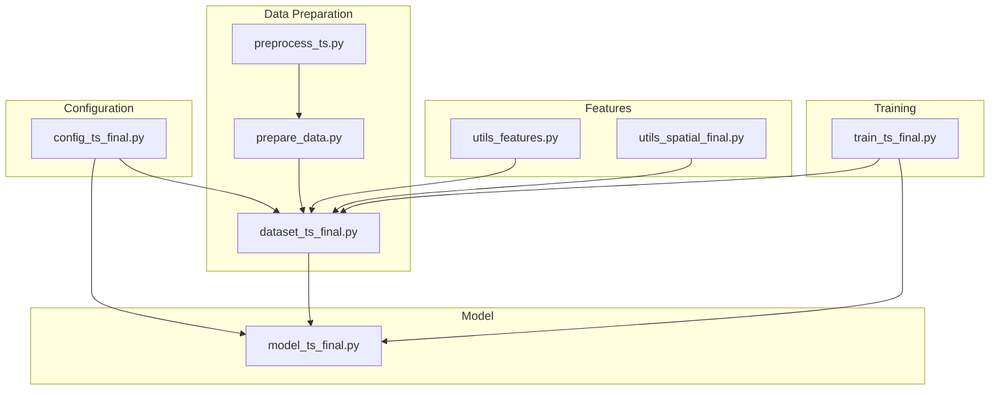
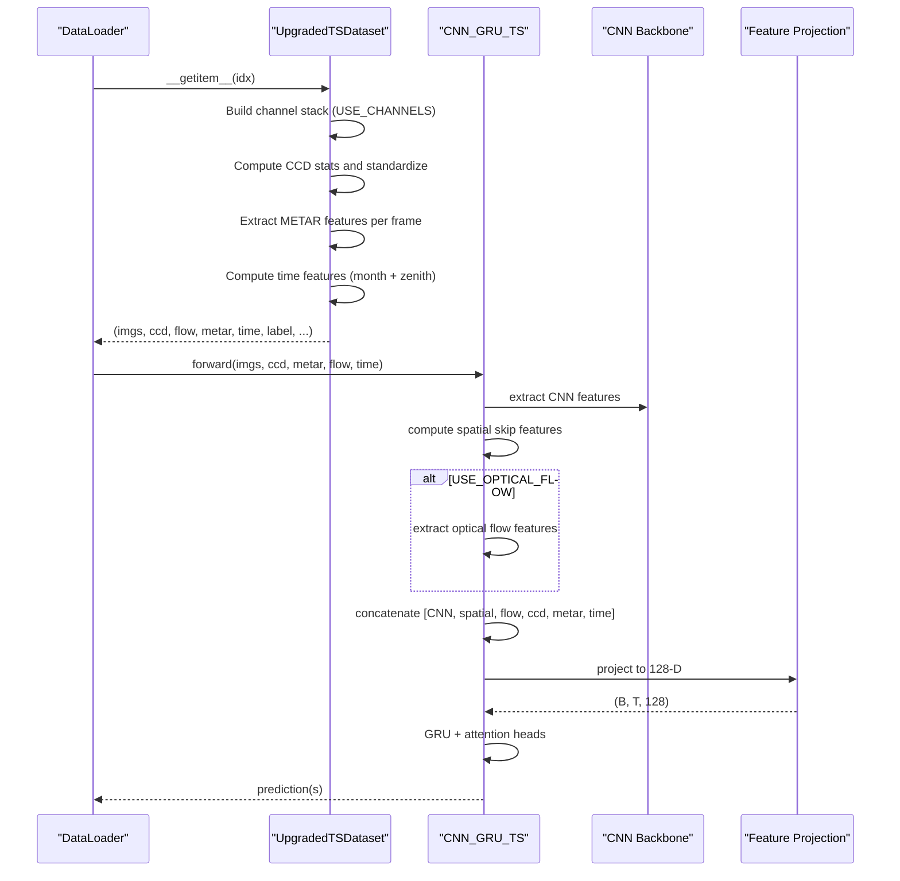
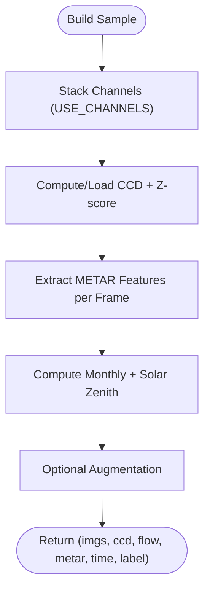
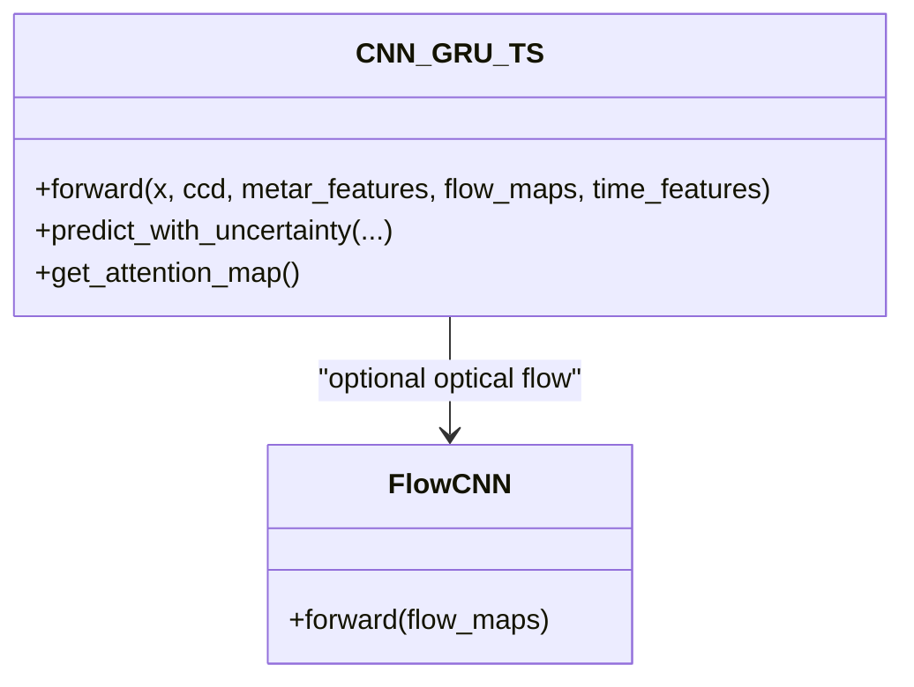
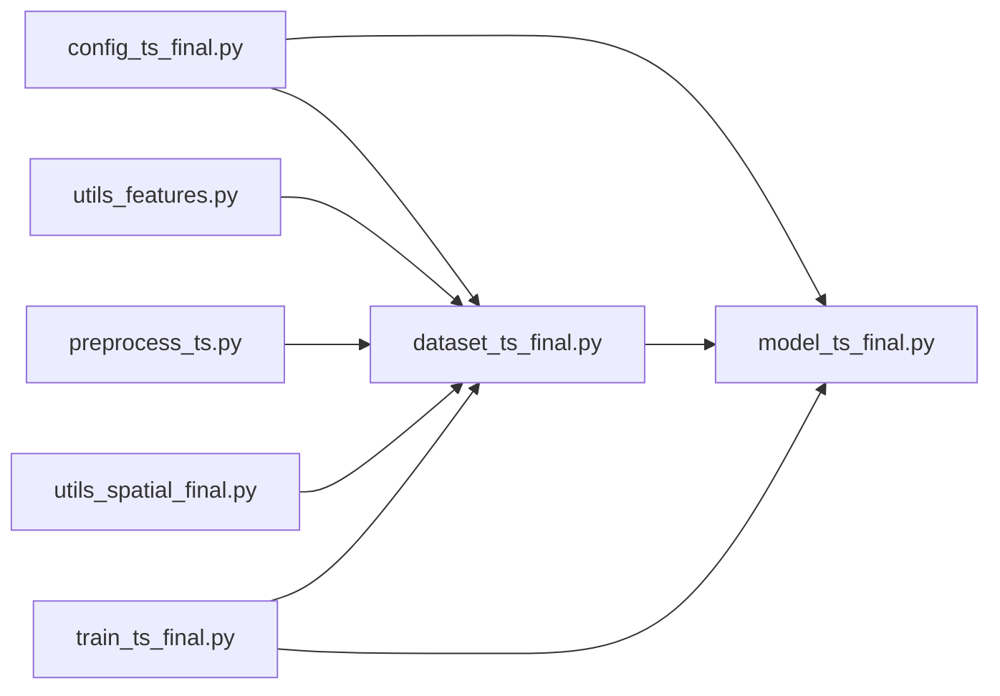

# Multi-Modal Feature Integration

<cite>
**Referenced Files in This Document**
- [config_ts_final.py](file://config_ts_final.py)
- [model_ts_final.py](file://model_ts_final.py)
- [dataset_ts_final.py](file://dataset_ts_final.py)
- [utils_features.py](file://utils_features.py)
- [preprocess_ts.py](file://preprocess_ts.py)
- [prepare_data.py](file://prepare_data.py)
- [utils_spatial_final.py](file://utils_spatial_final.py)
- [train_ts_final.py](file://train_ts_final.py)
</cite>

## Table of Contents
1. [Introduction](#introduction)
2. [Project Structure](#project-structure)
3. [Core Components](#core-components)
4. [Architecture Overview](#architecture-overview)
5. [Detailed Component Analysis](#detailed-component-analysis)
6. [Dependency Analysis](#dependency-analysis)
7. [Performance Considerations](#performance-considerations)
8. [Troubleshooting Guide](#troubleshooting-guide)
9. [Conclusion](#conclusion)

## Introduction
This document describes the multi-modal feature integration system that combines diverse input sources for comprehensive weather prediction. It explains the feature projection and concatenation pipeline that unifies CNN features, spatial skip features, optical flow features, Cold Cloud Duration (CCD) features, METAR meteorological features, and temporal/monthly cycle features into a unified 128-dimensional projection space. The system is designed to be modular, configuration-driven, and flexible to adapt to different sensor combinations and data availability scenarios.

## Project Structure
The multi-modal integration spans several modules:
- Configuration defines feature flags and modalities.
- Dataset builds sequences and prepares features per time step.
- Model performs CNN backbone extraction, spatial skip connections, optional optical flow processing, and feature projection to a unified 128-D space.
- Utilities extract METAR features, compute CCD, and provide spatial masks.
- Training orchestrates data loading, model forward passes, and loss computation.

**Diagram sources**
- [config_ts_final.py:16-211](file://config_ts_final.py#L16-L211)
- [prepare_data.py:39-132](file://prepare_data.py#L39-L132)
- [preprocess_ts.py:27-117](file://preprocess_ts.py#L27-L117)
- [dataset_ts_final.py:47-535](file://dataset_ts_final.py#L47-L535)
- [utils_features.py:11-191](file://utils_features.py#L11-L191)
- [utils_spatial_final.py:12-80](file://utils_spatial_final.py#L12-L80)
- [model_ts_final.py:68-335](file://model_ts_final.py#L68-L335)
- [train_ts_final.py:142-757](file://train_ts_final.py#L142-L757)

**Section sources**
- [config_ts_final.py:16-211](file://config_ts_final.py#L16-L211)
- [dataset_ts_final.py:47-535](file://dataset_ts_final.py#L47-L535)
- [model_ts_final.py:68-335](file://model_ts_final.py#L68-L335)
- [utils_features.py:11-191](file://utils_features.py#L11-L191)
- [preprocess_ts.py:27-117](file://preprocess_ts.py#L27-L117)
- [prepare_data.py:39-132](file://prepare_data.py#L39-L132)
- [utils_spatial_final.py:12-80](file://utils_spatial_final.py#L12-L80)
- [train_ts_final.py:142-757](file://train_ts_final.py#L142-L757)

## Core Components
- Configuration flags control inclusion of channels, optical flow, METAR features, monthly features, and CCD.
- Dataset builds sequences and computes standardized CCD, METAR features aligned to timestamps, and time-of-year features.
- Model extracts CNN features, spatial skip features, optional optical flow features, concatenates all modalities, projects to 128-D, and feeds a GRU with attention.
- Utilities provide METAR feature extraction, CCD computation, and spatial masks.

Key responsibilities:
- Dynamic channel adaptation for the CNN backbone based on configuration.
- Unified 128-D projection space for all modalities.
- Learnable scaling of METAR features via a scalar parameter.
- Optional optical flow processing and dynamic upwind masking.

**Section sources**
- [config_ts_final.py:32-127](file://config_ts_final.py#L32-L127)
- [dataset_ts_final.py:394-535](file://dataset_ts_final.py#L394-L535)
- [model_ts_final.py:75-269](file://model_ts_final.py#L75-L269)
- [utils_features.py:11-191](file://utils_features.py#L11-L191)

## Architecture Overview
The multi-modal integration pipeline follows a staged approach:
1. Sensor channels are dynamically stacked according to configuration.
2. CNN backbone extracts per-frame features; spatial skip features are derived from low-resolution activations.
3. Optional optical flow features are extracted from concatenated flow maps.
4. CCD features are standardized and appended.
5. METAR features are projected and scaled, then concatenated.
6. Monthly/time-of-year features are projected and concatenated.
7. All features are concatenated along the feature dimension and projected to 128-D.
8. A GRU processes the temporal sequence with attention, producing a final prediction head.

**Diagram sources**
- [dataset_ts_final.py:394-535](file://dataset_ts_final.py#L394-L535)
- [model_ts_final.py:202-269](file://model_ts_final.py#L202-L269)

**Section sources**
- [dataset_ts_final.py:394-535](file://dataset_ts_final.py#L394-L535)
- [model_ts_final.py:202-269](file://model_ts_final.py#L202-L269)

## Detailed Component Analysis

### Configuration-Driven Feature Integration
- Channel selection: USE_CHANNELS determines the input channels to the CNN backbone.
- Modal toggles: USE_OPTICAL_FLOW, USE_METAR_FEATURES, USE_MONTH, USE_CCD.
- Scaling: METAR scaling is learned via a scalar parameter in the model.
- Dimensionality targets: The model projects all features into a fixed 128-D space.

Dynamic dimension calculation:
- CNN backbone: 1280-dim global features plus 256-dim spatial skip features.
- Optical flow: 64-dim features when enabled.
- CCD: 6-dim standardized features.
- METAR: 32-dim projected features scaled by a learnable parameter.
- Time: 16-dim projected monthly/time features.
- Total raw features: sum of the above; projected to 128-D via linear projection.

Impact on performance:
- Enabling optical flow reduces computational cost but contributes minimally.
- METAR features are learnable and can be scaled to balance influence.
- CCD normalization improves stability and generalization.
- Time features recover lead-time robustness.

**Section sources**
- [config_ts_final.py:32-127](file://config_ts_final.py#L32-L127)
- [model_ts_final.py:113-161](file://model_ts_final.py#L113-L161)
- [dataset_ts_final.py:417-455](file://dataset_ts_final.py#L417-L455)

### Dataset-Level Feature Construction
- Channel stacking: Channels are concatenated based on USE_CHANNELS; defaults to seven IR/WV-derived channels plus two additional features.
- Optical flow: Concatenated from IR and WV flows when enabled.
- CCD: Computed per frame and standardized using dataset-level statistics.
- METAR: Extracted per frame using a feature extractor aligned to image timestamps; normalized to typical ranges.
- Time features: Monthly sine/cosine and solar zenith angle normalized to [-1, 1].
- Data augmentation: Horizontal flip, temporal masking, channel dropout, and Gaussian noise during training.

**Diagram sources**
- [dataset_ts_final.py:398-535](file://dataset_ts_final.py#L398-L535)

**Section sources**
- [dataset_ts_final.py:398-535](file://dataset_ts_final.py#L398-L535)
- [preprocess_ts.py:27-117](file://preprocess_ts.py#L27-L117)
- [utils_features.py:11-191](file://utils_features.py#L11-L191)

### Model-Level Feature Combination and Projection
- CNN backbone: MobileNetV2 adapted to dynamic input channels; global and spatial skip features are extracted.
- Spatial skip: Low-resolution grid features reduce dimensionality while preserving spatial context.
- Optical flow: Lightweight CNN processes concatenated flow maps to 64-D features.
- METAR: Linear projection to 32-D with learnable scaling parameter.
- Time: Linear projection to 16-D from month and zenith features.
- Concatenation: All modalities concatenated along the feature dimension.
- Projection: Linear projection to 128-D with layer normalization and dropout.
- Temporal processing: GRU with attention for temporal fusion and interpretability.

**Diagram sources**
- [model_ts_final.py:68-335](file://model_ts_final.py#L68-L335)

**Section sources**
- [model_ts_final.py:75-269](file://model_ts_final.py#L75-L269)

### METAR Feature Scaling Mechanism
- METAR features are projected to 32-D and multiplied by a learnable scalar parameter.
- During training, the scalar adapts to balance METAR influence against other modalities.
- The scalar is logged periodically to monitor adaptation.

**Section sources**
- [model_ts_final.py:134-140](file://model_ts_final.py#L134-L140)
- [train_ts_final.py:633-635](file://train_ts_final.py#L633-L635)

### Unified 128-Dimensional Projection Space
- The model concatenates all modalities and projects to a fixed 128-D space.
- This enables consistent temporal modeling regardless of which modalities are included.
- The projection layer uses layer normalization and dropout to stabilize training.

**Section sources**
- [model_ts_final.py:156-161](file://model_ts_final.py#L156-L161)

### Modular Nature and Flexibility
- Channel selection: USE_CHANNELS allows swapping or removing channels without changing the model structure.
- Optional modalities: Optical flow, METAR, and monthly features can be toggled independently.
- Data availability: The dataset gracefully handles missing data by returning zeros or defaults.
- Dynamic upwind masking: Adjusts spatial focus based on flow-derived advection.

**Section sources**
- [config_ts_final.py:32-127](file://config_ts_final.py#L32-L127)
- [dataset_ts_final.py:517-532](file://dataset_ts_final.py#L517-L532)

## Dependency Analysis
The feature integration depends on:
- Configuration flags controlling modalities and dimensions.
- Dataset preparation of per-frame features and augmentations.
- Model projection and temporal fusion.
- Utilities for CCD computation and spatial masks.

**Diagram sources**
- [config_ts_final.py:16-211](file://config_ts_final.py#L16-L211)
- [dataset_ts_final.py:47-535](file://dataset_ts_final.py#L47-L535)
- [model_ts_final.py:68-335](file://model_ts_final.py#L68-L335)
- [utils_features.py:11-191](file://utils_features.py#L11-L191)
- [preprocess_ts.py:27-117](file://preprocess_ts.py#L27-L117)
- [utils_spatial_final.py:12-80](file://utils_spatial_final.py#L12-L80)
- [train_ts_final.py:142-757](file://train_ts_final.py#L142-L757)

**Section sources**
- [config_ts_final.py:16-211](file://config_ts_final.py#L16-L211)
- [dataset_ts_final.py:47-535](file://dataset_ts_final.py#L47-L535)
- [model_ts_final.py:68-335](file://model_ts_final.py#L68-L335)
- [utils_features.py:11-191](file://utils_features.py#L11-L191)
- [preprocess_ts.py:27-117](file://preprocess_ts.py#L27-L117)
- [utils_spatial_final.py:12-80](file://utils_spatial_final.py#L12-L80)
- [train_ts_final.py:142-757](file://train_ts_final.py#L142-L757)

## Performance Considerations
- Computational efficiency: Optical flow is optional to reduce compute; the model targets CPU inference throughput.
- Regularization: Dropout, layer normalization, and freezing backbone layers mitigate overfitting.
- Stability: Layer normalization and dropout in the projection layer improve numerical stability.
- Data quality: CCD standardization and METAR normalization reduce variability across sensors and seasons.

[No sources needed since this section provides general guidance]

## Troubleshooting Guide
Common issues and resolutions:
- Missing METAR data: The extractor falls back to default features; ensure METAR file path is correct in configuration.
- Empty or misaligned CCD: The dataset loads CCD features per timestamp; verify CCD file and timestamp parsing.
- Channel mismatch: If resuming from checkpoints with different channel configurations, the model attempts a partial load; verify USE_CHANNELS alignment.
- Optical flow disabled: If optical flow is disabled, flow tensors are zero-sized; ensure downstream code checks for enabled flags.
- Dynamic upwind masking: If flow is unavailable, masking falls back to static center; verify flow computation and configuration.

**Section sources**
- [utils_features.py:24-35](file://utils_features.py#L24-L35)
- [dataset_ts_final.py:104-123](file://dataset_ts_final.py#L104-L123)
- [train_ts_final.py:336-378](file://train_ts_final.py#L336-L378)
- [dataset_ts_final.py:417-418](file://dataset_ts_final.py#L417-L418)
- [dataset_ts_final.py:517-532](file://dataset_ts_final.py#L517-L532)

## Conclusion
The multi-modal feature integration system provides a robust, modular framework for combining diverse weather inputs. By dynamically adapting to available modalities, projecting all features into a unified 128-D space, and incorporating learnable scaling for METAR features, the system achieves strong performance while remaining flexible to varying sensor combinations and data availability. Configuration flags enable precise control over which modalities contribute, and the dataset-level preprocessing ensures consistent feature formatting across time and space.