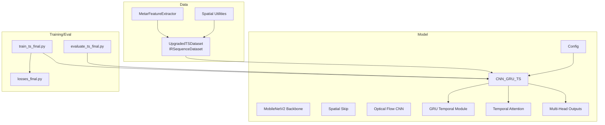
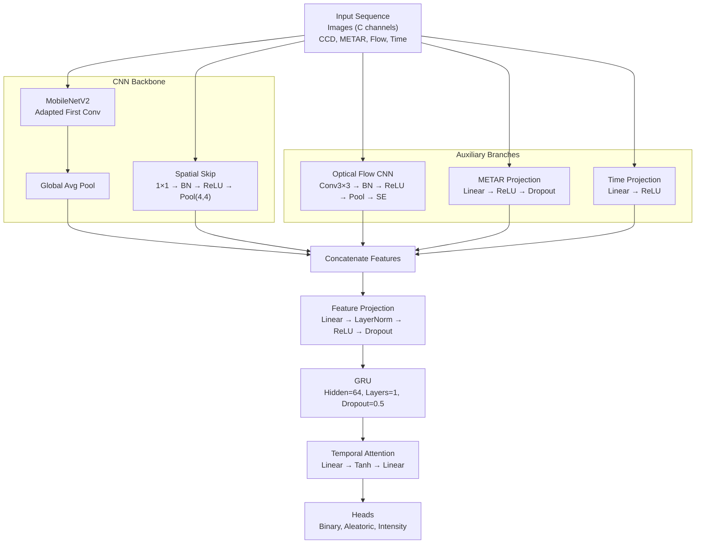
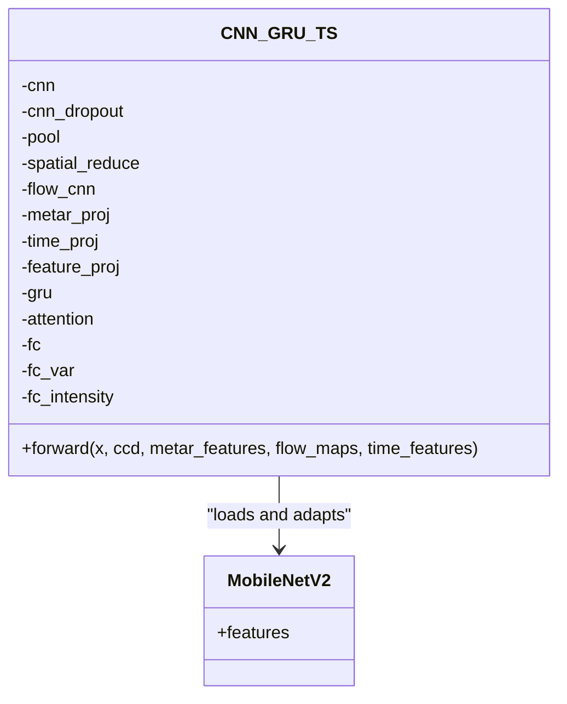
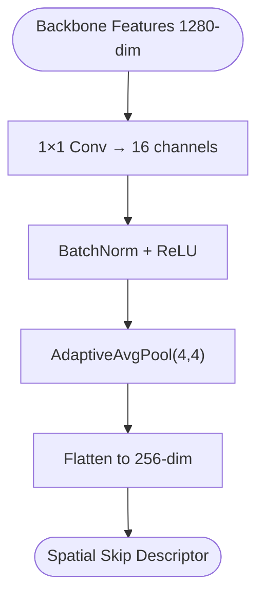
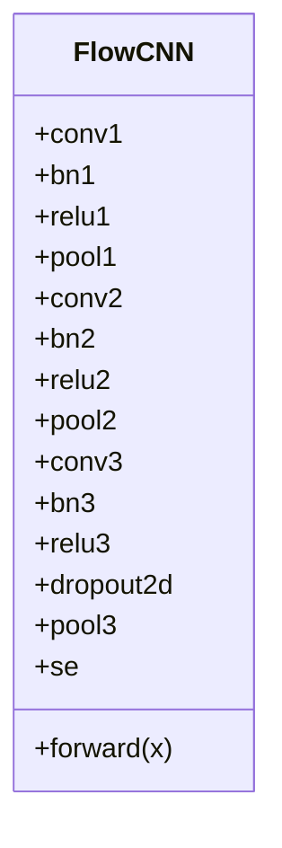
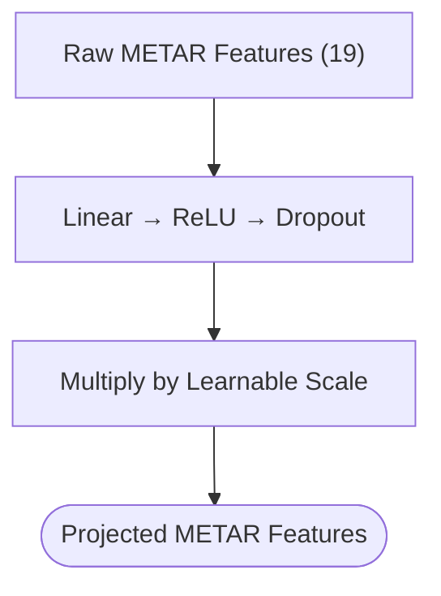
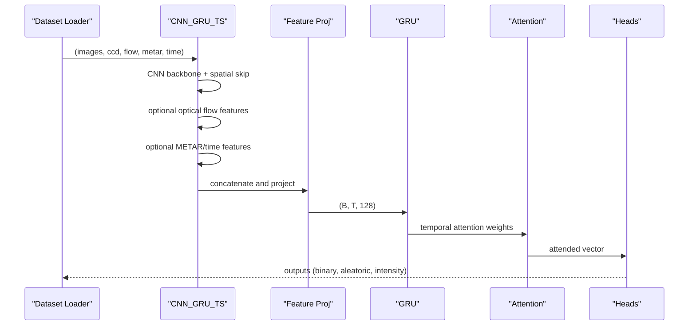
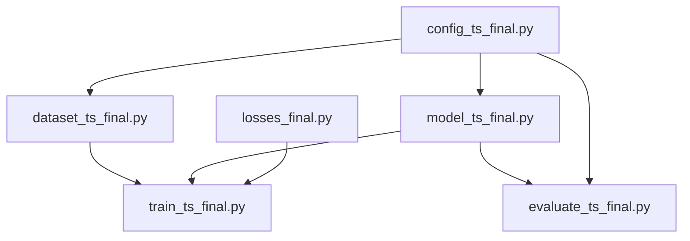

# Neural Network Architecture

<cite>
**Referenced Files in This Document**
- [model_ts_final.py](file://model_ts_final.py)
- [config_ts_final.py](file://config_ts_final.py)
- [dataset_ts_final.py](file://dataset_ts_final.py)
- [train_ts_final.py](file://train_ts_final.py)
- [evaluate_ts_final.py](file://evaluate_ts_final.py)
- [losses_final.py](file://losses_final.py)
- [utils_features.py](file://utils_features.py)
- [utils_spatial_final.py](file://utils_spatial_final.py)
- [master.py](file://master.py)
</cite>

## Table of Contents
1. [Introduction](#introduction)
2. [Project Structure](#project-structure)
3. [Core Components](#core-components)
4. [Architecture Overview](#architecture-overview)
5. [Detailed Component Analysis](#detailed-component-analysis)
6. [Dependency Analysis](#dependency-analysis)
7. [Performance Considerations](#performance-considerations)
8. [Troubleshooting Guide](#troubleshooting-guide)
9. [Conclusion](#conclusion)
10. [Appendices](#appendices)

## Introduction
This document describes the CNN-GRU hybrid neural network architecture used for thunderstorm nowcasting. The system integrates multi-spectral satellite imagery (IR, water vapor, texture, cooling rate, and derived differences), optional optical flow motion cues, METAR-derived atmospheric features, and temporal metadata (month and solar zenith) into a unified temporal sequence model. The architecture emphasizes:
- A MobileNetV2 backbone with dynamic input channel adaptation for flexible multi-spectral inputs
- Spatial skip connections to preserve low-resolution spatial context
- An optical flow CNN branch for motion feature extraction
- A GRU-based temporal fusion module with attention-based pooling
- Multi-head outputs: binary classification, aleatoric uncertainty, and intensity regression
- CPU-friendly design with explicit parameter and memory optimizations

## Project Structure
The repository organizes training, evaluation, and model definition into focused modules:
- Model definition and forward pass: [model_ts_final.py](file://model_ts_final.py)
- Configuration and hyperparameters: [config_ts_final.py](file://config_ts_final.py)
- Dataset construction and augmentation: [dataset_ts_final.py](file://dataset_ts_final.py)
- Training loop and loss orchestration: [train_ts_final.py](file://train_ts_final.py)
- Evaluation and metrics: [evaluate_ts_final.py](file://evaluate_ts_final.py)
- Loss functions: [losses_final.py](file://losses_final.py)
- Meteorological feature extraction: [utils_features.py](file://utils_features.py)
- Spatial utilities: [utils_spatial_final.py](file://utils_spatial_final.py)
- Master pipeline runner: [master.py](file://master.py)

**Diagram sources**
- [model_ts_final.py:68-269](file://model_ts_final.py#L68-L269)
- [config_ts_final.py:16-208](file://config_ts_final.py#L16-L208)
- [dataset_ts_final.py:47-515](file://dataset_ts_final.py#L47-L515)
- [train_ts_final.py:142-757](file://train_ts_final.py#L142-L757)
- [evaluate_ts_final.py:361-908](file://evaluate_ts_final.py#L361-L908)
- [losses_final.py:13-258](file://losses_final.py#L13-L258)

**Section sources**
- [model_ts_final.py:68-269](file://model_ts_final.py#L68-L269)
- [config_ts_final.py:16-208](file://config_ts_final.py#L16-L208)
- [dataset_ts_final.py:47-515](file://dataset_ts_final.py#L47-L515)
- [train_ts_final.py:142-757](file://train_ts_final.py#L142-L757)
- [evaluate_ts_final.py:361-908](file://evaluate_ts_final.py#L361-L908)
- [losses_final.py:13-258](file://losses_final.py#L13-L258)

## Core Components
- MobileNetV2 backbone with dynamic input channel adaptation to support flexible multi-spectral inputs
- Spatial skip connection extracting low-resolution spatial features from the backbone
- Optional optical flow CNN branch for motion context
- METAR feature projection and time metadata projection
- GRU temporal fusion with attention-based sequence modeling
- Multi-head outputs: binary classification, aleatoric uncertainty, and intensity regression

**Section sources**
- [model_ts_final.py:68-269](file://model_ts_final.py#L68-L269)
- [config_ts_final.py:23-83](file://config_ts_final.py#L23-L83)

## Architecture Overview
The end-to-end pipeline processes sequences of multi-spectral images and auxiliary features through a CNN backbone, extracts spatial skip features, optionally augments with optical flow, and fuses temporally with a GRU. Attention pooling produces a compact temporal representation, which feeds multiple heads for classification, uncertainty, and intensity.

**Diagram sources**
- [model_ts_final.py:68-269](file://model_ts_final.py#L68-L269)
- [model_ts_final.py:34-66](file://model_ts_final.py#L34-L66)

## Detailed Component Analysis

### MobileNetV2 Backbone and Dynamic Channel Adaptation
- The backbone is initialized from a pretrained ImageNet model and the first convolution is adapted to accept a variable number of input channels based on the configured channel set.
- When channels exceed 3, the extra channels reuse the first channel’s weights with halving to distribute information across the new channels.
- Backbones can be partially frozen to reduce overfitting during training.

**Diagram sources**
- [model_ts_final.py:68-113](file://model_ts_final.py#L68-L113)

**Section sources**
- [model_ts_final.py:79-113](file://model_ts_final.py#L79-L113)

### Spatial Skip Connections for Low-Resolution Grid Processing
- A 1×1 convolution reduces the 1280-dim backbone features to 16 channels, followed by batch normalization, ReLU, and adaptive pooling to 4×4, yielding a 256-dim spatial descriptor per timestep.
- These descriptors are concatenated with CNN global features and other auxiliary features before temporal fusion.

**Diagram sources**
- [model_ts_final.py:115-122](file://model_ts_final.py#L115-L122)

**Section sources**
- [model_ts_final.py:115-122](file://model_ts_final.py#L115-L122)

### Optical Flow CNN Branch
- A lightweight CNN extracts motion features from 4-channel optical flow maps (IR and water vapor flow).
- The branch includes stacked convolutions, batch normalization, ReLU, max pooling, dropout, and squeeze-and-excitation, ending in global pooling to a fixed-size vector.

**Diagram sources**
- [model_ts_final.py:34-66](file://model_ts_final.py#L34-L66)

**Section sources**
- [model_ts_final.py:124-129](file://model_ts_final.py#L124-L129)
- [model_ts_final.py:34-66](file://model_ts_final.py#L34-L66)

### METAR Feature Projection System
- METAR features are projected from 19-dimensional inputs to 32-dim using a linear layer with ReLU and dropout.
- A learnable scale parameter modulates the influence of METAR features in the fused representation.

**Diagram sources**
- [model_ts_final.py:131-141](file://model_ts_final.py#L131-L141)

**Section sources**
- [model_ts_final.py:131-141](file://model_ts_final.py#L131-L141)
- [utils_features.py:11-171](file://utils_features.py#L11-L171)

### Time Features Projection
- Monthly and solar zenith features are projected to 16-dim using a linear layer with ReLU.

**Section sources**
- [model_ts_final.py:142-149](file://model_ts_final.py#L142-L149)
- [utils_features.py:173-191](file://utils_features.py#L173-L191)

### Temporal Feature Integration and GRU Fusion
- Features are concatenated along the channel dimension and projected to a 128-dim latent space.
- The sequence is processed by a single-layer GRU with dropout, followed by attention-based temporal pooling to produce a single-vector representation.

**Diagram sources**
- [model_ts_final.py:202-269](file://model_ts_final.py#L202-L269)

**Section sources**
- [model_ts_final.py:151-177](file://model_ts_final.py#L151-L177)
- [model_ts_final.py:202-269](file://model_ts_final.py#L202-L269)

### Multi-Head Output Architecture
- Binary classification head: single output with sigmoid activation (or two logits for evidential learning)
- Aleatoric uncertainty head: log-variance output for heteroscedastic uncertainty
- Intensity regression head: continuous severity score in [0, 10]

**Section sources**
- [model_ts_final.py:179-198](file://model_ts_final.py#L179-L198)

### Attention-Based Sequence Modeling
- A shallow attention network produces per-timestep weights, which are softmax-normalized and used to compute a weighted sum over the GRU outputs.

**Section sources**
- [model_ts_final.py:172-177](file://model_ts_final.py#L172-L177)

### Uncertainty Estimation Strategies
- Evidential Deep Learning (EDL): returns predictive probability and epistemic uncertainty in a single pass
- Monte Carlo Dropout: runs multiple forward passes to estimate epistemic uncertainty; aleatoric uncertainty can be estimated via heteroscedastic outputs

**Section sources**
- [model_ts_final.py:274-335](file://model_ts_final.py#L274-L335)

### Dataset Construction and Augmentation
- The dataset loads HDF5 files containing multi-spectral channels and optical flow maps, stacks channels according to configuration, standardizes CCD features, and constructs METAR features aligned to timestamps.
- Augmentations include horizontal flip, frame masking, channel dropout, and Gaussian noise.

**Section sources**
- [dataset_ts_final.py:47-515](file://dataset_ts_final.py#L47-L515)
- [utils_features.py:11-171](file://utils_features.py#L11-L171)
- [utils_spatial_final.py:12-65](file://utils_spatial_final.py#L12-L65)

### Loss Functions and Training Orchestration
- Supports focal loss with late penalty, asymmetric time-aware loss, evidential binary loss, heteroscedastic loss, and intensity regression loss.
- Training includes class-balanced sampling, OHEM, SWA, and temporal smoothing.

**Section sources**
- [losses_final.py:13-258](file://losses_final.py#L13-L258)
- [train_ts_final.py:285-448](file://train_ts_final.py#L285-L448)

## Dependency Analysis
The model depends on configuration flags to conditionally enable branches and heads. The dataset and training scripts coordinate data loading, augmentation, and evaluation.

**Diagram sources**
- [config_ts_final.py:16-208](file://config_ts_final.py#L16-L208)
- [dataset_ts_final.py:47-515](file://dataset_ts_final.py#L47-L515)
- [train_ts_final.py:142-757](file://train_ts_final.py#L142-L757)
- [evaluate_ts_final.py:361-908](file://evaluate_ts_final.py#L361-L908)
- [losses_final.py:13-258](file://losses_final.py#L13-L258)
- [model_ts_final.py:68-269](file://model_ts_final.py#L68-L269)

**Section sources**
- [config_ts_final.py:16-208](file://config_ts_final.py#L16-L208)
- [dataset_ts_final.py:47-515](file://dataset_ts_final.py#L47-L515)
- [train_ts_final.py:142-757](file://train_ts_final.py#L142-L757)
- [evaluate_ts_final.py:361-908](file://evaluate_ts_final.py#L361-L908)
- [losses_final.py:13-258](file://losses_final.py#L13-L258)
- [model_ts_final.py:68-269](file://model_ts_final.py#L68-L269)

## Performance Considerations
- Parameter counts and computational efficiency:
  - Backbone: MobileNetV2 with adapted first conv and partial freezing
  - Spatial skip: 1×1 conv + adaptive pool yields 256-dim descriptors
  - Feature projection: 128-dim latent space reduces downstream computation
  - GRU: hidden size 64, single layer, dropout 0.5
  - Heads: binary, aleatoric, and intensity outputs
- Memory usage patterns:
  - Feature extraction computes per-frame CNN features and pools to 1×1
  - GRU stores hidden states per timestep
  - Attention weights are cached for interpretability
- CPU inference optimization:
  - Reduced hidden size and single GRU layer
  - Dropout-based uncertainty (EDL) avoids expensive MC sampling
  - Lightweight optical flow branch disabled by default to save compute

[No sources needed since this section provides general guidance]

## Troubleshooting Guide
- Channel mismatch when resuming training:
  - The model attempts strict load first, then falls back to partial load if dynamic channel changes occurred.
- SWA batch norm updates:
  - Custom update function ensures SWA-compatible batch norm statistics.
- Attention weights:
  - Attention weights are stored on the model and can be retrieved for interpretability.

**Section sources**
- [train_ts_final.py:335-379](file://train_ts_final.py#L335-L379)
- [train_ts_final.py:99-136](file://train_ts_final.py#L99-L136)
- [model_ts_final.py:270-273](file://model_ts_final.py#L270-L273)

## Conclusion
The CNN-GRU hybrid architecture combines strong spatial feature extraction from a pretrained MobileNetV2 backbone with temporal fusion via GRU and attention. Conditional branches for optical flow, METAR, and time metadata enable flexible integration of environmental context. The design emphasizes CPU-friendly inference, reduced parameters, and practical uncertainty quantification, enabling real-time thunderstorm nowcasting with interpretable attention maps and robust evaluation metrics.

[No sources needed since this section summarizes without analyzing specific files]

## Appendices

### Appendix A: Configuration Highlights
- Model architecture: hidden size 64, 1 GRU layer, dropout 0.5, sequence length 5, lead time 60 minutes
- Channel optimization: configurable channel set for multi-spectral inputs
- Optical flow: optional branch disabled by default
- METAR features: optional projection with learnable scaling
- Losses: focal loss with late penalty, asymmetric time-aware loss, evidential learning, heteroscedastic loss, intensity regression
- Post-processing: temporal smoothing, persistence filtering, Schmitt trigger

**Section sources**
- [config_ts_final.py:23-131](file://config_ts_final.py#L23-L131)

### Appendix B: Pipeline Execution
- Master pipeline orchestrates training, evaluation of best and SWA models, ensemble evaluation, and ablation studies.

**Section sources**
- [master.py:39-108](file://master.py#L39-L108)