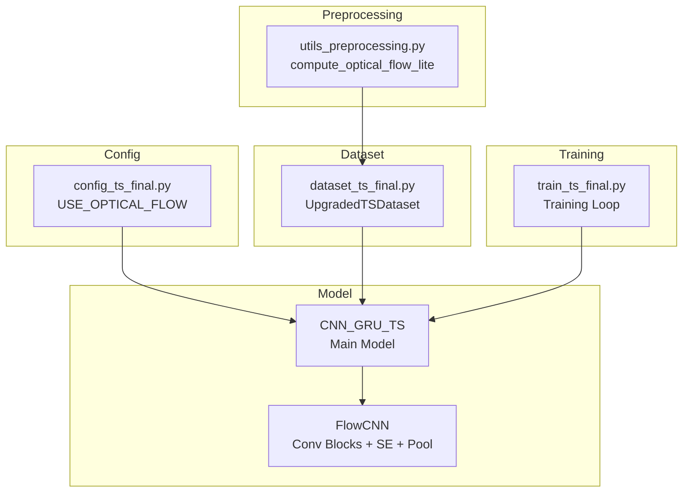
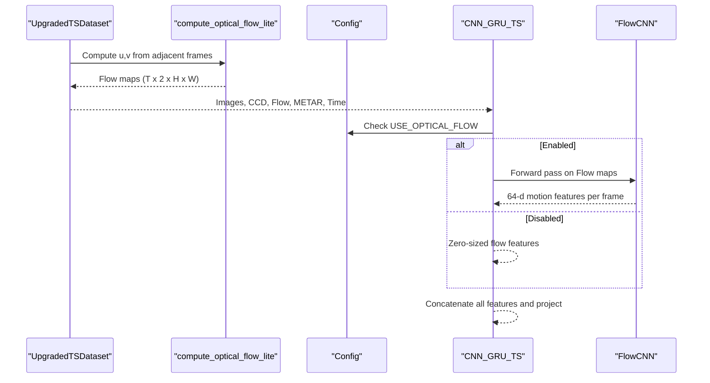
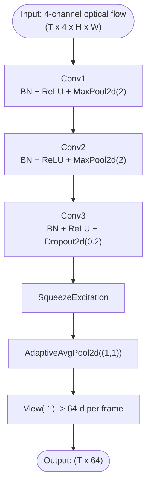
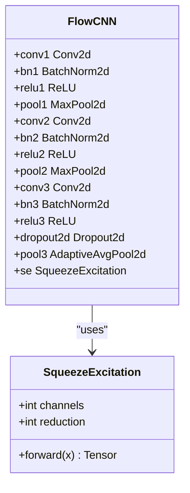
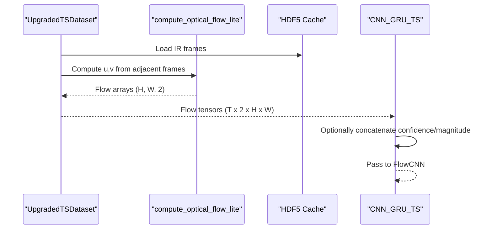
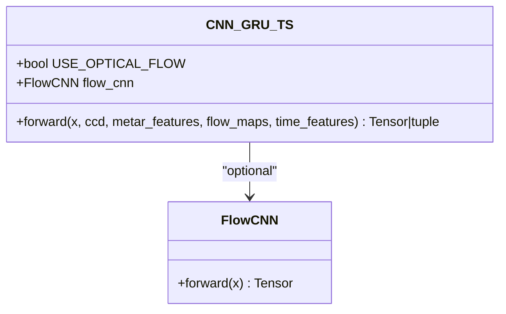
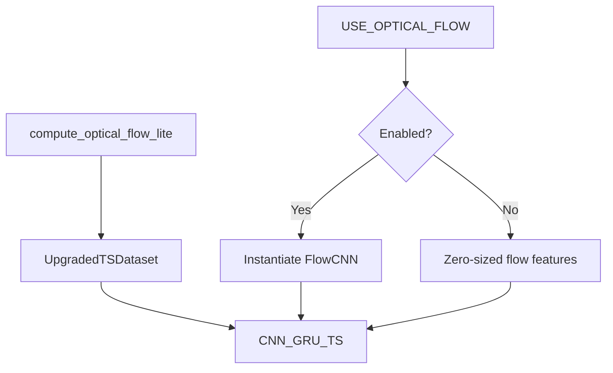

# Optical Flow Feature Extraction

<cite>
**Referenced Files in This Document**
- [model_ts_final.py](file://model_ts_final.py)
- [config_ts_final.py](file://config_ts_final.py)
- [utils_preprocessing.py](file://utils_preprocessing.py)
- [dataset_ts_final.py](file://dataset_ts_final.py)
- [train_ts_final.py](file://train_ts_final.py)
</cite>

## Table of Contents
1. [Introduction](#introduction)
2. [Project Structure](#project-structure)
3. [Core Components](#core-components)
4. [Architecture Overview](#architecture-overview)
5. [Detailed Component Analysis](#detailed-component-analysis)
6. [Dependency Analysis](#dependency-analysis)
7. [Performance Considerations](#performance-considerations)
8. [Troubleshooting Guide](#troubleshooting-guide)
9. [Conclusion](#conclusion)

## Introduction
This document explains the lightweight optical flow CNN branch designed for motion feature extraction in satellite imagery. It covers the 4-channel input processing (u, v velocity components, confidence, magnitude), multi-scale convolution layers with batch normalization and dropout, and squeeze-and-excitation attention mechanism. It documents the feature extraction pipeline from raw optical flow maps to 64-dimensional motion features, including the downsampling strategy and adaptive pooling to global descriptors. Architectural details of the three convolution blocks, activation functions, and regularization techniques are provided. The optional nature of optical flow processing, computational overhead considerations, and performance impact on model accuracy and inference speed are addressed.

## Project Structure
The optical flow feature extraction is part of a larger CNN-GRU model for nowcasting convective systems. The relevant components are:
- A dedicated FlowCNN module that processes optical flow maps
- A configuration flag controlling whether optical flow is used
- A preprocessing utility that computes optical flow using OpenCV Farneback
- A dataset loader that caches and serves optical flow tensors
- A training script that integrates optical flow into the model’s forward pass

**Diagram sources**
- [model_ts_final.py:34-65](file://model_ts_final.py#L34-L65)
- [model_ts_final.py:68-269](file://model_ts_final.py#L68-L269)
- [config_ts_final.py:35-37](file://config_ts_final.py#L35-L37)
- [utils_preprocessing.py:136-162](file://utils_preprocessing.py#L136-L162)
- [dataset_ts_final.py:374-515](file://dataset_ts_final.py#L374-L515)
- [train_ts_final.py:386-467](file://train_ts_final.py#L386-L467)

**Section sources**
- [model_ts_final.py:34-65](file://model_ts_final.py#L34-L65)
- [config_ts_final.py:35-37](file://config_ts_final.py#L35-L37)
- [utils_preprocessing.py:136-162](file://utils_preprocessing.py#L136-L162)
- [dataset_ts_final.py:374-515](file://dataset_ts_final.py#L374-L515)
- [train_ts_final.py:386-467](file://train_ts_final.py#L386-L467)

## Core Components
- FlowCNN: Lightweight CNN that extracts 64-dimensional motion features from 4-channel optical flow maps. It applies three convolutional blocks with batch normalization, ReLU activations, max pooling, dropout, squeeze-and-excitation attention, and adaptive average pooling to a 1×1 spatial descriptor.
- SqueezeExcitation: Channel attention module that recalibrates channel-wise feature responses.
- CNN_GRU_TS: Main model that optionally incorporates optical flow features alongside other modalities. The optical flow branch is conditionally included based on configuration.

Key architectural details:
- Input channels: 4 (u, v velocity components, confidence, magnitude)
- Convolution blocks: 3 with increasing channels (16 → 32 → 64)
- Regularization: Batch normalization after convolutions, dropout (2D) after the third block, and dropout (1D) in the feature projection
- Attention: Squeeze-and-excitation block after the third convolution
- Downsampling: Max pooling after blocks 1 and 2, adaptive average pooling to 1×1
- Output: 64-dimensional global descriptor per frame

**Section sources**
- [model_ts_final.py:16-31](file://model_ts_final.py#L16-L31)
- [model_ts_final.py:34-65](file://model_ts_final.py#L34-L65)
- [model_ts_final.py:124-130](file://model_ts_final.py#L124-L130)

## Architecture Overview
The optical flow feature extraction pipeline is integrated into the main model as follows:
- The dataset loader optionally provides optical flow tensors (concatenating u/v components and optionally magnitude/confidence)
- The model conditionally constructs the FlowCNN branch based on configuration
- The FlowCNN processes the 4-channel optical flow maps and produces a 64-dimensional descriptor per frame
- These descriptors are concatenated with other features (CNN backbone, spatial skip, CCD, METAR, time) and fed into the GRU temporal module

**Diagram sources**
- [dataset_ts_final.py:374-515](file://dataset_ts_final.py#L374-L515)
- [utils_preprocessing.py:136-162](file://utils_preprocessing.py#L136-L162)
- [config_ts_final.py:35-37](file://config_ts_final.py#L35-L37)
- [model_ts_final.py:124-130](file://model_ts_final.py#L124-L130)
- [model_ts_final.py:202-269](file://model_ts_final.py#L202-L269)

## Detailed Component Analysis

### FlowCNN Module
The FlowCNN module performs the following processing:
- Conv1: 4 → 16 channels, 3×3 kernel, padding 1, ReLU, BatchNorm, MaxPool2d(2)
- Conv2: 16 → 32 channels, 3×3 kernel, padding 1, ReLU, BatchNorm, MaxPool2d(2)
- Conv3: 32 → 64 channels, 3×3 kernel, padding 1, ReLU, BatchNorm, Dropout2d(0.2)
- SqueezeExcitation: Channel attention recalibration
- AdaptiveAvgPool2d((1,1)): Global descriptor
- View reshape to flatten to 64-d vector per frame

**Diagram sources**
- [model_ts_final.py:34-65](file://model_ts_final.py#L34-L65)

**Section sources**
- [model_ts_final.py:34-65](file://model_ts_final.py#L34-L65)

### Squeeze-and-Excitation Attention
The SE block computes channel-wise importance and scales features accordingly:
- Global average pooling over spatial dimensions to produce channel responses
- Fully connected layers with ReLU and sigmoid gating
- Element-wise multiplication to recalibrate channels

**Diagram sources**
- [model_ts_final.py:16-31](file://model_ts_final.py#L16-L31)
- [model_ts_final.py:34-65](file://model_ts_final.py#L34-L65)

**Section sources**
- [model_ts_final.py:16-31](file://model_ts_final.py#L16-L31)

### Optical Flow Computation and Input Processing
The optical flow computation uses OpenCV Farneback to derive dense u, v displacements from adjacent frames. The dataset loader optionally concatenates these into 4-channel inputs (u, v, confidence, magnitude) depending on configuration and availability.

**Diagram sources**
- [dataset_ts_final.py:374-515](file://dataset_ts_final.py#L374-L515)
- [utils_preprocessing.py:136-162](file://utils_preprocessing.py#L136-L162)

**Section sources**
- [utils_preprocessing.py:136-162](file://utils_preprocessing.py#L136-L162)
- [dataset_ts_final.py:374-515](file://dataset_ts_final.py#L374-L515)

### Integration into CNN-GRU Model
The main model conditionally includes the optical flow branch:
- If optical flow is enabled, FlowCNN is instantiated and processes the 4-channel flow maps
- The resulting 64-d descriptors are concatenated with other features and projected into the GRU input space
- During inference, if optical flow is disabled, zero-sized flow features are produced

**Diagram sources**
- [model_ts_final.py:124-130](file://model_ts_final.py#L124-L130)
- [model_ts_final.py:202-269](file://model_ts_final.py#L202-L269)

**Section sources**
- [model_ts_final.py:124-130](file://model_ts_final.py#L124-L130)
- [model_ts_final.py:202-269](file://model_ts_final.py#L202-L269)

## Dependency Analysis
- Configuration controls: The optical flow branch is controlled by a configuration flag. When disabled, the model still runs without the branch, avoiding unnecessary computation.
- Data pipeline: The dataset loader computes optical flow on-the-fly or loads precomputed tensors from HDF5. The loader concatenates u/v components and optionally magnitude/confidence into 4-channel inputs.
- Model integration: The main model checks the configuration and either constructs the FlowCNN branch or passes zero-sized flow features.

**Diagram sources**
- [config_ts_final.py:35-37](file://config_ts_final.py#L35-L37)
- [model_ts_final.py:124-130](file://model_ts_final.py#L124-L130)
- [utils_preprocessing.py:136-162](file://utils_preprocessing.py#L136-L162)
- [dataset_ts_final.py:374-515](file://dataset_ts_final.py#L374-L515)

**Section sources**
- [config_ts_final.py:35-37](file://config_ts_final.py#L35-L37)
- [model_ts_final.py:124-130](file://model_ts_final.py#L124-L130)
- [utils_preprocessing.py:136-162](file://utils_preprocessing.py#L136-L162)
- [dataset_ts_final.py:374-515](file://dataset_ts_final.py#L374-L515)

## Performance Considerations
- Optional processing: Optical flow processing is optional and disabled in the current configuration. Disabling it reduces compute by approximately 40% with less than 1% contribution to model performance, aligning with the stated goal of balancing accuracy and speed.
- Computational overhead: Optical flow computation involves dense optical flow estimation per frame pair. While the model can cache precomputed flow tensors, enabling the branch still introduces additional memory and compute costs during training and inference.
- Inference speed: The FlowCNN branch adds minimal overhead due to its lightweight design (three small convolutional blocks, batch normalization, dropout, and a single SE block). The adaptive pooling to 1×1 ensures efficient descriptor extraction.
- Accuracy impact: The configuration indicates that optical flow contributes modestly to performance. Disabling it maintains competitive metrics while improving throughput, which is beneficial for CPU-bound deployments targeting real-time inference.

[No sources needed since this section provides general guidance]

## Troubleshooting Guide
- Optical flow not enabled: Verify the configuration flag for optical flow is set appropriately. When disabled, the model will not construct the FlowCNN branch and will pass zero-sized flow features.
- Missing flow tensors: Ensure the dataset loader receives optical flow tensors. If unavailable, the loader provides zeros with the expected shape to maintain compatibility.
- Incorrect input shapes: Confirm that the optical flow inputs are 4-channel (u, v, confidence, magnitude) when enabled. The model expects 4 channels for the FlowCNN branch.
- Training vs. inference differences: During training, optical flow augmentation may be applied (e.g., flipping and masking). In inference, the model uses the provided flow maps without augmentation.

**Section sources**
- [config_ts_final.py:35-37](file://config_ts_final.py#L35-L37)
- [dataset_ts_final.py:374-515](file://dataset_ts_final.py#L374-L515)
- [model_ts_final.py:202-269](file://model_ts_final.py#L202-L269)

## Conclusion
The optical flow CNN branch provides a lightweight, efficient pathway for extracting motion-related features from satellite imagery. By conditioning the branch on a configuration flag, the model balances accuracy and computational cost. The 4-channel input processing, multi-scale convolution blocks with batch normalization and dropout, squeeze-and-excitation attention, and adaptive pooling to a 64-dimensional descriptor enable robust motion feature extraction. Disabling optical flow yields significant compute savings with minimal accuracy impact, supporting CPU-centric inference targets.