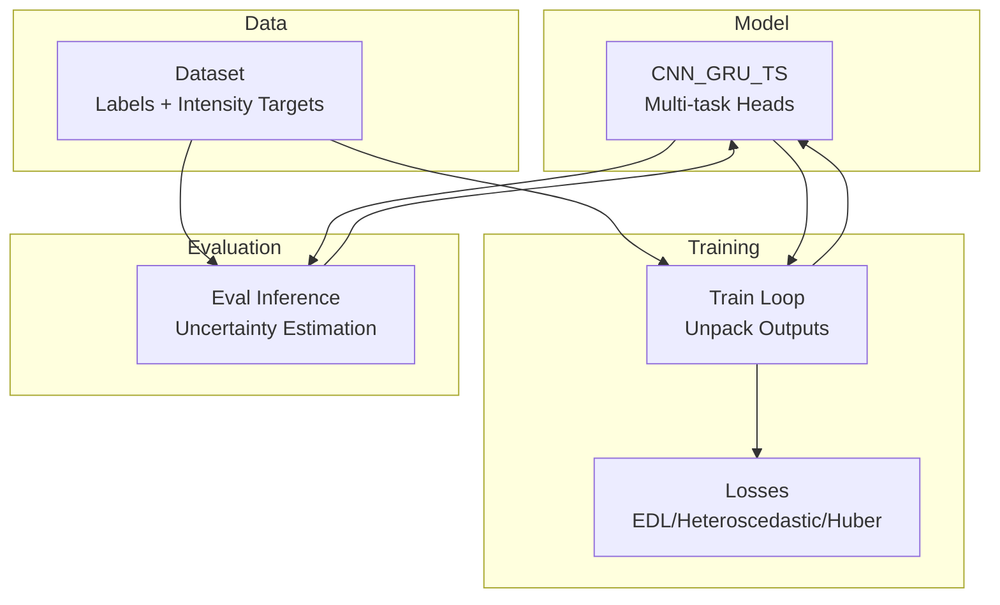
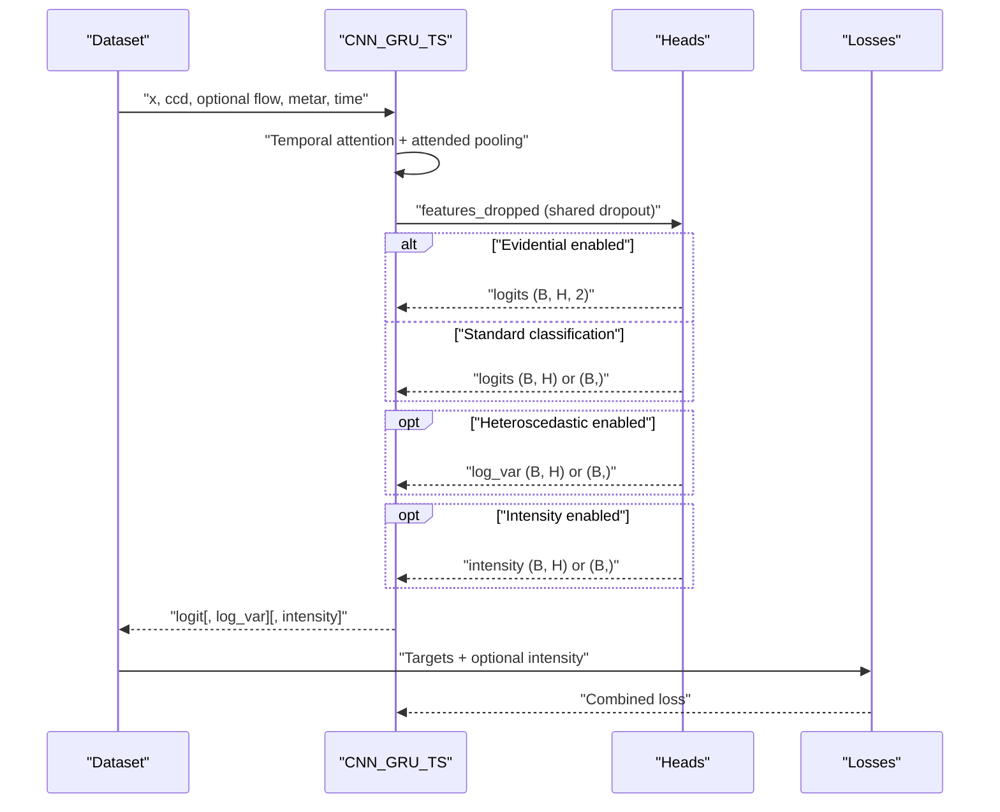
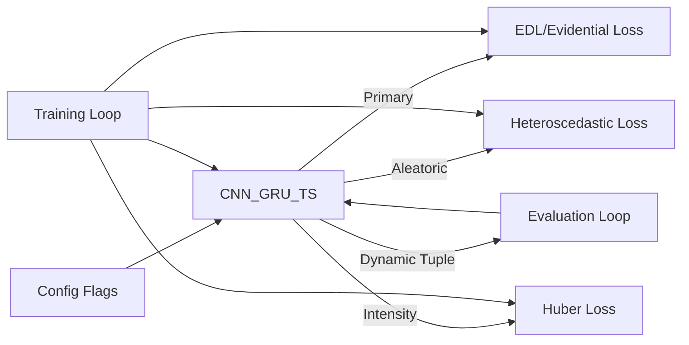

# Output Heads - Multi-Task Learning

<cite>
**Referenced Files in This Document**
- [model_ts_final.py](file://model_ts_final.py)
- [config_ts_final.py](file://config_ts_final.py)
- [losses_final.py](file://losses_final.py)
- [train_ts_final.py](file://train_ts_final.py)
- [evaluate_ts_final.py](file://evaluate_ts_final.py)
- [dataset_ts_final.py](file://dataset_ts_final.py)
- [utils_metrics_final.py](file://utils_metrics_final.py)
</cite>

## Table of Contents
1. [Introduction](#introduction)
2. [Project Structure](#project-structure)
3. [Core Components](#core-components)
4. [Architecture Overview](#architecture-overview)
5. [Detailed Component Analysis](#detailed-component-analysis)
6. [Dependency Analysis](#dependency-analysis)
7. [Performance Considerations](#performance-considerations)
8. [Troubleshooting Guide](#troubleshooting-guide)
9. [Conclusion](#conclusion)

## Introduction
This document explains the multi-task output architecture enabling simultaneous binary classification, aleatoric uncertainty quantification, and intensity regression for thunderstorm prediction. It focuses on:
- Shared feature dropout mechanism that regularizes and stabilizes multi-head inference
- Primary classification head supporting both standard sigmoid probability and evidential learning (Dirichlet-based)
- Aleatoric uncertainty head for heteroscedastic modeling
- Intensity regression head for continuous storm severity scoring
- Dynamic output tuple generation controlled by configuration flags
- Evidence-based uncertainty decomposition (epistemic vs aleatoric)
- Integration of multiple prediction targets and practical benefits for weather forecasting

## Project Structure
The multi-task output architecture is implemented in the model and integrated with training and evaluation scripts. Key files:
- Model definition and multi-task heads: [model_ts_final.py](file://model_ts_final.py)
- Configuration flags controlling which heads are active: [config_ts_final.py](file://config_ts_final.py)
- Loss functions supporting evidential learning and heteroscedastic modeling: [losses_final.py](file://losses_final.py)
- Training loop unpacking multi-task outputs and combining losses: [train_ts_final.py](file://train_ts_final.py)
- Evaluation pipeline handling uncertainty estimation and multi-task outputs: [evaluate_ts_final.py](file://evaluate_ts_final.py)
- Dataset providing multi-task labels and optional intensity targets: [dataset_ts_final.py](file://dataset_ts_final.py)
- Metrics and temporal post-processing utilities: [utils_metrics_final.py](file://utils_metrics_final.py)

**Diagram sources**
- [model_ts_final.py:83-360](file://model_ts_final.py#L83-L360)
- [train_ts_final.py:386-510](file://train_ts_final.py#L386-L510)
- [evaluate_ts_final.py:449-500](file://evaluate_ts_final.py#L449-L500)
- [dataset_ts_final.py:57-200](file://dataset_ts_final.py#L57-L200)

**Section sources**
- [model_ts_final.py:83-360](file://model_ts_final.py#L83-L360)
- [config_ts_final.py:16-211](file://config_ts_final.py#L16-L211)
- [losses_final.py:13-280](file://losses_final.py#L13-L280)
- [train_ts_final.py:386-510](file://train_ts_final.py#L386-L510)
- [evaluate_ts_final.py:449-500](file://evaluate_ts_final.py#L449-L500)
- [dataset_ts_final.py:57-200](file://dataset_ts_final.py#L57-L200)

## Core Components
- Shared feature dropout: A single dropout layer applied to the temporally attended representation before feeding to all heads. This ensures shared regularization across tasks and reduces overfitting.
- Primary classification head:
  - Standard sigmoid probability head when evidential learning is disabled
  - Evidential head producing Dirichlet parameters when enabled, enabling closed-form epistemic uncertainty
- Aleatoric uncertainty head: Predicts log-variance for heteroscedastic modeling, enabling the model to discount ambiguous frames
- Intensity regression head: Predicts a continuous storm severity score using Huber loss
- Dynamic output tuple: The model returns either a single tensor or a tuple depending on which heads are enabled

Key implementation references:
- Shared dropout and head composition: [model_ts_final.py:195-294](file://model_ts_final.py#L195-L294)
- Evidential head and uncertainty computation: [model_ts_final.py:299-360](file://model_ts_final.py#L299-L360)
- Heteroscedastic loss: [losses_final.py:112-134](file://losses_final.py#L112-L134)
- Intensity regression loss: [losses_final.py:135-142](file://losses_final.py#L135-L142)
- Dynamic output tuple generation: [model_ts_final.py:280-293](file://model_ts_final.py#L280-L293)

**Section sources**
- [model_ts_final.py:195-294](file://model_ts_final.py#L195-L294)
- [model_ts_final.py:299-360](file://model_ts_final.py#L299-L360)
- [losses_final.py:112-134](file://losses_final.py#L112-L134)
- [losses_final.py:135-142](file://losses_final.py#L135-L142)

## Architecture Overview
The model’s temporal backbone produces a sequence of hidden states. A temporal attention layer computes importance weights across time, and the attended representation is passed through a shared dropout layer. This shared representation feeds into:
- Primary classification head (sigmoid or evidential)
- Aleatoric uncertainty head (optional)
- Intensity regression head (optional)

Outputs are dynamically packaged into a single tensor or a tuple based on configuration flags.

**Diagram sources**
- [model_ts_final.py:222-294](file://model_ts_final.py#L222-L294)
- [train_ts_final.py:407-448](file://train_ts_final.py#L407-L448)
- [losses_final.py:112-142](file://losses_final.py#L112-L142)

## Detailed Component Analysis

### Shared Feature Dropout Mechanism
- Location: Applied to the temporally attended representation prior to head computation
- Purpose: Encourages shared feature learning across heads, improves generalization, and reduces overfitting
- Implementation: Single dropout applied once before distributing to all heads

References:
- [model_ts_final.py:267-270](file://model_ts_final.py#L267-L270)

**Section sources**
- [model_ts_final.py:267-270](file://model_ts_final.py#L267-L270)

### Primary Classification Head
- Standard sigmoid probability head:
  - Produces logits per horizon; sigmoid converts to probability
  - Supports single horizon or multiple horizons via dynamic horizon list
- Evidential head (Dirichlet distribution):
  - Outputs 2 logits per horizon representing alpha parameters for class 0 and 1
  - Computes predictive probability and epistemic uncertainty from alpha sums

References:
- [model_ts_final.py:198-207](file://model_ts_final.py#L198-L207)
- [model_ts_final.py:272-278](file://model_ts_final.py#L272-L278)
- [model_ts_final.py:299-327](file://model_ts_final.py#L299-L327)

**Section sources**
- [model_ts_final.py:198-207](file://model_ts_final.py#L198-L207)
- [model_ts_final.py:272-278](file://model_ts_final.py#L272-L278)
- [model_ts_final.py:299-327](file://model_ts_final.py#L299-L327)

### Aleatoric Uncertainty Head (Heteroscedastic)
- Predicts log-variance per horizon to model aleatoric uncertainty
- Loss combines BCE with precision-weighted terms and a variance regularization
- Used for uncertainty-aware classification and can be combined with evidential learning

References:
- [model_ts_final.py:208-211](file://model_ts_final.py#L208-L211)
- [losses_final.py:112-134](file://losses_final.py#L112-L134)

**Section sources**
- [model_ts_final.py:208-211](file://model_ts_final.py#L208-L211)
- [losses_final.py:112-134](file://losses_final.py#L112-L134)

### Intensity Regression Head
- Predicts continuous storm severity score per horizon
- Uses Huber loss to balance robustness to outliers and smoothness near zero
- Provides quantitative severity estimates for operational use

References:
- [model_ts_final.py:212-218](file://model_ts_final.py#L212-L218)
- [losses_final.py:135-142](file://losses_final.py#L135-L142)

**Section sources**
- [model_ts_final.py:212-218](file://model_ts_final.py#L212-L218)
- [losses_final.py:135-142](file://losses_final.py#L135-L142)

### Dynamic Output Tuple Generation
- The model returns a single tensor when only the primary head is active
- When additional heads are enabled, it returns a tuple ordered as: [logit[, log_var][, intensity]]
- Training and evaluation code unpacks outputs accordingly

References:
- [model_ts_final.py:280-293](file://model_ts_final.py#L280-L293)
- [train_ts_final.py:407-417](file://train_ts_final.py#L407-L417)
- [evaluate_ts_final.py:474-494](file://evaluate_ts_final.py#L474-L494)

**Section sources**
- [model_ts_final.py:280-293](file://model_ts_final.py#L280-L293)
- [train_ts_final.py:407-417](file://train_ts_final.py#L407-L417)
- [evaluate_ts_final.py:474-494](file://evaluate_ts_final.py#L474-L494)

### Evidential Learning Approach (Dirichlet Distribution)
- The primary head outputs logits interpreted as evidence for a Beta distribution
- Alpha parameters are derived from softplus transformation; predictive probability is derived from alpha ratios
- Epistemic uncertainty is computed from alpha sum (closed-form)
- Optional asymmetric weighting and decay penalty for long-lead false alarms

References:
- [model_ts_final.py:299-327](file://model_ts_final.py#L299-L327)
- [losses_final.py:195-277](file://losses_final.py#L195-L277)

**Section sources**
- [model_ts_final.py:299-327](file://model_ts_final.py#L299-L327)
- [losses_final.py:195-277](file://losses_final.py#L195-L277)

### Monte Carlo Dropout Uncertainty Estimation Fallback
- When evidential learning is disabled, the model uses MC Dropout to estimate epistemic uncertainty
- During inference, the model is forced into train mode to activate dropout; multiple forward passes produce a distribution of predictions
- Epistemic uncertainty is estimated as the standard deviation across samples
- Aleatoric uncertainty can be recovered from the heteroscedastic head if enabled

References:
- [model_ts_final.py:299-360](file://model_ts_final.py#L299-L360)
- [evaluate_ts_final.py:474-482](file://evaluate_ts_final.py#L474-L482)

**Section sources**
- [model_ts_final.py:299-360](file://model_ts_final.py#L299-L360)
- [evaluate_ts_final.py:474-482](file://evaluate_ts_final.py#L474-L482)

### Uncertainty Decomposition (Epistemic vs Aleatoric)
- Epistemic uncertainty: Model-driven uncertainty due to limited training data; estimated deterministically via evidential learning or via MC Dropout variance
- Aleatoric uncertainty: Data-driven noise; modeled by predicting log-variance per horizon
- The model can leverage both simultaneously when both approaches are enabled

References:
- [model_ts_final.py:299-327](file://model_ts_final.py#L299-L327)
- [losses_final.py:112-134](file://losses_final.py#L112-L134)

**Section sources**
- [model_ts_final.py:299-327](file://model_ts_final.py#L299-L327)
- [losses_final.py:112-134](file://losses_final.py#L112-L134)

### Integration of Multiple Prediction Targets
- Training loop dynamically constructs combined losses by unpacking multi-task outputs
- Validation mirrors training behavior for fair evaluation
- Evaluation pipeline supports both evidential and MC Dropout uncertainty estimation

References:
- [train_ts_final.py:407-448](file://train_ts_final.py#L407-L448)
- [evaluate_ts_final.py:474-494](file://evaluate_ts_final.py#L474-L494)

**Section sources**
- [train_ts_final.py:407-448](file://train_ts_final.py#L407-L448)
- [evaluate_ts_final.py:474-494](file://evaluate_ts_final.py#L474-L494)

## Dependency Analysis
The multi-task architecture depends on:
- Configuration flags to enable/disable heads
- Loss modules that support evidential learning, heteroscedastic modeling, and intensity regression
- Training and evaluation loops that unpack outputs and combine losses appropriately

**Diagram sources**
- [config_ts_final.py:62-86](file://config_ts_final.py#L62-L86)
- [model_ts_final.py:198-218](file://model_ts_final.py#L198-L218)
- [losses_final.py:112-142](file://losses_final.py#L112-L142)
- [train_ts_final.py:288-312](file://train_ts_final.py#L288-L312)
- [evaluate_ts_final.py:474-494](file://evaluate_ts_final.py#L474-L494)

**Section sources**
- [config_ts_final.py:62-86](file://config_ts_final.py#L62-L86)
- [model_ts_final.py:198-218](file://model_ts_final.py#L198-L218)
- [losses_final.py:112-142](file://losses_final.py#L112-L142)
- [train_ts_final.py:288-312](file://train_ts_final.py#L288-L312)
- [evaluate_ts_final.py:474-494](file://evaluate_ts_final.py#L474-L494)

## Performance Considerations
- Computational efficiency: Shared dropout reduces redundant computations across heads
- Memory footprint: Dynamic output tuples minimize unnecessary allocations when heads are disabled
- Practical benefits:
  - Evidential learning provides closed-form epistemic uncertainty without extra passes
  - Heteroscedastic modeling allows adaptive weighting of ambiguous frames
  - Intensity regression supports operational severity scoring and improved decision-making

[No sources needed since this section provides general guidance]

## Troubleshooting Guide
- Mixed output types: Ensure training and evaluation code unpacks outputs consistently (tuple vs single tensor)
- Shape mismatches: Verify dynamic horizon configuration aligns with head outputs
- Uncertainty estimation: Confirm whether evidential learning or MC Dropout is active; adjust accordingly

References:
- [model_ts_final.py:280-293](file://model_ts_final.py#L280-L293)
- [train_ts_final.py:407-417](file://train_ts_final.py#L407-L417)
- [evaluate_ts_final.py:474-494](file://evaluate_ts_final.py#L474-L494)

**Section sources**
- [model_ts_final.py:280-293](file://model_ts_final.py#L280-L293)
- [train_ts_final.py:407-417](file://train_ts_final.py#L407-L417)
- [evaluate_ts_final.py:474-494](file://evaluate_ts_final.py#L474-L494)

## Conclusion
The multi-task output architecture integrates shared regularization, evidential learning, aleatoric uncertainty, and intensity regression to deliver robust, interpretable, and operationally useful forecasts. Its dynamic configuration and unified inference pipeline enable flexible deployment across varying operational needs while maintaining computational efficiency.