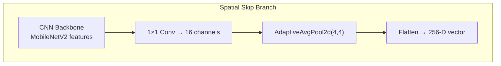
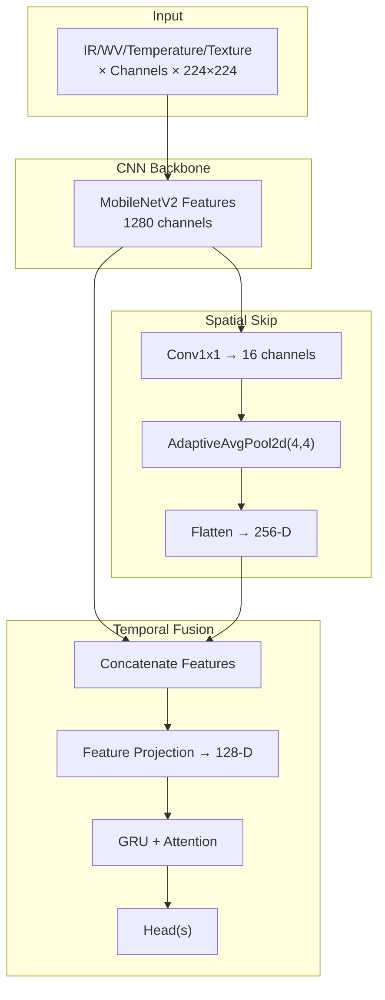
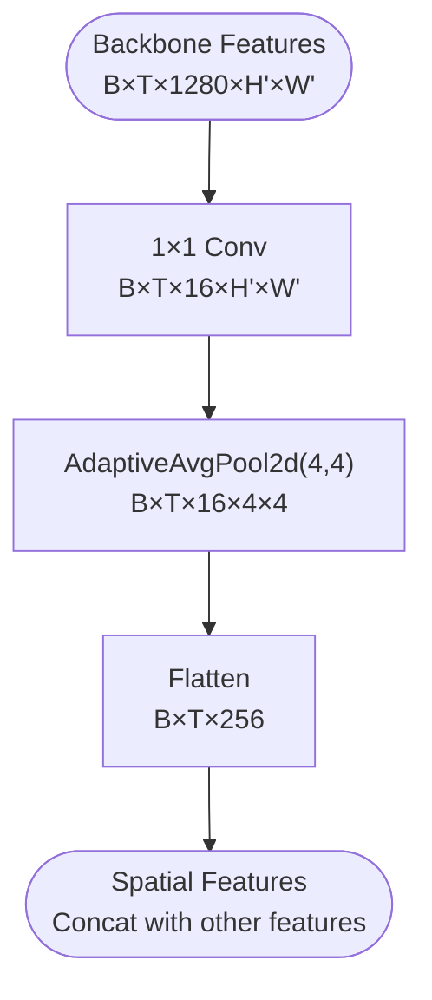
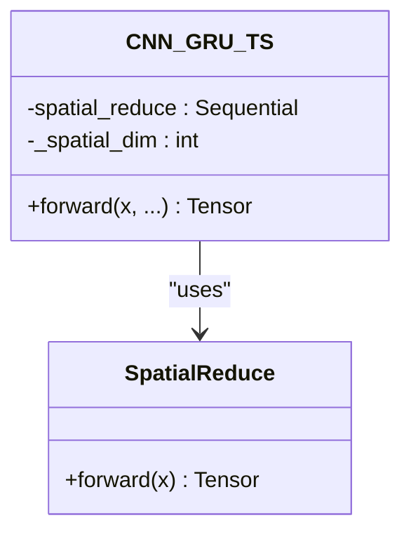
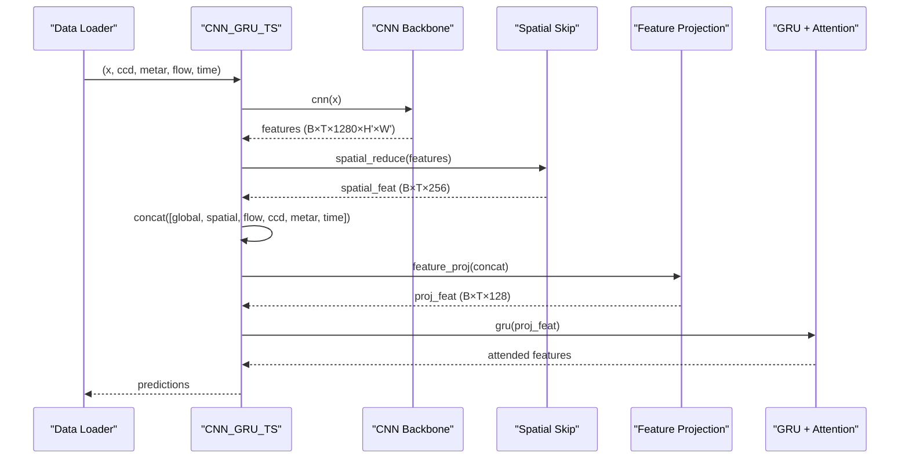
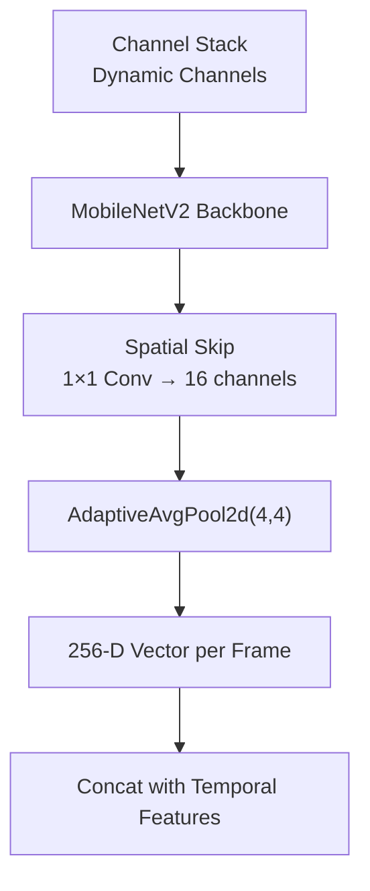
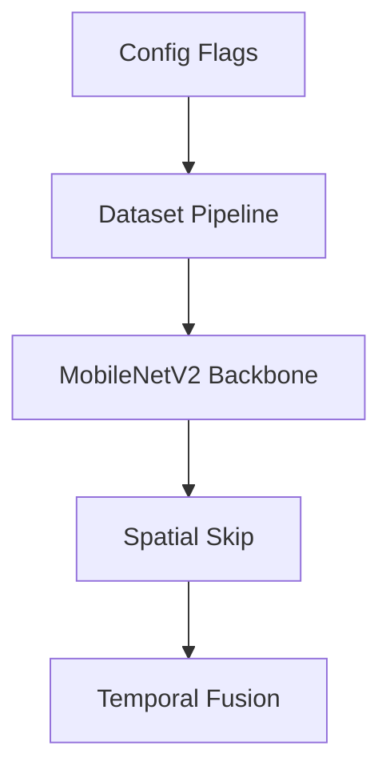

# Spatial Skip Connections

<cite>
**Referenced Files in This Document**
- [model_ts_final.py](file://model_ts_final.py)
- [config_ts_final.py](file://config_ts_final.py)
- [utils_spatial_final.py](file://utils_spatial_final.py)
- [dataset_ts_final.py](file://dataset_ts_final.py)
- [train_ts_final.py](file://train_ts_final.py)
- [evaluate_ts_final.py](file://evaluate_ts_final.py)
- [losses_final.py](file://losses_final.py)
- [utils_metrics_final.py](file://utils_metrics_final.py)
</cite>

## Table of Contents
1. [Introduction](#introduction)
2. [Project Structure](#project-structure)
3. [Core Components](#core-components)
4. [Architecture Overview](#architecture-overview)
5. [Detailed Component Analysis](#detailed-component-analysis)
6. [Dependency Analysis](#dependency-analysis)
7. [Performance Considerations](#performance-considerations)
8. [Troubleshooting Guide](#troubleshooting-guide)
9. [Conclusion](#conclusion)

## Introduction
This document explains the spatial skip connection mechanism that processes low-resolution grid features extracted from the CNN backbone. It covers the 1x1 convolution reduction to 16 channels, adaptive average pooling to 4x4 spatial resolution, and the resulting 256-dimensional feature vector generation. It also documents the spatial feature extraction pipeline, dimensionality reduction strategies, and integration with temporal features. Architectural diagrams illustrate the skip connection pathway, feature map transformations, and computational benefits. Design decisions for spatial processing, memory efficiency gains, and contributions to thunderstorm detection performance are discussed.

## Project Structure
The spatial skip connection resides within the upgraded CNN-GRU model architecture. The pipeline integrates:
- CNN backbone (MobileNetV2) extracting high-level features
- Spatial skip branch reducing channel dimensionality and spatial resolution
- Temporal fusion via GRU and attention
- Optional optical flow and METAR/time features
- Training and evaluation scripts with robust metrics

**Diagram sources**
- [model_ts_final.py:115-122](file://model_ts_final.py#L115-L122)

**Section sources**
- [model_ts_final.py:68-269](file://model_ts_final.py#L68-L269)
- [config_ts_final.py:16-208](file://config_ts_final.py#L16-L208)

## Core Components
- Spatial skip branch: Applies a 1x1 convolution to reduce channels from 1280 to 16, followed by adaptive average pooling to 4x4, producing a 256-D vector per time step.
- Integration with temporal features: Concatenates spatial features with global CNN features, optical flow features (when enabled), CCD features, METAR features (when enabled), and monthly time features.
- Feature projection: Projects the concatenated feature vector to a 128-D representation before GRU temporal processing.
- Temporal module: GRU with attention for temporal fusion and interpretability.

**Section sources**
- [model_ts_final.py:115-161](file://model_ts_final.py#L115-L161)
- [model_ts_final.py:202-269](file://model_ts_final.py#L202-L269)

## Architecture Overview
The spatial skip connection is inserted after the CNN backbone and before temporal fusion. It captures spatially distributed low-resolution features that retain convective core information, complementing the global CNN features and temporal dynamics.

**Diagram sources**
- [model_ts_final.py:79-161](file://model_ts_final.py#L79-L161)
- [model_ts_final.py:202-269](file://model_ts_final.py#L202-L269)

## Detailed Component Analysis

### Spatial Skip Connection Pipeline
- Channel reduction: A 1x1 convolution reduces the 1280-channel feature map to 16 channels, dramatically lowering computational cost while preserving spatial information.
- Spatial pooling: Adaptive average pooling downsamples to 4x4, ensuring consistent spatial resolution regardless of input size.
- Vectorization: Flattening produces a 16×4×4 = 256-D vector per time step, which is concatenated with other temporal features.

**Diagram sources**
- [model_ts_final.py:115-122](file://model_ts_final.py#L115-L122)
- [model_ts_final.py:214-215](file://model_ts_final.py#L214-L215)

**Section sources**
- [model_ts_final.py:115-122](file://model_ts_final.py#L115-L122)
- [model_ts_final.py:214-215](file://model_ts_final.py#L214-L215)

### Dimensionality Reduction Strategies
- 1x1 convolution: Reduces channels from 1280 to 16, trading spatial detail for compactness.
- Adaptive pooling: Ensures fixed 4x4 spatial grid, simplifying downstream processing.
- Feature projection: Projects concatenated features to 128-D before GRU, balancing representational capacity and efficiency.

**Diagram sources**
- [model_ts_final.py:115-122](file://model_ts_final.py#L115-L122)
- [model_ts_final.py:151-161](file://model_ts_final.py#L151-L161)

**Section sources**
- [model_ts_final.py:115-122](file://model_ts_final.py#L115-L122)
- [model_ts_final.py:151-161](file://model_ts_final.py#L151-L161)

### Integration with Temporal Features
- Spatial features are concatenated with:
  - Global CNN features (1280-D vector per frame)
  - Optical flow features (when enabled)
  - CCD features (6-D)
  - METAR features (when enabled)
  - Monthly time features (when enabled)
- After concatenation, a linear projection reduces dimensionality to 128-D prior to GRU temporal processing.

**Diagram sources**
- [model_ts_final.py:202-269](file://model_ts_final.py#L202-L269)
- [dataset_ts_final.py:374-515](file://dataset_ts_final.py#L374-L515)

**Section sources**
- [model_ts_final.py:202-269](file://model_ts_final.py#L202-L269)
- [dataset_ts_final.py:374-515](file://dataset_ts_final.py#L374-L515)

### Spatial Feature Extraction Pipeline
- Input channels are dynamically adapted to the configured channel set (e.g., IR, WV, texture, cooling, differences).
- The backbone extracts hierarchical features; the spatial skip branch focuses on low-resolution spatial structure.
- Optional dynamic masking can shift the spatial focus based on optical flow-derived upwind direction.

**Diagram sources**
- [model_ts_final.py:79-122](file://model_ts_final.py#L79-L122)
- [dataset_ts_final.py:378-496](file://dataset_ts_final.py#L378-L496)

**Section sources**
- [model_ts_final.py:79-122](file://model_ts_final.py#L79-L122)
- [dataset_ts_final.py:378-496](file://dataset_ts_final.py#L378-L496)

### Design Decisions and Benefits
- Keeping the spatial skip connection improves performance by retaining convective core information in a computationally efficient manner.
- The 1x1 convolution plus 4x4 pooling yields a fixed-size 256-D vector per frame, enabling consistent temporal fusion.
- Memory efficiency: Reducing 1280 channels to 16 and then to 256-D significantly lowers compute and memory usage compared to full-resolution feature maps.
- Integration flexibility: The spatial features integrate seamlessly with optical flow, CCD, METAR, and time features.

**Section sources**
- [model_ts_final.py:1-8](file://model_ts_final.py#L1-L8)
- [model_ts_final.py:115-122](file://model_ts_final.py#L115-L122)

## Dependency Analysis
The spatial skip connection depends on:
- CNN backbone outputs (1280 channels)
- Configuration flags controlling optional branches (optical flow, METAR, time)
- Dataset pipeline providing aligned features

**Diagram sources**
- [config_ts_final.py:32-124](file://config_ts_final.py#L32-L124)
- [dataset_ts_final.py:374-515](file://dataset_ts_final.py#L374-L515)
- [model_ts_final.py:79-161](file://model_ts_final.py#L79-L161)

**Section sources**
- [config_ts_final.py:32-124](file://config_ts_final.py#L32-L124)
- [dataset_ts_final.py:374-515](file://dataset_ts_final.py#L374-L515)
- [model_ts_final.py:79-161](file://model_ts_final.py#L79-L161)

## Performance Considerations
- Computational savings: The 1x1 convolution reduces channels from 1280 to 16, and 4x4 pooling fixes spatial dimensions, minimizing downstream operations.
- Memory footprint: Fixed 256-D vectors per frame reduce memory pressure during temporal fusion.
- Training stability: The spatial skip branch complements global features, aiding temporal learning without overfitting.
- Inference speed: The streamlined spatial branch contributes to achieving the CPU inference target.

[No sources needed since this section provides general guidance]

## Troubleshooting Guide
- Incorrect channel counts: Ensure the backbone’s first convolution is adapted to the configured number of input channels.
- Spatial feature mismatch: Verify that the spatial skip’s channel and spatial dimensions align with the projection and concatenation logic.
- Optional branch toggles: Confirm that optical flow, METAR, and time features are enabled/disabled consistently across dataset and model initialization.

**Section sources**
- [model_ts_final.py:82-100](file://model_ts_final.py#L82-L100)
- [model_ts_final.py:124-149](file://model_ts_final.py#L124-L149)
- [config_ts_final.py:32-124](file://config_ts_final.py#L32-L124)

## Conclusion
The spatial skip connection efficiently extracts low-resolution spatial features from the CNN backbone, reducing dimensionality from 1280 channels to 256-D via a 1x1 convolution and adaptive pooling. This design preserves convective core information while significantly improving memory efficiency and computational throughput. Integrated with temporal features, the spatial branch enhances model performance for thunderstorm detection tasks, contributing to improved reliability and inference speed.