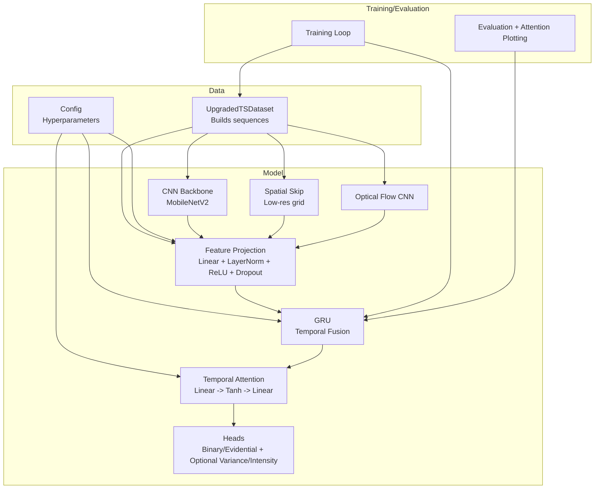
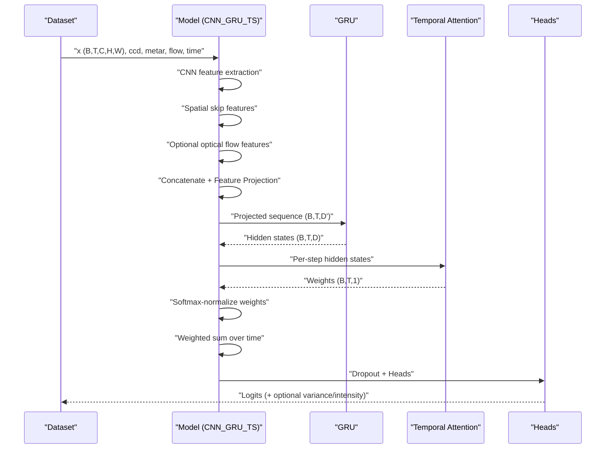
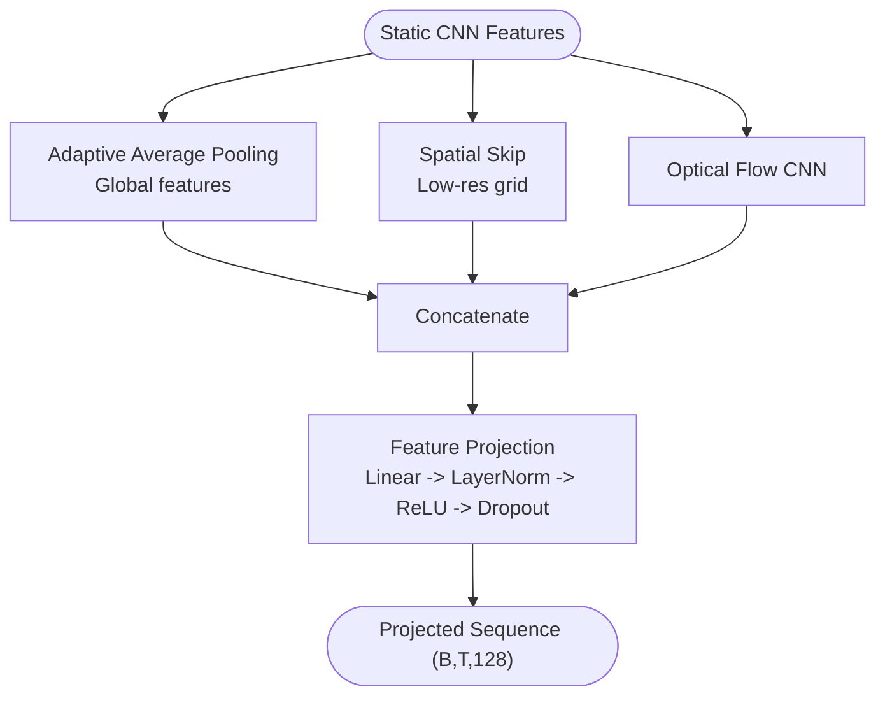
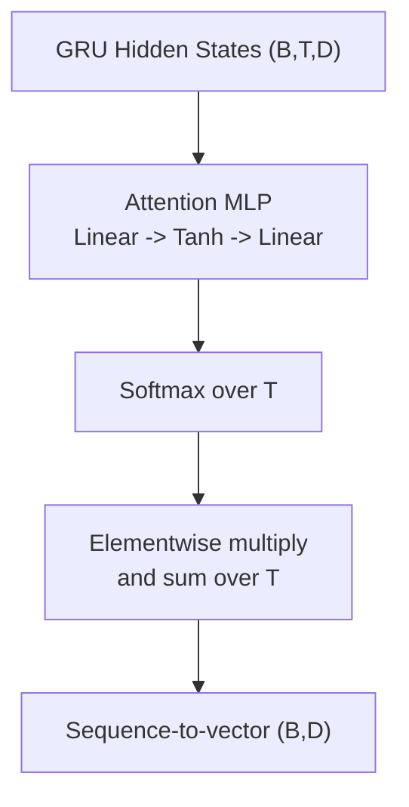
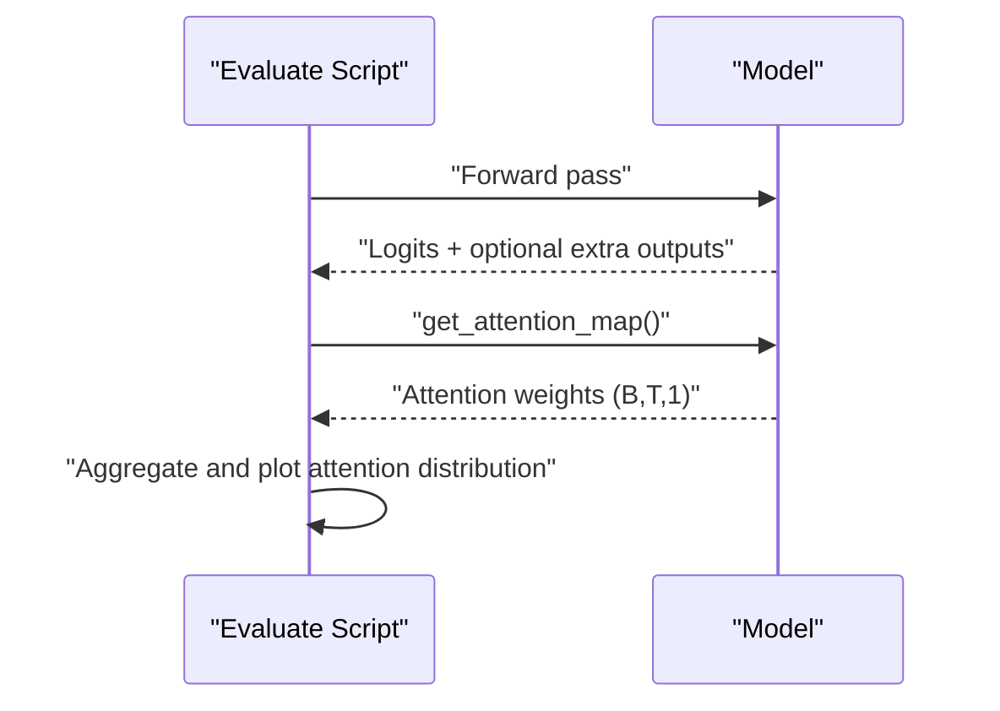
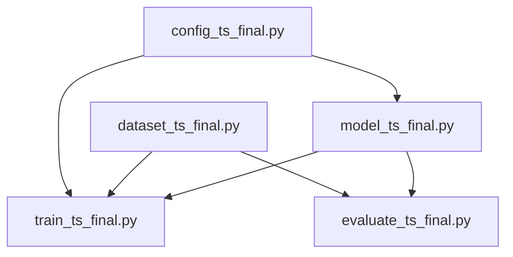

# Temporal Fusion with GRU

<cite>
**Referenced Files in This Document**
- [model_ts_final.py](file://model_ts_final.py)
- [config_ts_final.py](file://config_ts_final.py)
- [dataset_ts_final.py](file://dataset_ts_final.py)
- [train_ts_final.py](file://train_ts_final.py)
- [evaluate_ts_final.py](file://evaluate_ts_final.py)
- [utils_metrics_final.py](file://utils_metrics_final.py)
</cite>

## Table of Contents
1. [Introduction](#introduction)
2. [Project Structure](#project-structure)
3. [Core Components](#core-components)
4. [Architecture Overview](#architecture-overview)
5. [Detailed Component Analysis](#detailed-component-analysis)
6. [Dependency Analysis](#dependency-analysis)
7. [Performance Considerations](#performance-considerations)
8. [Troubleshooting Guide](#troubleshooting-guide)
9. [Conclusion](#conclusion)

## Introduction
This document explains the temporal fusion module that powers sequential nowcasting of thunderstorms from satellite imagery. It focuses on how static CNN features are transformed into a temporal sequence representation, the GRU-based temporal fusion replacing a transformer, the temporal attention mechanism for interpretability and sequence weighting, and the sequence-to-vector conversion. It also documents the design rationale behind replacing the transformer with GRU for improved parameter efficiency, training stability, and real-time inference, and how the attention mechanism enables interpretability and feature importance highlighting.

## Project Structure
The temporal fusion pipeline spans several modules:
- Model definition: CNN backbone, spatial skip connections, optical flow branch, feature projections, GRU temporal fusion, temporal attention, and heads.
- Configuration: hyperparameters controlling GRU architecture, sequence length, dropout, and optional auxiliary inputs.
- Dataset: builds sequences of satellite frames with optional METAR, CCD, and time features.
- Training: orchestrates data loading, loss computation, optimization, and evaluation.
- Evaluation: runs inference, computes metrics, and visualizes attention maps.

**Diagram sources**
- [model_ts_final.py:68-269](file://model_ts_final.py#L68-L269)
- [config_ts_final.py:23-47](file://config_ts_final.py#L23-L47)
- [dataset_ts_final.py:47-515](file://dataset_ts_final.py#L47-L515)
- [train_ts_final.py:142-757](file://train_ts_final.py#L142-L757)
- [evaluate_ts_final.py:285-324](file://evaluate_ts_final.py#L285-L324)

**Section sources**
- [model_ts_final.py:68-269](file://model_ts_final.py#L68-L269)
- [config_ts_final.py:23-47](file://config_ts_final.py#L23-L47)
- [dataset_ts_final.py:47-515](file://dataset_ts_final.py#L47-L515)
- [train_ts_final.py:142-757](file://train_ts_final.py#L142-L757)
- [evaluate_ts_final.py:285-324](file://evaluate_ts_final.py#L285-L324)

## Core Components
- CNN backbone with dynamic input channels adapted to the selected satellite channels.
- Spatial skip connection extracting low-resolution spatial features.
- Optional optical flow branch with a lightweight CNN.
- Feature projection mapping heterogeneous inputs to a fixed-size 128-D vector per time step.
- GRU temporal module configured by hidden size, number of layers, and dropout.
- Temporal attention module computing per-step weights and enabling sequence pooling.
- Multi-headed outputs: binary/evidential classification, optional aleatoric uncertainty, and optional intensity regression.

**Section sources**
- [model_ts_final.py:68-269](file://model_ts_final.py#L68-L269)
- [config_ts_final.py:23-47](file://config_ts_final.py#L23-L47)

## Architecture Overview
The temporal fusion transforms static CNN features into a sequence representation and applies GRU to model temporal dynamics. The temporal attention produces per-step weights that are softmax-normalized and used to compute a weighted sum over time, yielding a compact vector representation suitable for classification and optional uncertainty/intensity heads.

**Diagram sources**
- [model_ts_final.py:202-269](file://model_ts_final.py#L202-L269)
- [train_ts_final.py:390-467](file://train_ts_final.py#L390-L467)

## Detailed Component Analysis

### Static CNN Features to Temporal Sequence
- The CNN backbone (MobileNetV2) extracts per-frame features. The first convolution is dynamically adapted to the number of input channels selected via configuration.
- Global and spatial skip features are extracted and pooled to form a per-frame representation.
- Optional optical flow features are extracted via a lightweight CNN and concatenated.
- Additional inputs include CCD features, METAR features (projected and scaled), and time-of-year features.

**Diagram sources**
- [model_ts_final.py:206-236](file://model_ts_final.py#L206-L236)

**Section sources**
- [model_ts_final.py:79-161](file://model_ts_final.py#L79-L161)
- [dataset_ts_final.py:374-515](file://dataset_ts_final.py#L374-L515)

### Feature Projection to 128-D Inputs
- The model computes a raw feature dimension combining CNN global features, spatial skip features, optional optical flow, CCD, METAR, and time features.
- A linear projection reduces this to a fixed 128-dimensional input for the GRU, followed by layer normalization, ReLU, and dropout.

**Section sources**
- [model_ts_final.py:151-161](file://model_ts_final.py#L151-L161)

### GRU Temporal Module Configuration
- Hidden dimension, number of layers, and dropout are configured in the configuration object.
- The GRU processes the projected sequence with batch-first ordering and applies dropout when multiple layers are used.

**Section sources**
- [model_ts_final.py:163-170](file://model_ts_final.py#L163-L170)
- [config_ts_final.py:23-27](file://config_ts_final.py#L23-L27)

### Temporal Attention Mechanism
- A small MLP computes per-step attention scores from GRU hidden states.
- Softmax normalizes attention weights across the time dimension.
- The attention weights are stored for interpretability and used to compute a weighted sum over time, producing a sequence-to-vector representation.

**Diagram sources**
- [model_ts_final.py:239-246](file://model_ts_final.py#L239-L246)

**Section sources**
- [model_ts_final.py:172-177](file://model_ts_final.py#L172-L177)
- [model_ts_final.py:239-246](file://model_ts_final.py#L239-L246)

### Sequence-to-Vector Conversion and Heads
- The weighted vector is passed through a dropout layer and fed into the classification head.
- Optional heads include evidential classification, aleatoric uncertainty (log-variance), and intensity regression.

**Section sources**
- [model_ts_final.py:248-269](file://model_ts_final.py#L248-L269)

### Interpretability and Attention Visualization
- During evaluation, the model exposes the last computed attention weights via a getter method.
- The evaluation script aggregates attention weights and plots their distribution across time steps.

**Diagram sources**
- [model_ts_final.py:270-272](file://model_ts_final.py#L270-L272)
- [evaluate_ts_final.py:146-184](file://evaluate_ts_final.py#L146-L184)

**Section sources**
- [model_ts_final.py:199-200](file://model_ts_final.py#L199-L200)
- [evaluate_ts_final.py:146-184](file://evaluate_ts_final.py#L146-L184)

### Design Rationale: GRU vs Transformer
- The model replaces a transformer with a GRU for improved parameter efficiency, training stability, and real-time inference.
- The configuration explicitly notes the parameter savings and the shift toward GRU-friendly learning rates and regularization.

**Section sources**
- [model_ts_final.py:1-8](file://model_ts_final.py#L1-L8)
- [config_ts_final.py:23-47](file://config_ts_final.py#L23-L47)

## Dependency Analysis
The temporal fusion module depends on:
- Configuration for GRU architecture and auxiliary inputs.
- Dataset for assembling sequences and optional inputs.
- Training loop for loss computation and optimization.
- Evaluation pipeline for inference and attention visualization.

**Diagram sources**
- [config_ts_final.py:23-47](file://config_ts_final.py#L23-L47)
- [dataset_ts_final.py:47-515](file://dataset_ts_final.py#L47-L515)
- [model_ts_final.py:68-269](file://model_ts_final.py#L68-L269)
- [train_ts_final.py:142-757](file://train_ts_final.py#L142-L757)
- [evaluate_ts_final.py:285-324](file://evaluate_ts_final.py#L285-L324)

**Section sources**
- [config_ts_final.py:23-47](file://config_ts_final.py#L23-L47)
- [dataset_ts_final.py:47-515](file://dataset_ts_final.py#L47-L515)
- [model_ts_final.py:68-269](file://model_ts_final.py#L68-L269)
- [train_ts_final.py:142-757](file://train_ts_final.py#L142-L757)
- [evaluate_ts_final.py:285-324](file://evaluate_ts_final.py#L285-L324)

## Performance Considerations
- Parameter efficiency: GRU reduces parameters compared to transformer, aiding deployment and training stability.
- Real-time inference: The model targets CPU inference performance with a 31 FPS target.
- Regularization: Dropout and freezing of backbone layers mitigate overfitting.
- Sequence length: The configuration sets a fixed sequence length to balance temporal context and computational cost.

[No sources needed since this section provides general guidance]

## Troubleshooting Guide
- Attention weights are detached and optionally moved to CPU during evaluation for interpretability.
- If attention maps appear unexpected, verify that the model is in evaluation mode and that the attention module is enabled.
- For training instability, adjust GRU dropout and learning rate according to configuration.

**Section sources**
- [model_ts_final.py:242-244](file://model_ts_final.py#L242-L244)

## Conclusion
The temporal fusion module transforms static CNN features into a 128-D sequence representation and applies a GRU to model temporal dynamics. A lightweight temporal attention mechanism computes per-step weights, enabling sequence weighting and interpretability. The design prioritizes parameter efficiency, training stability, and real-time inference, validated by configuration and training/evaluation scripts. The attention mechanism provides insight into which time steps contribute most to the final prediction, supporting interpretability and feature importance highlighting.