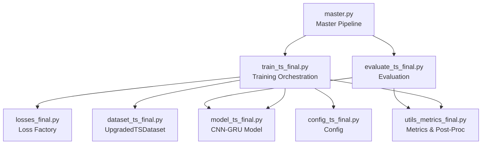
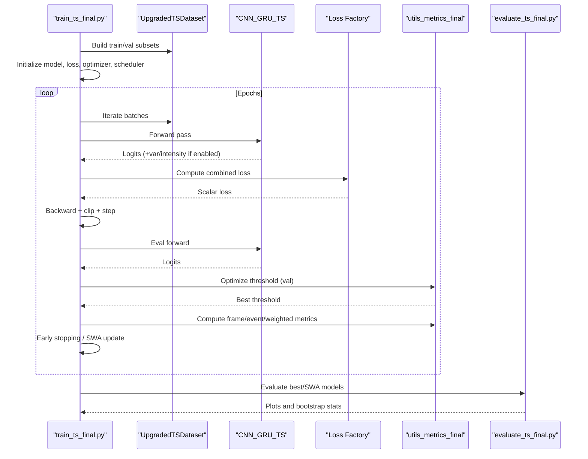
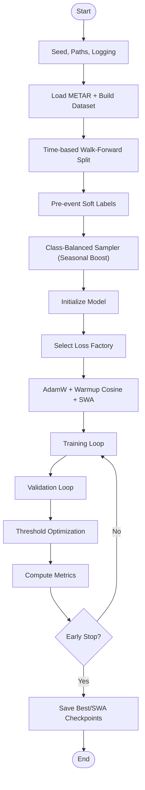
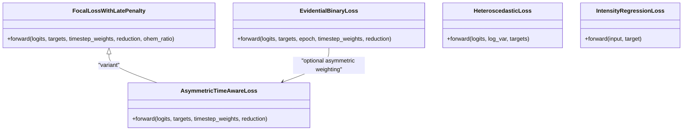
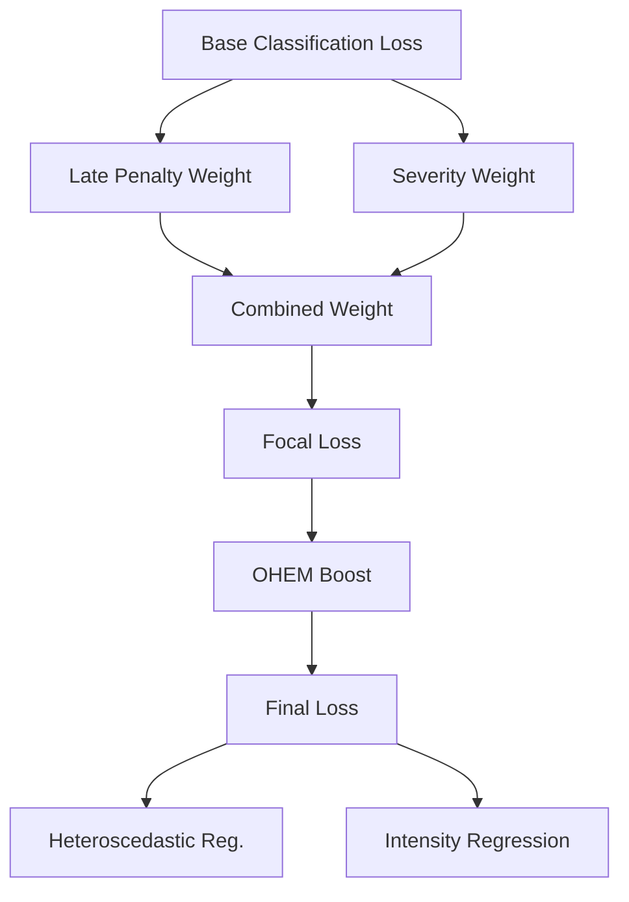
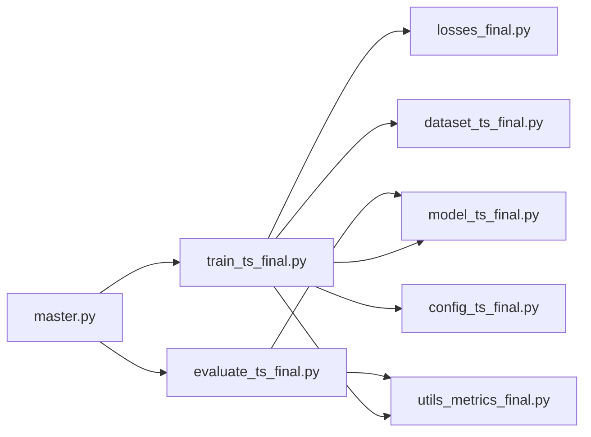

# Training System Design

<cite>
**Referenced Files in This Document**
- [train_ts_final.py](file://train_ts_final.py)
- [losses_final.py](file://losses_final.py)
- [model_ts_final.py](file://model_ts_final.py)
- [dataset_ts_final.py](file://dataset_ts_final.py)
- [config_ts_final.py](file://config_ts_final.py)
- [utils_metrics_final.py](file://utils_metrics_final.py)
- [evaluate_ts_final.py](file://evaluate_ts_final.py)
- [master.py](file://master.py)
</cite>

## Table of Contents
1. [Introduction](#introduction)
2. [Project Structure](#project-structure)
3. [Core Components](#core-components)
4. [Architecture Overview](#architecture-overview)
5. [Detailed Component Analysis](#detailed-component-analysis)
6. [Dependency Analysis](#dependency-analysis)
7. [Performance Considerations](#performance-considerations)
8. [Troubleshooting Guide](#troubleshooting-guide)
9. [Conclusion](#conclusion)
10. [Appendices](#appendices)

## Introduction
This document describes the training system architecture and optimization strategies for the Nagpur Thunderstorm Nowcasting pipeline. It explains the training orchestration workflow, the loss function factory pattern, multi-objective optimization approaches, asymmetric time-aware and focal loss implementations, uncertainty-aware training objectives, training loop architecture, gradient management, regularization techniques, performance monitoring, validation strategies, hyperparameter optimization workflows, distributed training considerations, mixed precision training, memory optimization, checkpoint management, experiment tracking, and reproducibility measures.

## Project Structure
The training system is organized around a modular Python package with clear separation of concerns:
- Training orchestration and loop: [train_ts_final.py](file://train_ts_final.py)
- Loss factory and uncertainty-aware objectives: [losses_final.py](file://losses_final.py)
- Model architecture and multi-head outputs: [model_ts_final.py](file://model_ts_final.py)
- Dataset construction and augmentation: [dataset_ts_final.py](file://dataset_ts_final.py)
- Configuration and constants: [config_ts_final.py](file://config_ts_final.py)
- Metrics and post-processing utilities: [utils_metrics_final.py](file://utils_metrics_final.py)
- Evaluation and plotting: [evaluate_ts_final.py](file://evaluate_ts_final.py)
- Master pipeline runner: [master.py](file://master.py)

**Diagram sources**
- [train_ts_final.py:142-757](file://train_ts_final.py#L142-L757)
- [model_ts_final.py:68-335](file://model_ts_final.py#L68-L335)
- [losses_final.py:13-258](file://losses_final.py#L13-L258)
- [dataset_ts_final.py:47-515](file://dataset_ts_final.py#L47-L515)
- [utils_metrics_final.py:14-760](file://utils_metrics_final.py#L14-L760)
- [config_ts_final.py:16-208](file://config_ts_final.py#L16-L208)
- [evaluate_ts_final.py:361-800](file://evaluate_ts_final.py#L361-L800)
- [master.py:39-108](file://master.py#L39-L108)

**Section sources**
- [train_ts_final.py:142-757](file://train_ts_final.py#L142-L757)
- [model_ts_final.py:68-335](file://model_ts_final.py#L68-L335)
- [losses_final.py:13-258](file://losses_final.py#L13-L258)
- [dataset_ts_final.py:47-515](file://dataset_ts_final.py#L47-L515)
- [config_ts_final.py:16-208](file://config_ts_final.py#L16-L208)
- [utils_metrics_final.py:14-760](file://utils_metrics_final.py#L14-L760)
- [evaluate_ts_final.py:361-800](file://evaluate_ts_final.py#L361-L800)
- [master.py:39-108](file://master.py#L39-L108)

## Core Components
- Training orchestration and loop: manages data splits, samplers, model/loss/optimizer/scheduler initialization, training/validation loops, metrics computation, early stopping, SWA, checkpointing, and logging.
- Loss factory: provides focal loss with late penalty, asymmetric time-aware loss, evidential learning, heteroscedastic uncertainty, and intensity regression loss.
- Model: CNN-GRU with spatial skip connections, optional optical flow, METAR/time features, and multi-head outputs for classification, uncertainty, and intensity.
- Dataset: HDF5-backed IR sequences with dynamic channel stacking, augmentation, and severity/intensity labels.
- Metrics and post-processing: temporal smoothing, persistence filtering, event-level metrics, lead-time analysis, and threshold optimization.
- Evaluation: inference, threshold selection from validation, calibration, and comprehensive plotting.

**Section sources**
- [train_ts_final.py:142-757](file://train_ts_final.py#L142-L757)
- [losses_final.py:13-258](file://losses_final.py#L13-L258)
- [model_ts_final.py:68-335](file://model_ts_final.py#L68-L335)
- [dataset_ts_final.py:47-515](file://dataset_ts_final.py#L47-L515)
- [utils_metrics_final.py:14-760](file://utils_metrics_final.py#L14-L760)
- [evaluate_ts_final.py:361-800](file://evaluate_ts_final.py#L361-L800)

## Architecture Overview
The training system follows a factory-driven design:
- Configuration drives model creation, loss selection, and training behavior.
- The dataset yields multi-modal sequences with optional augmentations.
- The model produces logits and optionally uncertainty/intensity heads.
- Loss factory composes primary and auxiliary objectives.
- Metrics utilities optimize thresholds and compute event-level scores.
- Evaluation runs inference with calibrated thresholds and generates diagnostics.

**Diagram sources**
- [train_ts_final.py:199-729](file://train_ts_final.py#L199-L729)
- [dataset_ts_final.py:337-515](file://dataset_ts_final.py#L337-L515)
- [model_ts_final.py:202-268](file://model_ts_final.py#L202-L268)
- [losses_final.py:13-258](file://losses_final.py#L13-L258)
- [utils_metrics_final.py:192-315](file://utils_metrics_final.py#L192-L315)
- [evaluate_ts_final.py:361-800](file://evaluate_ts_final.py#L361-L800)

## Detailed Component Analysis

### Training Orchestration Workflow
- Initialization: seed setting, run directory, logging, configuration loading.
- Data preparation: METAR loading, dataset building, time-based walk-forward splits, pre-event soft labeling, class-balanced sampling with seasonal boosting, and subset creation.
- Model/loss/optimizer/scheduler: dynamic selection among focal/asymmetric/evidential losses; optional temporal consistency, heteroscedastic, and intensity regression losses; AdamW with cosine warmup; optional SWA.
- Training loop: forward, loss computation with additive weighting (late penalty + severity), gradient clipping, optimizer step; validation with same weighting; threshold optimization; metrics computation; early stopping; SWA updates; checkpointing.
- Selection and logging: aviation score and baseline checks; best model selection; CSV predictions; run archiving.

**Diagram sources**
- [train_ts_final.py:142-757](file://train_ts_final.py#L142-L757)

**Section sources**
- [train_ts_final.py:142-757](file://train_ts_final.py#L142-L757)

### Loss Function Factory Pattern Implementation
The system implements a flexible factory that selects among:
- Focal loss with late penalty and label smoothing.
- Asymmetric time-aware loss with anticipation rewards.
- Evidential deep learning with asymmetric weighting and KL regularization.
- Heteroscedastic uncertainty loss.
- Intensity regression loss.

Key design points:
- All losses accept optional timestep weights for additive weighting of late detections and severity.
- OHEM is integrated into focal loss for hard negative mining.
- EDL supports an epoch-dependent annealing schedule.
- Multi-task losses are summed with configurable weights.

**Diagram sources**
- [losses_final.py:13-258](file://losses_final.py#L13-L258)

**Section sources**
- [losses_final.py:13-258](file://losses_final.py#L13-L258)

### Multi-Objective Optimization Approaches
- Additive weighting: combines late detection penalty and severity weights into a single scalar multiplier applied to the base loss.
- OHEM: focuses on hard negatives to improve generalization.
- Temporal consistency: deprecated in favor of temporal smoothing and persistence filtering.
- Heteroscedastic uncertainty: adds aleatoric uncertainty regularization.
- Intensity regression: adds continuous severity prediction objective.
- Threshold optimization: grid search over thresholds and Schmitt trigger hysteresis on validation set; weighted event metrics with lead-time bonuses.

**Diagram sources**
- [train_ts_final.py:417-444](file://train_ts_final.py#L417-L444)
- [losses_final.py:13-143](file://losses_final.py#L13-L143)

**Section sources**
- [train_ts_final.py:417-444](file://train_ts_final.py#L417-L444)
- [losses_final.py:13-143](file://losses_final.py#L13-L143)

### Asymmetric Time-Aware Loss Functions
- Penalizes misses of severe events and high-confidence false alarms differently.
- Applies anticipation reward to encourage early triggers for precursor signals.
- Integrates with severity weighting and timestep weighting.

**Section sources**
- [losses_final.py:144-194](file://losses_final.py#L144-L194)

### Focal Loss Implementations
- Handles soft labels via focal modulation and label smoothing.
- Supports OHEM to boost hard negatives.
- Uses alpha balancing and positive class weighting.

**Section sources**
- [losses_final.py:13-92](file://losses_final.py#L13-L92)

### Uncertainty-Aware Training Objectives
- Heteroscedastic loss: learns log-variance to down-weight noisy frames.
- Evidential learning: uses EDL with asymmetric weighting and KL regularization; supports single-pass epistemic uncertainty.
- MC Dropout fallback: enables Monte Carlo sampling for epistemic uncertainty.

**Section sources**
- [losses_final.py:112-143](file://losses_final.py#L112-L143)
- [losses_final.py:195-256](file://losses_final.py#L195-L256)
- [model_ts_final.py:274-335](file://model_ts_final.py#L274-L335)

### Training Loop Architecture, Gradient Management, and Regularization
- Training loop: forward, loss, backward with gradient norm clipping, optimizer step; validation with same weighting and threshold optimization.
- Regularization: dropout in feature projection and GRU, weight decay, freeze backbone, augmentation (flip, temporal masking, channel dropout, noise).
- Early stopping: decoupled from selection criteria; triggered by validation loss plateau.
- SWA: optional averaging of weights after a start epoch.

**Section sources**
- [train_ts_final.py:386-729](file://train_ts_final.py#L386-L729)
- [model_ts_final.py:105-111](file://model_ts_final.py#L105-L111)
- [dataset_ts_final.py:436-469](file://dataset_ts_final.py#L436-L469)

### Performance Monitoring, Validation Strategies, and Hyperparameter Optimization
- Metrics: frame metrics (F1/F2/ETS/CSI/POD/FAR/SEDI), event metrics (POD/FAR/CSI/SEDI), weighted event metrics with lead-time bonuses, lead-time distributions, and severity breakdown.
- Threshold optimization: grid search over thresholds or dual thresholds with Schmitt trigger; persistence filtering; Platt scaling calibration.
- Bootstrapped confidence intervals: temporal block bootstrap by calendar day for robust estimates.

**Section sources**
- [utils_metrics_final.py:192-315](file://utils_metrics_final.py#L192-L315)
- [utils_metrics_final.py:395-478](file://utils_metrics_final.py#L395-L478)
- [utils_metrics_final.py:575-651](file://utils_metrics_final.py#L575-L651)
- [evaluate_ts_final.py:508-800](file://evaluate_ts_final.py#L508-L800)

### Distributed Training, Mixed Precision, and Memory Optimization
- Distributed training: not implemented in the current scripts; training is executed on a single device.
- Mixed precision: not enabled; training uses standard float32.
- Memory optimization: pin_memory in DataLoader, adaptive pooling, dropout, freezing backbone, and careful batching.

**Section sources**
- [train_ts_final.py:282-283](file://train_ts_final.py#L282-L283)
- [model_ts_final.py:103-111](file://model_ts_final.py#L103-L111)
- [config_ts_final.py:39-46](file://config_ts_final.py#L39-L46)

### Checkpoint Management, Experiment Tracking, and Reproducibility
- Checkpointing: saves model, optimizer, scheduler, epoch, best score, patience, and SWA states; copies logs and predictions to run directory.
- Experiment tracking: run folders with timestamps, CSV predictions, and JSON histories; master pipeline orchestrates training and evaluation.
- Reproducibility: deterministic seeds, configuration-driven behavior, and explicit logging.

**Section sources**
- [train_ts_final.py:335-379](file://train_ts_final.py#L335-L379)
- [train_ts_final.py:694-711](file://train_ts_final.py#L694-L711)
- [train_ts_final.py:745-755](file://train_ts_final.py#L745-L755)
- [master.py:39-108](file://master.py#L39-L108)

## Dependency Analysis
The training system exhibits strong cohesion within modules and controlled coupling:
- train_ts_final.py depends on model, losses, dataset, metrics, and config.
- model_ts_final.py depends on torchvision models and config for dynamic channel adaptation.
- losses_final.py is standalone and stateless.
- dataset_ts_final.py depends on utils and config for feature extraction and augmentation.
- utils_metrics_final.py is a utility library consumed by both training and evaluation.
- evaluate_ts_final.py mirrors dataset/model usage and reuses metrics utilities.

**Diagram sources**
- [train_ts_final.py:142-757](file://train_ts_final.py#L142-L757)
- [model_ts_final.py:68-335](file://model_ts_final.py#L68-L335)
- [losses_final.py:13-258](file://losses_final.py#L13-L258)
- [dataset_ts_final.py:47-515](file://dataset_ts_final.py#L47-L515)
- [utils_metrics_final.py:14-760](file://utils_metrics_final.py#L14-L760)
- [config_ts_final.py:16-208](file://config_ts_final.py#L16-L208)
- [evaluate_ts_final.py:361-800](file://evaluate_ts_final.py#L361-L800)
- [master.py:39-108](file://master.py#L39-L108)

**Section sources**
- [train_ts_final.py:142-757](file://train_ts_final.py#L142-L757)
- [model_ts_final.py:68-335](file://model_ts_final.py#L68-L335)
- [losses_final.py:13-258](file://losses_final.py#L13-L258)
- [dataset_ts_final.py:47-515](file://dataset_ts_final.py#L47-L515)
- [utils_metrics_final.py:14-760](file://utils_metrics_final.py#L14-L760)
- [config_ts_final.py:16-208](file://config_ts_final.py#L16-L208)
- [evaluate_ts_final.py:361-800](file://evaluate_ts_final.py#L361-L800)
- [master.py:39-108](file://master.py#L39-L108)

## Performance Considerations
- Model efficiency: GRU replaces transformer to reduce parameters and improve CPU inference speed.
- Regularization: dropout, weight decay, freezing backbone, augmentation, and OHEM reduce overfitting.
- Data pipeline: pin_memory and worker-based loading improve throughput.
- Metrics: temporal smoothing and persistence filtering balance sensitivity and specificity.

[No sources needed since this section provides general guidance]

## Troubleshooting Guide
Common issues and remedies:
- Missing HDF5 files or corrupted datasets: verify paths and presence of .h5 files.
- Channel mismatch between checkpoint and model: partial loading logic attempts to load compatible tensors.
- Excessive false alarms: adjust POS_WEIGHT_FACTOR, OHEM_RATIO, and threshold optimization strategy; consider asymmetric loss and EDL.
- Overfitting: increase dropout, weight decay, freeze backbone, reduce learning rate, enable SWA.
- Memory issues: reduce batch size, disable optical flow, or use fewer workers.

**Section sources**
- [train_ts_final.py:335-379](file://train_ts_final.py#L335-L379)
- [dataset_ts_final.py:62-77](file://dataset_ts_final.py#L62-L77)
- [config_ts_final.py:39-46](file://config_ts_final.py#L39-L46)

## Conclusion
The training system employs a robust, configurable factory pattern for losses, integrates multi-objective objectives with uncertainty-aware components, and implements strong validation and evaluation practices. The orchestration ensures reproducibility, comprehensive logging, and practical operational metrics. While distributed training and mixed precision are not currently implemented, the architecture is prepared to adopt these techniques with minimal refactoring.

## Appendices

### Configuration Highlights
- Model: GRU hidden size, layers, dropout, sequence length, lead time, channel selection.
- Training: epochs, batch size, learning rate, weight decay, patience, SWA.
- Loss: focal gamma/alpha, positive weight, late penalty, label smoothing, asymmetric loss, EDL, heteroscedastic, intensity regression.
- Data augmentation: channel dropout, noise, temporal masking.
- Post-processing: smoothing window/method, persistence threshold, threshold metric, Schmitt trigger, Platt scaling.

**Section sources**
- [config_ts_final.py:16-208](file://config_ts_final.py#L16-L208)