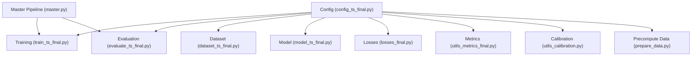
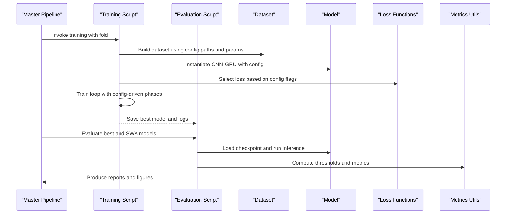
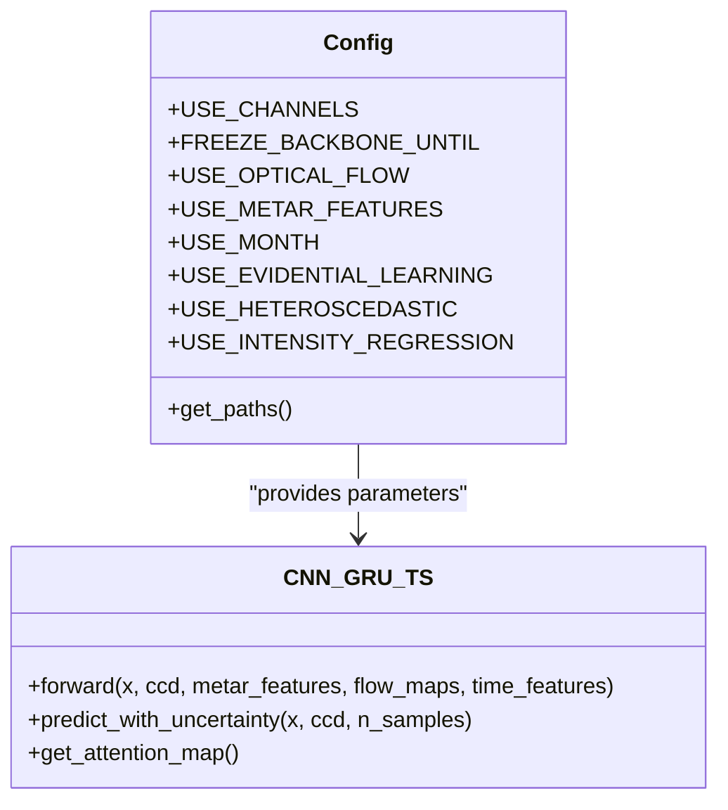
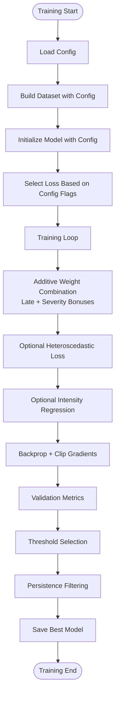
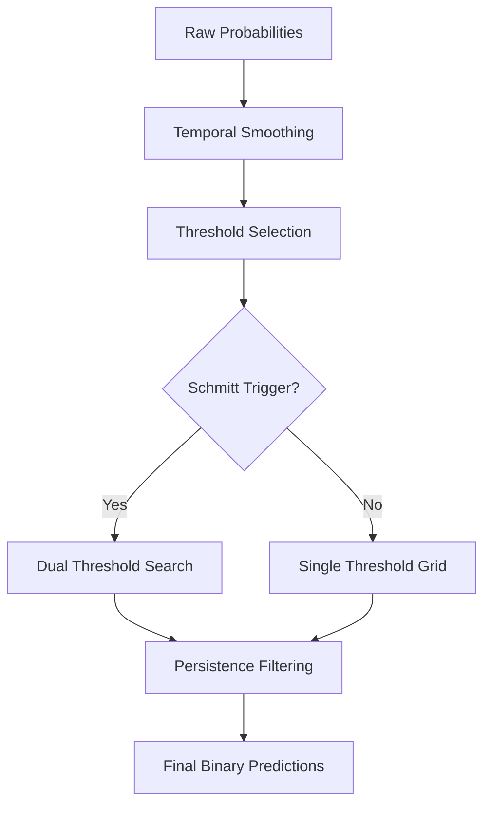
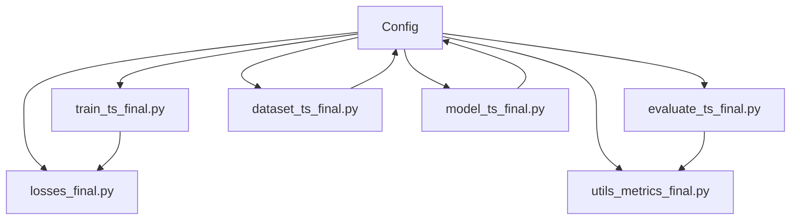

# Configuration Management

<cite>
**Referenced Files in This Document**
- [config_ts_final.py](file://config_ts_final.py)
- [model_ts_final.py](file://model_ts_final.py)
- [train_ts_final.py](file://train_ts_final.py)
- [dataset_ts_final.py](file://dataset_ts_final.py)
- [losses_final.py](file://losses_final.py)
- [utils_metrics_final.py](file://utils_metrics_final.py)
- [evaluate_ts_final.py](file://evaluate_ts_final.py)
- [master.py](file://master.py)
- [prepare_data.py](file://prepare_data.py)
- [utils_calibration.py](file://utils_calibration.py)
</cite>

## Table of Contents
1. [Introduction](#introduction)
2. [Project Structure](#project-structure)
3. [Core Components](#core-components)
4. [Architecture Overview](#architecture-overview)
5. [Detailed Component Analysis](#detailed-component-analysis)
6. [Dependency Analysis](#dependency-analysis)
7. [Performance Considerations](#performance-considerations)
8. [Troubleshooting Guide](#troubleshooting-guide)
9. [Conclusion](#conclusion)
10. [Appendices](#appendices)

## Introduction
This document explains the centralized configuration management system used across the Nagpur TS Nowcasting pipeline. It covers the Config class design, parameter categories, interdependencies, and how configuration drives optimization phases such as channel selection, temporal consistency, heteroscedastic loss, intensity regression, seasonal sampling, threshold optimization, and uncertainty quantification. It also documents validation procedures, default rationale, sensitivity analysis guidance, and best practices for experimentation and collaboration.

## Project Structure
The configuration system is encapsulated in a single Python module and consumed by training, evaluation, dataset construction, and model components. The master pipeline orchestrates end-to-end execution using the shared configuration.

**Diagram sources**
- [config_ts_final.py:16-208](file://config_ts_final.py#L16-L208)
- [train_ts_final.py:142-757](file://train_ts_final.py#L142-L757)
- [evaluate_ts_final.py:361-908](file://evaluate_ts_final.py#L361-L908)
- [dataset_ts_final.py:47-515](file://dataset_ts_final.py#L47-L515)
- [model_ts_final.py:68-335](file://model_ts_final.py#L68-L335)
- [losses_final.py:13-258](file://losses_final.py#L13-L258)
- [utils_metrics_final.py:14-760](file://utils_metrics_final.py#L14-L760)
- [utils_calibration.py:1-420](file://utils_calibration.py#L1-L420)
- [prepare_data.py:1-132](file://prepare_data.py#L1-L132)
- [master.py:39-108](file://master.py#L39-L108)

**Section sources**
- [config_ts_final.py:16-208](file://config_ts_final.py#L16-L208)
- [master.py:39-108](file://master.py#L39-L108)

## Core Components
- Centralized Config class defines all runtime parameters and provides a unified interface for training, evaluation, datasets, and model instantiation.
- Parameter categories include data paths, model architecture, training hyperparameters, loss function settings, post-processing controls, spatial masks, METAR features, and uncertainty quantification.
- The Config class exposes a get_paths method for validation and integrates with the model’s dynamic channel adaptation and dataset augmentation logic.

Key configuration categories and representative parameters:
- Data paths: DATA_DIR, PRECOMPUTED_DIR, METAR_FILE, CCD_FILE, MODEL_OUT, LOG_DIR, CACHE_DIR
- Model architecture: HIDDEN_DIM, NUM_LAYERS, DROPOUT, SEQ_LEN, LEAD, FREEZE_BACKBONE_UNTIL, USE_CHANNELS
- Training: EPOCHS, BATCH_SIZE, LEARNING_RATE, WEIGHT_DECAY, PATIENCE, USE_SWA, SWA_START_EPOCH
- Data augmentation: AUG_CHANNEL_DROPOUT, AUG_NOISE_PROB, AUG_GAUSSIAN_NOISE
- Seasonal sampling: SEASONAL_BOOST
- Loss function: GAMMA, ALPHA, POS_WEIGHT_FACTOR, LATE_PENALTY_WEIGHT, LABEL_SMOOTHING, USE_ASYMMETRIC_LOSS, USE_EVIDENTIAL_LEARNING
- Temporal consistency: LAMBDA_TC
- Heteroscedastic loss: USE_HETEROSCEDASTIC, HETEROSCEDASTIC_WEIGHT
- Intensity regression: USE_INTENSITY_REGRESSION, LAMBDA_REGRESSION
- Pre-event labeling: PRE_EVENT_WINDOW
- Post-processing: SMOOTH_WINDOW, SMOOTH_METHOD, PERSISTENCE_MIN_LEN, MAX_LEAD_MINUTES, THRESHOLD_METRIC, MIN_THRESHOLD, USE_SCHMITT_TRIGGER, SEVERITY_WEIGHTS
- Spatial mask: MASK_CENTER, MASK_SIGMA, STATION_RADIUS_PX, USE_MASK, USE_CCD, USE_MONTH
- METAR features: USE_METAR_FEATURES, METAR_FEATURE_WINDOWS, METAR_WEIGHT, SAMPLER_POS_RATE, OHEM_RATIO
- Calibration: USE_PLATT_SCALING
- MC Dropout: USE_MC_DROPOUT, MC_DROPOUT_SAMPLES, MC_UNCERTAINTY_THRESHOLD
- Additional: SEVERE_FAST_TRACK, USE_SAMPLE, TRAIN_END, VAL_END, SEED, DEVICE

**Section sources**
- [config_ts_final.py:16-208](file://config_ts_final.py#L16-L208)

## Architecture Overview
The configuration system is a central hub that:
- Drives model construction with dynamic channel selection and backbone freezing
- Controls training loss composition and phase-specific objectives
- Guides dataset augmentation and pre-event soft labeling
- Orchestrates post-processing thresholds and uncertainty quantification
- Enables walk-forward cross-validation splits and evaluation workflows

**Diagram sources**
- [master.py:39-108](file://master.py#L39-L108)
- [train_ts_final.py:142-757](file://train_ts_final.py#L142-L757)
- [evaluate_ts_final.py:361-908](file://evaluate_ts_final.py#L361-L908)
- [dataset_ts_final.py:47-515](file://dataset_ts_final.py#L47-L515)
- [model_ts_final.py:68-335](file://model_ts_final.py#L68-L335)
- [losses_final.py:13-258](file://losses_final.py#L13-L258)
- [utils_metrics_final.py:14-760](file://utils_metrics_final.py#L14-L760)

## Detailed Component Analysis

### Config Class Design and Parameter Categories
- Centralized parameter storage with explicit categories for data paths, model architecture, training, loss, post-processing, spatial masks, METAR features, and uncertainty quantification.
- Provides a get_paths method for validating directory existence and accessibility.
- Uses class-level attributes and a config instance for global access across modules.

Representative categories and their roles:
- Data paths: Ensure correct input/output locations for HDF5 precomputed files, METAR, CCD features, logs, and model outputs.
- Model architecture: Controls GRU hidden size, layers, dropout, sequence length, lead time, and backbone freezing to manage overfitting and computational cost.
- Training: Sets epochs, batch size, learning rate, weight decay, patience, and SWA behavior for generalization and stability.
- Loss function: Supports focal loss with late penalty, asymmetric time-aware loss, evidential learning, and optional heteroscedastic loss and intensity regression.
- Post-processing: Temporal smoothing, persistence filtering, threshold optimization, and Schmitt trigger hysteresis.
- Spatial mask and features: Dynamic mask centering, Gaussian spread, station radius, CCD usage, and monthly time features.
- METAR features: Optional inclusion of pressure drops, wind trends, and cloud features with configurable windows and weights.
- Calibration and uncertainty: Platt scaling, MC Dropout, and evidential learning for epistemic uncertainty.

Parameter interdependencies:
- USE_CHANNELS determines the number of input channels to the CNN backbone and influences dynamic channel adaptation in the model.
- FREEZE_BACKBONE_UNTIL interacts with training schedule and SWA behavior to prevent rapid overfitting.
- SEASONAL_BOOST modifies class-balanced sampling weights for positive examples by season.
- Temporal consistency (LAMBDA_TC) is disabled in favor of other temporal objectives.
- Heteroscedastic loss and intensity regression are optional and compose additively with the primary classification loss.
- Post-processing thresholds depend on THRESHOLD_METRIC, MIN_THRESHOLD, and PERSISTENCE_MIN_LEN.

**Section sources**
- [config_ts_final.py:16-208](file://config_ts_final.py#L16-L208)

### Model Architecture and Dynamic Channel Selection
The model adapts to the configured channels at runtime:
- Reads USE_CHANNELS from config to select input channels for the CNN backbone.
- Dynamically replaces the first convolutional layer to accept the chosen channel count.
- Applies optional optical flow, METAR features, and monthly time features based on config flags.
- Implements backbone freezing controlled by FREEZE_BACKBONE_UNTIL to reduce overfitting.

**Diagram sources**
- [config_ts_final.py:16-208](file://config_ts_final.py#L16-L208)
- [model_ts_final.py:68-335](file://model_ts_final.py#L68-L335)

**Section sources**
- [model_ts_final.py:68-335](file://model_ts_final.py#L68-L335)
- [dataset_ts_final.py:374-515](file://dataset_ts_final.py#L374-L515)

### Training Hyperparameters and Optimization Phases
Training composes multiple objectives and phases:
- Primary classification loss: Focal loss with late penalty, asymmetric time-aware loss, or evidential learning depending on flags.
- Temporal consistency: Disabled via LAMBDA_TC.
- Heteroscedastic loss: Optional aleatoric uncertainty regularization.
- Intensity regression: Optional continuous severity score prediction.
- Class-balanced sampling with seasonal boosting and OHEM.
- SWA for improved generalization.

**Diagram sources**
- [train_ts_final.py:285-448](file://train_ts_final.py#L285-L448)
- [losses_final.py:13-258](file://losses_final.py#L13-L258)

**Section sources**
- [train_ts_final.py:285-448](file://train_ts_final.py#L285-L448)
- [losses_final.py:13-258](file://losses_final.py#L13-L258)

### Post-Processing Controls and Threshold Optimization
Post-processing includes temporal smoothing, persistence filtering, and dual-threshold Schmitt trigger:
- Temporal smoothing via exponential moving average or rolling mean.
- Persistence filtering to remove short-lived false alarms.
- Dual-threshold search for Schmitt trigger hysteresis.
- Minimum threshold and maximum lead minutes constrain evaluation windows.

**Diagram sources**
- [utils_metrics_final.py:23-315](file://utils_metrics_final.py#L23-L315)
- [evaluate_ts_final.py:526-601](file://evaluate_ts_final.py#L526-L601)

**Section sources**
- [utils_metrics_final.py:23-315](file://utils_metrics_final.py#L23-L315)
- [evaluate_ts_final.py:526-601](file://evaluate_ts_final.py#L526-L601)

### Seasonal Sampling System
Seasonal boosting adjusts sampling weights for positive examples by season:
- Applies multipliers to positive weights based on month extracted from timestamps.
- Integrates with class-balanced sampling to improve detection across seasons.

**Section sources**
- [train_ts_final.py:254-277](file://train_ts_final.py#L254-L277)

### Uncertainty Quantification Settings
Two uncertainty approaches are supported:
- Evidential learning: Single-pass epistemic uncertainty via Beta distribution parameters.
- MC Dropout: Monte Carlo sampling for epistemic uncertainty; aleatoric uncertainty via heteroscedastic loss when enabled.

**Section sources**
- [model_ts_final.py:274-335](file://model_ts_final.py#L274-L335)
- [evaluate_ts_final.py:474-500](file://evaluate_ts_final.py#L474-L500)

### Configuration Validation Procedures
- Path validation via get_paths ensures required directories and files exist.
- Training script validates dataset availability and prints informative errors if no samples are found.
- Evaluation script checks model checkpoint existence and attempts partial loading when channel counts differ.

**Section sources**
- [config_ts_final.py:194-206](file://config_ts_final.py#L194-L206)
- [train_ts_final.py:206-209](file://train_ts_final.py#L206-L209)
- [evaluate_ts_final.py:431-446](file://evaluate_ts_final.py#L431-L446)

### Default Value Rationale and Sensitivity Analysis Guidance
- Defaults reflect operational priorities: balanced class handling, temporal smoothing, and conservative false alarm control.
- Sensitivity analysis recommendations:
  - Channel selection: compare USE_CHANNELS impact on validation CSI and ETS.
  - Loss function: test asymmetric vs. focal vs. evidential variants.
  - Threshold optimization: sweep MIN_THRESHOLD and persistence window sizes.
  - Uncertainty: compare MC Dropout vs. evidential learning under CPU constraints.
  - Seasonal boosting: adjust SEASONAL_BOOST multipliers to balance seasons.

[No sources needed since this section provides general guidance]

### Experimentation Workflows and Parameter Tuning Best Practices
- Use walk-forward CV folds to avoid data leakage and ensure robust selection of best models.
- Derive thresholds on validation sets to avoid test leakage; apply Platt scaling when compatible.
- Track operational baselines (e.g., wPOD_evt ≥ 0.60, early detection ≥ 0.40, wFAR_evt ≤ 0.45) for safe model selection.
- Archive runs with detailed logs and predictions for reproducibility and comparison.

**Section sources**
- [train_ts_final.py:637-681](file://train_ts_final.py#L637-L681)
- [evaluate_ts_final.py:504-574](file://evaluate_ts_final.py#L504-L574)

### Configuration Versioning, Backup Strategies, and Collaboration
- Versioning: Maintain separate config files per experiment or use git branches/tags to track changes.
- Backup: Archive model checkpoints, logs, and predictions per run; preserve configuration snapshots alongside artifacts.
- Collaboration: Share configuration presets and validation scripts; enforce consistent path layouts and environment setup.

[No sources needed since this section provides general guidance]

## Dependency Analysis
Configuration dependencies across modules:
- Training depends on Config for loss selection, augmentation, and post-processing parameters.
- Evaluation depends on Config for threshold derivation, calibration, and uncertainty settings.
- Dataset construction reads Config for channel stacks, masking, and feature projections.
- Model construction reads Config for backbone adaptation and heads selection.

**Diagram sources**
- [config_ts_final.py:16-208](file://config_ts_final.py#L16-L208)
- [train_ts_final.py:142-757](file://train_ts_final.py#L142-L757)
- [evaluate_ts_final.py:361-908](file://evaluate_ts_final.py#L361-L908)
- [dataset_ts_final.py:47-515](file://dataset_ts_final.py#L47-L515)
- [model_ts_final.py:68-335](file://model_ts_final.py#L68-L335)
- [losses_final.py:13-258](file://losses_final.py#L13-L258)
- [utils_metrics_final.py:14-760](file://utils_metrics_final.py#L14-L760)

**Section sources**
- [train_ts_final.py:142-757](file://train_ts_final.py#L142-L757)
- [evaluate_ts_final.py:361-908](file://evaluate_ts_final.py#L361-L908)
- [dataset_ts_final.py:47-515](file://dataset_ts_final.py#L47-L515)
- [model_ts_final.py:68-335](file://model_ts_final.py#L68-L335)
- [losses_final.py:13-258](file://losses_final.py#L13-L258)
- [utils_metrics_final.py:14-760](file://utils_metrics_final.py#L14-L760)

## Performance Considerations
- Channel selection reduces input dimensionality to balance accuracy and speed.
- Backbone freezing and dropout mitigate overfitting on limited data.
- Temporal smoothing and persistence filtering reduce false alarms without sacrificing detection.
- SWA improves generalization and enables faster inference via averaged weights.

[No sources needed since this section provides general guidance]

## Troubleshooting Guide
Common issues and resolutions:
- Missing data files: Verify paths via Config.get_paths and ensure HDF5 precomputed files exist.
- Channel mismatch errors: When resuming from checkpoints trained with different channel counts, the training script attempts partial loading.
- Validation failures: Confirm dataset availability and timestamps; ensure METAR and CCD files are present and readable.
- Threshold leakage: Always derive thresholds on validation sets and avoid tuning on test data.

**Section sources**
- [config_ts_final.py:194-206](file://config_ts_final.py#L194-L206)
- [train_ts_final.py:206-209](file://train_ts_final.py#L206-L209)
- [train_ts_final.py:335-379](file://train_ts_final.py#L335-L379)
- [evaluate_ts_final.py:431-446](file://evaluate_ts_final.py#L431-L446)

## Conclusion
The centralized configuration system provides a cohesive foundation for the Nagpur TS Nowcasting pipeline. By organizing parameters into clearly defined categories and enforcing interdependencies, it enables robust experimentation, reliable validation, and scalable deployment. Adhering to the recommended workflows and best practices ensures reproducible results and facilitates collaborative development.

## Appendices

### Appendix A: Configuration Reference by Category
- Data paths: DATA_DIR, PRECOMPUTED_DIR, METAR_FILE, CCD_FILE, MODEL_OUT, LOG_DIR, CACHE_DIR
- Model architecture: HIDDEN_DIM, NUM_LAYERS, DROPOUT, SEQ_LEN, LEAD, FREEZE_BACKBONE_UNTIL, USE_CHANNELS
- Training: EPOCHS, BATCH_SIZE, LEARNING_RATE, WEIGHT_DECAY, PATIENCE, USE_SWA, SWA_START_EPOCH
- Data augmentation: AUG_CHANNEL_DROPOUT, AUG_NOISE_PROB, AUG_GAUSSIAN_NOISE
- Seasonal sampling: SEASONAL_BOOST
- Loss function: GAMMA, ALPHA, POS_WEIGHT_FACTOR, LATE_PENALTY_WEIGHT, LABEL_SMOOTHING, USE_ASYMMETRIC_LOSS, USE_EVIDENTIAL_LEARNING
- Temporal consistency: LAMBDA_TC
- Heteroscedastic loss: USE_HETEROSCEDASTIC, HETEROSCEDASTIC_WEIGHT
- Intensity regression: USE_INTENSITY_REGRESSION, LAMBDA_REGRESSION
- Pre-event labeling: PRE_EVENT_WINDOW
- Post-processing: SMOOTH_WINDOW, SMOOTH_METHOD, PERSISTENCE_MIN_LEN, MAX_LEAD_MINUTES, THRESHOLD_METRIC, MIN_THRESHOLD, USE_SCHMITT_TRIGGER, SEVERITY_WEIGHTS
- Spatial mask: MASK_CENTER, MASK_SIGMA, STATION_RADIUS_PX, USE_MASK, USE_CCD, USE_MONTH
- METAR features: USE_METAR_FEATURES, METAR_FEATURE_WINDOWS, METAR_WEIGHT, SAMPLER_POS_RATE, OHEM_RATIO
- Calibration: USE_PLATT_SCALING
- MC Dropout: USE_MC_DROPOUT, MC_DROPOUT_SAMPLES, MC_UNCERTAINTY_THRESHOLD
- Additional: SEVERE_FAST_TRACK, USE_SAMPLE, TRAIN_END, VAL_END, SEED, DEVICE

**Section sources**
- [config_ts_final.py:16-208](file://config_ts_final.py#L16-L208)