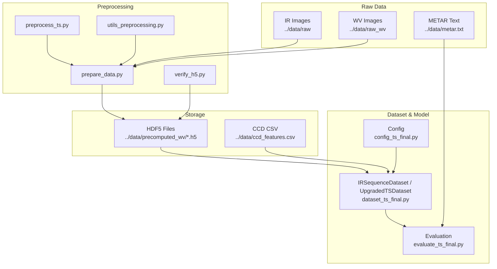
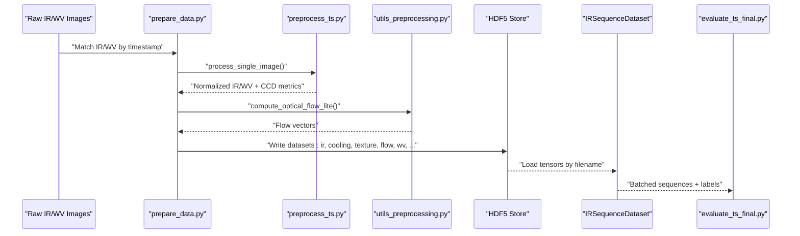
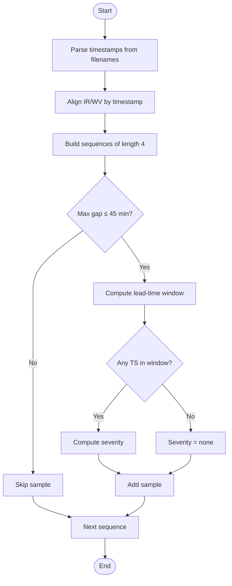
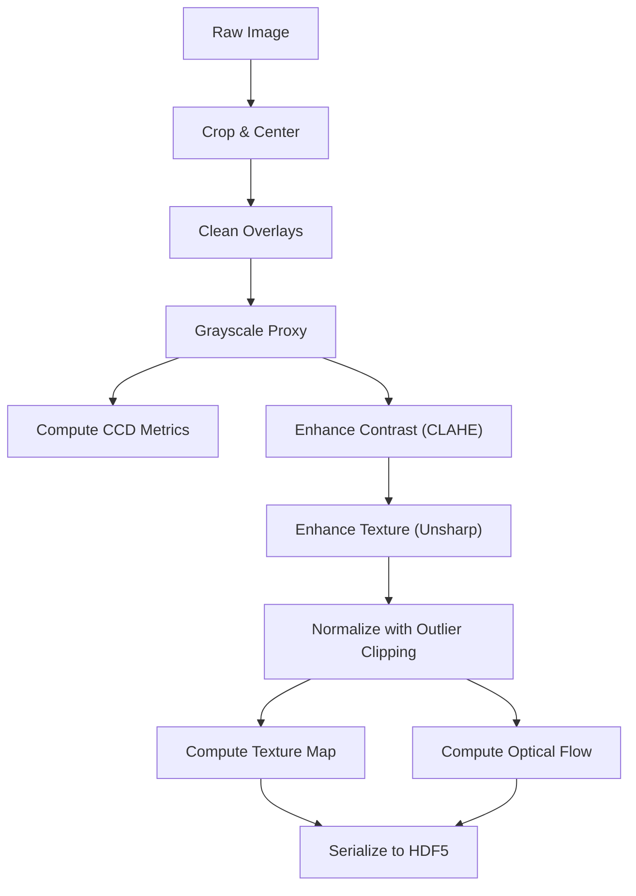
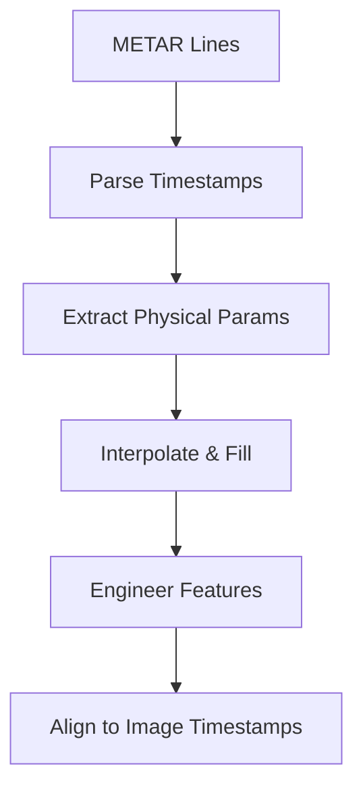
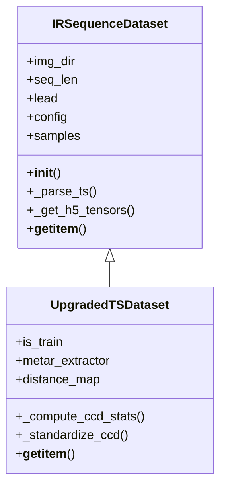
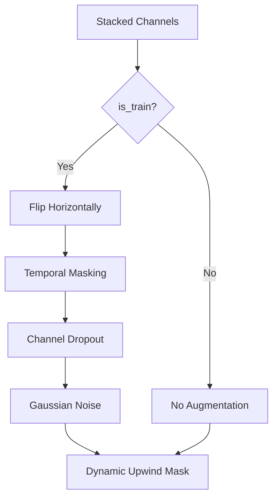
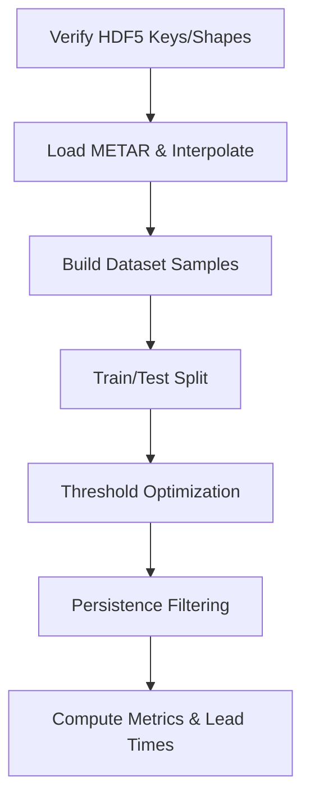
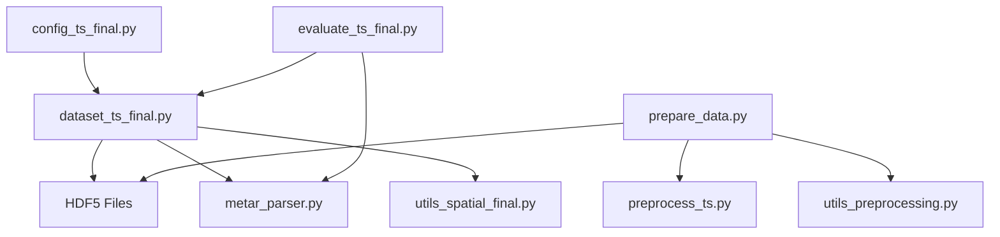

# Data Processing Pipeline

<cite>
**Referenced Files in This Document**
- [dataset_ts_final.py](file://dataset_ts_final.py)
- [preprocess_ts.py](file://preprocess_ts.py)
- [utils_preprocessing.py](file://utils_preprocessing.py)
- [metar_parser.py](file://metar_parser.py)
- [utils_features.py](file://utils_features.py)
- [utils_spatial_final.py](file://utils_spatial_final.py)
- [prepare_data.py](file://prepare_data.py)
- [verify_h5.py](file://verify_h5.py)
- [config_ts_final.py](file://config_ts_final.py)
- [master.py](file://master.py)
- [evaluate_ts_final.py](file://evaluate_ts_final.py)
- [extras/analyze_predictions.py](file://extras/analyze_predictions.py)
</cite>

## Table of Contents
1. [Introduction](#introduction)
2. [Project Structure](#project-structure)
3. [Core Components](#core-components)
4. [Architecture Overview](#architecture-overview)
5. [Detailed Component Analysis](#detailed-component-analysis)
6. [Dependency Analysis](#dependency-analysis)
7. [Performance Considerations](#performance-considerations)
8. [Troubleshooting Guide](#troubleshooting-guide)
9. [Conclusion](#conclusion)
10. [Appendices](#appendices)

## Introduction
This document describes the end-to-end data processing pipeline for INSAT-3DR IR and water vapor (WV) imagery, culminating in model-ready tensors for thunderstorm nowcasting. It covers:
- HDF5 storage layout and access patterns for precomputed IR/WV features
- Multi-temporal sequence construction using 4-frame × 30-minute intervals
- Preprocessing pipeline including contrast enhancement, texture, optical flow, and derived features
- METAR integration and feature extraction
- IRSequenceDataset and UpgradedTSDataset for efficient loading and batching
- Validation, QC, error handling, augmentation, channel selection, and seasonal sampling
- Example transformations and troubleshooting

## Project Structure
The pipeline is organized around a master orchestration script, preprocessing utilities, dataset loaders, and evaluation routines. Key directories and roles:
- Raw imagery: INSAT-3DR IR and WV images stored under ../data/raw and ../data/raw_wv
- Precomputed HDF5: ../data/precomputed_wv containing per-image datasets with standardized keys
- METAR: ../data/metar.txt parsed into a time-indexed DataFrame
- CCD features: ../data/ccd_features.csv for cold cloud density and texture metrics
- Outputs/logs: ../outputs and ./logs for model checkpoints and evaluation artifacts

**Diagram sources**
- [master.py:39-104](file://master.py#L39-L104)
- [prepare_data.py:39-129](file://prepare_data.py#L39-L129)
- [dataset_ts_final.py:47-92](file://dataset_ts_final.py#L47-L92)
- [config_ts_final.py:16-208](file://config_ts_final.py#L16-L208)
- [evaluate_ts_final.py:398-447](file://evaluate_ts_final.py#L398-L447)

**Section sources**
- [master.py:39-104](file://master.py#L39-L104)
- [prepare_data.py:39-129](file://prepare_data.py#L39-L129)
- [dataset_ts_final.py:47-92](file://dataset_ts_final.py#L47-L92)
- [config_ts_final.py:16-208](file://config_ts_final.py#L16-L208)

## Core Components
- HDF5 Storage and Access: Precomputed IR/WV features are stored in HDF5 with fixed keys and shapes, enabling fast random access and caching.
- Multi-temporal Sequences: 4-frame sequences at 30-minute cadence with a lead-time window for nowcasting.
- Preprocessing: Contrast enhancement (CLAHE), texture enhancement, normalization, and optical flow computation.
- METAR Integration: Parsing, interpolation, and feature engineering for pressure drops, wind trends, and cloud coverage.
- Dataset Classes: IRSequenceDataset builds samples and labels; UpgradedTSDataset stacks channels, augments, and applies masks.
- Evaluation: Threshold optimization, persistence filtering, and lead-time analysis.

**Section sources**
- [verify_h5.py:16-28](file://verify_h5.py#L16-L28)
- [dataset_ts_final.py:238-261](file://dataset_ts_final.py#L238-L261)
- [utils_preprocessing.py:16-83](file://utils_preprocessing.py#L16-L83)
- [metar_parser.py:13-185](file://metar_parser.py#L13-L185)
- [dataset_ts_final.py:47-515](file://dataset_ts_final.py#L47-L515)

## Architecture Overview
The pipeline transforms raw satellite imagery into model-ready tensors through a series of stages: ingestion, cleaning and feature extraction, normalization and enhancement, optical flow computation, and HDF5 serialization. The dataset loader then assembles multi-temporal sequences and integrates METAR features and CCD metrics.

**Diagram sources**
- [prepare_data.py:39-129](file://prepare_data.py#L39-L129)
- [preprocess_ts.py:27-112](file://preprocess_ts.py#L27-L112)
- [utils_preprocessing.py:136-162](file://utils_preprocessing.py#L136-L162)
- [dataset_ts_final.py:268-333](file://dataset_ts_final.py#L268-L333)
- [evaluate_ts_final.py:398-447](file://evaluate_ts_final.py#L398-L447)

## Detailed Component Analysis

### HDF5 Storage System for INSAT-3DR IR+WV
- File Naming and Timestamp Parsing: Files are parsed to extract timestamps for alignment between IR and WV.
- Keys and Shapes: Each HDF5 file contains standardized keys with fixed shapes for tensors.
- Access Pattern: Dataset loader caches frequently accessed files to reduce I/O overhead.

Key characteristics:
- Keys include IR, WV, cooling, texture, flow, wv variants, difference, acceleration, and trend.
- Shapes enforce uniformity for model consumption.
- Missing keys are handled gracefully by filling zeros for optical flow channels.

**Section sources**
- [verify_h5.py:16-28](file://verify_h5.py#L16-L28)
- [dataset_ts_final.py:268-303](file://dataset_ts_final.py#L268-L303)

### Multi-temporal Sequence Construction
- Sequence Length and Cadence: 4 frames at 30-minute intervals.
- Gap Constraints: Enforces maximum gaps between frames to ensure continuity.
- Lead-Time Window: Predicts TS occurrence within a defined window after the last frame.
- Labeling: Binary TS presence based on METAR TS events within the window; severity derived from multi-modal criteria.

**Diagram sources**
- [dataset_ts_final.py:238-261](file://dataset_ts_final.py#L238-L261)

**Section sources**
- [dataset_ts_final.py:238-261](file://dataset_ts_final.py#L238-L261)

### Preprocessing Pipeline
- Cleaning and Cropping: Overlay removal and inpainting; cropping to a fixed size centered on known dimensions.
- Feature Extraction: Cold cloud density metrics and Laplacian-based complexity from grayscale proxy.
- Enhancement: CLAHE for contrast and unsharp masking for texture.
- Normalization: Percentile-based clipping to mitigate outliers.
- Optical Flow: Dense flow computation between adjacent frames; cached on disk for reuse.

**Diagram sources**
- [preprocess_ts.py:27-112](file://preprocess_ts.py#L27-L112)
- [utils_preprocessing.py:16-83](file://utils_preprocessing.py#L16-L83)
- [utils_preprocessing.py:136-162](file://utils_preprocessing.py#L136-L162)

**Section sources**
- [preprocess_ts.py:27-112](file://preprocess_ts.py#L27-L112)
- [utils_preprocessing.py:16-83](file://utils_preprocessing.py#L16-L83)
- [utils_preprocessing.py:136-162](file://utils_preprocessing.py#L136-L162)

### METAR Data Integration and Parsing
- Parsing: Extracts TS presence, wind, temperature/dewpoint, pressure, cloud cover, visibility, and rainfall intensity.
- Interpolation: Forward-fill with limits to maintain temporal consistency.
- Feature Engineering: Pressure drops over 3/6 hours, wind speed change, dewpoint trend, wind shift, rolling variance, and composite risk index.
- Alignment: Features aligned to image timestamps via nearest neighbor interpolation.

**Diagram sources**
- [metar_parser.py:13-185](file://metar_parser.py#L13-L185)
- [utils_features.py:11-171](file://utils_features.py#L11-L171)

**Section sources**
- [metar_parser.py:13-185](file://metar_parser.py#L13-L185)
- [utils_features.py:11-171](file://utils_features.py#L11-L171)

### IRSequenceDataset Implementation
- File Discovery and Sorting: Enumerates HDF5 files and sorts by timestamp.
- Masking and CCD: Applies spatial masks and loads CCD features; standardizes if configured.
- Storm Events: Aggregates METAR TS events into contiguous windows and computes severity scores.
- Sample Building: Constructs sequences respecting cadence and lead-time constraints.
- Tensor Retrieval: Loads tensors from cache or HDF5, applying optional masks and channel stacking.

**Diagram sources**
- [dataset_ts_final.py:47-515](file://dataset_ts_final.py#L47-L515)

**Section sources**
- [dataset_ts_final.py:47-515](file://dataset_ts_final.py#L47-L515)

### Data Augmentation, Channel Selection, and Dynamic Masking
- Augmentation (Training Only): Horizontal flip, temporal masking (frame dropout), channel dropout, and Gaussian noise.
- Channel Selection: Configurable channel stack; defaults to a broad set including cooling, texture, WV variants, differences, acceleration, and trend.
- Dynamic Upwind Mask: Adjusts spatial focus based on last-frame flow to emphasize upwind regions.

**Diagram sources**
- [dataset_ts_final.py:374-515](file://dataset_ts_final.py#L374-L515)

**Section sources**
- [dataset_ts_final.py:374-515](file://dataset_ts_final.py#L374-L515)

### Seasonal Sampling Optimizations
- Seasonal Boost Factors: Increase sampling rates for seasons with higher convective activity to balance class distribution.
- Implementation: Applied during dataset indexing or sampler configuration to emphasize underrepresented periods.

**Section sources**
- [config_ts_final.py:53-59](file://config_ts_final.py#L53-L59)

### Validation Procedures and Quality Control
- HDF5 Verification: Ensures all expected keys and shapes exist.
- METAR Coverage: Checks TS counts and interpolates missing values.
- Evaluation Workflow: Threshold optimization on validation set, Platt scaling, persistence filtering, and lead-time analysis.

**Diagram sources**
- [verify_h5.py:16-54](file://verify_h5.py#L16-L54)
- [metar_parser.py:141-185](file://metar_parser.py#L141-L185)
- [evaluate_ts_final.py:502-601](file://evaluate_ts_final.py#L502-L601)

**Section sources**
- [verify_h5.py:16-54](file://verify_h5.py#L16-L54)
- [metar_parser.py:141-185](file://metar_parser.py#L141-L185)
- [evaluate_ts_final.py:502-601](file://evaluate_ts_final.py#L502-L601)

## Dependency Analysis
The dataset depends on HDF5 storage, METAR parsing, and spatial utilities. Preprocessing depends on OpenCV and NumPy/PIL. The evaluation pipeline depends on the dataset and model.

**Diagram sources**
- [config_ts_final.py:16-208](file://config_ts_final.py#L16-L208)
- [dataset_ts_final.py:47-92](file://dataset_ts_final.py#L47-L92)
- [prepare_data.py:39-129](file://prepare_data.py#L39-L129)
- [evaluate_ts_final.py:398-447](file://evaluate_ts_final.py#L398-L447)

**Section sources**
- [config_ts_final.py:16-208](file://config_ts_final.py#L16-L208)
- [dataset_ts_final.py:47-92](file://dataset_ts_final.py#L47-L92)
- [prepare_data.py:39-129](file://prepare_data.py#L39-L129)
- [evaluate_ts_final.py:398-447](file://evaluate_ts_final.py#L398-L447)

## Performance Considerations
- Disk I/O Optimization: File cache in the dataset reduces repeated HDF5 reads.
- Optical Flow Caching: Disk-based caching avoids recomputation.
- Contrast and Texture Enhancement: Applied once during preprocessing to avoid runtime overhead.
- Efficient Normalization: Percentile clipping minimizes extreme outliers impacting training stability.
- Channel Selection: Narrowing channels reduces memory and compute costs.
- Augmentation Placement: Spatial augmentations disabled to preserve optical flow cache integrity; replaced with architectural dropout and noise.

[No sources needed since this section provides general guidance]

## Troubleshooting Guide
Common issues and resolutions:
- Missing HDF5 Keys: Verify expected keys and shapes using the verification script; ensure preprocessing completed successfully.
- Timestamp Mismatch Between IR and WV: Confirm filenames include valid timestamps and that both sensors produced frames within the allowed gap.
- METAR Interpolation Failures: Ensure METAR file exists and contains sufficient records; check for gaps exceeding fill limits.
- Poor Optical Flow Quality: Validate that frames are normalized to [0,1] and that the time gap is within the allowed threshold.
- Memory/CPU Bottlenecks: Reduce batch size, enable caching, and limit channel stack to essential features.

**Section sources**
- [verify_h5.py:16-54](file://verify_h5.py#L16-L54)
- [prepare_data.py:39-129](file://prepare_data.py#L39-L129)
- [metar_parser.py:141-185](file://metar_parser.py#L141-L185)
- [utils_preprocessing.py:136-162](file://utils_preprocessing.py#L136-L162)

## Conclusion
The pipeline provides a robust, reproducible path from raw INSAT-3DR imagery to model-ready sequences. It emphasizes careful preprocessing, standardized HDF5 storage, multi-temporal alignment, and integrated METAR features. The dataset classes support flexible channel selection, augmentation, and dynamic masking, while evaluation ensures reliable threshold selection and lead-time analysis.

[No sources needed since this section summarizes without analyzing specific files]

## Appendices

### Example Workflows
- Precompute HDF5: Run the preparation script to align IR/WV, compute features, and serialize to HDF5.
- Load Dataset: Instantiate the upgraded dataset with configuration and METAR DataFrame; iterate batches for training.
- Evaluate Model: Use the evaluation script to derive thresholds, apply persistence, and compute metrics.

**Section sources**
- [prepare_data.py:39-129](file://prepare_data.py#L39-L129)
- [dataset_ts_final.py:47-515](file://dataset_ts_final.py#L47-L515)
- [evaluate_ts_final.py:398-447](file://evaluate_ts_final.py#L398-L447)

### Configuration Highlights
- Paths: Data directories, METAR, and CCD locations.
- Model Settings: Sequence length, lead time, hidden dimensions, and dropout.
- Channels: Configurable channel stack for multi-sensor fusion.
- Augmentation: Probabilities and noise parameters.
- Seasonal Boost: Sampling weights by season.
- Loss and Metrics: Focal loss, asymmetric loss, evidential learning, and post-processing thresholds.

**Section sources**
- [config_ts_final.py:16-208](file://config_ts_final.py#L16-L208)