# Dataset Construction

<cite>
**Referenced Files in This Document**
- [dataset_ts_final.py](file://dataset_ts_final.py)
- [config_ts_final.py](file://config_ts_final.py)
- [prepare_data.py](file://prepare_data.py)
- [preprocess_ts.py](file://preprocess_ts.py)
- [utils_preprocessing.py](file://utils_preprocessing.py)
- [utils_features.py](file://utils_features.py)
- [utils_spatial_final.py](file://utils_spatial_final.py)
- [metar_parser.py](file://metar_parser.py)
- [model_ts_final.py](file://model_ts_final.py)
- [train_ts_final.py](file://train_ts_final.py)
</cite>

## Table of Contents
1. [Introduction](#introduction)
2. [Project Structure](#project-structure)
3. [Core Components](#core-components)
4. [Architecture Overview](#architecture-overview)
5. [Detailed Component Analysis](#detailed-component-analysis)
6. [Dependency Analysis](#dependency-analysis)
7. [Performance Considerations](#performance-considerations)
8. [Troubleshooting Guide](#troubleshooting-guide)
9. [Conclusion](#conclusion)

## Introduction
This document explains the IRSequenceDataset implementation and the end-to-end dataset construction process for multi-modal satellite nowcasting. It covers:
- Multi-modal data loading architecture supporting IR, WV, cooling, texture, and flow channels
- Dynamic channel stacking controlled by configuration
- Sequence building for 4-frame temporal sequences with 30-minute intervals, including gap detection and temporal consistency validation
- METAR integration workflow, including feature extraction, temporal alignment, and meteorological feature engineering
- CCD (Cold Cloud Duration) feature processing, standardization, and statistical analysis
- Data augmentation strategies (horizontal flipping, temporal masking, channel dropout, Gaussian noise)
- Dynamic upwind masking that adapts spatial focus based on atmospheric flow patterns
- Memory optimization via HDF5 caching and disk-based storage strategies

## Project Structure
The dataset pipeline spans preprocessing, HDF5 generation, dataset construction, and training integration.

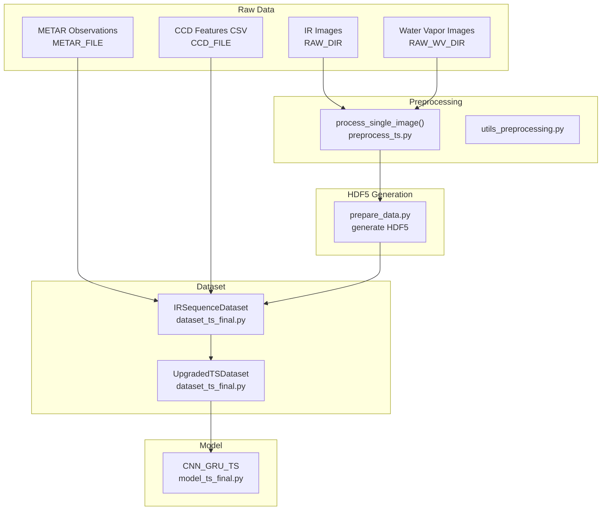

**Diagram sources**
- [prepare_data.py:39-131](file://prepare_data.py#L39-L131)
- [preprocess_ts.py:27-112](file://preprocess_ts.py#L27-L112)
- [dataset_ts_final.py:47-333](file://dataset_ts_final.py#L47-L333)
- [model_ts_final.py:68-268](file://model_ts_final.py#L68-L268)

**Section sources**
- [prepare_data.py:39-131](file://prepare_data.py#L39-L131)
- [dataset_ts_final.py:47-333](file://dataset_ts_final.py#L47-L333)
- [model_ts_final.py:68-268](file://model_ts_final.py#L68-L268)

## Core Components
- IRSequenceDataset: Loads HDF5 files, builds temporal sequences, computes labels, and prepares multi-modal tensors.
- UpgradedTSDataset: Extends IRSequenceDataset with dynamic channel stacking, CCD standardization, METAR features, time features, augmentation, and dynamic upwind masking.
- Preprocessing pipeline: Cleans overlays, computes CCD, and generates standardized images.
- HDF5 generator: Computes derived channels (cooling, texture, flow, differences) and saves to disk.
- METAR parser and extractor: Parses METAR, aligns features to timestamps, and computes meteorological indicators.
- Spatial utilities: Gaussian masks and distance maps for spatial focus and station boundary modeling.

**Section sources**
- [dataset_ts_final.py:47-333](file://dataset_ts_final.py#L47-L333)
- [prepare_data.py:39-131](file://prepare_data.py#L39-L131)
- [utils_features.py:11-171](file://utils_features.py#L11-L171)
- [utils_spatial_final.py:12-65](file://utils_spatial_final.py#L12-L65)

## Architecture Overview
The dataset architecture integrates multi-modal channels, temporal sequences, and external meteorology.

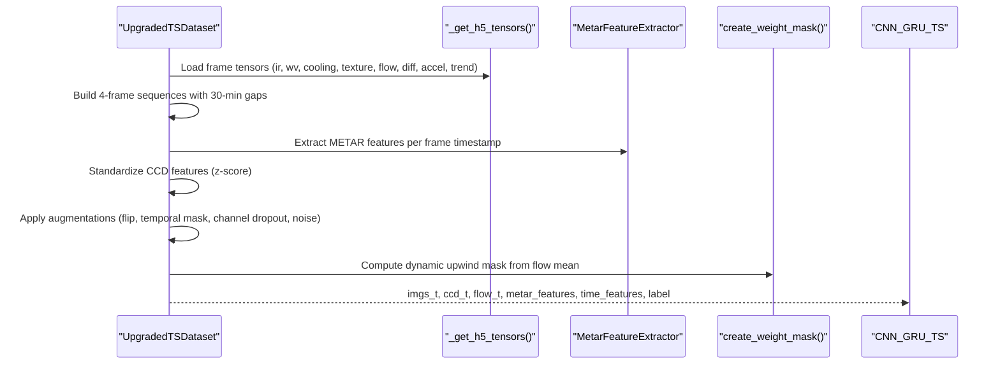

**Diagram sources**
- [dataset_ts_final.py:268-303](file://dataset_ts_final.py#L268-L303)
- [dataset_ts_final.py:374-515](file://dataset_ts_final.py#L374-L515)
- [utils_features.py:11-171](file://utils_features.py#L11-L171)
- [utils_spatial_final.py:12-34](file://utils_spatial_final.py#L12-L34)
- [model_ts_final.py:202-268](file://model_ts_final.py#L202-L268)

## Detailed Component Analysis

### IRSequenceDataset: Multi-modal Loading and Sequence Building
- Initializes with image directory, METAR DataFrame, sequence length, and lead time.
- Discovers HDF5 files and parses timestamps, sorting chronologically.
- Loads METAR and pre-computes storm events with severity classification and intensity scoring.
- Builds samples by sliding 4-frame windows with up to 45-minute gaps and a 60-minute lead time.
- Validates temporal consistency and constructs labels based on TS presence in the event window.

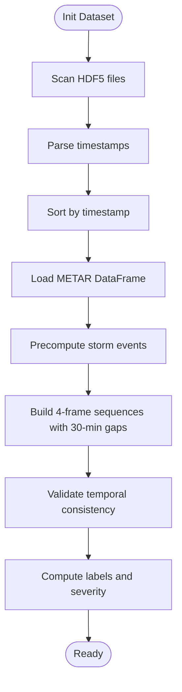

**Diagram sources**
- [dataset_ts_final.py:47-92](file://dataset_ts_final.py#L47-L92)
- [dataset_ts_final.py:137-208](file://dataset_ts_final.py#L137-L208)
- [dataset_ts_final.py:238-261](file://dataset_ts_final.py#L238-L261)

**Section sources**
- [dataset_ts_final.py:47-92](file://dataset_ts_final.py#L47-L92)
- [dataset_ts_final.py:137-208](file://dataset_ts_final.py#L137-L208)
- [dataset_ts_final.py:238-261](file://dataset_ts_final.py#L238-L261)

### HDF5 Caching and Disk-Based Storage
- Uses an OrderedDict cache keyed by filename to avoid repeated HDF5 reads.
- Maintains a maximum cache size to bound memory usage.
- Reads expected keys: ir, cooling, texture, flow, wv, wv_cooling, wv_texture, wv_flow, ir_wv_diff, cooling_accel, btd_trend.
- Applies optional static mask to selected channels when configured.

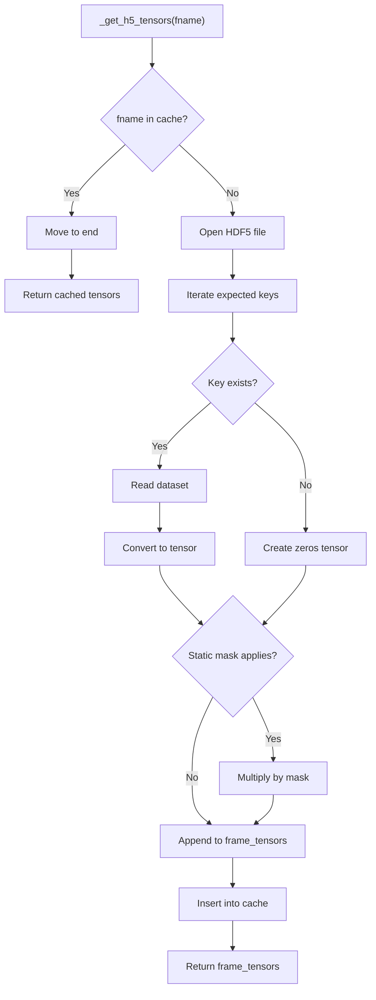

**Diagram sources**
- [dataset_ts_final.py:268-303](file://dataset_ts_final.py#L268-L303)

**Section sources**
- [dataset_ts_final.py:55-59](file://dataset_ts_final.py#L55-L59)
- [dataset_ts_final.py:268-303](file://dataset_ts_final.py#L268-L303)

### Dynamic Channel Stacking Controlled by USE_CHANNELS
- Channels include: ir, cooling, texture, wv, wv_cooling, wv_texture, ir_wv_diff, cooling_accel, btd_trend.
- Stacking is configurable; if empty, defaults to the full set.
- Optical flow channels are concatenated into a single flow tensor when enabled.

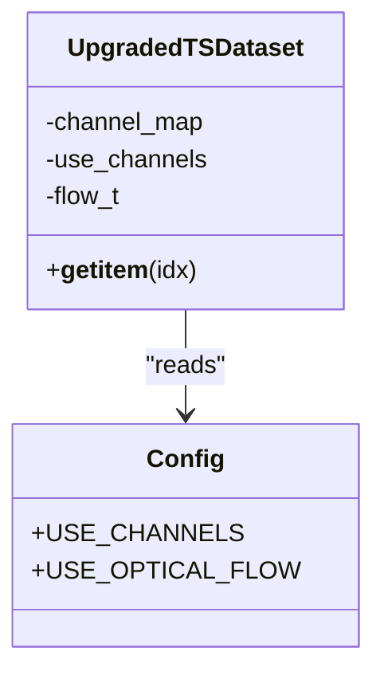

**Diagram sources**
- [dataset_ts_final.py:378-397](file://dataset_ts_final.py#L378-L397)
- [config_ts_final.py:32-33](file://config_ts_final.py#L32-L33)

**Section sources**
- [dataset_ts_final.py:378-397](file://dataset_ts_final.py#L378-L397)
- [config_ts_final.py:32-33](file://config_ts_final.py#L32-L33)

### Sequence Building: 4-Frame Temporal Sequences with 30-Minute Intervals
- Sliding window of 4 frames with 30-minute spacing.
- Gap detection enforces a maximum inter-frame gap of 45 minutes.
- Lead time is 60 minutes; labels are 1 if TS occurs in the event window [t0 + 1 sec, t0 + lead + 30 min].

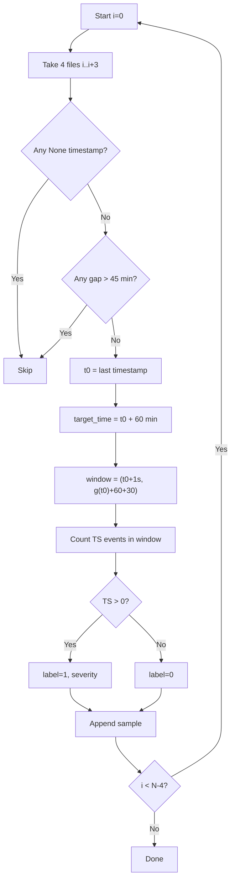

**Diagram sources**
- [dataset_ts_final.py:238-261](file://dataset_ts_final.py#L238-L261)

**Section sources**
- [dataset_ts_final.py:238-261](file://dataset_ts_final.py#L238-L261)

### METAR Integration Workflow
- METAR parsing extracts TS presence, wind, temperature/dewpoint, pressure, cloud cover, visibility, and rainfall intensity.
- Feature extraction computes pressure drops over 3/6 hours, wind speed change, dewpoint trends, wind shift, rolling wind variance, and composite risk.
- Alignment: For each frame timestamp, nearest METAR is used; missing values are forward-filled and defaulted.
- Sequence-aware features: 19-dimensional vector per frame, normalized appropriately.

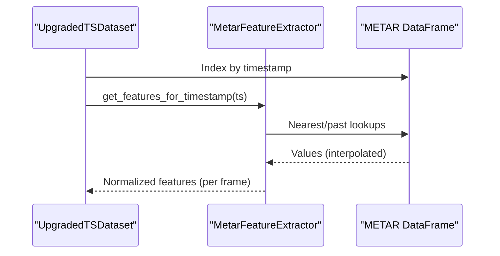

**Diagram sources**
- [utils_features.py:11-171](file://utils_features.py#L11-L171)
- [metar_parser.py:141-185](file://metar_parser.py#L141-L185)
- [dataset_ts_final.py:402-421](file://dataset_ts_final.py#L402-L421)

**Section sources**
- [utils_features.py:11-171](file://utils_features.py#L11-L171)
- [metar_parser.py:141-185](file://metar_parser.py#L141-L185)
- [dataset_ts_final.py:402-421](file://dataset_ts_final.py#L402-L421)

### CCD Feature Processing, Standardization, and Statistical Analysis
- CCD features are loaded from CSV and parsed to timestamps.
- Per-sample CCD vectors are extracted and standardized via z-score using dataset-wide means and standard deviations.
- Statistics are computed across all samples to ensure consistent normalization.

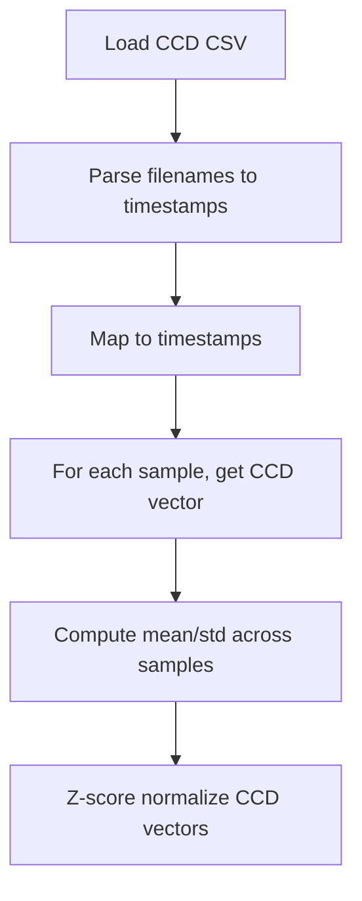

**Diagram sources**
- [dataset_ts_final.py:104-136](file://dataset_ts_final.py#L104-L136)
- [dataset_ts_final.py:358-372](file://dataset_ts_final.py#L358-L372)

**Section sources**
- [dataset_ts_final.py:104-136](file://dataset_ts_final.py#L104-L136)
- [dataset_ts_final.py:358-372](file://dataset_ts_final.py#L358-L372)

### Data Augmentation Strategies
- Horizontal flip (p=0.5) applied uniformly across the sequence; optical flow is flipped and sign-adjusted for horizontal component.
- Temporal masking (frame dropout, p=0.20) zeros out a random frame and associated auxiliary features.
- Channel dropout (p=AUG_CHANNEL_DROPOUT) zeros out a random channel across the sequence.
- Gaussian noise (p=AUG_NOISE_PROB) adds normal noise with std AUG_GAUSSIAN_NOISE.

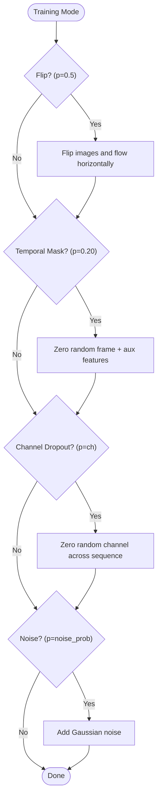

**Diagram sources**
- [dataset_ts_final.py:436-469](file://dataset_ts_final.py#L436-L469)
- [config_ts_final.py:48-51](file://config_ts_final.py#L48-L51)

**Section sources**
- [dataset_ts_final.py:436-469](file://dataset_ts_final.py#L436-L469)
- [config_ts_final.py:48-51](file://config_ts_final.py#L48-L51)

### Dynamic Upwind Masking
- Adapts spatial focus based on atmospheric flow patterns.
- Computes mean u,v from the last flow map; shifts mask center proportionally to flow velocity.
- Applies a Gaussian mask to the stacked image tensor to emphasize the upwind region.

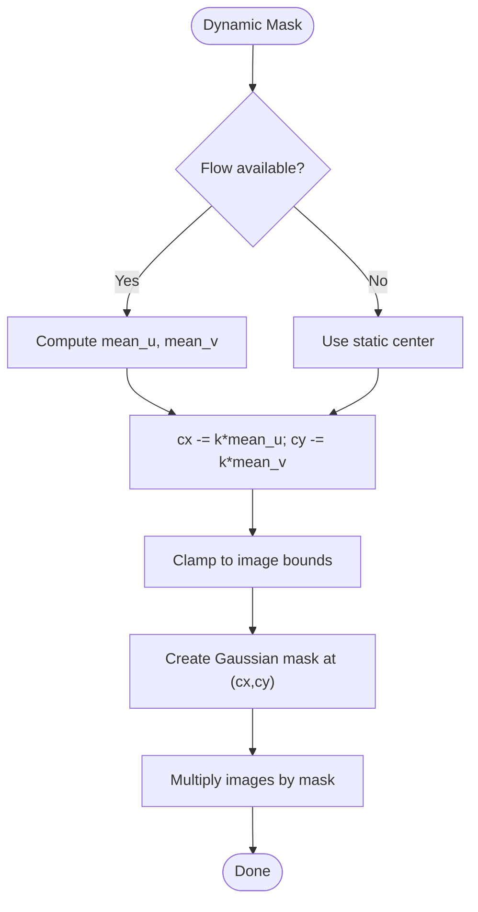

**Diagram sources**
- [dataset_ts_final.py:497-511](file://dataset_ts_final.py#L497-L511)
- [utils_spatial_final.py:12-34](file://utils_spatial_final.py#L12-L34)

**Section sources**
- [dataset_ts_final.py:497-511](file://dataset_ts_final.py#L497-L511)
- [utils_spatial_final.py:12-34](file://utils_spatial_final.py#L12-L34)

### HDF5 Generation and Derived Channels
- Preprocessing cleans overlays and computes CCD metrics.
- HDF5 stores normalized IR and WV, cooling rates, textures, optical flow, IR-WV difference, cooling acceleration, and BTD trend.
- Optical flow is computed between consecutive frames when the time gap is ≤ 45 minutes.

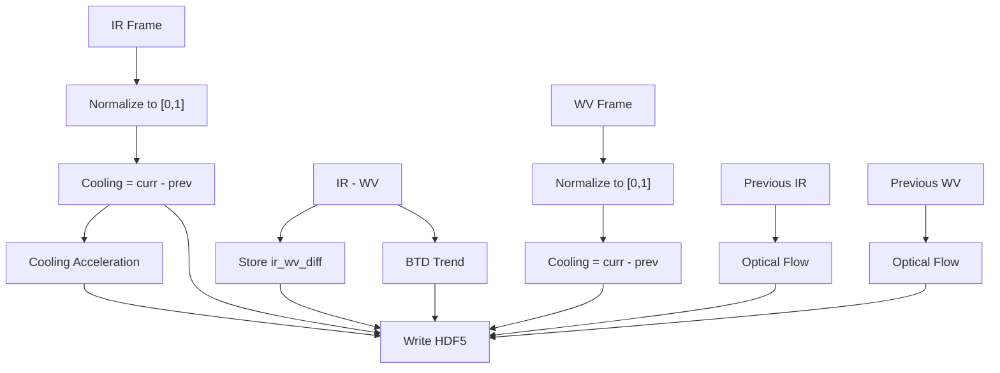

**Diagram sources**
- [prepare_data.py:39-131](file://prepare_data.py#L39-L131)
- [preprocess_ts.py:27-112](file://preprocess_ts.py#L27-L112)

**Section sources**
- [prepare_data.py:39-131](file://prepare_data.py#L39-L131)
- [preprocess_ts.py:27-112](file://preprocess_ts.py#L27-L112)

## Dependency Analysis
- UpgradedTSDataset depends on:
  - HDF5 cache for fast frame retrieval
  - METAR extractor for sequence-aligned features
  - Spatial utilities for masks and distance maps
  - Config for channel selection, augmentation, and masking parameters
- Model integration:
  - CNN_GRU_TS adapts its input channels dynamically based on USE_CHANNELS
  - Accepts optional flow, METAR, time, and CCD inputs depending on configuration

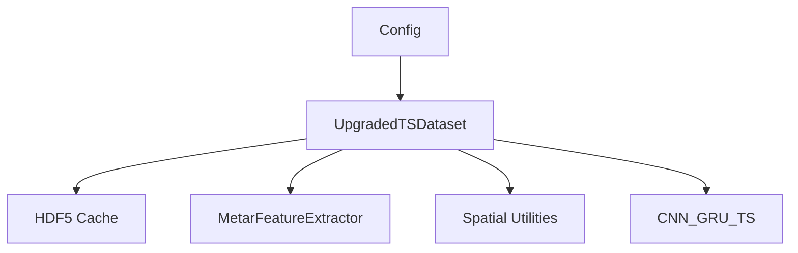

**Diagram sources**
- [config_ts_final.py:16-208](file://config_ts_final.py#L16-L208)
- [dataset_ts_final.py:337-515](file://dataset_ts_final.py#L337-L515)
- [model_ts_final.py:68-268](file://model_ts_final.py#L68-L268)

**Section sources**
- [config_ts_final.py:16-208](file://config_ts_final.py#L16-L208)
- [dataset_ts_final.py:337-515](file://dataset_ts_final.py#L337-L515)
- [model_ts_final.py:68-268](file://model_ts_final.py#L68-L268)

## Performance Considerations
- HDF5 caching:
  - Uses an OrderedDict cache with a configurable maximum size to reduce I/O overhead.
  - Ensures least-recently-used eviction to bound memory usage.
- Disk-based storage:
  - All channels are stored in compressed HDF5 files for efficient random access.
  - Optical flow is precomputed and cached to disk to avoid recomputation during training.
- Training-time augmentation:
  - Augmentations are applied in tensor space to minimize CPU/GPU transfer overhead.
- Model adaptivity:
  - The CNN backbone’s first convolution is adapted to the number of input channels, enabling efficient channel selection without retraining.

**Section sources**
- [dataset_ts_final.py:55-59](file://dataset_ts_final.py#L55-L59)
- [dataset_ts_final.py:268-303](file://dataset_ts_final.py#L268-L303)
- [prepare_data.py:103-117](file://prepare_data.py#L103-L117)
- [model_ts_final.py:82-100](file://model_ts_final.py#L82-L100)

## Troubleshooting Guide
- Missing or misaligned timestamps:
  - Ensure HDF5 filenames encode valid timestamps and match METAR timestamps.
  - Verify gap detection thresholds and sequence builder logic.
- Empty or missing METAR features:
  - Confirm METAR file path and parsing correctness; interpolated defaults are applied.
- Incorrect channel stacking:
  - Validate USE_CHANNELS configuration and ensure derived channels exist in HDF5.
- Flow-related errors:
  - Optical flow is only computed when gaps are ≤ 45 minutes; confirm preprocessing and gap handling.
- Spatial masking anomalies:
  - Check mask center coordinates and sigma; dynamic masking depends on flow availability.

**Section sources**
- [dataset_ts_final.py:93-102](file://dataset_ts_final.py#L93-L102)
- [dataset_ts_final.py:240-245](file://dataset_ts_final.py#L240-L245)
- [metar_parser.py:141-185](file://metar_parser.py#L141-L185)
- [prepare_data.py:90-101](file://prepare_data.py#L90-L101)

## Conclusion
The IRSequenceDataset implementation provides a robust, configurable, and memory-efficient framework for multi-modal nowcasting. It integrates HDF5-based caching, dynamic channel stacking, temporal sequence building with gap detection, METAR feature engineering, CCD standardization, and adaptive spatial masking guided by atmospheric flow. The UpgradedTSDataset extends this foundation with augmentation and dynamic upwind masking, while the model adapts to the chosen channel configuration. Together, these components enable scalable training and inference on large-scale datasets.