# Meteorological Data Integration

<cite>
**Referenced Files in This Document**
- [metar_parser.py](file://metar_parser.py)
- [utils_features.py](file://utils_features.py)
- [dataset_ts_final.py](file://dataset_ts_final.py)
- [model_ts_final.py](file://model_ts_final.py)
- [train_ts_final.py](file://train_ts_final.py)
- [evaluate_ts_final.py](file://evaluate_ts_final.py)
- [preprocess_ts.py](file://preprocess_ts.py)
- [utils_preprocessing.py](file://utils_preprocessing.py)
- [prepare_data.py](file://prepare_data.py)
- [verify_h5.py](file://verify_h5.py)
- [master.py](file://master.py)
- [comprehensive_model_audit.md](file://reports/comprehensive_model_audit.md)
</cite>

## Table of Contents
1. [Introduction](#introduction)
2. [Project Structure](#project-structure)
3. [Core Components](#core-components)
4. [Architecture Overview](#architecture-overview)
5. [Detailed Component Analysis](#detailed-component-analysis)
6. [Dependency Analysis](#dependency-analysis)
7. [Performance Considerations](#performance-considerations)
8. [Troubleshooting Guide](#troubleshooting-guide)
9. [Conclusion](#conclusion)
10. [Appendices](#appendices)

## Introduction
This document explains the METAR data integration and meteorological feature processing pipeline used for thunderstorm nowcasting. It covers:
- METAR parsing, formatting, and validation
- Extraction of atmospheric features (pressure drops, wind changes, dewpoint trends, cloud characteristics)
- Temporal alignment between satellite imagery timestamps and METAR observations
- Composite risk calculation and integration with satellite-derived features
- Solar zenith angle computation for seasonal and diurnal feature engineering
- Data quality control, missing data handling, and consistency validation
- Practical feature engineering workflows and troubleshooting

## Project Structure
The pipeline integrates METAR observations with geostationary IR/WV imagery through a dataset builder and a trained model. Key modules:
- METAR ingestion and feature extraction
- Satellite precomputation and dataset assembly
- Model training and evaluation with optional METAR features

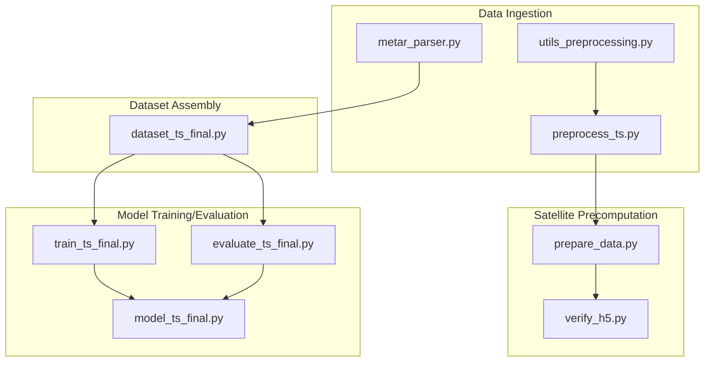

**Diagram sources**
- [metar_parser.py:1-186](file://metar_parser.py#L1-L186)
- [preprocess_ts.py:1-117](file://preprocess_ts.py#L1-L117)
- [utils_preprocessing.py:1-162](file://utils_preprocessing.py#L1-L162)
- [prepare_data.py:1-132](file://prepare_data.py#L1-L132)
- [verify_h5.py:1-57](file://verify_h5.py#L1-L57)
- [dataset_ts_final.py:1-515](file://dataset_ts_final.py#L1-L515)
- [train_ts_final.py:1-757](file://train_ts_final.py#L1-L757)
- [evaluate_ts_final.py:1-908](file://evaluate_ts_final.py#L1-L908)
- [model_ts_final.py:1-335](file://model_ts_final.py#L1-L335)

**Section sources**
- [metar_parser.py:1-186](file://metar_parser.py#L1-L186)
- [dataset_ts_final.py:1-515](file://dataset_ts_final.py#L1-L515)
- [prepare_data.py:1-132](file://prepare_data.py#L1-L132)
- [verify_h5.py:1-57](file://verify_h5.py#L1-L57)
- [model_ts_final.py:1-335](file://model_ts_final.py#L1-L335)

## Core Components
- METAR parser: extracts wind, temperature/dewpoint, pressure, cloud cover, visibility, and precipitation indicators; loads and cleans data; interpolates missing values.
- MetarFeatureExtractor: computes time-aligned features (pressure drops, wind speed change, dewpoint trend, wind shift, rolling variance, composite risk) and cloud composition features.
- Dataset builder: aligns METAR features to satellite sequences, constructs time features (month and solar zenith), and standardizes CCD features.
- Model: integrates METAR features via a learned projection head and temporal fusion with CNN-GRU.

**Section sources**
- [metar_parser.py:13-186](file://metar_parser.py#L13-L186)
- [utils_features.py:11-191](file://utils_features.py#L11-L191)
- [dataset_ts_final.py:47-515](file://dataset_ts_final.py#L47-L515)
- [model_ts_final.py:68-269](file://model_ts_final.py#L68-L269)

## Architecture Overview
The system ingests METAR and satellite data, aligns them temporally, and trains a CNN-GRU model with optional METAR features.

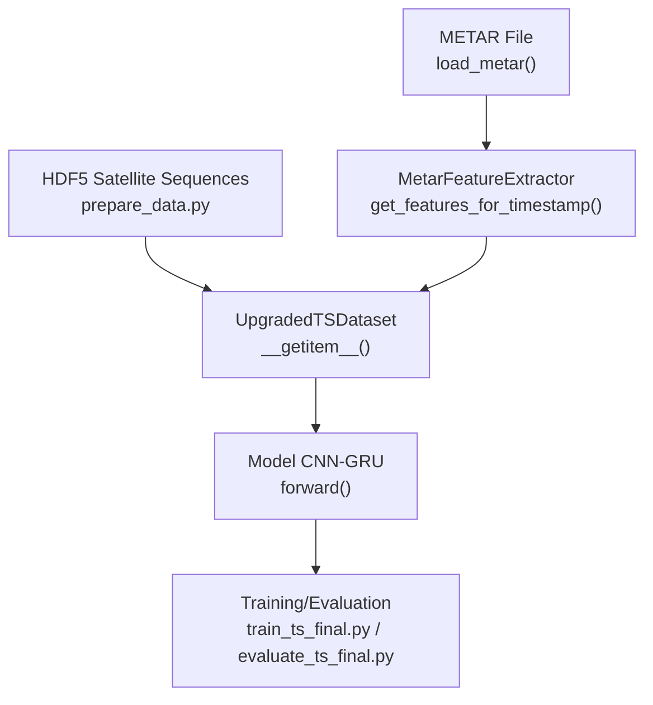

**Diagram sources**
- [metar_parser.py:141-186](file://metar_parser.py#L141-L186)
- [utils_features.py:39-126](file://utils_features.py#L39-L126)
- [prepare_data.py:39-132](file://prepare_data.py#L39-L132)
- [dataset_ts_final.py:337-515](file://dataset_ts_final.py#L337-L515)
- [model_ts_final.py:202-269](file://model_ts_final.py#L202-L269)
- [train_ts_final.py:200-202](file://train_ts_final.py#L200-L202)
- [evaluate_ts_final.py:395-401](file://evaluate_ts_final.py#L395-L401)

## Detailed Component Analysis

### METAR Parsing Workflow
- Input format: a custom timestamp prefix followed by METAR text.
- Extraction targets:
  - Wind: direction, speed, gust
  - Temperature/dewpoint
  - QNH pressure
  - Clouds: coverage (FEW/SCT/BKN/OVC), base altitude, CB/TCU presence
  - Visibility and precipitation intensity
- Post-processing:
  - Deduplicate and sort by timestamp
  - Forward-fill physical parameters with a limit to avoid leakage
  - Fill remaining NaNs with defaults
  - Rain intensity inferred from weather tokens

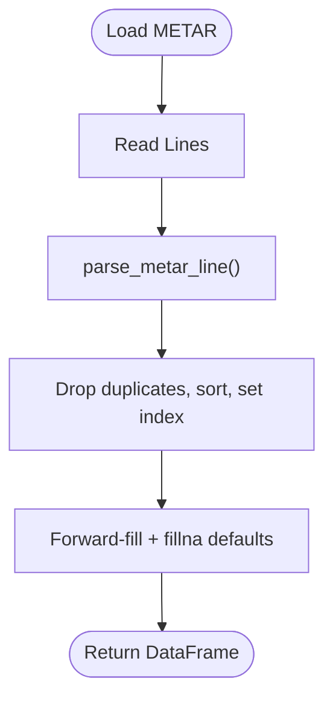

**Diagram sources**
- [metar_parser.py:13-186](file://metar_parser.py#L13-L186)

**Section sources**
- [metar_parser.py:13-186](file://metar_parser.py#L13-L186)

### MetarFeatureExtractor Implementation
- Purpose: compute time-aligned meteorological features for each satellite timestamp.
- Inputs: METAR DataFrame indexed by timestamp; optional window sizes for pressure drops.
- Methods:
  - get_features_for_timestamp(): returns a dictionary of features for a given timestamp
  - _get_nearest(): nearest neighbor lookup
  - _get_past(): lookup at a past offset with tolerance
  - _get_wind_variance(): rolling standard deviation of wind speed
  - _default_features(): fallback when no data is available
- Features:
  - Basic: wind_dir, wind_speed (converted), dewpoint, temperature, pressure
  - Cloud: has_cb, has_tcu, low/mid/high cover, low base, max layers, base spread
  - Trends: pressure_drop_{h} (computed vs past), wind_speed_change_3h, dewpoint_trend_3h
  - Derived: dewpoint_depression, wind_shift_3h (cyclic difference), rolling_wind_var
  - Composite risk: heuristic combining pressure falls, wind increase, dewpoint rise, and humidity proxy

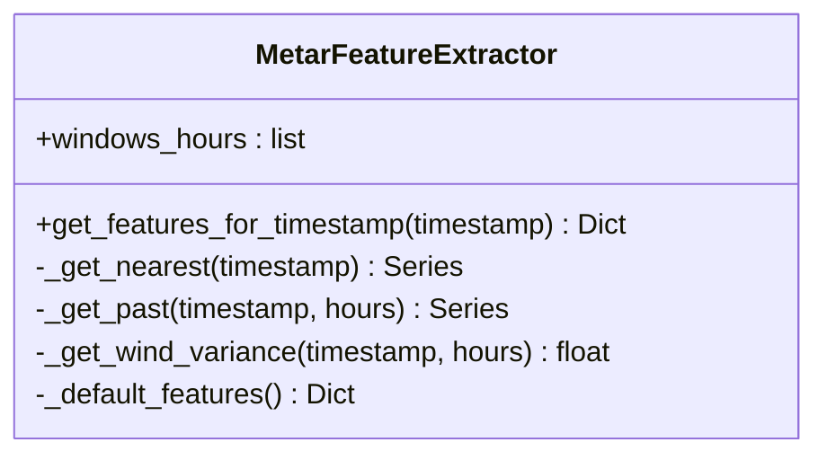

**Diagram sources**
- [utils_features.py:11-171](file://utils_features.py#L11-L171)

**Section sources**
- [utils_features.py:11-191](file://utils_features.py#L11-L191)

### Temporal Alignment Between Satellite and METAR
- Satellite cadence: 30 minutes; METAR cadence: hourly.
- Alignment strategy:
  - Nearest-neighbor matching with ±15 minutes tolerance for METAR lookup
  - Sequence-level alignment: each frame in a satellite sequence receives the same METAR features
  - Time features: month encoded as sinusoidal components and solar zenith angle normalized to [-1, 1]
- Spatial alignment:
  - METAR is a point observation at an airport; satellite views a fixed grid region. This mismatch is acknowledged and mitigated by temporal alignment and learned masks.

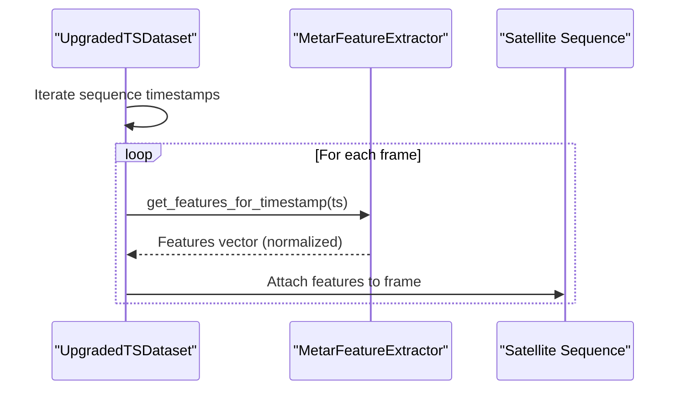

**Diagram sources**
- [dataset_ts_final.py:402-435](file://dataset_ts_final.py#L402-L435)
- [utils_features.py:39-126](file://utils_features.py#L39-L126)

**Section sources**
- [dataset_ts_final.py:402-435](file://dataset_ts_final.py#L402-L435)
- [comprehensive_model_audit.md:237-244](file://reports/comprehensive_model_audit.md#L237-L244)

### Cloud Type Classification and Layer Analysis
- Cloud detection:
  - CB and TCU flags extracted directly from METAR tokens
  - Coverage classes mapped to fractional cover (FEW/SCT/BKN/OVC)
  - Base altitudes parsed from cloud layers; low/mid/high cover determined by base thresholds
  - Additional metrics: max_cloud_layers, cloud_base_spread (thousands of feet)
- Integration:
  - Cloud features are normalized and included in the METAR feature vector for each frame

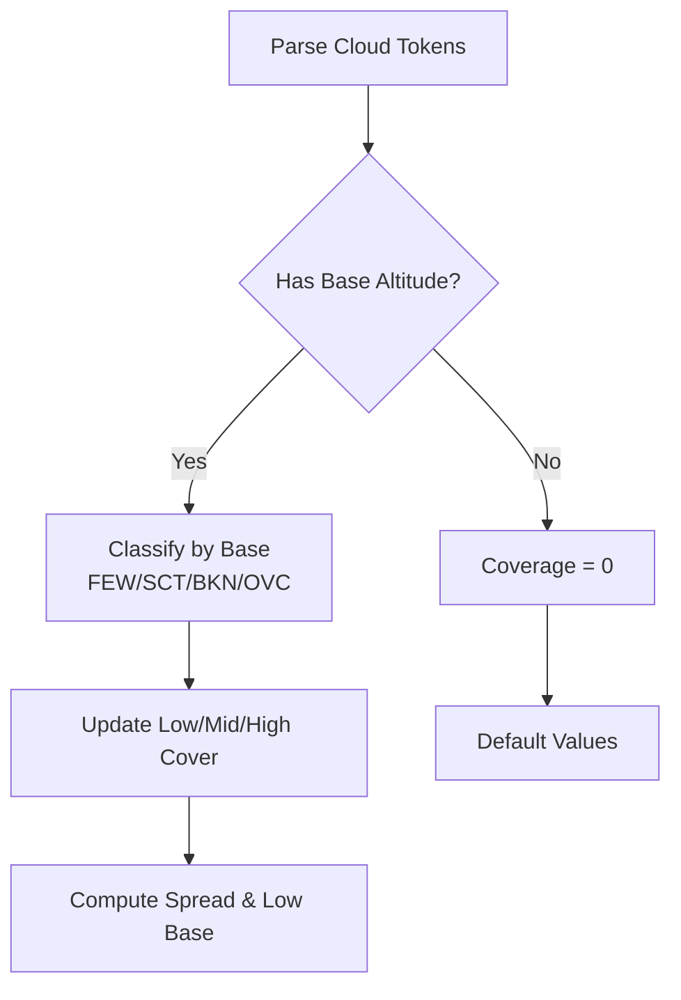

**Diagram sources**
- [metar_parser.py:77-110](file://metar_parser.py#L77-L110)
- [utils_features.py:57-66](file://utils_features.py#L57-L66)

**Section sources**
- [metar_parser.py:77-110](file://metar_parser.py#L77-L110)
- [utils_features.py:57-66](file://utils_features.py#L57-L66)

### Solar Zenith Angle and Seasonal/Diurnal Engineering
- Computation:
  - Declination based on day-of-year
  - Local solar time from UTC and longitude
  - Hour angle derived from LST
  - Cosine of zenith angle computed from latitude, declination, and hour angle
  - Normalized to [-1, 1] for neural network input
- Usage:
  - Monthly sine/cosine and normalized zenith angle fed as time features

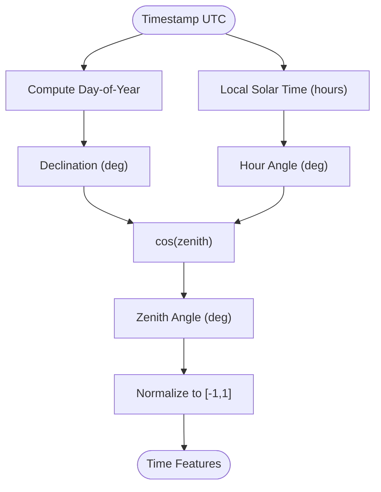

**Diagram sources**
- [utils_features.py:173-191](file://utils_features.py#L173-L191)
- [dataset_ts_final.py:422-434](file://dataset_ts_final.py#L422-L434)

**Section sources**
- [utils_features.py:173-191](file://utils_features.py#L173-L191)
- [dataset_ts_final.py:422-434](file://dataset_ts_final.py#L422-L434)

### Composite Risk Calculation and Integration
- Risk components:
  - Pressure falling over 3/6 hours
  - Increasing wind speed over 3 hours
  - Rising dewpoint over 3 hours
  - High humidity proxy derived from temperature-dewpoint difference
- Aggregation:
  - Heuristic sum capped at 1.0
  - Integrated as a scalar feature and projected by the model alongside other METAR features

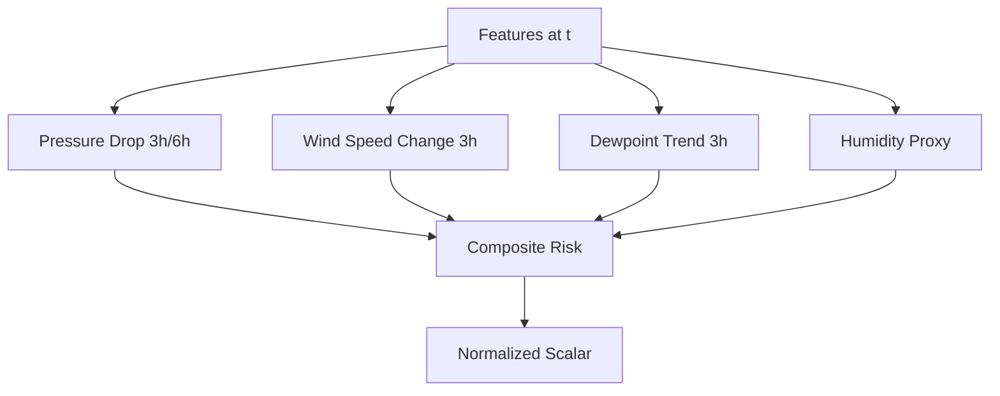

**Diagram sources**
- [utils_features.py:111-125](file://utils_features.py#L111-L125)

**Section sources**
- [utils_features.py:111-125](file://utils_features.py#L111-L125)

### Satellite Precomputation and Dataset Assembly
- Precomputation:
  - Reads IR/WV images, computes derived channels (cooling, texture, optical flow, IR-WV difference, trends)
  - Saves to HDF5 with verified keys and shapes
- Dataset:
  - Loads HDF5 sequences, standardizes CCD features, attaches METAR features, and builds time features
  - Supports optional optical flow and dynamic upwind masking

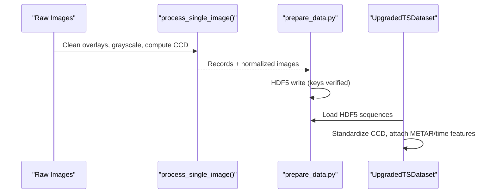

**Diagram sources**
- [preprocess_ts.py:27-112](file://preprocess_ts.py#L27-L112)
- [prepare_data.py:39-129](file://prepare_data.py#L39-L129)
- [verify_h5.py:16-28](file://verify_h5.py#L16-L28)
- [dataset_ts_final.py:337-515](file://dataset_ts_final.py#L337-L515)

**Section sources**
- [preprocess_ts.py:27-112](file://preprocess_ts.py#L27-L112)
- [prepare_data.py:39-129](file://prepare_data.py#L39-L129)
- [verify_h5.py:16-28](file://verify_h5.py#L16-L28)
- [dataset_ts_final.py:337-515](file://dataset_ts_final.py#L337-L515)

### Model Integration and Training
- Model architecture:
  - CNN backbone (MobileNetV2) with spatial skip connections
  - GRU temporal fusion
  - Optional optical flow branch
  - Learned projection for METAR features and time features
- Training:
  - Loads METAR, builds dataset, splits by time, trains with optional METAR features
  - Supports SWA, OHEM, and uncertainty heads
- Evaluation:
  - Applies threshold selection on validation set, persists predictions, and computes metrics

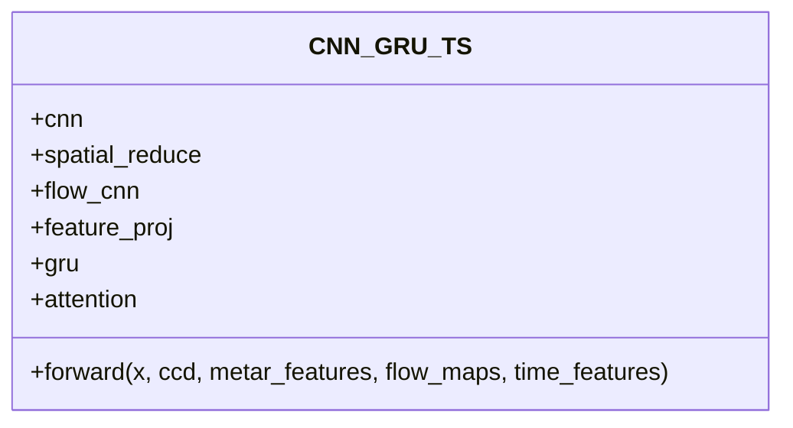

**Diagram sources**
- [model_ts_final.py:68-269](file://model_ts_final.py#L68-L269)

**Section sources**
- [model_ts_final.py:68-269](file://model_ts_final.py#L68-L269)
- [train_ts_final.py:200-202](file://train_ts_final.py#L200-L202)
- [evaluate_ts_final.py:395-401](file://evaluate_ts_final.py#L395-L401)

## Dependency Analysis
- METAR parser depends on pandas and regex; dataset uses METAR features and solar zenith computation; model consumes normalized METAR features.
- Satellite precomputation depends on OpenCV and HDF5; dataset caches and validates HDF5 structure.

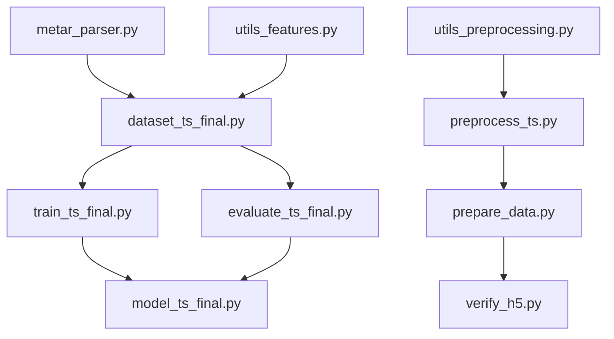

**Diagram sources**
- [metar_parser.py:1-186](file://metar_parser.py#L1-L186)
- [utils_features.py:1-191](file://utils_features.py#L1-L191)
- [preprocess_ts.py:1-117](file://preprocess_ts.py#L1-L117)
- [utils_preprocessing.py:1-162](file://utils_preprocessing.py#L1-L162)
- [prepare_data.py:1-132](file://prepare_data.py#L1-L132)
- [verify_h5.py:1-57](file://verify_h5.py#L1-L57)
- [dataset_ts_final.py:1-515](file://dataset_ts_final.py#L1-L515)
- [train_ts_final.py:1-757](file://train_ts_final.py#L1-L757)
- [evaluate_ts_final.py:1-908](file://evaluate_ts_final.py#L1-L908)
- [model_ts_final.py:1-335](file://model_ts_final.py#L1-L335)

**Section sources**
- [dataset_ts_final.py:337-515](file://dataset_ts_final.py#L337-L515)
- [model_ts_final.py:202-269](file://model_ts_final.py#L202-L269)

## Performance Considerations
- METAR interpolation uses time-aware methods to reduce leakage.
- Rolling wind variance is normalized to stabilize training.
- Model uses learned scaling for METAR features to balance contributions.
- Dataset caches HDF5 files to minimize I/O overhead.

[No sources needed since this section provides general guidance]

## Troubleshooting Guide
Common issues and resolutions:
- Missing METAR records
  - Symptom: NaNs in features
  - Resolution: Parser fills gaps with forward-fill and defaults; ensure METAR cadence is hourly and timestamps are valid
  - Section sources
    - [metar_parser.py:164-181](file://metar_parser.py#L164-L181)
- Temporal misalignment
  - Symptom: ±15 min jitter due to nearest-neighbor matching
  - Resolution: Acceptable for 30-min cadence; consider adjusting tolerance if needed
  - Section sources
    - [utils_features.py:137-144](file://utils_features.py#L137-L144)
    - [comprehensive_model_audit.md:237-244](file://reports/comprehensive_model_audit.md#L237-L244)
- Spatial mismatch between METAR and satellite
  - Symptom: Airport conditions differ from imager region
  - Resolution: Acknowledge and mitigate via temporal alignment and learned masks
  - Section sources
    - [comprehensive_model_audit.md:237-244](file://reports/comprehensive_model_audit.md#L237-L244)
- HDF5 structure errors
  - Symptom: Missing keys or wrong shapes
  - Resolution: Use verification script to confirm expected keys and shapes
  - Section sources
    - [verify_h5.py:16-28](file://verify_h5.py#L16-L28)
- Training instability with METAR features
  - Symptom: Poor convergence or sensitivity to scale
  - Resolution: Ensure features are normalized; model applies learned scaling; verify projection dimensions
  - Section sources
    - [dataset_ts_final.py:403-421](file://dataset_ts_final.py#L403-L421)
    - [model_ts_final.py:131-141](file://model_ts_final.py#L131-L141)

## Conclusion
The pipeline robustly integrates METAR observations with geostationary imagery through careful parsing, feature engineering, and temporal alignment. The MetarFeatureExtractor provides essential atmospheric proxies, while the model learns to fuse these with spatiotemporal satellite features. Quality controls include interpolation, normalization, and validation checks to maintain consistency across modalities.

[No sources needed since this section summarizes without analyzing specific files]

## Appendices

### Example Workflows
- METAR ingestion and feature extraction
  - Load METAR file, parse lines, interpolate gaps, and build a clean DataFrame
  - Section sources
    - [metar_parser.py:141-186](file://metar_parser.py#L141-L186)
- Satellite precomputation
  - Process images, compute derived channels, and save to HDF5 with verified structure
  - Section sources
    - [preprocess_ts.py:27-112](file://preprocess_ts.py#L27-L112)
    - [prepare_data.py:39-129](file://prepare_data.py#L39-L129)
    - [verify_h5.py:16-28](file://verify_h5.py#L16-L28)
- Dataset assembly with METAR features
  - Align METAR to sequences, compute time features, standardize CCD, and assemble inputs
  - Section sources
    - [dataset_ts_final.py:337-515](file://dataset_ts_final.py#L337-L515)
- Training and evaluation
  - Train model with optional METAR features and evaluate on held-out periods
  - Section sources
    - [train_ts_final.py:200-202](file://train_ts_final.py#L200-L202)
    - [evaluate_ts_final.py:395-401](file://evaluate_ts_final.py#L395-L401)