# Preprocessing Pipeline

<cite>
**Referenced Files in This Document**
- [preprocess_ts.py](file://preprocess_ts.py)
- [prepare_data.py](file://prepare_data.py)
- [utils_preprocessing.py](file://utils_preprocessing.py)
- [utils_features.py](file://utils_features.py)
- [dataset_ts_final.py](file://dataset_ts_final.py)
- [config_ts_final.py](file://config_ts_final.py)
- [utils_spatial_final.py](file://utils_spatial_final.py)
- [utils_calibration.py](file://utils_calibration.py)
- [extras/generate_static_masks.py](file://extras/generate_static_masks.py)
- [extras/check_alignment.py](file://extras/check_alignment.py)
- [extras/find_exact_centers.py](file://extras/find_exact_centers.py)
- [master.py](file://master.py)
- [train_ts_final.py](file://train_ts_final.py)
- [model_ts_final.py](file://model_ts_final.py)
</cite>

## Table of Contents
1. [Introduction](#introduction)
2. [Project Structure](#project-structure)
3. [Core Components](#core-components)
4. [Architecture Overview](#architecture-overview)
5. [Detailed Component Analysis](#detailed-component-analysis)
6. [Dependency Analysis](#dependency-analysis)
7. [Performance Considerations](#performance-considerations)
8. [Troubleshooting Guide](#troubleshooting-guide)
9. [Conclusion](#conclusion)
10. [Appendices](#appendices)

## Introduction
This document describes the satellite imagery preprocessing pipeline used for IR (infrared) and water vapor (WV) channels in a convective storm nowcasting system. It explains:
- Radiometric calibration proxies and normalization
- Geometric correction and static mask strategies
- Cloud masking and texture enhancement
- Multi-temporal sequence construction with 4-frame × 30-minute intervals
- Feature extraction workflows for texture, cooling rates, optical flow, and brightness temperature trends
- CLAHE contrast enhancement for cloud detection
- Channel-specific transformations and dynamic masking
- Validation, outlier detection, and consistency checks
- Parameter tuning, batch processing, and performance optimization

## Project Structure
The preprocessing pipeline is composed of:
- Raw image cleaning and grayscale proxy generation
- Precomputation of multi-temporal features and channels
- Dataset assembly with optional optical flow and METAR features
- Configuration-driven channel selection and post-processing

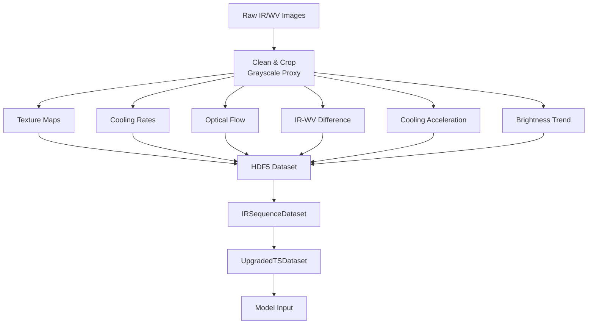

**Diagram sources**
- [preprocess_ts.py:27-112](file://preprocess_ts.py#L27-L112)
- [prepare_data.py:39-128](file://prepare_data.py#L39-L128)
- [dataset_ts_final.py:47-333](file://dataset_ts_final.py#L47-L333)

**Section sources**
- [preprocess_ts.py:1-117](file://preprocess_ts.py#L1-L117)
- [prepare_data.py:1-132](file://prepare_data.py#L1-L132)
- [dataset_ts_final.py:1-515](file://dataset_ts_final.py#L1-L515)

## Core Components
- Raw image cleaning and grayscale proxy generation for IR imagery
- Static mask generation and application for overlay removal
- Texture estimation via local standard deviation
- Cooling rate computation as temporal differencing
- Optical flow computation using a lightweight variant
- Brightness temperature difference and trend estimation
- CLAHE contrast enhancement and cloud texture sharpening
- Multi-temporal sequence building with gap detection and temporal alignment
- Spatial masking and dynamic upwind masking for focus region

**Section sources**
- [preprocess_ts.py:27-112](file://preprocess_ts.py#L27-L112)
- [prepare_data.py:19-128](file://prepare_data.py#L19-L128)
- [utils_preprocessing.py:16-162](file://utils_preprocessing.py#L16-L162)
- [dataset_ts_final.py:47-333](file://dataset_ts_final.py#L47-L333)
- [utils_spatial_final.py:12-80](file://utils_spatial_final.py#L12-L80)

## Architecture Overview
The pipeline transforms raw satellite frames into standardized multi-channel sequences stored in HDF5. The dataset loader reads these sequences and optionally augments them with optical flow, METAR-derived features, and time-of-year proxies.

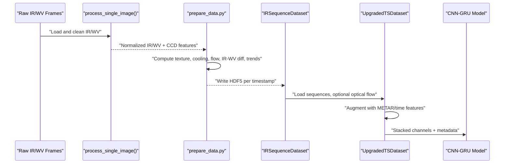

**Diagram sources**
- [preprocess_ts.py:27-112](file://preprocess_ts.py#L27-L112)
- [prepare_data.py:39-128](file://prepare_data.py#L39-L128)
- [dataset_ts_final.py:305-333](file://dataset_ts_final.py#L305-L333)
- [model_ts_final.py:68-200](file://model_ts_final.py#L68-L200)

## Detailed Component Analysis

### Raw Image Cleaning and Grayscale Proxy
- Cleans instrument overlays and grid labels using HSV thresholds and inpainting
- Produces a grayscale proxy where brighter intensities correspond to colder cloud tops
- Computes CCD-based cloud morphological features (threshold counts, connected components, Laplacian variance, coldest pixel)
- Resizes and pads to fixed square size without CLAHE to preserve physical proxies

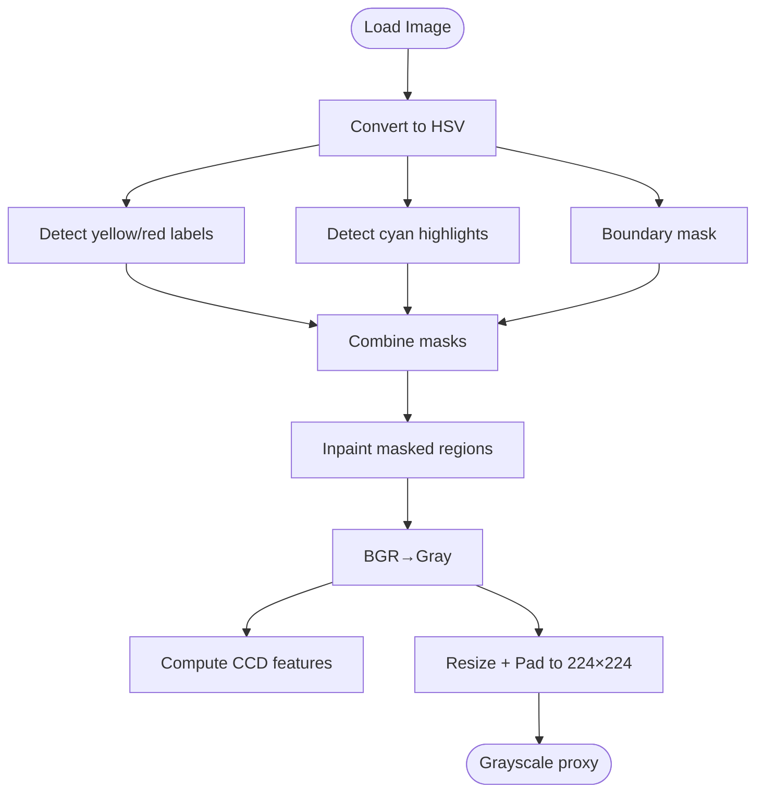

**Diagram sources**
- [preprocess_ts.py:27-112](file://preprocess_ts.py#L27-L112)

**Section sources**
- [preprocess_ts.py:27-112](file://preprocess_ts.py#L27-L112)

### Static Mask Generation and Application
- Generates static masks per image dimension from median crops during clear conditions
- Applies masks to reduce artifacts and improve overlay removal
- Uses dimension-specific thresholds to balance sensitivity and specificity

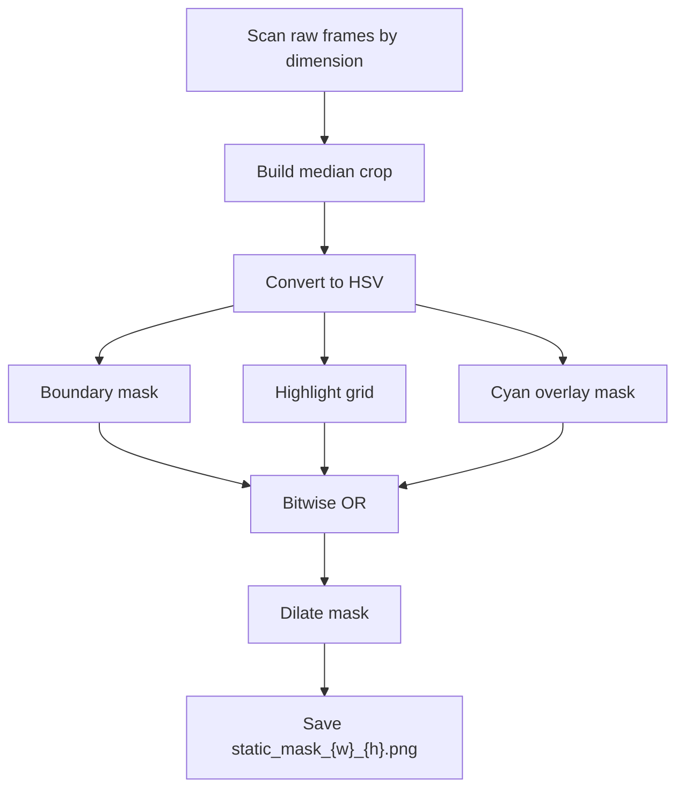

**Diagram sources**
- [extras/generate_static_masks.py:86-147](file://extras/generate_static_masks.py#L86-L147)

**Section sources**
- [extras/generate_static_masks.py:1-150](file://extras/generate_static_masks.py#L1-L150)
- [preprocess_ts.py:17-25](file://preprocess_ts.py#L17-L25)

### Precomputation of Multi-Temporal Features
- Normalizes cleaned grayscale to [0,1]
- Computes texture maps via local standard deviation
- Computes cooling rates as temporal differences between successive frames
- Computes optical flow using a lightweight Farneback variant
- Computes IR-WV difference and brightness temperature difference trend
- Writes all channels and derived features to HDF5 for fast loading

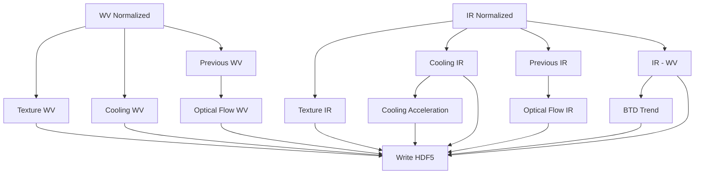

**Diagram sources**
- [prepare_data.py:19-128](file://prepare_data.py#L19-L128)
- [utils_preprocessing.py:136-162](file://utils_preprocessing.py#L136-L162)

**Section sources**
- [prepare_data.py:19-128](file://prepare_data.py#L19-L128)
- [utils_preprocessing.py:136-162](file://utils_preprocessing.py#L136-L162)

### CLAHE and Texture Enhancement
- CLAHE enhances cloud structures for improved detection
- Unsharp masking sharpens cloud edges
- Outlier clipping normalizes to [0,1] using percentile-based clipping
- These steps are applied during dataset transformation for IR channels

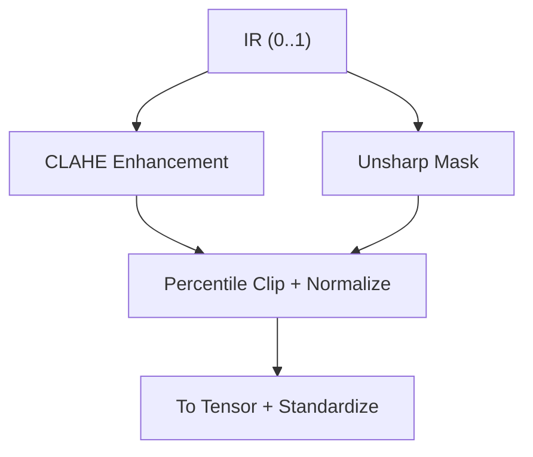

**Diagram sources**
- [utils_preprocessing.py:16-162](file://utils_preprocessing.py#L16-L162)

**Section sources**
- [utils_preprocessing.py:16-162](file://utils_preprocessing.py#L16-L162)

### Multi-Temporal Sequence Construction
- Builds sequences of length 4 with 30-minute intervals
- Enforces maximum gaps ≤ 45 minutes
- Aligns sequences to a lead-time window for forecasting
- Aggregates METAR-derived features and time-of-year proxies per frame
- Supports dynamic upwind masking based on recent flow fields

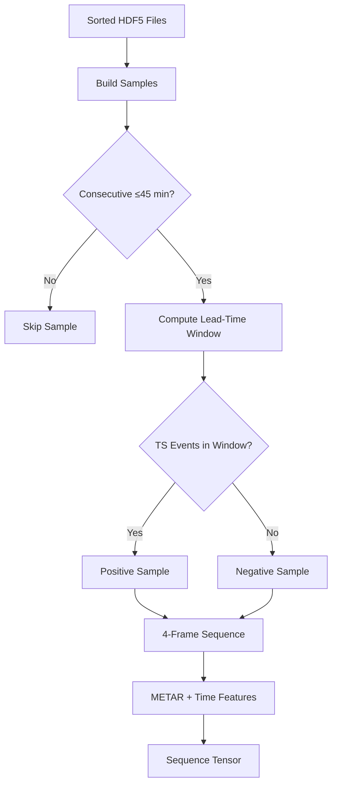

**Diagram sources**
- [dataset_ts_final.py:238-261](file://dataset_ts_final.py#L238-L261)
- [dataset_ts_final.py:305-333](file://dataset_ts_final.py#L305-L333)

**Section sources**
- [dataset_ts_final.py:238-261](file://dataset_ts_final.py#L238-L261)
- [dataset_ts_final.py:305-333](file://dataset_ts_final.py#L305-L333)

### Channel Transformations and Dynamic Masking
- Supports multiple channels: IR, WV, cooling, texture, optical flow, IR-WV difference, cooling acceleration, brightness trend
- Dynamically stacks selected channels according to configuration
- Applies static spatial mask or dynamic upwind mask based on recent flow fields
- Optionally standardizes CCD features across the dataset

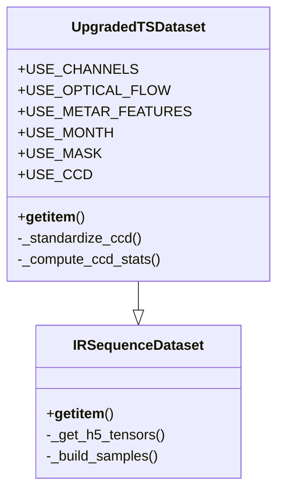

**Diagram sources**
- [dataset_ts_final.py:337-515](file://dataset_ts_final.py#L337-L515)

**Section sources**
- [dataset_ts_final.py:337-515](file://dataset_ts_final.py#L337-L515)
- [utils_spatial_final.py:12-80](file://utils_spatial_final.py#L12-L80)

### METAR Feature Extraction
- Extracts pressure drops, wind speed/direction changes, dewpoint trends, and cloud coverage metrics
- Interpolates missing values using time-aware methods
- Normalizes features and aligns them to image timestamps

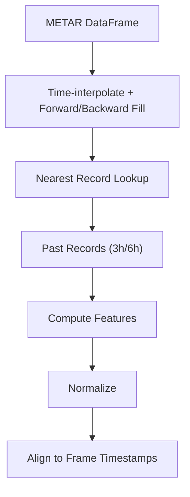

**Diagram sources**
- [utils_features.py:11-171](file://utils_features.py#L11-L171)

**Section sources**
- [utils_features.py:11-171](file://utils_features.py#L11-L171)

### Brightness Temperature and Calibration Utilities
- Provides tools for reliability diagrams, ECE computation, and temperature scaling
- Supports exporting predictions and failure analysis reports

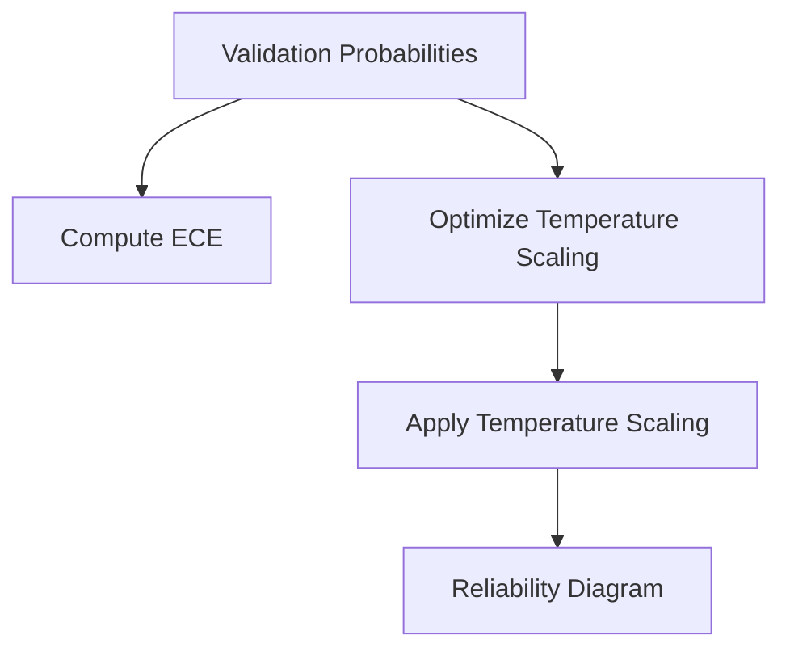

**Diagram sources**
- [utils_calibration.py:24-106](file://utils_calibration.py#L24-L106)
- [utils_calibration.py:112-167](file://utils_calibration.py#L112-L167)

**Section sources**
- [utils_calibration.py:24-106](file://utils_calibration.py#L24-L106)
- [utils_calibration.py:112-167](file://utils_calibration.py#L112-L167)

## Dependency Analysis
The pipeline integrates several modules with clear responsibilities:
- Raw cleaning and grayscale proxy: preprocess_ts.py
- Precomputation of derived features: prepare_data.py
- Contrast and texture enhancement: utils_preprocessing.py
- Dataset assembly and augmentation: dataset_ts_final.py
- Configuration and channel selection: config_ts_final.py
- Spatial masking utilities: utils_spatial_final.py
- METAR feature extraction: utils_features.py
- Calibration and evaluation helpers: utils_calibration.py
- Master orchestration: master.py
- Training and model: train_ts_final.py, model_ts_final.py

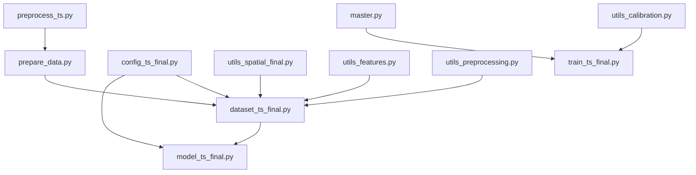

**Diagram sources**
- [preprocess_ts.py:1-117](file://preprocess_ts.py#L1-L117)
- [prepare_data.py:1-132](file://prepare_data.py#L1-L132)
- [dataset_ts_final.py:1-515](file://dataset_ts_final.py#L1-L515)
- [config_ts_final.py:1-208](file://config_ts_final.py#L1-L208)
- [utils_spatial_final.py:1-80](file://utils_spatial_final.py#L1-L80)
- [utils_features.py:1-191](file://utils_features.py#L1-L191)
- [utils_preprocessing.py:1-162](file://utils_preprocessing.py#L1-L162)
- [utils_calibration.py:1-420](file://utils_calibration.py#L1-L420)
- [master.py:1-108](file://master.py#L1-L108)
- [train_ts_final.py:1-200](file://train_ts_final.py#L1-L200)
- [model_ts_final.py:1-200](file://model_ts_final.py#L1-L200)

**Section sources**
- [config_ts_final.py:16-208](file://config_ts_final.py#L16-L208)
- [dataset_ts_final.py:1-515](file://dataset_ts_final.py#L1-L515)

## Performance Considerations
- HDF5 storage with LZF compression reduces I/O overhead
- Disk-based caching for optical flow and HDF5 tensors avoids repeated recomputation
- Efficient tensor operations and minimal augmentation reduce training overhead
- Dynamic channel stacking and optional optical flow enable cost/performance trade-offs
- Static and dynamic spatial masks focus computation on the region of interest

[No sources needed since this section provides general guidance]

## Troubleshooting Guide
Common issues and remedies:
- Dimension mismatch or unknown image size: ensure CENTER_MAP includes the image dimensions; otherwise, frames are skipped
- Missing or corrupted overlays: verify static masks exist for the relevant dimensions
- Temporal gaps exceeding 45 minutes: sequences are ignored; ensure 30-minute cadence
- Outliers in IR values: use percentile-based normalization to mitigate extreme values
- Optical flow instability: disable optical flow or adjust augmentation probabilities

**Section sources**
- [preprocess_ts.py:37-41](file://preprocess_ts.py#L37-L41)
- [extras/generate_static_masks.py:86-147](file://extras/generate_static_masks.py#L86-L147)
- [dataset_ts_final.py:240-246](file://dataset_ts_final.py#L240-L246)
- [utils_preprocessing.py:65-83](file://utils_preprocessing.py#L65-L83)
- [config_ts_final.py:35-51](file://config_ts_final.py#L35-L51)

## Conclusion
The preprocessing pipeline provides a robust, configurable framework for transforming raw IR and WV satellite imagery into standardized multi-temporal sequences. It emphasizes artifact removal, physical proxy preservation, efficient feature extraction, and spatial focus. The modular design enables easy tuning of channels, augmentation, and masking strategies to meet performance and accuracy goals.

[No sources needed since this section summarizes without analyzing specific files]

## Appendices

### Parameter Tuning Examples
- CLAHE: adjust clip limit and tile grid size for cloud contrast
- Texture enhancement: tune unsharp masking amount and kernel sizes
- Outlier clipping: adjust percentile range to handle extreme temperatures
- Optical flow: toggle on/off and adjust augmentation probabilities
- Channel selection: choose subset of channels to balance accuracy and speed
- Spatial masking: adjust center coordinates and sigma for region focus

**Section sources**
- [utils_preprocessing.py:16-62](file://utils_preprocessing.py#L16-L62)
- [utils_preprocessing.py:65-83](file://utils_preprocessing.py#L65-L83)
- [config_ts_final.py:31-51](file://config_ts_final.py#L31-L51)
- [utils_spatial_final.py:12-34](file://utils_spatial_final.py#L12-L34)

### Batch Processing Workflows
- Use the master orchestrator to run training, evaluation, and ablation studies in sequence
- Ensure HDF5 precomputation is performed prior to training
- Validate paths and configuration before launching jobs

**Section sources**
- [master.py:39-108](file://master.py#L39-L108)
- [config_ts_final.py:16-22](file://config_ts_final.py#L16-L22)

### Validation Procedures
- Reliability diagrams and ECE for calibration assessment
- Seasonal performance breakdown and failure analysis reports
- Export predictions with timestamps and severity labels for downstream review

**Section sources**
- [utils_calibration.py:112-167](file://utils_calibration.py#L112-L167)
- [utils_calibration.py:174-244](file://utils_calibration.py#L174-L244)
- [utils_calibration.py:251-268](file://utils_calibration.py#L251-L268)
- [utils_calibration.py:275-386](file://utils_calibration.py#L275-L386)