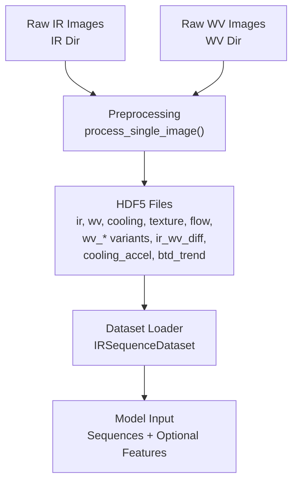
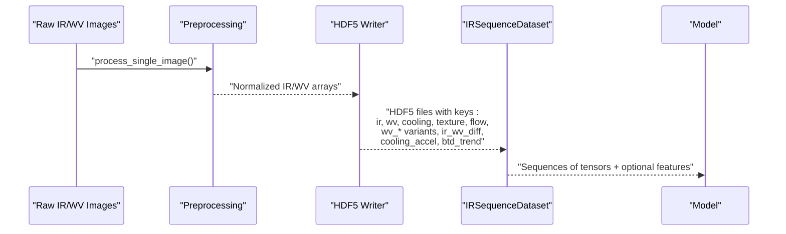
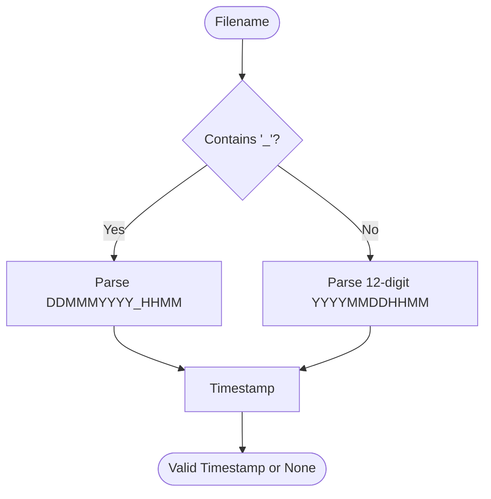
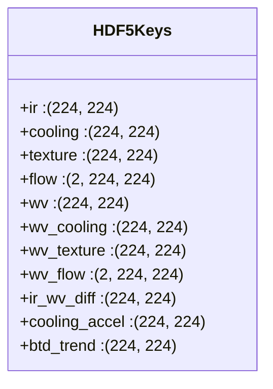
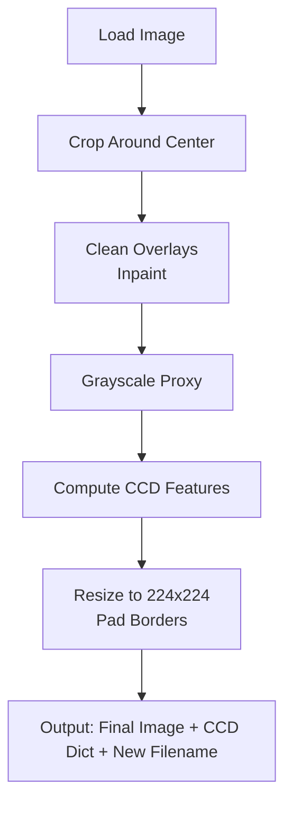
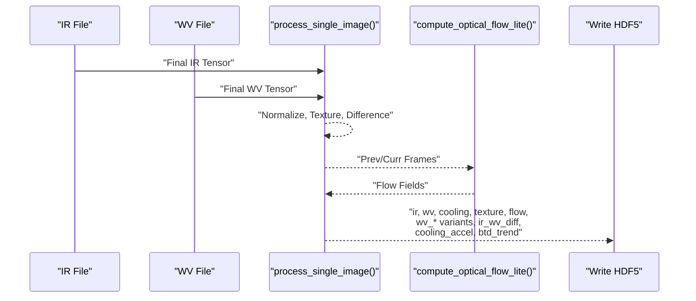
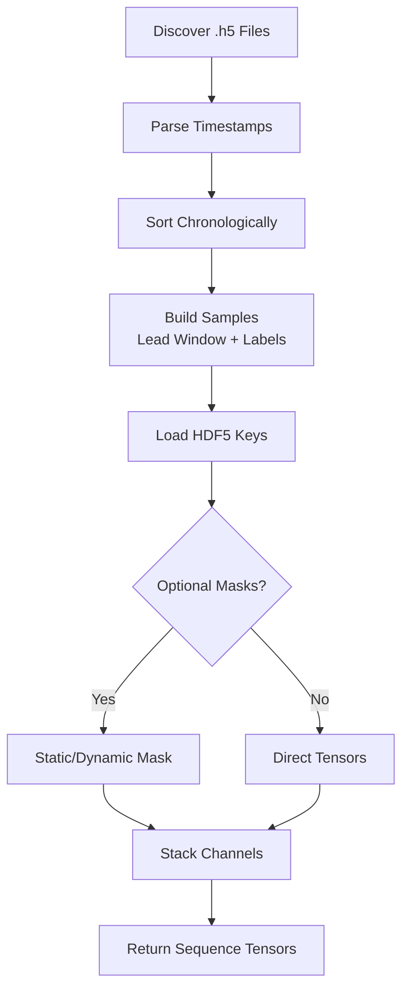
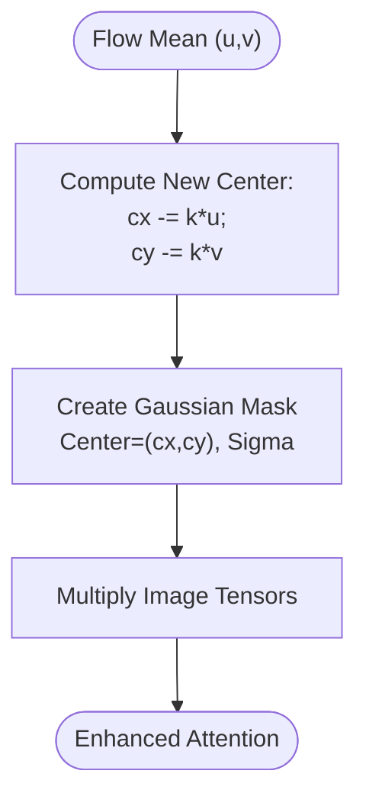
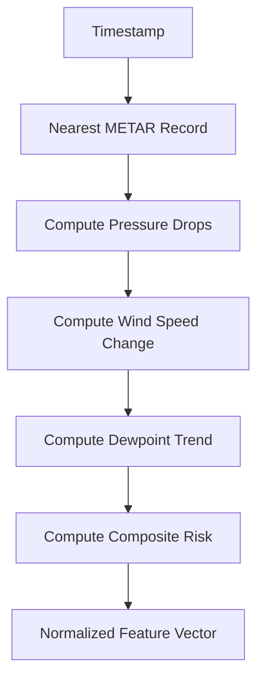
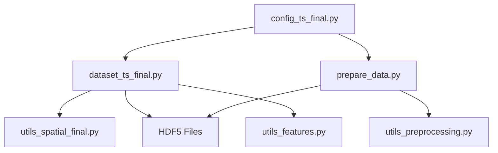

# Raw Data Handling

<cite>
**Referenced Files in This Document**
- [prepare_data.py](file://prepare_data.py)
- [dataset_ts_final.py](file://dataset_ts_final.py)
- [preprocess_ts.py](file://preprocess_ts.py)
- [utils_preprocessing.py](file://utils_preprocessing.py)
- [utils_spatial_final.py](file://utils_spatial_final.py)
- [utils_features.py](file://utils_features.py)
- [verify_h5.py](file://verify_h5.py)
- [config_ts_final.py](file://config_ts_final.py)
- [extras/st_dwn.py](file://extras/st_dwn.py)
</cite>

## Table of Contents
1. [Introduction](#introduction)
2. [Project Structure](#project-structure)
3. [Core Components](#core-components)
4. [Architecture Overview](#architecture-overview)
5. [Detailed Component Analysis](#detailed-component-analysis)
6. [Dependency Analysis](#dependency-analysis)
7. [Performance Considerations](#performance-considerations)
8. [Troubleshooting Guide](#troubleshooting-guide)
9. [Conclusion](#conclusion)
10. [Appendices](#appendices)

## Introduction
This document explains the raw data handling pipeline for INSAT-3DR IR and Water Vapour (WV) satellite imagery used in the thunderstorm nowcasting system. It covers:
- Dual-file naming conventions and timestamp parsing
- HDF5 storage layout and access patterns
- Preprocessing workflows for raw imagery
- Hierarchical datasets within HDF5 files
- File validation and integrity checks
- Practical loading and troubleshooting guidance

## Project Structure
The raw data handling spans preprocessing, HDF5 generation, dataset ingestion, and validation utilities. Key modules:
- Raw-to-HDF5 pipeline: prepares matched IR/WV pairs and writes multi-modal datasets
- Dataset loader: reads HDF5 sequences, applies optional masks and augmentations
- Utilities: preprocessing, spatial masks, METAR features, and verification scripts
- Configuration: centralizes paths, channel sets, and runtime flags

**Diagram sources**
- [prepare_data.py:39-132](file://prepare_data.py#L39-L132)
- [dataset_ts_final.py:47-334](file://dataset_ts_final.py#L47-L334)
- [preprocess_ts.py:27-117](file://preprocess_ts.py#L27-L117)

**Section sources**
- [prepare_data.py:14-18](file://prepare_data.py#L14-L18)
- [dataset_ts_final.py:47-92](file://dataset_ts_final.py#L47-L92)
- [config_ts_final.py:17-22](file://config_ts_final.py#L17-L22)

## Core Components
- Dual-file naming system:
  - MOSDAC-style: 3SIMG_DDMMMYYYY_HHMM_... (supports parsing with day-month-year and HHMM)
  - New-style: YYYYMMDDHHMM.ext (supports direct parsing)
- HDF5 structure:
  - Keys include IR and WV channels plus derived modalities (cooling, texture, flow, differences, accelerations, trends)
  - Fixed shapes for 224x224 spatial resolution; flow stored as (2, H, W)
- Dataset ingestion:
  - Loads sequences of HDF5 files, validates timestamps, and constructs labeled samples
  - Applies optional spatial masks and dynamic upwind masking based on optical flow
- Validation:
  - Verifies expected keys and shapes in HDF5 files

**Section sources**
- [dataset_ts_final.py:93-102](file://dataset_ts_final.py#L93-L102)
- [prepare_data.py:29-37](file://prepare_data.py#L29-L37)
- [verify_h5.py:16-28](file://verify_h5.py#L16-L28)
- [dataset_ts_final.py:268-303](file://dataset_ts_final.py#L268-L303)

## Architecture Overview
End-to-end workflow from raw imagery to model-ready sequences.

**Diagram sources**
- [preprocess_ts.py:27-117](file://preprocess_ts.py#L27-L117)
- [prepare_data.py:64-118](file://prepare_data.py#L64-L118)
- [dataset_ts_final.py:268-334](file://dataset_ts_final.py#L268-L334)

## Detailed Component Analysis

### Dual-File Naming System and Timestamp Parsing
- MOSDAC-style filenames embed date-time in DDMMMYYYY_HHMM format; parser reconstructs timestamp by concatenating the second and third segments before extension.
- New-style filenames encode date-time as 12-digit YYYYMMDDHHMM; parser extracts and parses directly.
- Both styles are supported in dataset CCD loading and file discovery.

**Diagram sources**
- [dataset_ts_final.py:93-102](file://dataset_ts_final.py#L93-L102)
- [prepare_data.py:29-37](file://prepare_data.py#L29-L37)

**Section sources**
- [dataset_ts_final.py:93-102](file://dataset_ts_final.py#L93-L102)
- [dataset_ts_final.py:108-122](file://dataset_ts_final.py#L108-L122)
- [prepare_data.py:29-37](file://prepare_data.py#L29-L37)

### HDF5 Storage Layout and Access Patterns
- Keys written during preprocessing:
  - IR modalities: ir, cooling, texture, flow
  - WV modalities: wv, wv_cooling, wv_texture, wv_flow
  - Cross-channel: ir_wv_diff, cooling_accel, btd_trend
- Shape expectations:
  - Spatial: (224, 224) for scalar channels
  - Flow: (2, 224, 224) for u/v components
- Dataset loader reads keys, constructs tensors, and applies optional masking and channel stacking.

**Diagram sources**
- [verify_h5.py:16-28](file://verify_h5.py#L16-L28)
- [prepare_data.py:104-118](file://prepare_data.py#L104-L118)

**Section sources**
- [prepare_data.py:104-118](file://prepare_data.py#L104-L118)
- [verify_h5.py:16-54](file://verify_h5.py#L16-L54)
- [dataset_ts_final.py:278-296](file://dataset_ts_final.py#L278-L296)

### Raw Image Preprocessing Pipeline
- Cropping and inpainting remove overlays; grayscale proxy is computed
- CCD-derived features are calculated and recorded
- Resizing to 224x224 with padding preserves aspect ratio
- Filename transformation standardizes to YYYYMMDDHHMM for downstream consistency

**Diagram sources**
- [preprocess_ts.py:27-117](file://preprocess_ts.py#L27-L117)

**Section sources**
- [preprocess_ts.py:27-117](file://preprocess_ts.py#L27-L117)

### Multi-Modal HDF5 Generation Workflow
- Matches IR and WV files by parsed timestamps
- Normalizes images to [0, 1]
- Computes derived modalities:
  - Texture maps via local variance
  - Cooling (temporal differencing)
  - Optical flow using Farneback
  - IR–WV difference and trends
- Writes all modalities to HDF5 with LZF compression

**Diagram sources**
- [prepare_data.py:64-118](file://prepare_data.py#L64-L118)
- [utils_preprocessing.py:136-162](file://utils_preprocessing.py#L136-L162)

**Section sources**
- [prepare_data.py:64-118](file://prepare_data.py#L64-L118)
- [utils_preprocessing.py:136-162](file://utils_preprocessing.py#L136-L162)

### Dataset Loading and Sequences
- Discovers HDF5 files, parses timestamps, sorts chronologically
- Builds sequences respecting maximum gaps and lead times
- Loads tensors from HDF5, applies optional spatial masks and dynamic upwind masking
- Supports configurable channel stacks and optional optical flow concatenation

**Diagram sources**
- [dataset_ts_final.py:61-92](file://dataset_ts_final.py#L61-L92)
- [dataset_ts_final.py:268-334](file://dataset_ts_final.py#L268-L334)

**Section sources**
- [dataset_ts_final.py:61-92](file://dataset_ts_final.py#L61-L92)
- [dataset_ts_final.py:268-334](file://dataset_ts_final.py#L268-L334)

### Spatial Masks and Dynamic Upwind Masking
- Static Gaussian mask centered on Nagpur coordinates normalizes brightness
- Dynamic upwind mask shifts center based on recent flow mean to emphasize upwind regions

**Diagram sources**
- [utils_spatial_final.py:12-34](file://utils_spatial_final.py#L12-L34)
- [dataset_ts_final.py:497-512](file://dataset_ts_final.py#L497-L512)

**Section sources**
- [utils_spatial_final.py:12-34](file://utils_spatial_final.py#L12-L34)
- [dataset_ts_final.py:497-512](file://dataset_ts_final.py#L497-L512)

### METAR Features and Time Features
- Extracts pressure drops, wind trends, dewpoint, and cloud metrics aligned to image timestamps
- Computes solar zenith angle for seasonal/time-aware modeling

**Diagram sources**
- [utils_features.py:11-127](file://utils_features.py#L11-L127)

**Section sources**
- [utils_features.py:11-127](file://utils_features.py#L11-L127)
- [dataset_ts_final.py:422-434](file://dataset_ts_final.py#L422-L434)

### File Integrity Verification
- Script enumerates HDF5 files and verifies presence and shapes of expected keys
- Reports PASS/FAIL per key and highlights missing keys

**Section sources**
- [verify_h5.py:16-54](file://verify_h5.py#L16-L54)

## Dependency Analysis
Key dependencies among modules:
- HDF5 writer depends on preprocessing utilities and optical flow computation
- Dataset loader depends on HDF5 keys, spatial masks, and optional METAR features
- Configuration centralizes paths and flags controlling behavior

**Diagram sources**
- [prepare_data.py:11-12](file://prepare_data.py#L11-L12)
- [dataset_ts_final.py:21-24](file://dataset_ts_final.py#L21-L24)
- [config_ts_final.py:17-22](file://config_ts_final.py#L17-L22)

**Section sources**
- [prepare_data.py:11-12](file://prepare_data.py#L11-L12)
- [dataset_ts_final.py:21-24](file://dataset_ts_final.py#L21-L24)
- [config_ts_final.py:17-22](file://config_ts_final.py#L17-L22)

## Performance Considerations
- HDF5 compression: LZF reduces storage footprint with acceptable decompression speed
- File cache: Dataset caches loaded HDF5 tensors to avoid repeated I/O
- Optical flow computation: Cached via disk-based caching as indicated by configuration
- Spatial masks: Static and dynamic masks are precomputed and broadcast efficiently

[No sources needed since this section provides general guidance]

## Troubleshooting Guide
Common issues and resolutions:
- Missing keys in HDF5:
  - Verify expected keys and shapes using the verification script
  - Ensure preprocessing completed successfully and wrote all modalities
- Corrupted or incomplete HDF5:
  - Delete malformed files and regenerate via the preprocessing pipeline
  - Confirm consistent timestamp parsing across IR/WV pairs
- Incorrect timestamps:
  - Validate filename patterns and ensure MOSDAC or New format alignment
  - Use dataset’s timestamp parsing logic to diagnose mismatches
- Spatial artifacts:
  - Adjust mask center and sigma in configuration
  - Disable dynamic upwind masking temporarily to isolate effects
- Flow-related errors:
  - Ensure optical flow cache exists and is readable
  - Recompute flow features if cache is stale

**Section sources**
- [verify_h5.py:16-54](file://verify_h5.py#L16-L54)
- [dataset_ts_final.py:93-102](file://dataset_ts_final.py#L93-L102)
- [config_ts_final.py:106-117](file://config_ts_final.py#L106-L117)

## Conclusion
The raw data handling pipeline converts INSAT-3DR IR/WV imagery into standardized HDF5 datasets enriched with multi-modal features. Robust timestamp parsing, strict HDF5 schema validation, and configurable masking enable reliable ingestion into the nowcasting model. Adhering to the documented structure and validation steps ensures consistent performance and minimal downtime.

## Appendices

### Appendix A: Data Format Specifications
- Spatial grid: 224x224
- Data types: float32 for tensors; uint8 for raw images during preprocessing
- Coordinate system: Pixel coordinates (x,y) align with 224x224 spatial grids
- Reference location: Nagpur-centered masks and dynamic upwind adjustments

**Section sources**
- [utils_spatial_final.py:12-34](file://utils_spatial_final.py#L12-L34)
- [config_ts_final.py:106-117](file://config_ts_final.py#L106-L117)

### Appendix B: Practical Workflows
- Raw data acquisition:
  - MOSDAC-style downloads use DDMMMYYYY_HHMM patterns
- Preprocessing and HDF5 generation:
  - Run the preprocessing pipeline to produce standardized HDF5 files
- Dataset ingestion:
  - Initialize dataset with configured paths and channel sets
- Validation:
  - Use verification script to confirm HDF5 integrity

**Section sources**
- [extras/st_dwn.py:7-36](file://extras/st_dwn.py#L7-L36)
- [prepare_data.py:39-132](file://prepare_data.py#L39-L132)
- [verify_h5.py:5-58](file://verify_h5.py#L5-L58)