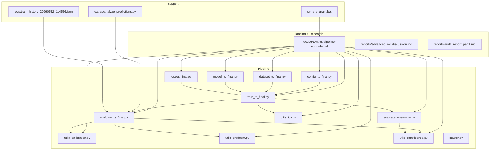
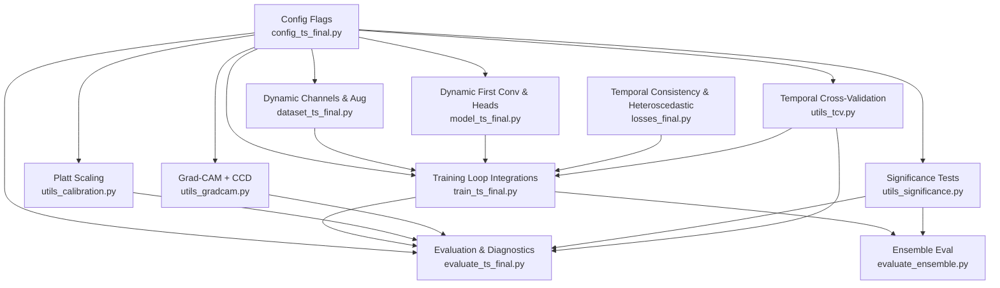
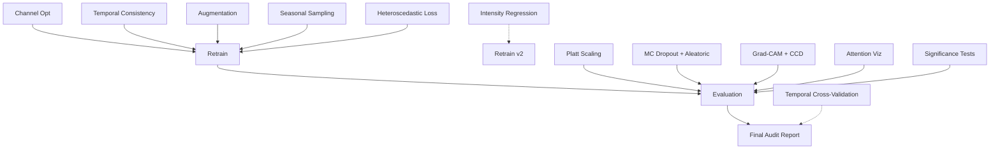

# Documentation & Planning

<cite>
**Referenced Files in This Document**
- [PLAN-ts-pipeline-upgrade.md](file://docs/PLAN-ts-pipeline-upgrade.md)
- [advanced_ml_discussion.md](file://reports/advanced_ml_discussion.md)
- [audit_report_part1.md](file://reports/audit_report_part1.md)
- [config_ts_final.py](file://config_ts_final.py)
- [dataset_ts_final.py](file://dataset_ts_final.py)
- [model_ts_final.py](file://model_ts_final.py)
- [losses_final.py](file://losses_final.py)
- [train_ts_final.py](file://train_ts_final.py)
- [evaluate_ts_final.py](file://evaluate_ts_final.py)
- [evaluate_ensemble.py](file://evaluate_ensemble.py)
- [utils_calibration.py](file://utils_calibration.py)
- [utils_gradcam.py](file://utils_gradcam.py)
- [utils_significance.py](file://utils_significance.py)
- [utils_tcv.py](file://utils_tcv.py)
- [master.py](file://master.py)
- [sync_engram.bat](file://sync_engram.bat)
- [analyze_predictions.py](file://extras/analyze_predictions.py)
- [train_history_20260522_114526.json](file://logs/train_history_20260522_114526.json)
</cite>

## Table of Contents
1. [Introduction](#introduction)
2. [Project Structure](#project-structure)
3. [Core Components](#core-components)
4. [Architecture Overview](#architecture-overview)
5. [Detailed Component Analysis](#detailed-component-analysis)
6. [Dependency Analysis](#dependency-analysis)
7. [Performance Considerations](#performance-considerations)
8. [Troubleshooting Guide](#troubleshooting-guide)
9. [Conclusion](#conclusion)
10. [Appendices](#appendices)

## Introduction
This document consolidates the project roadmap, research notes, and development planning for the Nagpur TS Nowcasting pipeline. It documents the pipeline upgrade plan with feature enhancements, architectural improvements, and performance optimizations. It also explains the engram research system for capturing insights, lessons learned, and knowledge management, and outlines a session-based documentation approach for research sessions, topic development, and knowledge synthesis. Guidance is included for contributing to documentation, managing research notes, and sharing knowledge collaboratively. Finally, it provides templates and frameworks for research documentation, planning exercises, and knowledge preservation.

## Project Structure
The repository organizes planning, research, and pipeline artifacts cohesively:
- docs/PLAN-ts-pipeline-upgrade.md: End-to-end upgrade plan with phases, tasks, risks, and success criteria
- reports/: Advanced ML research blueprint and technical audit report
- config_ts_final.py: Centralized configuration enabling modular features
- scripts: Training, evaluation, and orchestration (train_ts_final.py, evaluate_ts_final.py, evaluate_ensemble.py, master.py)
- utilities: Calibration, Grad-CAM, significance testing, and temporal cross-validation
- extras/: Prediction analysis and auxiliary tools
- logs/: Training histories and archived outputs
- sync_engram.bat: Engram memory synchronization for research knowledge capture

**Diagram sources**
- [PLAN-ts-pipeline-upgrade.md:1-466](file://docs/PLAN-ts-pipeline-upgrade.md#L1-L466)
- [advanced_ml_discussion.md:1-305](file://reports/advanced_ml_discussion.md#L1-L305)
- [audit_report_part1.md:1-384](file://reports/audit_report_part1.md#L1-L384)
- [config_ts_final.py:1-208](file://config_ts_final.py#L1-L208)
- [dataset_ts_final.py](file://dataset_ts_final.py)
- [model_ts_final.py](file://model_ts_final.py)
- [losses_final.py](file://losses_final.py)
- [train_ts_final.py](file://train_ts_final.py)
- [evaluate_ts_final.py](file://evaluate_ts_final.py)
- [evaluate_ensemble.py](file://evaluate_ensemble.py)
- [utils_calibration.py](file://utils_calibration.py)
- [utils_gradcam.py](file://utils_gradcam.py)
- [utils_significance.py](file://utils_significance.py)
- [utils_tcv.py](file://utils_tcv.py)
- [master.py:1-108](file://master.py#L1-L108)
- [analyze_predictions.py:1-64](file://extras/analyze_predictions.py#L1-L64)
- [train_history_20260522_114526.json:1-527](file://logs/train_history_20260522_114526.json#L1-L527)
- [sync_engram.bat:1-27](file://sync_engram.bat#L1-L27)

**Section sources**
- [PLAN-ts-pipeline-upgrade.md:1-466](file://docs/PLAN-ts-pipeline-upgrade.md#L1-L466)
- [advanced_ml_discussion.md:1-305](file://reports/advanced_ml_discussion.md#L1-L305)
- [audit_report_part1.md:1-384](file://reports/audit_report_part1.md#L1-L384)
- [config_ts_final.py:1-208](file://config_ts_final.py#L1-L208)
- [master.py:1-108](file://master.py#L1-L108)
- [sync_engram.bat:1-27](file://sync_engram.bat#L1-L27)

## Core Components
- Upgrade Plan: A phased roadmap integrating channel optimization, temporal consistency loss, augmentation, seasonal sampling, uncertainty-aware loss, intensity regression, calibration, Monte Carlo Dropout, Grad-CAM/CCD maps, attention visualization, significance testing, and temporal cross-validation.
- Research Blueprints: Advanced ML discussion covering uncertainty, calibration, reliability, meteorological target formulation, temporal modeling, explainability, and statistical validation.
- Audit Report: Technical audit identifying critical flaws and inconsistencies, along with operational feasibility and recommended simplifications.
- Configuration: Centralized feature flags enabling modular upgrades without breaking changes.
- Orchestration: Master pipeline script coordinating training, evaluation, ensemble, and ablation studies.

Key outcomes:
- Structured progression from training-side improvements to evaluation-side diagnostics
- Clear risk assessment and mitigation strategies
- Backward-compatible feature toggles for controlled rollout

**Section sources**
- [PLAN-ts-pipeline-upgrade.md:10-466](file://docs/PLAN-ts-pipeline-upgrade.md#L10-L466)
- [advanced_ml_discussion.md:1-305](file://reports/advanced_ml_discussion.md#L1-L305)
- [audit_report_part1.md:1-384](file://reports/audit_report_part1.md#L1-L384)
- [config_ts_final.py:31-131](file://config_ts_final.py#L31-L131)
- [master.py:39-104](file://master.py#L39-L104)

## Architecture Overview
The upgrade plan maps to concrete changes across data, model, loss, training, and evaluation modules, with utilities supporting diagnostics and validation.

**Diagram sources**
- [config_ts_final.py:31-131](file://config_ts_final.py#L31-L131)
- [dataset_ts_final.py](file://dataset_ts_final.py)
- [model_ts_final.py](file://model_ts_final.py)
- [losses_final.py](file://losses_final.py)
- [train_ts_final.py](file://train_ts_final.py)
- [utils_calibration.py](file://utils_calibration.py)
- [evaluate_ts_final.py](file://evaluate_ts_final.py)
- [evaluate_ensemble.py](file://evaluate_ensemble.py)
- [utils_gradcam.py](file://utils_gradcam.py)
- [utils_significance.py](file://utils_significance.py)
- [utils_tcv.py](file://utils_tcv.py)

**Section sources**
- [PLAN-ts-pipeline-upgrade.md:381-425](file://docs/PLAN-ts-pipeline-upgrade.md#L381-L425)

## Detailed Component Analysis

### Pipeline Upgrade Plan
The upgrade plan defines 12 phases with clear tasks, files, priorities, and verification criteria. It emphasizes:
- Training-side improvements (phases 1–6) integrated before retraining
- Evaluation-side enhancements (phases 7–11) for diagnostics and reliability
- Validation framework (phase 12) for robustness across seasons

Implementation order and dependencies are visualized to avoid premature evaluation and ensure coherent rollout.

**Section sources**
- [PLAN-ts-pipeline-upgrade.md:10-406](file://docs/PLAN-ts-pipeline-upgrade.md#L10-L406)

### Research Blueprints: Advanced ML Methods
The advanced ML discussion provides a rigorous foundation for uncertainty, calibration, reliability, meteorological target formulation, temporal modeling, explainability, and statistical validation. It includes mathematical formulations and practical applicability to the Nagpur nowcasting model.

**Section sources**
- [advanced_ml_discussion.md:1-305](file://reports/advanced_ml_discussion.md#L1-L305)

### Technical Audit: Critical Findings and Recommendations
The audit report identifies three critical flaws:
- Heteroscedastic loss bypassing focal loss
- Temporal consistency loss being scientifically invalid
- Intensity regression using incorrect cold-cloud term

It also catalogs dead code, fragile patterns, and operational feasibility considerations, concluding with recommended simplifications and immediate fixes.

**Section sources**
- [audit_report_part1.md:24-96](file://reports/audit_report_part1.md#L24-L96)
- [audit_report_part1.md:109-160](file://reports/audit_report_part1.md#L109-L160)
- [audit_report_part1.md:201-225](file://reports/audit_report_part1.md#L201-L225)
- [audit_report_part1.md:299-320](file://reports/audit_report_part1.md#L299-L320)

### Configuration-Driven Feature Management
The centralized configuration enables:
- Channel selection and augmentation toggles
- Seasonal sampling weights
- Loss and head configurations
- Calibration and uncertainty controls
- Post-processing and threshold settings

This supports controlled rollouts and A/B experimentation without code churn.

**Section sources**
- [config_ts_final.py:31-131](file://config_ts_final.py#L31-L131)

### Orchestration and Workflow
The master pipeline coordinates:
- Optional delay
- Training with fold selection
- Evaluation of best and SWA models
- Ensemble evaluation
- Ablation study

This standardized workflow ensures reproducibility and consistent artifact generation.

**Section sources**
- [master.py:39-104](file://master.py#L39-L104)

### Engram Research System and Session-Based Documentation
The engram synchronization script orchestrates:
- Importing memories from Git
- Exporting local memories to .engram/
- Updating Obsidian-ready Markdown notebooks

This establishes a persistent, searchable knowledge base for research sessions, topics, and synthesis.

**Section sources**
- [sync_engram.bat:1-27](file://sync_engram.bat#L1-L27)

### Training Diagnostics and Prediction Analysis
Training histories and prediction analyzers support:
- Monitoring convergence and stability
- Quick calibration checks and severity distributions
- Comparative analysis across runs

**Section sources**
- [train_history_20260522_114526.json:1-527](file://logs/train_history_20260522_114526.json#L1-L527)
- [analyze_predictions.py:1-64](file://extras/analyze_predictions.py#L1-L64)

## Dependency Analysis
The upgrade plan creates explicit dependencies among modules. Training-side changes feed into evaluation-side diagnostics, which inform further iterations.

**Diagram sources**
- [PLAN-ts-pipeline-upgrade.md:381-406](file://docs/PLAN-ts-pipeline-upgrade.md#L381-L406)

**Section sources**
- [PLAN-ts-pipeline-upgrade.md:381-406](file://docs/PLAN-ts-pipeline-upgrade.md#L381-L406)

## Performance Considerations
- CPU feasibility: Single-pass inference (~32 ms), training epochs (~15 min), and full evaluation (~5 min) are viable on office CPUs.
- MC Dropout: 30 passes are marginal for real-time; reducing samples to 5–10 improves operational speed.
- RAM usage: HDF5 cache and training memory must be tuned for constrained deployments.
- Data scale vs. model complexity: 709K parameters are justified for the available data.

**Section sources**
- [audit_report_part1.md:170-184](file://reports/audit_report_part1.md#L170-L184)
- [audit_report_part1.md:273-285](file://reports/audit_report_part1.md#L273-L285)

## Troubleshooting Guide
Common issues and remedies:
- Heteroscedastic loss bypassing focal loss: Integrate uncertainty into focal loss rather than replacing it.
- Invalid temporal consistency loss: Remove or implement proper within-sequence consistency.
- Intensity regression cold-cloud term: Replace inverted term with physically valid conversion.
- ECE computed on wrong probabilities: Use calibrated probabilities for ECE.
- Missing config keys: Add missing flags (e.g., Platt scaling, MC Dropout) with defaults.
- Dead code removal: Eliminate unused components to reduce fragility.

**Section sources**
- [audit_report_part1.md:300-320](file://reports/audit_report_part1.md#L300-L320)
- [audit_report_part1.md:109-118](file://reports/audit_report_part1.md#L109-L118)
- [audit_report_part1.md:133-149](file://reports/audit_report_part1.md#L133-L149)

## Conclusion
The upgrade plan aligns advanced ML techniques with operational constraints, ensuring scientific rigor and practical viability. The engram system and session-based documentation approach capture insights and lessons learned systematically. The configuration-driven approach, standardized orchestration, and diagnostic utilities enable iterative improvements with clear risk controls and measurable success criteria.

## Appendices

### A. Research Session-Based Documentation Framework
- Session template: Date, participants, goals, hypotheses, outcomes, and follow-ups
- Topic tagging: Architecture, Decision, Observation, Bugfix, Pattern
- Knowledge synthesis: Link related sessions, extract action items, and maintain a backlog
- Collaboration: Use shared vaults and sync scripts to keep knowledge current

**Section sources**
- [sync_engram.bat:1-27](file://sync_engram.bat#L1-L27)

### B. Planning Exercise Templates
- Feasibility matrix: Ease of implementation, operational benefit, priority, status
- Risk register: Likelihood, impact, mitigation actions
- Milestone tracker: Phases, deliverables, checkpoints, owners

**Section sources**
- [advanced_ml_discussion.md:287-302](file://reports/advanced_ml_discussion.md#L287-L302)
- [PLAN-ts-pipeline-upgrade.md:442-451](file://docs/PLAN-ts-pipeline-upgrade.md#L442-L451)

### C. Knowledge Preservation Practices
- Version control: Commit configuration changes, training logs, and evaluation artifacts
- Artifact archiving: Store model checkpoints, metrics, and reports with timestamps
- Cross-validation: Implement TCV to guard against single-split bias
- Statistical validation: Add significance tests to compare model variants

**Section sources**
- [utils_tcv.py](file://utils_tcv.py)
- [utils_significance.py](file://utils_significance.py)
- [evaluate_ensemble.py](file://evaluate_ensemble.py)

### D. Development Workflow Organization
- Phased rollout: Implement training-side changes first, validate, then add evaluation-side features
- Controlled toggles: Use configuration flags to enable/disable features per environment
- Orchestration: Automate end-to-end pipeline with the master script
- Continuous diagnostics: Monitor training histories and run quick prediction analyses

**Section sources**
- [PLAN-ts-pipeline-upgrade.md:401-406](file://docs/PLAN-ts-pipeline-upgrade.md#L401-L406)
- [config_ts_final.py:31-131](file://config_ts_final.py#L31-L131)
- [master.py:39-104](file://master.py#L39-L104)
- [train_history_20260522_114526.json:1-527](file://logs/train_history_20260522_114526.json#L1-L527)