# Diagnostic Analysis & Interpretability

<cite>
**Referenced Files in This Document**
- [explain_shap.py](file://explain_shap.py)
- [evaluate_ts_final.py](file://evaluate_ts_final.py)
- [model_ts_final.py](file://model_ts_final.py)
- [utils_metrics_final.py](file://utils_metrics_final.py)
- [utils_spatial_final.py](file://utils_spatial_final.py)
- [dataset_ts_final.py](file://dataset_ts_final.py)
- [config_ts_final.py](file://config_ts_final.py)
- [metar_parser.py](file://metar_parser.py)
- [utils_calibration.py](file://utils_calibration.py)
- [reports/advanced_ml_discussion.md](file://reports/advanced_ml_discussion.md)
- [reports/failure_analysis.md](file://reports/failure_analysis.md)
</cite>

## Table of Contents
1. [Introduction](#introduction)
2. [Project Structure](#project-structure)
3. [Core Components](#core-components)
4. [Architecture Overview](#architecture-overview)
5. [Detailed Component Analysis](#detailed-component-analysis)
6. [Dependency Analysis](#dependency-analysis)
7. [Performance Considerations](#performance-considerations)
8. [Troubleshooting Guide](#troubleshooting-guide)
9. [Conclusion](#conclusion)
10. [Appendices](#appendices)

## Introduction
This document explains the diagnostic analysis and interpretability toolkit for the Nagpur thunderstorm nowcasting system. It covers:
- SHAP-based feature importance analysis across modalities (images, optical flow, CCD features, METAR, time)
- Temporal attention weight visualization to understand how the model prioritizes time steps in a four-frame sequence
- Severity category analysis, lead time distribution visualization, and event detection pattern analysis
- Confusion matrix, ROC/PR curve interpretation, and operating point optimization
- Persistence filtering effectiveness and temporal smoothing impact assessment
- Guidance for model debugging workflows, failure pattern identification, and integrating diagnostics into operational decision-making

## Project Structure
The diagnostic and interpretability capabilities are implemented across several modules:
- Model definition and attention extraction
- Evaluation harness with plotting utilities and temporal post-processing
- Metrics and temporal analysis helpers
- SHAP explainer for integrated feature attribution
- Spatial utilities for mask generation
- Configuration and dataset utilities supporting the full pipeline

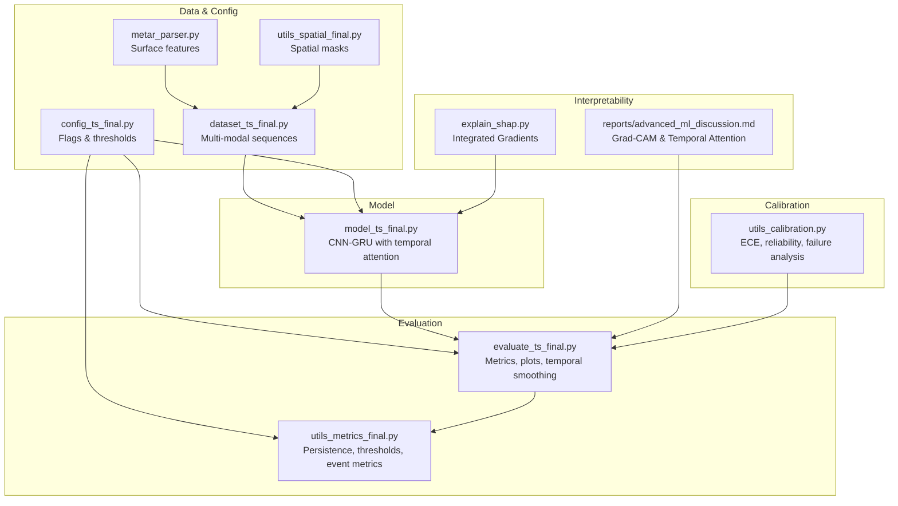

**Diagram sources**
- [model_ts_final.py:68-272](file://model_ts_final.py#L68-L272)
- [evaluate_ts_final.py:146-184](file://evaluate_ts_final.py#L146-L184)
- [utils_metrics_final.py:50-282](file://utils_metrics_final.py#L50-L282)
- [explain_shap.py:15-91](file://explain_shap.py#L15-L91)
- [dataset_ts_final.py:47-515](file://dataset_ts_final.py#L47-L515)
- [config_ts_final.py:16-208](file://config_ts_final.py#L16-L208)
- [metar_parser.py:141-186](file://metar_parser.py#L141-L186)
- [utils_spatial_final.py:12-80](file://utils_spatial_final.py#L12-L80)
- [utils_calibration.py:24-167](file://utils_calibration.py#L24-L167)
- [reports/advanced_ml_discussion.md:207-244](file://reports/advanced_ml_discussion.md#L207-L244)

**Section sources**
- [model_ts_final.py:68-272](file://model_ts_final.py#L68-L272)
- [evaluate_ts_final.py:146-184](file://evaluate_ts_final.py#L146-L184)
- [utils_metrics_final.py:50-282](file://utils_metrics_final.py#L50-L282)
- [explain_shap.py:15-91](file://explain_shap.py#L15-L91)
- [dataset_ts_final.py:47-515](file://dataset_ts_final.py#L47-L515)
- [config_ts_final.py:16-208](file://config_ts_final.py#L16-L208)
- [metar_parser.py:141-186](file://metar_parser.py#L141-L186)
- [utils_spatial_final.py:12-80](file://utils_spatial_final.py#L12-L80)
- [utils_calibration.py:24-167](file://utils_calibration.py#L24-L167)
- [reports/advanced_ml_discussion.md:207-244](file://reports/advanced_ml_discussion.md#L207-L244)

## Core Components
- Model with temporal attention: The GRU-based model computes attention weights per time step and exposes them for interpretability.
- Evaluation harness: Provides plotting utilities for attention, ROC/PR curves, confusion matrices, severity performance, and lead-time distributions.
- Metrics and temporal post-processing: Implements persistence filtering, temporal smoothing, dual-threshold Schmitt trigger, and event-level metrics.
- SHAP explainer: Uses Integrated Gradients to attribute importance across input modalities.
- Spatial utilities: Gaussian weighting masks for spatial attention and distance maps for station boundary emphasis.
- Calibration and failure analysis: ECE, reliability diagrams, and automated failure case analysis.

**Section sources**
- [model_ts_final.py:172-272](file://model_ts_final.py#L172-L272)
- [evaluate_ts_final.py:41-96](file://evaluate_ts_final.py#L41-L96)
- [utils_metrics_final.py:23-77](file://utils_metrics_final.py#L23-L77)
- [explain_shap.py:15-91](file://explain_shap.py#L15-L91)
- [utils_spatial_final.py:12-80](file://utils_spatial_final.py#L12-L80)
- [utils_calibration.py:24-167](file://utils_calibration.py#L24-L167)

## Architecture Overview
The diagnostic pipeline integrates model inference, temporal post-processing, and visualization utilities to produce actionable insights.

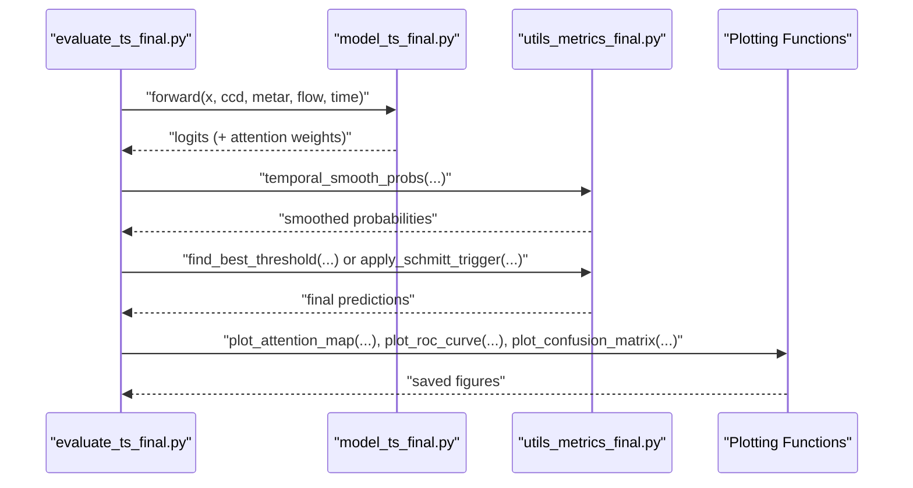

**Diagram sources**
- [evaluate_ts_final.py:285-324](file://evaluate_ts_final.py#L285-L324)
- [model_ts_final.py:202-268](file://model_ts_final.py#L202-L268)
- [utils_metrics_final.py:23-77](file://utils_metrics_final.py#L23-L77)
- [evaluate_ts_final.py:146-184](file://evaluate_ts_final.py#L146-L184)

## Detailed Component Analysis

### SHAP Feature Importance Analysis
The SHAP explainer uses Integrated Gradients to attribute importance across input modalities. It constructs a wrapped model, sets baselines to zeros, and aggregates absolute attributions per input type to derive relative contributions.

```mermaid
sequenceDiagram
participant SHAP as "explain_shap.py"
participant Model as "model_ts_final.py"
participant Captum as "IntegratedGradients"
SHAP->>Model : "load_state_dict(...); eval()"
SHAP->>Captum : "IntegratedGradients(ModelForwardWrapper(model))"
Captum-->>SHAP : "attribute(inputs, baselines=zeroes)"
SHAP->>SHAP : "sum absolute attributions per modality"
SHAP-->>SHAP : "print feature importance percentages"
```

- Inputs covered: Images (IR/Cooling/Texture/WV variants), optical flow, CCD features, METAR surface features, time features (month/zenith).
- Baselines: Zeros across all input tensors.
- Aggregation: Sum of absolute attributions across spatial/time dimensions, normalized by total.

**Diagram sources**
- [explain_shap.py:15-91](file://explain_shap.py#L15-L91)
- [model_ts_final.py:58-65](file://model_ts_final.py#L58-L65)

**Section sources**
- [explain_shap.py:15-91](file://explain_shap.py#L15-L91)
- [model_ts_final.py:58-65](file://model_ts_final.py#L58-L65)

### Temporal Attention Mechanism Analysis
The model computes attention weights over the four-frame sequence and stores them for visualization. The evaluation script averages attention weights across samples and produces a bar plot labeled t-90, t-60, t-30, and t(now).

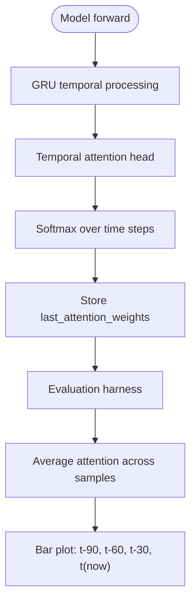

- The attention weights are stored during inference and exposed via a getter for interpretability.
- Visualization logic supports flexible column counts and adapts labels accordingly.

**Diagram sources**
- [model_ts_final.py:240-247](file://model_ts_final.py#L240-L247)
- [model_ts_final.py:270-272](file://model_ts_final.py#L270-L272)
- [evaluate_ts_final.py:146-184](file://evaluate_ts_final.py#L146-L184)

**Section sources**
- [model_ts_final.py:172-272](file://model_ts_final.py#L172-L272)
- [evaluate_ts_final.py:146-184](file://evaluate_ts_final.py#L146-L184)
- [reports/advanced_ml_discussion.md:213-226](file://reports/advanced_ml_discussion.md#L213-L226)

### Severity Category Analysis
Severity is derived from METAR and CCD features and mapped to categories. The evaluation script computes event-level POD by severity and compares against a global FAR baseline.

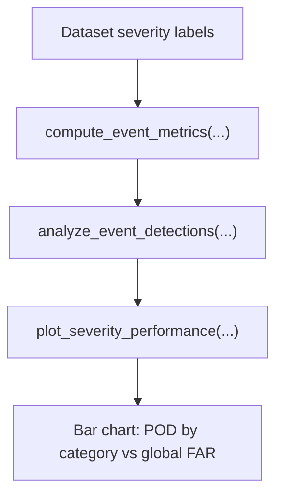

- Categories include squall, wind-dominated, heavy precipitation, mist/low-vis, standard, and marginal.
- The plot overlays event POD per category and global FAR for comparison.

**Diagram sources**
- [dataset_ts_final.py:210-237](file://dataset_ts_final.py#L210-L237)
- [utils_metrics_final.py:338-392](file://utils_metrics_final.py#L338-L392)
- [utils_metrics_final.py:520-572](file://utils_metrics_final.py#L520-L572)
- [evaluate_ts_final.py:98-144](file://evaluate_ts_final.py#L98-L144)

**Section sources**
- [dataset_ts_final.py:210-237](file://dataset_ts_final.py#L210-L237)
- [utils_metrics_final.py:338-392](file://utils_metrics_final.py#L338-L392)
- [utils_metrics_final.py:520-572](file://utils_metrics_final.py#L520-L572)
- [evaluate_ts_final.py:98-144](file://evaluate_ts_final.py#L98-L144)

### Lead Time Distribution Visualization
Lead times are computed as the difference between true event start and the earliest prediction within a maximum lead window. The evaluation script generates boxplots with stripplots overlay, grouped by severity.

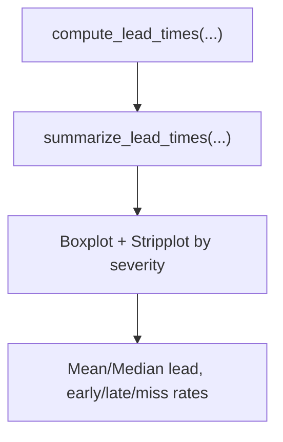

- Lead time statistics include mean, median, early detection rate, late detection rate, and miss rate.
- The plot highlights differences across categories and marks zero as the onset of the event.

**Diagram sources**
- [utils_metrics_final.py:395-477](file://utils_metrics_final.py#L395-L477)
- [evaluate_ts_final.py:187-229](file://evaluate_ts_final.py#L187-L229)

**Section sources**
- [utils_metrics_final.py:395-477](file://utils_metrics_final.py#L395-L477)
- [evaluate_ts_final.py:187-229](file://evaluate_ts_final.py#L187-L229)

### Event Detection Pattern Analysis
The evaluation script performs event-level matching, computes weighted metrics considering lead-time bonuses, and exports a failure analysis report. It also provides dense time series plots to visualize dense windows around active convection.

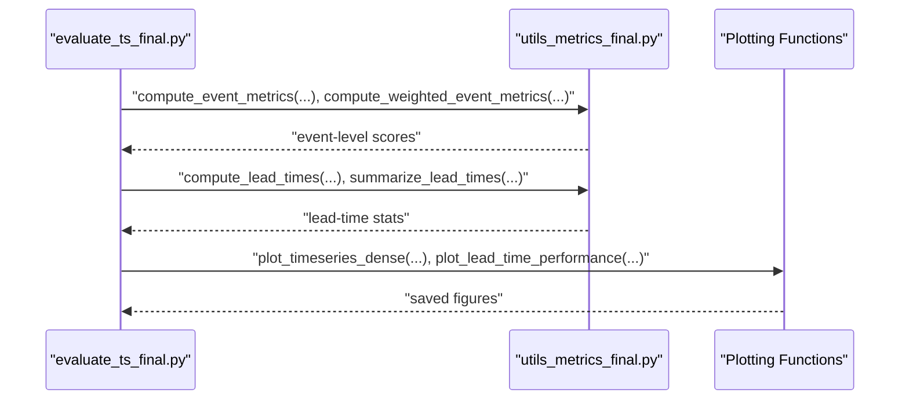

- Event-level metrics include hits, misses, false alarms, POD, FAR, CSI, and SEDI.
- Weighted metrics incorporate lead-time bonuses and severity weights.

**Diagram sources**
- [evaluate_ts_final.py:628-642](file://evaluate_ts_final.py#L628-L642)
- [utils_metrics_final.py:338-392](file://utils_metrics_final.py#L338-L392)
- [utils_metrics_final.py:575-650](file://utils_metrics_final.py#L575-L650)
- [evaluate_ts_final.py:232-279](file://evaluate_ts_final.py#L232-L279)
- [evaluate_ts_final.py:187-229](file://evaluate_ts_final.py#L187-L229)

**Section sources**
- [evaluate_ts_final.py:628-642](file://evaluate_ts_final.py#L628-L642)
- [utils_metrics_final.py:338-392](file://utils_metrics_final.py#L338-L392)
- [utils_metrics_final.py:575-650](file://utils_metrics_final.py#L575-L650)
- [evaluate_ts_final.py:232-279](file://evaluate_ts_final.py#L232-L279)
- [evaluate_ts_final.py:187-229](file://evaluate_ts_final.py#L187-L229)

### Confusion Matrix, ROC/PR, and Operating Point Optimization
The evaluation script computes confusion matrices, ROC curves, and Precision-Recall curves. It also identifies operating points for threshold selection and prints performance metrics.

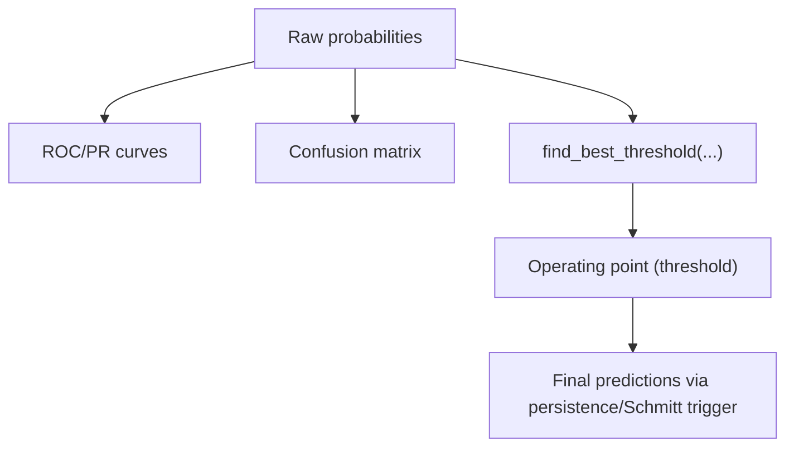

- ROC-AUC and PR-AUC are computed from raw probabilities.
- Operating point is marked on both ROC and PR plots for interpretability.

**Diagram sources**
- [evaluate_ts_final.py:41-96](file://evaluate_ts_final.py#L41-L96)
- [evaluate_ts_final.py:612-623](file://evaluate_ts_final.py#L612-L623)
- [utils_metrics_final.py:192-240](file://utils_metrics_final.py#L192-L240)

**Section sources**
- [evaluate_ts_final.py:41-96](file://evaluate_ts_final.py#L41-L96)
- [evaluate_ts_final.py:612-623](file://evaluate_ts_final.py#L612-L623)
- [utils_metrics_final.py:192-240](file://utils_metrics_final.py#L192-L240)

### Persistence Filtering and Temporal Smoothing Impact
Persistence removes short-lived false positives by zeroing runs shorter than a minimum length. Temporal smoothing reduces noise and temporal chattering. The evaluation script demonstrates both effects and their impact on frame metrics.

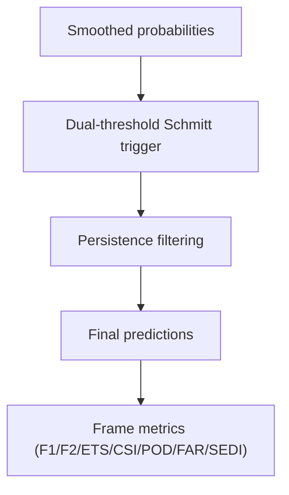

- Schmitt trigger uses high/low thresholds to reduce temporal chattering.
- Persistence filtering enforces a minimum run length; severe events may bypass this with a separate threshold.

**Diagram sources**
- [utils_metrics_final.py:50-77](file://utils_metrics_final.py#L50-L77)
- [utils_metrics_final.py:243-260](file://utils_metrics_final.py#L243-L260)
- [utils_metrics_final.py:263-314](file://utils_metrics_final.py#L263-L314)
- [evaluate_ts_final.py:595-610](file://evaluate_ts_final.py#L595-L610)

**Section sources**
- [utils_metrics_final.py:50-77](file://utils_metrics_final.py#L50-L77)
- [utils_metrics_final.py:243-260](file://utils_metrics_final.py#L243-L260)
- [utils_metrics_final.py:263-314](file://utils_metrics_final.py#L263-L314)
- [evaluate_ts_final.py:595-610](file://evaluate_ts_final.py#L595-L610)

### Spatial Feature Contribution Mapping
Spatial utilities provide Gaussian masks and distance maps to emphasize the Nagpur region and highlight convective cores. These can be combined with Grad-CAM-like interpretations to localize important regions.

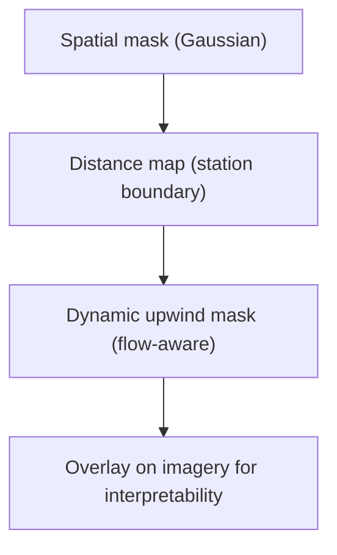

- Masks are normalized to preserve brightness and emphasize the station region.
- Dynamic mask shifts based on flow to focus on the direction of storm motion.

**Diagram sources**
- [utils_spatial_final.py:12-80](file://utils_spatial_final.py#L12-L80)
- [dataset_ts_final.py:497-511](file://dataset_ts_final.py#L497-L511)

**Section sources**
- [utils_spatial_final.py:12-80](file://utils_spatial_final.py#L12-L80)
- [dataset_ts_final.py:497-511](file://dataset_ts_final.py#L497-L511)
- [reports/advanced_ml_discussion.md:227-244](file://reports/advanced_ml_discussion.md#L227-L244)

### Calibration and Reliability Analysis
Reliability diagrams and ECE quantify calibration quality. Automated failure analysis categorizes missed events, late detections, and false alarms for targeted improvements.

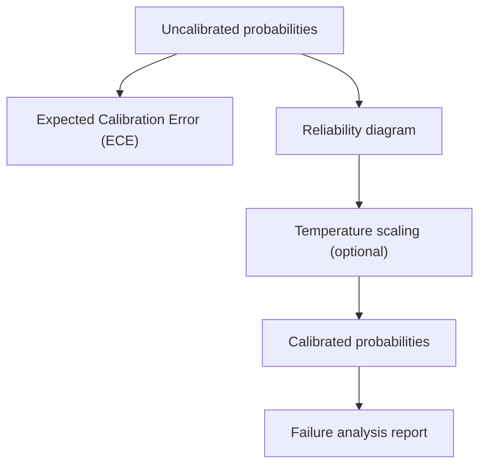

- ECE measures the gap between confidence and accuracy across bins.
- Reliability diagrams compare uncalibrated vs calibrated performance.
- Failure analysis organizes errors by category and severity.

**Diagram sources**
- [utils_calibration.py:24-167](file://utils_calibration.py#L24-L167)
- [utils_calibration.py:275-363](file://utils_calibration.py#L275-L363)

**Section sources**
- [utils_calibration.py:24-167](file://utils_calibration.py#L24-L167)
- [utils_calibration.py:275-363](file://utils_calibration.py#L275-L363)
- [reports/failure_analysis.md:1-71](file://reports/failure_analysis.md#L1-L71)

## Dependency Analysis
The following diagram shows key dependencies among modules involved in diagnostics and interpretability.

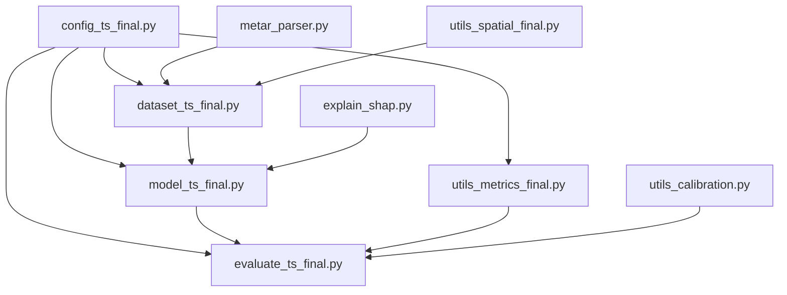

**Diagram sources**
- [config_ts_final.py:16-208](file://config_ts_final.py#L16-L208)
- [dataset_ts_final.py:47-515](file://dataset_ts_final.py#L47-L515)
- [metar_parser.py:141-186](file://metar_parser.py#L141-L186)
- [model_ts_final.py:68-272](file://model_ts_final.py#L68-L272)
- [evaluate_ts_final.py:361-800](file://evaluate_ts_final.py#L361-L800)
- [utils_metrics_final.py:23-760](file://utils_metrics_final.py#L23-L760)
- [explain_shap.py:15-91](file://explain_shap.py#L15-L91)
- [utils_spatial_final.py:12-80](file://utils_spatial_final.py#L12-L80)
- [utils_calibration.py:24-167](file://utils_calibration.py#L24-L167)

**Section sources**
- [config_ts_final.py:16-208](file://config_ts_final.py#L16-L208)
- [dataset_ts_final.py:47-515](file://dataset_ts_final.py#L47-L515)
- [metar_parser.py:141-186](file://metar_parser.py#L141-L186)
- [model_ts_final.py:68-272](file://model_ts_final.py#L68-L272)
- [evaluate_ts_final.py:361-800](file://evaluate_ts_final.py#L361-L800)
- [utils_metrics_final.py:23-760](file://utils_metrics_final.py#L23-L760)
- [explain_shap.py:15-91](file://explain_shap.py#L15-L91)
- [utils_spatial_final.py:12-80](file://utils_spatial_final.py#L12-L80)
- [utils_calibration.py:24-167](file://utils_calibration.py#L24-L167)

## Performance Considerations
- Temporal smoothing: Exponential moving average is recommended for nowcasting to suppress isolated spikes while preserving responsiveness.
- Persistence filtering: Increasing the minimum run length reduces false alarms but risks missing short events; severe fast-track threshold can mitigate this for high-confidence severe events.
- Schmitt trigger: Dual-threshold hysteresis reduces temporal chattering without relying solely on persistence.
- Attention visualization: Enables debugging of gradient vanishing and understanding of temporal reliance.

[No sources needed since this section provides general guidance]

## Troubleshooting Guide
Common issues and systematic approaches:
- Over-smoothing causing delayed detections: Reduce smoothing window or switch to rolling mean; validate with dense time series plots.
- Too many short false alarms: Increase persistence minimum length or enable severe fast-track threshold; review short FA counts.
- Under-responsive severe events: Adjust severe fast-track threshold search range; ensure dynamic upwind masking is active.
- Poor calibration: Use reliability diagrams and ECE to assess; apply temperature scaling if needed.
- Misclassification by severity: Review severity mapping logic and event precomputation; validate METAR-derived features.
- Debugging attention forgetting: Inspect attention distribution plots; consider adjusting GRU depth/regularization.

**Section sources**
- [evaluate_ts_final.py:232-279](file://evaluate_ts_final.py#L232-L279)
- [utils_metrics_final.py:50-77](file://utils_metrics_final.py#L50-L77)
- [utils_metrics_final.py:243-260](file://utils_metrics_final.py#L243-L260)
- [utils_calibration.py:24-167](file://utils_calibration.py#L24-L167)
- [dataset_ts_final.py:210-237](file://dataset_ts_final.py#L210-L237)
- [evaluate_ts_final.py:146-184](file://evaluate_ts_final.py#L146-L184)

## Conclusion
The diagnostic and interpretability toolkit combines SHAP-based feature attribution, temporal attention visualization, severity and lead-time analytics, and calibration/reliability analysis to support robust model operation and iterative improvement. Integrating these diagnostics into operational workflows enables targeted tuning of thresholds, persistence, and temporal smoothing, while ensuring reliable uncertainty quantification and actionable failure insights.

[No sources needed since this section summarizes without analyzing specific files]

## Appendices

### Appendix A: SHAP Explainer Workflow
- Load model and dataset
- Select a representative positive TS event
- Wrap model for Captum compatibility
- Compute Integrated Gradients attributions with zero baselines
- Aggregate and normalize attributions per modality

**Section sources**
- [explain_shap.py:15-91](file://explain_shap.py#L15-L91)

### Appendix B: Temporal Attention Visualization Workflow
- Run inference to collect attention weights
- Average across samples and plot with error bars
- Interpret concentration on earlier frames as temporal change sensitivity

**Section sources**
- [model_ts_final.py:240-247](file://model_ts_final.py#L240-L247)
- [evaluate_ts_final.py:146-184](file://evaluate_ts_final.py#L146-L184)

### Appendix C: Severity and Lead-Time Reporting
- Compute event-level metrics and weighted metrics
- Generate severity performance plots and lead-time distributions
- Export failure analysis markdown for targeted improvements

**Section sources**
- [utils_metrics_final.py:338-392](file://utils_metrics_final.py#L338-L392)
- [utils_metrics_final.py:575-650](file://utils_metrics_final.py#L575-L650)
- [evaluate_ts_final.py:98-144](file://evaluate_ts_final.py#L98-L144)
- [evaluate_ts_final.py:187-229](file://evaluate_ts_final.py#L187-L229)
- [reports/failure_analysis.md:1-71](file://reports/failure_analysis.md#L1-L71)