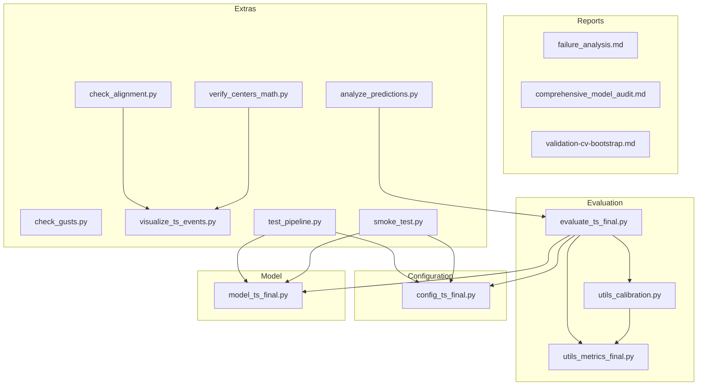
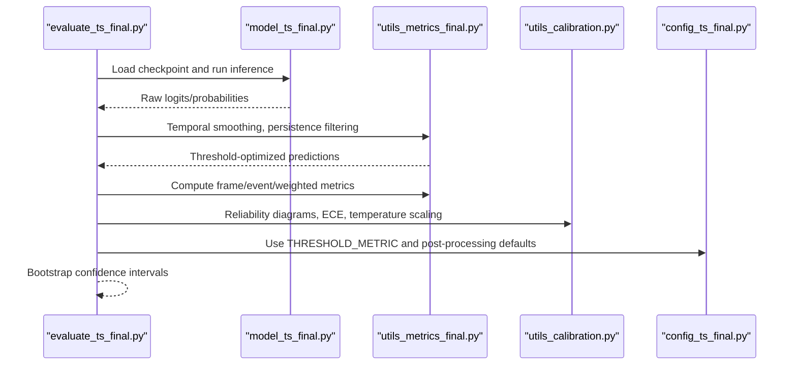
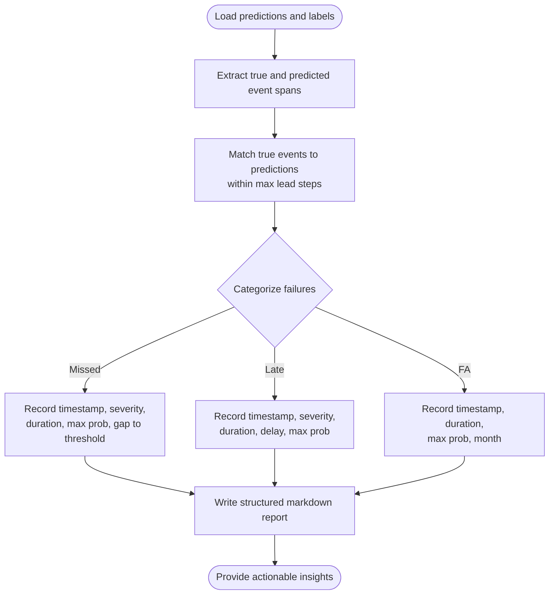
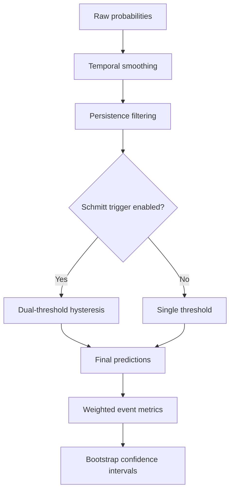
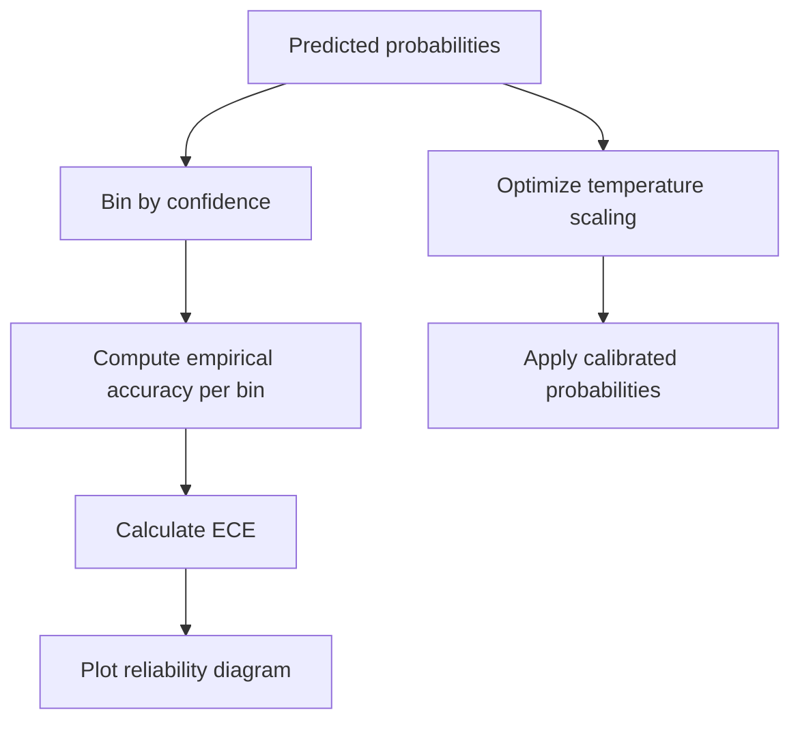
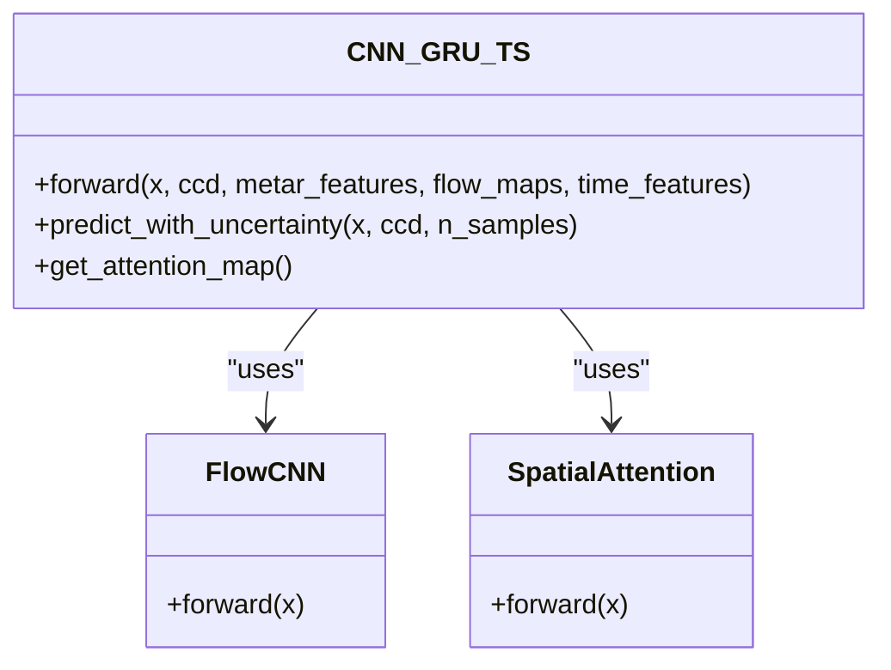
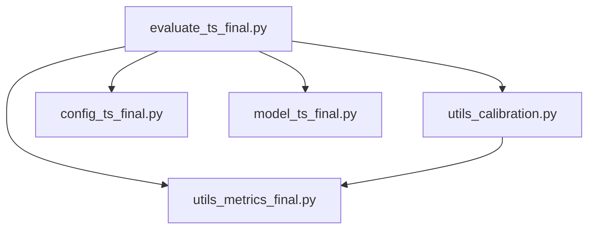

# Failure Pattern Diagnosis and Troubleshooting

<cite>
**Referenced Files in This Document**
- [failure_analysis.md](file://reports/failure_analysis.md)
- [comprehensive_model_audit.md](file://reports/comprehensive_model_audit.md)
- [validation-cv-bootstrap.md](file://reports/validation-cv-bootstrap.md)
- [evaluate_ts_final.py](file://evaluate_ts_final.py)
- [utils_metrics_final.py](file://utils_metrics_final.py)
- [utils_calibration.py](file://utils_calibration.py)
- [config_ts_final.py](file://config_ts_final.py)
- [model_ts_final.py](file://model_ts_final.py)
- [analyze_predictions.py](file://extras/analyze_predictions.py)
- [check_alignment.py](file://extras/check_alignment.py)
- [verify_centers_math.py](file://extras/verify_centers_math.py)
- [check_gusts.py](file://extras/check_gusts.py)
- [visualize_ts_events.py](file://extras/visualize_ts_events.py)
- [test_pipeline.py](file://extras/test_pipeline.py)
- [smoke_test.py](file://extras/smoke_test.py)
</cite>

## Table of Contents
1. [Introduction](#introduction)
2. [Project Structure](#project-structure)
3. [Core Components](#core-components)
4. [Architecture Overview](#architecture-overview)
5. [Detailed Component Analysis](#detailed-component-analysis)
6. [Dependency Analysis](#dependency-analysis)
7. [Performance Considerations](#performance-considerations)
8. [Troubleshooting Guide](#troubleshooting-guide)
9. [Conclusion](#conclusion)
10. [Appendices](#appendices)

## Introduction
This document provides a comprehensive guide to diagnosing and troubleshooting systematic failure patterns in model predictions for the Nagpur TS Nowcasting pipeline. It covers:
- Common failure categories: false alarms, missed detections, and timing errors
- Statistical analysis methodology used in evaluation reports
- Systematic troubleshooting approaches: data quality, model bias correction, and threshold adjustments
- Integration of diagnostic insights into model improvement cycles
- Practical operational workflows for immediate and long-term solutions
- Continuous monitoring and documentation of failure patterns

## Project Structure
The repository organizes evaluation, diagnostics, and troubleshooting utilities alongside the trained model and configuration. Key areas:
- Reports: Failure analysis and comprehensive audits
- Evaluation: End-to-end evaluation and bootstrapped confidence intervals
- Metrics: Temporal smoothing, persistence filtering, and weighted event metrics
- Calibration: Reliability diagrams, ECE, and temperature scaling
- Configuration: Threshold metric selection, post-processing, and model defaults
- Extras: Diagnostic utilities for alignment, METAR parsing, and pipeline verification

**Diagram sources**
- [evaluate_ts_final.py:1-908](file://evaluate_ts_final.py#L1-L908)
- [utils_metrics_final.py:1-760](file://utils_metrics_final.py#L1-L760)
- [utils_calibration.py:1-420](file://utils_calibration.py#L1-L420)
- [config_ts_final.py:1-211](file://config_ts_final.py#L1-L211)
- [model_ts_final.py:1-360](file://model_ts_final.py#L1-L360)
- [analyze_predictions.py:1-64](file://extras/analyze_predictions.py#L1-L64)
- [check_alignment.py:1-54](file://extras/check_alignment.py#L1-L54)
- [verify_centers_math.py:1-51](file://extras/verify_centers_math.py#L1-L51)
- [check_gusts.py:1-34](file://extras/check_gusts.py#L1-L34)
- [visualize_ts_events.py:1-217](file://extras/visualize_ts_events.py#L1-L217)
- [test_pipeline.py:1-54](file://extras/test_pipeline.py#L1-L54)
- [smoke_test.py:1-27](file://extras/smoke_test.py#L1-L27)

**Section sources**
- [evaluate_ts_final.py:1-908](file://evaluate_ts_final.py#L1-L908)
- [utils_metrics_final.py:1-760](file://utils_metrics_final.py#L1-L760)
- [utils_calibration.py:1-420](file://utils_calibration.py#L1-L420)
- [config_ts_final.py:1-211](file://config_ts_final.py#L1-L211)
- [model_ts_final.py:1-360](file://model_ts_final.py#L1-L360)
- [analyze_predictions.py:1-64](file://extras/analyze_predictions.py#L1-L64)
- [check_alignment.py:1-54](file://extras/check_alignment.py#L1-L54)
- [verify_centers_math.py:1-51](file://extras/verify_centers_math.py#L1-L51)
- [check_gusts.py:1-34](file://extras/check_gusts.py#L1-L34)
- [visualize_ts_events.py:1-217](file://extras/visualize_ts_events.py#L1-L217)
- [test_pipeline.py:1-54](file://extras/test_pipeline.py#L1-L54)
- [smoke_test.py:1-27](file://extras/smoke_test.py#L1-L27)

## Core Components
- Failure analysis reports: Structured markdown summaries of missed events, late detections, and false alarms, enabling quick triage and targeted fixes.
- Evaluation framework: Threshold optimization, persistence filtering, temporal smoothing, and weighted event metrics with bootstrapped confidence intervals.
- Calibration utilities: Reliability diagrams, ECE, and temperature scaling to address overconfidence and miscalibration.
- Configuration-driven diagnostics: Centralized threshold metric selection and post-processing parameters to balance detection and false alarm rates.
- Model architecture: CNN backbone with spatial skip connections and GRU temporal fusion, supporting uncertainty estimation and interpretability.

**Section sources**
- [failure_analysis.md:1-71](file://reports/failure_analysis.md#L1-L71)
- [evaluate_ts_final.py:1-908](file://evaluate_ts_final.py#L1-L908)
- [utils_metrics_final.py:1-760](file://utils_metrics_final.py#L1-L760)
- [utils_calibration.py:1-420](file://utils_calibration.py#L1-L420)
- [config_ts_final.py:1-211](file://config_ts_final.py#L1-L211)
- [model_ts_final.py:1-360](file://model_ts_final.py#L1-L360)

## Architecture Overview
The evaluation and failure analysis pipeline integrates model inference, temporal post-processing, and statistical analysis to produce actionable insights.

**Diagram sources**
- [evaluate_ts_final.py:1-908](file://evaluate_ts_final.py#L1-L908)
- [model_ts_final.py:1-360](file://model_ts_final.py#L1-L360)
- [utils_metrics_final.py:1-760](file://utils_metrics_final.py#L1-L760)
- [utils_calibration.py:1-420](file://utils_calibration.py#L1-L420)
- [config_ts_final.py:1-211](file://config_ts_final.py#L1-L211)

## Detailed Component Analysis

### Failure Analysis Methodology
- Categorization: Missed events (false negatives), late detections (>60 min delay), and false alarms (false positives) are tabulated with severity and timing context.
- Statistical grounding: Weighted event metrics incorporate lead-time bonuses and severity weighting to reflect operational impact.
- Bootstrapped confidence intervals: Calendar-day block bootstrapping provides robust uncertainty quantification for test metrics.

**Diagram sources**
- [utils_metrics_final.py:520-573](file://utils_metrics_final.py#L520-L573)
- [utils_calibration.py:275-387](file://utils_calibration.py#L275-L387)

**Section sources**
- [failure_analysis.md:1-71](file://reports/failure_analysis.md#L1-L71)
- [utils_metrics_final.py:520-573](file://utils_metrics_final.py#L520-L573)
- [utils_calibration.py:275-387](file://utils_calibration.py#L275-L387)
- [validation-cv-bootstrap.md:1-89](file://reports/validation-cv-bootstrap.md#L1-L89)

### Evaluation and Threshold Optimization
- Threshold search: Grid search over configurable range optimizing selected metric (e.g., weighted CSI with lead-time bonus).
- Persistence filtering: Removes short-lived false alarms while preserving severe events under a fast-track threshold.
- Dual-threshold trigger: Schmitt trigger reduces temporal chatter with hysteresis.
- Calibration: Platt scaling and temperature scaling improve reliability and reduce overconfidence.

**Diagram sources**
- [evaluate_ts_final.py:500-600](file://evaluate_ts_final.py#L500-L600)
- [utils_metrics_final.py:192-241](file://utils_metrics_final.py#L192-L241)
- [utils_metrics_final.py:243-261](file://utils_metrics_final.py#L243-L261)
- [utils_metrics_final.py:653-760](file://utils_metrics_final.py#L653-L760)

**Section sources**
- [evaluate_ts_final.py:500-600](file://evaluate_ts_final.py#L500-L600)
- [utils_metrics_final.py:192-241](file://utils_metrics_final.py#L192-L241)
- [utils_metrics_final.py:243-261](file://utils_metrics_final.py#L243-L261)
- [utils_metrics_final.py:653-760](file://utils_metrics_final.py#L653-L760)

### Calibration and Reliability
- Reliability diagrams compare uncalibrated vs calibrated outputs; ECE quantifies calibration error.
- Temperature scaling optimizes a scalar temperature parameter to improve reliability.

**Diagram sources**
- [utils_calibration.py:24-61](file://utils_calibration.py#L24-L61)
- [utils_calibration.py:63-106](file://utils_calibration.py#L63-L106)
- [utils_calibration.py:112-168](file://utils_calibration.py#L112-L168)

**Section sources**
- [utils_calibration.py:24-61](file://utils_calibration.py#L24-L61)
- [utils_calibration.py:63-106](file://utils_calibration.py#L63-L106)
- [utils_calibration.py:112-168](file://utils_calibration.py#L112-L168)

### Model Architecture and Interpretability
- CNN backbone with dynamic channel adaptation, spatial skip connection, and optional optical flow features.
- GRU temporal module replacing the transformer for improved parameter efficiency and generalization.
- Attention pooling for interpretability; optional evidential learning and uncertainty heads.

**Diagram sources**
- [model_ts_final.py:83-360](file://model_ts_final.py#L83-L360)

**Section sources**
- [model_ts_final.py:83-360](file://model_ts_final.py#L83-L360)

## Dependency Analysis
Key dependencies and interactions:
- Evaluation depends on metrics utilities for threshold optimization and event analysis.
- Calibration utilities depend on metrics for reliability assessment.
- Configuration centralizes threshold metric selection and post-processing defaults.
- Model provides forward pass and optional uncertainty outputs used by evaluation and calibration.

**Diagram sources**
- [evaluate_ts_final.py:1-908](file://evaluate_ts_final.py#L1-L908)
- [utils_metrics_final.py:1-760](file://utils_metrics_final.py#L1-L760)
- [utils_calibration.py:1-420](file://utils_calibration.py#L1-L420)
- [config_ts_final.py:1-211](file://config_ts_final.py#L1-L211)
- [model_ts_final.py:1-360](file://model_ts_final.py#L1-L360)

**Section sources**
- [evaluate_ts_final.py:1-908](file://evaluate_ts_final.py#L1-L908)
- [utils_metrics_final.py:1-760](file://utils_metrics_final.py#L1-L760)
- [utils_calibration.py:1-420](file://utils_calibration.py#L1-L420)
- [config_ts_final.py:1-211](file://config_ts_final.py#L1-L211)
- [model_ts_final.py:1-360](file://model_ts_final.py#L1-L360)

## Performance Considerations
- Parameter efficiency: GRU-based architecture yields higher test performance with fewer parameters compared to transformer heads.
- Temporal smoothing and persistence filtering reduce false alarms while preserving detection sensitivity.
- Calibration improves reliability and enables safer threshold selection for operational use.

[No sources needed since this section provides general guidance]

## Troubleshooting Guide

### Immediate Corrective Actions
- Adjust threshold metric: Ensure the evaluation uses the lead-time-weighted CSI as the primary selection criterion.
- Tighten persistence filtering: Increase minimum event length to suppress stray false alarms.
- Enable Schmitt trigger: Reduce temporal chattering with hysteresis thresholds.
- Apply calibration: Use Platt scaling or temperature scaling to mitigate overconfidence.

**Section sources**
- [config_ts_final.py:95-97](file://config_ts_final.py#L95-L97)
- [utils_metrics_final.py:50-78](file://utils_metrics_final.py#L50-L78)
- [utils_metrics_final.py:243-261](file://utils_metrics_final.py#L243-L261)
- [utils_calibration.py:63-106](file://utils_calibration.py#L63-L106)

### Long-term Solution Strategies
- Data quality improvements: Add missing seasonal data (e.g., September 2024) to address training coverage gaps.
- Feature standardization: Normalize CCD features to stabilize training and reduce seasonality drift.
- Model simplification: Revert to GRU with spatial skip, reducing complexity and overfitting risk.
- Ensemble strategies: Average predictions from best epoch and SWA model to reduce false alarms.

**Section sources**
- [comprehensive_model_audit.md:319-344](file://reports/comprehensive_model_audit.md#L319-L344)
- [comprehensive_model_audit.md:219-252](file://reports/comprehensive_model_audit.md#L219-L252)

### Operational Workflows
- Daily prediction export: Save predictions with timestamps, severity, and event flags for downstream analysis.
- Seasonal performance monitoring: Track frame-level metrics by meteorological season to detect regime shifts.
- Pipeline verification: Run smoke tests and dataset verification to catch input mismatches early.

**Section sources**
- [utils_calibration.py:251-269](file://utils_calibration.py#L251-L269)
- [utils_calibration.py:174-244](file://utils_calibration.py#L174-L244)
- [smoke_test.py:1-27](file://extras/smoke_test.py#L1-L27)
- [test_pipeline.py:1-54](file://extras/test_pipeline.py#L1-L54)

### Diagnostic Utilities
- Alignment checks: Verify consistent cropping and center alignment across image dimensions.
- METAR parsing: Confirm wind speeds and gust indicators to assess synoptic conditions.
- Event visualization: Plot TS events by severity and duration to contextualize failure patterns.

**Section sources**
- [check_alignment.py:1-54](file://extras/check_alignment.py#L1-L54)
- [verify_centers_math.py:1-51](file://extras/verify_centers_math.py#L1-L51)
- [check_gusts.py:1-34](file://extras/check_gusts.py#L1-L34)
- [visualize_ts_events.py:1-217](file://extras/visualize_ts_events.py#L1-L217)

## Conclusion
Systematic failure pattern diagnosis hinges on structured categorization, robust statistical analysis, and iterative model refinement. By integrating threshold tuning, persistence filtering, calibration, and configuration-driven post-processing, the pipeline can reduce false alarms, improve detection of severe events, and maintain reliable lead times. Continuous monitoring and documentation of failure patterns enable sustainable model improvement cycles aligned with operational needs.

[No sources needed since this section summarizes without analyzing specific files]

## Appendices

### Statistical Analysis Reference
- Weighted event metrics: Incorporate severity and lead-time bonuses to emphasize early, impactful detections.
- Bootstrap confidence intervals: Provide uncertainty bounds for test metrics using calendar-day block sampling.

**Section sources**
- [utils_metrics_final.py:575-651](file://utils_metrics_final.py#L575-L651)
- [utils_metrics_final.py:653-760](file://utils_metrics_final.py#L653-L760)

### Configuration Highlights
- Threshold metric selection: Primary optimization criterion for threshold search.
- Post-processing defaults: Smoothing, persistence, and dual-threshold parameters.

**Section sources**
- [config_ts_final.py:95-97](file://config_ts_final.py#L95-L97)
- [config_ts_final.py:90-97](file://config_ts_final.py#L90-L97)