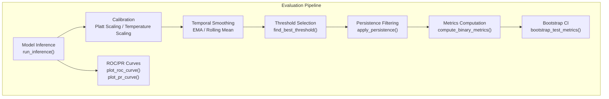
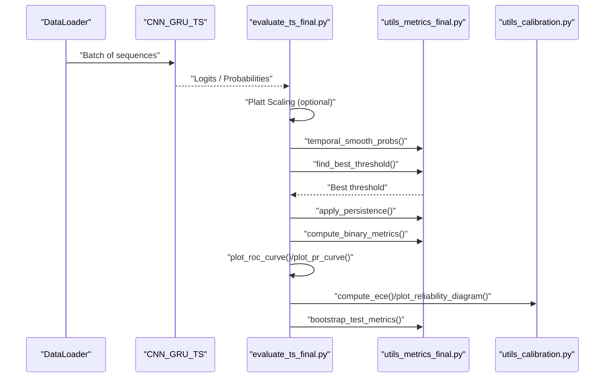
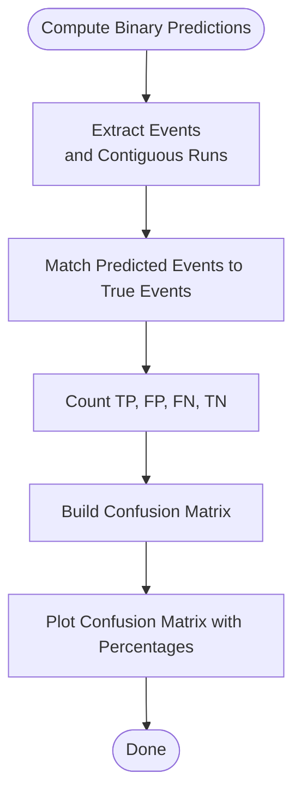
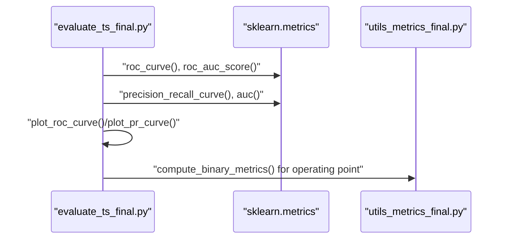
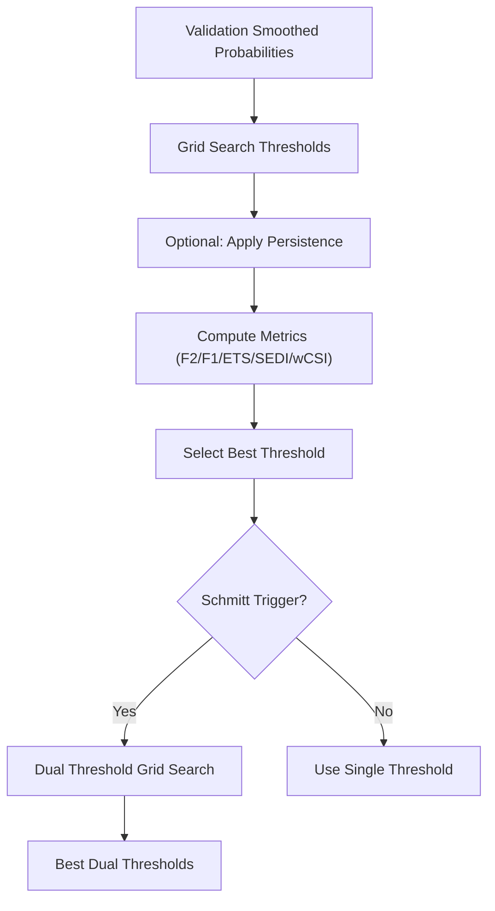
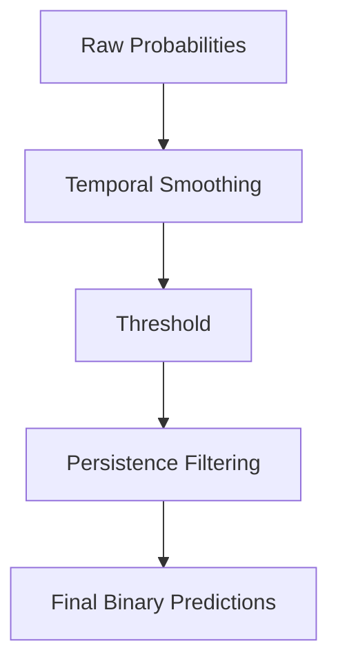
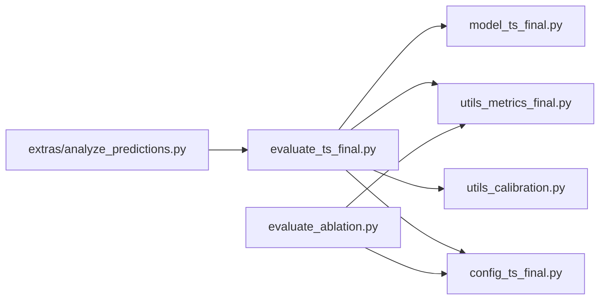

# Performance Metric and Threshold Analysis

<cite>
**Referenced Files in This Document**
- [utils_metrics_final.py](file://utils_metrics_final.py)
- [evaluate_ts_final.py](file://evaluate_ts_final.py)
- [utils_calibration.py](file://utils_calibration.py)
- [config_ts_final.py](file://config_ts_final.py)
- [model_ts_final.py](file://model_ts_final.py)
- [evaluate_ablation.py](file://evaluate_ablation.py)
- [extras/analyze_predictions.py](file://extras/analyze_predictions.py)
- [reports/advanced_ml_discussion.md](file://reports/advanced_ml_discussion.md)
</cite>

## Table of Contents
1. [Introduction](#introduction)
2. [Project Structure](#project-structure)
3. [Core Components](#core-components)
4. [Architecture Overview](#architecture-overview)
5. [Detailed Component Analysis](#detailed-component-analysis)
6. [Dependency Analysis](#dependency-analysis)
7. [Performance Considerations](#performance-considerations)
8. [Troubleshooting Guide](#troubleshooting-guide)
9. [Conclusion](#conclusion)
10. [Appendices](#appendices)

## Introduction
This document provides a comprehensive guide to performance metric analysis and operating point optimization for the Nagpur thunderstorm nowcasting system. It explains how confusion matrices, ROC curves, and precision-recall curves are computed and interpreted, how detection probability trades off against false alarm rate, and how threshold optimization is performed across conservative and aggressive forecasting modes. It also covers the effectiveness of persistence filtering and temporal smoothing, and demonstrates how diagnostic metrics integrate with operational requirements to drive model improvements.

## Project Structure
The evaluation and analysis pipeline integrates:
- Model inference and post-processing
- Threshold optimization on validation data
- Calibration and reliability diagnostics
- Event-level and severity-weighted metrics
- Bootstrapped confidence intervals
- Ablation studies and failure case analysis

**Diagram sources**
- [evaluate_ts_final.py:285-324](file://evaluate_ts_final.py#L285-L324)
- [evaluate_ts_final.py:508-548](file://evaluate_ts_final.py#L508-L548)
- [evaluate_ts_final.py:590-601](file://evaluate_ts_final.py#L590-L601)
- [evaluate_ts_final.py:612-623](file://evaluate_ts_final.py#L612-L623)
- [utils_metrics_final.py:23-47](file://utils_metrics_final.py#L23-L47)
- [utils_metrics_final.py:192-240](file://utils_metrics_final.py#L192-L240)
- [utils_metrics_final.py:50-77](file://utils_metrics_final.py#L50-L77)
- [utils_metrics_final.py:653-760](file://utils_metrics_final.py#L653-L760)

**Section sources**
- [evaluate_ts_final.py:361-800](file://evaluate_ts_final.py#L361-L800)
- [utils_metrics_final.py:120-190](file://utils_metrics_final.py#L120-L190)

## Core Components
- Confusion matrix computation and visualization
- ROC and Precision-Recall curve generation and AUC calculation
- Threshold optimization via grid search across multiple metrics
- Persistence filtering and temporal smoothing
- Event-level and severity-weighted metrics
- Calibration diagnostics and reliability diagrams
- Bootstrapped confidence intervals for robust evaluation

**Section sources**
- [evaluate_ts_final.py:41-95](file://evaluate_ts_final.py#L41-L95)
- [utils_metrics_final.py:120-190](file://utils_metrics_final.py#L120-L190)
- [utils_metrics_final.py:192-240](file://utils_metrics_final.py#L192-L240)
- [utils_metrics_final.py:50-77](file://utils_metrics_final.py#L50-L77)
- [utils_metrics_final.py:23-47](file://utils_metrics_final.py#L23-L47)
- [utils_metrics_final.py:653-760](file://utils_metrics_final.py#L653-L760)

## Architecture Overview
The evaluation workflow proceeds through inference, calibration, smoothing, threshold selection, persistence filtering, and metric computation. ROC/PR curves and confusion matrices are plotted for diagnostics. Bootstrapped confidence intervals are computed to quantify uncertainty.

**Diagram sources**
- [evaluate_ts_final.py:285-324](file://evaluate_ts_final.py#L285-L324)
- [evaluate_ts_final.py:508-548](file://evaluate_ts_final.py#L508-L548)
- [evaluate_ts_final.py:590-601](file://evaluate_ts_final.py#L590-L601)
- [evaluate_ts_final.py:612-623](file://evaluate_ts_final.py#L612-L623)
- [utils_metrics_final.py:23-47](file://utils_metrics_final.py#L23-L47)
- [utils_metrics_final.py:192-240](file://utils_metrics_final.py#L192-L240)
- [utils_metrics_final.py:50-77](file://utils_metrics_final.py#L50-L77)
- [utils_metrics_final.py:653-760](file://utils_metrics_final.py#L653-L760)
- [utils_calibration.py:24-60](file://utils_calibration.py#L24-L60)
- [utils_calibration.py:112-167](file://utils_calibration.py#L112-L167)

## Detailed Component Analysis

### Confusion Matrix Analysis Methodology
- Confusion matrix counts true positives (TP), false positives (FP), false negatives (FN), and true negatives (TN).
- Percentages are shown to contextualize class balance.
- Operating point is marked on ROC/PR plots for the selected threshold.

**Diagram sources**
- [evaluate_ts_final.py:41-56](file://evaluate_ts_final.py#L41-L56)
- [utils_metrics_final.py:120-190](file://utils_metrics_final.py#L120-L190)

**Section sources**
- [evaluate_ts_final.py:41-56](file://evaluate_ts_final.py#L41-L56)
- [utils_metrics_final.py:120-190](file://utils_metrics_final.py#L120-L190)

### ROC Curve and Precision-Recall Curve Interpretation
- ROC curve: True Positive Rate vs. False Positive Rate across thresholds; AUC quantifies discrimination ability.
- Precision-Recall curve: Precision vs. Recall; PR-AUC is threshold-independent and informative for imbalanced settings.
- Operating point is plotted at the chosen threshold’s FPR/TPR and precision/recall.

**Diagram sources**
- [evaluate_ts_final.py:612-623](file://evaluate_ts_final.py#L612-L623)
- [evaluate_ts_final.py:59-95](file://evaluate_ts_final.py#L59-L95)

**Section sources**
- [evaluate_ts_final.py:59-95](file://evaluate_ts_final.py#L59-L95)
- [evaluate_ts_final.py:612-623](file://evaluate_ts_final.py#L612-L623)

### Optimal Operating Point Identification
- Validation-derived threshold selection via grid search optimizing F2, F1, ETS, SEDI, or weighted metrics.
- Dual-threshold Schmitt trigger optimization for hysteresis-based predictions.
- Severe fast-track threshold to preserve detection of high-severity events.

**Diagram sources**
- [evaluate_ts_final.py:508-548](file://evaluate_ts_final.py#L508-L548)
- [utils_metrics_final.py:192-240](file://utils_metrics_final.py#L192-L240)
- [utils_metrics_final.py:263-314](file://utils_metrics_final.py#L263-L314)

**Section sources**
- [evaluate_ts_final.py:508-548](file://evaluate_ts_final.py#L508-L548)
- [utils_metrics_final.py:192-240](file://utils_metrics_final.py#L192-L240)
- [utils_metrics_final.py:263-314](file://utils_metrics_final.py#L263-L314)

### Trade-offs Between Detection Probability and False Alarm Rate
- POD (hit rate) increases with lower thresholds; FAR decreases with higher thresholds.
- Weighted metrics (e.g., wPOD_evt, wFAR_evt, wCSI_evt) incorporate severity and lead-time bonuses to align with operational priorities.
- Conservative vs. aggressive modes can be achieved by shifting thresholds upward or downward, respectively.

**Section sources**
- [utils_metrics_final.py:120-190](file://utils_metrics_final.py#L120-L190)
- [utils_metrics_final.py:575-650](file://utils_metrics_final.py#L575-L650)

### Threshold Optimization Techniques
- Single threshold optimization: grid search over a range with configurable metric (F2 preferred for aviation).
- Dual-threshold Schmitt trigger: optimize high/low thresholds jointly; hysteresis reduces temporal chatter.
- Severe fast-track: boost detection for high-probability severe events while preserving persistence elsewhere.

**Section sources**
- [evaluate_ts_final.py:508-574](file://evaluate_ts_final.py#L508-L574)
- [utils_metrics_final.py:243-260](file://utils_metrics_final.py#L243-L260)
- [utils_metrics_final.py:263-314](file://utils_metrics_final.py#L263-L314)

### Persistence Filtering and Temporal Smoothing Impact
- Persistence filtering removes short-lived runs to reduce false alarms; severe events can bypass this with a high-probability threshold.
- Temporal smoothing (EMA or rolling mean) stabilizes predictions and reduces isolated spikes.
- Both improve operational stability and reduce false alarms while maintaining detection capability.

**Diagram sources**
- [utils_metrics_final.py:23-47](file://utils_metrics_final.py#L23-L47)
- [utils_metrics_final.py:50-77](file://utils_metrics_final.py#L50-L77)
- [evaluate_ts_final.py:590-601](file://evaluate_ts_final.py#L590-L601)

**Section sources**
- [utils_metrics_final.py:23-47](file://utils_metrics_final.py#L23-L47)
- [utils_metrics_final.py:50-77](file://utils_metrics_final.py#L50-L77)
- [evaluate_ts_final.py:590-601](file://evaluate_ts_final.py#L590-L601)

### Diagnostic Metrics and Operational Requirements
- Event-level metrics (POD, FAR, CSI) and lead-time statistics inform operational lead-time and timeliness.
- Severity-weighted metrics emphasize high-impact events.
- Bootstrapped confidence intervals provide robust uncertainty estimates for operational decision-making.

**Section sources**
- [utils_metrics_final.py:338-392](file://utils_metrics_final.py#L338-L392)
- [utils_metrics_final.py:575-650](file://utils_metrics_final.py#L575-L650)
- [utils_metrics_final.py:653-760](file://utils_metrics_final.py#L653-L760)

### Systematic Approach to Metric-Driven Model Improvement
- Ablation studies isolate contributions of input channels and features.
- Reliability diagrams and ECE quantify calibration issues.
- Failure case analysis identifies recurring patterns for targeted fixes.

**Section sources**
- [evaluate_ablation.py:38-116](file://evaluate_ablation.py#L38-L116)
- [utils_calibration.py:24-60](file://utils_calibration.py#L24-L60)
- [utils_calibration.py:112-167](file://utils_calibration.py#L112-L167)
- [utils_calibration.py:275-386](file://utils_calibration.py#L275-L386)

## Dependency Analysis
Key dependencies and relationships:
- Evaluation script depends on model inference and metric utilities.
- Calibration utilities depend on scikit-learn for reliability diagnostics.
- Configuration controls post-processing and threshold optimization behavior.

**Diagram sources**
- [evaluate_ts_final.py:27-34](file://evaluate_ts_final.py#L27-L34)
- [model_ts_final.py:68-200](file://model_ts_final.py#L68-L200)
- [utils_metrics_final.py:120-190](file://utils_metrics_final.py#L120-L190)
- [utils_calibration.py:24-60](file://utils_calibration.py#L24-L60)
- [config_ts_final.py:87-94](file://config_ts_final.py#L87-L94)
- [evaluate_ablation.py:30-35](file://evaluate_ablation.py#L30-L35)
- [extras/analyze_predictions.py:6](file://extras/analyze_predictions.py#L6)

**Section sources**
- [evaluate_ts_final.py:27-34](file://evaluate_ts_final.py#L27-L34)
- [config_ts_final.py:87-94](file://config_ts_final.py#L87-L94)

## Performance Considerations
- Use Platt scaling or temperature scaling to improve calibration when the model is overconfident.
- Prefer F2 for imbalanced aviation settings; use weighted metrics to emphasize severe events.
- Tune smoothing window and persistence minimum length to balance lead-time and false alarms.
- Employ bootstrapped confidence intervals to assess variability across seasons and datasets.

[No sources needed since this section provides general guidance]

## Troubleshooting Guide
- If ROC/PR curves appear flat or AUC is low, inspect calibration and consider Platt scaling or temperature scaling.
- If false alarms dominate, increase threshold or tighten persistence filtering; consider Schmitt trigger dual thresholds.
- If missed events are frequent, review severity weighting and lead-time bonuses; adjust thresholds for severe fast-track.
- For unstable predictions, increase smoothing window or reduce aggressive threshold lowering.

**Section sources**
- [utils_calibration.py:63-106](file://utils_calibration.py#L63-L106)
- [reports/advanced_ml_discussion.md:48-99](file://reports/advanced_ml_discussion.md#L48-L99)
- [evaluate_ts_final.py:508-574](file://evaluate_ts_final.py#L508-L574)

## Conclusion
The Nagpur nowcasting pipeline integrates robust threshold optimization, calibration, and event-level metrics to support operational decision-making. Confusion matrices, ROC/PR curves, and bootstrapped confidence intervals provide actionable insights. Persistence filtering and temporal smoothing stabilize predictions, while weighted metrics align performance with operational priorities. A systematic approach—combining ablation studies, reliability diagnostics, and failure case analysis—drives continuous model improvement.

[No sources needed since this section summarizes without analyzing specific files]

## Appendices

### Appendix A: Configuration Controls for Threshold and Post-Processing
- Threshold metric selection, minimum threshold, smoothing window/method, persistence minimum length, and Schmitt trigger enablement are configured centrally.

**Section sources**
- [config_ts_final.py:87-94](file://config_ts_final.py#L87-L94)

### Appendix B: Example Metrics and Outputs
- Frame-level metrics include POD, FAR, CSI, ETS, SEDI, F1, F2.
- Event-level metrics include hits, misses, false alarms, POD, FAR, CSI, SEDI.
- Weighted event metrics include wPOD_evt, wFAR_evt, wCSI_evt.

**Section sources**
- [utils_metrics_final.py:120-190](file://utils_metrics_final.py#L120-L190)
- [utils_metrics_final.py:338-392](file://utils_metrics_final.py#L338-L392)
- [utils_metrics_final.py:575-650](file://utils_metrics_final.py#L575-L650)