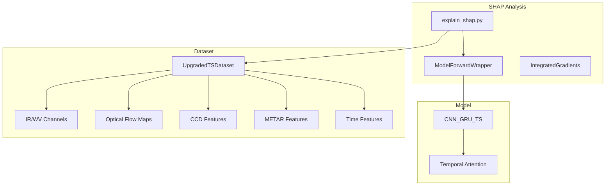
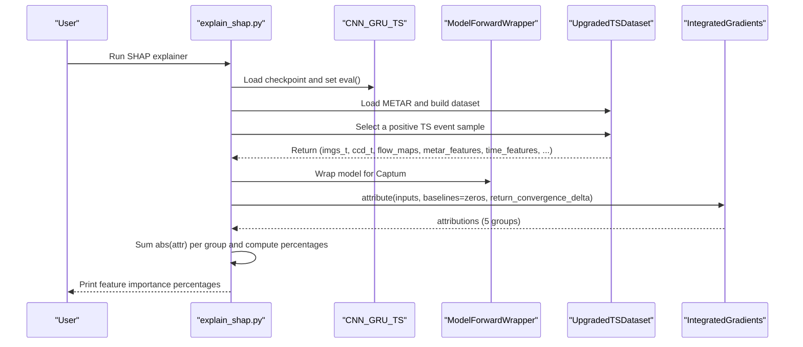
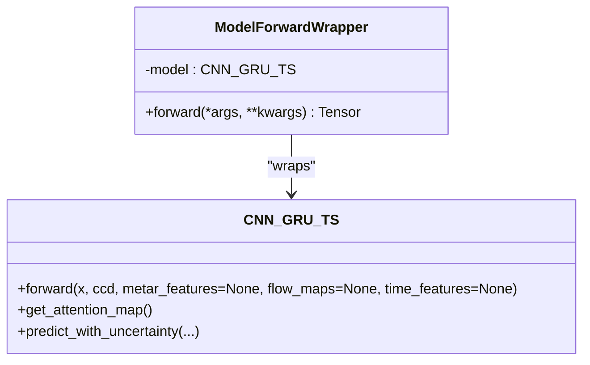
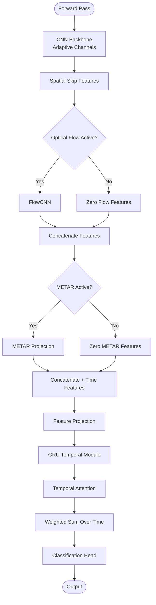
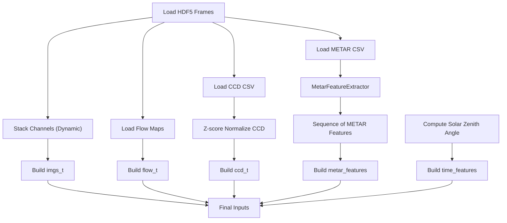
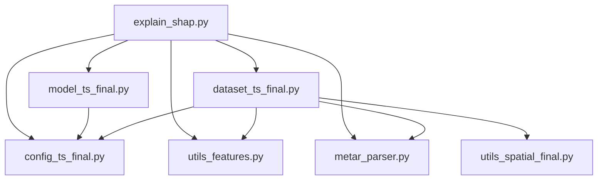

# SHAP Feature Attribution Analysis

<cite>
**Referenced Files in This Document**
- [explain_shap.py](file://explain_shap.py)
- [model_ts_final.py](file://model_ts_final.py)
- [dataset_ts_final.py](file://dataset_ts_final.py)
- [config_ts_final.py](file://config_ts_final.py)
- [metar_parser.py](file://metar_parser.py)
- [utils_features.py](file://utils_features.py)
- [evaluate_ts_final.py](file://evaluate_ts_final.py)
- [utils_spatial_final.py](file://utils_spatial_final.py)
- [train_ts_final.py](file://train_ts_final.py)
</cite>

## Table of Contents
1. [Introduction](#introduction)
2. [Project Structure](#project-structure)
3. [Core Components](#core-components)
4. [Architecture Overview](#architecture-overview)
5. [Detailed Component Analysis](#detailed-component-analysis)
6. [Dependency Analysis](#dependency-analysis)
7. [Performance Considerations](#performance-considerations)
8. [Troubleshooting Guide](#troubleshooting-guide)
9. [Conclusion](#conclusion)
10. [Appendices](#appendices)

## Introduction
This document explains the SHAP (SHapley Additive exPlanations) feature attribution implementation used in the thunderstorm nowcasting system. It focuses on the IntegratedGradients-based methodology for analyzing model decision-making across multiple input modalities: IR imagery, optical flow maps, CCD features, METAR surface data, and temporal features. It also documents how feature importance is quantified as percentage contributions, how temporal attention weights are analyzed, and how to interpret SHAP heatmaps for individual predictions. Finally, it covers the wrapper class used to adapt the model for Captum’s IntegratedGradients and the baseline generation strategy.

## Project Structure
The SHAP analysis is implemented as a standalone script that loads a trained model, prepares a test dataset, selects a representative positive event, and computes IntegratedGradients attributions across all input modalities. The model and dataset components are shared with the broader training and evaluation pipeline.

**Diagram sources**
- [explain_shap.py:15-92](file://explain_shap.py#L15-L92)
- [model_ts_final.py:68-269](file://model_ts_final.py#L68-L269)
- [dataset_ts_final.py:337-515](file://dataset_ts_final.py#L337-L515)

**Section sources**
- [explain_shap.py:15-92](file://explain_shap.py#L15-L92)
- [model_ts_final.py:68-269](file://model_ts_final.py#L68-L269)
- [dataset_ts_final.py:337-515](file://dataset_ts_final.py#L337-L515)

## Core Components
- SHAP explainer and wrapper: The script initializes the model, wraps it for Captum compatibility, and runs IntegratedGradients with zero baselines across all inputs.
- Model: The CNN-GRU architecture integrates IR imagery, optional optical flow, CCD features, METAR features, and time-of-day features, with temporal attention for interpretability.
- Dataset: The upgraded dataset stacks dynamic channels, standardizes CCD features, constructs METAR sequences, and builds time features including solar zenith angle.
- Configuration: Controls which modalities are active and how the model is constructed.

Key responsibilities:
- IntegratedGradients attribution computation across five input groups.
- Percentage feature importance summarization.
- Temporal attention weight collection and plotting.

**Section sources**
- [explain_shap.py:15-92](file://explain_shap.py#L15-L92)
- [model_ts_final.py:68-269](file://model_ts_final.py#L68-L269)
- [dataset_ts_final.py:337-515](file://dataset_ts_final.py#L337-L515)
- [config_ts_final.py:16-208](file://config_ts_final.py#L16-L208)

## Architecture Overview
The SHAP pipeline connects the explainer to the model and dataset, computing attributions for a selected positive event and aggregating feature importance across modalities.

**Diagram sources**
- [explain_shap.py:15-92](file://explain_shap.py#L15-L92)
- [model_ts_final.py:68-269](file://model_ts_final.py#L68-L269)
- [dataset_ts_final.py:337-515](file://dataset_ts_final.py#L337-L515)

## Detailed Component Analysis

### IntegratedGradients Explainer and Wrapper
- Model loading and evaluation: Loads the trained model checkpoint and sets it to evaluation mode.
- Dataset construction: Loads METAR data and builds the test dataset; selects a positive TS event sample that excludes trivial categories.
- Input preparation: Constructs five input tensors: images, CCD features, optical flow maps, METAR features, and time features. Each is moved to the configured device and marked for gradient tracking.
- Wrapper class: A lightweight module wrapper ensures the model returns a scalar score for Captum’s IntegratedGradients.
- Baseline: Zeros baseline for all inputs.
- Attribution: Computes IntegratedGradients attributions and convergence delta.
- Feature importance: Sums absolute attributions per input group, normalizes to percentages, and prints the breakdown.

Practical interpretation tips:
- Higher absolute attribution indicates stronger influence on the prediction for that input group.
- Heatmaps can be visualized by reshaping attributions to spatial dimensions and overlaying on the original imagery.

**Section sources**
- [explain_shap.py:15-92](file://explain_shap.py#L15-L92)

### ModelForwardWrapper
- Purpose: Ensures the model returns a single scalar output suitable for IntegratedGradients.
- Behavior: If the model returns a tuple (e.g., logits plus extra heads), the wrapper extracts the primary output.

**Diagram sources**
- [explain_shap.py:57-65](file://explain_shap.py#L57-L65)
- [model_ts_final.py:202-269](file://model_ts_final.py#L202-L269)

**Section sources**
- [explain_shap.py:57-65](file://explain_shap.py#L57-L65)
- [model_ts_final.py:202-269](file://model_ts_final.py#L202-L269)

### Model Architecture and Temporal Attention
- Inputs: Images (dynamic channel stack), CCD features, optional optical flow, optional METAR features, optional time features.
- Backbone: MobileNetV2-based CNN with adaptive first layer to match the number of input channels.
- Spatial skip connection: Low-resolution grid features for spatial context.
- GRU temporal fusion: Temporal sequence processed through a GRU with optional attention.
- Attention mechanism: Linear projection to time-step weights, softmax-normalized, stored for interpretability.
- Heads: Binary classification head; optional heteroscedastic variance head; optional intensity regression head.

Temporal attention usage:
- The model stores attention weights during forward pass and exposes them via a getter.
- The evaluation script includes plotting utilities for attention weights across time steps.

**Diagram sources**
- [model_ts_final.py:68-269](file://model_ts_final.py#L68-L269)

**Section sources**
- [model_ts_final.py:68-269](file://model_ts_final.py#L68-L269)

### Dataset Construction and Modalities
- Dynamic channel stacking: Uses configuration to select which IR/WV channels to include.
- Optical flow: Optionally concatenates IR and WV flow maps.
- CCD features: Z-score normalized across the dataset.
- METAR features: Sequence-aware features extracted via a feature extractor, including pressure drops, wind trends, dewpoint, cloud coverage, and risk indices.
- Time features: Month-encoded sine/cosine and solar zenith angle normalized to [-1, 1].
- Dynamic upwind masking: Applies a mask influenced by the mean flow to focus on upwind regions.

**Diagram sources**
- [dataset_ts_final.py:337-515](file://dataset_ts_final.py#L337-L515)
- [utils_features.py:11-171](file://utils_features.py#L11-L171)
- [metar_parser.py:141-186](file://metar_parser.py#L141-L186)
- [utils_spatial_final.py:12-65](file://utils_spatial_final.py#L12-L65)

**Section sources**
- [dataset_ts_final.py:337-515](file://dataset_ts_final.py#L337-L515)
- [utils_features.py:11-171](file://utils_features.py#L11-L171)
- [metar_parser.py:141-186](file://metar_parser.py#L141-L186)
- [utils_spatial_final.py:12-65](file://utils_spatial_final.py#L12-L65)

### Temporal Attention Weight Analysis
- Storage: The model saves attention weights during forward pass and exposes them via a getter.
- Evaluation plotting: The evaluation script includes a function to plot average attention weights across time steps, useful for understanding which frames contribute most to the prediction.

Interpretation guidelines:
- Higher average attention weight for a time step indicates stronger reliance on that frame.
- Variability (standard deviation) reflects consistency across samples.

**Section sources**
- [model_ts_final.py:240-246](file://model_ts_final.py#L240-L246)
- [evaluate_ts_final.py:146-184](file://evaluate_ts_final.py#L146-L184)

### Practical Examples: Interpreting SHAP Heatmaps
- Locate high-attribution regions: For each input modality, visualize the absolute attribution map overlaid on the corresponding input tensor (e.g., IR channels, optical flow magnitude).
- Identify model confidence patterns: High attribution often correlates with strong predictive features (e.g., cold cloud tops, convergence zones). Low attribution suggests the model relies less on that modality for the prediction.
- Compare modalities: Use the percentage contributions to assess whether the model prioritizes IR imagery, optical flow, or surface conditions.

[No sources needed since this section provides general guidance]

## Dependency Analysis
The SHAP explainer depends on the model, dataset, and configuration. The model depends on the dataset’s feature construction and the configuration controlling which modalities are active.

**Diagram sources**
- [explain_shap.py:4-7](file://explain_shap.py#L4-L7)
- [model_ts_final.py:16-13](file://model_ts_final.py#L16-L13)
- [dataset_ts_final.py:21-24](file://dataset_ts_final.py#L21-L24)
- [config_ts_final.py:16-208](file://config_ts_final.py#L16-L208)
- [metar_parser.py:1-5](file://metar_parser.py#L1-L5)
- [utils_features.py:6-9](file://utils_features.py#L6-L9)
- [utils_spatial_final.py:6-9](file://utils_spatial_final.py#L6-L9)

**Section sources**
- [explain_shap.py:4-7](file://explain_shap.py#L4-L7)
- [model_ts_final.py:16-13](file://model_ts_final.py#L16-L13)
- [dataset_ts_final.py:21-24](file://dataset_ts_final.py#L21-L24)
- [config_ts_final.py:16-208](file://config_ts_final.py#L16-L208)
- [metar_parser.py:1-5](file://metar_parser.py#L1-L5)
- [utils_features.py:6-9](file://utils_features.py#L6-L9)
- [utils_spatial_final.py:6-9](file://utils_spatial_final.py#L6-L9)

## Performance Considerations
- IntegratedGradients computational cost scales with the number of input tensors and their spatial resolution. Using zero baselines is efficient but still requires multiple forward passes depending on Captum’s internal steps.
- The model’s temporal attention enables interpretability without adding significant overhead during inference.
- Consider reducing attribution sampling for real-time analysis or using a subset of time steps if needed.

[No sources needed since this section provides general guidance]

## Troubleshooting Guide
- Captum import error: Ensure the captum package is installed; the script checks for it and exits with a message if missing.
- Model loading failures: Verify the model checkpoint path and device compatibility.
- No significant TS event found: The script searches for a positive event excluding trivial categories; adjust filtering criteria if needed.
- Missing METAR or CCD data: Ensure the METAR file and CCD CSV are present and readable; the dataset and feature extractor handle missing values with defaults.

**Section sources**
- [explain_shap.py:9-24](file://explain_shap.py#L9-L24)
- [explain_shap.py:38-40](file://explain_shap.py#L38-L40)
- [metar_parser.py:141-186](file://metar_parser.py#L141-L186)
- [dataset_ts_final.py:358-372](file://dataset_ts_final.py#L358-L372)

## Conclusion
The SHAP implementation leverages IntegratedGradients to quantify feature importance across IR imagery, optical flow, CCD features, METAR surface data, and temporal features. The wrapper class ensures compatibility with Captum, and zero baselines provide a straightforward baseline strategy. Temporal attention weights complement SHAP by revealing which time steps drive predictions. Together, these tools enable interpretable analysis of the model’s decision-making process in thunderstorm nowcasting.

[No sources needed since this section summarizes without analyzing specific files]

## Appendices

### Appendix A: Feature Importance Quantification Method
- Sum absolute attributions per input group.
- Normalize to percentages by dividing by the total across all groups.
- Interpretation: Percentage contribution indicates relative influence of each modality on the prediction.

**Section sources**
- [explain_shap.py:74-88](file://explain_shap.py#L74-L88)

### Appendix B: Temporal Attention Weight Analysis Workflow
- Collect attention weights during inference.
- Average across samples for each time step.
- Plot bar chart with error bars to visualize variability.

**Section sources**
- [model_ts_final.py:240-246](file://model_ts_final.py#L240-L246)
- [evaluate_ts_final.py:146-184](file://evaluate_ts_final.py#L146-L184)

### Appendix C: Configuration Flags for Modalities
- Channel selection: Controls which IR/WV channels are included.
- Optical flow: Enables/disables optical flow features.
- METAR features: Enables/disables METAR-based features.
- Time features: Enables/disables month/time-of-day features.
- CCD features: Enables/disables CCD features.

**Section sources**
- [config_ts_final.py:32-122](file://config_ts_final.py#L32-L122)