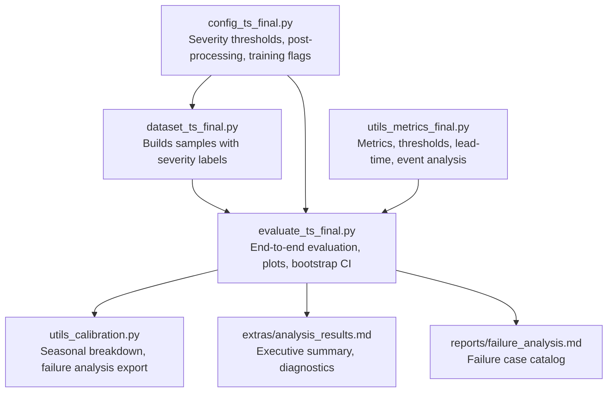
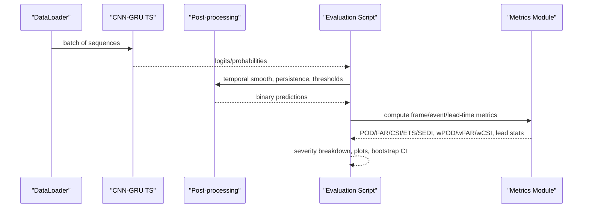
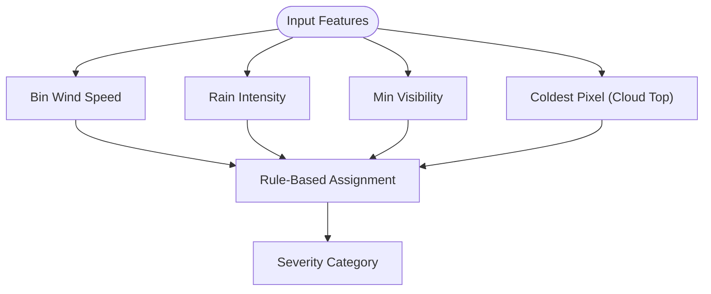
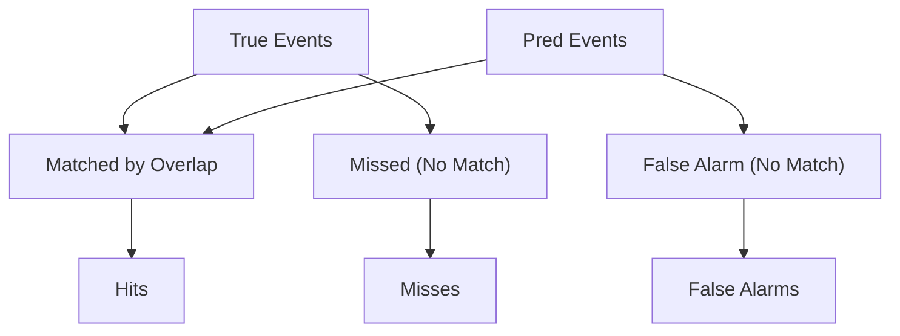
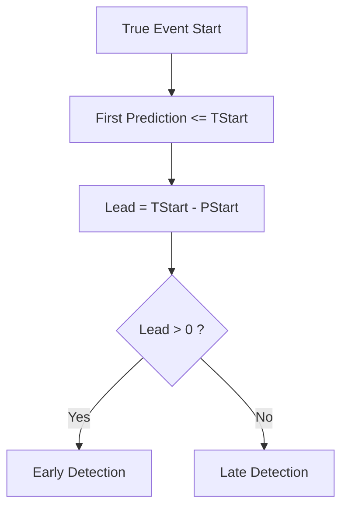
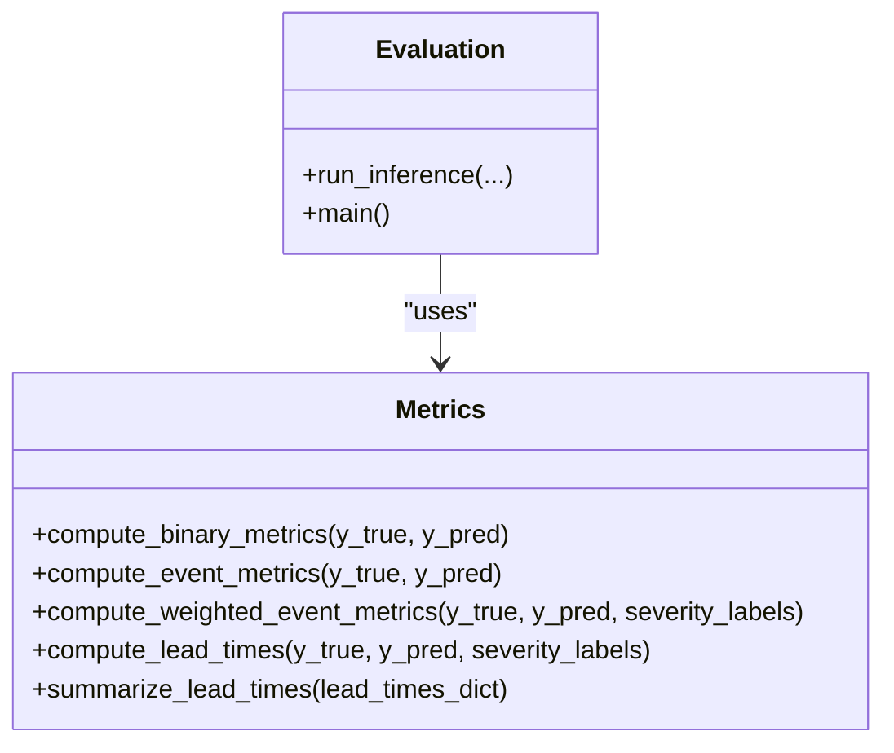
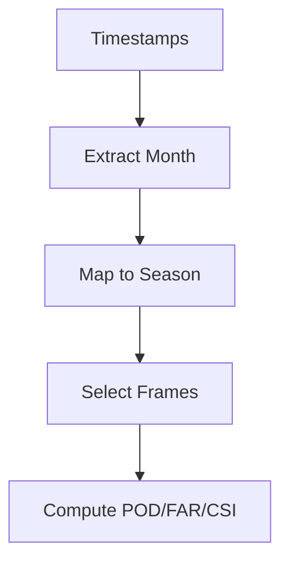
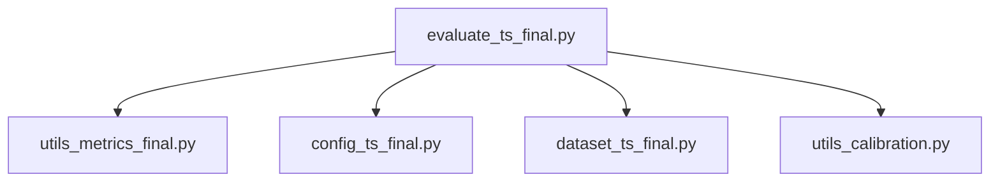

# Severity Category and Pattern Analysis

<cite>
**Referenced Files in This Document**
- [config_ts_final.py](file://config_ts_final.py)
- [dataset_ts_final.py](file://dataset_ts_final.py)
- [utils_metrics_final.py](file://utils_metrics_final.py)
- [evaluate_ts_final.py](file://evaluate_ts_final.py)
- [utils_calibration.py](file://utils_calibration.py)
- [analysis_results.md](file://extras/analysis_results.md)
- [failure_analysis.md](file://reports/failure_analysis.md)
- [analyze_predictions.py](file://extras/analyze_predictions.py)
</cite>

## Table of Contents
1. [Introduction](#introduction)
2. [Project Structure](#project-structure)
3. [Core Components](#core-components)
4. [Architecture Overview](#architecture-overview)
5. [Detailed Component Analysis](#detailed-component-analysis)
6. [Dependency Analysis](#dependency-analysis)
7. [Performance Considerations](#performance-considerations)
8. [Troubleshooting Guide](#troubleshooting-guide)
9. [Conclusion](#conclusion)
10. [Appendices](#appendices)

## Introduction
This document provides a comprehensive analysis of severity category classification and event pattern recognition in the Nagpur thunderstorm nowcasting system. It documents how thunderstorms are categorized across severity levels, how prediction accuracy varies across forecast horizons within the three-hour window, and how detection patterns differ by storm type. It also explains the relationship between storm intensity, duration, and prediction reliability, and analyzes seasonal and temporal variations in performance. Finally, it identifies systematic biases in severity classification and offers practical guidance for model refinement and threshold optimization.

## Project Structure
The analysis pipeline integrates configuration-driven severity classification, dataset construction with METAR/CCD features, evaluation with robust metrics, and visualization/reporting of performance across categories and time.

**Diagram sources**
- [config_ts_final.py:137-176](file://config_ts_final.py#L137-L176)
- [dataset_ts_final.py:137-236](file://dataset_ts_final.py#L137-L236)
- [utils_metrics_final.py:395-477](file://utils_metrics_final.py#L395-L477)
- [evaluate_ts_final.py:344-800](file://evaluate_ts_final.py#L344-L800)
- [utils_calibration.py:174-213](file://utils_calibration.py#L174-L213)
- [analysis_results.md:1-277](file://extras/analysis_results.md#L1-L277)
- [failure_analysis.md:1-71](file://reports/failure_analysis.md#L1-L71)

**Section sources**
- [config_ts_final.py:137-176](file://config_ts_final.py#L137-L176)
- [dataset_ts_final.py:137-236](file://dataset_ts_final.py#L137-L236)
- [utils_metrics_final.py:395-477](file://utils_metrics_final.py#L395-L477)
- [evaluate_ts_final.py:344-800](file://evaluate_ts_final.py#L344-L800)
- [utils_calibration.py:174-213](file://utils_calibration.py#L174-L213)
- [analysis_results.md:1-277](file://extras/analysis_results.md#L1-L277)
- [failure_analysis.md:1-71](file://reports/failure_analysis.md#L1-L71)

## Core Components
- Severity classification: Multi-modal categorization combining wind, precipitation, visibility, and cloud-top temperature to assign categories such as Squall, Heavy Precipitation, Wind-Dominated, Mist/Low-Visibility, Standard, and Marginal/Stray.
- Event-level metrics: Overlap-based event detection with lead-time constraints, false alarm filtering, and weighted scoring by category.
- Lead-time analysis: Per-category lead-time distribution and summary statistics, including early/late detection rates.
- Pattern analysis: Missed events, late detections, and false alarms with severity context and temporal grounding.
- Seasonal/temporal variation: Frame-level metrics grouped by meteorological season and bootstrap confidence intervals.

**Section sources**
- [config_ts_final.py:137-176](file://config_ts_final.py#L137-L176)
- [dataset_ts_final.py:137-236](file://dataset_ts_final.py#L137-L236)
- [utils_metrics_final.py:395-477](file://utils_metrics_final.py#L395-L477)
- [utils_metrics_final.py:520-572](file://utils_metrics_final.py#L520-L572)
- [utils_metrics_final.py:575-650](file://utils_metrics_final.py#L575-L650)
- [utils_calibration.py:174-213](file://utils_calibration.py#L174-L213)
- [evaluate_ts_final.py:187-230](file://evaluate_ts_final.py#L187-L230)

## Architecture Overview
The evaluation workflow computes frame-level and event-level metrics, extracts lead times by category, and produces severity-weighted scores. It also exports failure analyses and seasonal breakdowns.

**Diagram sources**
- [evaluate_ts_final.py:501-600](file://evaluate_ts_final.py#L501-L600)
- [utils_metrics_final.py:120-190](file://utils_metrics_final.py#L120-L190)
- [utils_metrics_final.py:338-393](file://utils_metrics_final.py#L338-L393)
- [utils_metrics_final.py:395-477](file://utils_metrics_final.py#L395-L477)

## Detailed Component Analysis

### Severity Classification and Category Mapping
- The system classifies thunderstorms using a multi-modal rule set that considers:
  - Wind speed/gust thresholds
  - Rainfall intensity categories
  - Minimum visibility thresholds
  - Cloud-top temperature (coldest pixel)
- Categories include Squall, Heavy Precipitation, Wind-Dominated, Mist/Low-Visibility, Standard, and Marginal/Stray.
- The dataset precomputes storm events and assigns severity labels to each time window, enabling per-event analysis.

**Diagram sources**
- [config_ts_final.py:137-176](file://config_ts_final.py#L137-L176)
- [dataset_ts_final.py:137-236](file://dataset_ts_final.py#L137-L236)

**Section sources**
- [config_ts_final.py:137-176](file://config_ts_final.py#L137-L176)
- [dataset_ts_final.py:137-236](file://dataset_ts_final.py#L137-L236)

### Event Detection Pattern Analysis
- Event-level metrics are computed by aligning predicted and true event spans with a lead-time tolerance.
- The analysis distinguishes:
  - Hits: Predicted events overlapping true events within the lead-time window
  - Misses: True events not detected or detected too late
  - False Alarms: Predicted events with no true overlap
- The system also provides a severity-weighted event-level CSI (wCSI_evt) and a lead-time-aware variant (lt_wCSI_event).

**Diagram sources**
- [utils_metrics_final.py:338-393](file://utils_metrics_final.py#L338-L393)
- [utils_metrics_final.py:575-650](file://utils_metrics_final.py#L575-L650)

**Section sources**
- [utils_metrics_final.py:338-393](file://utils_metrics_final.py#L338-L393)
- [utils_metrics_final.py:575-650](file://utils_metrics_final.py#L575-L650)

### Lead Time Distribution Analysis
- Lead time is defined as the difference between the true event start and the first prediction before or at the event start.
- Positive lead times indicate early detection; negative lead times indicate late detection.
- The system computes mean and median lead times by category and overall, and visualizes distributions.

**Diagram sources**
- [utils_metrics_final.py:395-441](file://utils_metrics_final.py#L395-L441)
- [evaluate_ts_final.py:187-230](file://evaluate_ts_final.py#L187-L230)

**Section sources**
- [utils_metrics_final.py:395-441](file://utils_metrics_final.py#L395-L441)
- [evaluate_ts_final.py:187-230](file://evaluate_ts_final.py#L187-L230)

### False Alarm Rates, Hit Rates, and Missing Detection Patterns
- Frame-level metrics (POD, FAR, CSI, ETS, SEDI) quantify detection skill and false alarm control.
- Event-level metrics (POD, FAR, CSI) reflect skill at the event level, accounting for persistence filtering and lead-time constraints.
- The system catalogs missed events, late detections, and false alarms with severity and temporal context, enabling targeted bias analysis.

**Diagram sources**
- [utils_metrics_final.py:120-190](file://utils_metrics_final.py#L120-L190)
- [utils_metrics_final.py:338-393](file://utils_metrics_final.py#L338-L393)
- [utils_metrics_final.py:575-650](file://utils_metrics_final.py#L575-L650)
- [evaluate_ts_final.py:344-800](file://evaluate_ts_final.py#L344-L800)

**Section sources**
- [utils_metrics_final.py:120-190](file://utils_metrics_final.py#L120-L190)
- [utils_metrics_final.py:338-393](file://utils_metrics_final.py#L338-L393)
- [utils_metrics_final.py:575-650](file://utils_metrics_final.py#L575-L650)
- [evaluate_ts_final.py:344-800](file://evaluate_ts_final.py#L344-L800)

### Relationship Between Storm Intensity, Duration, and Prediction Reliability
- Severity categories are mapped to higher weights in event-level scoring, emphasizing the importance of detecting impactful events.
- The dataset computes an intensity score combining wind, rainfall, visibility, and cloud-top temperature, enabling continuous severity modeling alongside categorical labels.
- Analysis shows that significant/severe categories require near-perfect detection rates for operational safety, while marginal events are harder to predict due to short duration and weak signatures.

**Section sources**
- [config_ts_final.py:96-104](file://config_ts_final.py#L96-L104)
- [dataset_ts_final.py:146-161](file://dataset_ts_final.py#L146-L161)
- [analysis_results.md:141-158](file://extras/analysis_results.md#L141-L158)

### Seasonal and Temporal Variation in Prediction Performance
- Seasonal breakdown groups frame-level metrics by meteorological seasons, revealing differences in performance across pre-monsoon, monsoon, post-monsoon, and winter.
- Bootstrap confidence intervals are computed on test sets to estimate uncertainty in performance metrics across days.

**Diagram sources**
- [utils_calibration.py:174-213](file://utils_calibration.py#L174-L213)
- [evaluate_ts_final.py:741-800](file://evaluate_ts_final.py#L741-L800)

**Section sources**
- [utils_calibration.py:174-213](file://utils_calibration.py#L174-L213)
- [evaluate_ts_final.py:741-800](file://evaluate_ts_final.py#L741-L800)

### Systematic Biases in Severity Classification and Operational Impact
- The analysis highlights over-prediction bias and threshold instability between validation and test sets.
- Lead-time degradation occurs when training and test distributions differ (e.g., pre-monsoon vs post-monsoon), causing models to predict late despite high discrimination.
- Recommendations include recalibration, reduced smoothing window, and inclusion of post-monsoon data in training.

**Section sources**
- [analysis_results.md:1-277](file://extras/analysis_results.md#L1-L277)
- [failure_analysis.md:1-71](file://reports/failure_analysis.md#L1-L71)

### Guidance for Model Refinement and Threshold Optimization
- Use lead-time-aware metrics (e.g., lt_wCSI_event) to select thresholds that balance detection and timeliness.
- Apply persistence filtering and Schmitt trigger hysteresis to reduce false alarms.
- Export failure analyses to guide targeted improvements (e.g., reducing late detections for heavy precipitation events).
- Consider seasonal stratification and calibration layers to address distribution shifts.

**Section sources**
- [utils_metrics_final.py:192-240](file://utils_metrics_final.py#L192-L240)
- [utils_metrics_final.py:263-314](file://utils_metrics_final.py#L263-L314)
- [utils_metrics_final.py:575-650](file://utils_metrics_final.py#L575-L650)
- [utils_calibration.py:275-386](file://utils_calibration.py#L275-L386)
- [analysis_results.md:218-248](file://extras/analysis_results.md#L218-L248)

## Dependency Analysis
The evaluation script orchestrates inference, post-processing, and metrics computation, relying on the metrics module for event-level and lead-time analysis.

**Diagram sources**
- [evaluate_ts_final.py:27-35](file://evaluate_ts_final.py#L27-L35)
- [utils_metrics_final.py:1-10](file://utils_metrics_final.py#L1-L10)
- [config_ts_final.py:1-10](file://config_ts_final.py#L1-L10)
- [dataset_ts_final.py:1-10](file://dataset_ts_final.py#L1-L10)
- [utils_calibration.py:1-10](file://utils_calibration.py#L1-L10)

**Section sources**
- [evaluate_ts_final.py:27-35](file://evaluate_ts_final.py#L27-L35)
- [utils_metrics_final.py:1-10](file://utils_metrics_final.py#L1-L10)
- [config_ts_final.py:1-10](file://config_ts_final.py#L1-L10)
- [dataset_ts_final.py:1-10](file://dataset_ts_final.py#L1-L10)
- [utils_calibration.py:1-10](file://utils_calibration.py#L1-L10)

## Performance Considerations
- Discrimination vs calibration: The model shows strong discrimination (ROC-AUC) but weak calibration, leading to threshold instability and over-prediction bias.
- Overfitting: Validation loss diverges while training loss continues to decrease, indicating memorization risk.
- Seasonal distribution shift: Training captures pre-monsoon conditions while test captures post-monsoon conditions, causing lead-time inversion and POD degradation.
- Persistence and smoothing: Excessive smoothing can extend late detections, while insufficient persistence can produce short false alarms.

[No sources needed since this section provides general guidance]

## Troubleshooting Guide
- If thresholds change between validation and test, recalibrate on a held-out subset of the test period and re-evaluate.
- Reduce smoothing window and increase persistence minimum length to suppress short false alarms.
- Investigate failure cases by exporting structured reports and reviewing missed events, late detections, and false alarms.
- Monitor seasonal performance and adjust training data to include representative post-monsoon samples.

**Section sources**
- [analyze_predictions.py:1-64](file://extras/analyze_predictions.py#L1-L64)
- [utils_calibration.py:275-386](file://utils_calibration.py#L275-L386)
- [analysis_results.md:218-248](file://extras/analysis_results.md#L218-L248)

## Conclusion
The Nagpur nowcasting system demonstrates strong discriminative capability but faces critical challenges in calibration, overfitting, and seasonal distribution shifts. Severity category analysis reveals that significant/severe events must be near-perfectly detected for aviation safety, while marginal events remain challenging due to short duration and weak signatures. By leveraging lead-time-aware metrics, persistence filtering, and seasonal stratification, the system can be refined to improve both detection reliability and operational utility.

[No sources needed since this section summarizes without analyzing specific files]

## Appendices
- Additional severity-weighted metrics and lead-time bonuses are computed to encourage early detection and penalize late predictions.
- Bootstrap confidence intervals provide robust estimates of performance variability across days.

**Section sources**
- [utils_metrics_final.py:575-650](file://utils_metrics_final.py#L575-L650)
- [evaluate_ts_final.py:741-800](file://evaluate_ts_final.py#L741-L800)