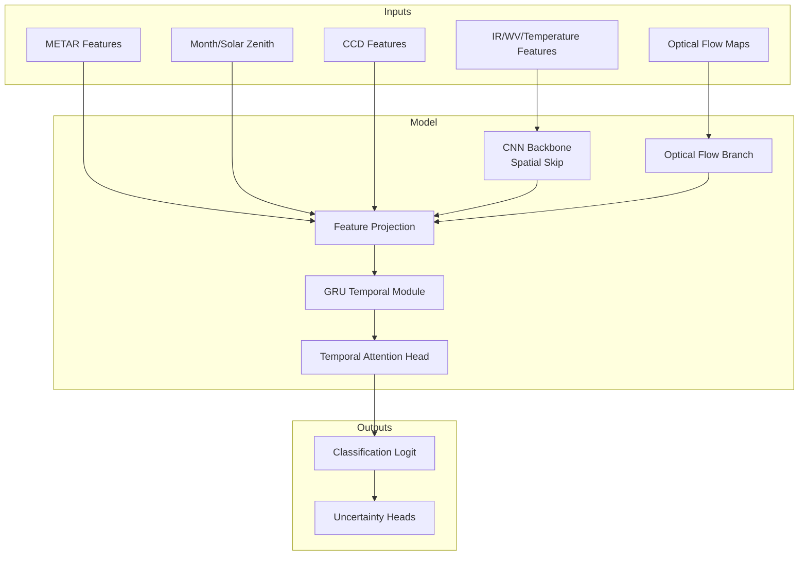
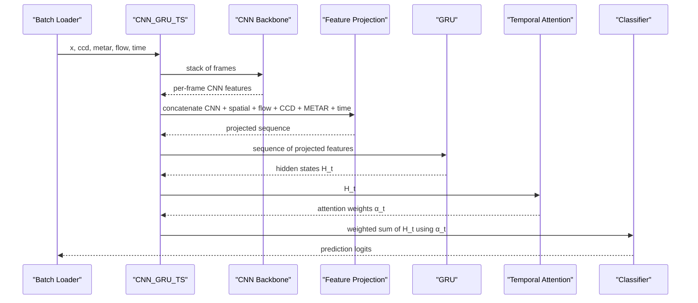
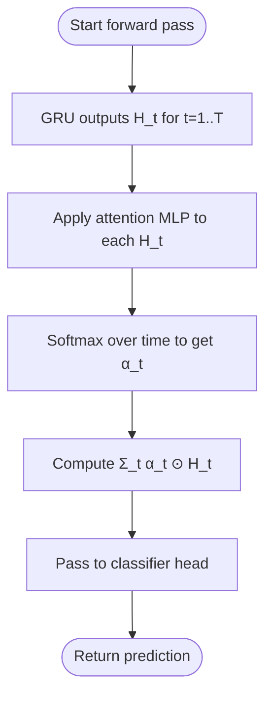
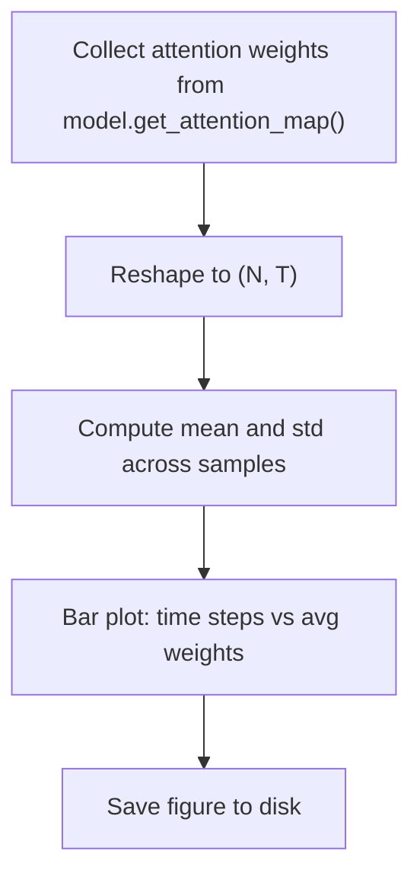
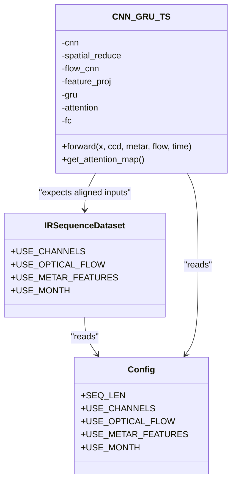

# Temporal Attention Mechanism Analysis

<cite>
**Referenced Files in This Document**
- [model_ts_final.py](file://model_ts_final.py)
- [evaluate_ts_final.py](file://evaluate_ts_final.py)
- [train_ts_final.py](file://train_ts_final.py)
- [dataset_ts_final.py](file://dataset_ts_final.py)
- [config_ts_final.py](file://config_ts_final.py)
- [utils_metrics_final.py](file://utils_metrics_final.py)
- [advanced_ml_discussion.md](file://reports/advanced_ml_discussion.md)
</cite>

## Table of Contents
1. [Introduction](#introduction)
2. [Project Structure](#project-structure)
3. [Core Components](#core-components)
4. [Architecture Overview](#architecture-overview)
5. [Detailed Component Analysis](#detailed-component-analysis)
6. [Dependency Analysis](#dependency-analysis)
7. [Performance Considerations](#performance-considerations)
8. [Troubleshooting Guide](#troubleshooting-guide)
9. [Conclusion](#conclusion)

## Introduction
This document analyzes the temporal attention mechanism embedded in the CNN-GRU architecture used for thunderstorm nowcasting. The temporal attention enables the model to dynamically prioritize relevant time steps within a four-frame satellite sequence, revealing how the system weighs past observations versus current conditions. We explain the attention computation, visualization techniques, and practical workflows for debugging attention patterns, including consistency checks across validation datasets and correlations with prediction accuracy.

## Project Structure
The temporal attention mechanism is implemented within the CNN-GRU model and surfaced during evaluation and training. Key components:
- Model definition with CNN backbone, spatial skip connections, optical flow branch, and GRU temporal module
- Temporal attention head that computes per-time-step weights
- Evaluation pipeline that collects attention maps and generates visualizations
- Training pipeline that validates attention-driven behavior during validation

**Diagram sources**
- [model_ts_final.py:68-269](file://model_ts_final.py#L68-L269)

**Section sources**
- [model_ts_final.py:68-269](file://model_ts_final.py#L68-L269)
- [evaluate_ts_final.py:285-324](file://evaluate_ts_final.py#L285-L324)
- [train_ts_final.py:285-317](file://train_ts_final.py#L285-L317)

## Core Components
- CNN-GRU model with dynamic channel adaptation and optional optical flow integration
- Feature projection mapping heterogeneous inputs to GRU input dimensionality
- GRU temporal module processing the sequence of projected features
- Temporal attention head producing softmax-normalized weights over time steps
- Evaluation utilities to collect attention maps and visualize temporal priority

Key implementation references:
- Model construction and attention head: [model_ts_final.py:75-177](file://model_ts_final.py#L75-L177)
- Forward pass computing attention weights: [model_ts_final.py:239-246](file://model_ts_final.py#L239-L246)
- Attention retrieval interface: [model_ts_final.py:270-272](file://model_ts_final.py#L270-L272)
- Attention visualization plotting: [evaluate_ts_final.py:146-184](file://evaluate_ts_final.py#L146-L184)

**Section sources**
- [model_ts_final.py:75-177](file://model_ts_final.py#L75-L177)
- [model_ts_final.py:239-246](file://model_ts_final.py#L239-L246)
- [model_ts_final.py:270-272](file://model_ts_final.py#L270-L272)
- [evaluate_ts_final.py:146-184](file://evaluate_ts_final.py#L146-L184)

## Architecture Overview
The temporal attention mechanism operates after the GRU processes the sequence. It computes per-time-step relevance scores, normalizes them via softmax, and uses them to form a weighted sum over the GRU hidden states. This produces a consolidated temporal representation that feeds the classification head.

**Diagram sources**
- [model_ts_final.py:202-268](file://model_ts_final.py#L202-L268)

**Section sources**
- [model_ts_final.py:202-268](file://model_ts_final.py#L202-L268)

## Detailed Component Analysis

### Temporal Attention Computation
The attention mechanism is a small feedforward network applied to each GRU hidden state, producing a scalar score that is softmax-normalized across time. The resulting weights are used to compute a time-weighted summary of the GRU states.

**Diagram sources**
- [model_ts_final.py:239-246](file://model_ts_final.py#L239-L246)

**Section sources**
- [model_ts_final.py:239-246](file://model_ts_final.py#L239-L246)

### Attention Weight Distribution Patterns
During evaluation, attention weights are collected and visualized as a bar chart summarizing average weights per time step. The visualization supports four-frame sequences commonly used in the project.

**Diagram sources**
- [evaluate_ts_final.py:146-184](file://evaluate_ts_final.py#L146-L184)
- [evaluate_ts_final.py:316-321](file://evaluate_ts_final.py#L316-L321)

**Section sources**
- [evaluate_ts_final.py:146-184](file://evaluate_ts_final.py#L146-L184)
- [evaluate_ts_final.py:316-321](file://evaluate_ts_final.py#L316-L321)

### Temporal Fusion: CNN Feature Extraction and GRU Modeling
The temporal fusion integrates:
- CNN feature extraction from each frame (global and spatial skip features)
- Optional optical flow features
- Static inputs (CCD, METAR, month-encoded time)
- Projection to a fixed-size sequence for the GRU
- GRU processing of the sequence
- Attention-weighted pooling for the final representation

**Diagram sources**
- [model_ts_final.py:75-177](file://model_ts_final.py#L75-L177)
- [dataset_ts_final.py:374-515](file://dataset_ts_final.py#L374-L515)
- [config_ts_final.py:27-124](file://config_ts_final.py#L27-L124)

**Section sources**
- [model_ts_final.py:202-268](file://model_ts_final.py#L202-L268)
- [dataset_ts_final.py:374-515](file://dataset_ts_final.py#L374-L515)
- [config_ts_final.py:27-124](file://config_ts_final.py#L27-L124)

### Visualization Techniques for Attention Matrices
The evaluation script provides a plotting utility that:
- Accepts attention weights (either 1D or 2D)
- Infers time step labels if the number of columns differs from the expected four
- Computes mean and standard deviation across samples
- Produces a labeled bar chart with error bars

Practical usage:
- Call the plotting function with attention weights collected during evaluation
- Save figures to a dedicated evaluation directory for each run

**Section sources**
- [evaluate_ts_final.py:146-184](file://evaluate_ts_final.py#L146-L184)

### Attention Consistency Across Validation Datasets
To assess consistency:
- Collect attention weights across multiple validation folds or runs
- Compare distributions (mean and variance) across folds
- Correlate attention patterns with downstream metrics (e.g., lead time, POD/FAR)

Workflow:
- Use the evaluation pipeline to gather attention maps during validation
- Aggregate across batches and samples
- Export statistics and visualize distributions

**Section sources**
- [evaluate_ts_final.py:285-324](file://evaluate_ts_final.py#L285-L324)

### Correlation Between Attention Patterns and Prediction Accuracy
Potential analyses:
- Stratify validation samples by severity or lead time and compare attention distributions
- Compute correlation between peak attention weight and prediction quality
- Investigate whether attention consistently focuses on informative frames (e.g., rapid cooling or wind acceleration)

Guidance:
- Use the attention maps collected during evaluation to compute per-event or per-sample statistics
- Combine with ground truth and prediction results to compute correlations

[No sources needed since this section provides general guidance]

### Debugging Workflows for Temporal Attention
Common debugging steps:
- Verify attention weights are non-negative and sum to approximately 1 across time
- Check for uniform attention (indicating poor temporal discrimination)
- Inspect attention drift over long sequences (signs of vanishing gradients)
- Compare attention distributions between correct detections and misses
- Validate that attention aligns with known meteorological triggers (e.g., cooling rate)

**Section sources**
- [model_ts_final.py:239-246](file://model_ts_final.py#L239-L246)
- [advanced_ml_discussion.md:213-225](file://reports/advanced_ml_discussion.md#L213-L225)

## Dependency Analysis
The temporal attention relies on:
- GRU hidden states produced by the temporal module
- Attention MLP mapping hidden states to scalar scores
- Softmax normalization ensuring proper probability-like weights
- Weighted pooling over time to produce a compact representation

**Diagram sources**
- [model_ts_final.py:239-246](file://model_ts_final.py#L239-L246)

**Section sources**
- [model_ts_final.py:239-246](file://model_ts_final.py#L239-L246)

## Performance Considerations
- Attention computation adds minimal overhead compared to GRU processing
- Softmax normalization is efficient and numerically stable
- Attention weights are stored only when needed for interpretability
- Visualization generation is lightweight and suitable for batch post-processing

[No sources needed since this section provides general guidance]

## Troubleshooting Guide
Common issues and resolutions:
- Attention weights not updating: ensure model.eval() is not called prematurely and that attention weights are captured after forward passes
- Unexpected uniform weights: verify GRU initialization and training stability; check for vanishing/exploding gradients
- Misaligned time labels: confirm the number of time steps matches expectations; the plotting utility adapts labels automatically if needed
- Over-reliance on recent frames: investigate temporal attention drift; consider adjusting GRU hyperparameters or adding temporal consistency terms

**Section sources**
- [model_ts_final.py:243-244](file://model_ts_final.py#L243-L244)
- [evaluate_ts_final.py:162-167](file://evaluate_ts_final.py#L162-L167)

## Conclusion
The temporal attention mechanism in the CNN-GRU model provides interpretable insights into how the system prioritizes time steps across the four-frame satellite sequence. By collecting and visualizing attention weights, analysts can validate that the model emphasizes relevant temporal cues (e.g., rapid cooling or wind acceleration) rather than static conditions. The evaluation pipeline facilitates consistent analysis across validation datasets, enabling correlation studies with prediction accuracy and robust debugging workflows.