# Evaluation & Analysis

<cite>
**Referenced Files in This Document**
- [evaluate_ts_final.py](file://evaluate_ts_final.py)
- [utils_metrics_final.py](file://utils_metrics_final.py)
- [utils_calibration.py](file://utils_calibration.py)
- [explain_shap.py](file://explain_shap.py)
- [evaluate_ensemble.py](file://evaluate_ensemble.py)
- [model_ts_final.py](file://model_ts_final.py)
- [config_ts_final.py](file://config_ts_final.py)
- [utils_preprocessing.py](file://utils_preprocessing.py)
- [reports/validation-cv-bootstrap.md](file://reports/validation-cv-bootstrap.md)
- [reports/failure_analysis.md](file://reports/failure_analysis.md)
- [extras/analyze_predictions.py](file://extras/analyze_predictions.py)
</cite>

## Table of Contents
1. [Introduction](#introduction)
2. [Project Structure](#project-structure)
3. [Core Components](#core-components)
4. [Architecture Overview](#architecture-overview)
5. [Detailed Component Analysis](#detailed-component-analysis)
6. [Dependency Analysis](#dependency-analysis)
7. [Performance Considerations](#performance-considerations)
8. [Troubleshooting Guide](#troubleshooting-guide)
9. [Conclusion](#conclusion)
10. [Appendices](#appendices)

## Introduction
This document provides a comprehensive evaluation and analysis guide for the Nagpur Thunderstorm Nowcasting pipeline. It covers the evaluation pipeline from prediction generation through uncertainty quantification, threshold optimization, and diagnostic tools. It documents the metrics system (Critical Success Index, Equitable Threat Score, Probability of Detection, False Alarm Rate), calibration procedures (Platt scaling and temperature scaling), persistence filtering and temporal smoothing, SHAP-based interpretability, failure analysis, bias detection, and benchmarking against baseline models. It also includes guidance on statistical significance testing, confidence interval estimation, and cross-validation strategies, along with practical troubleshooting and continuous improvement workflows.

## Project Structure
The evaluation suite is organized around modular scripts and utilities:
- Evaluation entry points: final evaluation and ensemble evaluation
- Metrics and temporal post-processing utilities
- Calibration and reliability diagnostics
- SHAP-based interpretability
- Configuration and preprocessing helpers
- Reports and quick analysis utilities

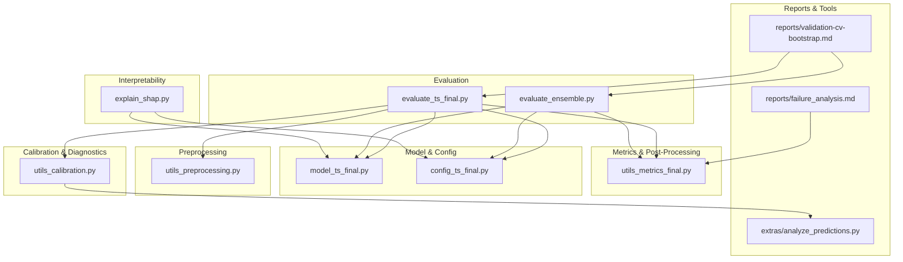

**Diagram sources**
- [evaluate_ts_final.py](file://evaluate_ts_final.py)
- [evaluate_ensemble.py](file://evaluate_ensemble.py)
- [utils_metrics_final.py](file://utils_metrics_final.py)
- [utils_calibration.py](file://utils_calibration.py)
- [explain_shap.py](file://explain_shap.py)
- [model_ts_final.py](file://model_ts_final.py)
- [config_ts_final.py](file://config_ts_final.py)
- [utils_preprocessing.py](file://utils_preprocessing.py)
- [reports/validation-cv-bootstrap.md](file://reports/validation-cv-bootstrap.md)
- [reports/failure_analysis.md](file://reports/failure_analysis.md)
- [extras/analyze_predictions.py](file://extras/analyze_predictions.py)

**Section sources**
- [evaluate_ts_final.py](file://evaluate_ts_final.py)
- [evaluate_ensemble.py](file://evaluate_ensemble.py)
- [utils_metrics_final.py](file://utils_metrics_final.py)
- [utils_calibration.py](file://utils_calibration.py)
- [explain_shap.py](file://explain_shap.py)
- [model_ts_final.py](file://model_ts_final.py)
- [config_ts_final.py](file://config_ts_final.py)
- [utils_preprocessing.py](file://utils_preprocessing.py)
- [reports/validation-cv-bootstrap.md](file://reports/validation-cv-bootstrap.md)
- [reports/failure_analysis.md](file://reports/failure_analysis.md)
- [extras/analyze_predictions.py](file://extras/analyze_predictions.py)

## Core Components
- Evaluation pipeline: inference, threshold optimization, persistence filtering, temporal smoothing, and metrics computation
- Metrics system: frame-level and event-level scores with lead-time-aware weighting
- Calibration: Platt scaling and temperature scaling with reliability diagrams
- Interpretability: SHAP Integrated Gradients attribution
- Failure analysis: automated markdown reports and severity breakdowns
- Benchmarking: ensemble averaging (best + SWA) and cross-validation strategies

**Section sources**
- [evaluate_ts_final.py](file://evaluate_ts_final.py)
- [utils_metrics_final.py](file://utils_metrics_final.py)
- [utils_calibration.py](file://utils_calibration.py)
- [explain_shap.py](file://explain_shap.py)
- [evaluate_ensemble.py](file://evaluate_ensemble.py)
- [reports/validation-cv-bootstrap.md](file://reports/validation-cv-bootstrap.md)

## Architecture Overview
The evaluation pipeline integrates model inference, temporal post-processing, threshold optimization, and diagnostic reporting.

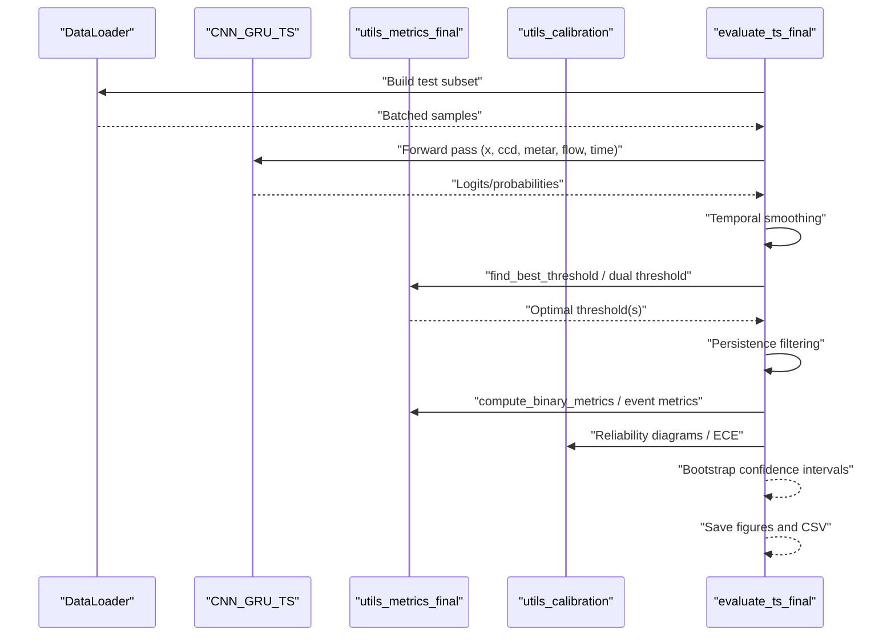

**Diagram sources**
- [evaluate_ts_final.py](file://evaluate_ts_final.py)
- [utils_metrics_final.py](file://utils_metrics_final.py)
- [utils_calibration.py](file://utils_calibration.py)
- [model_ts_final.py](file://model_ts_final.py)

## Detailed Component Analysis

### Evaluation Pipeline: Prediction Generation, Threshold Optimization, Persistence Filtering, Temporal Smoothing
- Inference: The evaluation scripts run model inference over the test set, collecting true labels, probabilities, severity labels, timestamps, and optional attention maps.
- Threshold optimization: Grid search over a range of thresholds on validation probabilities, optionally with Schmitt trigger hysteresis and severe fast-track thresholds.
- Persistence filtering: Removes short-lived false positives based on minimum event duration and optional severe-event bypass.
- Temporal smoothing: Exponential moving average or rolling mean to reduce temporal noise.
- Metrics: Frame-level and event-level scores, lead-time statistics, and weighted event metrics with lead-time bonuses.

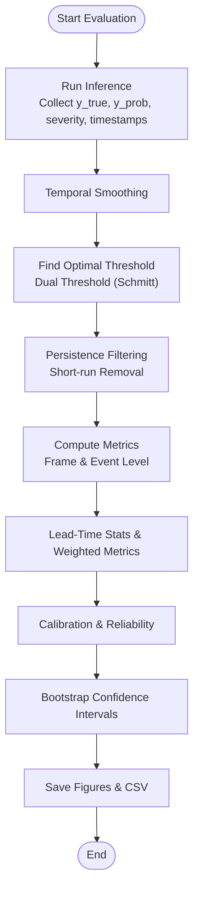

**Diagram sources**
- [evaluate_ts_final.py](file://evaluate_ts_final.py)
- [utils_metrics_final.py](file://utils_metrics_final.py)
- [utils_calibration.py](file://utils_calibration.py)

**Section sources**
- [evaluate_ts_final.py](file://evaluate_ts_final.py)
- [utils_metrics_final.py](file://utils_metrics_final.py)

### Metrics System: CSI, ETS, POD, FAR, and Weighted Event Metrics
- Frame-level metrics: POD, FAR, CSI, ETS, SEDI, F1, F2 computed from thresholded predictions.
- Event-level metrics: Overlap-based counts with minimum event length filtering and lead-time constraints.
- Weighted metrics: Severity-weighted POD/FAR/CSI and lead-time-aware CSI with bonuses for early detection and safe POD-FAR balance.

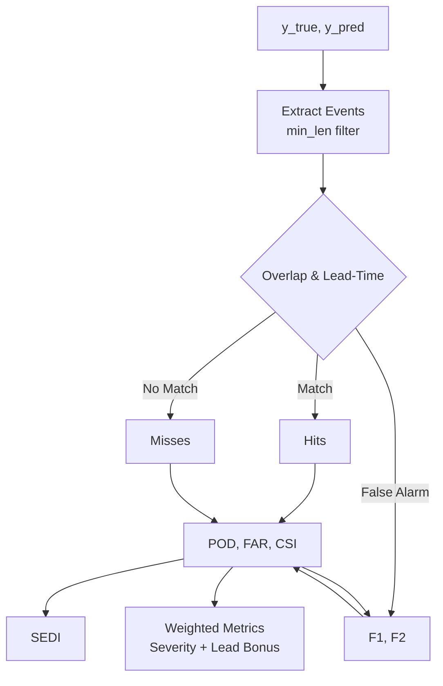

**Diagram sources**
- [utils_metrics_final.py](file://utils_metrics_final.py)

**Section sources**
- [utils_metrics_final.py](file://utils_metrics_final.py)

### Calibration Procedures: Platt Scaling and Temperature Scaling
- Platt scaling: Logistic regression on validation logits to recalibrate probabilities.
- Temperature scaling: Optimize a scalar temperature parameter to minimize binary cross-entropy on validation logits; produce reliability diagrams and ECE.
- Reliability diagrams: Side-by-side comparison of uncalibrated vs. calibrated performance.

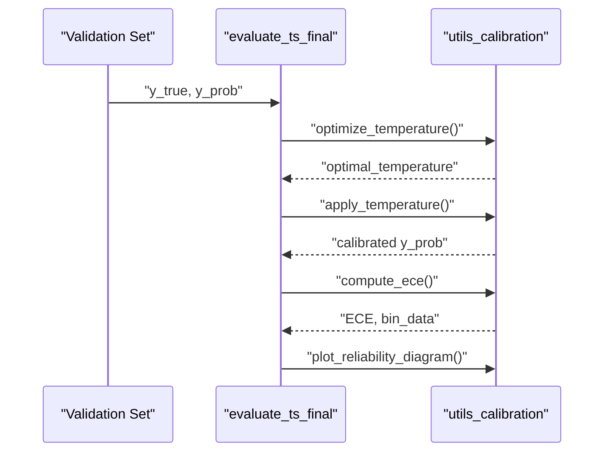

**Diagram sources**
- [utils_calibration.py](file://utils_calibration.py)
- [evaluate_ts_final.py](file://evaluate_ts_final.py)

**Section sources**
- [utils_calibration.py](file://utils_calibration.py)
- [evaluate_ts_final.py](file://evaluate_ts_final.py)

### Uncertainty Quantification and Analysis
- Epistemic uncertainty: Optional Monte Carlo Dropout sampling to estimate predictive uncertainty.
- Aleatoric uncertainty: Optional heteroscedastic modeling via log-variance head.
- Intensity regression: Optional continuous severity score head for intensity-aware modeling.
- Uncertainty-aware persistence: Severe fast-track bypass for high-probability severe events.

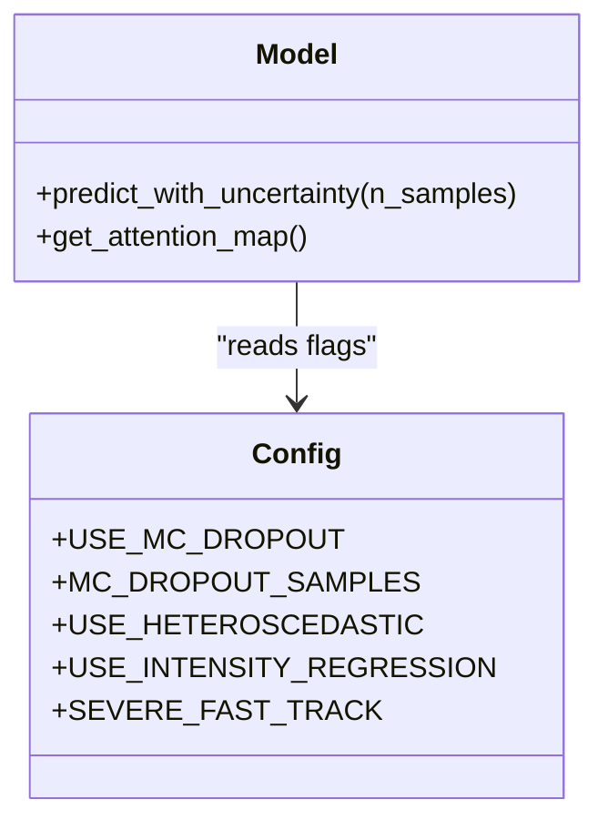

**Diagram sources**
- [model_ts_final.py](file://model_ts_final.py)
- [config_ts_final.py](file://config_ts_final.py)
- [evaluate_ts_final.py](file://evaluate_ts_final.py)

**Section sources**
- [model_ts_final.py](file://model_ts_final.py)
- [config_ts_final.py](file://config_ts_final.py)
- [evaluate_ts_final.py](file://evaluate_ts_final.py)

### Persistence Filtering and Temporal Smoothing
- Persistence filtering removes short positive runs below a minimum length; severe fast-track allows runs with high probability to bypass length requirement.
- Temporal smoothing reduces noise via exponential moving average or rolling mean.

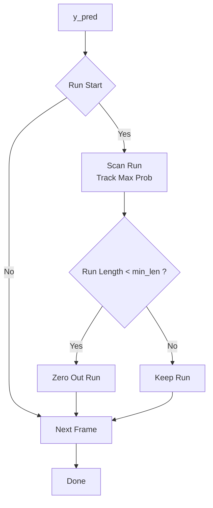

**Diagram sources**
- [utils_metrics_final.py](file://utils_metrics_final.py)

**Section sources**
- [utils_metrics_final.py](file://utils_metrics_final.py)

### SHAP Explanation Framework
- Integrated Gradients attribution across model inputs (images, CCD features, optical flow, METAR, time features).
- Aggregates absolute attributions to derive relative importance per input modality.

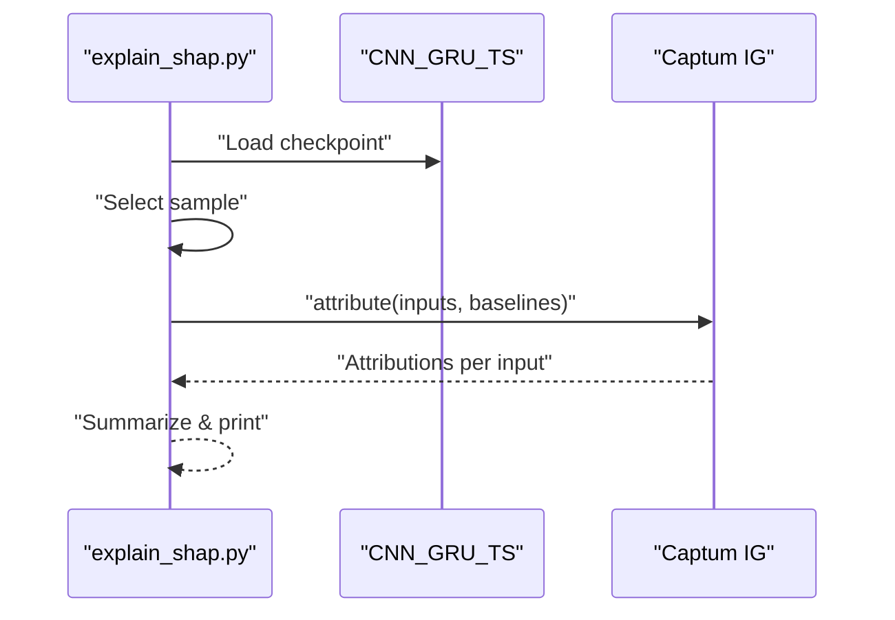

**Diagram sources**
- [explain_shap.py](file://explain_shap.py)
- [model_ts_final.py](file://model_ts_final.py)

**Section sources**
- [explain_shap.py](file://explain_shap.py)
- [model_ts_final.py](file://model_ts_final.py)

### Comprehensive Failure Analysis and Bias Detection
- Automated markdown reports categorizing missed events, late detections, and false alarms with severity context.
- Severity-weighted analysis and lead-time breakdowns to identify systematic biases.
- Quick CSV analysis utilities for calibration checks and distribution summaries.

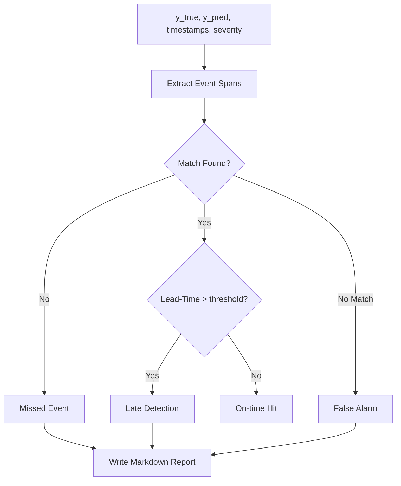

**Diagram sources**
- [utils_calibration.py](file://utils_calibration.py)
- [reports/failure_analysis.md](file://reports/failure_analysis.md)

**Section sources**
- [utils_calibration.py](file://utils_calibration.py)
- [reports/failure_analysis.md](file://reports/failure_analysis.md)
- [extras/analyze_predictions.py](file://extras/analyze_predictions.py)

### Benchmarking Against Baseline Models and Ensemble Strategies
- Ensemble evaluation averages best epoch and SWA models with weighted blending and Platt scaling.
- Individual model comparisons with ROC-AUC and weighted event metrics to assess gains from averaging.

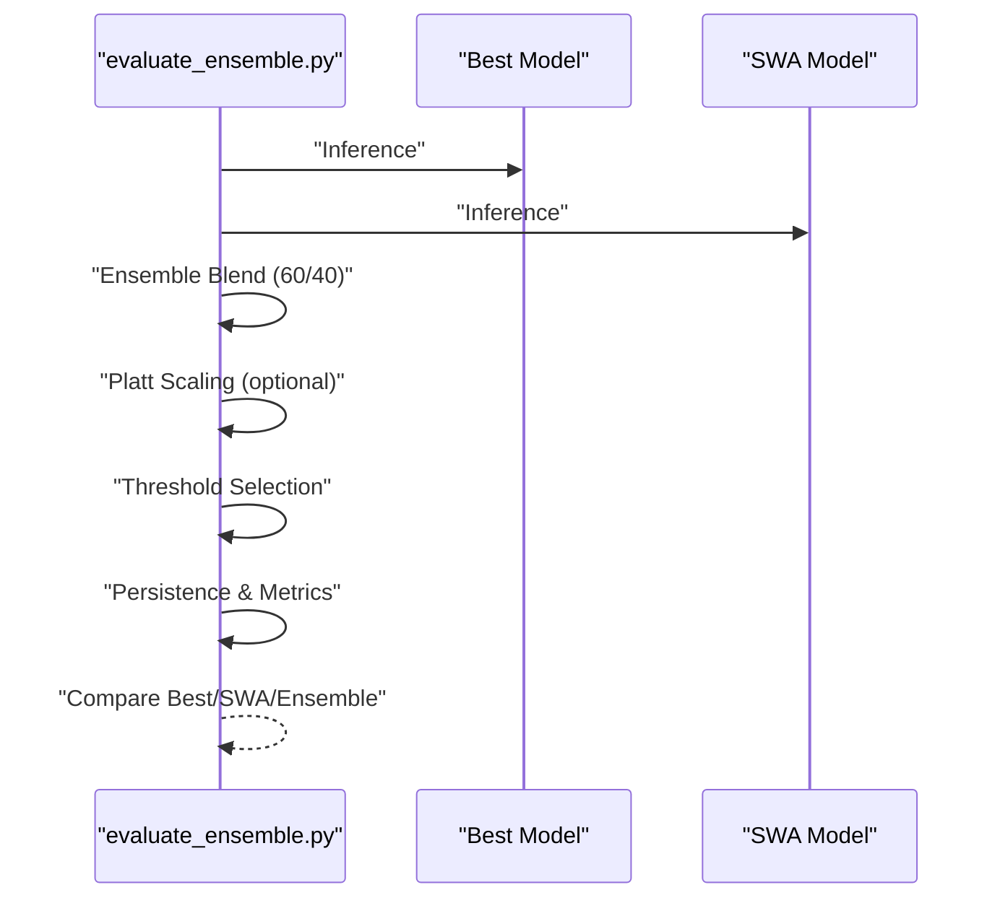

**Diagram sources**
- [evaluate_ensemble.py](file://evaluate_ensemble.py)

**Section sources**
- [evaluate_ensemble.py](file://evaluate_ensemble.py)

### Statistical Significance Testing, Confidence Interval Estimation, and Cross-Validation
- Walk-forward temporal cross-validation with fold-specific splits and dynamic date ranges.
- Calendar-day block bootstrap to estimate 95% confidence intervals for all metrics on the test set.
- Threshold metric selection using lead-time-weighted CSI with safe POD-FAR balance.

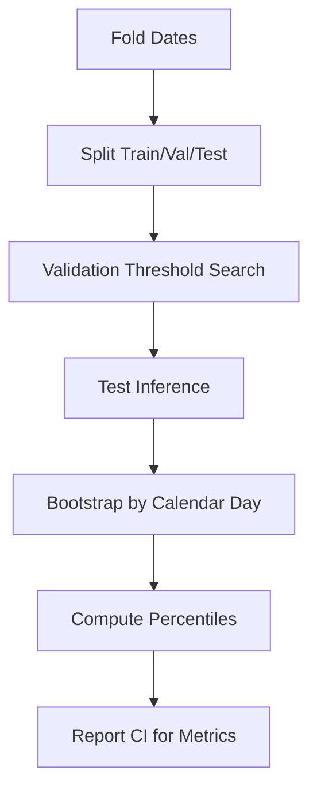

**Diagram sources**
- [reports/validation-cv-bootstrap.md](file://reports/validation-cv-bootstrap.md)
- [utils_metrics_final.py](file://utils_metrics_final.py)
- [evaluate_ts_final.py](file://evaluate_ts_final.py)

**Section sources**
- [reports/validation-cv-bootstrap.md](file://reports/validation-cv-bootstrap.md)
- [utils_metrics_final.py](file://utils_metrics_final.py)
- [evaluate_ts_final.py](file://evaluate_ts_final.py)

## Dependency Analysis
Key dependencies and relationships:
- Evaluation scripts depend on metrics utilities for threshold optimization, persistence filtering, and event metrics.
- Calibration utilities depend on scikit-learn and PyTorch for optimization and reliability diagnostics.
- SHAP depends on Captum and model forward wrappers.
- Configuration centralizes flags for uncertainty, calibration, and post-processing.

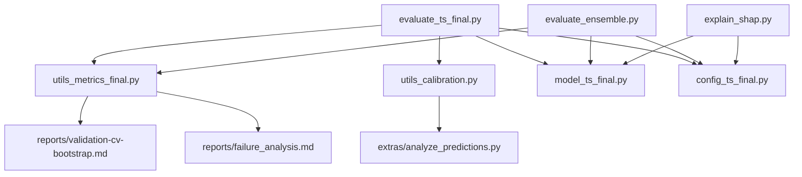

**Diagram sources**
- [evaluate_ts_final.py](file://evaluate_ts_final.py)
- [evaluate_ensemble.py](file://evaluate_ensemble.py)
- [utils_metrics_final.py](file://utils_metrics_final.py)
- [utils_calibration.py](file://utils_calibration.py)
- [explain_shap.py](file://explain_shap.py)
- [model_ts_final.py](file://model_ts_final.py)
- [config_ts_final.py](file://config_ts_final.py)
- [extras/analyze_predictions.py](file://extras/analyze_predictions.py)
- [reports/validation-cv-bootstrap.md](file://reports/validation-cv-bootstrap.md)
- [reports/failure_analysis.md](file://reports/failure_analysis.md)

**Section sources**
- [evaluate_ts_final.py](file://evaluate_ts_final.py)
- [evaluate_ensemble.py](file://evaluate_ensemble.py)
- [utils_metrics_final.py](file://utils_metrics_final.py)
- [utils_calibration.py](file://utils_calibration.py)
- [explain_shap.py](file://explain_shap.py)
- [model_ts_final.py](file://model_ts_final.py)
- [config_ts_final.py](file://config_ts_final.py)
- [extras/analyze_predictions.py](file://extras/analyze_predictions.py)
- [reports/validation-cv-bootstrap.md](file://reports/validation-cv-bootstrap.md)
- [reports/failure_analysis.md](file://reports/failure_analysis.md)

## Performance Considerations
- Temporal smoothing: Exponential moving average is recommended for nowcasting to suppress isolated spikes.
- Persistence filtering: Increasing minimum event length reduces false alarms but risks missing short events; tune based on operational constraints.
- Calibration: Platt scaling is fast; temperature scaling improves reliability at the cost of an optimization step.
- Ensemble averaging: Combines best and SWA models to reduce false alarm rates while preserving detection.
- Uncertainty: MC Dropout and heteroscedastic modeling add computational overhead; enable selectively for debugging or production monitoring.

[No sources needed since this section provides general guidance]

## Troubleshooting Guide
Common issues and remedies:
- Threshold leakage: Ensure threshold selection is performed on validation only and not on test.
- Data cadence mismatch: Use actual inter-sample cadence to compute lead-time statistics.
- Calibration artifacts: Verify reliability diagrams and ECE; adjust temperature scaling bounds.
- Short false alarms: Increase persistence minimum length or enable severe fast-track with higher thresholds.
- Missing events: Review failure analysis reports and severity breakdowns; consider seasonal adjustments.
- Confidence intervals: Confirm bootstrap block sampling by calendar day and sufficient number of iterations.

**Section sources**
- [evaluate_ts_final.py](file://evaluate_ts_final.py)
- [utils_metrics_final.py](file://utils_metrics_final.py)
- [utils_calibration.py](file://utils_calibration.py)
- [reports/failure_analysis.md](file://reports/failure_analysis.md)
- [extras/analyze_predictions.py](file://extras/analyze_predictions.py)

## Conclusion
The evaluation and analysis framework provides a robust, modular pipeline for assessing thunderstorm nowcasting performance. It combines careful threshold optimization, temporal smoothing, persistence filtering, and weighted event metrics with strong diagnostic tools including calibration, reliability analysis, and SHAP interpretability. The walk-forward cross-validation and bootstrap confidence intervals offer statistically sound benchmarking against baseline models, enabling continuous improvement and operational readiness.

[No sources needed since this section summarizes without analyzing specific files]

## Appendices

### Appendix A: Metrics Definitions and Formulas
- POD: Hits / (Hits + Misses)
- FAR: False Alarms / (Hits + False Alarms)
- CSI: Hits / (Hits + False Alarms + Misses)
- ETS: (Hits - H_random) / (Hits + False Alarms + Misses - H_random)
- SEDI: Symmetric Extremal Dependence Index for rare events
- F1/F2: Harmonic means emphasizing recall with different penalties

**Section sources**
- [utils_metrics_final.py](file://utils_metrics_final.py)

### Appendix B: Configuration Flags for Evaluation
- Threshold optimization: MIN_THRESHOLD, THRESHOLD_METRIC, USE_SCHMITT_TRIGGER, SEVERE_FAST_TRACK
- Persistence: PERSISTENCE_MIN_LEN, MAX_LEAD_MINUTES
- Smoothing: SMOOTH_WINDOW, SMOOTH_METHOD
- Calibration: USE_PLATT_SCALING, temperature scaling parameters
- Uncertainty: USE_MC_DROPOUT, USE_HETEROSCEDASTIC, USE_INTENSITY_REGRESSION

**Section sources**
- [config_ts_final.py](file://config_ts_final.py)