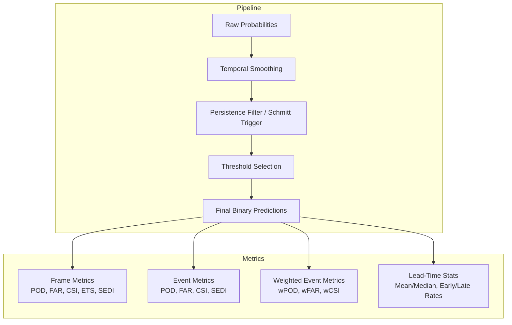
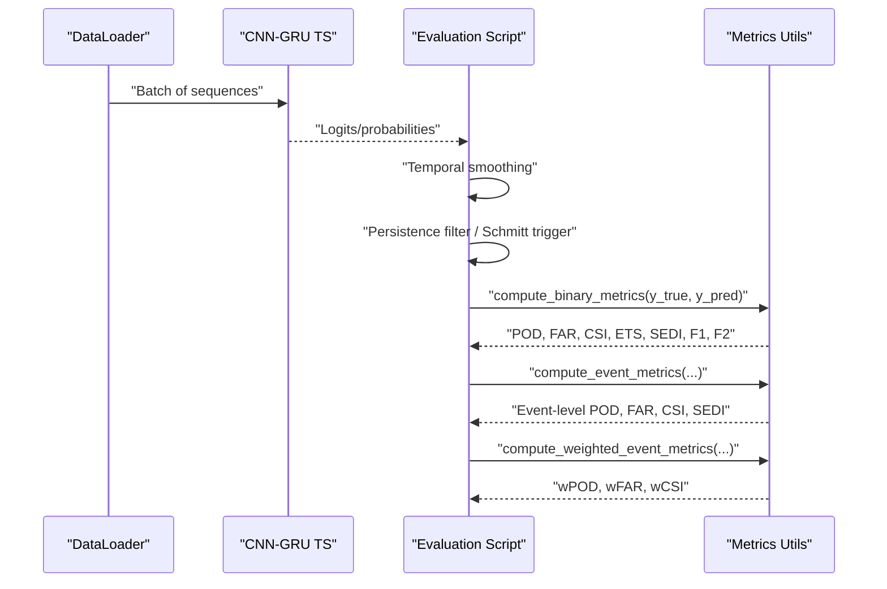
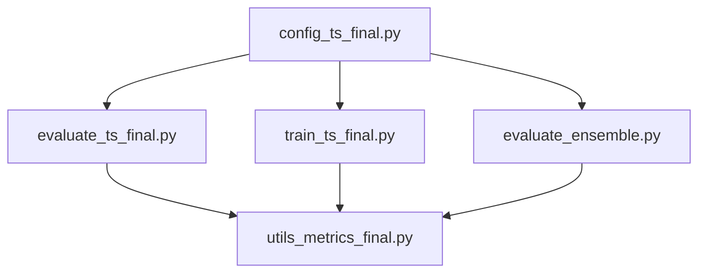

# Basic Performance Metrics

<cite>
**Referenced Files in This Document**
- [utils_metrics_final.py](file://utils_metrics_final.py)
- [evaluate_ts_final.py](file://evaluate_ts_final.py)
- [train_ts_final.py](file://train_ts_final.py)
- [evaluate_ensemble.py](file://evaluate_ensemble.py)
- [config_ts_final.py](file://config_ts_final.py)
- [advanced_ml_discussion.md](file://reports/advanced_ml_discussion.md)
</cite>

## Table of Contents
1. [Introduction](#introduction)
2. [Project Structure](#project-structure)
3. [Core Components](#core-components)
4. [Architecture Overview](#architecture-overview)
5. [Detailed Component Analysis](#detailed-component-analysis)
6. [Dependency Analysis](#dependency-analysis)
7. [Performance Considerations](#performance-considerations)
8. [Troubleshooting Guide](#troubleshooting-guide)
9. [Conclusion](#conclusion)
10. [Appendices](#appendices)

## Introduction
This document explains the fundamental weather forecasting metrics used in the Nagpur thunderstorm nowcasting pipeline: Probability of Detection (POD), False Alarm Rate (FAR), Critical Success Index (CSI), Equitable Threat Score (ETS), and SEDI (Symmetric Extremal Dependence Index). It provides mathematical formulations, interpretation guidelines, practical applications, and how these metrics are computed and used in the codebase. It also demonstrates how these metrics complement each other in evaluating nowcasting performance, especially for thunderstorm prediction scenarios.

## Project Structure
The repository implements a complete nowcasting pipeline with:
- A CNN-GRU model for spatiotemporal forecasting
- Post-processing steps (temporal smoothing, persistence filtering, Schmitt trigger)
- Comprehensive evaluation scripts that compute frame-level and event-level metrics
- Configuration controlling thresholds, metrics for model selection, and post-processing parameters

**Diagram sources**
- [evaluate_ts_final.py:607-641](file://evaluate_ts_final.py#L607-L641)
- [train_ts_final.py:518-558](file://train_ts_final.py#L518-L558)
- [utils_metrics_final.py:120-189](file://utils_metrics_final.py#L120-L189)

**Section sources**
- [evaluate_ts_final.py:344-800](file://evaluate_ts_final.py#L344-L800)
- [train_ts_final.py:142-757](file://train_ts_final.py#L142-L757)

## Core Components
- Frame-level metrics: POD, FAR, CSI, ETS, SEDI, F1, F2
- Event-level metrics: POD, FAR, CSI, SEDI
- Weighted event metrics: wPOD, wFAR, wCSI (with lead-time bonuses)
- Threshold selection: grid search optimizing chosen metric (e.g., lt-wCSI_evt)
- Post-processing: temporal smoothing, persistence filtering, Schmitt trigger

These components are implemented in the metrics utility module and consumed by evaluation and training scripts.

**Section sources**
- [utils_metrics_final.py:120-189](file://utils_metrics_final.py#L120-L189)
- [utils_metrics_final.py:322-392](file://utils_metrics_final.py#L322-L392)
- [utils_metrics_final.py:479-518](file://utils_metrics_final.py#L479-L518)
- [evaluate_ts_final.py:529-609](file://evaluate_ts_final.py#L529-L609)
- [train_ts_final.py:518-558](file://train_ts_final.py#L518-L558)

## Architecture Overview
The evaluation pipeline computes metrics after applying smoothing and persistence filtering to stabilize predictions and reduce false alarms. Threshold selection is performed on the validation set using a configurable metric, then applied to the test set to report frame-level and event-level scores.

**Diagram sources**
- [evaluate_ts_final.py:578-641](file://evaluate_ts_final.py#L578-L641)
- [utils_metrics_final.py:120-189](file://utils_metrics_final.py#L120-L189)
- [utils_metrics_final.py:338-392](file://utils_metrics_final.py#L338-L392)
- [utils_metrics_final.py:575-650](file://utils_metrics_final.py#L575-L650)

## Detailed Component Analysis

### Mathematical Formulations and Interpretation
- POD (Probability of Detection / Hit Rate / Sensitivity)
  - Definition: TP / (TP + FN)
  - Interpretation: Fraction of observed events correctly predicted
  - Strengths: Good for capturing misses; sensitive to class imbalance
  - Limitations: Can be inflated by high persistence thresholds
- FAR (False Alarm Rate)
  - Definition: FP / (TP + FP)
  - Interpretation: Fraction of predicted events that were false alarms
  - Strengths: Penalizes false alarms; useful for operational thresholds
  - Limitations: Does not account for misses
- CSI (Critical Success Index)
  - Definition: TP / (TP + FP + FN)
  - Interpretation: Joint hit rate; balances hits and false alarms
  - Strengths: Operates on the joint error space; commonly used in meteorology
  - Limitations: Sensitive to base rate; can be low in rare events
- ETS (Equitable Threat Score)
  - Definition: (TP - Hrand) / (TP + FP + FN - Hrand)
  - Interpretation: CSI corrected for hits expected by random chance
  - Strengths: Better for rare events; accounts for random hits
  - Limitations: Still affected by base rate; requires careful thresholding
- SEDI (Symmetric Extremal Dependence Index)
  - Definition: Uses logarithmic transformation of POD and POFD (probability of false detection)
  - Interpretation: Base-rate independent measure for rare events
  - Strengths: Robust for rare events; independent of base rate
  - Limitations: Requires clipping of extreme values to avoid log(0)

Practical usage:
- Use POD to assess detection capability and identify missed events
- Use FAR to assess operational cost of false alarms
- Use CSI to balance hits and false alarms
- Use ETS to select thresholds fairly across base rates
- Use SEDI to evaluate rare-event skill independently of base rate

**Section sources**
- [utils_metrics_final.py:101-117](file://utils_metrics_final.py#L101-L117)
- [utils_metrics_final.py:140-152](file://utils_metrics_final.py#L140-L152)

### Implementation Details and Code Paths
- Frame-level metrics computation:
  - [compute_binary_metrics:155-189](file://utils_metrics_final.py#L155-L189)
  - [compute_metrics:120-152](file://utils_metrics_final.py#L120-L152)
- Event-level metrics:
  - [compute_event_metrics:338-392](file://utils_metrics_final.py#L338-L392)
- Weighted event metrics:
  - [compute_weighted_event_metrics:575-650](file://utils_metrics_final.py#L575-L650)
- SEDI computation:
  - [compute_sedi:101-117](file://utils_metrics_final.py#L101-L117)
- Threshold selection:
  - [find_best_threshold:192-240](file://utils_metrics_final.py#L192-L240)
  - [find_best_dual_threshold:263-314](file://utils_metrics_final.py#L263-L314)

**Section sources**
- [utils_metrics_final.py:101-189](file://utils_metrics_final.py#L101-L189)
- [utils_metrics_final.py:338-392](file://utils_metrics_final.py#L338-L392)
- [utils_metrics_final.py:575-650](file://utils_metrics_final.py#L575-L650)
- [utils_metrics_final.py:192-314](file://utils_metrics_final.py#L192-L314)

### Practical Examples and Thunderstorm Prediction Scenarios
Typical confusion matrix counts for thunderstorm nowcasting:
- TP = 120, FP = 40, FN = 30, TN = 100
- Derived metrics:
  - POD = TP / (TP + FN) = 120 / (120 + 30)
  - FAR = FP / (TP + FP) = 40 / (120 + 40)
  - CSI = TP / (TP + FP + FN) = 120 / (120 + 40 + 30)
  - Hrand = (TP + FP) * (TP + FN) / N
  - ETS = (TP - Hrand) / (TP + FP + FN - Hrand)
  - SEDI computed via logarithmic transformation of POD and POFD

These examples illustrate how metrics help assess model skill in thunderstorm prediction:
- High POD indicates good detection of severe events
- Low FAR indicates fewer false alarms
- CSI reflects the balance between hits and false alarms
- ETS adjusts for random hits
- SEDI evaluates rare-event skill independent of base rate

**Section sources**
- [utils_metrics_final.py:140-152](file://utils_metrics_final.py#L140-L152)
- [utils_metrics_final.py:101-117](file://utils_metrics_final.py#L101-L117)

### How Metrics Complement Each Other
- POD and FAR jointly inform the trade-off between detection and false alarms
- CSI provides a balanced measure for operational use
- ETS enables fair threshold selection across datasets with varying base rates
- SEDI offers a base-rate independent assessment for rare events
- Event-level and weighted event metrics provide insights into lead times and severity weighting

**Section sources**
- [evaluate_ts_final.py:628-713](file://evaluate_ts_final.py#L628-L713)
- [train_ts_final.py:544-558](file://train_ts_final.py#L544-L558)

## Dependency Analysis
The evaluation and training scripts depend on the metrics utility module for computing scores. Threshold selection and post-processing are configured centrally.

**Diagram sources**
- [evaluate_ts_final.py:29-34](file://evaluate_ts_final.py#L29-L34)
- [train_ts_final.py:33-41](file://train_ts_final.py#L33-L41)
- [evaluate_ensemble.py:27-40](file://evaluate_ensemble.py#L27-L40)
- [config_ts_final.py:92](file://config_ts_final.py#L92)

**Section sources**
- [evaluate_ts_final.py:29-34](file://evaluate_ts_final.py#L29-L34)
- [train_ts_final.py:33-41](file://train_ts_final.py#L33-L41)
- [evaluate_ensemble.py:27-40](file://evaluate_ensemble.py#L27-L40)
- [config_ts_final.py:92](file://config_ts_final.py#L92)

## Performance Considerations
- Temporal smoothing reduces prediction chattering and stabilizes thresholds
- Persistence filtering reduces short-lived false alarms
- Schmitt trigger reduces temporal hysteresis without pure reliance on persistence
- Platt scaling improves probability calibration for reliable thresholds
- Weighted metrics incorporate severity and lead-time bonuses for operational scoring

**Section sources**
- [evaluate_ts_final.py:508-609](file://evaluate_ts_final.py#L508-L609)
- [train_ts_final.py:518-558](file://train_ts_final.py#L518-L558)
- [advanced_ml_discussion.md:48-63](file://reports/advanced_ml_discussion.md#L48-L63)

## Troubleshooting Guide
Common issues and remedies:
- Zero denominators: EPSILON prevents division by zero in metrics
- Base-rate bias: Use ETS or SEDI for rare events; adjust thresholds accordingly
- Overconfident predictions: Apply Platt scaling; consider Monte Carlo Dropout for uncertainty
- Short false alarms: Increase persistence minimum length or enable severe fast-track threshold
- Threshold drift: Re-compute thresholds on validation sets; use dual-threshold Schmitt trigger

**Section sources**
- [utils_metrics_final.py:17](file://utils_metrics_final.py#L17)
- [evaluate_ts_final.py:508-574](file://evaluate_ts_final.py#L508-L574)
- [train_ts_final.py:518-558](file://train_ts_final.py#L518-L558)
- [advanced_ml_discussion.md:48-63](file://reports/advanced_ml_discussion.md#L48-L63)

## Conclusion
The Nagpur nowcasting pipeline integrates robust metrics—frame-level POD/FAR/CSI/ETS/SEDI and event-level/wweighted variants—to comprehensively evaluate model performance. These metrics complement each other: POD captures detection, FAR controls false alarms, CSI balances both, ETS corrects for random hits, and SEDI evaluates rare-event skill independently. Together, they guide threshold selection, post-processing, and operational scoring for thunderstorm nowcasting.

## Appendices

### Appendix A: Metric Definitions and Usage Notes
- POD: Use to assess detection capability; watch for inflation with high thresholds
- FAR: Use to control false alarms; essential for operational thresholds
- CSI: Use for balanced operational scoring; sensitive to base rate
- ETS: Use for fair threshold selection across datasets; corrects for random hits
- SEDI: Use for rare-event evaluation; base-rate independent

**Section sources**
- [utils_metrics_final.py:140-152](file://utils_metrics_final.py#L140-L152)
- [utils_metrics_final.py:101-117](file://utils_metrics_final.py#L101-L117)

### Appendix B: Configuration and Threshold Selection
- THRESHOLD_METRIC controls which metric is optimized during validation threshold search
- MIN_THRESHOLD sets the lower bound for threshold search
- PERSISTENCE_MIN_LEN controls minimum event duration to suppress short false alarms
- SEVERE_FAST_TRACK enables bypassing persistence for high-probability severe events

**Section sources**
- [config_ts_final.py:92](file://config_ts_final.py#L92)
- [config_ts_final.py:93](file://config_ts_final.py#L93)
- [config_ts_final.py:135](file://config_ts_final.py#L135)