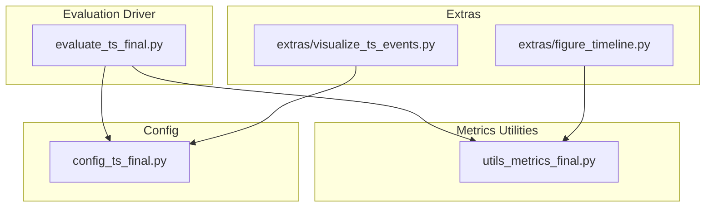
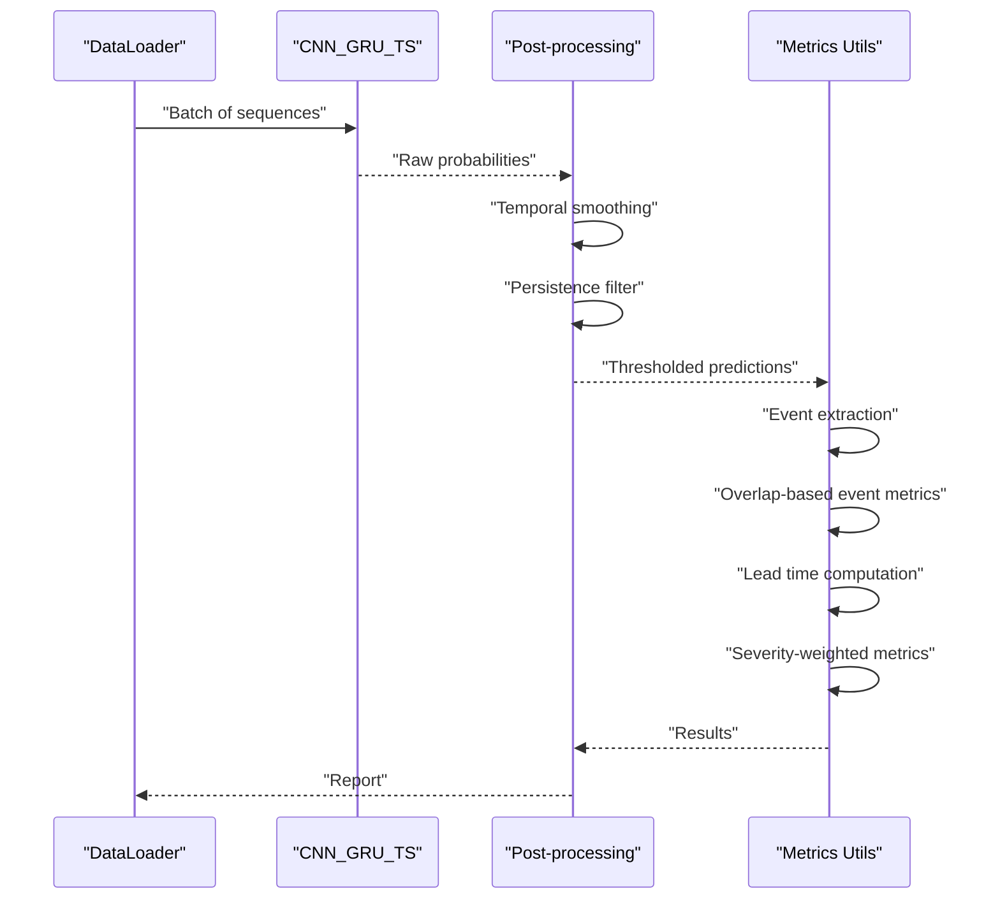
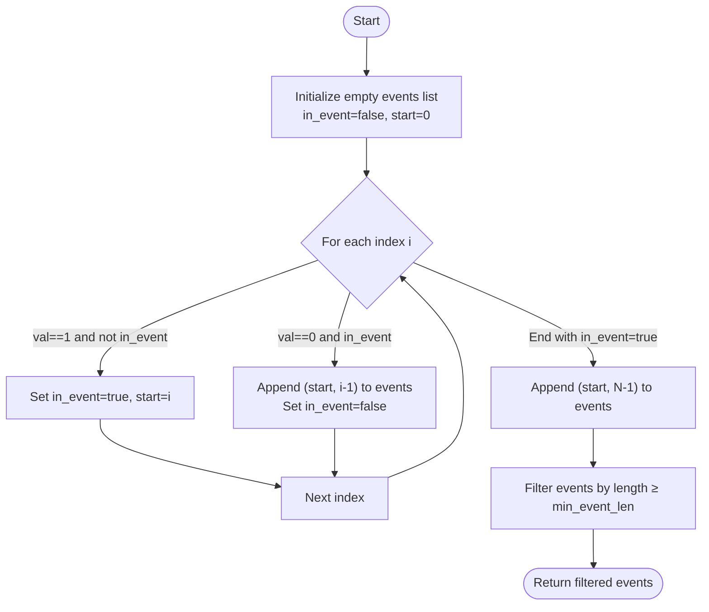
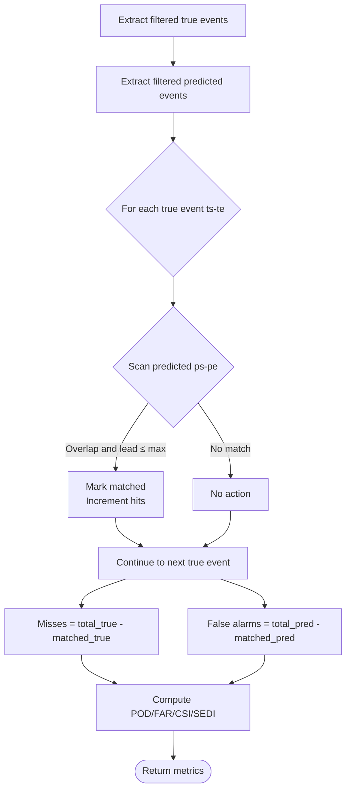
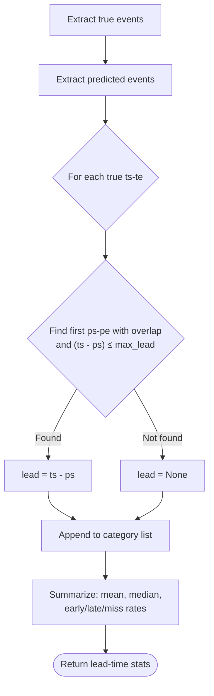
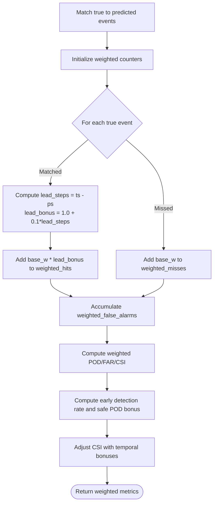
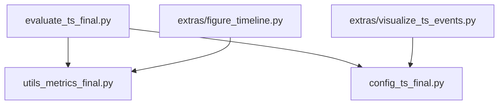

# Event-level Metrics & Analysis

<cite>
**Referenced Files in This Document**
- [utils_metrics_final.py](file://utils_metrics_final.py)
- [evaluate_ts_final.py](file://evaluate_ts_final.py)
- [config_ts_final.py](file://config_ts_final.py)
- [figure_timeline.py](file://extras/figure_timeline.py)
- [visualize_ts_events.py](file://extras/visualize_ts_events.py)
</cite>

## Table of Contents
1. [Introduction](#introduction)
2. [Project Structure](#project-structure)
3. [Core Components](#core-components)
4. [Architecture Overview](#architecture-overview)
5. [Detailed Component Analysis](#detailed-component-analysis)
6. [Dependency Analysis](#dependency-analysis)
7. [Performance Considerations](#performance-considerations)
8. [Troubleshooting Guide](#troubleshooting-guide)
9. [Conclusion](#conclusion)
10. [Appendices](#appendices)

## Introduction
This document explains the event-level metrics and analysis methods used in thunderstorm nowcasting evaluation. It covers:
- The event extraction algorithm that converts binary sequences into (start, end) event tuples with minimum event length filtering
- Overlap-based event-level metrics (hit, miss, false alarm counts) and their computation of POD, FAR, CSI, and SEDI at the event level
- The lead time analysis system that computes detection timing relative to true event onset, including early detection rates and temporal accuracy assessment
- Severity-weighted event metrics that incorporate meteorological severity categories and lead time bonuses
- Comprehensive examples showing event matching algorithms, lead time computation workflows, and severity-based weighting schemes
- Differences between frame-level and event-level evaluation approaches and their respective advantages for operational weather forecasting

## Project Structure
The event-level evaluation pipeline integrates several modules:
- Metrics utilities: event extraction, overlap-based metrics, lead time computation, severity-weighted scoring, and bootstrap testing
- Evaluation driver: inference, threshold selection, persistence filtering, and reporting
- Configuration: runtime parameters controlling thresholds, persistence, lead time limits, and severity weights
- Extras: visualization scripts for timelines and event distributions

**Diagram sources**
- [evaluate_ts_final.py:1-908](file://evaluate_ts_final.py#L1-L908)
- [utils_metrics_final.py:1-760](file://utils_metrics_final.py#L1-L760)
- [config_ts_final.py:1-208](file://config_ts_final.py#L1-L208)
- [figure_timeline.py:1-253](file://extras/figure_timeline.py#L1-L253)
- [visualize_ts_events.py:1-217](file://extras/visualize_ts_events.py#L1-L217)

**Section sources**
- [evaluate_ts_final.py:1-908](file://evaluate_ts_final.py#L1-L908)
- [utils_metrics_final.py:1-760](file://utils_metrics_final.py#L1-L760)
- [config_ts_final.py:1-208](file://config_ts_final.py#L1-L208)
- [figure_timeline.py:1-253](file://extras/figure_timeline.py#L1-L253)
- [visualize_ts_events.py:1-217](file://extras/visualize_ts_events.py#L1-L217)

## Core Components
- Event extraction: Converts a binary sequence into a list of (start, end) inclusive event spans, filtering by minimum event length.
- Overlap-based event metrics: Computes hits, misses, false alarms, and derived scores (POD, FAR, CSI, SEDI) using overlap constraints and lead-time tolerance.
- Lead time analysis: Computes detection timing relative to true event onset, aggregating by severity category and summarizing statistics.
- Severity-weighted metrics: Applies categorical weights to hits, misses, and false alarms, and adds lead-time bonuses for early detections.
- Bootstrap testing: Estimates confidence intervals for frame, event, and weighted metrics using temporal block bootstrapping.

**Section sources**
- [utils_metrics_final.py:322-393](file://utils_metrics_final.py#L322-L393)
- [utils_metrics_final.py:338-393](file://utils_metrics_final.py#L338-L393)
- [utils_metrics_final.py:395-477](file://utils_metrics_final.py#L395-L477)
- [utils_metrics_final.py:479-518](file://utils_metrics_final.py#L479-L518)
- [utils_metrics_final.py:575-650](file://utils_metrics_final.py#L575-L650)
- [utils_metrics_final.py:653-760](file://utils_metrics_final.py#L653-L760)

## Architecture Overview
The evaluation workflow connects inference, post-processing, and metrics computation:

**Diagram sources**
- [evaluate_ts_final.py:578-641](file://evaluate_ts_final.py#L578-L641)
- [utils_metrics_final.py:23-47](file://utils_metrics_final.py#L23-L47)
- [utils_metrics_final.py:50-77](file://utils_metrics_final.py#L50-L77)
- [utils_metrics_final.py:322-393](file://utils_metrics_final.py#L322-L393)
- [utils_metrics_final.py:395-477](file://utils_metrics_final.py#L395-L477)
- [utils_metrics_final.py:479-518](file://utils_metrics_final.py#L479-L518)
- [utils_metrics_final.py:575-650](file://utils_metrics_final.py#L575-L650)

## Detailed Component Analysis

### Event Extraction Algorithm
The event extraction algorithm transforms a binary sequence into a list of (start, end) inclusive event spans, then filters short events by minimum length.

Key steps:
- Iterate through the binary sequence, tracking transitions from 0 to 1 (start) and 1 to 0 (end).
- Append a span when leaving an event.
- If the sequence ends while inside an event, append the final span.
- Filter events whose length (end - start + 1) is less than the minimum event length.

**Diagram sources**
- [utils_metrics_final.py:322-335](file://utils_metrics_final.py#L322-L335)

**Section sources**
- [utils_metrics_final.py:322-335](file://utils_metrics_final.py#L322-L335)

### Overlap-Based Event-Level Metrics (IMD Style)
Overlap-based metrics define:
- Hits: true events matched to predictions with overlap and within the maximum lead time tolerance
- Misses: true events without a valid match
- False Alarms: predicted events without a valid overlap

Computation:
- Extract filtered true and predicted events
- For each true event, scan predictions in order; if overlap exists and prediction occurs within the lead time limit, mark the prediction as matched and increment hits
- Misses = total true events - matched true events
- False Alarms = total predicted events - matched predicted events
- POD = hits / (hits + misses)
- FAR = false alarms / (hits + false alarms)
- CSI = hits / (hits + misses + false alarms)
- SEDI estimated using hit rate and false alarm rate with small epsilon for numerical stability

**Diagram sources**
- [utils_metrics_final.py:338-393](file://utils_metrics_final.py#L338-L393)

**Section sources**
- [utils_metrics_final.py:338-393](file://utils_metrics_final.py#L338-L393)

### Lead Time Analysis System
Lead time is computed as the difference between the true event start and the first prediction before or at the event onset, within the maximum lead time tolerance.

Workflow:
- Extract true and predicted events
- For each true event, find the earliest prediction that overlaps and satisfies the lead-time constraint
- Compute lead = true_start − prediction_start
- Store lead times per category if severity labels are provided; otherwise aggregate under a single category
- Summarize lead times: mean, median, early detection rate, late detection rate, miss rate

**Diagram sources**
- [utils_metrics_final.py:395-477](file://utils_metrics_final.py#L395-L477)

**Section sources**
- [utils_metrics_final.py:395-477](file://utils_metrics_final.py#L395-L477)

### Severity-Weighted Event Metrics
Severity-weighted metrics incorporate:
- Categorical weights for true positives (hits) and false negatives (misses) based on the severity category of the true event’s start frame
- False positives (false alarms) weighted uniformly
- Lead-time bonus: +10% per step of lead time for early detections, capped at 1.0

Computation:
- Match true events to predictions with overlap and lead-time tolerance
- For each true event, apply base weight according to its severity
- If matched, compute lead bonus and accumulate weighted hits
- Accumulate weighted misses and false alarms
- Compute weighted POD, weighted FAR, weighted CSI
- Additional temporal bonus: add 0.05 to the CSI if early detection rate ≥ 0.60 or if weighted POD*(1 - weighted FAR) ≥ 0.60, capped at 1.0

**Diagram sources**
- [utils_metrics_final.py:575-650](file://utils_metrics_final.py#L575-L650)

**Section sources**
- [utils_metrics_final.py:479-518](file://utils_metrics_final.py#L479-L518)
- [utils_metrics_final.py:575-650](file://utils_metrics_final.py#L575-L650)

### Example Workflows

#### Event Matching Algorithm
- Input: binary true and predicted sequences
- Steps:
  - Threshold predictions at the chosen probability threshold
  - Extract events from both sequences with minimum length filtering
  - Scan true events against predicted events for overlap and lead-time tolerance
  - Record hits, misses, false alarms, and derive POD, FAR, CSI, SEDI

**Section sources**
- [utils_metrics_final.py:338-393](file://utils_metrics_final.py#L338-L393)

#### Lead Time Computation Workflow
- Input: true and predicted sequences, severity labels, maximum lead steps
- Steps:
  - Extract true and predicted events
  - For each true event, find the first overlapping prediction within the lead-time window
  - Compute lead = true_start − prediction_start
  - Aggregate lead times by severity category and summarize statistics

**Section sources**
- [utils_metrics_final.py:395-477](file://utils_metrics_final.py#L395-L477)

#### Severity-Based Weighting Scheme
- Input: true and predicted sequences, severity labels, minimum event length, maximum lead steps
- Steps:
  - Match events with overlap and lead-time tolerance
  - Assign base weights by severity
  - Apply lead-time bonus for early detections
  - Compute weighted POD, weighted FAR, weighted CSI, and temporal-adjusted CSI

**Section sources**
- [utils_metrics_final.py:479-518](file://utils_metrics_final.py#L479-L518)
- [utils_metrics_final.py:575-650](file://utils_metrics_final.py#L575-L650)

### Visualization and Timeline Examples
- Timeline visualization highlights true and predicted event spans, annotates hits, misses, and false alarms, and overlays model probability traces.
- Event distribution visualization shows aggregated counts and timelines of thunderstorm events with severity classification.

**Section sources**
- [figure_timeline.py:153-195](file://extras/figure_timeline.py#L153-L195)
- [visualize_ts_events.py:144-202](file://extras/visualize_ts_events.py#L144-L202)

## Dependency Analysis
The evaluation pipeline depends on:
- Metrics utilities for event extraction, overlap-based metrics, lead time computation, severity-weighted metrics, and bootstrap testing
- Evaluation driver for inference, threshold selection, persistence filtering, and reporting
- Configuration for runtime parameters (threshold metric, persistence minimum length, maximum lead minutes, severity weights)

**Diagram sources**
- [evaluate_ts_final.py:29-34](file://evaluate_ts_final.py#L29-L34)
- [utils_metrics_final.py:1-760](file://utils_metrics_final.py#L1-L760)
- [config_ts_final.py:1-208](file://config_ts_final.py#L1-L208)
- [figure_timeline.py:31-38](file://extras/figure_timeline.py#L31-L38)
- [visualize_ts_events.py:16-17](file://extras/visualize_ts_events.py#L16-L17)

**Section sources**
- [evaluate_ts_final.py:29-34](file://evaluate_ts_final.py#L29-L34)
- [utils_metrics_final.py:1-760](file://utils_metrics_final.py#L1-L760)
- [config_ts_final.py:1-208](file://config_ts_final.py#L1-L208)
- [figure_timeline.py:31-38](file://extras/figure_timeline.py#L31-L38)
- [visualize_ts_events.py:16-17](file://extras/visualize_ts_events.py#L16-L17)

## Performance Considerations
- Event extraction and overlap scanning scale with the number of true and predicted events; filtering by minimum event length reduces computational overhead.
- Lead-time tolerance bounds the search space for valid matches.
- Severity-weighted metrics add constant-time per-event computations but improve interpretability for operational use.
- Bootstrapped confidence intervals require multiple evaluations; adjust the number of bootstrap iterations based on computational budget.

[No sources needed since this section provides general guidance]

## Troubleshooting Guide
Common issues and remedies:
- Incorrect lead time signs: ensure lead is computed as true_start minus prediction_start; positive indicates early detection, negative indicates late detection.
- Missed matches due to lead-time tolerance: increase maximum lead minutes or adjust the step-minute conversion factor.
- Inconsistent severity labels: verify that severity labels are mapped to the start frame of each true event.
- Short false alarms: tune persistence minimum length to suppress isolated false alarms.

**Section sources**
- [utils_metrics_final.py:395-477](file://utils_metrics_final.py#L395-L477)
- [utils_metrics_final.py:50-77](file://utils_metrics_final.py#L50-L77)
- [evaluate_ts_final.py:602-610](file://evaluate_ts_final.py#L602-L610)

## Conclusion
Event-level metrics provide a practical and operationally meaningful evaluation framework for thunderstorm nowcasting. They emphasize temporal accuracy (lead time), categorical importance (severity-weighted scoring), and robustness (bootstrap confidence intervals). Compared to frame-level metrics, event-level metrics better reflect the operational challenge of detecting and timing convective systems, guiding model improvements toward actionable warnings.

[No sources needed since this section summarizes without analyzing specific files]

## Appendices

### Frame-Level vs Event-Level Evaluation
- Frame-level metrics treat each time step independently, emphasizing per-frame sensitivity and specificity. They are sensitive to temporal chatter and short-lived false alarms.
- Event-level metrics aggregate detections into contiguous events, focusing on detection quality and timing. They penalize false alarms and reward early detection, aligning with operational needs.

[No sources needed since this section provides general guidance]