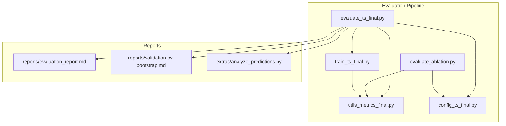
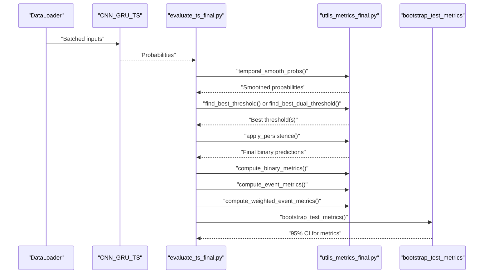
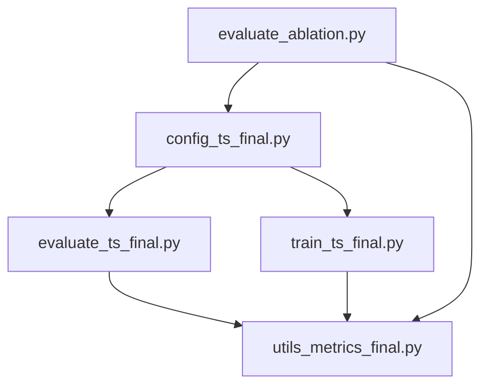

# Performance Metrics & Evaluation

<cite>
**Referenced Files in This Document**
- [utils_metrics_final.py](file://utils_metrics_final.py)
- [evaluate_ts_final.py](file://evaluate_ts_final.py)
- [config_ts_final.py](file://config_ts_final.py)
- [evaluate_ablation.py](file://evaluate_ablation.py)
- [reports/evaluation_report.md](file://reports/evaluation_report.md)
- [reports/validation-cv-bootstrap.md](file://reports/validation-cv-bootstrap.md)
- [extras/analyze_predictions.py](file://extras/analyze_predictions.py)
- [train_ts_final.py](file://train_ts_final.py)
</cite>

## Table of Contents
1. [Introduction](#introduction)
2. [Project Structure](#project-structure)
3. [Core Components](#core-components)
4. [Architecture Overview](#architecture-overview)
5. [Detailed Component Analysis](#detailed-component-analysis)
6. [Dependency Analysis](#dependency-analysis)
7. [Performance Considerations](#performance-considerations)
8. [Troubleshooting Guide](#troubleshooting-guide)
9. [Conclusion](#conclusion)
10. [Appendices](#appendices)

## Introduction
This document describes the performance metrics and evaluation system used for thunderstorm nowcasting. It covers frame-level and event-level metrics, temporal smoothing and persistence filtering, threshold optimization (including dual-threshold Schmitt trigger), specialized metrics like SEDI and weighted metrics, and bootstrap confidence intervals for statistical significance testing. Practical examples and benchmarking strategies are included, along with guidance for selecting metrics under different operational scenarios.

## Project Structure
The evaluation pipeline integrates model inference, post-processing, and comprehensive metric computation across frame-level and event-level perspectives. Key modules:
- Metrics and post-processing utilities: [utils_metrics_final.py](file://utils_metrics_final.py)
- End-to-end evaluation script: [evaluate_ts_final.py](file://evaluate_ts_final.py)
- Configuration controlling thresholds, smoothing, persistence, and weighting: [config_ts_final.py](file://config_ts_final.py)
- Ablation study runner: [evaluate_ablation.py](file://evaluate_ablation.py)
- Reports and validation enhancements: [reports/evaluation_report.md](file://reports/evaluation_report.md), [reports/validation-cv-bootstrap.md](file://reports/validation-cv-bootstrap.md)
- Prediction analysis utilities: [extras/analyze_predictions.py](file://extras/analyze_predictions.py)
- Training-side threshold optimization and walk-forward CV: [train_ts_final.py](file://train_ts_final.py)

**Diagram sources**
- [evaluate_ts_final.py](file://evaluate_ts_final.py)
- [utils_metrics_final.py](file://utils_metrics_final.py)
- [config_ts_final.py](file://config_ts_final.py)
- [evaluate_ablation.py](file://evaluate_ablation.py)
- [train_ts_final.py](file://train_ts_final.py)
- [reports/evaluation_report.md](file://reports/evaluation_report.md)
- [reports/validation-cv-bootstrap.md](file://reports/validation-cv-bootstrap.md)
- [extras/analyze_predictions.py](file://extras/analyze_predictions.py)

**Section sources**
- [evaluate_ts_final.py](file://evaluate_ts_final.py)
- [utils_metrics_final.py](file://utils_metrics_final.py)
- [config_ts_final.py](file://config_ts_final.py)
- [evaluate_ablation.py](file://evaluate_ablation.py)
- [reports/evaluation_report.md](file://reports/evaluation_report.md)
- [reports/validation-cv-bootstrap.md](file://reports/validation-cv-bootstrap.md)
- [extras/analyze_predictions.py](file://extras/analyze_predictions.py)
- [train_ts_final.py](file://train_ts_final.py)

## Core Components
- Metrics suite: POD, FAR, CSI, ETS, SEDI, F1, F2, plus weighted variants and lead-time-aware CSI.
- Post-processing: temporal smoothing (EMA or rolling mean), persistence filtering, Schmitt trigger hysteresis.
- Threshold optimization: grid search over thresholds or dual-threshold Schmitt trigger, with metric selection options including weighted and lead-time-aware CSI.
- Event-level metrics: overlap-based event matching with lead-time constraints and severity-weighted scoring.
- Bootstrap confidence intervals: temporal block bootstrap by calendar day for robust uncertainty quantification.

**Section sources**
- [utils_metrics_final.py](file://utils_metrics_final.py)
- [evaluate_ts_final.py](file://evaluate_ts_final.py)
- [config_ts_final.py](file://config_ts_final.py)

## Architecture Overview
The evaluation workflow proceeds through inference, calibration, temporal smoothing, threshold selection, persistence filtering, and comprehensive metric computation. Dual-threshold Schmitt trigger can be used instead of single thresholding. Bootstrapped confidence intervals are computed on the test set.

**Diagram sources**
- [evaluate_ts_final.py](file://evaluate_ts_final.py)
- [utils_metrics_final.py](file://utils_metrics_final.py)

**Section sources**
- [evaluate_ts_final.py](file://evaluate_ts_final.py)
- [utils_metrics_final.py](file://utils_metrics_final.py)

## Detailed Component Analysis

### Metrics Suite and Formulations
- Frame-level metrics:
  - POD (Probability of Detection) = TP / (TP + FN)
  - FAR (False Alarm Ratio) = FP / (TP + FP)
  - CSI (Critical Success Index) = TP / (TP + FP + FN)
  - ETS (Equitable Threat Score) adjusts for random chance: (TP - H_rand) / (TP + FP + FN - H_rand), where H_rand = (TP + FP)(TP + FN) / N
  - SEDI (Symmetric Extremal Dependence Index) is base-rate independent for rare events, computed from POD and POFD
  - F1 and F2 scores incorporate balanced recall and precision penalties
- Event-level metrics:
  - Overlap-based matching with minimum event length filtering and lead-time tolerance
  - POD, FAR, CSI computed from matched hits, misses, and false alarms
  - SEDI computed approximately using estimated TN
- Weighted metrics:
  - Point-wise severity weighting for POD/FAR/CSI
  - Event-level weighted POD/FAR/CSI with lead-time bonuses and safety adjustments

Interpretation guidelines:
- POD reflects detection capability; higher is better.
- FAR reflects false alarm frequency; lower is better.
- CSI balances detection and false alarms; higher is better.
- ETS accounts for random hit rate; higher is better.
- SEDI is robust for rare events; higher is better.
- F1/F2 emphasize precision/recall trade-offs; F2 heavier on recall.
- Event-level metrics provide operational insight into event clustering and timing.
- Weighted metrics emphasize operational categories (e.g., heavy precipitation, squalls).

**Section sources**
- [utils_metrics_final.py](file://utils_metrics_final.py)

### Temporal Smoothing and Persistence Filtering
- Temporal smoothing:
  - Exponential Moving Average (EMA) with decay factor α = 2/(window + 1)
  - Rolling mean over a window
- Persistence filtering:
  - Removes isolated positive runs shorter than a minimum length
  - Optionally preserves runs that exceed a severe probability threshold at any point
  - Counts short false alarms to monitor spurious detections

Practical impact:
- Reduces temporal chatter and false spikes
- Suppresses short-lived false alarms while preserving persistent systems
- Improves operational reliability by reducing false positives

**Section sources**
- [utils_metrics_final.py](file://utils_metrics_final.py)
- [evaluate_ts_final.py](file://evaluate_ts_final.py)

### Threshold Optimization Procedures
- Single-threshold grid search:
  - Maximizes chosen metric (F2, F1, ETS, SEDI, CSI, SAFE_CSI, weighted event metrics)
  - Applies persistence filtering before evaluation when configured
- Dual-threshold Schmitt trigger:
  - High threshold initiates an event; low threshold terminates it
  - Optional rapid cooling flag can force immediate triggering
  - Grid-search over high thresholds and low-offsets to maximize metric

Metric selection:
- lt-wCSI_evt is the default threshold metric, incorporating lead-time bonus and safety adjustments
- SAFE_CSI adjusts CSI by limiting excessive FAR beyond a threshold
- Weighted metrics enable category-specific optimization

**Section sources**
- [utils_metrics_final.py](file://utils_metrics_final.py)
- [evaluate_ts_final.py](file://evaluate_ts_final.py)
- [config_ts_final.py](file://config_ts_final.py)
- [train_ts_final.py](file://train_ts_final.py)

### Event-Level Metrics and Lead-Time Analysis
- Event extraction converts binary sequences into inclusive (start, end) pairs
- Overlap-based matching ensures predictions occur within a lead-time window
- Lead-time statistics include mean, median, early detection rate, late detection rate, and miss rate
- Severity-weighted event metrics incorporate lead-time bonuses and safety corrections

Operational insights:
- Event-level metrics align with operational needs for event clustering and timing
- Lead-time analysis helps assess forecast timeliness and reliability
- Weighted metrics highlight performance across thunderstorm categories

**Section sources**
- [utils_metrics_final.py](file://utils_metrics_final.py)
- [evaluate_ts_final.py](file://evaluate_ts_final.py)

### Specialized Metrics: SEDI and Weighted Metrics
- SEDI:
  - Base-rate independent skill for rare events
  - Computed from POD and POFD with logarithmic transformations
- Weighted metrics:
  - Point-wise weighting by thunderstorm severity
  - Event-level weighting with lead-time bonus and safety adjustments
  - Lead-time-aware CSI (lt_wCSI_event) adds bonuses for early detection and safe POD bonus

Selection criteria:
- Use SEDI for rare-event detection robustness
- Use weighted metrics for category-specific operational goals
- Use lead-time-aware CSI for balancing accuracy and timeliness

**Section sources**
- [utils_metrics_final.py](file://utils_metrics_final.py)
- [evaluate_ts_final.py](file://evaluate_ts_final.py)

### Dual-Threshold Schmitt Trigger System
- Hysteresis improves detection stability by preventing frequent toggling
- High threshold starts an event; low threshold ends it
- Rapid cooling flags can override thresholds for immediate triggering
- Dual-threshold grid search selects optimal thresholds for a chosen metric

Benefits:
- Reduces temporal chattering
- Improves robustness compared to pure thresholding
- Can be combined with persistence filtering

**Section sources**
- [utils_metrics_final.py](file://utils_metrics_final.py)
- [evaluate_ts_final.py](file://evaluate_ts_final.py)

### Bootstrap Confidence Interval Computation
- Temporal block bootstrap by calendar day to preserve temporal correlation
- Computes 95% confidence intervals for frame, event, and weighted metrics
- Provides point estimates alongside lower and upper bounds

Usage:
- Call bootstrap_test_metrics on test predictions and timestamps
- Outputs structured results for reporting and comparisons

**Section sources**
- [utils_metrics_final.py](file://utils_metrics_final.py)
- [evaluate_ts_final.py](file://evaluate_ts_final.py)

### Practical Examples and Benchmarking Strategies
- Example: Comparing two runs using weighted event metrics and lead-time statistics
- Strategy: Use walk-forward CV folds, report bootstrap intervals, and compare weighted CSI and lead-time metrics
- Ablation studies: Evaluate contributions of individual inputs by zeroing features and measuring weighted event metrics

**Section sources**
- [reports/evaluation_report.md](file://reports/evaluation_report.md)
- [evaluate_ablation.py](file://evaluate_ablation.py)
- [extras/analyze_predictions.py](file://extras/analyze_predictions.py)

## Dependency Analysis
The evaluation pipeline depends on configuration for thresholds, smoothing, persistence, and weighting. Metrics utilities provide core computations, while evaluation scripts orchestrate inference, post-processing, and reporting. Training scripts complement evaluation with threshold optimization and walk-forward CV.

**Diagram sources**
- [config_ts_final.py](file://config_ts_final.py)
- [evaluate_ts_final.py](file://evaluate_ts_final.py)
- [train_ts_final.py](file://train_ts_final.py)
- [utils_metrics_final.py](file://utils_metrics_final.py)
- [evaluate_ablation.py](file://evaluate_ablation.py)

**Section sources**
- [config_ts_final.py](file://config_ts_final.py)
- [evaluate_ts_final.py](file://evaluate_ts_final.py)
- [train_ts_final.py](file://train_ts_final.py)
- [utils_metrics_final.py](file://utils_metrics_final.py)
- [evaluate_ablation.py](file://evaluate_ablation.py)

## Performance Considerations
- Temporal smoothing reduces noise but may delay detection slightly; tune window and method per operational needs.
- Persistence filtering improves reliability by suppressing short-lived false alarms; adjust minimum length and severe threshold carefully.
- Threshold optimization should align with operational priorities (e.g., weighted CSI for category emphasis).
- Lead-time-aware CSI balances accuracy and timeliness; use it as the primary selection metric.
- Bootstrap intervals provide robust uncertainty estimates; increase bootstrap iterations for tighter intervals.

[No sources needed since this section provides general guidance]

## Troubleshooting Guide
Common issues and remedies:
- Imbalanced thresholds: Use weighted or lead-time-aware metrics for threshold optimization.
- Over-smoothing: Reduce smoothing window or switch to rolling mean; validate with short FA counts.
- Excessive false alarms: Increase persistence minimum length or severe threshold; review Schmitt trigger thresholds.
- Poor lead-time performance: Re-enable temporal features; reassess lead-time constraints and weighting.
- Calibration concerns: Use Platt scaling when applicable; inspect probability binning accuracy.

**Section sources**
- [utils_metrics_final.py](file://utils_metrics_final.py)
- [evaluate_ts_final.py](file://evaluate_ts_final.py)
- [extras/analyze_predictions.py](file://extras/analyze_predictions.py)

## Conclusion
The evaluation system combines robust frame-level and event-level metrics with temporal smoothing, persistence filtering, and threshold optimization. Specialized metrics like SEDI and weighted/lead-time-aware CSI address operational needs for rare events and forecast timeliness. Bootstrap confidence intervals provide statistical rigor for model comparisons and benchmarking. Proper configuration and validation strategies ensure reliable and actionable nowcasting performance assessments.

[No sources needed since this section summarizes without analyzing specific files]

## Appendices

### Appendix A: Mathematical Definitions
- POD = TP / (TP + FN)
- FAR = FP / (TP + FP)
- CSI = TP / (TP + FP + FN)
- ETS = (TP - H_rand) / (TP + FP + FN - H_rand), H_rand = (TP + FP)(TP + FN) / N
- SEDI: base-rate independent index computed from POD and POFD
- F1 = 2TP / (2TP + FP + FN)
- F2 = 5TP / (5TP + 4FN + FP)
- SAFE_CSI = CSI − 1.0 × max(0.0, FAR − 0.58)
- Weighted POD/FAR/CSI: severity-weighted point-wise scoring
- wCSI_evt: event-level CSI with lead-time bonus and safety adjustments

**Section sources**
- [utils_metrics_final.py](file://utils_metrics_final.py)

### Appendix B: Operational Scenario Selection
- High-stakes severe weather: prioritize SEDI and weighted metrics emphasizing heavy precipitation and squalls.
- Timely warnings: use lead-time-aware CSI and monitor early detection rate.
- General reliability: use ETS and CSI with persistence filtering.
- Baseline comparisons: use bootstrap intervals to assess statistical significance.

**Section sources**
- [utils_metrics_final.py](file://utils_metrics_final.py)
- [reports/evaluation_report.md](file://reports/evaluation_report.md)