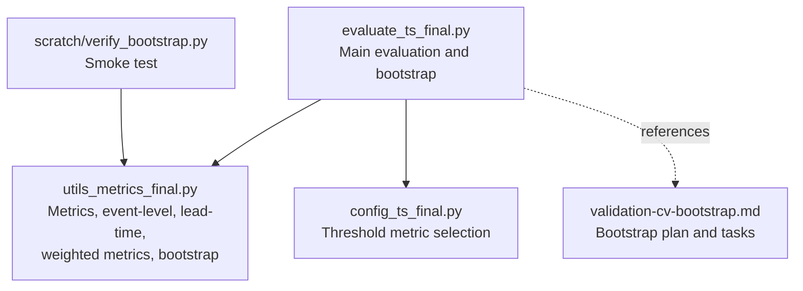
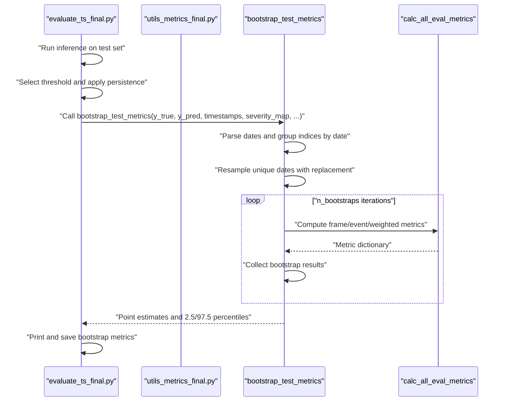
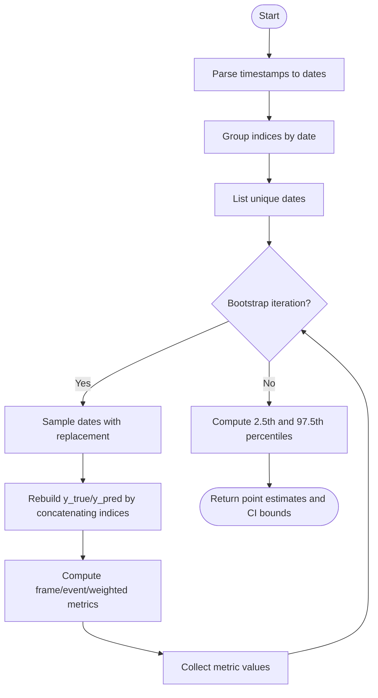
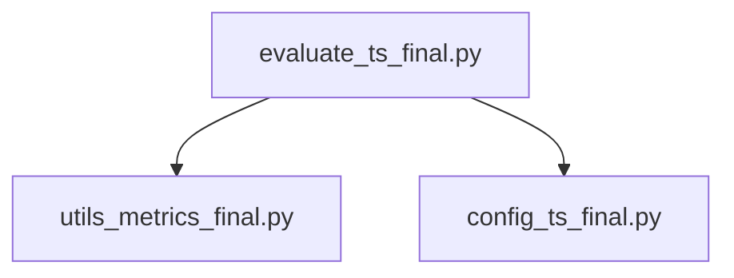

# Statistical Significance Testing

<cite>
**Referenced Files in This Document**
- [evaluate_ts_final.py](file://evaluate_ts_final.py)
- [utils_metrics_final.py](file://utils_metrics_final.py)
- [config_ts_final.py](file://config_ts_final.py)
- [validation-cv-bootstrap.md](file://reports/validation-cv-bootstrap.md)
- [verify_bootstrap.py](file://scratch/verify_bootstrap.py)
</cite>

## Table of Contents
1. [Introduction](#introduction)
2. [Project Structure](#project-structure)
3. [Core Components](#core-components)
4. [Architecture Overview](#architecture-overview)
5. [Detailed Component Analysis](#detailed-component-analysis)
6. [Dependency Analysis](#dependency-analysis)
7. [Performance Considerations](#performance-considerations)
8. [Troubleshooting Guide](#troubleshooting-guide)
9. [Conclusion](#conclusion)

## Introduction
This document explains the statistical significance testing and confidence interval estimation methodology used in thunderstorm nowcasting evaluation. It focuses on temporal block bootstrapping that respects temporal autocorrelation by resampling entire calendar days rather than individual time steps. The evaluation pipeline computes point estimates and 95% confidence intervals for frame-level, event-level, and weighted metrics on the held-out test set. It also documents the interpretation of confidence intervals for model comparison and performance assessment, along with practical guidance on sample sizes and thresholds.

## Project Structure
The evaluation and metrics infrastructure is organized around:
- An evaluation script that orchestrates inference, threshold selection, persistence filtering, and bootstrap confidence intervals.
- A metrics library that defines all evaluation metrics, event-level computations, lead-time statistics, and the bootstrap procedure.
- A configuration module that sets the primary threshold selection metric to a lead-time-weighted CSI variant.
- A report and scratch verification files that outline the bootstrap plan and validate the implementation.

**Diagram sources**
- [evaluate_ts_final.py:740-800](file://evaluate_ts_final.py#L740-L800)
- [utils_metrics_final.py:653-760](file://utils_metrics_final.py#L653-L760)
- [config_ts_final.py:95](file://config_ts_final.py#L95)
- [validation-cv-bootstrap.md:1-89](file://reports/validation-cv-bootstrap.md#L1-L89)
- [verify_bootstrap.py:100-124](file://scratch/verify_bootstrap.py#L100-L124)

**Section sources**
- [evaluate_ts_final.py:740-800](file://evaluate_ts_final.py#L740-L800)
- [utils_metrics_final.py:653-760](file://utils_metrics_final.py#L653-L760)
- [config_ts_final.py:95](file://config_ts_final.py#L95)
- [validation-cv-bootstrap.md:1-89](file://reports/validation-cv-bootstrap.md#L1-L89)
- [verify_bootstrap.py:100-124](file://scratch/verify_bootstrap.py#L100-L124)

## Core Components
- Temporal block bootstrap: Resamples entire calendar days to preserve temporal autocorrelation, then recomputes all metrics across bootstrap samples to estimate 95% confidence intervals.
- Frame-level metrics: POD, FAR, CSI, ETS, SEDI, F1, F2 computed from thresholded predictions.
- Event-level metrics: Hits, misses, false alarms, POD, FAR, CSI, SEDI computed over storm events with minimum duration and lead-time constraints.
- Weighted event metrics: Severity-weighted POD/FAR/CSI and a lead-time-weighted CSI variant that rewards early detections.
- Lead-time statistics: Mean and median lead time, early/late miss rates, summarized by category.

Key implementation references:
- Bootstrap function and metric aggregation: [utils_metrics_final.py:653-760](file://utils_metrics_final.py#L653-L760)
- Evaluation pipeline invoking bootstrap: [evaluate_ts_final.py:740-800](file://evaluate_ts_final.py#L740-L800)
- Threshold metric selection: [config_ts_final.py:95](file://config_ts_final.py#L95)

**Section sources**
- [utils_metrics_final.py:653-760](file://utils_metrics_final.py#L653-L760)
- [evaluate_ts_final.py:740-800](file://evaluate_ts_final.py#L740-L800)
- [config_ts_final.py:95](file://config_ts_final.py#L95)

## Architecture Overview
The evaluation pipeline performs:
- Inference on the test set to produce probabilities and predictions.
- Threshold selection and persistence filtering.
- Computation of frame-level, event-level, and weighted metrics.
- Temporal block bootstrap by calendar day to estimate confidence intervals.
- Output of point estimates and 95% confidence intervals for reporting and comparison.

**Diagram sources**
- [evaluate_ts_final.py:740-800](file://evaluate_ts_final.py#L740-L800)
- [utils_metrics_final.py:653-760](file://utils_metrics_final.py#L653-L760)

## Detailed Component Analysis

### Temporal Block Bootstrapping Procedure
The bootstrap procedure groups time indices by calendar date, resamples dates with replacement, reconstructs sequences by concatenating all indices for each sampled date, and recomputes all metrics across each bootstrap replicate. Percentiles are computed to form 95% confidence intervals.

**Diagram sources**
- [utils_metrics_final.py:653-760](file://utils_metrics_final.py#L653-L760)

Implementation highlights:
- Date grouping and resampling: [utils_metrics_final.py:672-739](file://utils_metrics_final.py#L672-L739)
- Metric computation across bootstrap samples: [utils_metrics_final.py:692-721](file://utils_metrics_final.py#L692-L721)
- Percentile computation for confidence intervals: [utils_metrics_final.py:748-758](file://utils_metrics_final.py#L748-L758)

**Section sources**
- [utils_metrics_final.py:653-760](file://utils_metrics_final.py#L653-L760)

### Confidence Interval Estimation
- Point estimates: Computed on the original test sequence.
- 95% confidence intervals: Derived from 2.5th and 97.5th percentiles across bootstrap replicates.
- Metrics covered: Frame-level (POD, FAR, CSI, ETS, SEDI, F1, F2), Event-level (POD, FAR, CSI, SEDI), Weighted event-level (wPOD, wFAR, wCSI, lead-time-weighted CSI), and lead-time statistics (mean, median, early detection rate).

Evaluation script integration:
- Bootstrap invocation and printing: [evaluate_ts_final.py:740-800](file://evaluate_ts_final.py#L740-L800)
- Saved JSON output: [evaluate_ts_final.py:790-800](file://evaluate_ts_final.py#L790-L800)

**Section sources**
- [evaluate_ts_final.py:740-800](file://evaluate_ts_final.py#L740-L800)
- [utils_metrics_final.py:653-760](file://utils_metrics_final.py#L653-L760)

### Interpretation of Confidence Intervals for Model Comparison
- If two models’ 95% confidence intervals for a metric do not overlap, the difference is statistically significant at approximately the 5% level.
- For lead-time-weighted metrics, overlapping intervals indicate no strong evidence of a difference; non-overlapping intervals suggest a meaningful difference.
- Confidence intervals provide a practical way to assess whether observed differences are likely due to finite sample variability or represent genuine performance differences.

[No sources needed since this section provides general guidance]

### Practical Examples and Guidance
- Example usage in evaluation script: [evaluate_ts_final.py:740-800](file://evaluate_ts_final.py#L740-L800)
- Synthetic smoke test demonstrating the pipeline: [verify_bootstrap.py:100-124](file://scratch/verify_bootstrap.py#L100-L124)
- Bootstrap plan and tasks: [validation-cv-bootstrap.md:35-81](file://reports/validation-cv-bootstrap.md#L35-L81)

Sample size considerations:
- The number of unique calendar days determines the effective sample size for the bootstrap. More days generally yield more reliable confidence intervals.
- The evaluation script uses 200 bootstrap iterations by default; increasing iterations improves precision of percentiles at higher computational cost.

Statistical significance thresholds:
- 95% confidence intervals are used to infer significance; non-overlapping intervals imply a significant difference at approximately the 5% level.

**Section sources**
- [evaluate_ts_final.py:740-800](file://evaluate_ts_final.py#L740-L800)
- [verify_bootstrap.py:100-124](file://scratch/verify_bootstrap.py#L100-L124)
- [validation-cv-bootstrap.md:35-81](file://reports/validation-cv-bootstrap.md#L35-L81)

### Importance of Temporal Autocorrelation Correction
- Traditional resampling that mixes time steps across days violates temporal dependence, leading to overly optimistic performance estimates and invalid confidence intervals.
- Block bootstrapping preserves temporal correlation by resampling entire days, yielding more realistic uncertainty quantification and fairer comparisons.

[No sources needed since this section provides general guidance]

## Dependency Analysis
The evaluation pipeline depends on the metrics library for all computations and on configuration for threshold selection criteria.

**Diagram sources**
- [evaluate_ts_final.py:740-800](file://evaluate_ts_final.py#L740-L800)
- [utils_metrics_final.py:653-760](file://utils_metrics_final.py#L653-L760)
- [config_ts_final.py:95](file://config_ts_final.py#L95)

**Section sources**
- [evaluate_ts_final.py:740-800](file://evaluate_ts_final.py#L740-L800)
- [utils_metrics_final.py:653-760](file://utils_metrics_final.py#L653-L760)
- [config_ts_final.py:95](file://config_ts_final.py#L95)

## Performance Considerations
- Computational cost: Each bootstrap iteration recomputes all metrics; 200 iterations are used by default. Increasing iterations improves CI precision but increases runtime.
- Memory: The bootstrap reconstructs sequences for each iteration; ensure sufficient memory for large test sets.
- Seed control: A fixed seed ensures reproducibility across runs.

[No sources needed since this section provides general guidance]

## Troubleshooting Guide
Common issues and checks:
- Empty or malformed timestamps: The bootstrap handles fallback date parsing; ensure timestamps are valid ISO-like strings for accurate date grouping.
- Zero unique dates: If no dates are parsed, the bootstrap returns an empty result; verify timestamp formatting and non-empty input.
- Metric computation failures: Ensure y_true and y_pred are aligned and non-empty; verify severity labels mapping is provided when computing weighted metrics.
- Smoke test validation: Use the synthetic smoke test to validate the pipeline end-to-end.

References:
- Bootstrap implementation and error handling: [utils_metrics_final.py:653-760](file://utils_metrics_final.py#L653-L760)
- Smoke test runner: [verify_bootstrap.py:100-124](file://scratch/verify_bootstrap.py#L100-L124)

**Section sources**
- [utils_metrics_final.py:653-760](file://utils_metrics_final.py#L653-L760)
- [verify_bootstrap.py:100-124](file://scratch/verify_bootstrap.py#L100-L124)

## Conclusion
The evaluation framework integrates temporal block bootstrapping to produce reliable confidence intervals for frame-level, event-level, and weighted metrics on held-out test sets. By resampling entire calendar days, the approach corrects for temporal autocorrelation, enabling valid statistical inference and fair model comparisons. The evaluation script prints point estimates alongside 95% confidence intervals, and saves results for downstream analysis.