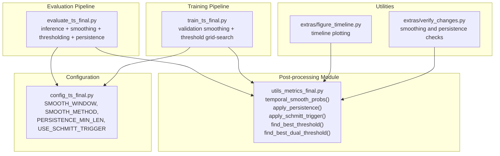
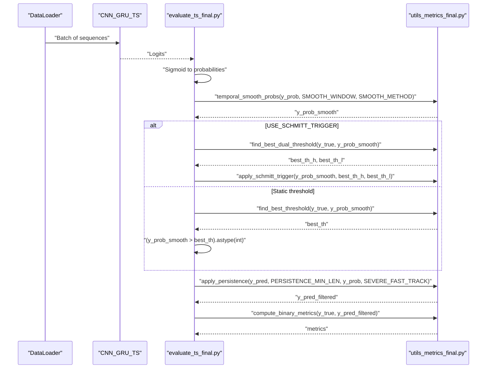
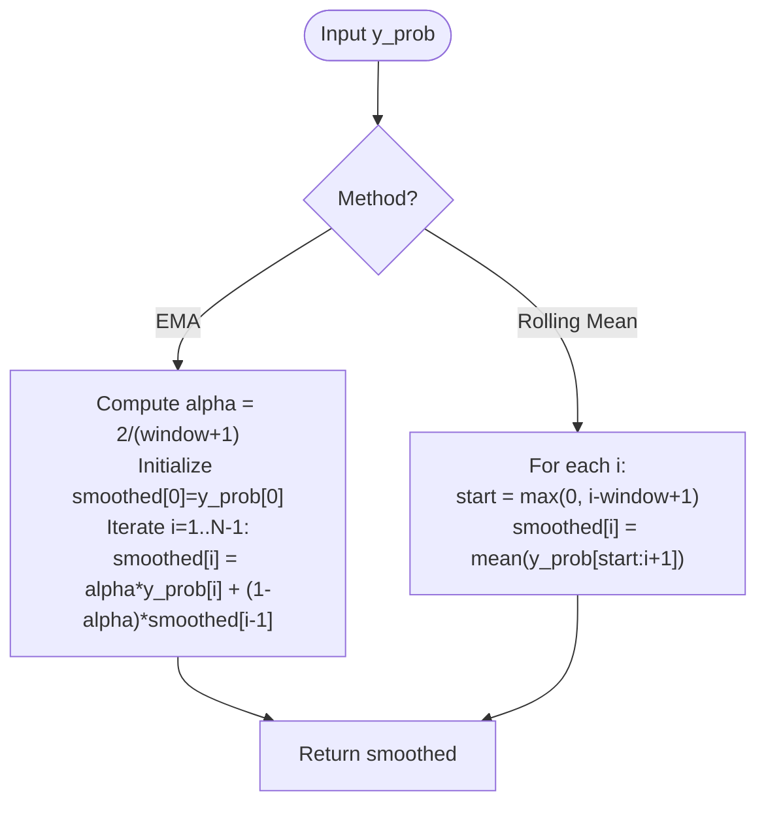
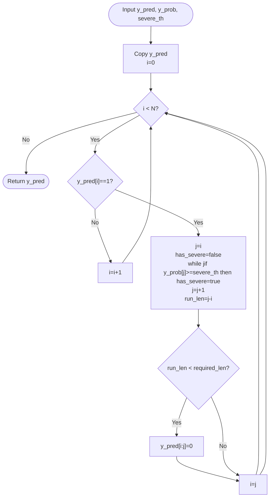
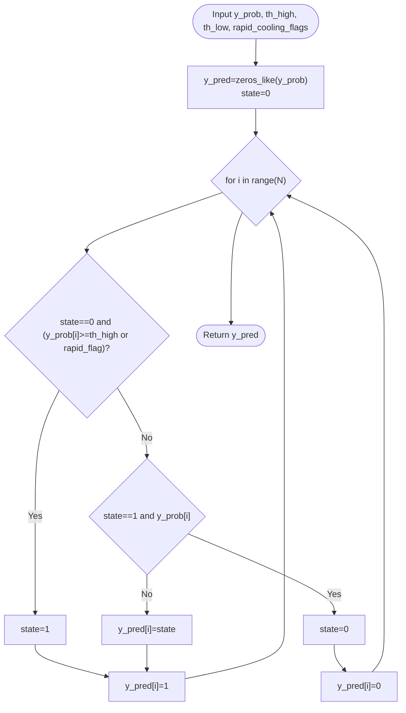
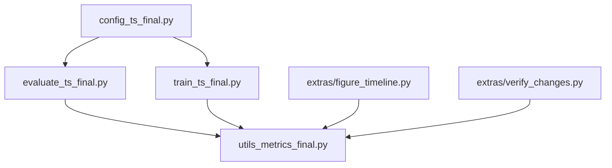

# Temporal Post-processing & Smoothing

<cite>
**Referenced Files in This Document**
- [utils_metrics_final.py](file://utils_metrics_final.py)
- [evaluate_ts_final.py](file://evaluate_ts_final.py)
- [train_ts_final.py](file://train_ts_final.py)
- [config_ts_final.py](file://config_ts_final.py)
- [extras/figure_timeline.py](file://extras/figure_timeline.py)
- [extras/verify_changes.py](file://extras/verify_changes.py)
</cite>

## Table of Contents
1. [Introduction](#introduction)
2. [Project Structure](#project-structure)
3. [Core Components](#core-components)
4. [Architecture Overview](#architecture-overview)
5. [Detailed Component Analysis](#detailed-component-analysis)
6. [Dependency Analysis](#dependency-analysis)
7. [Performance Considerations](#performance-considerations)
8. [Troubleshooting Guide](#troubleshooting-guide)
9. [Conclusion](#conclusion)
10. [Appendices](#appendices)

## Introduction
This document explains the temporal smoothing and persistence filtering algorithms used in thunderstorm nowcasting evaluation. It covers:
- Temporal smoothing via exponential moving average (EMA) and rolling mean
- Persistence filtering that removes isolated false alarms and preserves severe events
- Schmitt trigger (hysteresis) to reduce temporal chattering
- Practical examples of before-and-after effects on prediction sequences
- Parameter tuning guidelines and impacts on metrics
- Trade-offs between temporal smoothness and detection timeliness

These techniques are integrated into the evaluation and training pipelines and are configurable via the central configuration.

## Project Structure
The temporal post-processing and evaluation logic is implemented primarily in:
- A dedicated metrics and post-processing module
- The evaluation script that orchestrates inference, smoothing, thresholding, and persistence filtering
- The training script that demonstrates smoothing and threshold selection on validation sets
- A configuration module that defines defaults and runtime parameters
- Utility scripts that demonstrate timelines and verification checks

**Diagram sources**
- [utils_metrics_final.py](file://utils_metrics_final.py)
- [evaluate_ts_final.py](file://evaluate_ts_final.py)
- [train_ts_final.py](file://train_ts_final.py)
- [config_ts_final.py](file://config_ts_final.py)
- [extras/figure_timeline.py](file://extras/figure_timeline.py)
- [extras/verify_changes.py](file://extras/verify_changes.py)

**Section sources**
- [utils_metrics_final.py](file://utils_metrics_final.py)
- [evaluate_ts_final.py](file://evaluate_ts_final.py)
- [train_ts_final.py](file://train_ts_final.py)
- [config_ts_final.py](file://config_ts_final.py)
- [extras/figure_timeline.py](file://extras/figure_timeline.py)
- [extras/verify_changes.py](file://extras/verify_changes.py)

## Core Components
- Temporal smoothing: Applies either EMA or rolling mean to probability sequences to suppress isolated spikes and stabilize predictions.
- Persistence filtering: Removes short-lived positive runs to reduce false alarms, with special handling for severe events.
- Schmitt trigger (hysteresis): Uses dual thresholds to reduce temporal chattering by maintaining state once triggered.
- Threshold selection: Grid-search over thresholds or dual thresholds to optimize chosen metrics.

Key functions and their roles:
- temporal_smooth_probs: Smooths raw probabilities using EMA or rolling mean.
- apply_persistence: Filters predictions by run-length and optional severe-event bypass.
- apply_schmitt_trigger: Transforms probabilities into binary predictions using hysteresis.
- find_best_threshold and find_best_dual_threshold: Grid-search for optimal thresholds.

**Section sources**
- [utils_metrics_final.py:23-47](file://utils_metrics_final.py#L23-L47)
- [utils_metrics_final.py:50-77](file://utils_metrics_final.py#L50-L77)
- [utils_metrics_final.py:243-260](file://utils_metrics_final.py#L243-L260)
- [utils_metrics_final.py:192-240](file://utils_metrics_final.py#L192-L240)
- [utils_metrics_final.py:263-314](file://utils_metrics_final.py#L263-L314)

## Architecture Overview
The evaluation pipeline performs inference, smoothing, thresholding, and persistence filtering, then computes metrics and generates diagnostic plots. The training pipeline mirrors smoothing and threshold selection on validation data.

**Diagram sources**
- [evaluate_ts_final.py:508-600](file://evaluate_ts_final.py#L508-L600)
- [utils_metrics_final.py:23-47](file://utils_metrics_final.py#L23-L47)
- [utils_metrics_final.py:263-314](file://utils_metrics_final.py#L263-L314)
- [utils_metrics_final.py:50-77](file://utils_metrics_final.py#L50-L77)

**Section sources**
- [evaluate_ts_final.py:508-600](file://evaluate_ts_final.py#L508-L600)
- [utils_metrics_final.py:23-47](file://utils_metrics_final.py#L23-L47)
- [utils_metrics_final.py:263-314](file://utils_metrics_final.py#L263-L314)
- [utils_metrics_final.py:50-77](file://utils_metrics_final.py#L50-L77)

## Detailed Component Analysis

### Temporal Smoothing: EMA vs Rolling Mean
- Purpose: Reduce temporal noise and isolated spikes in predicted probabilities.
- Methods:
  - EMA: Recent frames receive higher weight; suitable for nowcasting where recent evidence matters.
  - Rolling mean: Simple average over a fixed window; smoother but slower to adapt.
- Parameters:
  - window: Size of smoothing window.
  - method: 'ema' or 'mean'.
- Implementation highlights:
  - EMA uses a decay factor derived from window size.
  - Rolling mean averages over a sliding window.

**Diagram sources**
- [utils_metrics_final.py:23-47](file://utils_metrics_final.py#L23-L47)

Practical example (conceptual):
- Before smoothing: a sharp spike at frame t causes a brief positive prediction.
- After EMA smoothing: the spike decays gradually, suppressing the isolated positive.
- After rolling mean smoothing: the spike is averaged with neighboring frames, reducing peak amplitude.

Parameter tuning guidelines:
- Increase window to reduce noise but risk delayed detection.
- Decrease window to improve responsiveness but increase false positives.
- Use EMA for real-time nowcasting; use rolling mean for stability in offline evaluation.

Impact on metrics:
- Reduces false alarms by suppressing isolated spikes.
- May slightly delay true detections; balance with persistence filtering.

**Section sources**
- [utils_metrics_final.py:23-47](file://utils_metrics_final.py#L23-L47)
- [config_ts_final.py:88-89](file://config_ts_final.py#L88-L89)
- [extras/verify_changes.py:50-60](file://extras/verify_changes.py#L50-L60)

### Persistence Filtering: Removing Isolated False Alarms
- Purpose: Eliminate short-lived positive runs that are likely false alarms.
- Behavior:
  - Runs shorter than min_len are zeroed out.
  - If a run contains a probability above a severe threshold, it is preserved regardless of length.
- Parameters:
  - min_len: Minimum run length to keep a positive segment.
  - y_prob and severe_th: Optional severe-event bypass logic.
- Implementation highlights:
  - Iterates through the sequence to detect runs of ones.
  - Checks whether any frame in the run meets the severe threshold.
  - Zeros out runs shorter than required length.

**Diagram sources**
- [utils_metrics_final.py:50-77](file://utils_metrics_final.py#L50-L77)

Practical example (conceptual):
- Before persistence: a 1-frame false alarm appears among true positives.
- After persistence: the 1-frame run is zeroed out, preserving longer events.

Parameter tuning guidelines:
- Increase min_len to reduce false alarms but risk missing short-lived events.
- Use severe_th to preserve strong-severity events even if short.
- Monitor short false alarm counts to assess impact.

Impact on metrics:
- Reduces false alarms; may slightly reduce true positives if min_len is too high.
- Improves event-level metrics by removing spurious short events.

**Section sources**
- [utils_metrics_final.py:50-77](file://utils_metrics_final.py#L50-L77)
- [evaluate_ts_final.py:608-609](file://evaluate_ts_final.py#L608-L609)
- [config_ts_final.py:90](file://config_ts_final.py#L90)
- [config_ts_final.py:134-135](file://config_ts_final.py#L134-L135)

### Schmitt Trigger (Hysteresis): Dual Thresholds
- Purpose: Reduce temporal chattering by introducing hysteresis—once triggered, stay active until dropping below a lower threshold.
- Parameters:
  - th_high: Upper threshold to enter state.
  - th_low: Lower threshold to exit state.
  - rapid_cooling_flags: Optional flags to force immediate trigger.
- Implementation highlights:
  - Maintains a binary state (0 or 1).
  - Enters state when probability reaches or exceeds th_high (or rapid cooling flag).
  - Exits state when probability drops below th_low (unless rapid cooling flag).
  - Produces a binary prediction sequence.

**Diagram sources**
- [utils_metrics_final.py:243-260](file://utils_metrics_final.py#L243-L260)

Practical example (conceptual):
- Before hysteresis: frequent toggling near threshold due to noise.
- After hysteresis: sustained activation once above th_high, deactivation only after dropping below th_low.

Parameter tuning guidelines:
- Choose th_high to capture meaningful activity; lower values increase sensitivity but may increase false alarms.
- Choose th_low below th_high to avoid oscillation; larger gaps reduce chattering but may prolong activation.
- Use rapid_cooling_flags to force immediate deactivation during rapid cooling conditions.

Impact on metrics:
- Reduces temporal chattering and improves event continuity.
- Can slightly delay onset; tune thresholds to balance timeliness and stability.

**Section sources**
- [utils_metrics_final.py:243-260](file://utils_metrics_final.py#L243-L260)
- [utils_metrics_final.py:263-314](file://utils_metrics_final.py#L263-L314)
- [config_ts_final.py:94](file://config_ts_final.py#L94)

### Threshold Selection and Grid Search
- Static threshold selection: Grid-search over a range of thresholds to maximize a chosen metric (e.g., F2, ETS, SEDI).
- Dual-threshold selection: Grid-search over pairs (th_high, th_low_offset) to optimize the same metrics under hysteresis.
- Persistence can be applied before evaluation in grid search to refine thresholds.

Implementation highlights:
- find_best_threshold: Applies persistence filtering if configured and evaluates metrics across thresholds.
- find_best_dual_threshold: Applies Schmitt trigger with varying (th_high, th_low) pairs and evaluates metrics.

**Section sources**
- [utils_metrics_final.py:192-240](file://utils_metrics_final.py#L192-L240)
- [utils_metrics_final.py:263-314](file://utils_metrics_final.py#L263-L314)
- [evaluate_ts_final.py:524-547](file://evaluate_ts_final.py#L524-L547)
- [train_ts_final.py:518-536](file://train_ts_final.py#L518-L536)

## Dependency Analysis
- Evaluation pipeline depends on smoothing and post-processing utilities and configuration.
- Training pipeline demonstrates smoothing and threshold selection on validation data.
- Utilities provide timeline plotting and verification checks for smoothing and persistence.

**Diagram sources**
- [config_ts_final.py](file://config_ts_final.py)
- [evaluate_ts_final.py](file://evaluate_ts_final.py)
- [train_ts_final.py](file://train_ts_final.py)
- [utils_metrics_final.py](file://utils_metrics_final.py)
- [extras/figure_timeline.py](file://extras/figure_timeline.py)
- [extras/verify_changes.py](file://extras/verify_changes.py)

**Section sources**
- [evaluate_ts_final.py:508-600](file://evaluate_ts_final.py#L508-L600)
- [train_ts_final.py:508-536](file://train_ts_final.py#L508-L536)
- [extras/figure_timeline.py:216-238](file://extras/figure_timeline.py#L216-L238)
- [extras/verify_changes.py:50-70](file://extras/verify_changes.py#L50-L70)

## Performance Considerations
- Computational cost:
  - EMA is O(N) with minimal overhead.
  - Rolling mean is O(N*window) in naive implementation; consider vectorized alternatives for large windows.
- Memory:
  - All smoothing functions operate in-place on arrays; memory usage is linear in sequence length.
- Responsiveness vs stability:
  - EMA adapts quickly to recent changes; rolling mean is smoother but slower.
  - Persistence reduces false alarms but may remove short-lived true events.
  - Hysteresis reduces chattering but can delay onset; tune thresholds carefully.

[No sources needed since this section provides general guidance]

## Troubleshooting Guide
Common issues and remedies:
- Excessive false alarms:
  - Increase persistence min_len or enable severe-event bypass.
  - Switch to rolling mean smoothing or increase window size.
- Delayed detections:
  - Decrease smoothing window or switch to EMA with smaller window.
  - Lower th_high or reduce th_low gap in hysteresis.
- Over-smoothing:
  - Reduce window size or switch to EMA with larger alpha.
  - Disable persistence or decrease min_len.
- Chattering:
  - Enable Schmitt trigger and adjust th_high/th_low.
  - Increase th_low relative to th_high.

Verification utilities:
- The verification script checks EMA spike suppression and short false alarm counting.
- Timeline plotting helps visualize before-and-after effects of smoothing and persistence.

**Section sources**
- [extras/verify_changes.py:50-70](file://extras/verify_changes.py#L50-L70)
- [extras/figure_timeline.py:216-238](file://extras/figure_timeline.py#L216-L238)

## Conclusion
Temporal smoothing, persistence filtering, and Schmitt trigger form a robust post-processing stack for thunderstorm nowcasting evaluation. EMA and rolling mean address noise differently, persistence removes spurious short events, and hysteresis stabilizes temporal transitions. Proper parameter tuning balances timeliness and reliability, and the evaluation pipeline integrates these techniques seamlessly with threshold selection and metric computation.

[No sources needed since this section summarizes without analyzing specific files]

## Appendices

### Practical Examples: Before-and-After Effects
- Example 1: Spike suppression
  - Before: A single-frame probability spike triggers a positive prediction.
  - After EMA: The spike decays; prediction remains low.
  - After rolling mean: The spike is averaged with neighbors; prediction remains low.
- Example 2: Isolated false alarm removal
  - Before: A 1-frame false alarm appears among true positives.
  - After persistence (min_len=3): The 1-frame run is zeroed out.
  - After persistence (min_len=1 with severe_th): Preserved if probability exceeds severe threshold.
- Example 3: Hysteresis reduction
  - Before: Frequent toggling near threshold due to noise.
  - After hysteresis: Sustained activation once above th_high, deactivation only after dropping below th_low.

[No sources needed since this section provides conceptual examples]

### Parameter Tuning Guidelines
- Smoothing:
  - EMA: Start with small window (e.g., 2–3) for nowcasting; increase if noise persists.
  - Rolling mean: Start with window ≈ 3–5; increase for smoother but slower response.
- Persistence:
  - min_len: Start at 2–3; increase to reduce false alarms.
  - severe_th: Use moderate values to preserve strong-severity events.
- Hysteresis:
  - th_high: Start around 0.2–0.3; adjust to capture meaningful activity.
  - th_low: Start at th_high minus 0.05–0.15; adjust to reduce chattering.
  - rapid_cooling_flags: Enable to force deactivation during rapid cooling.

[No sources needed since this section provides general guidance]