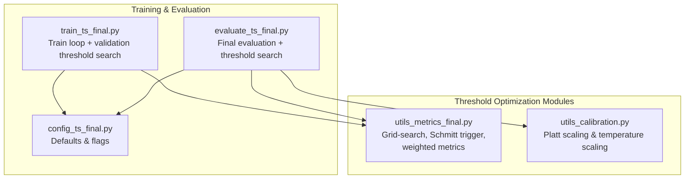
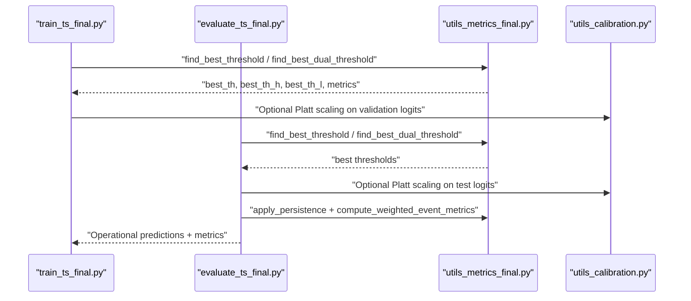
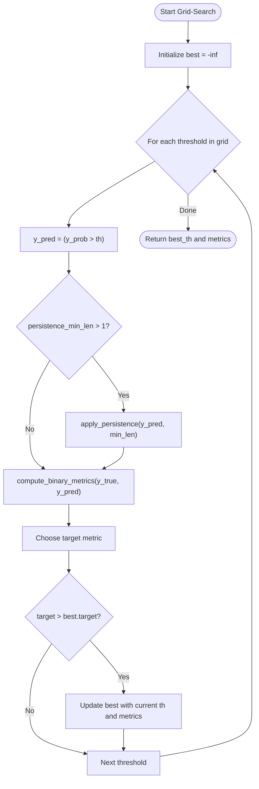
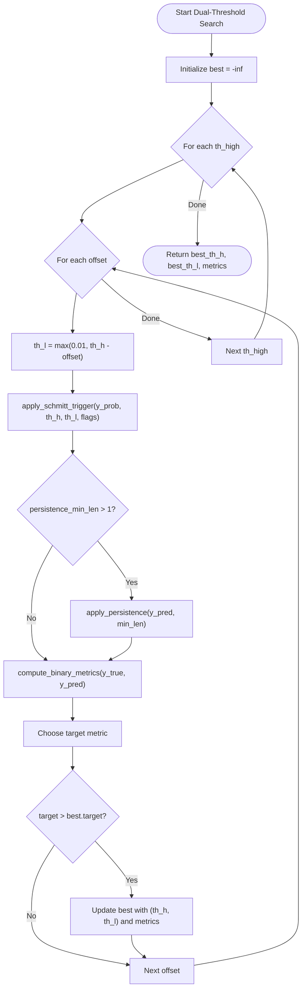
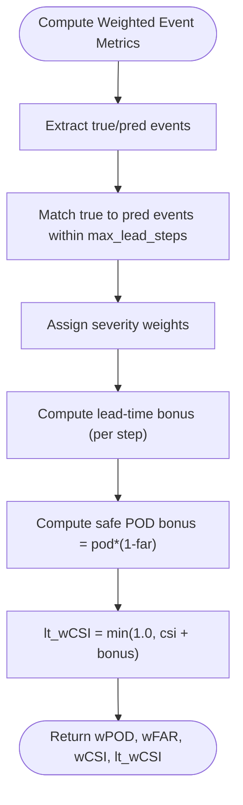
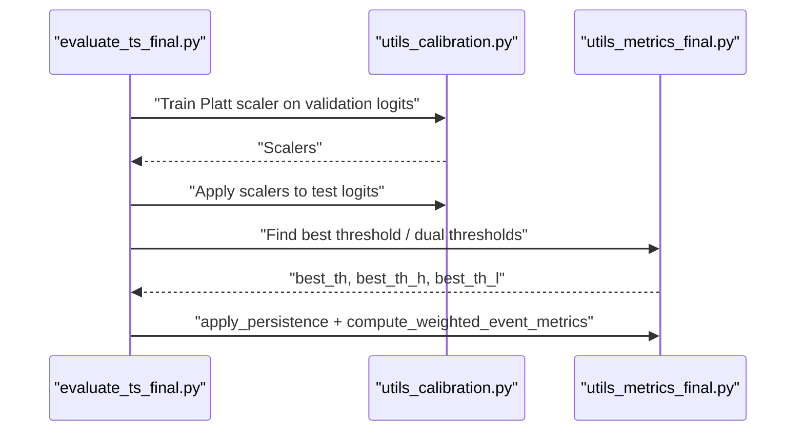
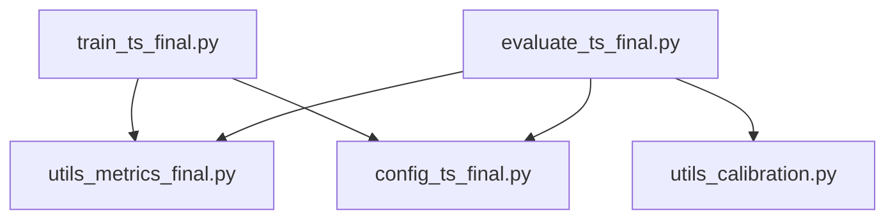

# Threshold Optimization & Selection

<cite>
**Referenced Files in This Document**
- [utils_metrics_final.py](file://utils_metrics_final.py)
- [evaluate_ts_final.py](file://evaluate_ts_final.py)
- [train_ts_final.py](file://train_ts_final.py)
- [config_ts_final.py](file://config_ts_final.py)
- [utils_calibration.py](file://utils_calibration.py)
</cite>

## Table of Contents
1. [Introduction](#introduction)
2. [Project Structure](#project-structure)
3. [Core Components](#core-components)
4. [Architecture Overview](#architecture-overview)
5. [Detailed Component Analysis](#detailed-component-analysis)
6. [Dependency Analysis](#dependency-analysis)
7. [Performance Considerations](#performance-considerations)
8. [Troubleshooting Guide](#troubleshooting-guide)
9. [Conclusion](#conclusion)
10. [Appendices](#appendices)

## Introduction
This document explains threshold optimization and selection methods used in thunderstorm nowcasting within the project. It covers:
- Grid-search algorithms for optimal probability thresholds that maximize specific metrics (F1, F2, ETS, SEDI) and custom combinations (SAFE_CSI, weighted CSI, lead-time-weighted CSI).
- Dual-threshold Schmitt trigger optimization with systematic search over high and low threshold pairs.
- Operational scenarios and selection criteria, including aviation safety where F2 scoring prioritizes detection over false alarms.
- Weighted threshold optimization incorporating event severity and lead time considerations.
- Practical examples, convergence criteria, and trade-offs among strategies.

## Project Structure
The threshold optimization pipeline spans several modules:
- Metrics and post-processing utilities define the core optimization routines and scoring functions.
- Training and evaluation scripts orchestrate threshold search on validation sets and apply the resulting thresholds to produce operational predictions.
- Configuration centralizes operational defaults and runtime flags that control threshold selection behavior.

**Diagram sources**
- [utils_metrics_final.py:192-314](file://utils_metrics_final.py#L192-L314)
- [evaluate_ts_final.py:525-548](file://evaluate_ts_final.py#L525-L548)
- [train_ts_final.py:510-532](file://train_ts_final.py#L510-L532)
- [config_ts_final.py:87-94](file://config_ts_final.py#L87-L94)

**Section sources**
- [utils_metrics_final.py:192-314](file://utils_metrics_final.py#L192-L314)
- [evaluate_ts_final.py:525-548](file://evaluate_ts_final.py#L525-L548)
- [train_ts_final.py:510-532](file://train_ts_final.py#L510-L532)
- [config_ts_final.py:87-94](file://config_ts_final.py#L87-L94)

## Core Components
- Grid-search threshold optimization:
  - Single-threshold grid search maximizes a chosen metric (F2, F1, ETS, SEDI, SAFE_CSI, weighted CSI, lead-time-weighted CSI, or balanced weighted POD-FAR).
  - Supports optional persistence filtering prior to evaluation.
- Dual-threshold Schmitt trigger optimization:
  - Systematic grid over high and low thresholds with hysteresis to reduce temporal chatter.
  - Supports rapid cooling flags to bypass threshold logic when needed.
- Weighted metrics:
  - Event-level metrics weighted by severity and lead time, including lead-time bonus and safe POD bonus adjustments.
- Calibration:
  - Optional Platt scaling and temperature scaling to improve probability reliability before thresholding.

**Section sources**
- [utils_metrics_final.py:192-240](file://utils_metrics_final.py#L192-L240)
- [utils_metrics_final.py:243-314](file://utils_metrics_final.py#L243-L314)
- [utils_metrics_final.py:575-650](file://utils_metrics_final.py#L575-L650)
- [utils_calibration.py:63-110](file://utils_calibration.py#L63-L110)

## Architecture Overview
The threshold optimization workflow integrates with training and evaluation loops. Validation sets are used to derive thresholds to avoid leakage to the test set. The evaluation script demonstrates both single-threshold and dual-threshold strategies, including severe fast-track threshold tuning.

**Diagram sources**
- [train_ts_final.py:510-532](file://train_ts_final.py#L510-L532)
- [evaluate_ts_final.py:525-548](file://evaluate_ts_final.py#L525-L548)
- [utils_metrics_final.py:192-314](file://utils_metrics_final.py#L192-L314)
- [utils_calibration.py:63-110](file://utils_calibration.py#L63-L110)

## Detailed Component Analysis

### Grid-Search Threshold Optimization
- Purpose: Find the single probability threshold that maximizes a chosen metric on validation data.
- Inputs:
  - y_true: ground truth labels.
  - y_prob: model probabilities (smoothed if desired).
  - ths: optional grid of thresholds; default range is used if not provided.
  - metric: target metric name (F2, F1, ETS, SEDI, SAFE_CSI, wCSI_evt, lt-wCSI_evt, wPOD_evt).
  - persistence_min_len: optional persistence filter applied before evaluation.
  - severity_labels: severity mapping for weighted metrics.
  - max_lead_steps: maximum lead steps for event-level computations.
- Output: best threshold and associated metrics.

**Diagram sources**
- [utils_metrics_final.py:192-240](file://utils_metrics_final.py#L192-L240)

**Section sources**
- [utils_metrics_final.py:192-240](file://utils_metrics_final.py#L192-L240)

### Dual-Threshold Schmitt Trigger Optimization
- Purpose: Optimize high and low thresholds for hysteresis triggering to reduce temporal chatter.
- Inputs:
  - y_true, y_prob, ths_high, ths_low_offsets, metric, persistence_min_len, severity_labels, max_lead_steps, rapid_cooling_flags.
- Strategy:
  - Sweep th_high over a grid.
  - For each th_high, sweep low offsets to compute th_low = max(0.01, th_high - offset).
  - Apply Schmitt trigger with (th_high, th_low).
  - Optionally apply persistence filtering.
  - Evaluate chosen metric and track best pair.
- Output: best_th_high, best_th_low, and associated metrics.

**Diagram sources**
- [utils_metrics_final.py:263-314](file://utils_metrics_final.py#L263-L314)

**Section sources**
- [utils_metrics_final.py:263-314](file://utils_metrics_final.py#L263-L314)

### Weighted Metrics and Lead-Time Adjustments
- Weighted event metrics:
  - Weight by storm severity and lead time.
  - Lead-time bonus: +10% per step of lead time (early detection).
  - Safe POD bonus: pod * (1 - far) with additional CSI bonus if thresholds are met.
- Functions:
  - compute_weighted_event_metrics: computes wPOD, wFAR, wCSI, and lead-time-weighted CSI.
  - compute_binary_metrics: computes POD, FAR, CSI, ETS, SEDI, F1, F2 from binary predictions.

**Diagram sources**
- [utils_metrics_final.py:575-650](file://utils_metrics_final.py#L575-L650)

**Section sources**
- [utils_metrics_final.py:575-650](file://utils_metrics_final.py#L575-L650)

### Calibration and Threshold Application
- Calibration:
  - Optional Platt scaling on validation logits to improve probability reliability.
  - Temperature scaling can be used to calibrate probabilities post-training.
- Threshold application:
  - After deriving thresholds from validation, apply to test probabilities.
  - Optional severe fast-track threshold to prioritize severe events.

**Diagram sources**
- [evaluate_ts_final.py:505-548](file://evaluate_ts_final.py#L505-L548)
- [utils_calibration.py:63-110](file://utils_calibration.py#L63-L110)
- [utils_metrics_final.py:192-314](file://utils_metrics_final.py#L192-L314)

**Section sources**
- [evaluate_ts_final.py:505-548](file://evaluate_ts_final.py#L505-L548)
- [utils_calibration.py:63-110](file://utils_calibration.py#L63-L110)

## Dependency Analysis
- Training and evaluation scripts depend on the metrics module for threshold optimization and weighted metrics.
- Configuration controls whether to use Schmitt trigger, which metric to optimize, smoothing, persistence, and severe fast-track behavior.
- Calibration utilities complement threshold selection by improving probability reliability.

**Diagram sources**
- [train_ts_final.py:33-39](file://train_ts_final.py#L33-L39)
- [evaluate_ts_final.py:29-33](file://evaluate_ts_final.py#L29-L33)
- [config_ts_final.py:87-94](file://config_ts_final.py#L87-L94)

**Section sources**
- [train_ts_final.py:33-39](file://train_ts_final.py#L33-L39)
- [evaluate_ts_final.py:29-33](file://evaluate_ts_final.py#L29-L33)
- [config_ts_final.py:87-94](file://config_ts_final.py#L87-L94)

## Performance Considerations
- Grid density:
  - Single-threshold grid uses a default range with a fixed number of points.
  - Dual-threshold grid searches over high thresholds and low offsets; adjust grid sizes to balance accuracy and cost.
- Persistence filtering:
  - Increasing persistence minimum length reduces short false alarms but may delay detection.
- Smoothing:
  - Temporal smoothing (EMA or rolling mean) stabilizes probability sequences and reduces isolated spikes.
- Calibration:
  - Platt scaling and temperature scaling improve reliability of probabilities, which can improve threshold performance indirectly.

[No sources needed since this section provides general guidance]

## Troubleshooting Guide
- Validation leakage:
  - Thresholds must be derived from validation sets to avoid leakage to test performance.
- Convergence and stopping criteria:
  - The grid-search functions do not implement explicit stopping criteria; they iterate over predefined grids. Adjust grid ranges and densities to achieve desired precision.
- Imbalanced datasets:
  - F2 scoring prioritizes detection over false alarms and is suitable for aviation safety requirements.
- Weighted metrics:
  - Ensure severity labels are provided when using weighted metrics; otherwise, the functions will skip those computations.
- Rapid cooling:
  - When rapid cooling flags are present, Schmitt trigger bypasses threshold logic and triggers immediately; confirm flag usage aligns with intended behavior.

**Section sources**
- [evaluate_ts_final.py:525-548](file://evaluate_ts_final.py#L525-L548)
- [utils_metrics_final.py:192-240](file://utils_metrics_final.py#L192-L240)
- [utils_metrics_final.py:243-314](file://utils_metrics_final.py#L243-L314)

## Conclusion
The project implements robust threshold optimization via grid-search over single and dual thresholds, with support for multiple metrics and weighted event-level scoring. Operational defaults in configuration enable Schmitt-trigger hysteresis, persistence filtering, and severe fast-track behavior. Calibration utilities further refine probability reliability. These components collectively support tailored threshold strategies for diverse forecasting objectives and risk tolerances.

[No sources needed since this section summarizes without analyzing specific files]

## Appendices

### Practical Examples and Usage Patterns
- Single-threshold optimization:
  - Use validation probabilities to find the threshold that maximizes the configured metric.
  - Apply persistence filtering if needed before evaluation.
- Dual-threshold Schmitt trigger:
  - Sweep high thresholds and low offsets; apply hysteresis and optional persistence; select the pair maximizing the chosen metric.
- Weighted metrics:
  - Provide severity labels to compute weighted CSI and lead-time-weighted CSI; use these for operational threshold selection when event severity and lead time matter.
- Calibration:
  - Train a Platt scaler on validation logits and apply to test logits before thresholding.

**Section sources**
- [evaluate_ts_final.py:525-548](file://evaluate_ts_final.py#L525-L548)
- [train_ts_final.py:510-532](file://train_ts_final.py#L510-L532)
- [utils_metrics_final.py:192-314](file://utils_metrics_final.py#L192-L314)
- [utils_metrics_final.py:575-650](file://utils_metrics_final.py#L575-L650)
- [utils_calibration.py:63-110](file://utils_calibration.py#L63-L110)

### Configuration Flags Relevant to Threshold Selection
- USE_SCHMITT_TRIGGER: Enables dual-threshold Schmitt trigger optimization.
- THRESHOLD_METRIC: Metric to optimize during threshold selection (e.g., F2, SAFE_CSI, wCSI_evt, lt-wCSI_evt, wPOD_evt).
- MIN_THRESHOLD: Lower bound for threshold grids.
- PERSISTENCE_MIN_LEN: Minimum event duration for persistence filtering.
- SMOOTH_WINDOW and SMOOTH_METHOD: Temporal smoothing parameters.
- SEVERE_FAST_TRACK: Enables separate severe threshold tuning.

**Section sources**
- [config_ts_final.py:87-94](file://config_ts_final.py#L87-L94)
- [config_ts_final.py:96-104](file://config_ts_final.py#L96-L104)