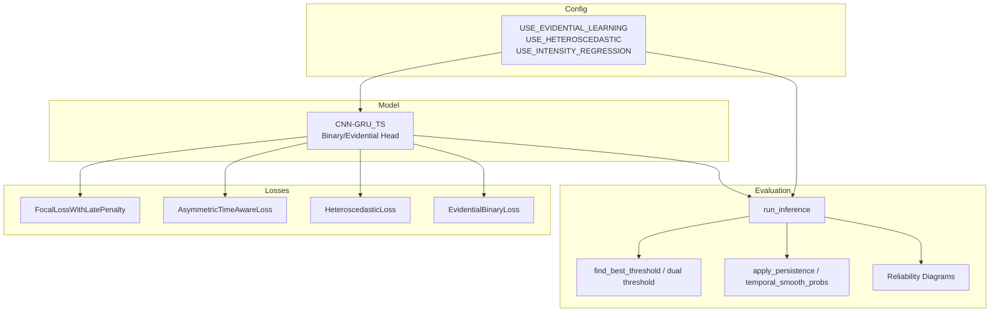
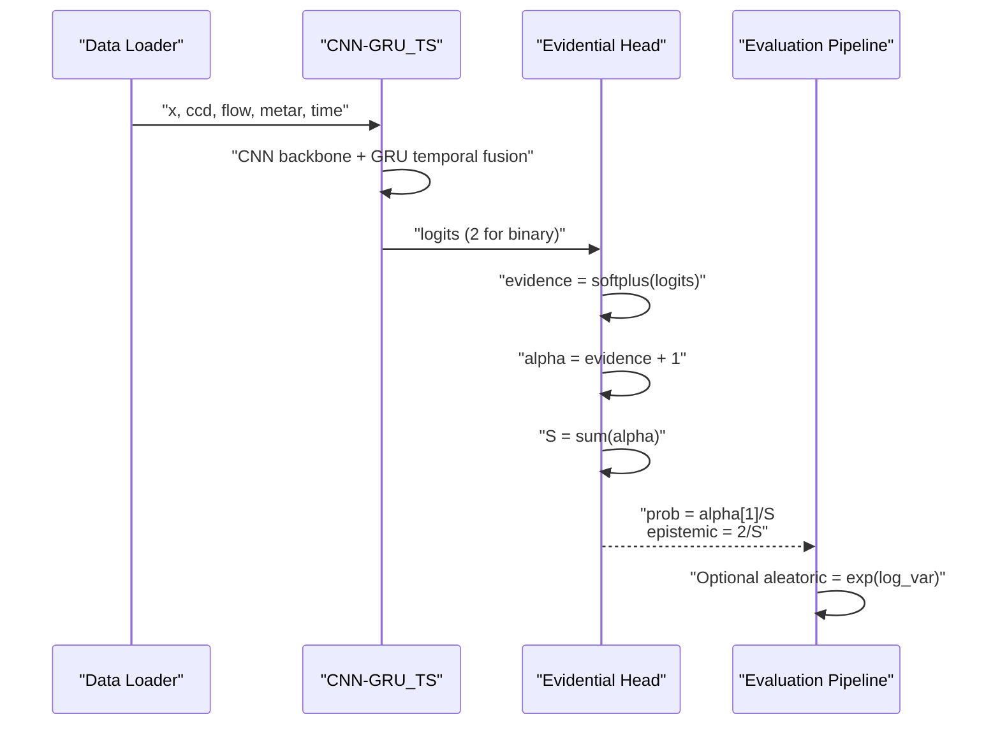
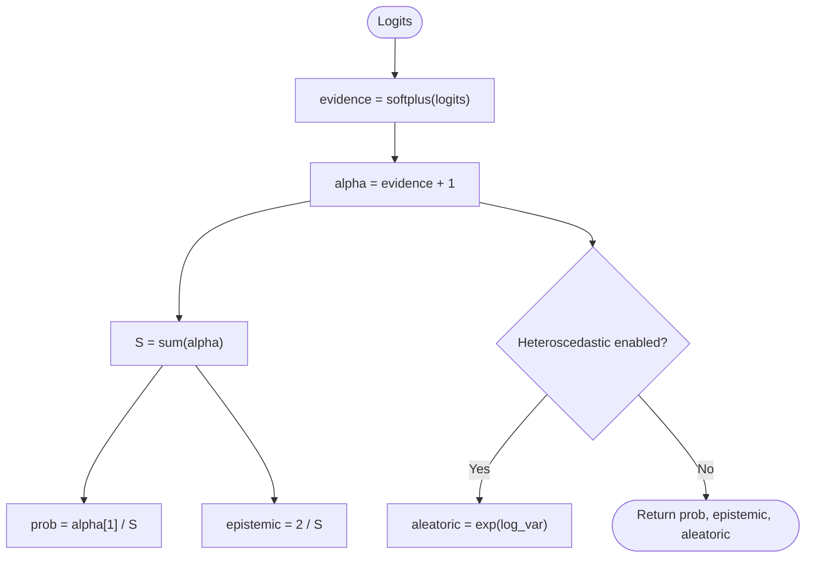
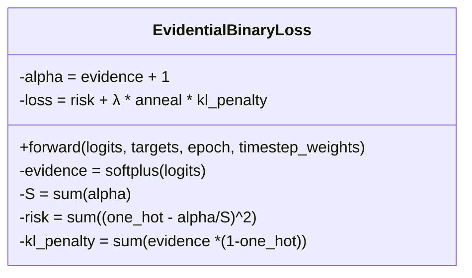
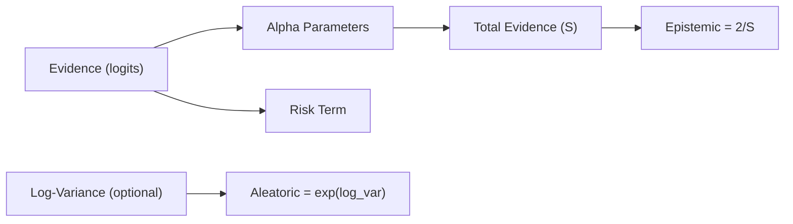
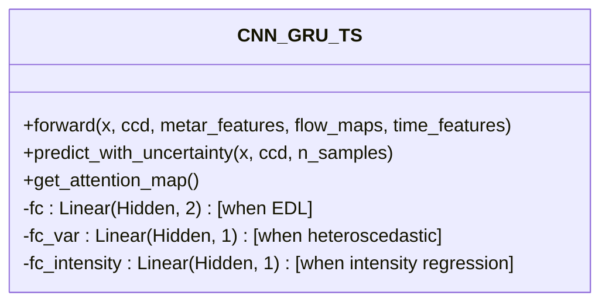
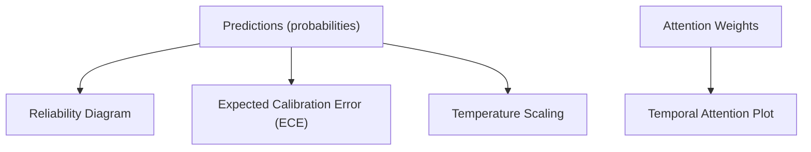
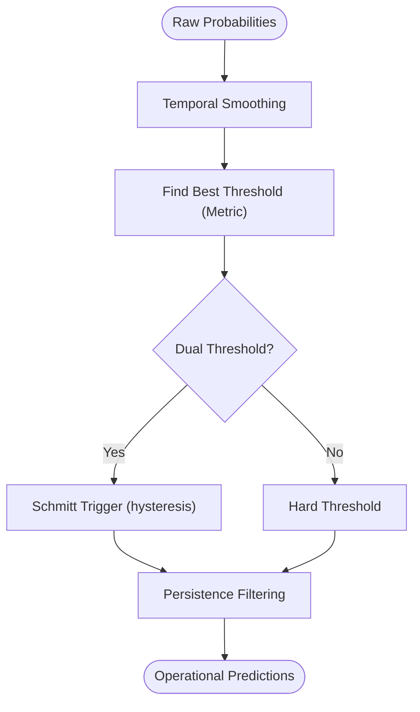
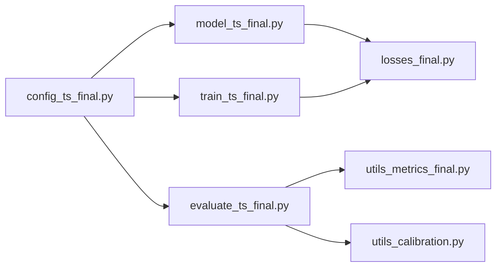

# Evidential Deep Learning & Beta Distribution Modeling

<cite>
**Referenced Files in This Document**
- [model_ts_final.py](file://model_ts_final.py)
- [losses_final.py](file://losses_final.py)
- [evaluate_ts_final.py](file://evaluate_ts_final.py)
- [utils_calibration.py](file://utils_calibration.py)
- [utils_metrics_final.py](file://utils_metrics_final.py)
- [config_ts_final.py](file://config_ts_final.py)
- [train_ts_final.py](file://train_ts_final.py)
</cite>

## Table of Contents
1. [Introduction](#introduction)
2. [Project Structure](#project-structure)
3. [Core Components](#core-components)
4. [Architecture Overview](#architecture-overview)
5. [Detailed Component Analysis](#detailed-component-analysis)
6. [Dependency Analysis](#dependency-analysis)
7. [Performance Considerations](#performance-considerations)
8. [Troubleshooting Guide](#troubleshooting-guide)
9. [Conclusion](#conclusion)
10. [Appendices](#appendices)

## Introduction
This document explains the evidential deep learning (EDL) approach used for uncertainty quantification in the thunderstorm nowcasting system. It covers the theoretical foundation of EDL using Dirichlet distribution parameters (alpha, beta) to represent belief functions and uncertainty, the Beta distribution parameterization for binary classification, uncertainty decomposition into epistemic and aleatoric components, and the practical implementation within the CNN-GRU architecture. It also documents uncertainty visualization, reliability assessment, and operational guidance for uncertainty-aware decision-making.

## Project Structure
The repository implements a CNN-GRU-based nowcasting system with optional evidential heads and uncertainty modeling. Key modules:
- Model: CNN-GRU with spatial skip connections, optical flow, METAR features, and time features
- Losses: Focal loss with late penalty, asymmetric time-aware loss, heteroscedastic loss, and evidential binary loss
- Evaluation: Inference, threshold selection, temporal smoothing, persistence filtering, reliability diagrams, and uncertainty visualization
- Utilities: Metrics, calibration, seasonal breakdown, and failure analysis
- Configuration: Flags enabling EDL, heteroscedastic uncertainty, intensity regression, and post-processing



**Diagram sources**
- [model_ts_final.py:68-335](file://model_ts_final.py#L68-L335)
- [losses_final.py:13-258](file://losses_final.py#L13-L258)
- [evaluate_ts_final.py:285-501](file://evaluate_ts_final.py#L285-L501)
- [utils_metrics_final.py:23-760](file://utils_metrics_final.py#L23-L760)
- [config_ts_final.py:68-131](file://config_ts_final.py#L68-L131)

**Section sources**
- [model_ts_final.py:68-335](file://model_ts_final.py#L68-L335)
- [losses_final.py:13-258](file://losses_final.py#L13-L258)
- [evaluate_ts_final.py:285-501](file://evaluate_ts_final.py#L285-L501)
- [utils_metrics_final.py:23-760](file://utils_metrics_final.py#L23-L760)
- [config_ts_final.py:68-131](file://config_ts_final.py#L68-L131)

## Core Components
- CNN-GRU backbone with MobileNetV2, spatial skip connections, optical flow, METAR features, and month/time features
- Binary classifier head with optional evidential parameterization (2 logits interpreted as Dirichlet parameters)
- Optional heteroscedastic aleatoric head (log-variance)
- Optional intensity regression head
- Evidential uncertainty estimation via Dirichlet parameters and risk decomposition

**Section sources**
- [model_ts_final.py:68-201](file://model_ts_final.py#L68-L201)
- [model_ts_final.py:182-187](file://model_ts_final.py#L182-L187)
- [model_ts_final.py:188-197](file://model_ts_final.py#L188-L197)

## Architecture Overview
The system integrates temporal dynamics (GRU) with spatial features extracted by a CNN backbone. The model outputs logits that are transformed into evidence parameters for EDL when enabled. The evidential head produces:
- Evidence logits mapped to alpha parameters via softplus
- Alpha parameters aggregated to form a Dirichlet distribution
- Predictive probability and epistemic uncertainty from the Dirichlet normalization
- Optional aleatoric uncertainty via heteroscedastic variance



**Diagram sources**
- [model_ts_final.py:274-335](file://model_ts_final.py#L274-L335)
- [losses_final.py:195-255](file://losses_final.py#L195-L255)

## Detailed Component Analysis

### Theoretical Foundation: Evidential Deep Learning and Dirichlet Parameters
- The model’s binary head outputs 2 logits interpreted as evidence parameters for a Dirichlet distribution over two classes (0 and 1).
- Evidence is transformed via softplus to ensure positivity, then shifted by adding 1 to define alpha parameters.
- The sum S of alpha parameters defines the “total evidence” or normalization scale.
- Predictive probability for class 1 is alpha[1]/S.
- Epistemic uncertainty is encoded by 2/S, reflecting inverse relationship with total evidence.



**Diagram sources**
- [model_ts_final.py:287-302](file://model_ts_final.py#L287-L302)
- [losses_final.py:215-217](file://losses_final.py#L215-L217)

**Section sources**
- [model_ts_final.py:287-302](file://model_ts_final.py#L287-L302)
- [losses_final.py:215-217](file://losses_final.py#L215-L217)

### Beta Distribution Parameterization for Binary Classification
- For binary classification, the Dirichlet distribution reduces to a Beta distribution with parameters alpha_0 and alpha_1.
- The predictive probability is the posterior mean of the Beta distribution: alpha_1 / S.
- Epistemic uncertainty is inversely proportional to S (more total evidence implies less uncertainty).
- The EDL risk term corresponds to expected mean square error risk, and the KL regularization encourages evidence to align with the correct class.



**Diagram sources**
- [losses_final.py:195-255](file://losses_final.py#L195-L255)

**Section sources**
- [losses_final.py:195-255](file://losses_final.py#L195-L255)

### Uncertainty Decomposition: Epistemic vs Aleatoric
- Epistemic uncertainty: captured by 2/S from the Dirichlet normalization; reflects model’s lack of certainty due to limited evidence.
- Aleatoric uncertainty: modeled either implicitly via EDL risk or explicitly via heteroscedastic variance (log_var). When enabled, aleatoric is exp(log_var).
- The model can output both uncertainties simultaneously when evidential learning is active and heteroscedastic is enabled.



**Diagram sources**
- [model_ts_final.py:287-302](file://model_ts_final.py#L287-L302)
- [model_ts_final.py:188-190](file://model_ts_final.py#L188-L190)

**Section sources**
- [model_ts_final.py:287-302](file://model_ts_final.py#L287-L302)
- [model_ts_final.py:188-190](file://model_ts_final.py#L188-L190)

### Practical Implementation in CNN-GRU Architecture
- Binary head outputs 2 logits when evidential learning is enabled; otherwise outputs 1 logit for sigmoid probability.
- The forward pass computes temporal attention weights for interpretability and returns a tuple when multiple heads are active.
- The predict_with_uncertainty method transforms logits into evidence, computes alpha and S, and returns predictive probability, epistemic uncertainty, and optional aleatoric uncertainty.



**Diagram sources**
- [model_ts_final.py:68-201](file://model_ts_final.py#L68-L201)
- [model_ts_final.py:274-335](file://model_ts_final.py#L274-L335)

**Section sources**
- [model_ts_final.py:68-201](file://model_ts_final.py#L68-L201)
- [model_ts_final.py:274-335](file://model_ts_final.py#L274-L335)

### Training Integration and Loss Functions
- The training script selects the EvidentialBinaryLoss when USE_EVIDENTIAL_LEARNING is enabled.
- The loss expects 2 logits and computes evidence, alpha, S, risk, and KL regularization with annealing.
- Validation uses the same additive weighting scheme as training for fair comparison.

```mermaid
sequenceDiagram
participant Train as "Training Loop"
participant Model as "CNN-GRU_TS"
participant Loss as "EvidentialBinaryLoss"
participant Opt as "Optimizer"
Train->>Model : "Forward pass"
Model-->>Train : "logits (2)"
Train->>Loss : "logits, targets, epoch, timestep_weights"
Loss-->>Train : "loss"
Train->>Opt : "Backward + step"
```

**Diagram sources**
- [train_ts_final.py:290-307](file://train_ts_final.py#L290-L307)
- [losses_final.py:195-255](file://losses_final.py#L195-L255)

**Section sources**
- [train_ts_final.py:290-307](file://train_ts_final.py#L290-L307)
- [losses_final.py:195-255](file://losses_final.py#L195-L255)

### Uncertainty Visualization and Reliability Assessment
- Reliability diagrams compare uncalibrated vs calibrated probabilities using Expected Calibration Error (ECE).
- Temperature scaling can be applied to improve reliability when Platt scaling is disabled under EDL.
- Attention maps visualize temporal importance across the sequence.



**Diagram sources**
- [utils_calibration.py:24-106](file://utils_calibration.py#L24-L106)
- [utils_calibration.py:112-167](file://utils_calibration.py#L112-L167)
- [evaluate_ts_final.py:146-184](file://evaluate_ts_final.py#L146-L184)

**Section sources**
- [utils_calibration.py:24-106](file://utils_calibration.py#L24-L106)
- [utils_calibration.py:112-167](file://utils_calibration.py#L112-L167)
- [evaluate_ts_final.py:146-184](file://evaluate_ts_final.py#L146-L184)

### Operational Decision Making and Threshold Selection
- Threshold selection is performed on smoothed probabilities using a configurable metric (e.g., weighted CSI with lead-time bonus).
- Dual thresholds (high/low) can be used with a Schmitt trigger to reduce temporal chatter.
- Persistence filtering removes short false alarms, with optional fast-track for severe events.



**Diagram sources**
- [evaluate_ts_final.py:508-548](file://evaluate_ts_final.py#L508-L548)
- [utils_metrics_final.py:192-241](file://utils_metrics_final.py#L192-L241)
- [utils_metrics_final.py:243-314](file://utils_metrics_final.py#L243-L314)
- [utils_metrics_final.py:50-77](file://utils_metrics_final.py#L50-L77)

**Section sources**
- [evaluate_ts_final.py:508-548](file://evaluate_ts_final.py#L508-L548)
- [utils_metrics_final.py:192-241](file://utils_metrics_final.py#L192-L241)
- [utils_metrics_final.py:243-314](file://utils_metrics_final.py#L243-L314)
- [utils_metrics_final.py:50-77](file://utils_metrics_final.py#L50-L77)

## Dependency Analysis
- The model’s evidential head depends on the binary output head and optional heteroscedastic head.
- The training loop conditionally selects EvidentialBinaryLoss when USE_EVIDENTIAL_LEARNING is enabled.
- Evaluation relies on threshold selection utilities and persistence filtering.



**Diagram sources**
- [config_ts_final.py:68-131](file://config_ts_final.py#L68-L131)
- [model_ts_final.py:182-187](file://model_ts_final.py#L182-L187)
- [train_ts_final.py:290-307](file://train_ts_final.py#L290-L307)
- [evaluate_ts_final.py:508-548](file://evaluate_ts_final.py#L508-L548)

**Section sources**
- [config_ts_final.py:68-131](file://config_ts_final.py#L68-L131)
- [model_ts_final.py:182-187](file://model_ts_final.py#L182-L187)
- [train_ts_final.py:290-307](file://train_ts_final.py#L290-L307)
- [evaluate_ts_final.py:508-548](file://evaluate_ts_final.py#L508-L548)

## Performance Considerations
- CPU inference target is achieved by reducing GRU layers and dropout, freezing backbone layers, and optimizing feature projections.
- Evidential uncertainty is computed deterministically in a single forward pass, avoiding expensive Monte Carlo dropout runs.
- Heteroscedastic aleatoric uncertainty is optional to balance computational cost and calibration gains.

[No sources needed since this section provides general guidance]

## Troubleshooting Guide
- If probabilities appear overconfident, consider disabling Platt scaling (incompatible with EDL) and applying temperature scaling instead.
- If epistemic uncertainty seems low despite high aleatoric variance, verify that heteroscedastic head is enabled and that log_var is being learned.
- If attention maps are unexpected, ensure eval mode is respected and attention weights are detached and moved to CPU when needed.

**Section sources**
- [evaluate_ts_final.py:510-523](file://evaluate_ts_final.py#L510-L523)
- [model_ts_final.py:243-244](file://model_ts_final.py#L243-L244)

## Conclusion
The system employs evidential deep learning to produce predictive probabilities and epistemic uncertainty from a CNN-GRU architecture. The Dirichlet parameterization (alpha, beta) enables principled uncertainty quantification, while optional heteroscedastic aleatoric uncertainty complements the model. The evaluation pipeline provides robust threshold selection, reliability assessment, and uncertainty-aware post-processing for operational thunderstorm nowcasting.

[No sources needed since this section summarizes without analyzing specific files]

## Appendices

### Appendix A: Key Configuration Flags
- USE_EVIDENTIAL_LEARNING: Enables EDL binary head and evidential uncertainty estimation
- USE_HETEROSCEDASTIC: Enables aleatoric uncertainty head (log-variance)
- USE_INTENSITY_REGRESSION: Adds continuous severity score regression head
- USE_SCHMITT_TRIGGER: Enables hysteresis-based dual-threshold triggering
- USE_PLATT_SCALING: Controls Platt scaling; disabled under EDL

**Section sources**
- [config_ts_final.py:68-131](file://config_ts_final.py#L68-L131)