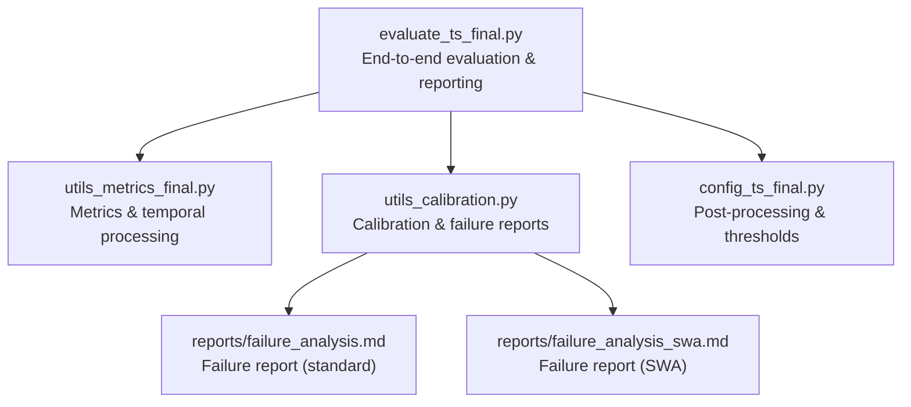
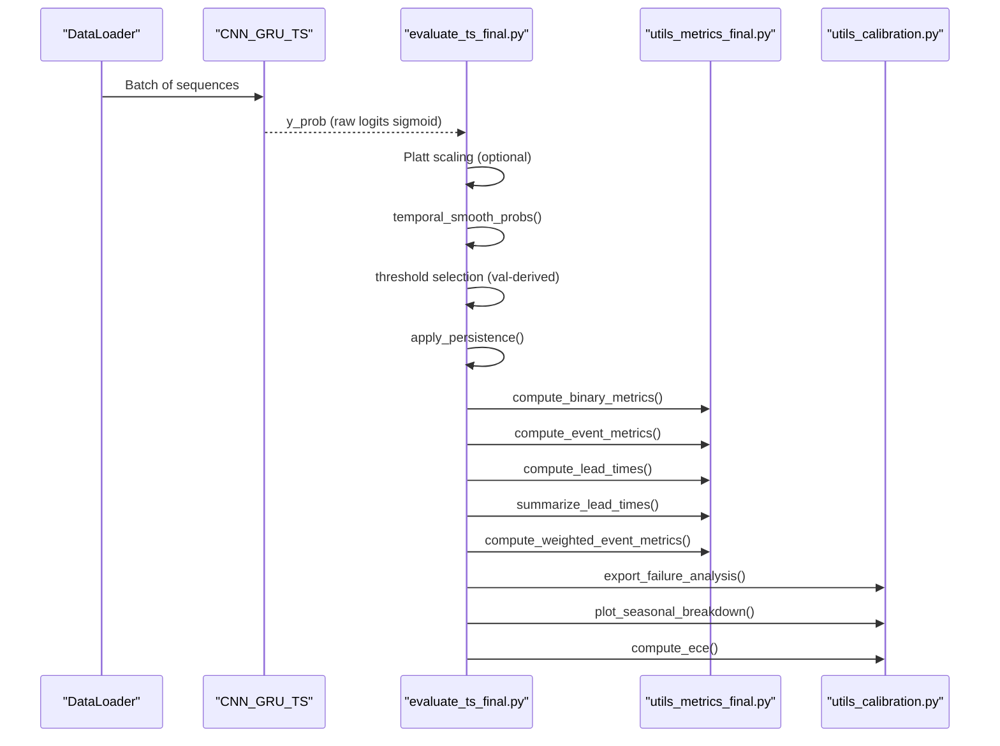
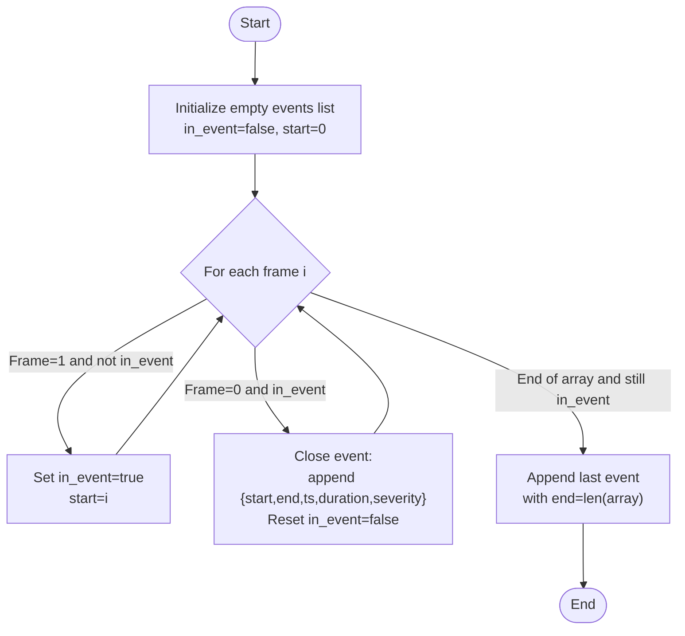
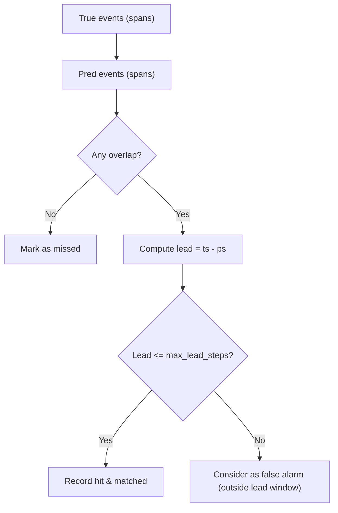
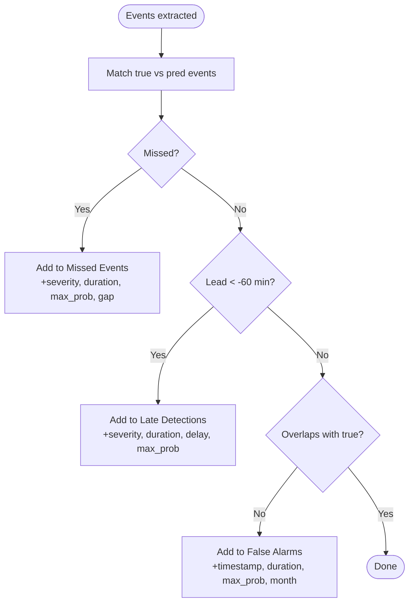
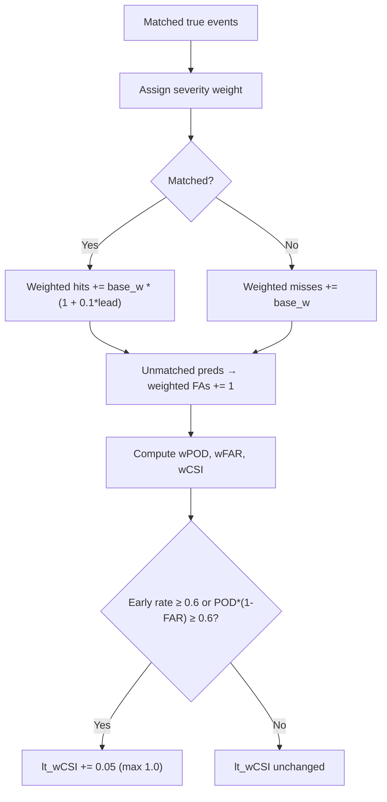
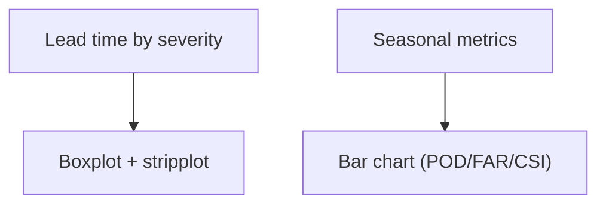
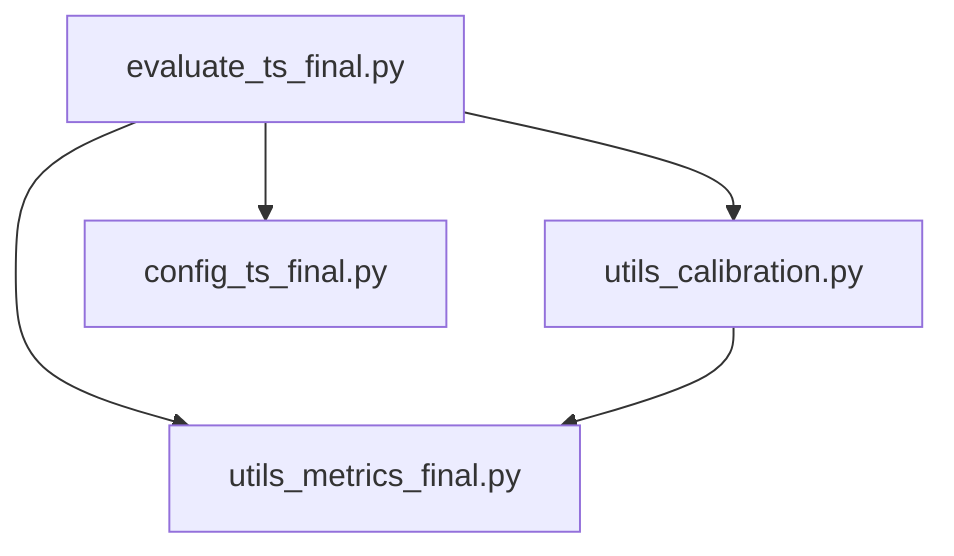

# Failure Case Analysis & Error Characterization

<cite>
**Referenced Files in This Document**
- [evaluate_ts_final.py](file://evaluate_ts_final.py)
- [utils_metrics_final.py](file://utils_metrics_final.py)
- [utils_calibration.py](file://utils_calibration.py)
- [config_ts_final.py](file://config_ts_final.py)
- [reports/failure_analysis.md](file://reports/failure_analysis.md)
- [reports/failure_analysis_swa.md](file://reports/failure_analysis_swa.md)
- [extras/analyze_predictions.py](file://extras/analyze_predictions.py)
</cite>

## Table of Contents
1. [Introduction](#introduction)
2. [Project Structure](#project-structure)
3. [Core Components](#core-components)
4. [Architecture Overview](#architecture-overview)
5. [Detailed Component Analysis](#detailed-component-analysis)
6. [Dependency Analysis](#dependency-analysis)
7. [Performance Considerations](#performance-considerations)
8. [Troubleshooting Guide](#troubleshooting-guide)
9. [Conclusion](#conclusion)
10. [Appendices](#appendices)

## Introduction
This document explains the automated failure case analysis and error characterization pipeline for the thunderstorm nowcasting system. It covers:
- Systematic categorization of prediction failures into three types: missed events (false negatives), late detections (>60 minutes delay), and false alarms (false positives).
- The event span extraction algorithm that converts binary predictions into contiguous storm events with temporal indexing and duration calculation.
- Overlap detection and temporal alignment mechanisms for matching predicted and true events, including lead time analysis.
- Automated markdown report generation with structured formatting, statistical summaries, and failure pattern identification.
- Severity-based failure analysis, temporal clustering of errors, and seasonal failure trends.
- Guidance on interpreting failure reports, identifying systemic weaknesses, and using failure analysis for model improvement and threshold optimization.
- Integration with uncertainty scores for failure attribution and uncertainty-aware error analysis.

## Project Structure
The failure analysis pipeline integrates evaluation, metrics computation, and reporting utilities:
- Evaluation script orchestrates inference, threshold optimization, persistence filtering, and generates diagnostic plots and bootstrap statistics.
- Metrics utilities implement temporal smoothing, persistence filtering, event-level metrics, lead time computation, and weighted event metrics.
- Calibration utilities provide reliability analysis, seasonal breakdown, and automated failure report generation.
- Configuration defines post-processing thresholds, lead time limits, and uncertainty modeling options.
- Reports present human-readable failure analyses for standard and SWA variants.

**Diagram sources**
- [evaluate_ts_final.py:361-800](file://evaluate_ts_final.py#L361-L800)
- [utils_metrics_final.py:1-760](file://utils_metrics_final.py#L1-L760)
- [utils_calibration.py:275-420](file://utils_calibration.py#L275-L420)
- [config_ts_final.py:16-208](file://config_ts_final.py#L16-L208)
- [reports/failure_analysis.md:1-71](file://reports/failure_analysis.md#L1-L71)
- [reports/failure_analysis_swa.md:1-79](file://reports/failure_analysis_swa.md#L1-L79)

**Section sources**
- [evaluate_ts_final.py:361-800](file://evaluate_ts_final.py#L361-L800)
- [utils_metrics_final.py:1-760](file://utils_metrics_final.py#L1-L760)
- [utils_calibration.py:275-420](file://utils_calibration.py#L275-L420)
- [config_ts_final.py:16-208](file://config_ts_final.py#L16-L208)
- [reports/failure_analysis.md:1-71](file://reports/failure_analysis.md#L1-L71)
- [reports/failure_analysis_swa.md:1-79](file://reports/failure_analysis_swa.md#L1-L79)

## Core Components
- Event span extraction: Converts binary sequences into contiguous storm events with start/end indices, timestamps, durations, and severity labels.
- Overlap detection and lead time analysis: Matches predicted events to true events, computes lead times, and classifies timing failures.
- Failure categorization: Missed events, late detections (>60 minutes), and false alarms.
- Automated markdown report generation: Structured summaries, severity breakdowns, and failure pattern insights.
- Severity-weighted metrics and temporal clustering: Weighted event metrics and lead-time bonuses improve sensitivity to early detections.
- Seasonal failure trends: Seasonal performance breakdown supports targeted improvements.
- Uncertainty-aware analysis: Epistemic uncertainty flags and reliability diagnostics support failure attribution.

**Section sources**
- [utils_metrics_final.py:322-393](file://utils_metrics_final.py#L322-L393)
- [utils_metrics_final.py:395-477](file://utils_metrics_final.py#L395-L477)
- [utils_metrics_final.py:575-650](file://utils_metrics_final.py#L575-L650)
- [utils_calibration.py:275-420](file://utils_calibration.py#L275-L420)
- [utils_calibration.py:174-244](file://utils_calibration.py#L174-L244)
- [evaluate_ts_final.py:625-713](file://evaluate_ts_final.py#L625-L713)

## Architecture Overview
The evaluation pipeline performs inference, applies temporal smoothing and persistence filtering, computes metrics, and exports failure reports and plots.

**Diagram sources**
- [evaluate_ts_final.py:500-620](file://evaluate_ts_final.py#L500-L620)
- [utils_metrics_final.py:120-190](file://utils_metrics_final.py#L120-L190)
- [utils_metrics_final.py:338-393](file://utils_metrics_final.py#L338-L393)
- [utils_metrics_final.py:395-477](file://utils_metrics_final.py#L395-L477)
- [utils_metrics_final.py:575-650](file://utils_metrics_final.py#L575-L650)
- [utils_calibration.py:275-386](file://utils_calibration.py#L275-L386)

## Detailed Component Analysis

### Event Span Extraction Algorithm
The algorithm converts binary prediction/truth arrays into contiguous storm events with:
- Start and end indices
- Start timestamp
- Duration in frames
- Severity label

**Diagram sources**
- [utils_calibration.py:389-419](file://utils_calibration.py#L389-L419)

**Section sources**
- [utils_calibration.py:389-419](file://utils_calibration.py#L389-L419)

### Overlap Detection and Lead Time Analysis
Overlap detection matches predicted events to true events, ensuring predictions occur within the maximum lead time window. Lead time is computed as:
- Lead = true_event_start − first_predicted_frame_before_or_at_event_start
- Positive lead indicates early detection; negative lead indicates late detection.

**Diagram sources**
- [utils_metrics_final.py:338-393](file://utils_metrics_final.py#L338-L393)
- [utils_metrics_final.py:395-440](file://utils_metrics_final.py#L395-L440)

**Section sources**
- [utils_metrics_final.py:338-393](file://utils_metrics_final.py#L338-L393)
- [utils_metrics_final.py:395-440](file://utils_metrics_final.py#L395-L440)

### Failure Categorization and Reporting
Automated markdown reports categorize failures into:
- Missed Events: True events with no overlap and no valid prediction within the lead window; recorded with severity, duration, max predicted probability, and gap to threshold.
- Late Detections: Detected events with lead < −60 minutes; recorded with severity, duration, delay, and max predicted probability.
- False Alarms: Predicted events with no overlap with true events; recorded with timestamp, duration, max predicted probability, and month.

**Diagram sources**
- [utils_calibration.py:275-386](file://utils_calibration.py#L275-L386)

**Section sources**
- [utils_calibration.py:275-386](file://utils_calibration.py#L275-L386)

### Severity-Based Failure Analysis and Weighted Metrics
Severity-weighted event metrics emphasize rare, impactful events:
- Weighted hits, misses, and false alarms based on severity categories.
- Lead-time bonus: +10% per step of lead time for early detections.
- Additional CSI bonus when early detection rate or a corrected POD×(1−FAR) exceed thresholds.

**Diagram sources**
- [utils_metrics_final.py:575-650](file://utils_metrics_final.py#L575-L650)

**Section sources**
- [utils_metrics_final.py:575-650](file://utils_metrics_final.py#L575-L650)

### Temporal Clustering of Errors and Seasonal Trends
- Lead time distribution by severity category supports temporal clustering of errors.
- Seasonal breakdown by Nagpur meteorological seasons enables trend analysis across monsoon, post-monsoon, winter, and pre-monsoon periods.

**Diagram sources**
- [utils_metrics_final.py:395-477](file://utils_metrics_final.py#L395-L477)
- [utils_calibration.py:174-244](file://utils_calibration.py#L174-L244)

**Section sources**
- [utils_metrics_final.py:395-477](file://utils_metrics_final.py#L395-L477)
- [utils_calibration.py:174-244](file://utils_calibration.py#L174-L244)

### Interpretation and Model Improvement Guidance
- Missed events indicate under-detection or insufficient threshold; consider lowering threshold or increasing sensitivity for weak systems.
- Late detections suggest delayed onset or poor lead-time performance; review temporal smoothing and persistence parameters.
- False alarms indicate over-detection; increase persistence threshold or tighten thresholds for severe events.
- Use weighted metrics and lead-time bonuses to prioritize early detection improvements.
- Seasonal trends highlight environmental conditions affecting performance; adjust thresholds or features accordingly.
- Bootstrap confidence intervals quantify uncertainty in metrics for robust comparisons.

**Section sources**
- [evaluate_ts_final.py:625-713](file://evaluate_ts_final.py#L625-L713)
- [utils_metrics_final.py:575-650](file://utils_metrics_final.py#L575-L650)

### Integration with Uncertainty Scores
- Epistemic uncertainty flags can be used to attribute failures to model uncertainty.
- Reliability diagrams and ECE quantify calibration quality; poorly calibrated models may misattribute failures to threshold settings.

**Section sources**
- [evaluate_ts_final.py:825-834](file://evaluate_ts_final.py#L825-L834)
- [utils_calibration.py:24-106](file://utils_calibration.py#L24-L106)

## Dependency Analysis
Key dependencies and interactions:
- Evaluation script depends on metrics utilities for event-level and temporal analysis.
- Calibration utilities depend on metrics utilities for lead time and weighted metrics.
- Configuration controls thresholds, lead windows, and uncertainty modeling.

**Diagram sources**
- [evaluate_ts_final.py:29-34](file://evaluate_ts_final.py#L29-L34)
- [utils_metrics_final.py:1-12](file://utils_metrics_final.py#L1-L12)
- [utils_calibration.py:12-18](file://utils_calibration.py#L12-L18)

**Section sources**
- [evaluate_ts_final.py:29-34](file://evaluate_ts_final.py#L29-L34)
- [utils_metrics_final.py:1-12](file://utils_metrics_final.py#L1-L12)
- [utils_calibration.py:12-18](file://utils_calibration.py#L12-L18)

## Performance Considerations
- Temporal smoothing reduces noise but can delay detection; tune smoothing window and method.
- Persistence filtering suppresses short-lived false alarms; adjust minimum event length and severe-event fast-track threshold.
- Dual-threshold Schmitt trigger reduces temporal chatter; optimize high/low thresholds and lead window.
- Bootstrapped confidence intervals provide robust estimates of metric variability across days.

[No sources needed since this section provides general guidance]

## Troubleshooting Guide
- If thresholds appear too conservative, verify validation-derived thresholds and consider recalibration.
- If false alarms dominate, increase persistence minimum length or severe-event fast-track threshold.
- If late detections persist, inspect lead-time computation and maximum lead steps; ensure step_min matches actual cadence.
- For missing or malformed reports, confirm export paths and that severity labels are properly mapped.

**Section sources**
- [evaluate_ts_final.py:529-574](file://evaluate_ts_final.py#L529-L574)
- [utils_metrics_final.py:395-440](file://utils_metrics_final.py#L395-L440)
- [utils_calibration.py:275-386](file://utils_calibration.py#L275-L386)

## Conclusion
The failure analysis pipeline systematically identifies and characterizes prediction failures, enabling targeted improvements in threshold selection, temporal processing, and uncertainty modeling. By leveraging severity-weighted metrics, lead-time bonuses, and seasonal insights, the system supports robust model iteration and operational readiness.

[No sources needed since this section summarizes without analyzing specific files]

## Appendices

### Appendix A: Example Reports
- Standard failure report: [reports/failure_analysis.md](file://reports/failure_analysis.md)
- SWA variant failure report: [reports/failure_analysis_swa.md](file://reports/failure_analysis_swa.md)

**Section sources**
- [reports/failure_analysis.md:1-71](file://reports/failure_analysis.md#L1-L71)
- [reports/failure_analysis_swa.md:1-79](file://reports/failure_analysis_swa.md#L1-L79)

### Appendix B: Quick Prediction Analysis
- Quick inspection of prediction CSVs for label distributions, probability statistics, and calibration checks.

**Section sources**
- [extras/analyze_predictions.py:1-64](file://extras/analyze_predictions.py#L1-L64)