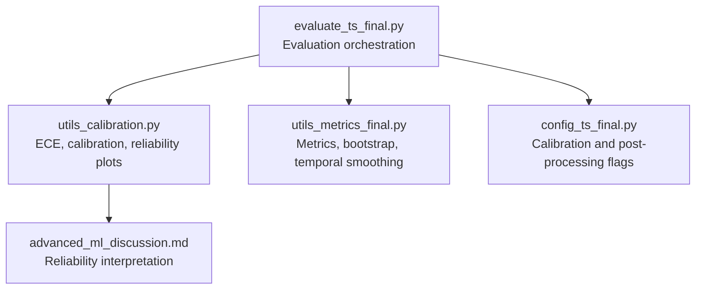
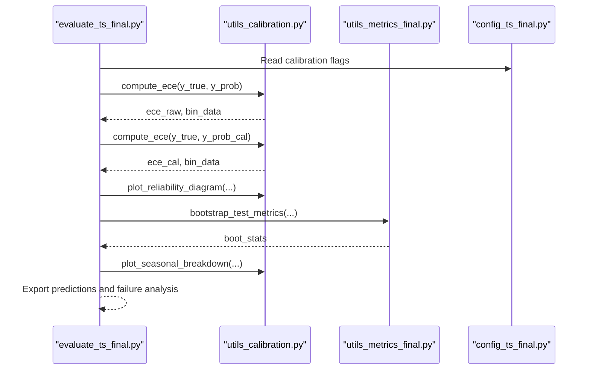
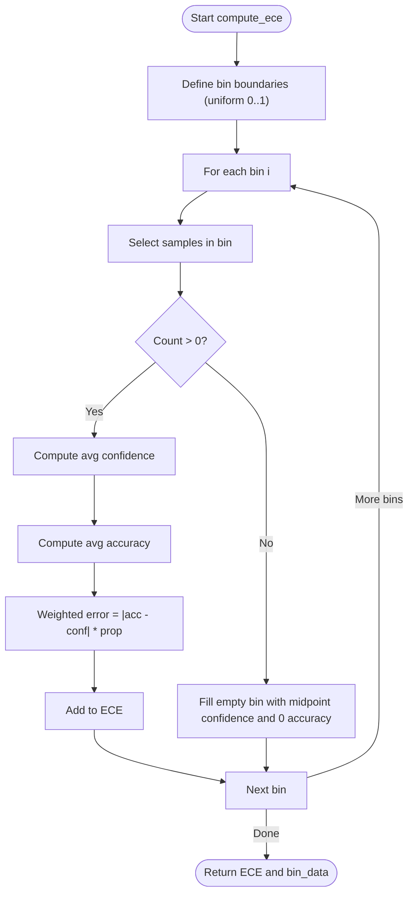
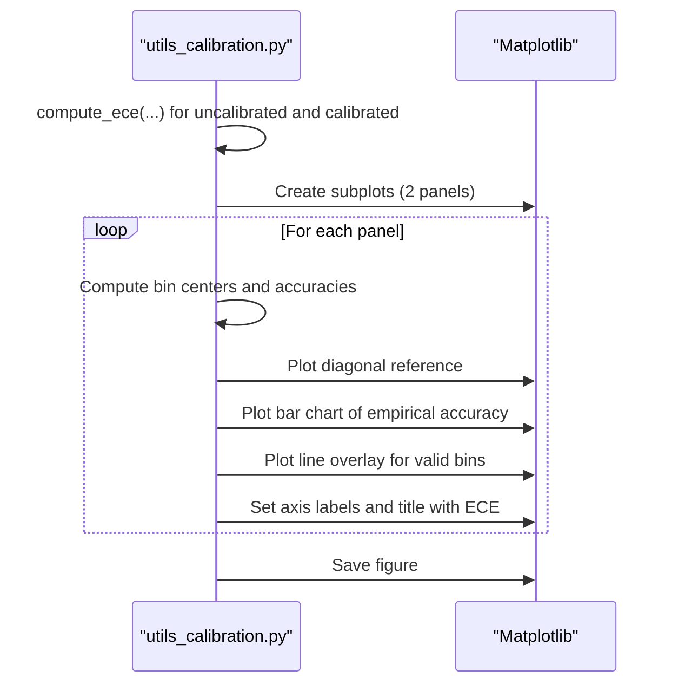
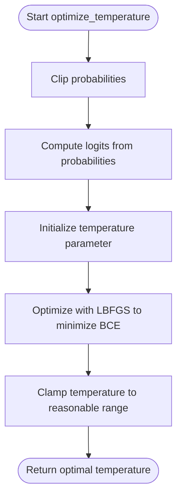
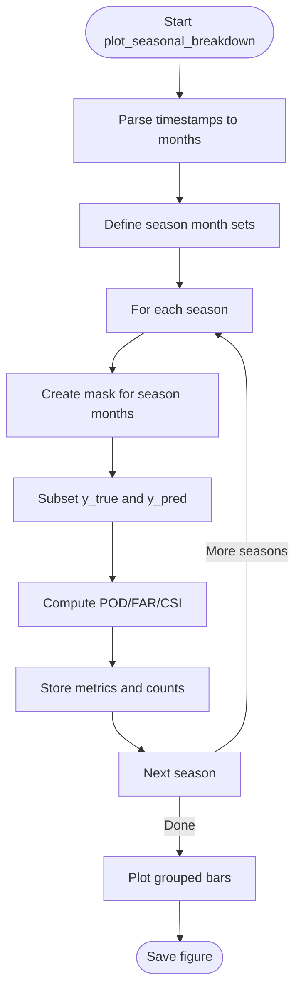
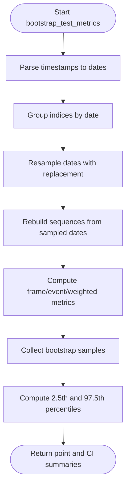
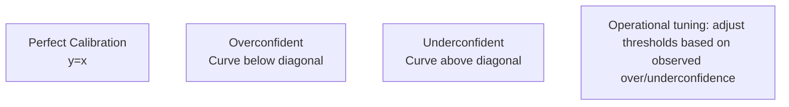
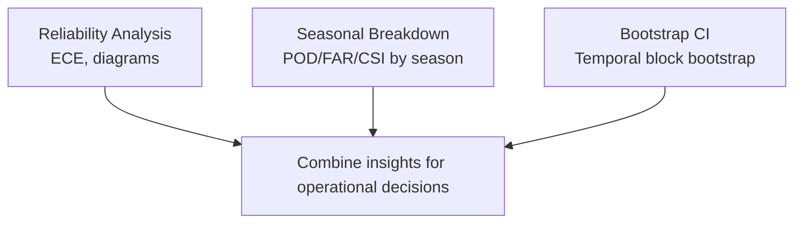
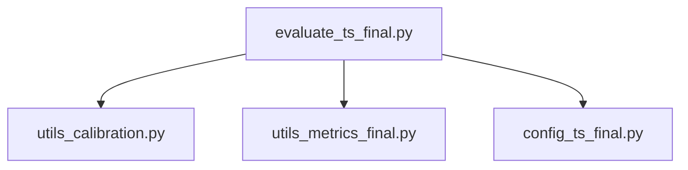

# Reliability Analysis & Visualization

<cite>
**Referenced Files in This Document**
- [utils_calibration.py](file://utils_calibration.py)
- [utils_metrics_final.py](file://utils_metrics_final.py)
- [evaluate_ts_final.py](file://evaluate_ts_final.py)
- [config_ts_final.py](file://config_ts_final.py)
- [advanced_ml_discussion.md](file://reports/advanced_ml_discussion.md)
</cite>

## Table of Contents
1. [Introduction](#introduction)
2. [Project Structure](#project-structure)
3. [Core Components](#core-components)
4. [Architecture Overview](#architecture-overview)
5. [Detailed Component Analysis](#detailed-component-analysis)
6. [Dependency Analysis](#dependency-analysis)
7. [Performance Considerations](#performance-considerations)
8. [Troubleshooting Guide](#troubleshooting-guide)
9. [Conclusion](#conclusion)
10. [Appendices](#appendices)

## Introduction
This document explains reliability analysis and visualization techniques implemented in the uncertainty quantification workflow for the Nagpur thunderstorm nowcasting system. It covers:
- Expected Calibration Error (ECE) computation methodology, including bin-based accuracy assessment and weighted error calculation across confidence bins
- Reliability diagram construction with side-by-side comparison of uncalibrated vs calibrated probabilities, including bin center calculation, empirical accuracy plotting, and perfect calibration reference lines
- Binning strategy, confidence interval partitioning, and statistical significance assessment via temporal block bootstrapping
- Reliability curve interpretation, identification of overconfidence/underconfidence patterns, and diagnosis of model reliability issues
- Integration with seasonal performance breakdown, including month-wise reliability assessment and temporal uncertainty trends
- Practical guidance on reliability-based model selection, threshold optimization using reliability information, and uncertainty quality assessment for operational decision making

## Project Structure
The reliability analysis pipeline integrates several modules:
- Calibration utilities for ECE computation, temperature scaling, and reliability diagram plotting
- Metrics utilities for temporal smoothing, persistence filtering, and bootstrap confidence intervals
- Evaluation script orchestrating reliability analysis, seasonal breakdown, and failure case analysis
- Configuration controlling calibration and post-processing parameters
- Report documentation describing reliability interpretation and operational implications

**Diagram sources**
- [evaluate_ts_final.py:820-908](file://evaluate_ts_final.py#L820-L908)
- [utils_calibration.py:1-420](file://utils_calibration.py#L1-L420)
- [utils_metrics_final.py:1-760](file://utils_metrics_final.py#L1-L760)
- [config_ts_final.py:125-127](file://config_ts_final.py#L125-L127)
- [advanced_ml_discussion.md:77-100](file://reports/advanced_ml_discussion.md#L77-L100)

**Section sources**
- [evaluate_ts_final.py:820-908](file://evaluate_ts_final.py#L820-L908)
- [utils_calibration.py:1-420](file://utils_calibration.py#L1-L420)
- [utils_metrics_final.py:1-760](file://utils_metrics_final.py#L1-L760)
- [config_ts_final.py:125-127](file://config_ts_final.py#L125-L127)
- [advanced_ml_discussion.md:77-100](file://reports/advanced_ml_discussion.md#L77-L100)

## Core Components
- Expected Calibration Error (ECE): Computes the weighted average gap between predicted confidence and empirical accuracy across confidence bins.
- Reliability Diagram: Side-by-side plots comparing uncalibrated and calibrated probabilities, with bin centers and empirical accuracy bars.
- Temperature Scaling: Post-hoc calibration by optimizing a scalar temperature parameter on validation logits.
- Seasonal Performance Breakdown: Frame-level metrics grouped by meteorological season to assess temporal reliability trends.
- Bootstrap Confidence Intervals: Temporal block bootstrapping by calendar day to estimate 95% confidence intervals for metrics.

**Section sources**
- [utils_calibration.py:24-60](file://utils_calibration.py#L24-L60)
- [utils_calibration.py:112-168](file://utils_calibration.py#L112-L168)
- [utils_calibration.py:63-105](file://utils_calibration.py#L63-L105)
- [utils_calibration.py:174-244](file://utils_calibration.py#L174-L244)
- [utils_metrics_final.py:653-760](file://utils_metrics_final.py#L653-L760)

## Architecture Overview
The reliability workflow is executed during evaluation. It computes ECE on both raw and calibrated probabilities, generates reliability diagrams, exports predictions, and performs seasonal and failure analyses. Bootstrap confidence intervals are computed to quantify uncertainty in performance estimates.

**Diagram sources**
- [evaluate_ts_final.py:820-908](file://evaluate_ts_final.py#L820-L908)
- [utils_calibration.py:24-60](file://utils_calibration.py#L24-L60)
- [utils_calibration.py:112-168](file://utils_calibration.py#L112-L168)
- [utils_calibration.py:174-244](file://utils_calibration.py#L174-L244)
- [utils_metrics_final.py:653-760](file://utils_metrics_final.py#L653-L760)
- [config_ts_final.py:125-127](file://config_ts_final.py#L125-L127)

## Detailed Component Analysis

### Expected Calibration Error (ECE)
- Binning strategy: Uniform partitioning of the [0, 1] probability space into n_bins (default 10).
- Per-bin computation:
  - Select samples whose predicted probabilities fall within the bin’s bounds
  - Compute average confidence and empirical accuracy for the bin
  - Weight the absolute difference by the proportion of samples in the bin
- Aggregation: Sum weighted differences across all bins to obtain ECE.

**Diagram sources**
- [utils_calibration.py:24-60](file://utils_calibration.py#L24-L60)

**Section sources**
- [utils_calibration.py:24-60](file://utils_calibration.py#L24-L60)

### Reliability Diagram Construction
- Side-by-side plots compare uncalibrated and calibrated probabilities.
- For each plot:
  - Compute bin centers as the mean of predicted probabilities within each bin
  - Plot empirical accuracy as vertical bars
  - Overlay a red line connecting valid bin centers with non-zero counts
  - Add a dashed diagonal reference for perfect calibration
- Titles include ECE values for both configurations.

**Diagram sources**
- [utils_calibration.py:112-168](file://utils_calibration.py#L112-L168)

**Section sources**
- [utils_calibration.py:112-168](file://utils_calibration.py#L112-L168)
- [advanced_ml_discussion.md:77-100](file://reports/advanced_ml_discussion.md#L77-L100)

### Temperature Scaling Calibration
- Optimization: Convert probabilities to logits, optimize a scalar temperature T on validation logits to minimize binary cross-entropy loss.
- Application: Scale logits by 1/T and convert back to probabilities.
- Typical effect: T > 1 softens overconfident predictions; T < 1 sharpens them.

**Diagram sources**
- [utils_calibration.py:63-105](file://utils_calibration.py#L63-L105)

**Section sources**
- [utils_calibration.py:63-105](file://utils_calibration.py#L63-L105)

### Seasonal Performance Breakdown
- Group predictions by meteorological season using month extraction from timestamps.
- Compute frame-level scores (POD, FAR, CSI) per season and visualize as grouped bars.
- Include counts of total frames and positive occurrences for interpretability.

**Diagram sources**
- [utils_calibration.py:174-244](file://utils_calibration.py#L174-L244)

**Section sources**
- [utils_calibration.py:174-244](file://utils_calibration.py#L174-L244)

### Statistical Significance via Bootstrap Confidence Intervals
- Temporal block bootstrapping: Resample entire calendar days to preserve temporal correlation.
- Compute frame/event/weighted metrics across bootstrap replicates.
- Output point estimates and 95% confidence intervals for each metric.

**Diagram sources**
- [utils_metrics_final.py:653-760](file://utils_metrics_final.py#L653-L760)

**Section sources**
- [utils_metrics_final.py:653-760](file://utils_metrics_final.py#L653-L760)

### Reliability Curve Interpretation and Model Diagnostics
- Perfect calibration: curve lies on the diagonal y = x.
- Overconfidence: curve below diagonal (predicted probability exceeds empirical occurrence rate).
- Underconfidence: curve above diagonal (predicted probability underestimates empirical occurrence rate).
- Operational implications:
  - Audit tool: Generate reliability diagrams to validate threshold selection.
  - Tuning decision limits: If overconfident in a specific probability range, raise operational thresholds to reduce false positives.

**Diagram sources**
- [advanced_ml_discussion.md:77-100](file://reports/advanced_ml_discussion.md#L77-L100)

**Section sources**
- [advanced_ml_discussion.md:77-100](file://reports/advanced_ml_discussion.md#L77-L100)

### Integration with Seasonal Performance and Temporal Trends
- Combine reliability diagnostics with seasonal breakdown to identify temporal uncertainty trends.
- Use bootstrap confidence intervals to assess whether seasonal differences are statistically significant.

**Diagram sources**
- [utils_calibration.py:174-244](file://utils_calibration.py#L174-L244)
- [utils_metrics_final.py:653-760](file://utils_metrics_final.py#L653-L760)

**Section sources**
- [utils_calibration.py:174-244](file://utils_calibration.py#L174-L244)
- [utils_metrics_final.py:653-760](file://utils_metrics_final.py#L653-L760)

### Practical Guidance: Reliability-Based Model Selection and Threshold Optimization
- Use ECE to compare raw vs calibrated models; select the configuration with lower ECE.
- Align threshold selection with reliability characteristics:
  - If overconfident in a region, increase operational thresholds to reduce false positives.
  - If underconfident, consider lowering thresholds cautiously to improve sensitivity.
- Incorporate reliability insights into broader model selection criteria alongside other metrics.

**Section sources**
- [evaluate_ts_final.py:831-839](file://evaluate_ts_final.py#L831-L839)
- [advanced_ml_discussion.md:95-98](file://reports/advanced_ml_discussion.md#L95-L98)

## Dependency Analysis
- Calibration utilities depend on NumPy, Pandas, PyTorch, and Matplotlib.
- Metrics utilities depend on NumPy, Pandas, and scikit-learn for ROC/PR curves.
- Evaluation script orchestrates calibration, metrics, and plotting, reading configuration flags for calibration and post-processing.

**Diagram sources**
- [evaluate_ts_final.py:820-908](file://evaluate_ts_final.py#L820-L908)
- [utils_calibration.py:1-420](file://utils_calibration.py#L1-L420)
- [utils_metrics_final.py:1-760](file://utils_metrics_final.py#L1-L760)
- [config_ts_final.py:125-127](file://config_ts_final.py#L125-L127)

**Section sources**
- [evaluate_ts_final.py:820-908](file://evaluate_ts_final.py#L820-L908)
- [utils_calibration.py:1-420](file://utils_calibration.py#L1-L420)
- [utils_metrics_final.py:1-760](file://utils_metrics_final.py#L1-L760)
- [config_ts_final.py:125-127](file://config_ts_final.py#L125-L127)

## Performance Considerations
- ECE computation is linear in the number of samples and constant in the number of bins.
- Reliability diagram plotting involves per-bin computations and rendering; keep n_bins moderate (default 10) for clarity.
- Bootstrap confidence intervals require multiple resampling iterations; adjust n_bootstraps based on computational budget.
- Temperature scaling adds minimal overhead compared to inference cost.

[No sources needed since this section provides general guidance]

## Troubleshooting Guide
- Reliability diagram shows unexpected shape:
  - Verify that probabilities are well-calibrated; consider temperature scaling or Platt scaling depending on configuration flags.
  - Check for label smoothing or asymmetric loss effects that may influence calibration.
- Seasonal breakdown shows poor performance in specific seasons:
  - Investigate data imbalance or feature drift across seasons; consider seasonal sampling boosts or separate models.
- Bootstrap intervals are wide:
  - Increase n_bootstraps or ensure sufficient temporal variability in the test set.
  - Confirm that temporal grouping by calendar day is appropriate for the dataset.

**Section sources**
- [config_ts_final.py:125-127](file://config_ts_final.py#L125-L127)
- [utils_metrics_final.py:653-760](file://utils_metrics_final.py#L653-L760)

## Conclusion
The reliability analysis workflow provides actionable insights into model calibration and uncertainty quality. By combining ECE computation, reliability diagrams, seasonal breakdown, and bootstrap confidence intervals, operators can diagnose overconfidence/underconfidence patterns, tune operational thresholds, and select robust models for decision-making.

[No sources needed since this section summarizes without analyzing specific files]

## Appendices

### Appendix A: Reliability Interpretation Quick Reference
- Perfect calibration: y = x
- Overconfident: curve below diagonal
- Underconfident: curve above diagonal
- Operational tuning: adjust thresholds to align with observed reliability

**Section sources**
- [advanced_ml_discussion.md:77-100](file://reports/advanced_ml_discussion.md#L77-L100)