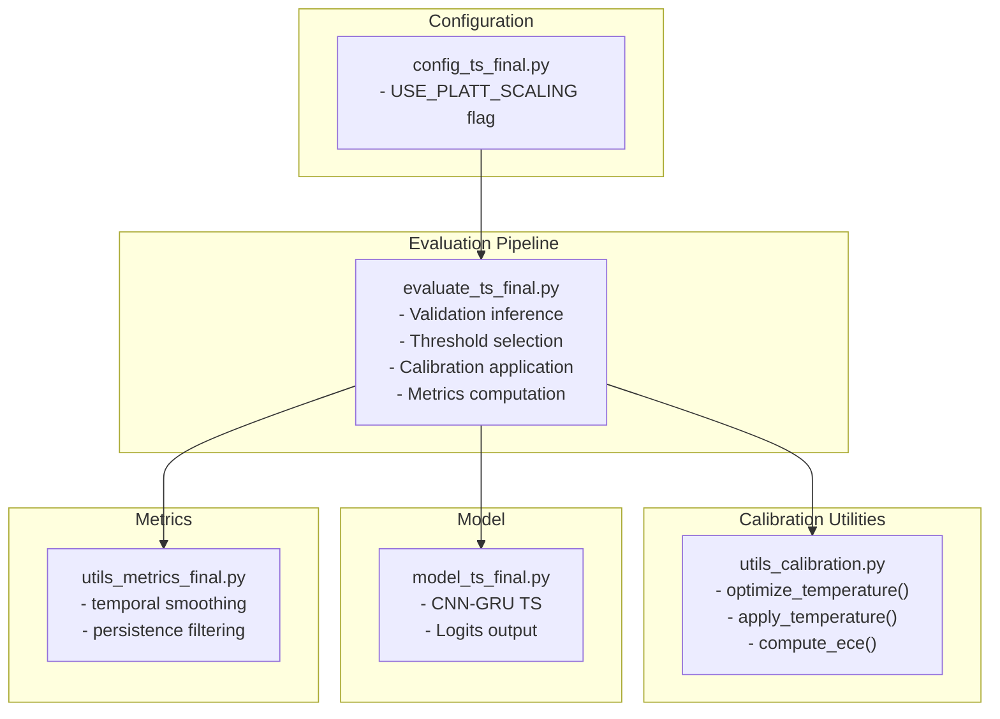
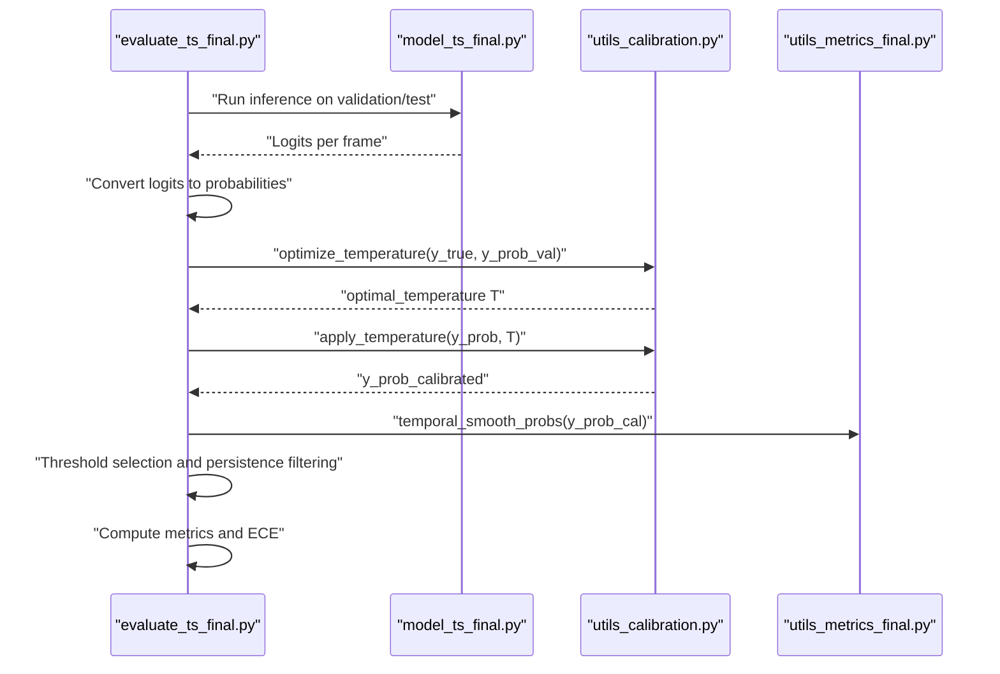
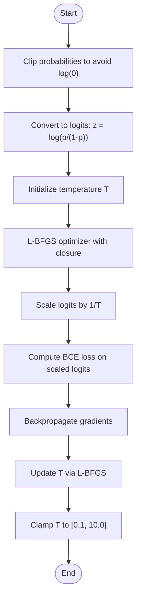
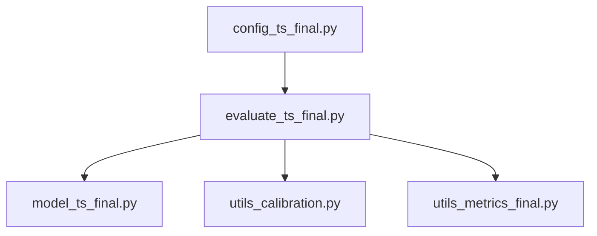

# Temperature Scaling & Confidence Calibration

<cite>
**Referenced Files in This Document**
- [utils_calibration.py](file://utils_calibration.py)
- [evaluate_ts_final.py](file://evaluate_ts_final.py)
- [model_ts_final.py](file://model_ts_final.py)
- [config_ts_final.py](file://config_ts_final.py)
- [utils_metrics_final.py](file://utils_metrics_final.py)
- [audit_report_part1.md](file://reports/audit_report_part1.md)
- [PLAN-ts-pipeline-upgrade.md](file://docs/PLAN-ts-pipeline-upgrade.md)
</cite>

## Table of Contents
1. [Introduction](#introduction)
2. [Project Structure](#project-structure)
3. [Core Components](#core-components)
4. [Architecture Overview](#architecture-overview)
5. [Detailed Component Analysis](#detailed-component-analysis)
6. [Dependency Analysis](#dependency-analysis)
7. [Performance Considerations](#performance-considerations)
8. [Troubleshooting Guide](#troubleshooting-guide)
9. [Conclusion](#conclusion)

## Introduction
This document explains the temperature scaling calibration method used to improve probability reliability in the thunderstorm nowcasting system. It covers the theoretical basis of temperature scaling as a post-hoc calibration technique that rescales softmax outputs using a temperature parameter T. It documents the mathematical formulation, the optimization procedure using L-BFGS to minimize negative log-likelihood, and the practical implementation for applying calibrated temperatures to probability outputs. It also describes the impact on model reliability, Expected Calibration Error (ECE) reduction, and operational benefits for forecast interpretation, along with guidance on parameter interpretation, when calibration is beneficial, and its limitations.

## Project Structure
The temperature scaling calibration is implemented as part of the evaluation pipeline and utility modules:
- Calibration utilities define the temperature optimization and application routines.
- The evaluation script performs inference, applies calibration, computes metrics, and exports results.
- The model produces logits that are transformed to probabilities for calibration.
- Configuration controls whether calibration is enabled and how it integrates into evaluation.

**Diagram sources**
- [utils_calibration.py:1-110](file://utils_calibration.py#L1-L110)
- [evaluate_ts_final.py:500-699](file://evaluate_ts_final.py#L500-L699)
- [model_ts_final.py:68-268](file://model_ts_final.py#L68-L268)
- [config_ts_final.py:125-127](file://config_ts_final.py#L125-L127)
- [utils_metrics_final.py:23-77](file://utils_metrics_final.py#L23-L77)

**Section sources**
- [utils_calibration.py:1-110](file://utils_calibration.py#L1-L110)
- [evaluate_ts_final.py:500-699](file://evaluate_ts_final.py#L500-L699)
- [model_ts_final.py:68-268](file://model_ts_final.py#L68-L268)
- [config_ts_final.py:125-127](file://config_ts_final.py#L125-L127)
- [utils_metrics_final.py:23-77](file://utils_metrics_final.py#L23-L77)

## Core Components
- Temperature scaling optimization routine: finds the optimal temperature parameter T on validation data by minimizing binary cross-entropy loss on scaled logits.
- Temperature application routine: applies calibrated scaling to probabilities using the learned T.
- Expected Calibration Error (ECE) computation and reliability diagram plotting: used to assess calibration quality.
- Evaluation integration: runs inference, selects thresholds, applies calibration, smooths probabilities, and computes metrics.

Key implementation references:
- Temperature optimization and application: [utils_calibration.py:63-105](file://utils_calibration.py#L63-L105)
- ECE computation: [utils_calibration.py:24-60](file://utils_calibration.py#L24-L60)
- Evaluation integration and calibration usage: [evaluate_ts_final.py:508-589](file://evaluate_ts_final.py#L508-L589), [evaluate_ts_final.py:825-838](file://evaluate_ts_final.py#L825-L838)

**Section sources**
- [utils_calibration.py:24-105](file://utils_calibration.py#L24-L105)
- [evaluate_ts_final.py:508-589](file://evaluate_ts_final.py#L508-L589)
- [evaluate_ts_final.py:825-838](file://evaluate_ts_final.py#L825-L838)

## Architecture Overview
The temperature scaling calibration pipeline operates during evaluation:
- The model outputs logits for each frame.
- Probabilities are derived from logits via a sigmoid transformation.
- On the validation set, the temperature parameter T is optimized using L-BFGS to minimize BCE on scaled logits.
- The learned T is applied to both validation and test probabilities to produce calibrated probabilities.
- Metrics such as ECE are computed to quantify calibration quality.

**Diagram sources**
- [evaluate_ts_final.py:508-589](file://evaluate_ts_final.py#L508-L589)
- [utils_calibration.py:63-105](file://utils_calibration.py#L63-L105)
- [utils_metrics_final.py:23-47](file://utils_metrics_final.py#L23-L47)
- [model_ts_final.py:202-268](file://model_ts_final.py#L202-L268)

## Detailed Component Analysis

### Mathematical Formulation and Optimization
- Post-hoc calibration rescales pre-activation logits z by a scalar temperature T > 0 before applying the sigmoid function to produce calibrated probabilities.
- The optimization minimizes the validation binary cross-entropy loss with respect to T, holding model weights fixed.
- Gradient-based optimization uses L-BFGS with a closure that computes the scaled logits and the BCE loss.

Implementation highlights:
- Temperature optimization: [utils_calibration.py:63-93](file://utils_calibration.py#L63-L93)
- Temperature application: [utils_calibration.py:96-105](file://utils_calibration.py#L96-L105)

**Diagram sources**
- [utils_calibration.py:63-93](file://utils_calibration.py#L63-L93)

**Section sources**
- [utils_calibration.py:63-105](file://utils_calibration.py#L63-L105)

### Practical Application and Numerical Stability
- Clipping ensures numerical stability when converting probabilities to logits and back.
- The calibrated probabilities are smoothed temporally and then thresholded with persistence filtering for operational predictions.
- The evaluation script demonstrates the end-to-end workflow: inference, calibration, smoothing, thresholding, and metrics.

References:
- Numerical stability and clipping: [utils_calibration.py:72-73](file://utils_calibration.py#L72-L73), [utils_calibration.py:101-102](file://utils_calibration.py#L101-L102)
- Evaluation integration: [evaluate_ts_final.py:508-589](file://evaluate_ts_final.py#L508-L589)

**Section sources**
- [utils_calibration.py:72-105](file://utils_calibration.py#L72-L105)
- [evaluate_ts_final.py:508-589](file://evaluate_ts_final.py#L508-L589)

### Impact on Reliability and Operational Benefits
- Calibration improves reliability by reducing overconfidence in predictions, as measured by Expected Calibration Error (ECE).
- The evaluation script computes ECE on both raw and calibrated probabilities and prints the results.
- Improved reliability aids forecast interpretation and decision-making by providing more trustworthy probability estimates.

References:
- ECE computation and printing: [utils_calibration.py:24-60](file://utils_calibration.py#L24-L60), [evaluate_ts_final.py:832-838](file://evaluate_ts_final.py#L832-L838)

**Section sources**
- [utils_calibration.py:24-60](file://utils_calibration.py#L24-L60)
- [evaluate_ts_final.py:832-838](file://evaluate_ts_final.py#L832-L838)

### Guidance on Parameter Interpretation and When Calibration Is Beneficial
- Temperature parameter interpretation:
  - T > 1: Softens probabilities, pulling extreme values toward the center (reduces overconfidence).
  - T < 1: Sharpens probabilities, increasing discrimination.
- Calibration is beneficial when the model exhibits miscalibration (e.g., overconfident outputs), especially after architectures that aggressively push outputs away from uniformity (e.g., certain normalization or dropout regimes).
- The evaluation script notes that Platt scaling was introduced to address worsening ECE with temperature scaling in prior configurations.

References:
- Temperature scaling rationale and parameter effects: [reports/audit_report_part1.md:262-267](file://reports/audit_report_part1.md#L262-L267)
- Implementation note on Platt scaling replacing temperature scaling: [docs/PLAN-ts-pipeline-upgrade.md:262-267](file://docs/PLAN-ts-pipeline-upgrade.md#L262-L267)

**Section sources**
- [reports/audit_report_part1.md:262-267](file://reports/audit_report_part1.md#L262-L267)
- [docs/PLAN-ts-pipeline-upgrade.md:262-267](file://docs/PLAN-ts-pipeline-upgrade.md#L262-L267)

### Limitations of Temperature Scaling
- Temperature scaling is a post-hoc technique that does not alter model weights and assumes a scalar temperature across all outputs.
- It may not address heterogeneous miscalibration patterns across different regions or conditions.
- The evaluation script highlights that Platt scaling was adopted to mitigate non-uniform miscalibration observed with temperature scaling.

References:
- Audit note on Platt scaling rationale: [reports/audit_report_part1.md:262-267](file://reports/audit_report_part1.md#L262-L267)

**Section sources**
- [reports/audit_report_part1.md:262-267](file://reports/audit_report_part1.md#L262-L267)

## Dependency Analysis
- The evaluation script depends on the model’s logits output and the calibration utilities to compute and apply calibrated probabilities.
- Calibration utilities depend on NumPy and PyTorch for numerical operations and optimization.
- Metrics utilities support temporal smoothing and persistence filtering that complement calibration.

**Diagram sources**
- [evaluate_ts_final.py:508-589](file://evaluate_ts_final.py#L508-L589)
- [utils_calibration.py:63-105](file://utils_calibration.py#L63-L105)
- [utils_metrics_final.py:23-47](file://utils_metrics_final.py#L23-L47)
- [config_ts_final.py:125-127](file://config_ts_final.py#L125-L127)

**Section sources**
- [evaluate_ts_final.py:508-589](file://evaluate_ts_final.py#L508-L589)
- [utils_calibration.py:63-105](file://utils_calibration.py#L63-L105)
- [utils_metrics_final.py:23-47](file://utils_metrics_final.py#L23-L47)
- [config_ts_final.py:125-127](file://config_ts_final.py#L125-L127)

## Performance Considerations
- Temperature scaling is computationally lightweight, involving simple arithmetic operations on probabilities and logits.
- The optimization uses L-BFGS with a small number of iterations, suitable for validation-time calibration.
- Temporal smoothing and persistence filtering are applied after calibration to improve operational predictions.

[No sources needed since this section provides general guidance]

## Troubleshooting Guide
Common issues and resolutions:
- Numerical instability:
  - Ensure probabilities are clipped before converting to logits and back.
  - References: [utils_calibration.py:72-73](file://utils_calibration.py#L72-L73), [utils_calibration.py:101-102](file://utils_calibration.py#L101-L102)
- Convergence and parameter bounds:
  - The optimized temperature is clamped to a reasonable range to avoid extreme values.
  - Reference: [utils_calibration.py:92-93](file://utils_calibration.py#L92-L93)
- Calibration effectiveness:
  - Compare ECE on raw and calibrated probabilities to assess improvement.
  - Reference: [evaluate_ts_final.py:832-838](file://evaluate_ts_final.py#L832-L838)
- Configuration:
  - Verify that calibration flags are set appropriately in configuration.
  - Reference: [config_ts_final.py:125-127](file://config_ts_final.py#L125-L127)

**Section sources**
- [utils_calibration.py:72-102](file://utils_calibration.py#L72-L102)
- [utils_calibration.py:92-93](file://utils_calibration.py#L92-L93)
- [evaluate_ts_final.py:832-838](file://evaluate_ts_final.py#L832-L838)
- [config_ts_final.py:125-127](file://config_ts_final.py#L125-L127)

## Conclusion
Temperature scaling provides a simple yet effective post-hoc calibration technique to improve probability reliability in the thunderstorm nowcasting system. By rescaling logits with a learned temperature parameter T and optimizing T on validation data using L-BFGS, the method reduces overconfidence and improves ECE. While temperature scaling is straightforward and fast, the evaluation pipeline also incorporates Platt scaling to address non-uniform miscalibration. Together, these calibration approaches enhance forecast reliability and operational interpretability, enabling more trustworthy nowcasting decisions.