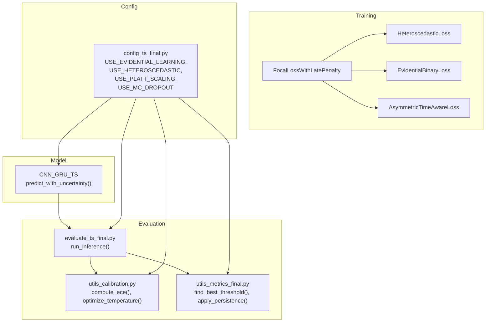
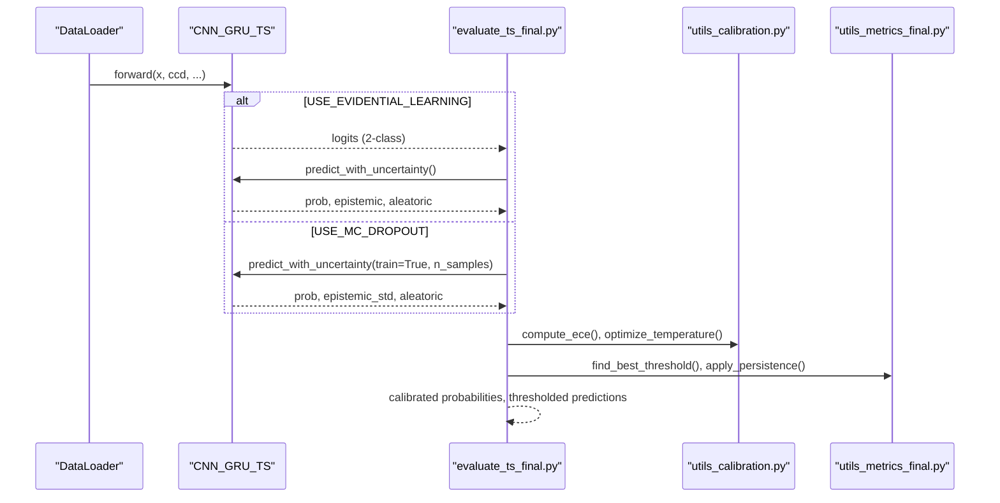
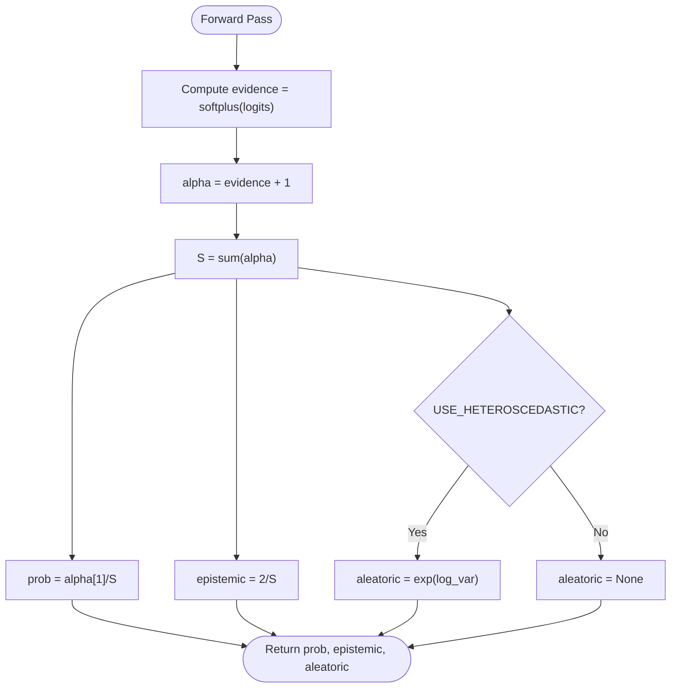
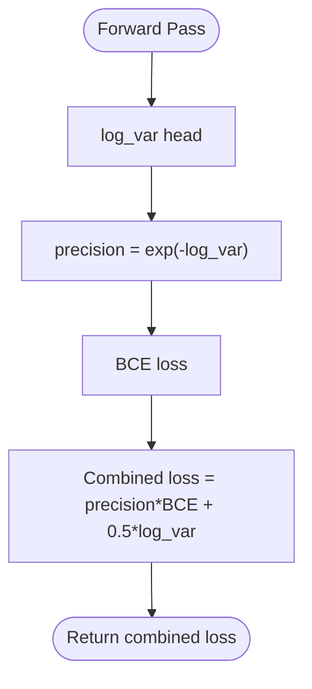
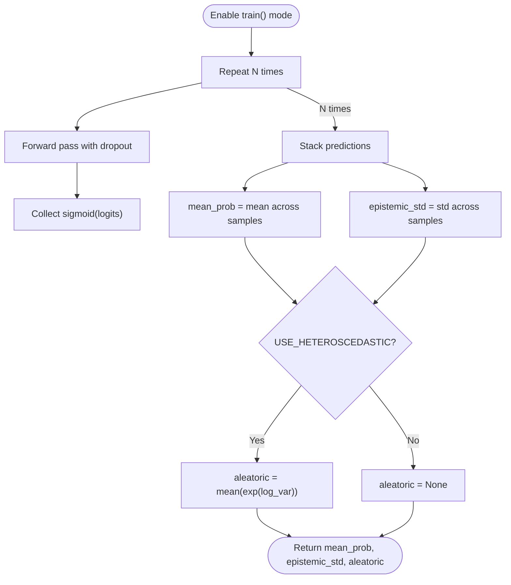
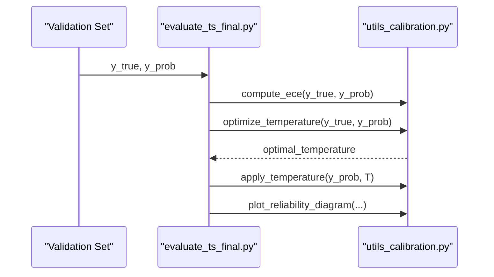
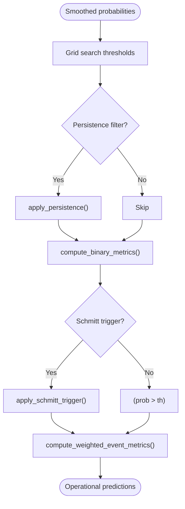
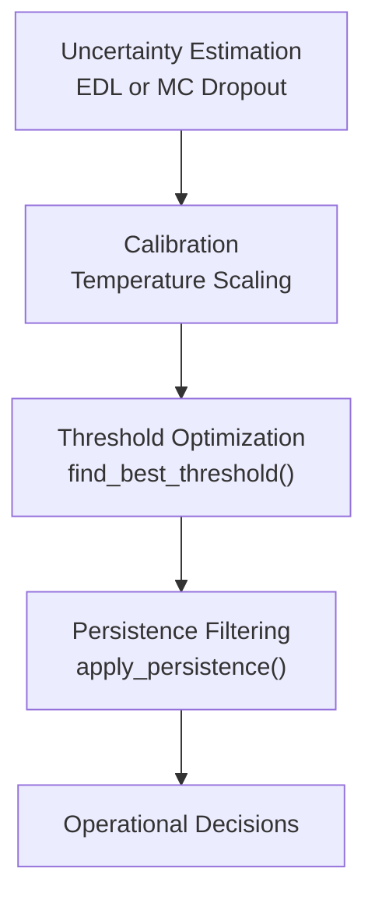
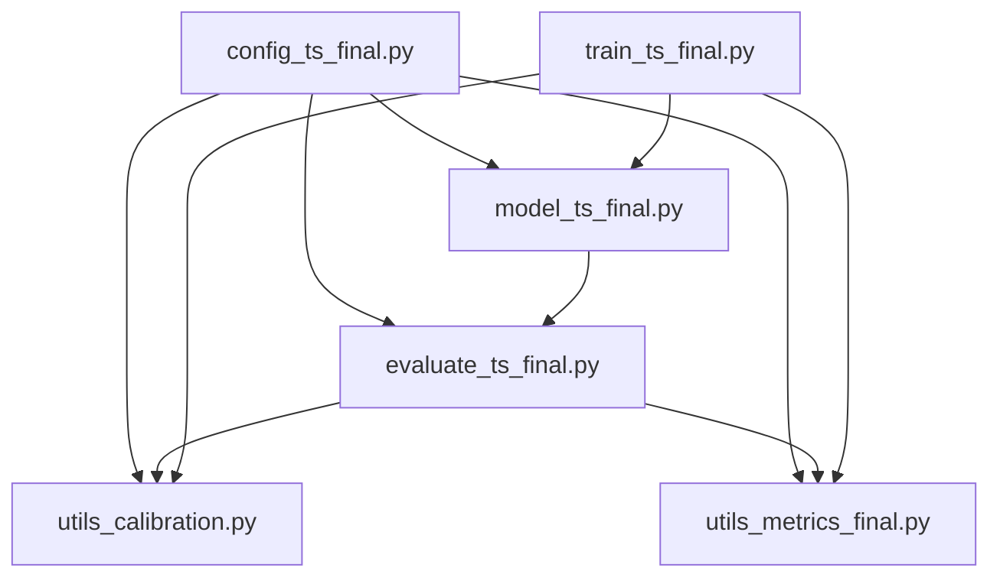

# Uncertainty Quantification & Calibration

<cite>
**Referenced Files in This Document**
- [model_ts_final.py](file://model_ts_final.py)
- [losses_final.py](file://losses_final.py)
- [evaluate_ts_final.py](file://evaluate_ts_final.py)
- [utils_calibration.py](file://utils_calibration.py)
- [utils_metrics_final.py](file://utils_metrics_final.py)
- [config_ts_final.py](file://config_ts_final.py)
- [train_ts_final.py](file://train_ts_final.py)
</cite>

## Table of Contents
1. [Introduction](#introduction)
2. [Project Structure](#project-structure)
3. [Core Components](#core-components)
4. [Architecture Overview](#architecture-overview)
5. [Detailed Component Analysis](#detailed-component-analysis)
6. [Dependency Analysis](#dependency-analysis)
7. [Performance Considerations](#performance-considerations)
8. [Troubleshooting Guide](#troubleshooting-guide)
9. [Conclusion](#conclusion)
10. [Appendices](#appendices)

## Introduction
This document explains uncertainty quantification and calibration procedures in the thunderstorm nowcasting system. It covers:
- Evidential deep learning (EDL) using Beta distributions for uncertainty modeling and epistemic–aleatoric decomposition
- Temperature scaling and reliability diagrams for model calibration
- Heteroscedastic uncertainty modeling via learned noise variance prediction
- Monte Carlo dropout (MC Dropout) for Bayesian uncertainty estimation and computational efficiency
- Uncertainty visualization techniques and reliability diagnostics
- Integration of uncertainty scores with threshold optimization and decision-making frameworks

## Project Structure
The uncertainty and calibration pipeline spans model architecture, training losses, evaluation scripts, and utility modules for calibration and metrics.

**Diagram sources**
- [model_ts_final.py:274-335](file://model_ts_final.py#L274-L335)
- [losses_final.py:13-194](file://losses_final.py#L13-L194)
- [evaluate_ts_final.py:285-501](file://evaluate_ts_final.py#L285-L501)
- [utils_calibration.py:24-167](file://utils_calibration.py#L24-L167)
- [utils_metrics_final.py:192-314](file://utils_metrics_final.py#L192-L314)
- [config_ts_final.py:68-131](file://config_ts_final.py#L68-L131)

**Section sources**
- [model_ts_final.py:68-335](file://model_ts_final.py#L68-L335)
- [losses_final.py:13-194](file://losses_final.py#L13-L194)
- [evaluate_ts_final.py:285-501](file://evaluate_ts_final.py#L285-L501)
- [utils_calibration.py:24-167](file://utils_calibration.py#L24-L167)
- [utils_metrics_final.py:192-314](file://utils_metrics_final.py#L192-L314)
- [config_ts_final.py:68-131](file://config_ts_final.py#L68-L131)

## Core Components
- Evidential Deep Learning (EDL) with Beta distributions for epistemic uncertainty and optional aleatoric modeling
- Heteroscedastic loss for learned noise variance prediction
- Temperature scaling for confidence calibration
- MC Dropout for Bayesian uncertainty estimation
- Threshold optimization and persistence filtering for operational decision-making

**Section sources**
- [model_ts_final.py:274-335](file://model_ts_final.py#L274-L335)
- [losses_final.py:112-133](file://losses_final.py#L112-L133)
- [utils_calibration.py:24-105](file://utils_calibration.py#L24-L105)
- [utils_metrics_final.py:192-314](file://utils_metrics_final.py#L192-L314)

## Architecture Overview
The system integrates uncertainty heads and calibration into a unified inference and evaluation pipeline.

**Diagram sources**
- [model_ts_final.py:274-335](file://model_ts_final.py#L274-L335)
- [evaluate_ts_final.py:450-501](file://evaluate_ts_final.py#L450-L501)
- [utils_calibration.py:24-105](file://utils_calibration.py#L24-L105)
- [utils_metrics_final.py:192-314](file://utils_metrics_final.py#L192-L314)

## Detailed Component Analysis

### Evidential Deep Learning (EDL) with Beta Distributions
- The model’s primary head outputs 2 logits interpreted as evidence for a Beta distribution over class probabilities.
- Post-hoc probability is the normalized evidence for the positive class, and epistemic uncertainty is derived from the sum of evidence parameters.
- Aleatoric uncertainty can be recovered from a learned log-variance head when enabled.

**Diagram sources**
- [model_ts_final.py:279-302](file://model_ts_final.py#L279-L302)

**Section sources**
- [model_ts_final.py:274-302](file://model_ts_final.py#L274-L302)
- [losses_final.py:195-255](file://losses_final.py#L195-L255)

### Heteroscedastic Uncertainty Modeling
- A learned log-variance head predicts per-sample noise variance; the model trades off error magnitude against predictive precision.
- The heteroscedastic loss combines precision-weighted BCE with a log-variance regularization term.

**Diagram sources**
- [losses_final.py:112-133](file://losses_final.py#L112-L133)
- [model_ts_final.py:258-260](file://model_ts_final.py#L258-L260)

**Section sources**
- [losses_final.py:112-133](file://losses_final.py#L112-L133)
- [model_ts_final.py:258-260](file://model_ts_final.py#L258-L260)

### Monte Carlo Dropout (MC Dropout) for Bayesian Uncertainty
- During inference, dropout remains active and N forward passes yield a distribution of predictions.
- Epistemic uncertainty is estimated as the standard deviation of predictions across samples.
- Aleatoric uncertainty can be recovered from a heteroscedastic head when present.

**Diagram sources**
- [model_ts_final.py:304-335](file://model_ts_final.py#L304-L335)

**Section sources**
- [model_ts_final.py:304-335](file://model_ts_final.py#L304-L335)

### Calibration: Temperature Scaling and Reliability Diagrams
- Temperature scaling adjusts logits by a scalar temperature T to minimize validation cross-entropy.
- Reliability diagrams compare average accuracy within probability bins to predicted confidence; ECE quantifies calibration error.
- The evaluation script computes ECE and temperature scaling, then plots reliability diagrams.

**Diagram sources**
- [evaluate_ts_final.py:508-523](file://evaluate_ts_final.py#L508-L523)
- [utils_calibration.py:24-167](file://utils_calibration.py#L24-L167)

**Section sources**
- [utils_calibration.py:24-167](file://utils_calibration.py#L24-L167)
- [evaluate_ts_final.py:508-523](file://evaluate_ts_final.py#L508-L523)

### Threshold Optimization and Decision-Making
- Threshold selection is performed on smoothed probabilities; dual-threshold Schmitt trigger can be used for hysteresis-based triggering.
- Persistence filtering removes short-lived false positives; severe-fast-track threshold can be used for high-severity events.
- Weighted event metrics incorporate lead-time bonuses and severity weights.

**Diagram sources**
- [utils_metrics_final.py:192-314](file://utils_metrics_final.py#L192-L314)
- [evaluate_ts_final.py:524-600](file://evaluate_ts_final.py#L524-L600)

**Section sources**
- [utils_metrics_final.py:192-314](file://utils_metrics_final.py#L192-L314)
- [evaluate_ts_final.py:524-600](file://evaluate_ts_final.py#L524-L600)

### Integration of Uncertainty with Threshold Optimization
- When EDL is enabled, epistemic uncertainty is available deterministically; aleatoric uncertainty can be recovered from a heteroscedastic head.
- When MC Dropout is enabled, epistemic uncertainty is estimated via sampling; aleatoric uncertainty can be recovered from the heteroscedastic head.
- Calibration improves reliability for threshold selection and reduces overconfidence-induced false alarms.

**Diagram sources**
- [model_ts_final.py:274-335](file://model_ts_final.py#L274-L335)
- [utils_calibration.py:63-105](file://utils_calibration.py#L63-L105)
- [utils_metrics_final.py:192-314](file://utils_metrics_final.py#L192-L314)

**Section sources**
- [model_ts_final.py:274-335](file://model_ts_final.py#L274-L335)
- [utils_calibration.py:63-105](file://utils_calibration.py#L63-L105)
- [utils_metrics_final.py:192-314](file://utils_metrics_final.py#L192-L314)

## Dependency Analysis
Key dependencies and interactions:
- Model uncertainty heads depend on configuration flags for EDL, heteroscedastic, and MC Dropout.
- Training integrates focal loss with optional heteroscedastic and intensity regression heads.
- Evaluation depends on calibration utilities and metrics utilities for threshold optimization and persistence filtering.

**Diagram sources**
- [config_ts_final.py:68-131](file://config_ts_final.py#L68-L131)
- [model_ts_final.py:274-335](file://model_ts_final.py#L274-L335)
- [evaluate_ts_final.py:450-501](file://evaluate_ts_final.py#L450-L501)
- [utils_calibration.py:24-167](file://utils_calibration.py#L24-L167)
- [utils_metrics_final.py:192-314](file://utils_metrics_final.py#L192-L314)
- [train_ts_final.py:404-447](file://train_ts_final.py#L404-L447)

**Section sources**
- [config_ts_final.py:68-131](file://config_ts_final.py#L68-L131)
- [train_ts_final.py:404-447](file://train_ts_final.py#L404-L447)

## Performance Considerations
- EDL provides deterministic epistemic uncertainty in a single forward pass, reducing computational overhead compared to MC Dropout.
- MC Dropout increases inference cost linearly with the number of samples; adjust N based on latency budgets.
- Temperature scaling is lightweight and adds minimal runtime overhead.
- Heteroscedastic modeling incurs negligible extra compute beyond the variance head.

[No sources needed since this section provides general guidance]

## Troubleshooting Guide
- EDL vs. Platt scaling: Platt scaling is incompatible with EDL outputs; the evaluation script skips Platt scaling when EDL is enabled.
- Heteroscedastic loss integration: Ensure heteroscedastic loss is added to the primary focal loss rather than replacing it.
- Calibration artifacts: If reliability curves show overconfidence, increase temperature; if underconfident, decrease temperature.
- Threshold instability: Use smoothed probabilities and dual-threshold Schmitt trigger to reduce temporal chatter.

**Section sources**
- [evaluate_ts_final.py:510-523](file://evaluate_ts_final.py#L510-L523)
- [train_ts_final.py:437-439](file://train_ts_final.py#L437-L439)
- [utils_calibration.py:63-105](file://utils_calibration.py#L63-L105)

## Conclusion
The system integrates EDL-based epistemic uncertainty, optional heteroscedastic aleatoric uncertainty, and robust calibration via temperature scaling. Threshold optimization and persistence filtering enable reliable operational decisions. MC Dropout offers a Bayesian uncertainty alternative when EDL is not used. Together, these components support uncertainty-aware post-processing and improved reliability diagnostics.

[No sources needed since this section summarizes without analyzing specific files]

## Appendices

### Practical Guidance
- Interpretation
  - Epistemic uncertainty reflects model knowledge limitations; high values indicate rare or novel conditions.
  - Aleatoric uncertainty reflects environmental noise; high values indicate ambiguous or noisy scenes.
- Model reliability assessment
  - Use reliability diagrams and ECE to quantify calibration quality.
  - Adjust temperature scaling to align predicted confidence with observed frequencies.
- Uncertainty-aware post-processing
  - Suppress predictions with high epistemic uncertainty.
  - Use Schmitt trigger for hysteresis-based event detection.
  - Apply severe-fast-track threshold for high-severity events.

[No sources needed since this section provides general guidance]