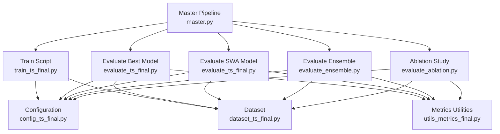
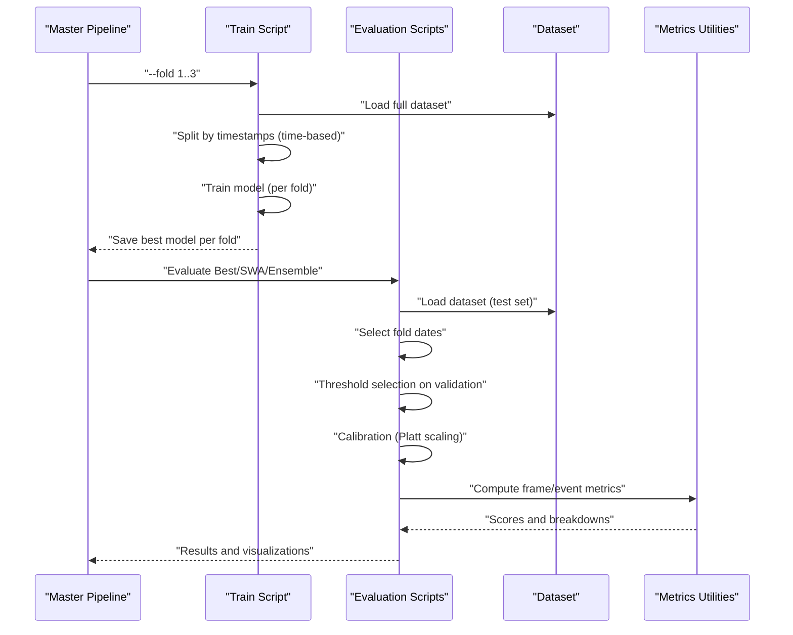
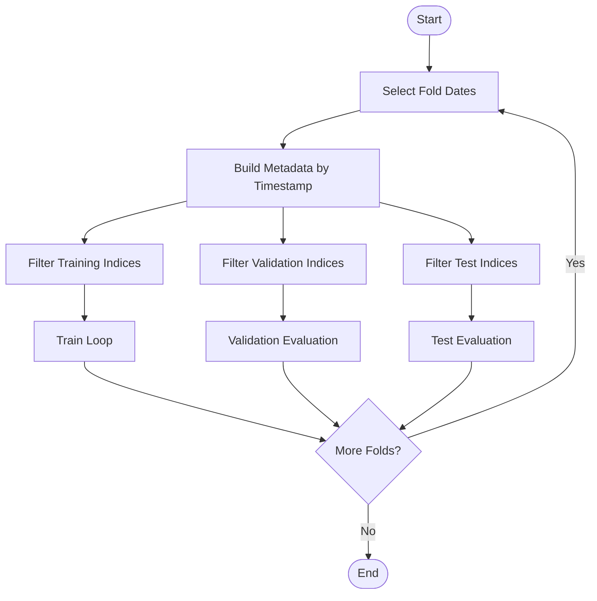
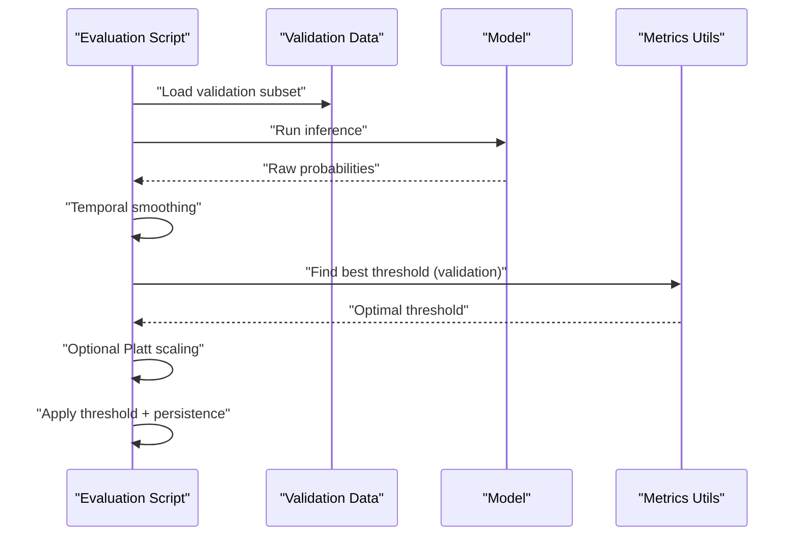
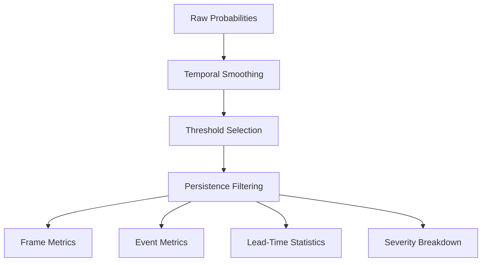
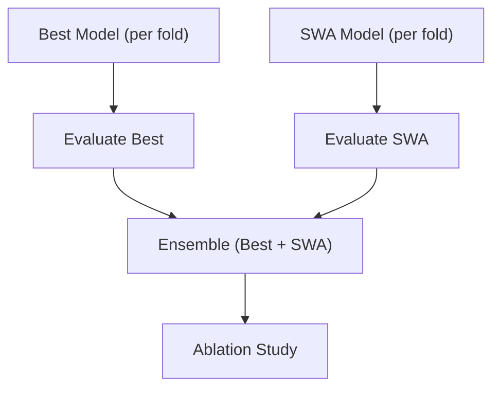
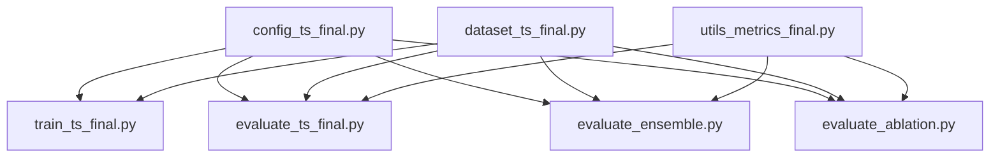

# Cross-Validation Methodology

<cite>
**Referenced Files in This Document**
- [train_ts_final.py](file://train_ts_final.py)
- [evaluate_ts_final.py](file://evaluate_ts_final.py)
- [evaluate_ensemble.py](file://evaluate_ensemble.py)
- [evaluate_ablation.py](file://evaluate_ablation.py)
- [master.py](file://master.py)
- [config_ts_final.py](file://config_ts_final.py)
- [dataset_ts_final.py](file://dataset_ts_final.py)
- [utils_metrics_final.py](file://utils_metrics_final.py)
- [run_fold3.bat](file://run_fold3.bat)
</cite>

## Table of Contents
1. [Introduction](#introduction)
2. [Project Structure](#project-structure)
3. [Core Components](#core-components)
4. [Architecture Overview](#architecture-overview)
5. [Detailed Component Analysis](#detailed-component-analysis)
6. [Dependency Analysis](#dependency-analysis)
7. [Performance Considerations](#performance-considerations)
8. [Troubleshooting Guide](#troubleshooting-guide)
9. [Conclusion](#conclusion)

## Introduction
This document explains the walk-forward cross-validation methodology used in the thunderstorm nowcasting system. It details the temporal validation principles that prevent data leakage, the three-fold validation strategy with specific date ranges, the time-based data splitting approach, and the rationale behind fold selection criteria. It also covers how temporal autocorrelation is addressed, fold-specific model evaluation, performance comparison across folds, and interpretation of validation results.

## Project Structure
The cross-validation pipeline is orchestrated by a master script that coordinates training and evaluation across three folds. Each fold defines distinct training and validation boundaries, ensuring strict temporal separation between sets.

**Diagram sources**
- [master.py:17-104](file://master.py#L17-L104)
- [train_ts_final.py:142-744](file://train_ts_final.py#L142-L744)
- [evaluate_ts_final.py:361-800](file://evaluate_ts_final.py#L361-L800)
- [evaluate_ensemble.py:84-200](file://evaluate_ensemble.py#L84-L200)
- [evaluate_ablation.py:172-200](file://evaluate_ablation.py#L172-L200)
- [config_ts_final.py:16-208](file://config_ts_final.py#L16-L208)
- [dataset_ts_final.py:47-200](file://dataset_ts_final.py#L47-L200)
- [utils_metrics_final.py:23-200](file://utils_metrics_final.py#L23-L200)

**Section sources**
- [master.py:17-104](file://master.py#L17-L104)
- [train_ts_final.py:142-744](file://train_ts_final.py#L142-L744)
- [evaluate_ts_final.py:361-800](file://evaluate_ts_final.py#L361-L800)
- [evaluate_ensemble.py:84-200](file://evaluate_ensemble.py#L84-L200)
- [evaluate_ablation.py:172-200](file://evaluate_ablation.py#L172-L200)
- [config_ts_final.py:16-208](file://config_ts_final.py#L16-L208)
- [dataset_ts_final.py:47-200](file://dataset_ts_final.py#L47-L200)
- [utils_metrics_final.py:23-200](file://utils_metrics_final.py#L23-L200)

## Core Components
- Walk-forward cross-validation with three folds:
  - Fold 1: Training period ends March 1, validation period May 1.
  - Fold 2: Training period ends May 1, validation period July 1.
  - Fold 3: Training and validation periods determined by configuration.
- Time-based data splitting ensures chronological order and prevents information flow between training, validation, and test sets.
- Threshold selection and calibration performed on the validation set to avoid test leakage.
- Post-processing includes temporal smoothing and persistence filtering to stabilize predictions and reduce false alarms.
- Evaluation computes both frame-level and event-level metrics, including weighted event metrics that account for lead-time and severity.

**Section sources**
- [train_ts_final.py:213-234](file://train_ts_final.py#L213-L234)
- [evaluate_ts_final.py:410-429](file://evaluate_ts_final.py#L410-L429)
- [evaluate_ensemble.py:135-151](file://evaluate_ensemble.py#L135-L151)
- [evaluate_ablation.py:229-255](file://evaluate_ablation.py#L229-L255)
- [utils_metrics_final.py:23-78](file://utils_metrics_final.py#L23-L78)

## Architecture Overview
The pipeline performs time-aware splits and evaluates models on the subsequent temporal blocks. The master orchestrates training and evaluation across folds, while evaluation scripts compute calibrated predictions and metrics.

**Diagram sources**
- [master.py:75-98](file://master.py#L75-L98)
- [train_ts_final.py:213-234](file://train_ts_final.py#L213-L234)
- [evaluate_ts_final.py:410-429](file://evaluate_ts_final.py#L410-L429)
- [evaluate_ensemble.py:135-151](file://evaluate_ensemble.py#L135-L151)
- [evaluate_ablation.py:229-255](file://evaluate_ablation.py#L229-L255)
- [utils_metrics_final.py:192-200](file://utils_metrics_final.py#L192-L200)

## Detailed Component Analysis

### Walk-Forward Cross-Validation Design
- Temporal origin shift: For each fold, training extends up to a cutoff date, followed by a validation block, and the test set begins after the validation block.
- Fold-specific cutoffs:
  - Fold 1: Train end = March 1, Val end = May 1.
  - Fold 2: Train end = May 1, Val end = July 1.
  - Fold 3: Train end and Val end defined by configuration.
- This design prevents data leakage by ensuring future information does not influence past predictions.

**Diagram sources**
- [train_ts_final.py:210-234](file://train_ts_final.py#L210-L234)
- [evaluate_ts_final.py:404-429](file://evaluate_ts_final.py#L404-L429)
- [evaluate_ensemble.py:129-151](file://evaluate_ensemble.py#L129-L151)
- [evaluate_ablation.py:226-255](file://evaluate_ablation.py#L226-L255)

**Section sources**
- [train_ts_final.py:213-234](file://train_ts_final.py#L213-L234)
- [evaluate_ts_final.py:410-429](file://evaluate_ts_final.py#L410-L429)
- [evaluate_ensemble.py:135-151](file://evaluate_ensemble.py#L135-L151)
- [evaluate_ablation.py:229-255](file://evaluate_ablation.py#L229-L255)

### Threshold Selection and Calibration
- Threshold selection is performed on the validation set to avoid test leakage.
- Optional Platt scaling is applied to transform validation probabilities into well-calibrated scores.
- Dual-threshold option (Schmitt trigger) supported for hysteresis-based predictions.

**Diagram sources**
- [evaluate_ts_final.py:505-548](file://evaluate_ts_final.py#L505-L548)
- [evaluate_ensemble.py:174-200](file://evaluate_ensemble.py#L174-L200)
- [utils_metrics_final.py:192-200](file://utils_metrics_final.py#L192-L200)

**Section sources**
- [evaluate_ts_final.py:505-548](file://evaluate_ts_final.py#L505-L548)
- [evaluate_ensemble.py:174-200](file://evaluate_ensemble.py#L174-L200)
- [utils_metrics_final.py:192-200](file://utils_metrics_final.py#L192-L200)

### Post-Processing and Metrics
- Temporal smoothing (EMA or rolling mean) stabilizes predictions.
- Persistence filtering removes short-lived false alarms below a minimum duration.
- Metrics include frame-level (POD, FAR, CSI, ETS, SEDI, F1/F2) and event-level (hits, misses, false alarms, weighted metrics).
- Lead-time statistics and severity breakdowns are computed for interpretability.

**Diagram sources**
- [utils_metrics_final.py:23-78](file://utils_metrics_final.py#L23-L78)
- [evaluate_ts_final.py:606-641](file://evaluate_ts_final.py#L606-L641)

**Section sources**
- [utils_metrics_final.py:23-78](file://utils_metrics_final.py#L23-L78)
- [evaluate_ts_final.py:606-641](file://evaluate_ts_final.py#L606-L641)

### Three-Fold Validation Strategy
- Fold 1: Early spring to early summer validation window.
- Fold 2: Mid-summer validation window.
- Fold 3: Extended validation aligned with configuration-defined end dates.
- Each fold trains on historical data and validates on subsequent temporal blocks, ensuring realistic nowcasting performance assessment.

**Section sources**
- [train_ts_final.py:213-222](file://train_ts_final.py#L213-L222)
- [evaluate_ts_final.py:411-419](file://evaluate_ts_final.py#L411-L419)
- [evaluate_ensemble.py:136-144](file://evaluate_ensemble.py#L136-L144)
- [evaluate_ablation.py:230-238](file://evaluate_ablation.py#L230-L238)
- [config_ts_final.py:183-186](file://config_ts_final.py#L183-L186)

### Rationale Behind Fold Selection Criteria
- Temporal autocorrelation: Weather systems exhibit strong temporal correlation; random K-Fold would violate this assumption and inflate validation scores.
- Real-world deployment: Predictions must generalize across distinct seasons and conditions; multiple folds capture variability.
- Practical coverage: Early, mid, and extended validation windows reflect operational needs for reliable nowcasting across different climatic phases.

**Section sources**
- [train_ts_final.py:213-222](file://train_ts_final.py#L213-L222)
- [evaluate_ts_final.py:411-419](file://evaluate_ts_final.py#L411-L419)
- [evaluate_ensemble.py:136-144](file://evaluate_ensemble.py#L136-L144)
- [evaluate_ablation.py:230-238](file://evaluate_ablation.py#L230-L238)

### Fold-Specific Model Evaluation and Comparison
- Best model per fold is saved and evaluated separately.
- SWA (Stochastic Weight Averaging) model is also evaluated for robustness.
- Ensemble evaluation averages predictions from best and SWA models to reduce false alarms while preserving detection rates.
- Ablation study tests the contribution of each input feature by zeroing it out and measuring the impact on weighted event metrics.

**Diagram sources**
- [master.py:76-98](file://master.py#L76-L98)
- [evaluate_ensemble.py:174-200](file://evaluate_ensemble.py#L174-L200)
- [evaluate_ablation.py:119-154](file://evaluate_ablation.py#L119-L154)

**Section sources**
- [master.py:76-98](file://master.py#L76-L98)
- [evaluate_ensemble.py:174-200](file://evaluate_ensemble.py#L174-L200)
- [evaluate_ablation.py:119-154](file://evaluate_ablation.py#L119-L154)

### Validation Result Interpretation
- Frame-level metrics: Provide insight into per-frame detection ability and false alarm rate.
- Event-level metrics: Capture real-world operational performance, including hits, misses, false alarms, and weighted metrics that account for lead-time and severity.
- Lead-time statistics: Indicate warning timeliness and reliability.
- Severity breakdown: Helps assess performance across different storm types.

**Section sources**
- [evaluate_ts_final.py:606-714](file://evaluate_ts_final.py#L606-L714)
- [utils_metrics_final.py:101-190](file://utils_metrics_final.py#L101-L190)

## Dependency Analysis
The cross-validation pipeline depends on configuration-driven fold dates, dataset timestamps, and evaluation utilities for metrics and post-processing.

**Diagram sources**
- [config_ts_final.py:183-186](file://config_ts_final.py#L183-L186)
- [train_ts_final.py:213-222](file://train_ts_final.py#L213-L222)
- [evaluate_ts_final.py:411-419](file://evaluate_ts_final.py#L411-L419)
- [evaluate_ensemble.py:136-144](file://evaluate_ensemble.py#L136-L144)
- [evaluate_ablation.py:230-238](file://evaluate_ablation.py#L230-L238)
- [dataset_ts_final.py:93-102](file://dataset_ts_final.py#L93-L102)
- [utils_metrics_final.py:23-78](file://utils_metrics_final.py#L23-L78)

**Section sources**
- [config_ts_final.py:183-186](file://config_ts_final.py#L183-L186)
- [train_ts_final.py:213-222](file://train_ts_final.py#L213-L222)
- [evaluate_ts_final.py:411-419](file://evaluate_ts_final.py#L411-L419)
- [evaluate_ensemble.py:136-144](file://evaluate_ensemble.py#L136-L144)
- [evaluate_ablation.py:230-238](file://evaluate_ablation.py#L230-L238)
- [dataset_ts_final.py:93-102](file://dataset_ts_final.py#L93-L102)
- [utils_metrics_final.py:23-78](file://utils_metrics_final.py#L23-L78)

## Performance Considerations
- Temporal smoothing and persistence filtering reduce noise and short-lived false alarms, improving operational reliability.
- Weighted event metrics emphasize timely and accurate detections, aligning with aviation and operational requirements.
- Bootstrapped confidence intervals provide robust uncertainty estimates for test metrics.

[No sources needed since this section provides general guidance]

## Troubleshooting Guide
- If validation/test splits appear incorrect, verify fold date selection logic and ensure timestamps are parsed consistently.
- If threshold selection fails, confirm validation probabilities are produced and temporal smoothing is applied before threshold search.
- If model loading fails, ensure checkpoint compatibility and use partial loading when channel configurations differ.
- If lead-time statistics seem inconsistent, verify the step-minute computation and maximum lead steps alignment with configuration.

**Section sources**
- [evaluate_ts_final.py:431-446](file://evaluate_ts_final.py#L431-L446)
- [evaluate_ts_final.py:505-548](file://evaluate_ts_final.py#L505-L548)
- [evaluate_ts_final.py:602-604](file://evaluate_ts_final.py#L602-L604)

## Conclusion
The walk-forward cross-validation methodology enforces strict temporal separation, prevents data leakage, and evaluates models under realistic conditions across distinct seasonal windows. By selecting thresholds on validation sets, applying calibration, and using robust metrics that account for lead-time and severity, the system produces reliable and interpretable nowcasting performance assessments suitable for operational deployment.