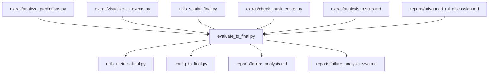
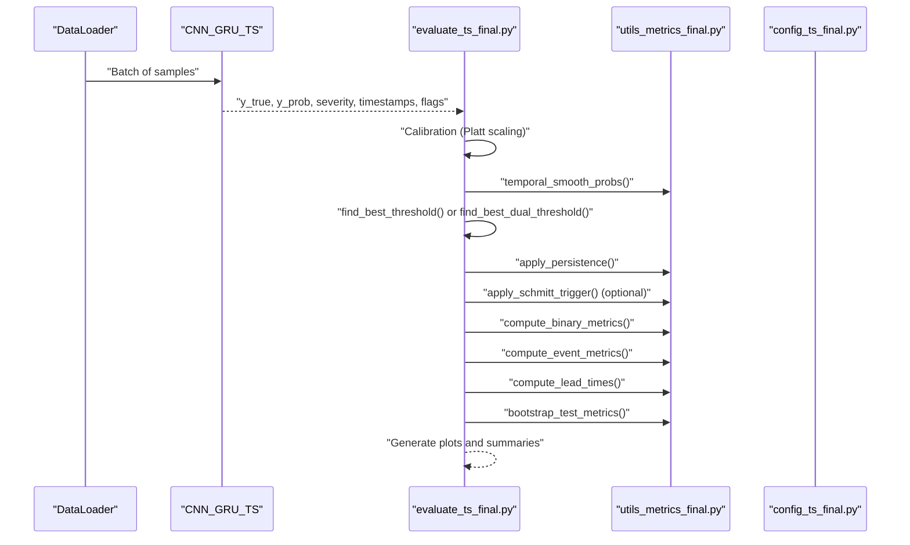
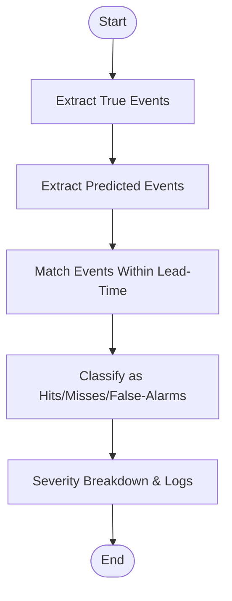
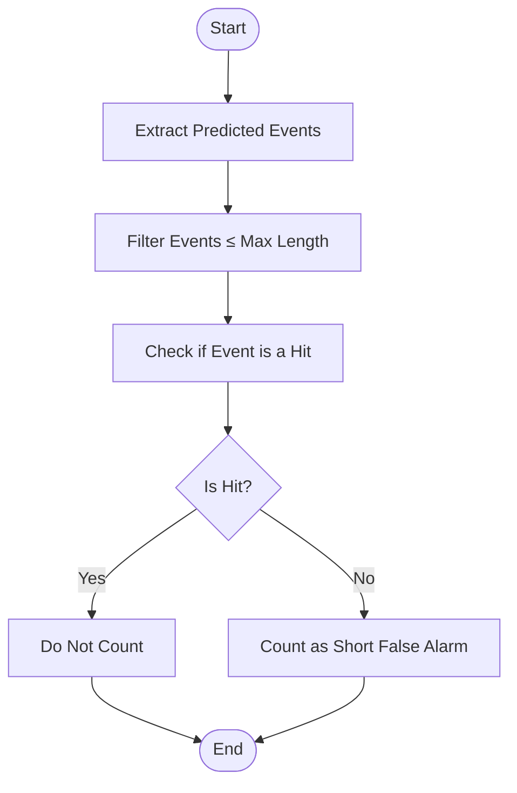
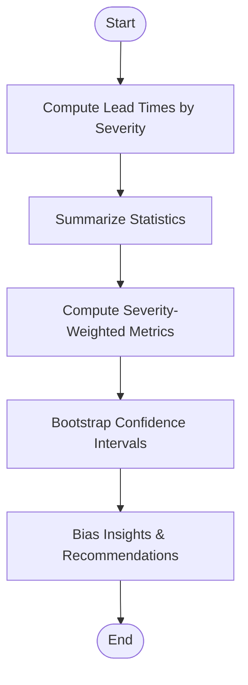
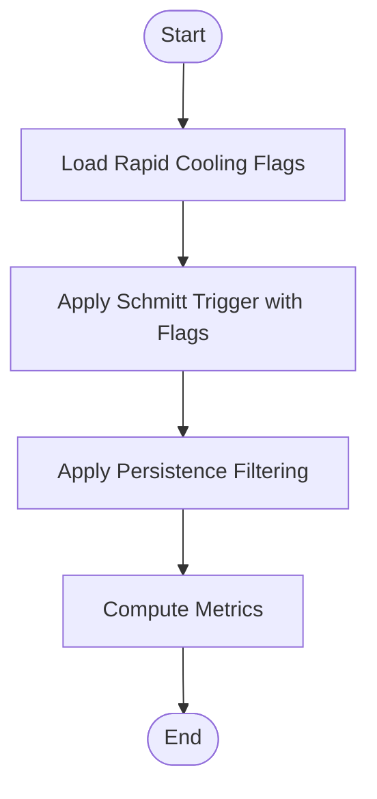
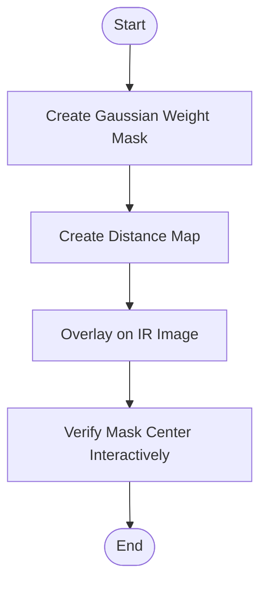
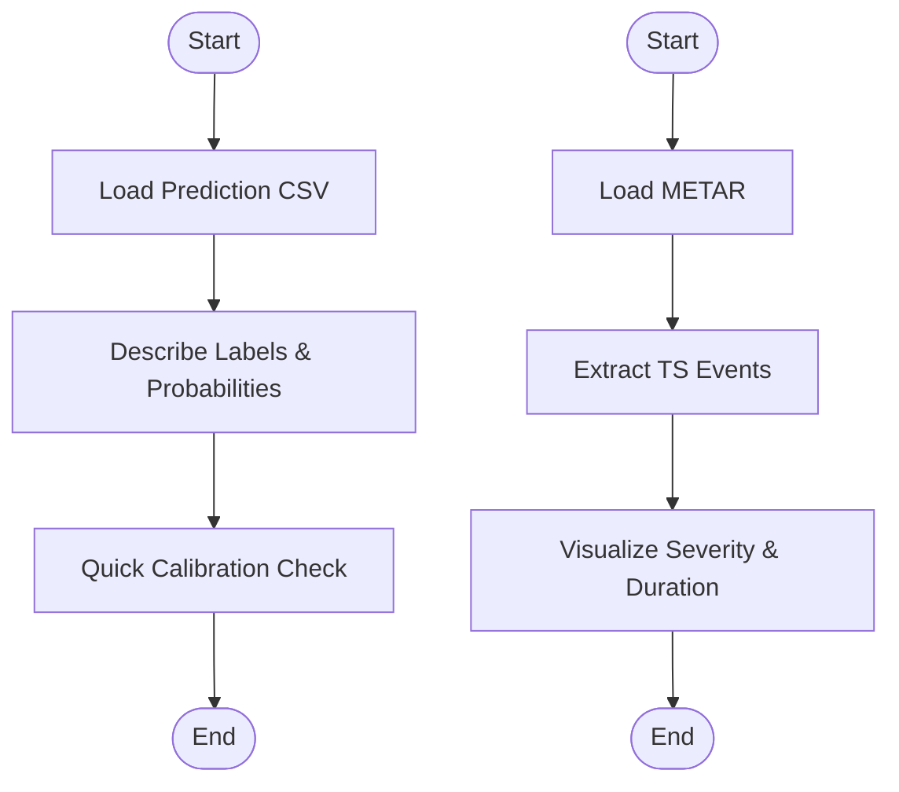

# Failure Analysis & Error Characterization

<cite>
**Referenced Files in This Document**
- [evaluate_ts_final.py](file://evaluate_ts_final.py)
- [utils_metrics_final.py](file://utils_metrics_final.py)
- [config_ts_final.py](file://config_ts_final.py)
- [reports/failure_analysis.md](file://reports/failure_analysis.md)
- [reports/failure_analysis_swa.md](file://reports/failure_analysis_swa.md)
- [extras/analyze_predictions.py](file://extras/analyze_predictions.py)
- [extras/visualize_ts_events.py](file://extras/visualize_ts_events.py)
- [utils_spatial_final.py](file://utils_spatial_final.py)
- [extras/check_mask_center.py](file://extras/check_mask_center.py)
- [analysis_results.md](file://extras/analysis_results.md)
- [advanced_ml_discussion.md](file://reports/advanced_ml_discussion.md)
</cite>

## Table of Contents
1. [Introduction](#introduction)
2. [Project Structure](#project-structure)
3. [Core Components](#core-components)
4. [Architecture Overview](#architecture-overview)
5. [Detailed Component Analysis](#detailed-component-analysis)
6. [Dependency Analysis](#dependency-analysis)
7. [Performance Considerations](#performance-considerations)
8. [Troubleshooting Guide](#troubleshooting-guide)
9. [Conclusion](#conclusion)
10. [Appendices](#appendices)

## Introduction
This document describes the failure analysis procedures and error characterization framework for the Nagpur thunderstorm nowcasting system. It explains how the system detects and categorizes model failures, including missed events, false alarms, and near-miss detections. It documents the false alarm categorization methodology, including short-duration false alarms and their statistical characterization. It also covers systematic error pattern identification techniques such as temporal bias analysis and spatial error mapping. Finally, it details the rapid cooling event flagging system and its role in model reliability assessment, along with guidance for interpreting failure patterns, mitigating errors, and establishing continuous improvement workflows.

## Project Structure
The failure analysis pipeline integrates evaluation scripts, metrics utilities, configuration, and diagnostic tools:
- Evaluation and scoring: [evaluate_ts_final.py](file://evaluate_ts_final.py)
- Metrics and post-processing: [utils_metrics_final.py](file://utils_metrics_final.py)
- Configuration and thresholds: [config_ts_final.py](file://config_ts_final.py)
- Failure reports: [reports/failure_analysis.md](file://reports/failure_analysis.md), [reports/failure_analysis_swa.md](file://reports/failure_analysis_swa.md)
- Diagnostic utilities: [extras/analyze_predictions.py](file://extras/analyze_predictions.py), [extras/visualize_ts_events.py](file://extras/visualize_ts_events.py), [utils_spatial_final.py](file://utils_spatial_final.py), [extras/check_mask_center.py](file://extras/check_mask_center.py)
- Additional analysis: [analysis_results.md](file://extras/analysis_results.md), [advanced_ml_discussion.md](file://reports/advanced_ml_discussion.md)

**Diagram sources**
- [evaluate_ts_final.py:1-908](file://evaluate_ts_final.py#L1-L908)
- [utils_metrics_final.py:1-760](file://utils_metrics_final.py#L1-L760)
- [config_ts_final.py:1-208](file://config_ts_final.py#L1-L208)
- [reports/failure_analysis.md:1-71](file://reports/failure_analysis.md#L1-L71)
- [reports/failure_analysis_swa.md:1-79](file://reports/failure_analysis_swa.md#L1-L79)
- [extras/analyze_predictions.py:1-64](file://extras/analyze_predictions.py#L1-L64)
- [extras/visualize_ts_events.py:1-217](file://extras/visualize_ts_events.py#L1-L217)
- [utils_spatial_final.py:1-80](file://utils_spatial_final.py#L1-L80)
- [extras/check_mask_center.py:1-78](file://extras/check_mask_center.py#L1-L78)
- [analysis_results.md:182-226](file://extras/analysis_results.md#L182-L226)
- [advanced_ml_discussion.md:1-305](file://reports/advanced_ml_discussion.md#L1-L305)

**Section sources**
- [evaluate_ts_final.py:1-908](file://evaluate_ts_final.py#L1-L908)
- [utils_metrics_final.py:1-760](file://utils_metrics_final.py#L1-L760)
- [config_ts_final.py:1-208](file://config_ts_final.py#L1-L208)

## Core Components
- Threshold selection and calibration: The evaluation script derives thresholds from validation data and applies Platt scaling to improve reliability. It supports both single-threshold and dual-threshold (Schmitt trigger) strategies.
- Persistence filtering: Post-processing removes short-lived false alarms and preserves severe events above a fast-track threshold.
- Event-level metrics: Computes event-based POD/FAR/CSI with lead-time constraints and severity weighting.
- Lead-time analysis: Computes mean/median lead times and categorizes by storm severity.
- Rapid cooling flagging: Incorporates flags indicating rapid cooling events to influence triggering logic.
- Diagnostic utilities: Provides quick prediction CSV analysis, spatial masks, and temporal attention visualization.

**Section sources**
- [evaluate_ts_final.py:500-620](file://evaluate_ts_final.py#L500-L620)
- [utils_metrics_final.py:23-77](file://utils_metrics_final.py#L23-L77)
- [utils_metrics_final.py:322-392](file://utils_metrics_final.py#L322-L392)
- [utils_metrics_final.py:395-477](file://utils_metrics_final.py#L395-L477)
- [utils_metrics_final.py:243-260](file://utils_metrics_final.py#L243-L260)
- [extras/analyze_predictions.py:1-64](file://extras/analyze_predictions.py#L1-L64)

## Architecture Overview
The failure analysis workflow follows a structured pipeline:
- Inference on test set with optional uncertainty estimation
- Calibration and temporal smoothing
- Threshold selection (single or dual)
- Persistence filtering and rapid cooling flagging
- Frame and event-level metrics computation
- Lead-time statistics and severity breakdown
- Diagnostic plotting and bootstrap confidence intervals

**Diagram sources**
- [evaluate_ts_final.py:450-620](file://evaluate_ts_final.py#L450-L620)
- [utils_metrics_final.py:23-77](file://utils_metrics_final.py#L23-L77)
- [utils_metrics_final.py:120-190](file://utils_metrics_final.py#L120-L190)
- [utils_metrics_final.py:322-392](file://utils_metrics_final.py#L322-L392)
- [utils_metrics_final.py:395-477](file://utils_metrics_final.py#L395-L477)
- [utils_metrics_final.py:653-760](file://utils_metrics_final.py#L653-L760)

## Detailed Component Analysis

### Event Detection Analysis Workflow
The workflow identifies missed events, false alarms, and near-miss detections by:
- Converting binary sequences to event spans using an event extraction routine
- Matching true events to predictions within a lead-time tolerance
- Computing hit/miss/false-alarm counts and severity-weighted metrics
- Logging missed events with timestamps and severity labels

**Diagram sources**
- [utils_metrics_final.py:322-392](file://utils_metrics_final.py#L322-L392)
- [utils_metrics_final.py:520-572](file://utils_metrics_final.py#L520-L572)

**Section sources**
- [utils_metrics_final.py:322-392](file://utils_metrics_final.py#L322-L392)
- [utils_metrics_final.py:520-572](file://utils_metrics_final.py#L520-L572)
- [evaluate_ts_final.py:625-641](file://evaluate_ts_final.py#L625-L641)

### False Alarm Categorization and Statistical Characterization
False alarms are categorized and characterized by:
- Duration and maximum probability
- Monthly distribution
- Short false alarm counting using a dedicated routine that counts predicted events ≤ a minimum length that are not hits

**Diagram sources**
- [utils_metrics_final.py:80-94](file://utils_metrics_final.py#L80-L94)

**Section sources**
- [utils_metrics_final.py:80-94](file://utils_metrics_final.py#L80-L94)
- [evaluate_ts_final.py:608-610](file://evaluate_ts_final.py#L608-L610)

### Systematic Error Pattern Identification
Systematic biases are identified through:
- Temporal bias analysis: Mean/median lead times and early/late detection rates by severity category
- Severity-weighted metrics: Emphasizing rare/severe events and penalizing late detections
- Bootstrap confidence intervals: Temporal block bootstrapping by calendar day for robust uncertainty quantification

**Diagram sources**
- [utils_metrics_final.py:395-477](file://utils_metrics_final.py#L395-L477)
- [utils_metrics_final.py:575-650](file://utils_metrics_final.py#L575-L650)
- [utils_metrics_final.py:653-760](file://utils_metrics_final.py#L653-L760)

**Section sources**
- [utils_metrics_final.py:395-477](file://utils_metrics_final.py#L395-L477)
- [utils_metrics_final.py:575-650](file://utils_metrics_final.py#L575-L650)
- [utils_metrics_final.py:653-760](file://utils_metrics_final.py#L653-L760)
- [evaluate_ts_final.py:740-800](file://evaluate_ts_final.py#L740-L800)

### Rapid Cooling Event Flagging System
Rapid cooling flags are integrated into the triggering logic:
- Schmitt trigger uses high/low thresholds and flags to enable immediate triggering
- Dual-threshold grid search optimizes thresholds with rapid cooling flags
- Fast-track severe threshold can bypass persistence for high-probability severe events

**Diagram sources**
- [utils_metrics_final.py:243-260](file://utils_metrics_final.py#L243-L260)
- [utils_metrics_final.py:263-314](file://utils_metrics_final.py#L263-L314)
- [evaluate_ts_final.py:550-573](file://evaluate_ts_final.py#L550-L573)

**Section sources**
- [utils_metrics_final.py:243-260](file://utils_metrics_final.py#L243-L260)
- [utils_metrics_final.py:263-314](file://utils_metrics_final.py#L263-L314)
- [evaluate_ts_final.py:550-573](file://evaluate_ts_final.py#L550-L573)

### Spatial Error Mapping and Masking
Spatial focus is achieved via:
- Gaussian weight masks centered on Nagpur
- Distance maps highlighting the station boundary
- Interactive mask center verification

**Diagram sources**
- [utils_spatial_final.py:12-65](file://utils_spatial_final.py#L12-L65)
- [extras/check_mask_center.py:1-78](file://extras/check_mask_center.py#L1-L78)

**Section sources**
- [utils_spatial_final.py:12-65](file://utils_spatial_final.py#L12-L65)
- [extras/check_mask_center.py:1-78](file://extras/check_mask_center.py#L1-L78)

### Diagnostic Utilities and Quick Checks
Diagnostic utilities support failure analysis:
- Quick prediction CSV analysis for label/probability distributions and calibration checks
- Thunderstorm event visualization by severity and duration timelines
- Temporal attention visualization for interpretability

**Diagram sources**
- [extras/analyze_predictions.py:1-64](file://extras/analyze_predictions.py#L1-L64)
- [extras/visualize_ts_events.py:1-217](file://extras/visualize_ts_events.py#L1-L217)

**Section sources**
- [extras/analyze_predictions.py:1-64](file://extras/analyze_predictions.py#L1-L64)
- [extras/visualize_ts_events.py:1-217](file://extras/visualize_ts_events.py#L1-L217)

## Dependency Analysis
Key dependencies and relationships:
- Evaluation script depends on metrics utilities for post-processing and scoring
- Configuration controls threshold selection, smoothing, persistence, and trigger parameters
- Reports provide failure case summaries for comparison across runs
- Diagnostic tools complement evaluation with quick checks and visualizations

**Diagram sources**
- [evaluate_ts_final.py:1-908](file://evaluate_ts_final.py#L1-L908)
- [utils_metrics_final.py:1-760](file://utils_metrics_final.py#L1-L760)
- [config_ts_final.py:1-208](file://config_ts_final.py#L1-L208)
- [reports/failure_analysis.md:1-71](file://reports/failure_analysis.md#L1-L71)
- [reports/failure_analysis_swa.md:1-79](file://reports/failure_analysis_swa.md#L1-L79)
- [extras/analyze_predictions.py:1-64](file://extras/analyze_predictions.py#L1-L64)
- [extras/visualize_ts_events.py:1-217](file://extras/visualize_ts_events.py#L1-L217)
- [utils_spatial_final.py:1-80](file://utils_spatial_final.py#L1-L80)
- [extras/check_mask_center.py:1-78](file://extras/check_mask_center.py#L1-L78)
- [analysis_results.md:182-226](file://extras/analysis_results.md#L182-L226)
- [advanced_ml_discussion.md:1-305](file://reports/advanced_ml_discussion.md#L1-L305)

**Section sources**
- [evaluate_ts_final.py:1-908](file://evaluate_ts_final.py#L1-L908)
- [utils_metrics_final.py:1-760](file://utils_metrics_final.py#L1-L760)
- [config_ts_final.py:1-208](file://config_ts_final.py#L1-L208)

## Performance Considerations
- Temporal smoothing and persistence filtering reduce temporal chattering but can extend late detections backward; tuning smoothing window and persistence thresholds is essential.
- Dual-threshold optimization with rapid cooling flags improves reliability for severe events.
- Bootstrap confidence intervals provide robust uncertainty quantification under temporal autocorrelation.

[No sources needed since this section provides general guidance]

## Troubleshooting Guide
Common failure patterns and mitigation strategies:
- Over-prediction bias: Increase persistence minimum length and adjust thresholds; consider Platt scaling.
- Seasonal distribution shift: Recalibrate thresholds on seasonal splits; incorporate month embeddings.
- Small validation sets: Use bootstrap confidence intervals; increase sample sizes or reduce model complexity.
- Temporal smoothing artifacts: Reduce smoothing window or switch to mean smoothing; validate on holdout periods.
- Rapid cooling flagging: Tune Schmitt trigger thresholds and fast-track severe thresholds to balance sensitivity and specificity.

**Section sources**
- [analysis_results.md:182-226](file://extras/analysis_results.md#L182-L226)
- [advanced_ml_discussion.md:287-302](file://reports/advanced_ml_discussion.md#L287-L302)
- [evaluate_ts_final.py:520-573](file://evaluate_ts_final.py#L520-L573)
- [utils_metrics_final.py:23-77](file://utils_metrics_final.py#L23-L77)

## Conclusion
The failure analysis framework combines rigorous event-level metrics, temporal bias diagnostics, and spatial focus mechanisms to characterize model errors and systematic biases. By integrating rapid cooling flagging, dual-threshold optimization, and bootstrap validation, the system achieves reliable operational performance. Continuous improvement hinges on iterative threshold recalibration, persistence tuning, and seasonal adaptation informed by failure reports and diagnostic utilities.

[No sources needed since this section summarizes without analyzing specific files]

## Appendices

### Appendix A: Failure Reports Overview
- Standard failure report: [reports/failure_analysis.md:1-71](file://reports/failure_analysis.md#L1-L71)
- SWA failure report: [reports/failure_analysis_swa.md:1-79](file://reports/failure_analysis_swa.md#L1-L79)

**Section sources**
- [reports/failure_analysis.md:1-71](file://reports/failure_analysis.md#L1-L71)
- [reports/failure_analysis_swa.md:1-79](file://reports/failure_analysis_swa.md#L1-L79)

### Appendix B: Configuration Controls for Failure Mitigation
- Threshold metric selection, smoothing, persistence, and trigger parameters are configured centrally.

**Section sources**
- [config_ts_final.py:87-136](file://config_ts_final.py#L87-L136)