# Performance Metrics & Evaluation

<cite>
**Referenced Files in This Document**
- [utils_metrics_final.py](file://utils_metrics_final.py)
- [evaluate_ts_final.py](file://evaluate_ts_final.py)
- [config_ts_final.py](file://config_ts_final.py)
- [validation-cv-bootstrap.md](file://reports/validation-cv-bootstrap.md)
- [evaluation_report.md](file://reports/evaluation_report.md)
- [analyze_predictions.py](file://extras/analyze_predictions.py)
</cite>

## Table of Contents
1. [Introduction](#introduction)
2. [Project Structure](#project-structure)
3. [Core Components](#core-components)
4. [Architecture Overview](#architecture-overview)
5. [Detailed Component Analysis](#detailed-component-analysis)
6. [Dependency Analysis](#dependency-analysis)
7. [Performance Considerations](#performance-considerations)
8. [Troubleshooting Guide](#troubleshooting-guide)
9. [Conclusion](#conclusion)
10. [Appendices](#appendices)

## Introduction
This document explains the comprehensive performance metrics system used to evaluate the thunderstorm nowcasting model. It covers:
- Distinctions between frame-level and event-level metrics (POD, FAR, CSI, ETS, SEDI, F1/F2)
- Weighted event metrics for severity-aware evaluation
- Bootstrap confidence intervals for statistical significance testing
- Lead time analysis (early detection rates and temporal accuracy)
- Confusion matrix, ROC-AUC, and PR-AUC computation from raw probabilities
- Persistence filter effectiveness measurement
- Guidance on metric interpretation, benchmarking, and significance testing

## Project Structure
The evaluation pipeline integrates model inference, post-processing, and comprehensive metrics computation:
- Inference and post-processing: [evaluate_ts_final.py](file://evaluate_ts_final.py)
- Metrics computation and bootstrapping: [utils_metrics_final.py](file://utils_metrics_final.py)
- Configuration controlling thresholds, lead time, and severity weights: [config_ts_final.py](file://config_ts_final.py)
- Validation and bootstrap report: [validation-cv-bootstrap.md](file://reports/validation-cv-bootstrap.md)
- Model comparison report: [evaluation_report.md](file://reports/evaluation_report.md)
- Quick prediction analysis: [analyze_predictions.py](file://extras/analyze_predictions.py)

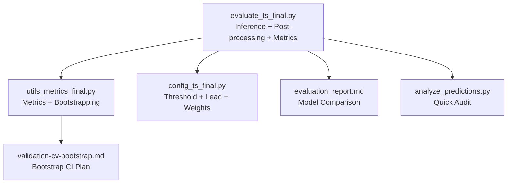

**Diagram sources**
- [evaluate_ts_final.py:1-908](file://evaluate_ts_final.py#L1-L908)
- [utils_metrics_final.py:1-760](file://utils_metrics_final.py#L1-L760)
- [config_ts_final.py:1-208](file://config_ts_final.py#L1-L208)
- [validation-cv-bootstrap.md:1-89](file://reports/validation-cv-bootstrap.md#L1-L89)
- [evaluation_report.md:1-58](file://reports/evaluation_report.md#L1-L58)
- [analyze_predictions.py:1-64](file://extras/analyze_predictions.py#L1-L64)

**Section sources**
- [evaluate_ts_final.py:1-908](file://evaluate_ts_final.py#L1-L908)
- [utils_metrics_final.py:1-760](file://utils_metrics_final.py#L1-L760)
- [config_ts_final.py:1-208](file://config_ts_final.py#L1-L208)

## Core Components
- Frame-level metrics: POD, FAR, CSI, ETS, SEDI, F1, F2 computed from thresholded predictions
- Event-level metrics: IMD-style overlap-based POD, FAR, CSI, SEDI with lead-time constraints
- Weighted event metrics: Severity-weighted POD/FAR/CSI with lead-time bonuses
- Temporal post-processing: smoothing, persistence filter, Schmitt trigger hysteresis
- Statistical significance: temporal block bootstrap by calendar day
- Discriminative quality: ROC-AUC and PR-AUC from raw probabilities

**Section sources**
- [utils_metrics_final.py:120-190](file://utils_metrics_final.py#L120-L190)
- [utils_metrics_final.py:338-392](file://utils_metrics_final.py#L338-L392)
- [utils_metrics_final.py:575-650](file://utils_metrics_final.py#L575-L650)
- [utils_metrics_final.py:653-760](file://utils_metrics_final.py#L653-L760)
- [evaluate_ts_final.py:612-623](file://evaluate_ts_final.py#L612-L623)

## Architecture Overview
The evaluation workflow:
1. Inference on test set yields raw probabilities and severity labels
2. Optional Platt scaling calibration
3. Temporal smoothing and threshold selection (single or dual thresholds)
4. Persistence filter and severe fast-track
5. Metrics computation (frame, event, weighted event, lead times)
6. Bootstrap confidence intervals on test set

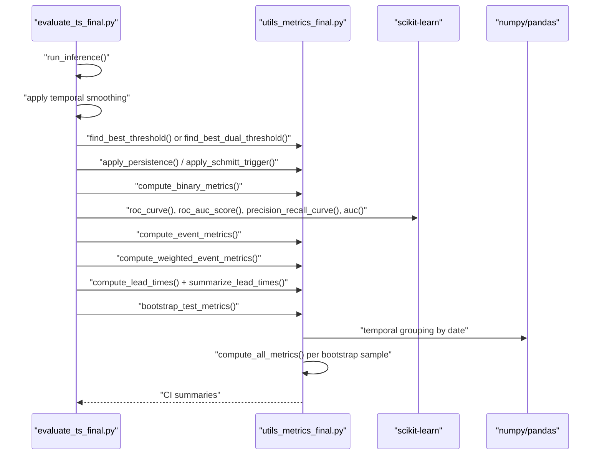

**Diagram sources**
- [evaluate_ts_final.py:500-800](file://evaluate_ts_final.py#L500-L800)
- [utils_metrics_final.py:192-314](file://utils_metrics_final.py#L192-L314)
- [utils_metrics_final.py:653-760](file://utils_metrics_final.py#L653-L760)

## Detailed Component Analysis

### Frame-Level Metrics (POD, FAR, CSI, ETS, SEDI, F1/F2)
- Computation from thresholded predictions using true positives, false positives, false negatives, true negatives
- ETS adjusts for random chance; SEDI is base-rate independent for rare events
- F1 and F2 emphasize recall with different penalties for false positives

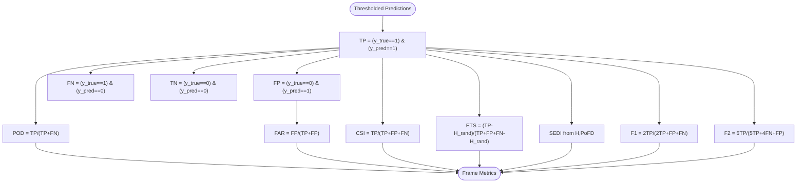

**Diagram sources**
- [utils_metrics_final.py:120-152](file://utils_metrics_final.py#L120-L152)

**Section sources**
- [utils_metrics_final.py:120-152](file://utils_metrics_final.py#L120-L152)
- [evaluate_ts_final.py:607](file://evaluate_ts_final.py#L607)

### Event-Level Metrics (IMD-style)
- Events extracted as contiguous 1-segments; short events filtered by minimum length
- Overlap-based matching with lead-time constraint (prediction must occur within a maximum lead window)
- POD, FAR, CSI computed from matched hits, misses, false alarms
- SEDI estimated using hit rate and POFD approximated from counts

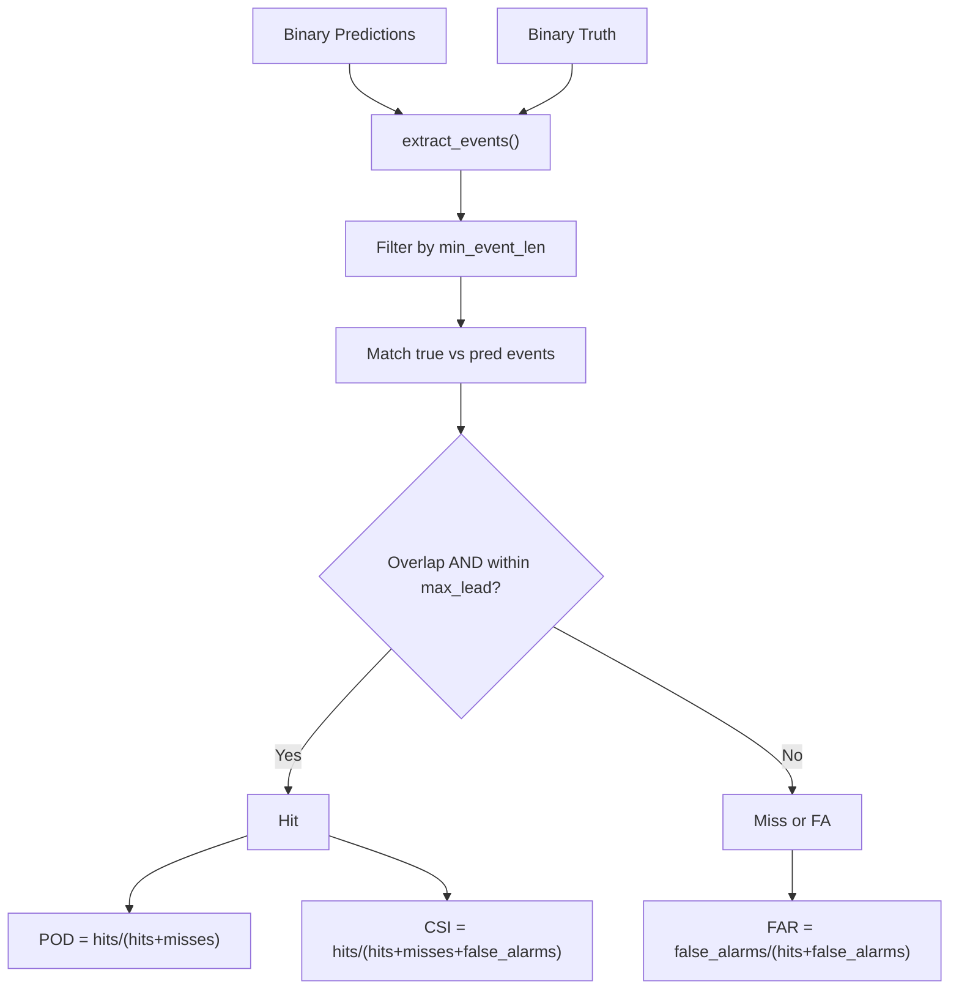

**Diagram sources**
- [utils_metrics_final.py:322-392](file://utils_metrics_final.py#L322-L392)

**Section sources**
- [utils_metrics_final.py:338-392](file://utils_metrics_final.py#L338-L392)

### Weighted Event Metrics (Severity-Aware)
- Severity weights applied to hits and misses; false alarms weighted uniformly
- Lead-time bonus: +10% per step early detection (up to a cap)
- Additional bonuses: early detection rate ≥ 60% adds +0.05; safe POD bonus ≥ 0.60 adds +0.05
- Outputs: weighted POD, weighted FAR, weighted CSI, and lead-time corrected wCSI

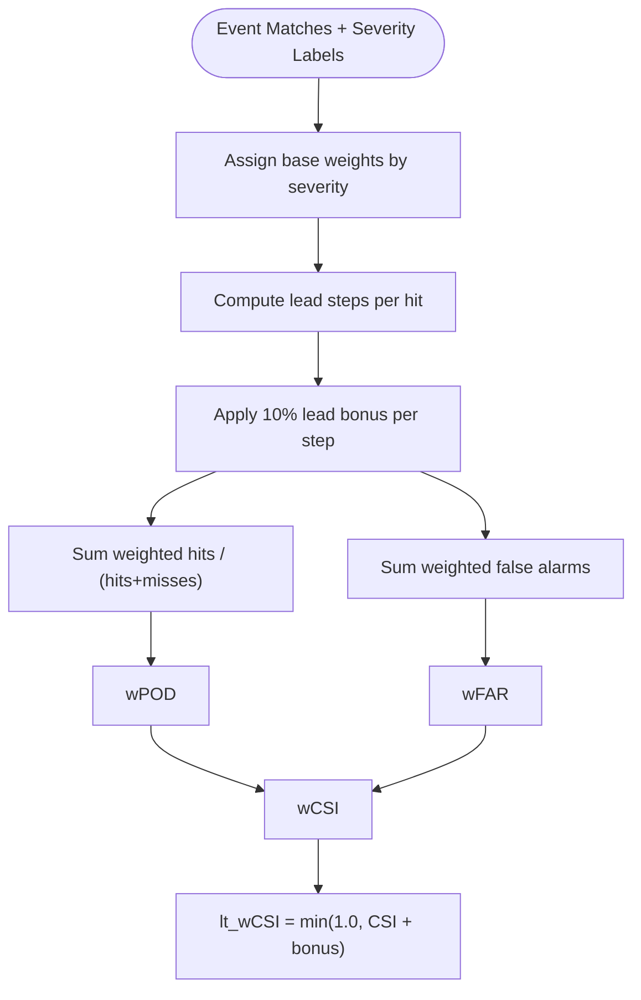

**Diagram sources**
- [utils_metrics_final.py:575-650](file://utils_metrics_final.py#L575-L650)

**Section sources**
- [utils_metrics_final.py:479-518](file://utils_metrics_final.py#L479-L518)
- [utils_metrics_final.py:575-650](file://utils_metrics_final.py#L575-L650)

### Threshold Selection and Post-Processing
- Single threshold grid-search optimizing chosen metric (default: lead-time corrected weighted CSI)
- Dual-threshold Schmitt trigger hysteresis with separate high/low thresholds
- Temporal smoothing (EMA or rolling mean)
- Persistence filter removes short isolated false alarms; severe fast-track keeps runs with high-prob severe events

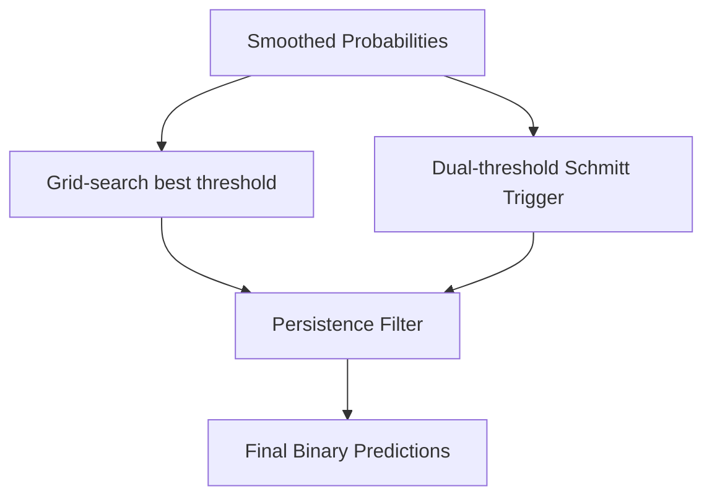

**Diagram sources**
- [utils_metrics_final.py:192-314](file://utils_metrics_final.py#L192-L314)
- [utils_metrics_final.py:23-47](file://utils_metrics_final.py#L23-L47)
- [utils_metrics_final.py:50-77](file://utils_metrics_final.py#L50-L77)

**Section sources**
- [utils_metrics_final.py:192-314](file://utils_metrics_final.py#L192-L314)
- [evaluate_ts_final.py:508-600](file://evaluate_ts_final.py#L508-L600)
- [config_ts_final.py:92-94](file://config_ts_final.py#L92-L94)

### Lead Time Analysis
- Lead time per true event: event_start minus earliest valid prediction within lead window
- Positive lead indicates early detection; negative indicates late detection; None indicates miss
- Summary statistics: mean, median, early detection rate, late detection rate, miss rate
- Optional breakdown by thunderstorm category

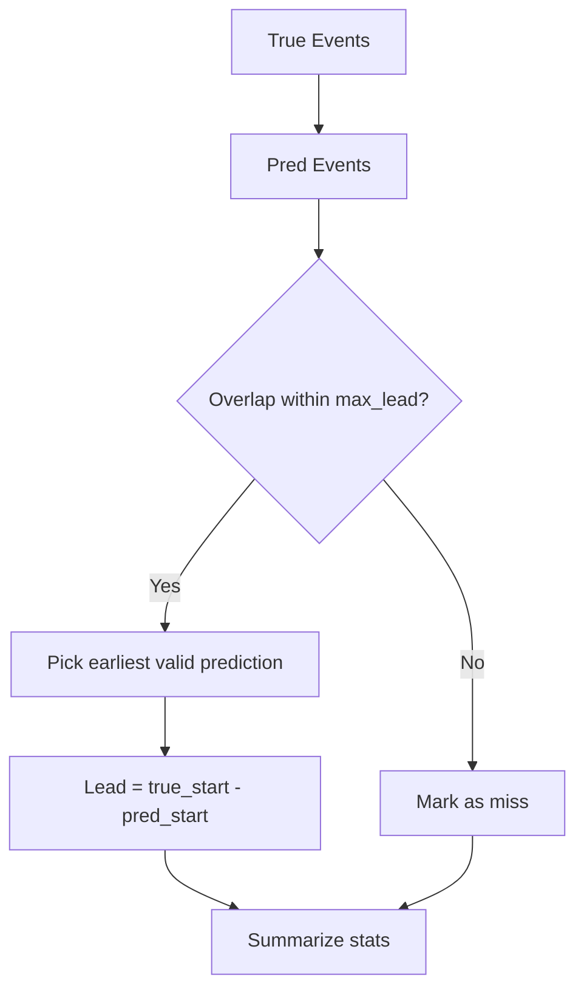

**Diagram sources**
- [utils_metrics_final.py:395-477](file://utils_metrics_final.py#L395-L477)

**Section sources**
- [utils_metrics_final.py:395-477](file://utils_metrics_final.py#L395-L477)
- [evaluate_ts_final.py:629-641](file://evaluate_ts_final.py#L629-L641)

### Discriminative Quality: ROC-AUC and PR-AUC
- Computed from raw probabilities (threshold-independent)
- ROC-AUC measures TPR vs FPR across thresholds
- PR-AUC measures precision-recall trade-offs

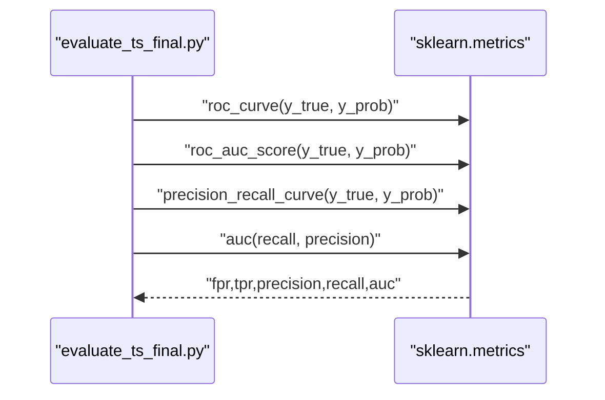

**Diagram sources**
- [evaluate_ts_final.py:612-623](file://evaluate_ts_final.py#L612-L623)

**Section sources**
- [evaluate_ts_final.py:612-623](file://evaluate_ts_final.py#L612-L623)

### Confusion Matrix Analysis
- Counts of true positives, false positives, false negatives, true negatives
- Percentages shown for interpretability

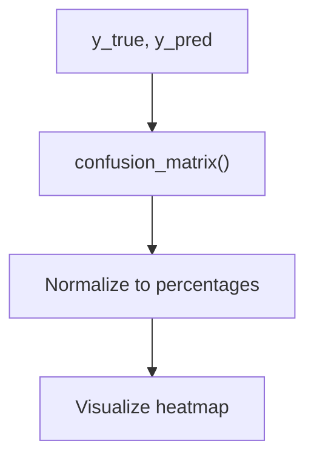

**Diagram sources**
- [evaluate_ts_final.py:41-56](file://evaluate_ts_final.py#L41-L56)

**Section sources**
- [evaluate_ts_final.py:41-56](file://evaluate_ts_final.py#L41-L56)

### Bootstrap Confidence Intervals (Temporal Block Bootstrap)
- Samples calendar days with replacement; recomputes all metrics on resampled sequences
- Produces point estimates and 95% confidence intervals for frame, event, and weighted metrics
- Uses step-minutes conversion for lead-time summaries

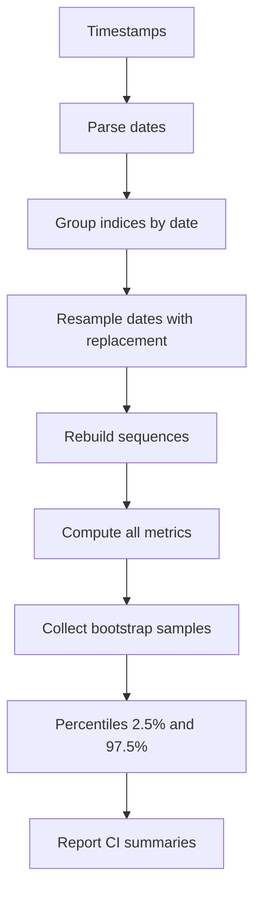

**Diagram sources**
- [utils_metrics_final.py:653-760](file://utils_metrics_final.py#L653-L760)

**Section sources**
- [utils_metrics_final.py:653-760](file://utils_metrics_final.py#L653-L760)
- [evaluate_ts_final.py:744-799](file://evaluate_ts_final.py#L744-L799)

### Persistence Filter Effectiveness Measurement
- Counts short false alarms (≤ min_len frames) that are not matched to true events
- Helps quantify impact of persistence filter on reducing spurious detections

**Section sources**
- [utils_metrics_final.py:80-94](file://utils_metrics_final.py#L80-L94)
- [evaluate_ts_final.py:608](file://evaluate_ts_final.py#L608)

## Dependency Analysis
- Evaluation depends on metrics utilities for computations and bootstrapping
- Configuration controls threshold metric, lead time limits, smoothing, and severity weights
- Validation report documents bootstrap CI plan and threshold metric updates

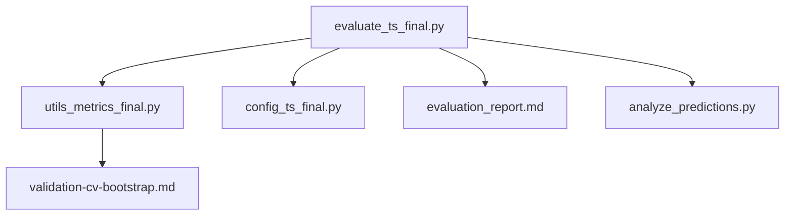

**Diagram sources**
- [evaluate_ts_final.py:1-908](file://evaluate_ts_final.py#L1-L908)
- [utils_metrics_final.py:1-760](file://utils_metrics_final.py#L1-L760)
- [config_ts_final.py:1-208](file://config_ts_final.py#L1-L208)
- [validation-cv-bootstrap.md:1-89](file://reports/validation-cv-bootstrap.md#L1-L89)
- [evaluation_report.md:1-58](file://reports/evaluation_report.md#L1-L58)
- [analyze_predictions.py:1-64](file://extras/analyze_predictions.py#L1-L64)

**Section sources**
- [evaluate_ts_final.py:1-908](file://evaluate_ts_final.py#L1-L908)
- [utils_metrics_final.py:1-760](file://utils_metrics_final.py#L1-L760)
- [config_ts_final.py:1-208](file://config_ts_final.py#L1-L208)
- [validation-cv-bootstrap.md:1-89](file://reports/validation-cv-bootstrap.md#L1-L89)
- [evaluation_report.md:1-58](file://reports/evaluation_report.md#L1-L58)
- [analyze_predictions.py:1-64](file://extras/analyze_predictions.py#L1-L64)

## Performance Considerations
- Use lead-time corrected weighted CSI as the primary selection metric to balance detection, false alarm control, and timeliness
- Prefer temporal smoothing and Schmitt trigger to reduce temporal chatter without over-aggressive persistence
- Calibrate probabilities (Platt scaling) when applicable to improve discriminative quality
- Monitor short false alarms to assess persistence filter effectiveness
- Use bootstrap CIs to assess statistical significance of differences across models or folds

[No sources needed since this section provides general guidance]

## Troubleshooting Guide
- If bootstrap CI fails to compute, verify timestamps and ensure at least one unique date exists
- If lead-time statistics appear off, confirm step-minutes computation and max-lead steps alignment
- If weighted metrics seem inconsistent, verify severity label mapping and minimum event length
- If ROC/PR curves look unexpected, check that raw probabilities are used (not thresholded predictions)

**Section sources**
- [utils_metrics_final.py:653-760](file://utils_metrics_final.py#L653-L760)
- [evaluate_ts_final.py:602-604](file://evaluate_ts_final.py#L602-L604)
- [evaluate_ts_final.py:629-641](file://evaluate_ts_final.py#L629-L641)

## Conclusion
The evaluation framework combines rigorous frame-level and event-level metrics with severity-aware weighting and lead-time corrections. Temporal block bootstrapping provides robust confidence intervals for statistical comparisons. The system balances detection skill, false alarm control, and operational timeliness—essential for reliable nowcasting.

[No sources needed since this section summarizes without analyzing specific files]

## Appendices

### Metric Interpretation Guidelines
- POD: Fraction of observed events correctly detected
- FAR: Fraction of predicted events that were false alarms
- CSI: Critical success index; balanced measure of hits vs. misses and false alarms
- ETS: Equitable threat score; adjusted for random chance
- SEDI: Base-rate independent skill for rare events
- F1/F2: Harmonic means emphasizing recall; F2 heavier penalty on false negatives
- Event POD/FAR/CSI: Overlap-based; accounts for event duration and timing
- Weighted metrics: Emphasize severe categories; incorporate lead-time bonuses
- ROC-AUC/PR-AUC: Discriminative ability independent of threshold

[No sources needed since this section provides general guidance]

### Benchmarking and Significance Testing Procedures
- Compare models using weighted event metrics and lead-time corrected CSI as primary criteria
- Use temporal block bootstrap to compute 95% confidence intervals for key metrics
- Report point estimates alongside lower and upper bounds for robust comparison
- For model selection, prefer lead-time corrected weighted CSI as the default threshold metric

**Section sources**
- [validation-cv-bootstrap.md:10-14](file://reports/validation-cv-bootstrap.md#L10-L14)
- [evaluate_ts_final.py:756-789](file://evaluate_ts_final.py#L756-L789)
- [config_ts_final.py:92](file://config_ts_final.py#L92)