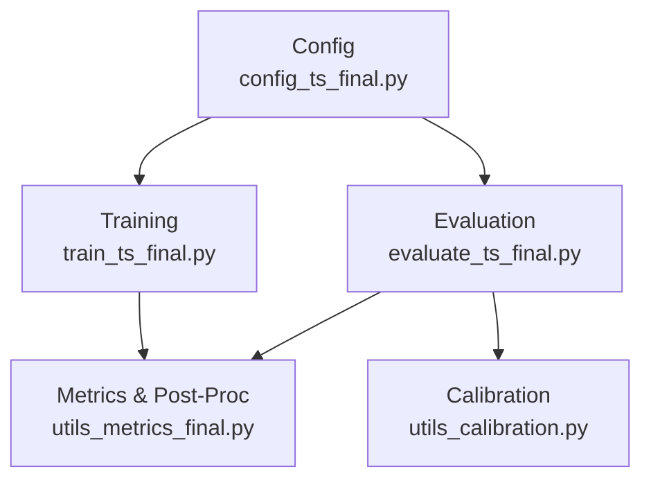
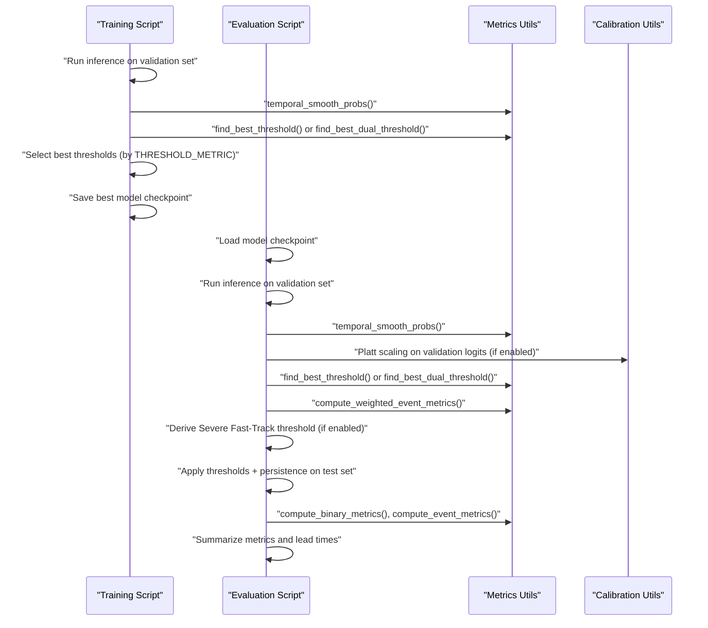
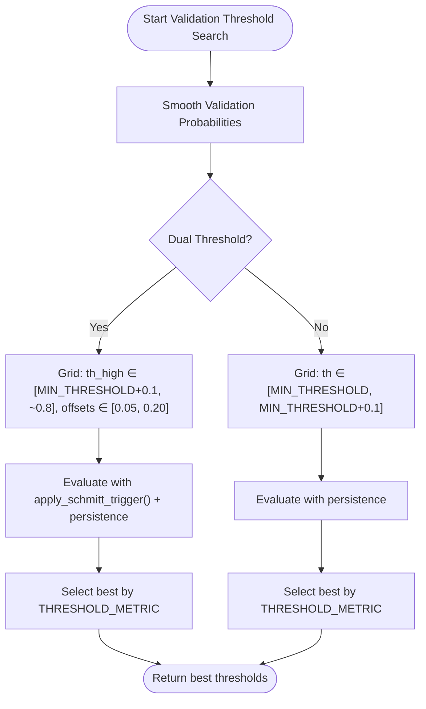
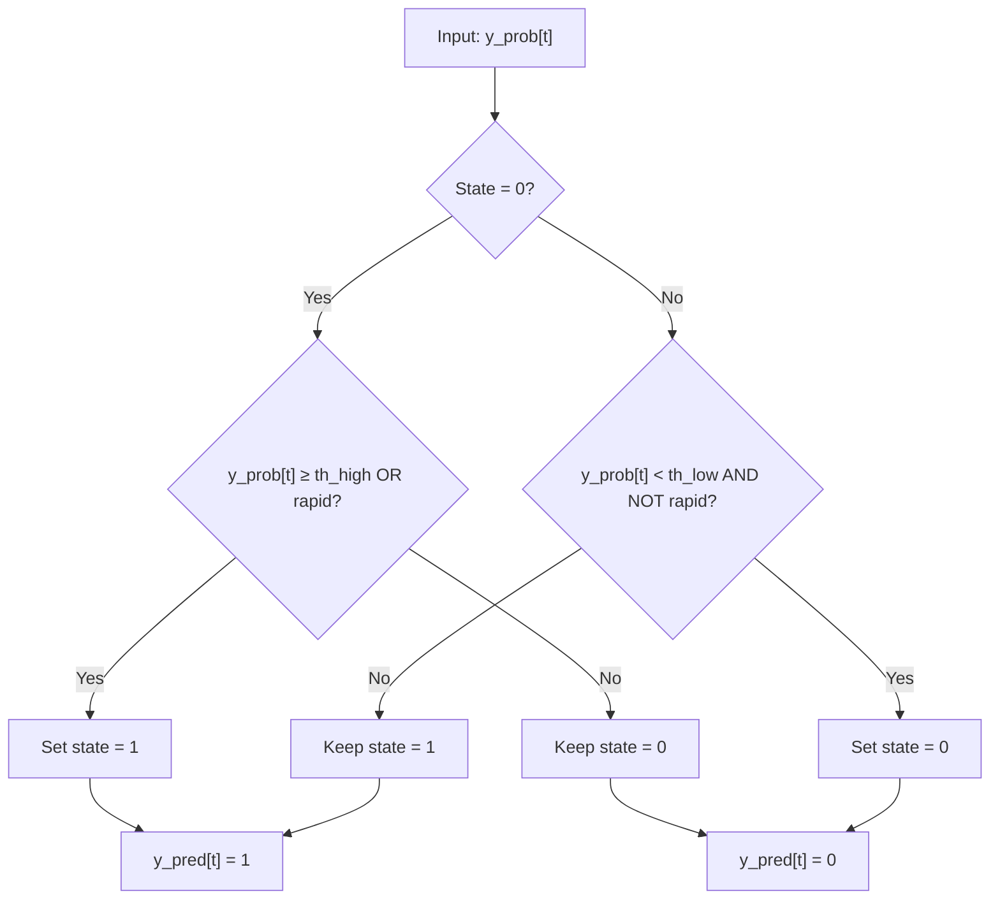
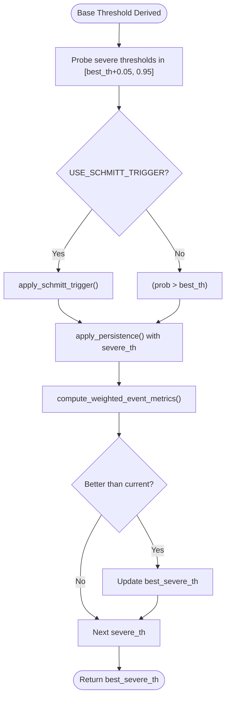
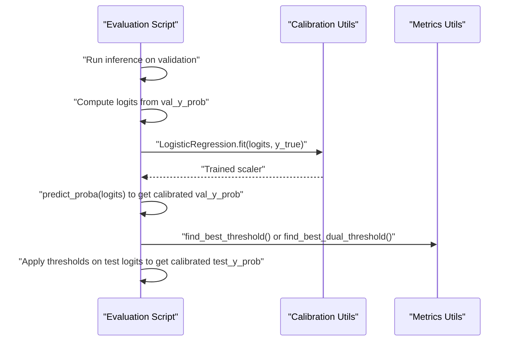
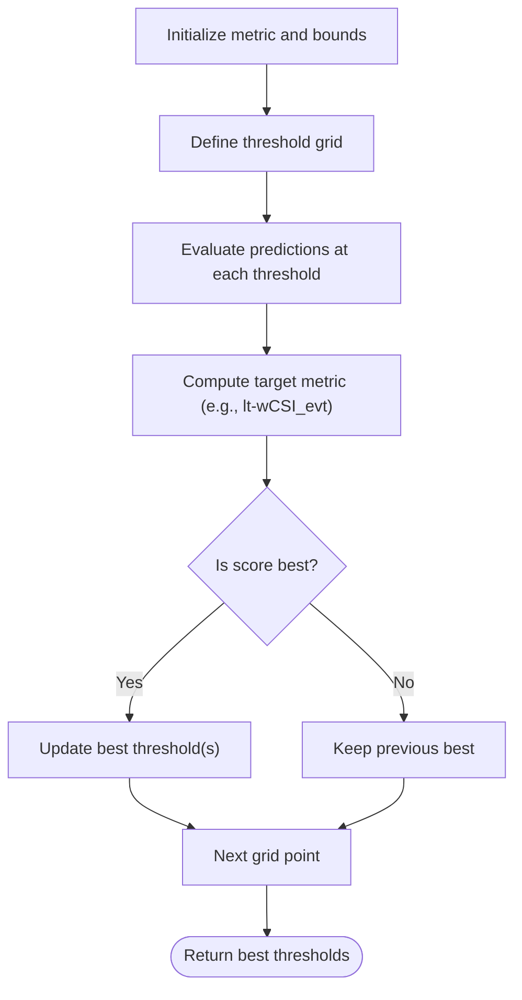
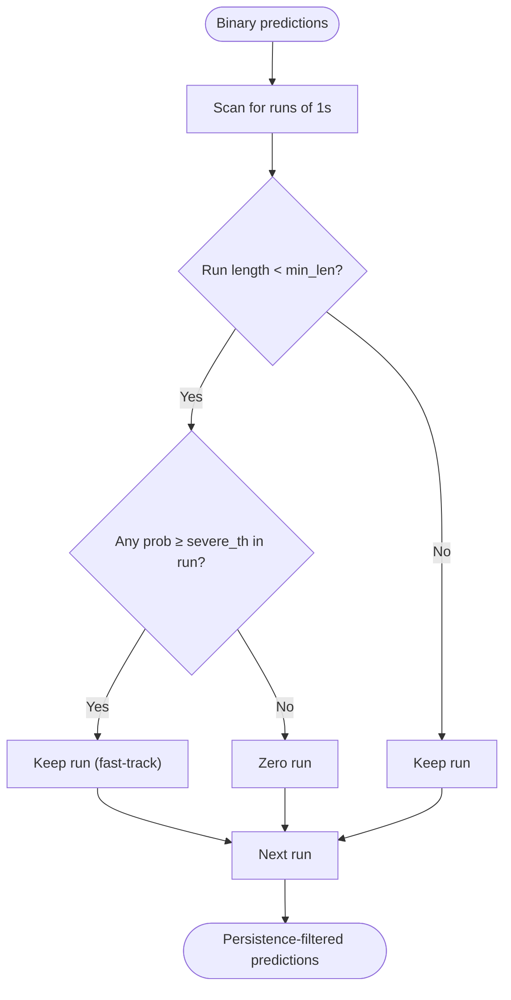
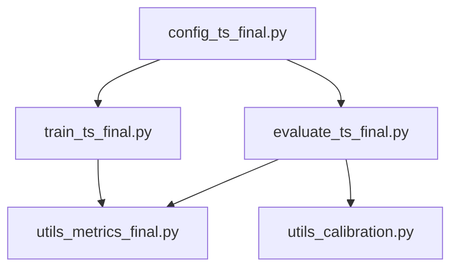

# Threshold Optimization & Calibration

<cite>
**Referenced Files in This Document**
- [config_ts_final.py](file://config_ts_final.py)
- [evaluate_ts_final.py](file://evaluate_ts_final.py)
- [train_ts_final.py](file://train_ts_final.py)
- [utils_metrics_final.py](file://utils_metrics_final.py)
- [utils_calibration.py](file://utils_calibration.py)
</cite>

## Table of Contents
1. [Introduction](#introduction)
2. [Project Structure](#project-structure)
3. [Core Components](#core-components)
4. [Architecture Overview](#architecture-overview)
5. [Detailed Component Analysis](#detailed-component-analysis)
6. [Dependency Analysis](#dependency-analysis)
7. [Performance Considerations](#performance-considerations)
8. [Troubleshooting Guide](#troubleshooting-guide)
9. [Conclusion](#conclusion)

## Introduction
This document explains the threshold optimization and calibration procedures used in the thunderstorm nowcasting system. It covers:
- Validation-set derived threshold selection methodology to prevent test set leakage
- Dual-threshold Schmitt trigger implementation for improved detection performance
- Severe weather fast-track threshold optimization
- Platt scaling calibration technique for probability recalibration and compatibility with uncertainty quantification methods
- Threshold search space configuration, metric-driven optimization criteria, and persistence filter integration
- Guidance on threshold sensitivity analysis, optimal threshold selection for different operational contexts, and calibration effectiveness assessment

## Project Structure
The threshold optimization and calibration pipeline spans configuration, training, evaluation, and utility modules:
- Configuration defines post-processing, threshold metric, and calibration flags
- Training script computes validation-derived thresholds and persists best models
- Evaluation script derives thresholds from validation, applies calibration, and evaluates on test
- Utility modules implement smoothing, persistence, Schmitt trigger, and weighted metrics

**Diagram sources**
- [config_ts_final.py:87-136](file://config_ts_final.py#L87-L136)
- [train_ts_final.py:518-536](file://train_ts_final.py#L518-L536)
- [evaluate_ts_final.py:510-548](file://evaluate_ts_final.py#L510-L548)
- [utils_metrics_final.py:23-77](file://utils_metrics_final.py#L23-L77)
- [utils_calibration.py:24-106](file://utils_calibration.py#L24-L106)

**Section sources**
- [config_ts_final.py:87-136](file://config_ts_final.py#L87-L136)
- [train_ts_final.py:518-536](file://train_ts_final.py#L518-L536)
- [evaluate_ts_final.py:510-548](file://evaluate_ts_final.py#L510-L548)
- [utils_metrics_final.py:23-77](file://utils_metrics_final.py#L23-L77)
- [utils_calibration.py:24-106](file://utils_calibration.py#L24-L106)

## Core Components
- Threshold metric and search space: configured in the configuration file and used during grid search
- Dual-threshold Schmitt trigger: enables hysteresis-based triggering and release
- Persistence filter: removes short-lived false positives and supports severe fast-track bypass
- Platt scaling: recalibrates model probabilities using logistic regression on validation logits
- Weighted event metrics: incorporate lead-time bonuses and severity weights for optimization

**Section sources**
- [config_ts_final.py:92-94](file://config_ts_final.py#L92-L94)
- [utils_metrics_final.py:243-261](file://utils_metrics_final.py#L243-L261)
- [utils_metrics_final.py:50-77](file://utils_metrics_final.py#L50-L77)
- [utils_metrics_final.py:575-650](file://utils_metrics_final.py#L575-L650)
- [utils_calibration.py:63-106](file://utils_calibration.py#L63-L106)

## Architecture Overview
The threshold optimization and calibration pipeline operates in two stages:
1) Validation-stage threshold selection and calibration
2) Test-stage application of thresholds and persistence, plus evaluation

**Diagram sources**
- [train_ts_final.py:518-536](file://train_ts_final.py#L518-L536)
- [evaluate_ts_final.py:508-548](file://evaluate_ts_final.py#L508-L548)
- [utils_metrics_final.py:23-77](file://utils_metrics_final.py#L23-L77)
- [utils_metrics_final.py:192-241](file://utils_metrics_final.py#L192-L241)
- [utils_metrics_final.py:263-314](file://utils_metrics_final.py#L263-L314)
- [utils_metrics_final.py:575-650](file://utils_metrics_final.py#L575-L650)
- [utils_calibration.py:63-106](file://utils_calibration.py#L63-L106)

## Detailed Component Analysis

### Validation-Set Derived Threshold Selection (No Test Set Leakage)
- The evaluation script performs threshold search exclusively on the validation split, preventing leakage into the test set.
- Threshold search space is configured to align with training thresholds and remains within a practical range.
- The chosen metric for optimization is configurable and defaults to a lead-time-weighted CSI variant.

**Diagram sources**
- [evaluate_ts_final.py:526-548](file://evaluate_ts_final.py#L526-L548)
- [utils_metrics_final.py:263-314](file://utils_metrics_final.py#L263-L314)
- [utils_metrics_final.py:192-241](file://utils_metrics_final.py#L192-L241)

**Section sources**
- [evaluate_ts_final.py:526-548](file://evaluate_ts_final.py#L526-L548)
- [config_ts_final.py:92-94](file://config_ts_final.py#L92-L94)
- [utils_metrics_final.py:192-241](file://utils_metrics_final.py#L192-L241)
- [utils_metrics_final.py:263-314](file://utils_metrics_final.py#L263-L314)

### Dual-Threshold Schmitt Trigger Implementation
- Implements hysteresis: triggers on rising probability crossing a high threshold and remains active until dropping below a lower threshold.
- Rapid cooling flags can force immediate triggering to improve responsiveness to strong convection.
- Used during both validation and test stages to stabilize event detection and reduce temporal chatter.

**Diagram sources**
- [utils_metrics_final.py:243-261](file://utils_metrics_final.py#L243-L261)

**Section sources**
- [utils_metrics_final.py:243-261](file://utils_metrics_final.py#L243-L261)
- [config_ts_final.py:94](file://config_ts_final.py#L94)

### Severe Weather Fast-Track Threshold Optimization
- After deriving the base threshold, the system searches for an optimal severe fast-track threshold that maximizes the lead-time-weighted CSI on validation.
- This allows short-lived but severe events to bypass the persistence filter when probability exceeds the severe threshold, improving detection of high-impact events.

**Diagram sources**
- [evaluate_ts_final.py:550-573](file://evaluate_ts_final.py#L550-L573)
- [utils_metrics_final.py:575-650](file://utils_metrics_final.py#L575-L650)

**Section sources**
- [evaluate_ts_final.py:550-573](file://evaluate_ts_final.py#L550-L573)
- [config_ts_final.py:135](file://config_ts_final.py#L135)

### Platt Scaling Calibration Technique
- Recalibrates model probabilities using logistic regression on validation logits to improve reliability.
- Skipped when evidential learning is enabled, as it conflicts with beta-distributed outputs.
- Applied to validation probabilities prior to threshold search and to test probabilities for evaluation.

**Diagram sources**
- [evaluate_ts_final.py:510-522](file://evaluate_ts_final.py#L510-L522)
- [utils_calibration.py:63-106](file://utils_calibration.py#L63-L106)

**Section sources**
- [evaluate_ts_final.py:510-522](file://evaluate_ts_final.py#L510-L522)
- [utils_calibration.py:63-106](file://utils_calibration.py#L63-L106)
- [config_ts_final.py:126](file://config_ts_final.py#L126)

### Threshold Search Space Configuration and Metric-Driven Optimization
- Search space bounds are derived from the minimum threshold setting and constrained upper limits to remain practical.
- Optimization criteria include:
  - F1/F2/ETS/SEDI for frame-level metrics
  - Weighted CSI/event POD/FAR variants
  - Lead-time-weighted CSI (default) to encourage early detection

**Diagram sources**
- [utils_metrics_final.py:192-241](file://utils_metrics_final.py#L192-L241)
- [utils_metrics_final.py:263-314](file://utils_metrics_final.py#L263-L314)
- [config_ts_final.py:92](file://config_ts_final.py#L92)

**Section sources**
- [utils_metrics_final.py:192-241](file://utils_metrics_final.py#L192-L241)
- [utils_metrics_final.py:263-314](file://utils_metrics_final.py#L263-L314)
- [config_ts_final.py:92](file://config_ts_final.py#L92)

### Persistence Filter Integration
- Removes short-lived false positives by zeroing out runs shorter than a minimum length.
- Supports a severe fast-track bypass: if any frame in a run exceeds the severe threshold, the run is preserved regardless of length.
- Applied before computing frame-level metrics and event-level metrics.

**Diagram sources**
- [utils_metrics_final.py:50-77](file://utils_metrics_final.py#L50-L77)

**Section sources**
- [utils_metrics_final.py:50-77](file://utils_metrics_final.py#L50-L77)
- [config_ts_final.py:135](file://config_ts_final.py#L135)

### Temporal Smoothing and Robustness
- Exponential moving average smoothing reduces noise and isolated spikes in probabilities.
- Rolling mean is available as an alternative method.
- Smoothing is applied before threshold search and evaluation to stabilize decisions.

**Section sources**
- [utils_metrics_final.py:23-47](file://utils_metrics_final.py#L23-L47)
- [config_ts_final.py:88-89](file://config_ts_final.py#L88-L89)

### Calibration Effectiveness Assessment
- Reliability diagnostics and ECE computation enable assessment of calibration quality.
- Reliability diagrams compare uncalibrated versus calibrated distributions.
- Seasonal performance breakdown helps identify seasonal biases.

**Section sources**
- [utils_calibration.py:24-61](file://utils_calibration.py#L24-L61)
- [utils_calibration.py:112-168](file://utils_calibration.py#L112-L168)
- [utils_calibration.py:174-244](file://utils_calibration.py#L174-L244)

## Dependency Analysis
The threshold optimization and calibration pipeline depends on:
- Configuration flags controlling smoothing, persistence, Schmitt trigger, and calibration
- Metrics utilities for threshold search, persistence, and weighted event metrics
- Calibration utilities for Platt scaling and reliability assessment

**Diagram sources**
- [config_ts_final.py:87-136](file://config_ts_final.py#L87-L136)
- [train_ts_final.py:518-536](file://train_ts_final.py#L518-L536)
- [evaluate_ts_final.py:510-548](file://evaluate_ts_final.py#L510-L548)
- [utils_metrics_final.py:23-77](file://utils_metrics_final.py#L23-L77)
- [utils_calibration.py:24-106](file://utils_calibration.py#L24-L106)

**Section sources**
- [config_ts_final.py:87-136](file://config_ts_final.py#L87-L136)
- [train_ts_final.py:518-536](file://train_ts_final.py#L518-L536)
- [evaluate_ts_final.py:510-548](file://evaluate_ts_final.py#L510-L548)
- [utils_metrics_final.py:23-77](file://utils_metrics_final.py#L23-L77)
- [utils_calibration.py:24-106](file://utils_calibration.py#L24-L106)

## Performance Considerations
- Dual-threshold Schmitt trigger reduces temporal chatter without relying solely on persistence, improving stability.
- Severe fast-track threshold preserves high-severity events that might otherwise be filtered out by persistence.
- Platt scaling improves probability reliability, especially when combined with uncertainty quantification methods (e.g., MC Dropout or heteroscedastic modeling).
- Weighted event metrics emphasize early detection and severe events, aligning with operational priorities.

[No sources needed since this section provides general guidance]

## Troubleshooting Guide
- If thresholds appear unstable across folds, verify the validation-only threshold selection and ensure consistent smoothing and persistence parameters.
- If severe events are frequently missed, adjust the severe fast-track threshold upward cautiously and confirm with weighted event metrics.
- If probabilities seem overconfident, enable Platt scaling and inspect reliability diagrams.
- If lead-time bias is observed, review the lead-time weighting in the chosen metric and consider stricter early-detection penalties.

[No sources needed since this section provides general guidance]

## Conclusion
The thunderstorm nowcasting system employs a robust, validation-driven threshold optimization pipeline that:
- Prevents test set leakage by deriving thresholds from validation
- Improves detection stability with a dual-threshold Schmitt trigger
- Enhances severe event detection via a severe fast-track threshold
- Recalibrates probabilities using Platt scaling for reliability
- Integrates persistence filtering and temporal smoothing for robustness
- Uses weighted event metrics to align with operational goals

These practices collectively support reliable, timely, and operationally meaningful nowcasting outputs.