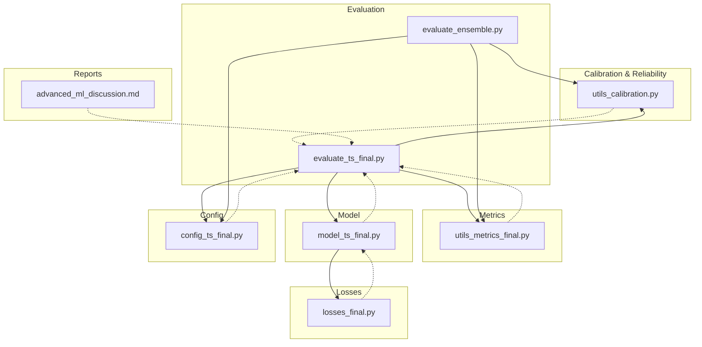
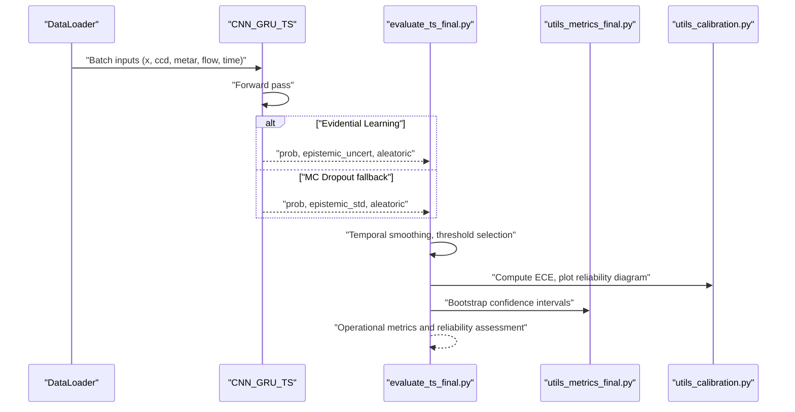
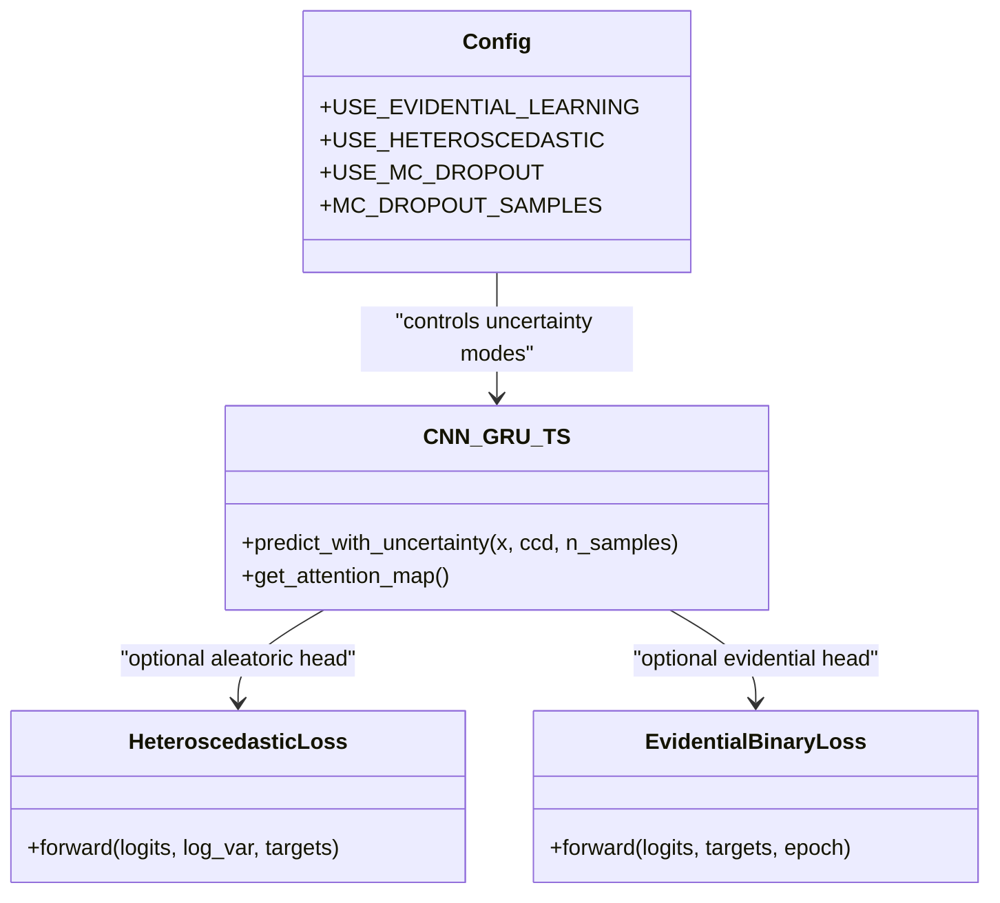
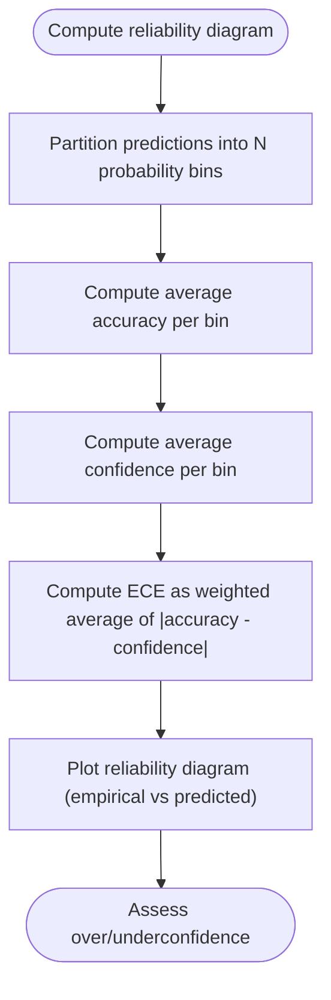
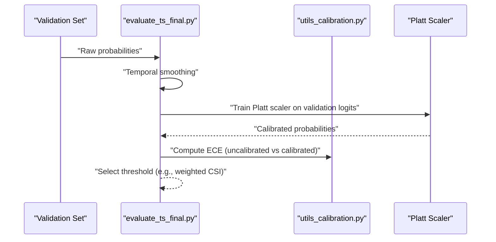
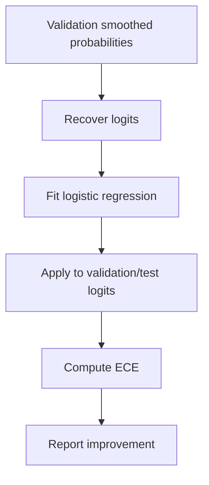
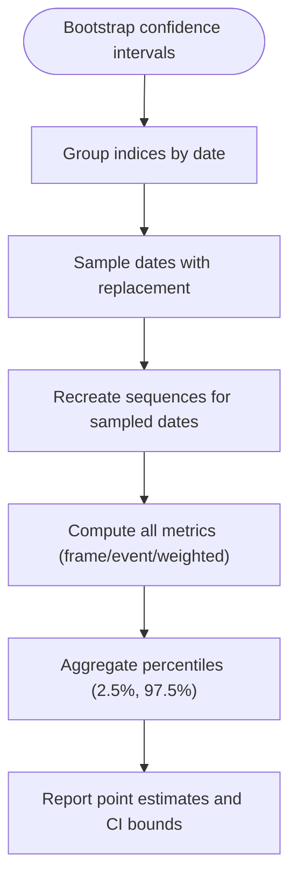
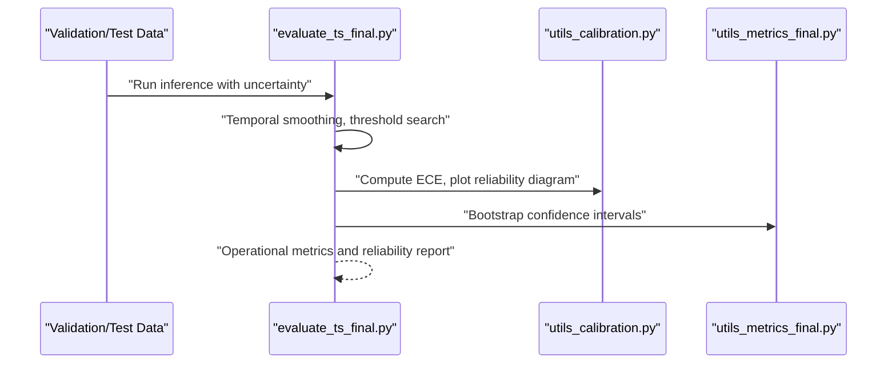
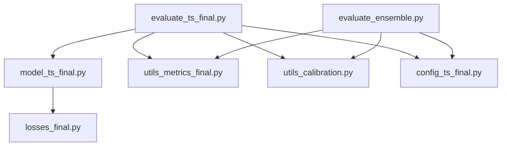

# Uncertainty Assessment & Reliability Testing

<cite>
**Referenced Files in This Document**
- [utils_calibration.py](file://utils_calibration.py)
- [evaluate_ts_final.py](file://evaluate_ts_final.py)
- [utils_metrics_final.py](file://utils_metrics_final.py)
- [model_ts_final.py](file://model_ts_final.py)
- [config_ts_final.py](file://config_ts_final.py)
- [losses_final.py](file://losses_final.py)
- [evaluate_ensemble.py](file://evaluate_ensemble.py)
- [advanced_ml_discussion.md](file://reports/advanced_ml_discussion.md)
</cite>

## Table of Contents
1. [Introduction](#introduction)
2. [Project Structure](#project-structure)
3. [Core Components](#core-components)
4. [Architecture Overview](#architecture-overview)
5. [Detailed Component Analysis](#detailed-component-analysis)
6. [Dependency Analysis](#dependency-analysis)
7. [Performance Considerations](#performance-considerations)
8. [Troubleshooting Guide](#troubleshooting-guide)
9. [Conclusion](#conclusion)
10. [Appendices](#appendices)

## Introduction
This document explains the uncertainty quantification and reliability assessment procedures implemented in the thunderstorm nowcasting system. It covers:
- Epistemic and aleatoric uncertainty decomposition and integration with model predictions
- Reliability diagram construction and Expected Calibration Error (ECE)
- Probability thresholding analysis and uncertainty-calibration techniques
- Platt scaling implementation and its effectiveness
- Uncertainty-based confidence interval estimation and its relationship to model performance variability
- Guidance for uncertainty interpretation, reliability assessment workflows, and uncertainty-aware decision-making for operational forecasting

## Project Structure
The uncertainty and reliability workflows are distributed across several modules:
- Calibration utilities for reliability diagnostics and calibration
- Evaluation scripts orchestrating uncertainty-aware inference, threshold selection, and reliability checks
- Metrics utilities for temporal smoothing, persistence filtering, and bootstrap confidence intervals
- Model implementation providing uncertainty estimation heads and methods
- Configuration enabling uncertainty and calibration features
- Loss modules supporting aleatoric uncertainty modeling

**Diagram sources**
- [utils_calibration.py:1-420](file://utils_calibration.py#L1-L420)
- [evaluate_ts_final.py:1-908](file://evaluate_ts_final.py#L1-L908)
- [utils_metrics_final.py:1-760](file://utils_metrics_final.py#L1-L760)
- [model_ts_final.py:1-335](file://model_ts_final.py#L1-L335)
- [config_ts_final.py:1-211](file://config_ts_final.py#L1-L211)
- [losses_final.py:1-258](file://losses_final.py#L1-L258)
- [evaluate_ensemble.py:180-361](file://evaluate_ensemble.py#L180-L361)
- [advanced_ml_discussion.md:77-110](file://reports/advanced_ml_discussion.md#L77-L110)

**Section sources**
- [utils_calibration.py:1-420](file://utils_calibration.py#L1-L420)
- [evaluate_ts_final.py:1-908](file://evaluate_ts_final.py#L1-L908)
- [utils_metrics_final.py:1-760](file://utils_metrics_final.py#L1-L760)
- [model_ts_final.py:1-335](file://model_ts_final.py#L1-L335)
- [config_ts_final.py:1-211](file://config_ts_final.py#L1-L211)
- [losses_final.py:1-258](file://losses_final.py#L1-L258)
- [evaluate_ensemble.py:180-361](file://evaluate_ensemble.py#L180-L361)
- [advanced_ml_discussion.md:77-110](file://reports/advanced_ml_discussion.md#L77-L110)

## Core Components
- Calibration utilities: compute ECE, optimize temperature scaling, plot reliability diagrams, seasonal breakdown, export predictions, and failure analysis
- Evaluation orchestration: uncertainty-aware inference, threshold selection, Platt scaling, temporal smoothing, persistence filtering, reliability checks, and bootstrap confidence intervals
- Metrics utilities: temporal smoothing, persistence filtering, threshold search, event-level metrics, lead-time analysis, weighted event metrics, and bootstrap confidence intervals
- Model implementation: uncertainty estimation via evidential learning or Monte Carlo Dropout, aleatoric uncertainty via heteroscedastic loss, and attention interpretability
- Configuration: toggles for uncertainty and calibration features, threshold metrics, smoothing, and persistence parameters
- Loss modules: focal loss with late penalty, temporal consistency loss, heteroscedastic loss, intensity regression, asymmetric time-aware loss, and evidential binary loss

**Section sources**
- [utils_calibration.py:24-167](file://utils_calibration.py#L24-L167)
- [evaluate_ts_final.py:474-600](file://evaluate_ts_final.py#L474-L600)
- [utils_metrics_final.py:23-77](file://utils_metrics_final.py#L23-L77)
- [model_ts_final.py:274-335](file://model_ts_final.py#L274-L335)
- [config_ts_final.py:62-139](file://config_ts_final.py#L62-L139)
- [losses_final.py:112-143](file://losses_final.py#L112-L143)

## Architecture Overview
The uncertainty and reliability pipeline integrates model outputs with post-processing and diagnostic tools:

**Diagram sources**
- [evaluate_ts_final.py:474-600](file://evaluate_ts_final.py#L474-L600)
- [model_ts_final.py:274-335](file://model_ts_final.py#L274-L335)
- [utils_calibration.py:24-167](file://utils_calibration.py#L24-L167)
- [utils_metrics_final.py:653-760](file://utils_metrics_final.py#L653-L760)

## Detailed Component Analysis

### Uncertainty Decomposition: Epistemic vs. Aleatoric
- Aleatoric uncertainty captures inherent environmental noise and sensor variability. The model exposes an aleatoric head via a heteroscedastic loss that predicts log-variance, allowing the model to discount ambiguous frames.
- Epistemic uncertainty reflects model knowledge limitations and can be estimated deterministically via evidential learning or via Monte Carlo Dropout by measuring variance across stochastic forward passes.

**Diagram sources**
- [model_ts_final.py:188-200](file://model_ts_final.py#L188-L200)
- [model_ts_final.py:274-335](file://model_ts_final.py#L274-L335)
- [losses_final.py:112-143](file://losses_final.py#L112-L143)
- [losses_final.py:195-255](file://losses_final.py#L195-L255)
- [config_ts_final.py:69, 80, 129, 131-134](file://config_ts_final.py#L69,L80,L129,L131-L134)

**Section sources**
- [model_ts_final.py:274-335](file://model_ts_final.py#L274-L335)
- [losses_final.py:112-143](file://losses_final.py#L112-L143)
- [config_ts_final.py:69, 80, 129, 131-134](file://config_ts_final.py#L69,L80,L129,L131-L134)
- [advanced_ml_discussion.md:101-110](file://reports/advanced_ml_discussion.md#L101-L110)

### Reliability Diagram Construction and ECE
- Reliability diagrams compare predicted probability bins against empirical accuracy to diagnose overconfidence/underconfidence.
- ECE quantifies the weighted average gap between predicted confidence and empirical accuracy across bins.

**Diagram sources**
- [utils_calibration.py:24-60](file://utils_calibration.py#L24-L60)
- [utils_calibration.py:112-167](file://utils_calibration.py#L112-L167)

**Section sources**
- [utils_calibration.py:24-60](file://utils_calibration.py#L24-L60)
- [utils_calibration.py:112-167](file://utils_calibration.py#L112-L167)
- [advanced_ml_discussion.md:77-100](file://reports/advanced_ml_discussion.md#L77-L100)

### Probability Thresholding and Uncertainty-Calibration
- Threshold selection is performed on smoothed probabilities using a configurable metric (e.g., weighted event CSI with lead-time bonus).
- Calibration is applied via Platt scaling (logistic regression on validation logits) or temperature scaling (optimization of a temperature parameter).
- The evaluation script demonstrates both approaches and computes ECE before and after calibration.

**Diagram sources**
- [evaluate_ts_final.py:508-548](file://evaluate_ts_final.py#L508-L548)
- [evaluate_ts_final.py:584-588](file://evaluate_ts_final.py#L584-L588)
- [utils_calibration.py:63-105](file://utils_calibration.py#L63-L105)

**Section sources**
- [evaluate_ts_final.py:508-548](file://evaluate_ts_final.py#L508-L548)
- [evaluate_ts_final.py:584-588](file://evaluate_ts_final.py#L584-L588)
- [utils_calibration.py:63-105](file://utils_calibration.py#L63-L105)

### Platt Scaling Implementation and Effectiveness
- Platt scaling trains a logistic regression model on validation logits to produce well-calibrated probabilities.
- The evaluation script compares ECE before and after Platt scaling to assess improvement.

**Diagram sources**
- [evaluate_ts_final.py:515-523](file://evaluate_ts_final.py#L515-L523)
- [evaluate_ts_final.py:832-837](file://evaluate_ts_final.py#L832-L837)

**Section sources**
- [evaluate_ts_final.py:515-523](file://evaluate_ts_final.py#L515-L523)
- [evaluate_ts_final.py:832-837](file://evaluate_ts_final.py#L832-L837)

### Uncertainty-Based Confidence Interval Estimation
- Block-bootstrapping by calendar day estimates 95% confidence intervals for frame/event/weighted metrics on the test set.
- This quantifies variability in model performance and supports uncertainty-aware decision-making.

**Diagram sources**
- [utils_metrics_final.py:653-760](file://utils_metrics_final.py#L653-L760)

**Section sources**
- [utils_metrics_final.py:653-760](file://utils_metrics_final.py#L653-L760)

### Operational Reliability Assessment Workflow
- Collect validation predictions and compute ECE to diagnose calibration issues.
- Apply Platt scaling or temperature scaling to recalibrate probabilities.
- Select thresholds using a metric optimized for operational goals (e.g., weighted CSI with lead-time bonus).
- Evaluate persistence filtering and temporal smoothing effects.
- Generate reliability diagrams and seasonal breakdowns for interpretability.

**Diagram sources**
- [evaluate_ts_final.py:824-837](file://evaluate_ts_final.py#L824-L837)
- [utils_calibration.py:112-167](file://utils_calibration.py#L112-L167)
- [utils_metrics_final.py:653-760](file://utils_metrics_final.py#L653-L760)

**Section sources**
- [evaluate_ts_final.py:824-837](file://evaluate_ts_final.py#L824-L837)
- [utils_calibration.py:112-167](file://utils_calibration.py#L112-L167)
- [utils_metrics_final.py:653-760](file://utils_metrics_final.py#L653-L760)

### Uncertainty Interpretation and Decision Making
- High epistemic uncertainty indicates model knowledge limitations; consider cautious action or delayed decisions.
- Aleatoric uncertainty reflects data noise; use it to adjust thresholds or to interpret low-confidence predictions.
- Reliability diagnostics guide threshold shifts to align operational risk profiles with observed overconfidence/underconfidence.

**Section sources**
- [model_ts_final.py:274-335](file://model_ts_final.py#L274-L335)
- [advanced_ml_discussion.md:77-110](file://reports/advanced_ml_discussion.md#L77-L110)

## Dependency Analysis
Key dependencies among components:
- Evaluation scripts depend on model uncertainty outputs and metrics utilities
- Calibration utilities are invoked by evaluation scripts for reliability diagnostics
- Configuration toggles control whether evidential learning, MC Dropout, or heteroscedastic loss are active
- Loss modules support aleatoric uncertainty modeling and evidential learning

**Diagram sources**
- [evaluate_ts_final.py:1-908](file://evaluate_ts_final.py#L1-L908)
- [model_ts_final.py:1-335](file://model_ts_final.py#L1-L335)
- [utils_metrics_final.py:1-760](file://utils_metrics_final.py#L1-L760)
- [utils_calibration.py:1-420](file://utils_calibration.py#L1-L420)
- [config_ts_final.py:1-211](file://config_ts_final.py#L1-L211)
- [losses_final.py:1-258](file://losses_final.py#L1-L258)
- [evaluate_ensemble.py:180-361](file://evaluate_ensemble.py#L180-L361)

**Section sources**
- [evaluate_ts_final.py:1-908](file://evaluate_ts_final.py#L1-L908)
- [model_ts_final.py:1-335](file://model_ts_final.py#L1-L335)
- [utils_metrics_final.py:1-760](file://utils_metrics_final.py#L1-L760)
- [utils_calibration.py:1-420](file://utils_calibration.py#L1-L420)
- [config_ts_final.py:1-211](file://config_ts_final.py#L1-L211)
- [losses_final.py:1-258](file://losses_final.py#L1-L258)
- [evaluate_ensemble.py:180-361](file://evaluate_ensemble.py#L180-L361)

## Performance Considerations
- Monte Carlo Dropout increases inference cost linearly with the number of samples; configure sample counts carefully for CPU feasibility.
- Temperature scaling and Platt scaling add minimal overhead compared to model inference.
- Bootstrapping confidence intervals require repeated metric computations; tune the number of bootstrap iterations based on computational budget.

[No sources needed since this section provides general guidance]

## Troubleshooting Guide
Common issues and resolutions:
- ECE increases after calibration: verify that Platt scaling is compatible with the chosen uncertainty mode; evidential learning disables Platt scaling in evaluation scripts.
- Overconfident predictions in mid-range probabilities: consider adjusting thresholds upward or applying temperature scaling.
- Excessive false alarms: increase persistence filter length or use severe fast-track thresholds for high-probability severe events.
- Low epistemic coverage: collect more diverse training data to reduce model knowledge limitations.

**Section sources**
- [evaluate_ts_final.py:511-514](file://evaluate_ts_final.py#L511-L514)
- [evaluate_ts_final.py:550-574](file://evaluate_ts_final.py#L550-L574)
- [utils_metrics_final.py:50-77](file://utils_metrics_final.py#L50-L77)

## Conclusion
The system integrates aleatoric and epistemic uncertainty modeling with robust reliability diagnostics and uncertainty-calibration techniques. By combining evidential learning, heteroscedastic loss, and MC Dropout, it provides actionable uncertainty signals. Reliability assessments via ECE and reliability diagrams, along with thresholding and calibration, enable uncertainty-aware operational decision-making for thunderstorm nowcasting.

[No sources needed since this section summarizes without analyzing specific files]

## Appendices

### Appendix A: Reliability Diagram Interpretation
- Overconfident model: reliability curve below diagonal; consider raising thresholds or applying temperature scaling.
- Underconfident model: reliability curve above diagonal; consider lowering thresholds or Platt scaling.

**Section sources**
- [advanced_ml_discussion.md:77-100](file://reports/advanced_ml_discussion.md#L77-L100)

### Appendix B: Configuration Flags for Uncertainty and Calibration
- Uncertainty modes: evidential learning, MC Dropout, heteroscedastic loss
- Calibration: Platt scaling toggle
- Post-processing: smoothing window and method, persistence filter, severe fast-track

**Section sources**
- [config_ts_final.py:69, 80, 129, 131-134](file://config_ts_final.py#L69,L80,L129,L131-L134)