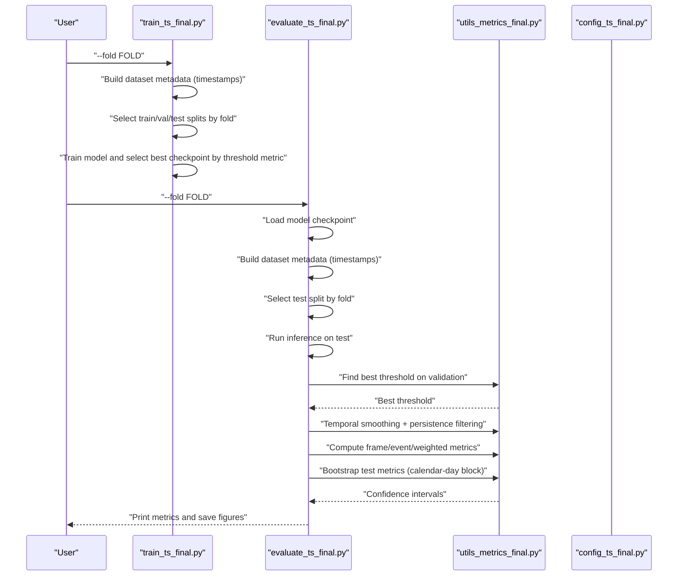
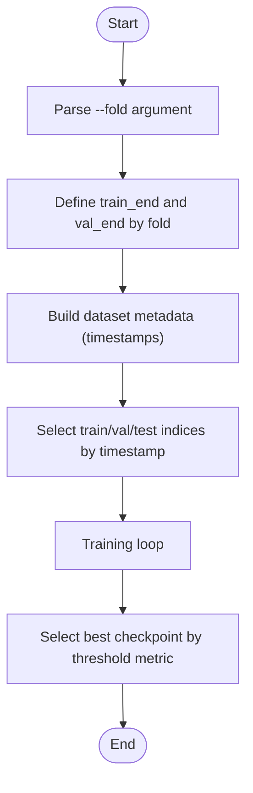
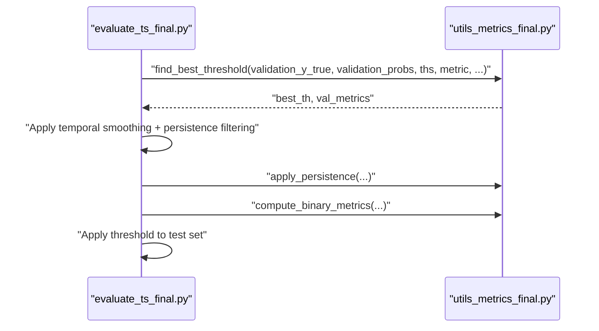
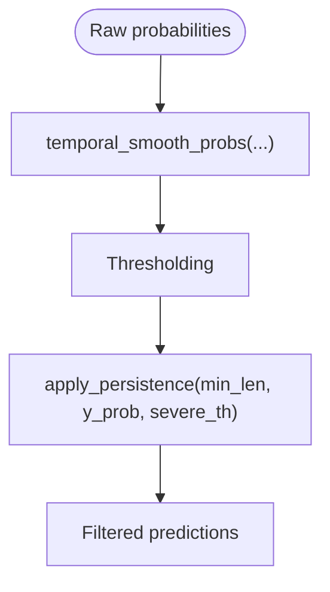
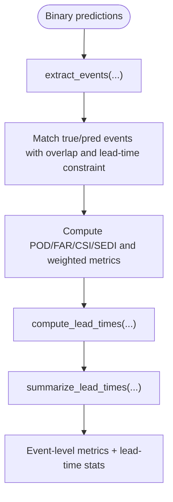
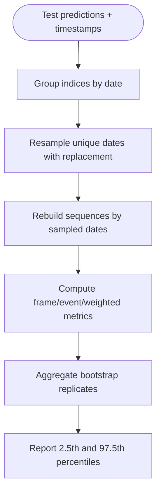
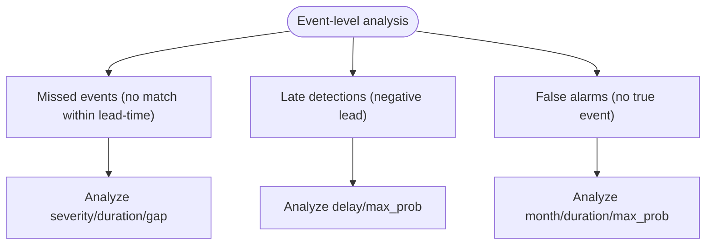
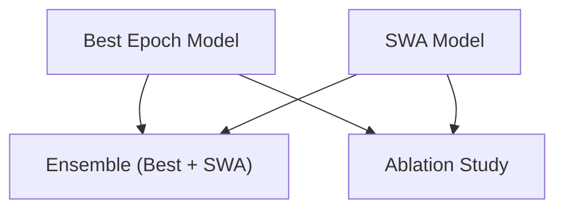
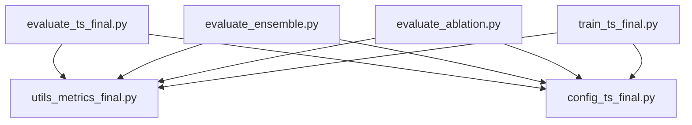

# Validation & Testing Framework

<cite>
**Referenced Files in This Document**
- [evaluate_ts_final.py](file://evaluate_ts_final.py)
- [utils_metrics_final.py](file://utils_metrics_final.py)
- [config_ts_final.py](file://config_ts_final.py)
- [train_ts_final.py](file://train_ts_final.py)
- [evaluate_ablation.py](file://evaluate_ablation.py)
- [evaluate_ensemble.py](file://evaluate_ensemble.py)
- [reports/validation-cv-bootstrap.md](file://reports/validation-cv-bootstrap.md)
- [reports/failure_analysis.md](file://reports/failure_analysis.md)
- [reports/training_comparison.md](file://reports/training_comparison.md)
- [extras/test_pipeline.py](file://extras/test_pipeline.py)
- [extras/smoke_test.py](file://extras/smoke_test.py)
</cite>

## Table of Contents
1. [Introduction](#introduction)
2. [Project Structure](#project-structure)
3. [Core Components](#core-components)
4. [Architecture Overview](#architecture-overview)
5. [Detailed Component Analysis](#detailed-component-analysis)
6. [Dependency Analysis](#dependency-analysis)
7. [Performance Considerations](#performance-considerations)
8. [Troubleshooting Guide](#troubleshooting-guide)
9. [Conclusion](#conclusion)
10. [Appendices](#appendices)

## Introduction
This document describes the comprehensive validation and testing framework for the thunderstorm nowcasting system. It explains the walk-forward cross-validation methodology, fold selection strategies, and temporal validation principles. It documents the test set evaluation procedures, including threshold derivation from validation data to prevent leakage. It covers bootstrap resampling techniques for confidence interval estimation and statistical significance testing. It details failure analysis procedures, including false alarm categorization, missed event analysis, and systematic error pattern identification. It explains persistence filtering effectiveness testing, temporal smoothing impact assessment, and threshold sensitivity analysis. It documents model comparison methodologies, baseline performance benchmarks, and regression testing procedures. Finally, it provides guidance on validation result interpretation, performance degradation detection, and continuous monitoring workflows.

## Project Structure
The validation and testing framework spans several modules:
- Evaluation scripts for final model evaluation, ensemble evaluation, and ablation studies
- Metrics utilities implementing temporal post-processing, threshold search, event-level metrics, and bootstrap confidence intervals
- Configuration controlling post-processing, threshold selection, and evaluation behavior
- Training script enabling walk-forward CV folds and model selection
- Reports and extras supporting validation planning, failure analysis, and smoke tests

```mermaid
graph TB
subgraph "Evaluation"
EvalFinal["evaluate_ts_final.py"]
EvalEnsemble["evaluate_ensemble.py"]
EvalAblation["evaluate_ablation.py"]
end
subgraph "Metrics"
UtilsMetrics["utils_metrics_final.py"]
end
subgraph "Training"
TrainCV["train_ts_final.py"]
end
subgraph "Config"
Config["config_ts_final.py"]
end
subgraph "Reports & Extras"
Plan["reports/validation-cv-bootstrap.md"]
Fail["reports/failure_analysis.md"]
TrainComp["reports/training_comparison.md"]
TestPipe["extras/test_pipeline.py"]
Smoke["extras/smoke_test.py"]
end
EvalFinal --> UtilsMetrics
EvalEnsemble --> UtilsMetrics
EvalAblation --> UtilsMetrics
TrainCV --> UtilsMetrics
EvalFinal --> Config
EvalEnsemble --> Config
EvalAblation --> Config
TrainCV --> Config
Plan --> EvalFinal
Plan --> TrainCV
Plan --> UtilsMetrics
Fail --> EvalFinal
TrainComp --> TrainCV
TestPipe --> Config
Smoke --> Config
```

**Diagram sources**
- [evaluate_ts_final.py:1-908](file://evaluate_ts_final.py#L1-L908)
- [utils_metrics_final.py:1-760](file://utils_metrics_final.py#L1-L760)
- [config_ts_final.py:1-208](file://config_ts_final.py#L1-L208)
- [train_ts_final.py:1-757](file://train_ts_final.py#L1-L757)
- [reports/validation-cv-bootstrap.md:1-89](file://reports/validation-cv-bootstrap.md#L1-L89)
- [reports/failure_analysis.md:1-71](file://reports/failure_analysis.md#L1-L71)
- [reports/training_comparison.md:1-153](file://reports/training_comparison.md#L1-L153)
- [extras/test_pipeline.py:1-54](file://extras/test_pipeline.py#L1-L54)
- [extras/smoke_test.py:1-27](file://extras/smoke_test.py#L1-L27)

**Section sources**
- [evaluate_ts_final.py:1-908](file://evaluate_ts_final.py#L1-L908)
- [utils_metrics_final.py:1-760](file://utils_metrics_final.py#L1-L760)
- [config_ts_final.py:1-208](file://config_ts_final.py#L1-L208)
- [train_ts_final.py:1-757](file://train_ts_final.py#L1-L757)
- [reports/validation-cv-bootstrap.md:1-89](file://reports/validation-cv-bootstrap.md#L1-L89)
- [reports/failure_analysis.md:1-71](file://reports/failure_analysis.md#L1-L71)
- [reports/training_comparison.md:1-153](file://reports/training_comparison.md#L1-L153)
- [extras/test_pipeline.py:1-54](file://extras/test_pipeline.py#L1-L54)
- [extras/smoke_test.py:1-27](file://extras/smoke_test.py#L1-L27)

## Core Components
- Walk-forward cross-validation with fold selection: The training and evaluation scripts support selecting a specific fold (1, 2, or 3) to define training and validation boundaries, enabling temporal validation.
- Threshold selection from validation: Thresholds are derived on the validation set and then applied to the test set to prevent leakage.
- Temporal post-processing: Temporal smoothing and persistence filtering are applied consistently during both validation and test evaluation.
- Event-level metrics and lead-time analysis: Event-level metrics (POD, FAR, CSI) and lead-time statistics are computed, including weighted metrics that incorporate severity and lead-time bonuses.
- Bootstrap confidence intervals: Calendar-day block bootstrapping is used to estimate 95% confidence intervals for frame and event metrics on the test set.
- Failure analysis: Detailed categorization of missed events, late detections, and false alarms, including severity and duration analysis.
- Model comparison and regression testing: Ensemble evaluation and ablation studies enable comparison against baselines and regression testing across models.

**Section sources**
- [evaluate_ts_final.py:361-800](file://evaluate_ts_final.py#L361-L800)
- [utils_metrics_final.py:192-760](file://utils_metrics_final.py#L192-L760)
- [config_ts_final.py:87-136](file://config_ts_final.py#L87-L136)
- [train_ts_final.py:142-200](file://train_ts_final.py#L142-L200)
- [reports/validation-cv-bootstrap.md:1-89](file://reports/validation-cv-bootstrap.md#L1-L89)
- [reports/failure_analysis.md:1-71](file://reports/failure_analysis.md#L1-L71)
- [evaluate_ensemble.py:84-361](file://evaluate_ensemble.py#L84-L361)
- [evaluate_ablation.py:1-307](file://evaluate_ablation.py#L1-L307)

## Architecture Overview
The validation and testing pipeline integrates training, evaluation, and metrics computation across temporal folds. The evaluation scripts load models, split data temporally by fold, derive thresholds on validation, apply temporal smoothing and persistence filtering, and compute comprehensive metrics including bootstrap confidence intervals.



**Diagram sources**
- [train_ts_final.py:142-200](file://train_ts_final.py#L142-L200)
- [evaluate_ts_final.py:361-800](file://evaluate_ts_final.py#L361-L800)
- [utils_metrics_final.py:192-760](file://utils_metrics_final.py#L192-L760)
- [config_ts_final.py:87-136](file://config_ts_final.py#L87-L136)

## Detailed Component Analysis

### Walk-Forward Cross-Validation and Fold Selection
- The training script accepts a fold argument and defines train/val/test boundaries accordingly. The evaluation script mirrors these boundaries to ensure temporal consistency.
- The fold selection enables temporal validation by preventing future data leakage into training and validation.



**Diagram sources**
- [train_ts_final.py:142-200](file://train_ts_final.py#L142-L200)
- [evaluate_ts_final.py:410-428](file://evaluate_ts_final.py#L410-L428)

**Section sources**
- [train_ts_final.py:142-200](file://train_ts_final.py#L142-L200)
- [evaluate_ts_final.py:410-428](file://evaluate_ts_final.py#L410-L428)

### Threshold Derivation and Leakage Prevention
- Thresholds are derived on the validation set and then applied to the test set. This prevents leakage by ensuring the test performance reflects truly out-of-sample conditions.
- The evaluation script supports both single-threshold and Schmitt trigger dual-threshold strategies, with Platt scaling calibration optionally applied.



**Diagram sources**
- [evaluate_ts_final.py:508-601](file://evaluate_ts_final.py#L508-L601)
- [utils_metrics_final.py:192-241](file://utils_metrics_final.py#L192-L241)
- [utils_metrics_final.py:50-77](file://utils_metrics_final.py#L50-L77)

**Section sources**
- [evaluate_ts_final.py:508-601](file://evaluate_ts_final.py#L508-L601)
- [utils_metrics_final.py:192-241](file://utils_metrics_final.py#L192-L241)
- [utils_metrics_final.py:50-77](file://utils_metrics_final.py#L50-L77)

### Temporal Smoothing and Persistence Filtering
- Temporal smoothing reduces noise and temporal chattering using exponential moving average or rolling mean.
- Persistence filtering removes short-lived false positives by requiring minimum event durations, with special handling for severe events.



**Diagram sources**
- [utils_metrics_final.py:23-47](file://utils_metrics_final.py#L23-L47)
- [utils_metrics_final.py:50-77](file://utils_metrics_final.py#L50-L77)
- [config_ts_final.py:87-94](file://config_ts_final.py#L87-L94)

**Section sources**
- [utils_metrics_final.py:23-47](file://utils_metrics_final.py#L23-L47)
- [utils_metrics_final.py:50-77](file://utils_metrics_final.py#L50-L77)
- [config_ts_final.py:87-94](file://config_ts_final.py#L87-L94)

### Event-Level Metrics and Lead-Time Analysis
- Event-level metrics compute hits, misses, false alarms, and weighted metrics that incorporate severity and lead-time bonuses.
- Lead-time statistics quantify early detection, late detection, and miss rates, with category-specific summaries.



**Diagram sources**
- [utils_metrics_final.py:322-393](file://utils_metrics_final.py#L322-L393)
- [utils_metrics_final.py:395-477](file://utils_metrics_final.py#L395-L477)
- [utils_metrics_final.py:575-650](file://utils_metrics_final.py#L575-L650)

**Section sources**
- [utils_metrics_final.py:322-393](file://utils_metrics_final.py#L322-L393)
- [utils_metrics_final.py:395-477](file://utils_metrics_final.py#L395-L477)
- [utils_metrics_final.py:575-650](file://utils_metrics_final.py#L575-L650)

### Bootstrap Confidence Intervals and Statistical Significance
- Calendar-day block bootstrapping estimates 95% confidence intervals for frame, event, and weighted metrics on the test set.
- The bootstrap procedure samples unique days with replacement and recomputes all metrics to produce empirical distributions.



**Diagram sources**
- [utils_metrics_final.py:653-760](file://utils_metrics_final.py#L653-L760)

**Section sources**
- [utils_metrics_final.py:653-760](file://utils_metrics_final.py#L653-L760)
- [reports/validation-cv-bootstrap.md:46-53](file://reports/validation-cv-bootstrap.md#L46-L53)

### Failure Analysis Procedures
- Missed events are categorized by timestamp, severity, duration, and proximity to threshold.
- Late detections are identified by negative lead times and analyzed by category.
- False alarms are catalogued by timestamp, month, and duration to identify systematic patterns.



**Diagram sources**
- [utils_metrics_final.py:520-572](file://utils_metrics_final.py#L520-L572)
- [reports/failure_analysis.md:11-71](file://reports/failure_analysis.md#L11-L71)

**Section sources**
- [utils_metrics_final.py:520-572](file://utils_metrics_final.py#L520-L572)
- [reports/failure_analysis.md:11-71](file://reports/failure_analysis.md#L11-L71)

### Model Comparison Methodologies and Baseline Benchmarks
- Ensemble evaluation compares best epoch and SWA models, averaging probabilities and applying the same post-processing.
- Ablation studies systematically remove input features to assess their contribution to weighted event-level metrics.
- Training comparison reports provide head-to-head benchmarking between architectures and highlight generalization differences.



**Diagram sources**
- [evaluate_ensemble.py:84-361](file://evaluate_ensemble.py#L84-L361)
- [evaluate_ablation.py:172-307](file://evaluate_ablation.py#L172-L307)
- [reports/training_comparison.md:1-153](file://reports/training_comparison.md#L1-153)

**Section sources**
- [evaluate_ensemble.py:84-361](file://evaluate_ensemble.py#L84-L361)
- [evaluate_ablation.py:172-307](file://evaluate_ablation.py#L172-L307)
- [reports/training_comparison.md:1-153](file://reports/training_comparison.md#L1-153)

### Regression Testing Procedures
- Smoke tests verify model build and forward pass with current input configurations.
- Pipeline verification ensures dataset loading and feature extraction work as expected.

**Section sources**
- [extras/smoke_test.py:1-27](file://extras/smoke_test.py#L1-L27)
- [extras/test_pipeline.py:13-54](file://extras/test_pipeline.py#L13-L54)

## Dependency Analysis
The evaluation scripts depend on metrics utilities for threshold search, temporal smoothing, persistence filtering, event-level metrics, and bootstrap confidence intervals. Configuration controls post-processing and threshold selection behavior. Training script integrates these utilities for fold-based model selection.



**Diagram sources**
- [evaluate_ts_final.py:27-34](file://evaluate_ts_final.py#L27-L34)
- [evaluate_ensemble.py:25-40](file://evaluate_ensemble.py#L25-L40)
- [evaluate_ablation.py:30-35](file://evaluate_ablation.py#L30-L35)
- [train_ts_final.py:30-41](file://train_ts_final.py#L30-L41)
- [utils_metrics_final.py:1-12](file://utils_metrics_final.py#L1-L12)
- [config_ts_final.py:16-208](file://config_ts_final.py#L16-L208)

**Section sources**
- [evaluate_ts_final.py:27-34](file://evaluate_ts_final.py#L27-L34)
- [evaluate_ensemble.py:25-40](file://evaluate_ensemble.py#L25-L40)
- [evaluate_ablation.py:30-35](file://evaluate_ablation.py#L30-L35)
- [train_ts_final.py:30-41](file://train_ts_final.py#L30-L41)
- [utils_metrics_final.py:1-12](file://utils_metrics_final.py#L1-L12)
- [config_ts_final.py:16-208](file://config_ts_final.py#L16-L208)

## Performance Considerations
- Temporal smoothing and persistence filtering improve stability and reduce false alarms by suppressing temporal noise and short-lived events.
- Using lead-time-weighted metrics (e.g., weighted CSI with lead-time bonus) encourages early detection while maintaining balanced performance.
- Bootstrap confidence intervals provide robust uncertainty quantification for test metrics, aiding statistical significance testing and monitoring.

[No sources needed since this section provides general guidance]

## Troubleshooting Guide
- Threshold leakage: Ensure thresholds are derived only on the validation set and applied to the test set without re-tuning.
- Post-processing mismatch: Verify that temporal smoothing and persistence filtering are applied consistently in both validation and test phases.
- Bootstrapping issues: Confirm that timestamps are parsed correctly and that calendar-day grouping aligns with the intended temporal structure.
- Model loading: Handle partial state dict loading when checkpoints differ slightly from the current architecture.
- Pipeline verification: Use smoke tests and pipeline verification scripts to quickly detect input shape or feature extraction issues.

**Section sources**
- [evaluate_ts_final.py:508-601](file://evaluate_ts_final.py#L508-L601)
- [utils_metrics_final.py:653-760](file://utils_metrics_final.py#L653-L760)
- [extras/smoke_test.py:1-27](file://extras/smoke_test.py#L1-L27)
- [extras/test_pipeline.py:13-54](file://extras/test_pipeline.py#L13-L54)

## Conclusion
The validation and testing framework employs rigorous walk-forward cross-validation, careful threshold selection from validation data, and comprehensive temporal post-processing to ensure reliable test evaluation. Bootstrap confidence intervals provide statistical rigor, while detailed failure analysis and model comparison methodologies support continuous improvement and operational readiness. The framework balances detection performance with false alarm control and offers practical tools for monitoring and regression testing.

[No sources needed since this section summarizes without analyzing specific files]

## Appendices

### Appendix A: Validation Plan Highlights
- Walk-forward CV fold selection and model selection by threshold metric
- Test evaluation with calendar-day block bootstrap confidence intervals
- Corrected lead-time-weighted CSI computation and reporting

**Section sources**
- [reports/validation-cv-bootstrap.md:10-14](file://reports/validation-cv-bootstrap.md#L10-L14)
- [reports/validation-cv-bootstrap.md:37-44](file://reports/validation-cv-bootstrap.md#L37-L44)
- [reports/validation-cv-bootstrap.md:46-53](file://reports/validation-cv-bootstrap.md#L46-L53)
- [reports/validation-cv-bootstrap.md:64-71](file://reports/validation-cv-bootstrap.md#L64-L71)
- [reports/validation-cv-bootstrap.md:73-80](file://reports/validation-cv-bootstrap.md#L73-L80)