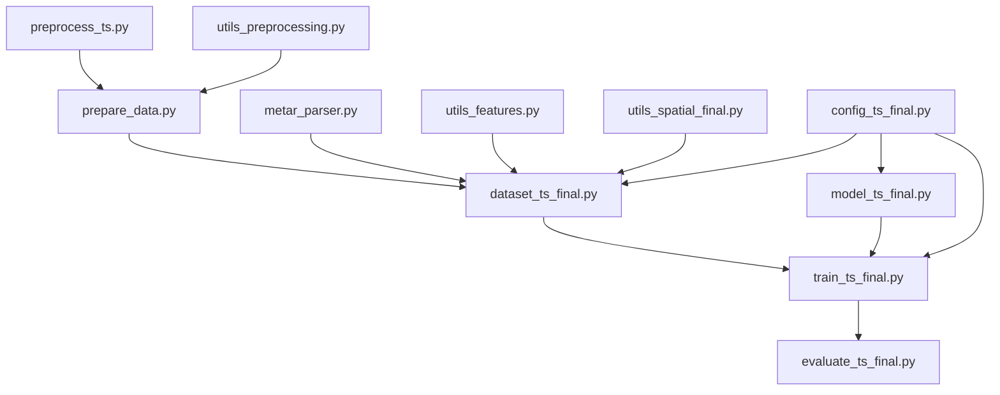
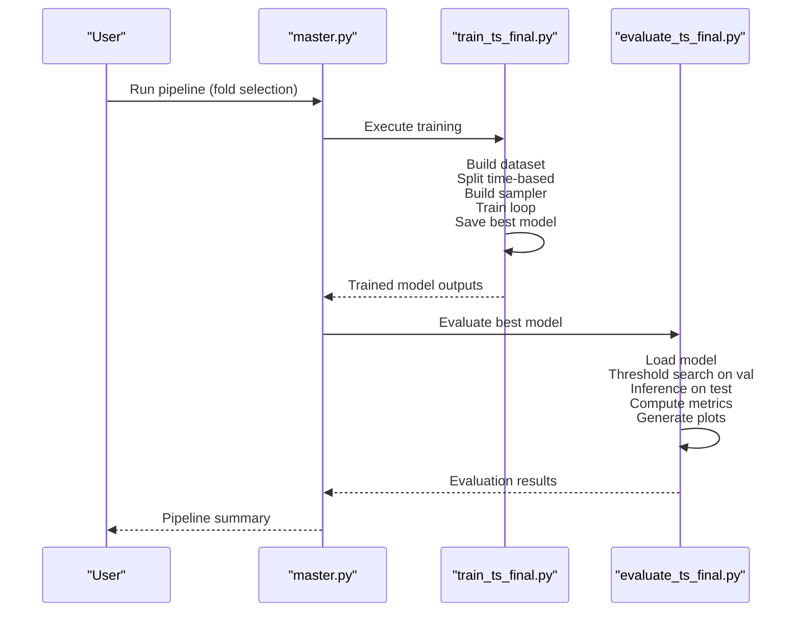
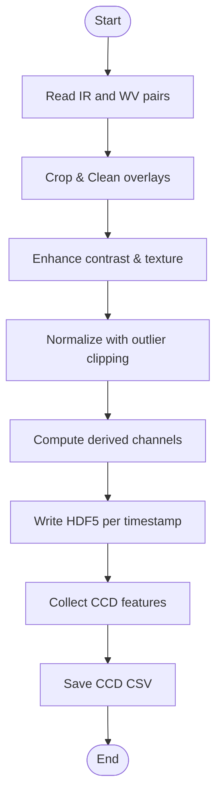
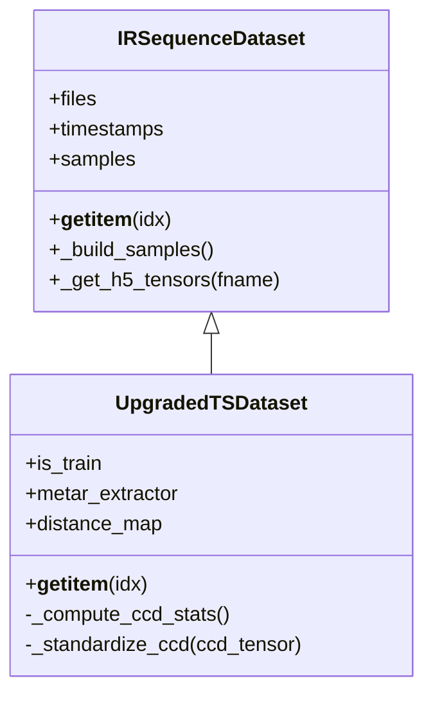
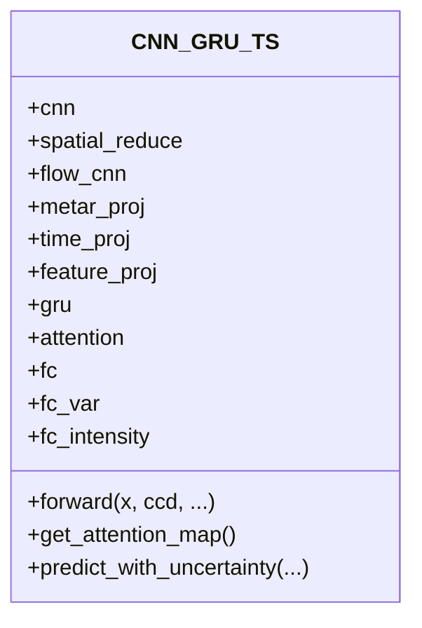
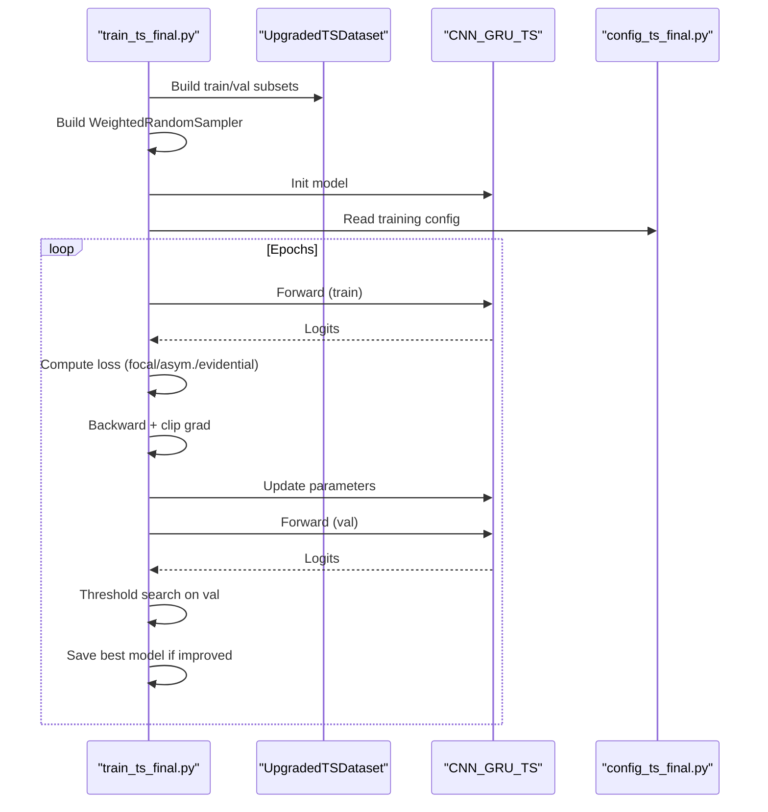
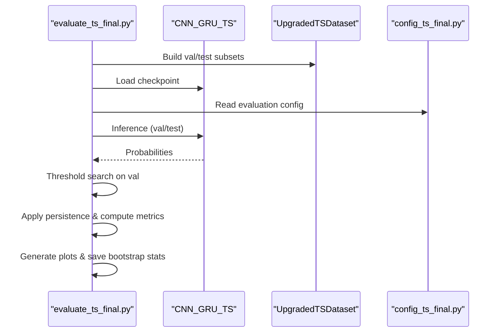
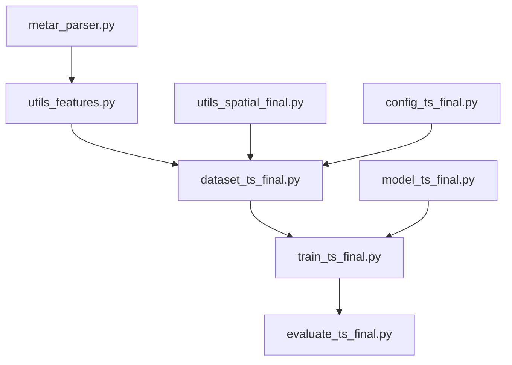
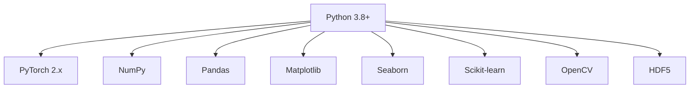

# Getting Started

<cite>
**Referenced Files in This Document**
- [config_ts_final.py](file://config_ts_final.py)
- [master.py](file://master.py)
- [train_ts_final.py](file://train_ts_final.py)
- [evaluate_ts_final.py](file://evaluate_ts_final.py)
- [dataset_ts_final.py](file://dataset_ts_final.py)
- [model_ts_final.py](file://model_ts_final.py)
- [metar_parser.py](file://metar_parser.py)
- [utils_features.py](file://utils_features.py)
- [utils_spatial_final.py](file://utils_spatial_final.py)
- [utils_preprocessing.py](file://utils_preprocessing.py)
- [preprocess_ts.py](file://preprocess_ts.py)
- [prepare_data.py](file://prepare_data.py)
- [run_fold3.bat](file://run_fold3.bat)
</cite>

## Table of Contents
1. [Introduction](#introduction)
2. [Project Structure](#project-structure)
3. [Core Components](#core-components)
4. [Architecture Overview](#architecture-overview)
5. [Detailed Component Analysis](#detailed-component-analysis)
6. [Dependency Analysis](#dependency-analysis)
7. [Performance Considerations](#performance-considerations)
8. [Troubleshooting Guide](#troubleshooting-guide)
9. [Conclusion](#conclusion)
10. [Appendices](#appendices)

## Introduction
The Nagpur Thunderstorm Nowcasting System predicts 3-hour-ahead convective storms using INSAT-3DR water vapor (WV) and infrared (IR) imagery along with METAR observations. It combines a CNN-GRU architecture with spatial and temporal features, optional optical flow, METAR-derived inputs, and advanced training strategies (class-balanced sampling, temporal consistency, asymmetric loss, and uncertainty modeling). The system is optimized for CPU inference and supports evaluation with calibrated thresholds, persistence filtering, and severity-weighted metrics.

## Project Structure
The repository organizes code by responsibility:
- Configuration and constants: config_ts_final.py
- Training and evaluation scripts: train_ts_final.py, evaluate_ts_final.py
- Data pipeline: dataset_ts_final.py, prepare_data.py, preprocess_ts.py, utils_preprocessing.py
- Model definition: model_ts_final.py
- METAR parsing and features: metar_parser.py, utils_features.py
- Spatial utilities: utils_spatial_final.py
- Orchestration: master.py, run_fold3.bat

**Diagram sources**
- [config_ts_final.py:16-208](file://config_ts_final.py#L16-L208)
- [dataset_ts_final.py:47-515](file://dataset_ts_final.py#L47-L515)
- [model_ts_final.py:68-335](file://model_ts_final.py#L68-L335)
- [train_ts_final.py:142-757](file://train_ts_final.py#L142-L757)
- [evaluate_ts_final.py:361-908](file://evaluate_ts_final.py#L361-L908)
- [prepare_data.py:39-132](file://prepare_data.py#L39-L132)
- [preprocess_ts.py:27-117](file://preprocess_ts.py#L27-L117)
- [utils_preprocessing.py:86-162](file://utils_preprocessing.py#L86-L162)
- [metar_parser.py:141-186](file://metar_parser.py#L141-L186)
- [utils_features.py:11-191](file://utils_features.py#L11-L191)
- [utils_spatial_final.py:12-80](file://utils_spatial_final.py#L12-L80)

**Section sources**
- [config_ts_final.py:16-208](file://config_ts_final.py#L16-L208)
- [dataset_ts_final.py:47-515](file://dataset_ts_final.py#L47-L515)
- [model_ts_final.py:68-335](file://model_ts_final.py#L68-L335)
- [train_ts_final.py:142-757](file://train_ts_final.py#L142-L757)
- [evaluate_ts_final.py:361-908](file://evaluate_ts_final.py#L361-L908)
- [prepare_data.py:39-132](file://prepare_data.py#L39-L132)
- [preprocess_ts.py:27-117](file://preprocess_ts.py#L27-L117)
- [utils_preprocessing.py:86-162](file://utils_preprocessing.py#L86-L162)
- [metar_parser.py:141-186](file://metar_parser.py#L141-L186)
- [utils_features.py:11-191](file://utils_features.py#L11-L191)
- [utils_spatial_final.py:12-80](file://utils_spatial_final.py#L12-L80)

## Core Components
- Configuration: Centralized hyperparameters, data paths, training schedule, loss settings, post-processing, and spatial masks.
- Dataset: Loads HDF5 precomputed sequences, aligns METAR features, computes severity labels, and applies augmentations.
- Model: CNN-GRU with spatial skip connections, optional optical flow branch, optional METAR/time projections, and multi-task heads.
- Training: Class-balanced sampling, temporal consistency, asymmetric loss, SWA, and threshold optimization.
- Evaluation: Threshold selection from validation, persistence filtering, weighted metrics, and uncertainty analysis.

**Section sources**
- [config_ts_final.py:16-208](file://config_ts_final.py#L16-L208)
- [dataset_ts_final.py:47-515](file://dataset_ts_final.py#L47-L515)
- [model_ts_final.py:68-335](file://model_ts_final.py#L68-L335)
- [train_ts_final.py:142-757](file://train_ts_final.py#L142-L757)
- [evaluate_ts_final.py:361-908](file://evaluate_ts_final.py#L361-L908)

## Architecture Overview
The system follows a pipeline: data preparation, training, and evaluation. The training script orchestrates dataset building, sampler creation, model initialization, loss computation, and validation metrics. The evaluation script loads a trained model, selects thresholds on validation, applies persistence, and computes performance metrics.

**Diagram sources**
- [master.py:39-108](file://master.py#L39-L108)
- [train_ts_final.py:142-757](file://train_ts_final.py#L142-L757)
- [evaluate_ts_final.py:361-908](file://evaluate_ts_final.py#L361-L908)

## Detailed Component Analysis

### Configuration and Paths
- Data paths: HDF5 precomputed directory, METAR file, and CCD features CSV.
- Model architecture: GRU hidden size, layers, dropout, sequence length, lead time, and backbone freezing schedule.
- Training: epochs, batch size, learning rate, weight decay, patience, SWA toggle and start epoch.
- Loss: focal gamma/alpha, positive class weight, late penalty, label smoothing, and asymmetric/evidential options.
- Post-processing: smoothing window/method, persistence minimum length, maximum lead minutes, threshold metric, Schmitt trigger toggle, and severity weights.
- Spatial mask: center, sigma, station radius, and optional dynamic upwind mask.
- METAR features: toggle, feature windows, and legacy weight.
- Calibration and uncertainty: Platt scaling, MC Dropout toggles, and sample counts.

**Section sources**
- [config_ts_final.py:16-208](file://config_ts_final.py#L16-L208)

### Data Preparation Pipeline
- Raw INSAT IR/WV images are cropped, cleaned, and resized to 224×224.
- Preprocessing enhances contrast and texture, normalizes with outlier clipping, and computes optical flow (lite) and texture maps.
- For each timestamp, a set of derived channels is written to HDF5: IR, WV, cooling rates, textures, optical flow, IR–WV difference, acceleration, and trend.
- CCD features (cold cloud density bins, cell count, complexity, coldest pixel) are extracted and saved to CSV.

**Diagram sources**
- [prepare_data.py:39-132](file://prepare_data.py#L39-L132)
- [preprocess_ts.py:27-117](file://preprocess_ts.py#L27-L117)
- [utils_preprocessing.py:86-162](file://utils_preprocessing.py#L86-L162)

**Section sources**
- [prepare_data.py:39-132](file://prepare_data.py#L39-L132)
- [preprocess_ts.py:27-117](file://preprocess_ts.py#L27-L117)
- [utils_preprocessing.py:86-162](file://utils_preprocessing.py#L86-L162)

### Dataset and Sequences
- The dataset builds sequences of length SEQ_LEN with a lead-time target window and labels TS presence within a severity-aware window.
- METAR features are extracted for each frame using a feature extractor; time features include month and solar zenith.
- CCD features are standardized z-scores and included per sequence.
- Augmentations during training include horizontal flip, frame masking, channel dropout, and Gaussian noise.
- Dynamic channel stacking selects only configured channels for the model input.

**Diagram sources**
- [dataset_ts_final.py:47-515](file://dataset_ts_final.py#L47-L515)

**Section sources**
- [dataset_ts_final.py:47-515](file://dataset_ts_final.py#L47-L515)

### Model Architecture
- CNN backbone (MobileNetV2) with a dynamically adapted first convolution to match selected channels.
- Spatial skip connection extracts low-resolution spatial features.
- Optional optical flow branch and METAR/time projections.
- Feature projection to GRU input; GRU temporal fusion with attention.
- Heads: primary binary/logits, optional heteroscedastic log-variance, optional intensity regression.
- Predictions support uncertainty estimation via evidential learning or MC Dropout.

**Diagram sources**
- [model_ts_final.py:68-335](file://model_ts_final.py#L68-L335)

**Section sources**
- [model_ts_final.py:68-335](file://model_ts_final.py#L68-L335)

### Training Workflow
- Class-balanced sampling with target positive rate and seasonal boosting.
- Loss options: focal with late penalty, asymmetric time-aware, evidential binary, and heteroscedastic variants.
- SWA enabled with custom BN update; patience-based early stopping.
- Threshold optimization on validation; persistence filtering; weighted event metrics; lead-time analysis.

**Diagram sources**
- [train_ts_final.py:142-757](file://train_ts_final.py#L142-L757)
- [config_ts_final.py:16-208](file://config_ts_final.py#L16-L208)
- [dataset_ts_final.py:47-515](file://dataset_ts_final.py#L47-L515)
- [model_ts_final.py:68-335](file://model_ts_final.py#L68-L335)

**Section sources**
- [train_ts_final.py:142-757](file://train_ts_final.py#L142-L757)
- [config_ts_final.py:16-208](file://config_ts_final.py#L16-L208)
- [dataset_ts_final.py:47-515](file://dataset_ts_final.py#L47-L515)
- [model_ts_final.py:68-335](file://model_ts_final.py#L68-L335)

### Evaluation and Interpretation
- Threshold selection from validation (single threshold or dual Schmitt trigger).
- Persistence filtering and severity-weighted metrics.
- Attention visualization, uncertainty analysis, and reliability plots.
- Bootstrapped confidence intervals for robustness assessment.

**Diagram sources**
- [evaluate_ts_final.py:361-908](file://evaluate_ts_final.py#L361-L908)
- [config_ts_final.py:16-208](file://config_ts_final.py#L16-L208)
- [dataset_ts_final.py:47-515](file://dataset_ts_final.py#L47-L515)
- [model_ts_final.py:68-335](file://model_ts_final.py#L68-L335)

**Section sources**
- [evaluate_ts_final.py:361-908](file://evaluate_ts_final.py#L361-L908)
- [config_ts_final.py:16-208](file://config_ts_final.py#L16-L208)
- [dataset_ts_final.py:47-515](file://dataset_ts_final.py#L47-L515)
- [model_ts_final.py:68-335](file://model_ts_final.py#L68-L335)

### Conceptual Overview
- METAR parsing extracts pressure drops, wind trends, dewpoint, visibility, and cloud features aligned to image timestamps.
- Spatial utilities define Gaussian masks and distance maps for regional focus.
- The orchestration script runs training, evaluation, ensemble, and ablation studies in sequence.

**Diagram sources**
- [metar_parser.py:141-186](file://metar_parser.py#L141-L186)
- [utils_features.py:11-191](file://utils_features.py#L11-L191)
- [utils_spatial_final.py:12-80](file://utils_spatial_final.py#L12-L80)
- [config_ts_final.py:16-208](file://config_ts_final.py#L16-L208)
- [dataset_ts_final.py:47-515](file://dataset_ts_final.py#L47-L515)
- [model_ts_final.py:68-335](file://model_ts_final.py#L68-L335)
- [train_ts_final.py:142-757](file://train_ts_final.py#L142-L757)
- [evaluate_ts_final.py:361-908](file://evaluate_ts_final.py#L361-L908)

**Section sources**
- [metar_parser.py:141-186](file://metar_parser.py#L141-L186)
- [utils_features.py:11-191](file://utils_features.py#L11-L191)
- [utils_spatial_final.py:12-80](file://utils_spatial_final.py#L12-L80)
- [config_ts_final.py:16-208](file://config_ts_final.py#L16-L208)
- [dataset_ts_final.py:47-515](file://dataset_ts_final.py#L47-L515)
- [model_ts_final.py:68-335](file://model_ts_final.py#L68-L335)
- [train_ts_final.py:142-757](file://train_ts_final.py#L142-L757)
- [evaluate_ts_final.py:361-908](file://evaluate_ts_final.py#L361-L908)

## Dependency Analysis
- Python 3.8+ is required.
- PyTorch 2.x is used for model training and evaluation.
- OpenCV is used for optical flow computation and image inpainting.
- HDF5 is used to store precomputed channels per timestamp.
- Additional scientific packages include NumPy, Pandas, Matplotlib, Seaborn, and Scikit-learn for metrics and plotting.

**Diagram sources**
- [train_ts_final.py:13-25](file://train_ts_final.py#L13-L25)
- [prepare_data.py:1-132](file://prepare_data.py#L1-L132)
- [utils_preprocessing.py:8-12](file://utils_preprocessing.py#L8-L12)

**Section sources**
- [train_ts_final.py:13-25](file://train_ts_final.py#L13-L25)
- [prepare_data.py:1-132](file://prepare_data.py#L1-L132)
- [utils_preprocessing.py:8-12](file://utils_preprocessing.py#L8-L12)

## Performance Considerations
- CPU inference target: optimized for 31 FPS on CPU; optical flow is disabled to save compute.
- Hardware recommendation: modern CPU with sufficient RAM for HDF5 caching and multi-worker data loading.
- Training: batch size 16, 25 epochs, patience 10; SWA can improve generalization.
- Post-processing: temporal smoothing (EMA or rolling mean), persistence filtering, and Schmitt trigger for hysteresis.

[No sources needed since this section provides general guidance]

## Troubleshooting Guide
- Missing METAR file: ensure the path in configuration points to a valid file; the parser raises a clear error if missing.
- No HDF5 samples found: confirm the precomputed directory contains .h5 files and timestamps align with METAR.
- CUDA availability: device selection falls back to CPU if CUDA is unavailable; verify GPU memory if training on GPU.
- Overfitting symptoms: enable augmentation flags and consider reducing learning rate or increasing dropout.
- Slow inference: disable optical flow and ensure batch size and workers are tuned for your CPU.

**Section sources**
- [train_ts_final.py:200-209](file://train_ts_final.py#L200-L209)
- [metar_parser.py:147-148](file://metar_parser.py#L147-L148)
- [config_ts_final.py:189](file://config_ts_final.py#L189)

## Conclusion
This guide introduced the Nagpur Thunderstorm Nowcasting System, its modular components, and the recommended setup and usage workflow. By preparing data, configuring training, and evaluating with calibrated thresholds and persistence, users can reproduce results and extend the system with uncertainty modeling and explainability features.

[No sources needed since this section summarizes without analyzing specific files]

## Appendices

### Installation Prerequisites
- Python 3.8+
- PyTorch 2.x
- OpenCV
- HDF5 libraries and Python bindings
- NumPy, Pandas, Matplotlib, Seaborn, Scikit-learn

**Section sources**
- [train_ts_final.py:13-25](file://train_ts_final.py#L13-L25)
- [prepare_data.py:1-132](file://prepare_data.py#L1-L132)
- [utils_preprocessing.py:8-12](file://utils_preprocessing.py#L8-L12)

### Environment Setup and Data Preparation
- Prepare data: run the data preparation script to generate HDF5 files and CCD CSV from raw IR/WV images.
- Configure paths in the configuration file to point to the precomputed HDF5 directory, METAR file, and CCD CSV.
- Ensure METAR timestamps align with image timestamps for proper feature extraction.

**Section sources**
- [prepare_data.py:39-132](file://prepare_data.py#L39-L132)
- [config_ts_final.py:16-208](file://config_ts_final.py#L16-L208)

### Initial Model Training
- Choose a walk-forward CV fold and run the training script with the desired fold.
- Monitor validation metrics and threshold optimization; the best model is saved automatically.

**Section sources**
- [train_ts_final.py:142-757](file://train_ts_final.py#L142-L757)

### Running the Full Pipeline
- Use the orchestration script to run training, evaluation, ensemble, and ablation in sequence.
- Alternatively, run the batch script to execute the Fold 3 pipeline in the configured Conda environment.

**Section sources**
- [master.py:39-108](file://master.py#L39-L108)
- [run_fold3.bat:1-16](file://run_fold3.bat#L1-L16)

### Basic Usage Examples
- Train: python train_ts_final.py --fold 3
- Evaluate: python evaluate_ts_final.py ../outputs/ts_model_upgraded_fold_3.pth --fold 3
- Run pipeline: python master.py --fold 3
- Prepare data: python prepare_data.py

**Section sources**
- [train_ts_final.py:142-757](file://train_ts_final.py#L142-L757)
- [evaluate_ts_final.py:361-908](file://evaluate_ts_final.py#L361-L908)
- [master.py:39-108](file://master.py#L39-L108)
- [prepare_data.py:39-132](file://prepare_data.py#L39-L132)

### Essential Configuration Parameters
- Data paths: DATA_DIR, PRECOMPUTED_DIR, METAR_FILE, CCD_FILE
- Model: HIDDEN_DIM, NUM_LAYERS, DROPOUT, SEQ_LEN, LEAD, FREEZE_BACKBONE_UNTIL
- Training: EPOCHS, BATCH_SIZE, LEARNING_RATE, WEIGHT_DECAY, PATIENCE, USE_SWA, SWA_START_EPOCH
- Loss: GAMMA, ALPHA, POS_WEIGHT_FACTOR, LATE_PENALTY_WEIGHT, LABEL_SMOOTHING, USE_ASYMMETRIC_LOSS, USE_EVIDENTIAL_LEARNING
- Post-processing: SMOOTH_WINDOW, SMOOTH_METHOD, PERSISTENCE_MIN_LEN, MAX_LEAD_MINUTES, THRESHOLD_METRIC, USE_SCHMITT_TRIGGER
- Spatial mask: MASK_CENTER, MASK_SIGMA, STATION_RADIUS_PX, USE_MASK, USE_CCD, USE_MONTH
- METAR features: USE_METAR_FEATURES, METAR_FEATURE_WINDOWS, METAR_WEIGHT
- Calibration and uncertainty: USE_PLATT_SCALING, USE_MC_DROPOUT, MC_DROPOUT_SAMPLES, MC_UNCERTAINTY_THRESHOLD

**Section sources**
- [config_ts_final.py:16-208](file://config_ts_final.py#L16-L208)

### Expected Performance Benchmarks
- CPU inference target: approximately 31 FPS.
- Typical validation metrics include weighted CSI, POD, and FAR; refer to training logs for fold-specific results.

[No sources needed since this section provides general guidance]