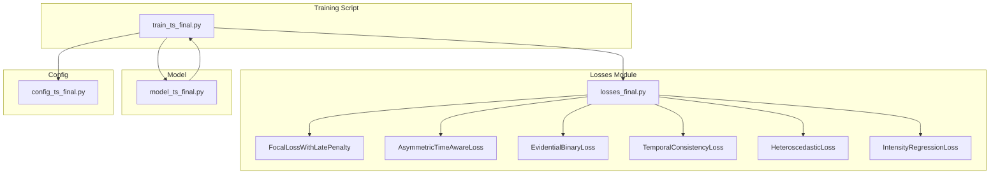
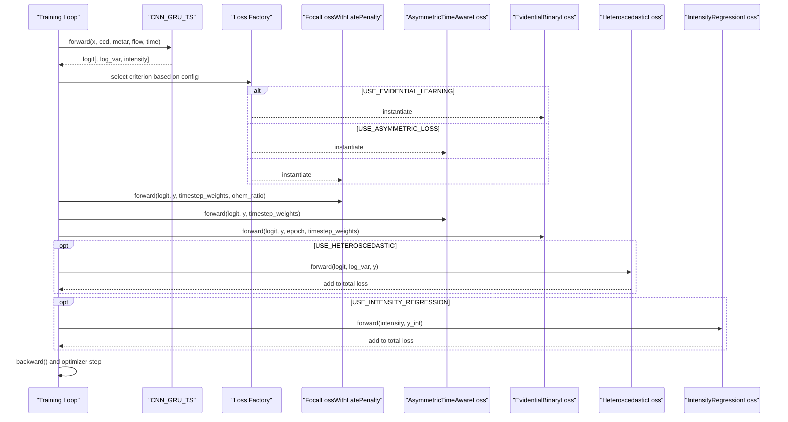
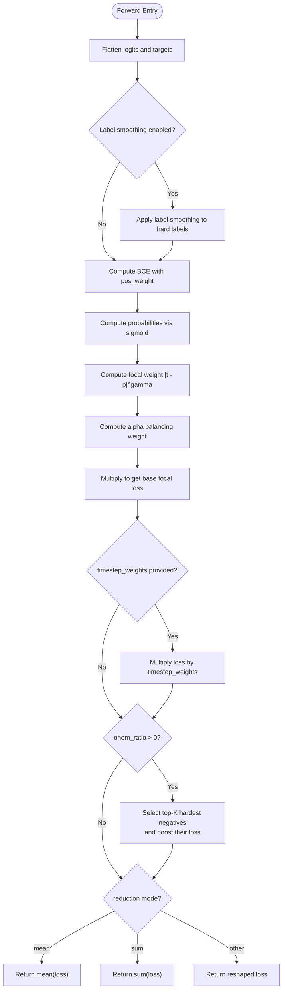
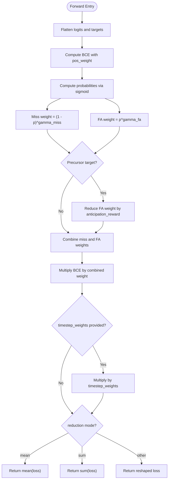
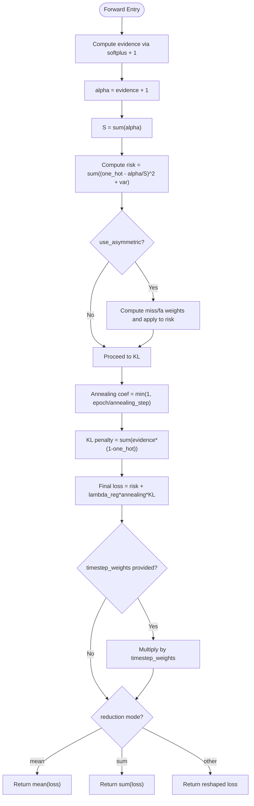
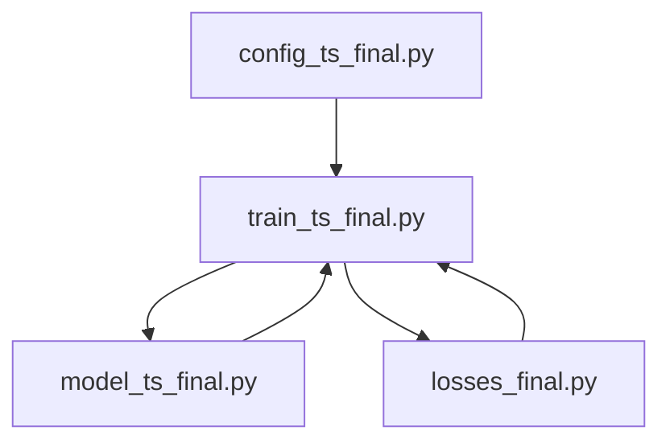

# Advanced Loss Functions

<cite>
**Referenced Files in This Document**
- [losses_final.py](file://losses_final.py)
- [train_ts_final.py](file://train_ts_final.py)
- [config_ts_final.py](file://config_ts_final.py)
- [model_ts_final.py](file://model_ts_final.py)
</cite>

## Table of Contents
1. [Introduction](#introduction)
2. [Project Structure](#project-structure)
3. [Core Components](#core-components)
4. [Architecture Overview](#architecture-overview)
5. [Detailed Component Analysis](#detailed-component-analysis)
6. [Dependency Analysis](#dependency-analysis)
7. [Performance Considerations](#performance-considerations)
8. [Troubleshooting Guide](#troubleshooting-guide)
9. [Conclusion](#conclusion)
10. [Appendices](#appendices)

## Introduction
This document provides a comprehensive guide to the advanced loss functions implemented in the repository, focusing on:
- FocalLossWithLatePenalty: gamma parameter tuning, alpha balancing, late penalty mechanisms, and label smoothing integration
- AsymmetricTimeAwareLoss: gamma_miss and gamma_fa parameters for severe weather prediction bias
- EvidentialBinaryLoss: uncertainty quantification via evidential learning, annealing schedules, regularization terms, and variational inference components
- TemporalConsistencyLoss: spatiotemporal coherence considerations and deprecation note
- HeteroscedasticLoss: aleatoric uncertainty modeling
- IntensityRegressionLoss: precipitation forecasting with Huber loss
It also documents the loss function factory pattern used in the training script with dynamic selection based on configuration flags, and provides mathematical formulations, parameter effects, training stability considerations, and loss landscape insights.

## Project Structure
The advanced loss functions are defined in a dedicated module and integrated into the training loop with a configurable factory pattern. The model architecture exposes multiple heads that feed into these losses depending on configuration flags.

**Diagram sources**
- [train_ts_final.py:288-311](file://train_ts_final.py#L288-L311)
- [losses_final.py:13-258](file://losses_final.py#L13-L258)
- [model_ts_final.py:182-268](file://model_ts_final.py#L182-L268)
- [config_ts_final.py:61-83](file://config_ts_final.py#L61-L83)

**Section sources**
- [train_ts_final.py:288-311](file://train_ts_final.py#L288-L311)
- [losses_final.py:13-258](file://losses_final.py#L13-L258)
- [model_ts_final.py:182-268](file://model_ts_final.py#L182-L268)
- [config_ts_final.py:61-83](file://config_ts_final.py#L61-L83)

## Core Components
- FocalLossWithLatePenalty: weighted binary cross-entropy with focal modulation, alpha balancing, label smoothing, and optional OHEM for hard negatives
- AsymmetricTimeAwareLoss: asymmetric penalties for misses and false alarms, with anticipation rewards for early triggers
- EvidentialBinaryLoss: evidential deep learning with risk minimization, KL regularization, and optional asymmetric weighting
- HeteroscedasticLoss: aleatoric uncertainty-aware BCE with learned precision
- IntensityRegressionLoss: Huber loss for continuous severity score prediction
- TemporalConsistencyLoss: deprecated batch-level variance proxy for temporal consistency

**Section sources**
- [losses_final.py:13-258](file://losses_final.py#L13-L258)

## Architecture Overview
The training script dynamically selects a loss function based on configuration flags. It then combines the primary classification loss with optional uncertainty and regression losses, applying additive weight combinations derived from pre-event labeling and severity weights.

**Diagram sources**
- [train_ts_final.py:288-311](file://train_ts_final.py#L288-L311)
- [train_ts_final.py:403-447](file://train_ts_final.py#L403-L447)
- [model_ts_final.py:251-268](file://model_ts_final.py#L251-L268)

## Detailed Component Analysis

### FocalLossWithLatePenalty
- Purpose: Weighted binary cross-entropy with focal modulation to focus on hard examples, alpha balancing for extreme class imbalance, label smoothing for robustness, and optional OHEM to emphasize hard negatives.
- Key parameters:
  - gamma: Focal modulation exponent controlling focus on hard examples
  - alpha: Class balancing coefficient for minority class emphasis
  - late_penalty_weight: Multiplier for combined late penalty via additive weights
  - pos_weight: Positive class weighting factor
  - label_smoothing: Softening factor for hard labels
  - ohem_ratio: Optional ratio to boost top-K hardest negatives
- Mathematical formulation:
  - Base BCE with positive class weighting
  - Focal weight: |targets − probabilities|^gamma
  - Alpha balancing: alpha-weighted focal loss
  - Late penalty: multiply loss by timestep_weights (additive combination)
  - OHEM: boost top-K hardest negatives by a fixed factor
- Parameter effects:
  - Higher gamma increases focus on hard examples; too high may overfit
  - alpha > 0.5 emphasizes minority class; tune for severe weather imbalance
  - label_smoothing reduces overconfidence; improves reliability
  - ohem_ratio > 0 improves FAR reduction; use small ratios to avoid noise
- Training stability:
  - Label smoothing and alpha balancing mitigate class imbalance
  - OHEM prevents trivial negatives from dominating gradients
  - Late penalty encourages timely detections without multiplicative stacking
- Gradient behavior:
  - Focal modulation reduces gradients for easy examples
  - OHEM increases gradients for hard negatives
  - Combined weights ensure stable propagation across timesteps
- Convergence diagnostics:
  - Monitor balanced metrics (wPOD, wFAR, wCSI) and early detection rates
  - Track loss components: BCE, focal, OHEM boost, and late penalty contributions

**Diagram sources**
- [losses_final.py:24-91](file://losses_final.py#L24-L91)

**Section sources**
- [losses_final.py:13-91](file://losses_final.py#L13-L91)
- [train_ts_final.py:417-435](file://train_ts_final.py#L417-L435)

### AsymmetricTimeAwareLoss
- Purpose: Bias towards reducing misses of severe events and penalizing high-confidence false alarms while forgiving low-confidence early triggers. Incorporates anticipation rewards for precursors.
- Key parameters:
  - gamma_miss: Miss penalty exponent for severe event misses
  - gamma_fa: False alarm penalty exponent for confident mistakes
  - anticipation_reward: Factor to reduce FA penalty for precursors
  - pos_weight: Positive class weighting
- Mathematical formulation:
  - Compute BCE with positive class weighting
  - Miss penalty weight: (1 − p)^gamma_miss
  - FA penalty weight: p^gamma_fa
  - Anticipation reward: scale FA penalty by (1 − anticipation_reward) for precursor targets
  - Combined weight: targets × miss_weight + (1 − targets) × fa_weight
  - Final loss: weight × BCE
- Parameter effects:
  - gamma_miss controls penalty for missing severe events
  - gamma_fa controls penalty for confident false alarms
  - anticipation_reward encourages early detection without penalizing high confidence
- Training stability:
  - Asymmetry prevents over-penalization of early triggers
  - Positive class weighting maintains balance under severe imbalance
- Gradient behavior:
  - Misses increase gradients for severe events
  - High-confidence false alarms increase gradients for correction
  - Precursors receive reduced FA penalties to promote anticipation
- Convergence diagnostics:
  - Monitor wPOD and wFAR for severe events
  - Track early detection rates and lead-time distributions

**Diagram sources**
- [losses_final.py:157-193](file://losses_final.py#L157-L193)

**Section sources**
- [losses_final.py:144-193](file://losses_final.py#L144-L193)
- [train_ts_final.py:299-302](file://train_ts_final.py#L299-L302)

### EvidentialBinaryLoss
- Purpose: Evidential deep learning (EDL) for uncertainty quantification. Uses Beta distribution parameters as evidence, computes risk, and applies KL regularization with annealing.
- Key parameters:
  - annealing_step: Steps over which KL regularization anneals to full strength
  - lambda_reg: Regularization strength coefficient
  - use_asymmetric: Enable asymmetric weighting for severe events
  - gamma_miss, gamma_fa, anticipation_reward: Same as AsymmetricTimeAwareLoss
  - pos_weight: Positive class weighting
- Mathematical formulation:
  - Evidence: softplus(logits) + 1
  - Dirichlet parameters: alpha = evidence + 1
  - Evidence magnitude: S = sum(alpha)
  - Risk: sum of squared error and variance terms
  - Optional asymmetric weighting: same as AsymmetricTimeAwareLoss
  - KL regularization: sum of evidence times (1 − one-hot)
  - Annealed regularization: min(1.0, epoch / annealing_step)
  - Final loss: risk + lambda_reg × annealing_coef × KL_penalty
- Parameter effects:
  - annealing_step controls gradual activation of regularization
  - lambda_reg balances risk vs. regularization strength
  - Asymmetric weighting improves severe event handling
- Training stability:
  - KL regularization prevents overconfident evidence
  - Annealing avoids destabilizing early training
- Gradient behavior:
  - Risk drives parameter updates toward predictive accuracy
  - KL regularization discourages overfitting to incorrect classes
- Convergence diagnostics:
  - Monitor EDL uncertainty metrics and reliability plots
  - Track wPOD, wFAR, and wCSI for severe events

**Diagram sources**
- [losses_final.py:212-255](file://losses_final.py#L212-L255)

**Section sources**
- [losses_final.py:195-255](file://losses_final.py#L195-L255)
- [train_ts_final.py:289-298](file://train_ts_final.py#L289-L298)

### TemporalConsistencyLoss
- Purpose: Deprecated. Batch-level variance is not a valid temporal consistency measure due to random sampling in DataLoader.
- Notes:
  - Disabled via configuration flag
  - Audit report indicates scientific invalidity
- Practical implication:
  - Do not enable; use other temporal regularization strategies if needed

**Section sources**
- [losses_final.py:94-111](file://losses_final.py#L94-L111)
- [train_ts_final.py:309](file://train_ts_final.py#L309)

### HeteroscedasticLoss
- Purpose: Aleatoric uncertainty-aware loss that learns precision (inverse variance) to discount noisy/ambiguous frames.
- Key parameters:
  - weight: Scaling factor for the loss
- Mathematical formulation:
  - Clamp log_var to prevent extreme values
  - Compute BCE with logits and targets
  - Precision = exp(-log_var)
  - Combined loss: precision × BCE + 0.5 × log_var
- Parameter effects:
  - weight scales the overall influence of aleatoric uncertainty
- Training stability:
  - Clamping log_var prevents numerical instability
  - Precision naturally discounts ambiguous frames
- Gradient behavior:
  - High uncertainty leads to lower precision weighting
  - Ambiguous frames receive less influence on gradients
- Convergence diagnostics:
  - Monitor aleatoric uncertainty magnitudes and coverage

**Section sources**
- [losses_final.py:112-133](file://losses_final.py#L112-L133)
- [train_ts_final.py:310](file://train_ts_final.py#L310)

### IntensityRegressionLoss
- Purpose: Continuous severity score prediction using Huber loss to reduce sensitivity to outliers.
- Key parameters:
  - weight: Scaling factor
  - delta: Huber loss threshold
- Mathematical formulation:
  - Huber loss on predicted intensity vs. target intensity
  - Scaled by weight
- Parameter effects:
  - delta controls transition from quadratic to linear loss
  - weight balances regression with classification loss
- Training stability:
  - Robust to outliers compared to MSE
- Gradient behavior:
  - Smooth gradient near zero; bounded near outliers
- Convergence diagnostics:
  - Track regression metrics alongside classification metrics

**Section sources**
- [losses_final.py:135-142](file://losses_final.py#L135-L142)
- [train_ts_final.py:311](file://train_ts_final.py#L311)

## Dependency Analysis
The training script integrates multiple loss functions conditionally based on configuration flags. The model exposes heads that align with these losses.

**Diagram sources**
- [train_ts_final.py:288-311](file://train_ts_final.py#L288-L311)
- [model_ts_final.py:182-268](file://model_ts_final.py#L182-L268)
- [config_ts_final.py:61-83](file://config_ts_final.py#L61-L83)

**Section sources**
- [train_ts_final.py:288-311](file://train_ts_final.py#L288-L311)
- [model_ts_final.py:182-268](file://model_ts_final.py#L182-L268)
- [config_ts_final.py:61-83](file://config_ts_final.py#L61-L83)

## Performance Considerations
- FocalLossWithLatePenalty
  - Tune gamma to balance hard example focus and generalization
  - Use alpha > 0.5 for severe weather imbalance
  - Apply label_smoothing to improve reliability
  - Use small ohem_ratio to avoid noise amplification
- AsymmetricTimeAwareLoss
  - Increase gamma_miss for severe event emphasis
  - Adjust gamma_fa to control false alarm penalties
  - Use anticipation_reward to encourage early triggers
- EvidentialBinaryLoss
  - Increase annealing_step to gradually activate regularization
  - Tune lambda_reg to balance risk and uncertainty
  - Enable asymmetric weighting for severe events
- HeteroscedasticLoss
  - Use moderate weight to avoid overpowering classification
  - Ensure log_var clamping remains effective
- IntensityRegressionLoss
  - Choose delta based on target intensity scale
  - Scale weight to balance with classification loss

[No sources needed since this section provides general guidance]

## Troubleshooting Guide
- Symptom: Overfitting to majority class
  - Action: Increase alpha, gamma, and label_smoothing; consider asymmetric weighting
- Symptom: High false alarms
  - Action: Increase gamma_fa; reduce anticipation_reward; monitor wFAR
- Symptom: Missed severe events
  - Action: Increase gamma_miss; enable asymmetric weighting; review late penalty
- Symptom: Unstable uncertainty estimates
  - Action: Increase annealing_step; adjust lambda_reg; clamp log_var appropriately
- Symptom: Poor regression performance
  - Action: Adjust delta and weight; ensure adequate supervision

**Section sources**
- [losses_final.py:13-258](file://losses_final.py#L13-L258)
- [train_ts_final.py:417-447](file://train_ts_final.py#L417-L447)

## Conclusion
The advanced loss functions provide a flexible toolkit for severe weather nowcasting:
- FocalLossWithLatePenalty focuses on hard examples while mitigating class imbalance and encouraging timely detections
- AsymmetricTimeAwareLoss biases training toward reducing severe misses and penalizing confident false alarms
- EvidentialBinaryLoss enables uncertainty quantification with controlled regularization
- HeteroscedasticLoss models aleatoric uncertainty to discount ambiguous frames
- IntensityRegressionLoss provides continuous severity prediction
The training script’s factory pattern allows seamless switching among these losses via configuration flags, enabling phase-wise experimentation and robust evaluation.

[No sources needed since this section summarizes without analyzing specific files]

## Appendices

### Loss Function Factory Pattern
- Dynamic selection based on configuration flags:
  - USE_EVIDENTIAL_LEARNING: EvidentialBinaryLoss
  - USE_ASYMMETRIC_LOSS: AsymmetricTimeAwareLoss
  - Default: FocalLossWithLatePenalty
- Additional losses:
  - TemporalConsistencyLoss: disabled by default
  - HeteroscedasticLoss: optional
  - IntensityRegressionLoss: optional

**Section sources**
- [train_ts_final.py:288-311](file://train_ts_final.py#L288-L311)
- [config_ts_final.py:61-83](file://config_ts_final.py#L61-L83)

### Mathematical Formulations Summary
- FocalLossWithLatePenalty: BCE with focal modulation, alpha balancing, label smoothing, and optional OHEM
- AsymmetricTimeAwareLoss: asymmetric penalties for misses and false alarms with anticipation rewards
- EvidentialBinaryLoss: EDL risk plus KL regularization with annealing
- HeteroscedasticLoss: precision-weighted BCE with log_var
- IntensityRegressionLoss: Huber loss for continuous intensity

**Section sources**
- [losses_final.py:13-258](file://losses_final.py#L13-L258)