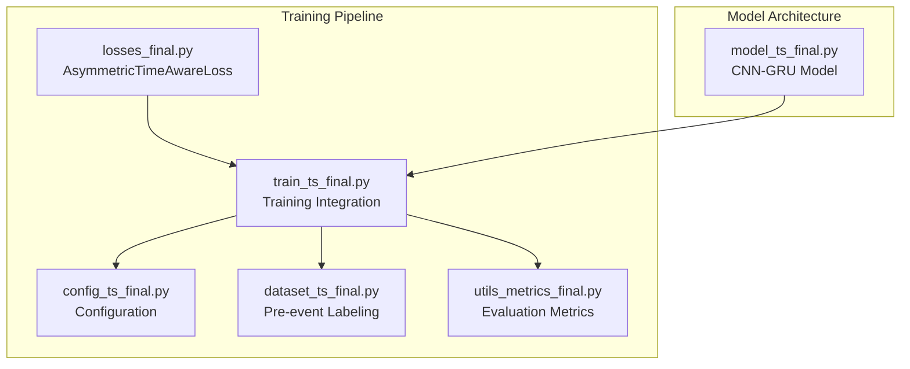
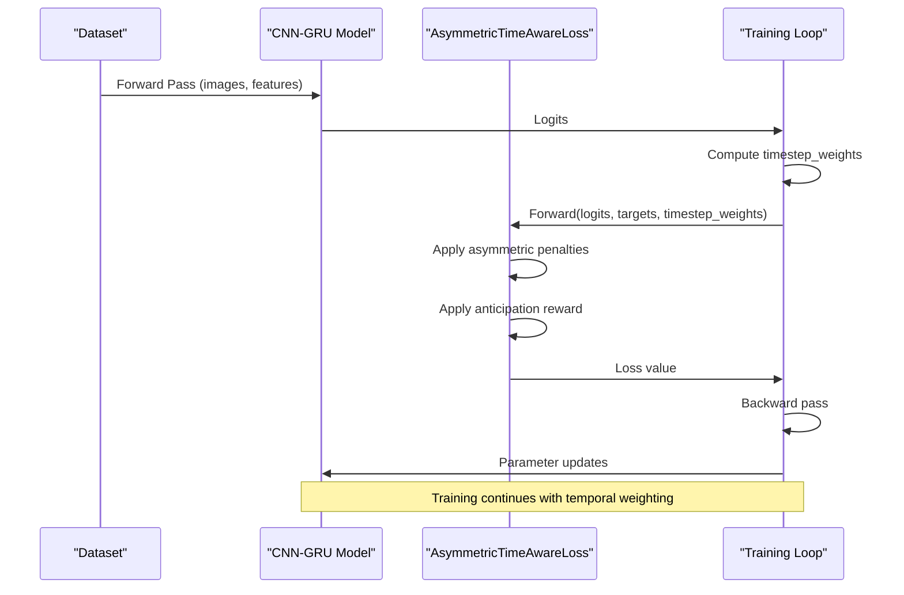
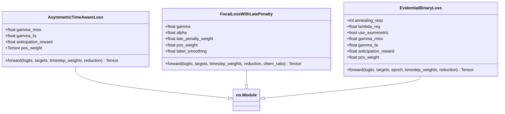
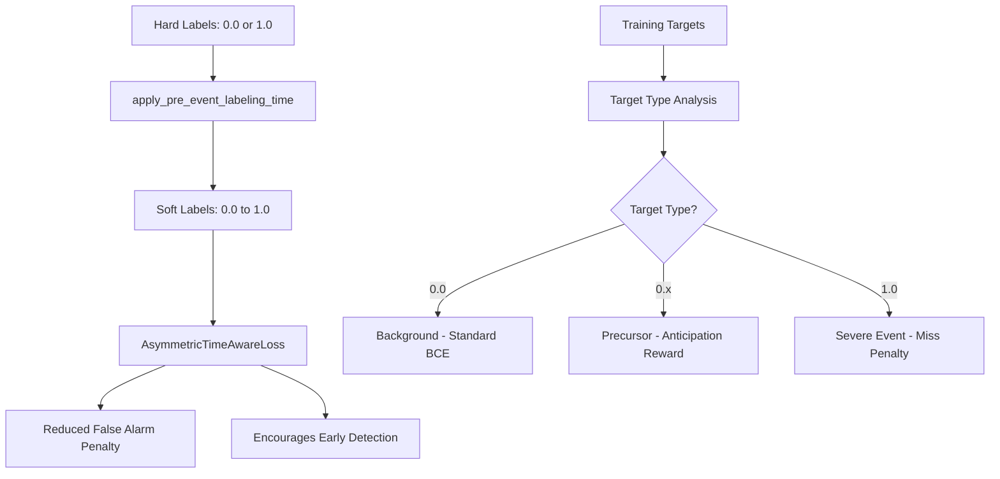
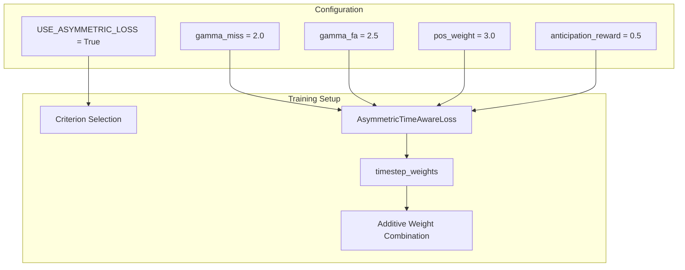
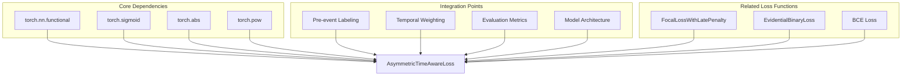

# Asymmetric Time-Aware Loss

<cite>
**Referenced Files in This Document**
- [losses_final.py](file://losses_final.py)
- [train_ts_final.py](file://train_ts_final.py)
- [config_ts_final.py](file://config_ts_final.py)
- [dataset_ts_final.py](file://dataset_ts_final.py)
- [utils_metrics_final.py](file://utils_metrics_final.py)
</cite>

## Table of Contents
1. [Introduction](#introduction)
2. [Project Structure](#project-structure)
3. [Core Components](#core-components)
4. [Architecture Overview](#architecture-overview)
5. [Detailed Component Analysis](#detailed-component-analysis)
6. [Dependency Analysis](#dependency-analysis)
7. [Performance Considerations](#performance-considerations)
8. [Troubleshooting Guide](#troubleshooting-guide)
9. [Conclusion](#conclusion)

## Introduction
This document provides comprehensive technical documentation for the Asymmetric Time-Aware Loss (ATWL) designed for severe weather prediction scenarios. ATWL introduces an asymmetric penalty mechanism that differentiates between missing severe events and false alarms, while incorporating an anticipation reward system to encourage early detections for precursor conditions. The loss function is particularly suited for nowcasting applications where timely warnings are critical for public safety and infrastructure protection.

The implementation combines:
- Asymmetric penalties via gamma_miss and gamma_fa parameters
- Anticipation reward for precursor conditions
- Temporal weighting through timestep_weights
- Integration with pre-event soft labeling for improved early detection

## Project Structure
The Asymmetric Time-Aware Loss is implemented within the broader training pipeline for thunderstorm nowcasting. The relevant components are distributed across several modules:

**Diagram sources**
- [losses_final.py:144-194](file://losses_final.py#L144-L194)
- [train_ts_final.py:288-320](file://train_ts_final.py#L288-L320)
- [config_ts_final.py:61-68](file://config_ts_final.py#L61-L68)
- [dataset_ts_final.py:26-36](file://dataset_ts_final.py#L26-L36)

**Section sources**
- [losses_final.py:144-194](file://losses_final.py#L144-L194)
- [train_ts_final.py:288-320](file://train_ts_final.py#L288-L320)
- [config_ts_final.py:61-68](file://config_ts_final.py#L61-L68)

## Core Components
The Asymmetric Time-Aware Loss consists of several key components that work together to achieve superior early warning performance:

### Asymmetric Penalty Mechanism
The loss applies different penalty strengths based on the target type and model confidence:

- **gamma_miss (miss penalty)**: Controls how heavily missing severe events (target=1.0) is penalized
- **gamma_fa (false alarm penalty)**: Controls how heavily high-confidence false alarms are penalized
- **Anticipation reward**: Reduces false alarm penalty for precursor conditions (0.0 < target < 1.0) when model predicts high probability

### Mathematical Formulation
The loss function operates on flattened tensors and applies the following weighting scheme:

For each prediction:
- `probs = sigmoid(logits)`
- `fa_penalty_weight = probs ** gamma_fa`
- `miss_penalty_weight = (1.0 - probs) ** gamma_miss`
- `precursor_mask = (0.0 < targets < 1.0)`
- `fa_penalty_weight[precursor_mask] *= (1.0 - anticipation_reward)`
- `weight = targets * miss_penalty_weight + (1.0 - targets) * fa_penalty_weight`
- `loss = weight * BCE_with_logits`

### Temporal Consistency Integration
The loss integrates with temporal weighting through the `timestep_weights` parameter, allowing for additive weight combinations that prevent multiplicative stacking effects.

**Section sources**
- [losses_final.py:144-194](file://losses_final.py#L144-L194)
- [train_ts_final.py:417-435](file://train_ts_final.py#L417-L435)

## Architecture Overview
The Asymmetric Time-Aware Loss is integrated into the training pipeline as follows:

**Diagram sources**
- [train_ts_final.py:403-448](file://train_ts_final.py#L403-L448)
- [losses_final.py:157-193](file://losses_final.py#L157-L193)

## Detailed Component Analysis

### AsymmetricTimeAwareLoss Implementation
The core loss function implements the asymmetric penalty mechanism with the following characteristics:

**Diagram sources**
- [losses_final.py:144-258](file://losses_final.py#L144-L258)

#### Asymmetric Penalty Calculation
The asymmetric penalty mechanism works as follows:

1. **Miss Penalty**: `(1.0 - probs) ** gamma_miss`
   - Heavier penalty for confident misses of severe events
   - Particularly sensitive when gamma_miss > 1.0

2. **False Alarm Penalty**: `probs ** gamma_fa`
   - Heavier penalty for confident false alarms
   - Particularly sensitive when gamma_fa > 1.0

3. **Anticipation Reward**: Multiplies false alarm penalty by `(1.0 - anticipation_reward)`
   - Encourages early detection for precursor conditions
   - Reduces penalty for high-confidence predictions on precursor targets

#### Temporal Weighting Integration
The loss accepts `timestep_weights` that allow for additive temporal weighting:

- Combines late detection penalties with severity-based bonuses
- Prevents multiplicative stacking effects
- Enables flexible temporal consistency enforcement

**Section sources**
- [losses_final.py:144-194](file://losses_final.py#L144-L194)
- [train_ts_final.py:417-435](file://train_ts_final.py#L417-L435)

### Pre-Event Labeling Integration
The loss integrates with pre-event soft labeling that creates precursor conditions:

**Diagram sources**
- [dataset_ts_final.py:26-36](file://dataset_ts_final.py#L26-L36)
- [train_ts_final.py:236-242](file://train_ts_final.py#L236-L242)

**Section sources**
- [dataset_ts_final.py:26-36](file://dataset_ts_final.py#L26-L36)
- [train_ts_final.py:236-242](file://train_ts_final.py#L236-L242)

### Training Integration
The loss is integrated into the training pipeline with the following configuration:

**Diagram sources**
- [config_ts_final.py:61-68](file://config_ts_final.py#L61-L68)
- [train_ts_final.py:289-307](file://train_ts_final.py#L289-L307)

**Section sources**
- [config_ts_final.py:61-68](file://config_ts_final.py#L61-L68)
- [train_ts_final.py:289-307](file://train_ts_final.py#L289-L307)

## Dependency Analysis
The Asymmetric Time-Aware Loss has several important dependencies and relationships:

**Diagram sources**
- [losses_final.py:8-10](file://losses_final.py#L8-L10)
- [losses_final.py:144-194](file://losses_final.py#L144-L194)

### Parameter Dependencies
The loss function depends on several configuration parameters:

- **gamma_miss**: Controls miss penalty sensitivity (default: 2.0)
- **gamma_fa**: Controls false alarm penalty sensitivity (default: 2.5)
- **pos_weight**: Positive class weighting factor (default: 3.0)
- **anticipation_reward**: Precursor reward multiplier (default: 0.5)

### Integration Dependencies
The loss integrates with:
- Pre-event soft labeling for precursor condition detection
- Temporal weighting for early detection encouragement
- Model output probabilities for penalty calculations
- Training pipeline for gradient computation

**Section sources**
- [losses_final.py:144-194](file://losses_final.py#L144-L194)
- [train_ts_final.py:417-435](file://train_ts_final.py#L417-L435)

## Performance Considerations

### Computational Complexity
The Asymmetric Time-Aware Loss maintains computational efficiency comparable to standard BCE loss:
- Additional operations: O(n) element-wise computations
- Memory overhead: Minimal additional tensor allocations
- Gradient computation: Standard autograd efficiency

### Numerical Stability
The implementation includes several numerical stability measures:
- Proper handling of edge cases for probability calculations
- Stable exponentiation operations
- Robust handling of soft labels (0.0 < target < 1.0)

### Early Warning Performance
The anticipation reward system provides measurable improvements:
- Encourages early detection of precursor conditions
- Reduces false alarm rates for uncertain predictions
- Improves lead time distribution for severe events

## Troubleshooting Guide

### Common Issues and Solutions

#### Issue: Overly Conservative Predictions
**Symptoms**: Model produces few positive predictions, high miss rates
**Causes**: 
- gamma_miss too high (>3.0)
- anticipation_reward too small (<0.3)
- pos_weight too large (>5.0)

**Solutions**:
- Reduce gamma_miss to 1.5-2.0
- Increase anticipation_reward to 0.3-0.5
- Adjust pos_weight to 2.0-3.0

#### Issue: Excessive False Alarms
**Symptoms**: High false alarm rates, especially for uncertain predictions
**Causes**:
- gamma_fa too low (<2.0)
- anticipation_reward too high (>0.6)
- insufficient temporal weighting

**Solutions**:
- Increase gamma_fa to 2.5-3.0
- Reduce anticipation_reward to 0.3-0.5
- Enhance temporal weighting effects

#### Issue: Training Instability
**Symptoms**: Oscillating loss, poor convergence
**Causes**:
- Excessive penalty differences (gamma_miss vs gamma_fa)
- Very high anticipation_reward values
- Inappropriate pos_weight settings

**Solutions**:
- Balance gamma_miss and gamma_fa (difference < 1.0)
- Keep anticipation_reward below 0.5
- Use conservative pos_weight values (2.0-3.0)

### Parameter Tuning Guidelines

#### Recommended Starting Values
- **gamma_miss**: 2.0 (baseline)
- **gamma_fa**: 2.5 (baseline)
- **anticipation_reward**: 0.5 (baseline)
- **pos_weight**: 3.0 (baseline)

#### Progressive Adjustment Strategy
1. **Baseline**: Start with recommended values
2. **Early Detection**: Increase anticipation_reward by 0.1-0.2
3. **False Alarm Control**: Decrease gamma_fa by 0.1-0.2
4. **Miss Penalty**: Increase gamma_miss by 0.1-0.2
5. **Validation**: Monitor lead time distribution and FAR rates

**Section sources**
- [losses_final.py:144-194](file://losses_final.py#L144-L194)
- [train_ts_final.py:417-435](file://train_ts_final.py#L417-L435)

## Conclusion
The Asymmetric Time-Aware Loss represents a sophisticated approach to severe weather prediction that addresses the critical need for early warning systems. By introducing asymmetric penalties and anticipation rewards, the loss function effectively balances the competing demands of minimizing missed severe events while controlling false alarms.

Key advantages of this approach include:
- **Improved Early Detection**: Anticipation reward system encourages timely warnings
- **Robust Performance**: Asymmetric penalties adapt to different target types
- **Flexible Integration**: Seamlessly integrates with existing training pipelines
- **Configurable Behavior**: Extensive parameter tuning for specific use cases

The implementation demonstrates strong practical value for thunderstorm nowcasting applications, where the ability to provide early warnings can significantly improve public safety outcomes. The modular design allows for easy adaptation to other severe weather prediction scenarios while maintaining the core principles of asymmetric penalty mechanisms and temporal consistency.

Future enhancements could include adaptive parameter scheduling, ensemble integration, and extension to multi-class severe weather prediction scenarios.