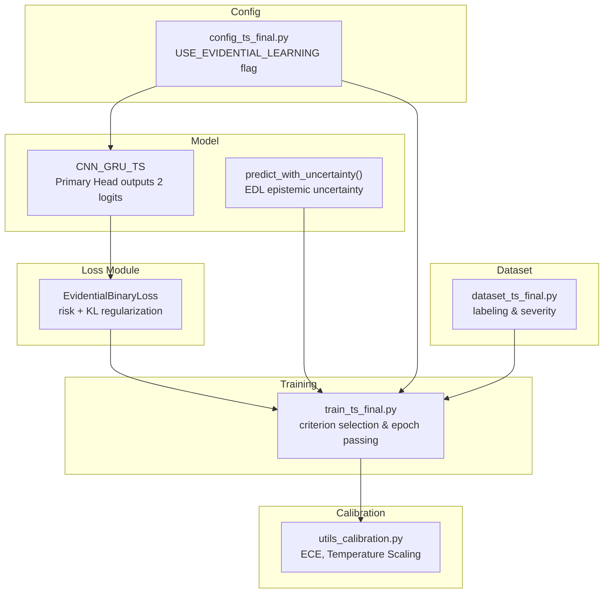
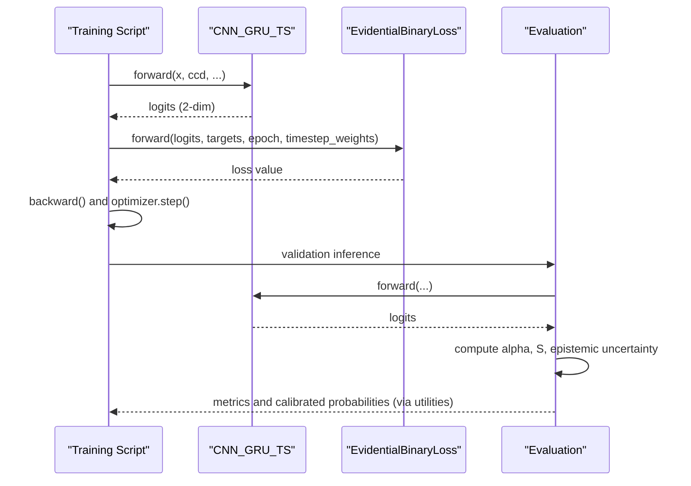
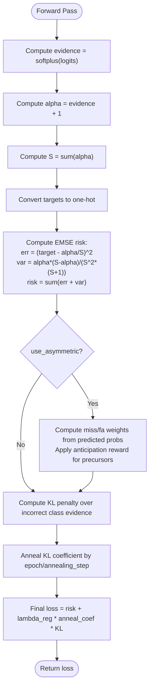
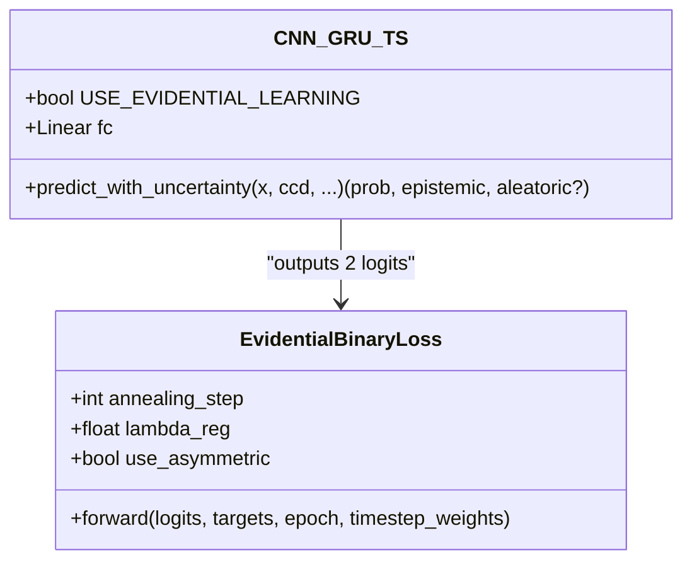
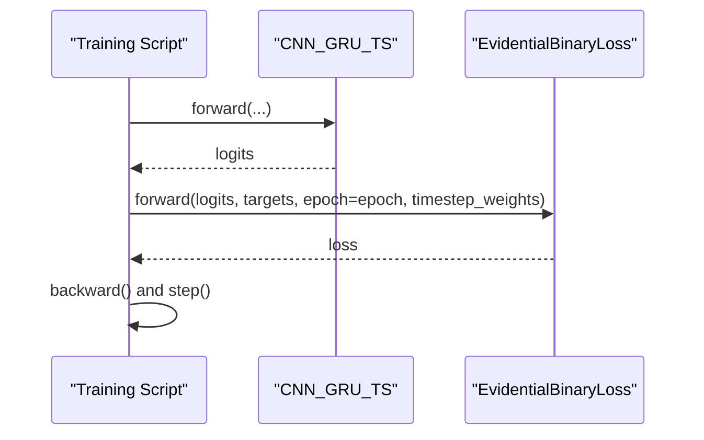
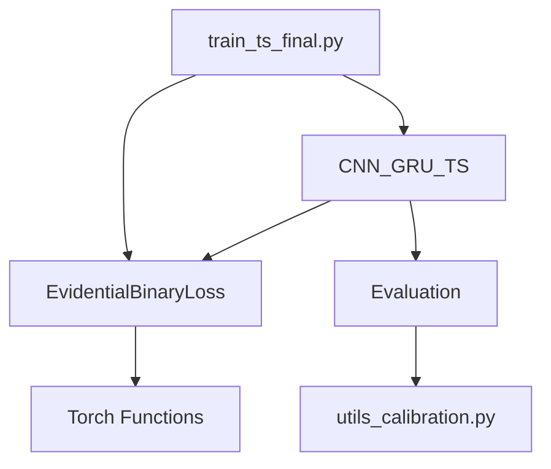

# Evidential Binary Loss

<cite>
**Referenced Files in This Document**
- [losses_final.py](file://losses_final.py)
- [model_ts_final.py](file://model_ts_final.py)
- [train_ts_final.py](file://train_ts_final.py)
- [config_ts_final.py](file://config_ts_final.py)
- [utils_calibration.py](file://utils_calibration.py)
- [dataset_ts_final.py](file://dataset_ts_final.py)
</cite>

## Table of Contents
1. [Introduction](#introduction)
2. [Project Structure](#project-structure)
3. [Core Components](#core-components)
4. [Architecture Overview](#architecture-overview)
5. [Detailed Component Analysis](#detailed-component-analysis)
6. [Dependency Analysis](#dependency-analysis)
7. [Performance Considerations](#performance-considerations)
8. [Troubleshooting Guide](#troubleshooting-guide)
9. [Conclusion](#conclusion)
10. [Appendices](#appendices)

## Introduction
This document explains the Evidential Binary Loss (EDL) implementation for uncertainty quantification in a binary classification setting. The loss builds on the Beta distribution evidence framework, where model outputs are interpreted as “evidence” for a Beta distribution over probabilities. The implementation includes:
- Evidence interpretation via softplus-transformed logits and Dirichlet-style alpha parameters
- Expected Mean Square Error (EMSE) risk calculation combining squared error and variance
- Annealed KL divergence regularization to stabilize learning and improve calibration
- Optional asymmetric weighting for severe event prediction and anticipation rewards
- Integration with the main model architecture for robust probabilistic forecasting

The document also covers practical aspects such as uncertainty estimation, calibration procedures, and operational integration within the training pipeline.

## Project Structure
The Evidential Binary Loss resides in the loss module and is integrated into the training loop and model architecture. Supporting utilities handle calibration and dataset preparation.

**Diagram sources**
- [losses_final.py:195-255](file://losses_final.py#L195-L255)
- [model_ts_final.py:182-200](file://model_ts_final.py#L182-L200)
- [model_ts_final.py:274-302](file://model_ts_final.py#L274-L302)
- [train_ts_final.py:288-311](file://train_ts_final.py#L288-L311)
- [utils_calibration.py:24-106](file://utils_calibration.py#L24-L106)
- [config_ts_final.py:68](file://config_ts_final.py#L68)
- [dataset_ts_final.py:26-36](file://dataset_ts_final.py#L26-L36)

**Section sources**
- [losses_final.py:195-255](file://losses_final.py#L195-L255)
- [model_ts_final.py:182-200](file://model_ts_final.py#L182-L200)
- [model_ts_final.py:274-302](file://model_ts_final.py#L274-L302)
- [train_ts_final.py:288-311](file://train_ts_final.py#L288-L311)
- [utils_calibration.py:24-106](file://utils_calibration.py#L24-L106)
- [config_ts_final.py:68](file://config_ts_final.py#L68)
- [dataset_ts_final.py:26-36](file://dataset_ts_final.py#L26-L36)

## Core Components
- EvidentialBinaryLoss: Implements EMSE risk with Dirichlet-style alpha parameters, optional asymmetric weighting, and annealed KL regularization.
- CNN_GRU_TS: Outputs 2 logits when evidential learning is enabled; provides a deterministic uncertainty estimation routine.
- Training integration: Criterion selection and epoch passing to enable annealing.
- Calibration utilities: ECE computation and temperature scaling for post-hoc calibration.

Key implementation references:
- [EvidentialBinaryLoss.forward:212-255](file://losses_final.py#L212-L255)
- [CNN_GRU_TS.primary head and predict_with_uncertainty:182-200](file://model_ts_final.py#L182-L200)
- [Training criterion selection and epoch passing:288-311](file://train_ts_final.py#L288-L311)
- [Calibration utilities:24-106](file://utils_calibration.py#L24-L106)

**Section sources**
- [losses_final.py:195-255](file://losses_final.py#L195-L255)
- [model_ts_final.py:182-200](file://model_ts_final.py#L182-L200)
- [model_ts_final.py:274-302](file://model_ts_final.py#L274-L302)
- [train_ts_final.py:288-311](file://train_ts_final.py#L288-L311)
- [utils_calibration.py:24-106](file://utils_calibration.py#L24-L106)

## Architecture Overview
The Evidential Binary Loss integrates into the training loop as follows:
- The model outputs 2 logits when evidential learning is enabled.
- The loss computes evidence, alpha parameters, risk, and KL regularization.
- The training script passes the current epoch to the loss to compute the annealing coefficient.
- During evaluation, the model’s uncertainty estimation routine extracts epistemic uncertainty from alpha parameters.

**Diagram sources**
- [train_ts_final.py:404-447](file://train_ts_final.py#L404-L447)
- [train_ts_final.py:482-489](file://train_ts_final.py#L482-L489)
- [model_ts_final.py:274-302](file://model_ts_final.py#L274-L302)
- [losses_final.py:212-255](file://losses_final.py#L212-L255)

## Detailed Component Analysis

### EvidentialBinaryLoss: Mathematical Foundations and Implementation
- Evidence interpretation:
  - Input logits transformed via softplus to produce evidence.
  - Alpha parameters are evidence plus a small constant to ensure positivity.
  - S is the sum of alphas, forming a Dirichlet-like normalization.
- Risk calculation:
  - EMSE risk combines squared error between target and expected mean (alpha/S) and a variance term derived from alpha and S.
- Asymmetric weighting:
  - Optional: penalizes misses and false alarms differently based on predicted probability and target class.
  - Anticipation reward reduces false alarm penalty for precursor targets.
- KL regularization:
  - Penalizes evidence of the incorrect class.
  - Annealed via a coefficient that increases with epoch until a fixed step.

**Diagram sources**
- [losses_final.py:212-255](file://losses_final.py#L212-L255)

**Section sources**
- [losses_final.py:195-255](file://losses_final.py#L195-L255)

### Model Integration: Primary Head and Uncertainty Estimation
- Primary head outputs 2 logits when evidential learning is enabled.
- Deterministic uncertainty estimation:
  - Evidence and alpha computed from logits.
  - Mean probability for class 1 equals alpha[1]/S.
  - Epistemic uncertainty proportional to 2/S.
  - Aleatoric uncertainty can be estimated via heteroscedastic head if enabled.

**Diagram sources**
- [model_ts_final.py:182-200](file://model_ts_final.py#L182-L200)
- [model_ts_final.py:274-302](file://model_ts_final.py#L274-L302)
- [losses_final.py:195-255](file://losses_final.py#L195-L255)

**Section sources**
- [model_ts_final.py:182-200](file://model_ts_final.py#L182-L200)
- [model_ts_final.py:274-302](file://model_ts_final.py#L274-L302)

### Training Integration and Annealing Schedule
- Criterion selection:
  - When evidential learning is enabled, the training script instantiates EvidentialBinaryLoss and passes epoch to the forward pass.
- Annealing:
  - The annealing coefficient grows linearly from 0 to 1 over a fixed number of steps, controlling the strength of KL regularization.
- Optional asymmetric weighting:
  - Enabled via configuration; influences risk weighting for severe events and anticipatory behavior.

**Diagram sources**
- [train_ts_final.py:288-311](file://train_ts_final.py#L288-L311)
- [train_ts_final.py:482-489](file://train_ts_final.py#L482-L489)
- [losses_final.py:240-246](file://losses_final.py#L240-L246)

**Section sources**
- [train_ts_final.py:288-311](file://train_ts_final.py#L288-L311)
- [train_ts_final.py:482-489](file://train_ts_final.py#L482-L489)
- [losses_final.py:240-246](file://losses_final.py#L240-L246)

### Practical Examples and Usage Patterns
- Enabling evidential learning:
  - Set the configuration flag to activate the 2-logit primary head and EvidentialBinaryLoss.
- Computing uncertainty:
  - Use the model’s uncertainty estimation routine to obtain mean probability and epistemic uncertainty.
- Calibration:
  - Use temperature scaling utilities to calibrate probabilities post-training.

References:
- [USE_EVIDENTIAL_LEARNING flag](file://config_ts_final.py#L68)
- [predict_with_uncertainty:274-302](file://model_ts_final.py#L274-L302)
- [Temperature scaling utilities:63-105](file://utils_calibration.py#L63-L105)

**Section sources**
- [config_ts_final.py:68](file://config_ts_final.py#L68)
- [model_ts_final.py:274-302](file://model_ts_final.py#L274-L302)
- [utils_calibration.py:63-105](file://utils_calibration.py#L63-L105)

## Dependency Analysis
- EvidentialBinaryLoss depends on:
  - Torch functional operations for softplus and sigmoid.
  - Numerical stability via small constants and clamping where applicable.
- Model depends on:
  - Primary head producing 2 logits when evidential learning is enabled.
  - Optional heteroscedastic head for aleatoric uncertainty.
- Training depends on:
  - Criterion selection based on configuration.
  - Passing epoch to the loss for annealing.
- Calibration depends on:
  - Post-hoc temperature scaling and ECE computation.

**Diagram sources**
- [losses_final.py:212-255](file://losses_final.py#L212-L255)
- [model_ts_final.py:182-200](file://model_ts_final.py#L182-L200)
- [train_ts_final.py:288-311](file://train_ts_final.py#L288-L311)
- [utils_calibration.py:24-106](file://utils_calibration.py#L24-L106)

**Section sources**
- [losses_final.py:212-255](file://losses_final.py#L212-L255)
- [model_ts_final.py:182-200](file://model_ts_final.py#L182-L200)
- [train_ts_final.py:288-311](file://train_ts_final.py#L288-L311)
- [utils_calibration.py:24-106](file://utils_calibration.py#L24-L106)

## Performance Considerations
- Evidence initialization:
  - Adding a small constant to alpha ensures numerical stability and prevents division by zero.
- KL regularization:
  - Annealing prevents premature strong regularization, allowing the model to learn initial representations before enforcing prior alignment.
- Asymmetric weighting:
  - Helps balance severe event detection and false alarm control without over-penalizing early triggers for precursors.
- Computational overhead:
  - Deterministic uncertainty estimation is efficient and does not require multiple forward passes.

[No sources needed since this section provides general guidance]

## Troubleshooting Guide
- Overconfident predictions:
  - Use temperature scaling to calibrate probabilities post-training.
- Poor calibration with ECE:
  - ECE can reveal non-uniform miscalibration; consider temperature scaling or Platt scaling depending on compatibility.
- Training instability:
  - Adjust annealing step and KL regularization strength; ensure proper label smoothing and asymmetric weighting settings.
- Incorrect uncertainty behavior:
  - Verify that the primary head outputs 2 logits and that uncertainty estimation is invoked when evidential learning is enabled.

**Section sources**
- [utils_calibration.py:24-106](file://utils_calibration.py#L24-L106)
- [model_ts_final.py:274-302](file://model_ts_final.py#L274-L302)
- [losses_final.py:240-246](file://losses_final.py#L240-L246)

## Conclusion
The Evidential Binary Loss provides a principled, mathematically grounded approach to uncertainty quantification for binary classification. By interpreting model outputs as evidence for a Beta distribution, it naturally captures both aleatoric and epistemic uncertainty characteristics. The EMSE risk formulation, combined with annealed KL regularization and optional asymmetric weighting, yields robust probabilistic forecasts suitable for operational nowcasting tasks. Integration with the model and training pipeline enables efficient uncertainty estimation and calibration, supporting reliable decision-making under uncertainty.

[No sources needed since this section summarizes without analyzing specific files]

## Appendices

### Mathematical Definitions and Notation
- Evidence and alpha parameters:
  - Evidence = softplus(logits)
  - alpha = evidence + 1
  - S = sum(alpha)
- Expected Mean Square Error risk:
  - err = (target_one_hot - alpha / S)^2
  - var = alpha * (S - alpha) / (S^2 * (S + 1))
  - risk = sum(err + var)
- KL regularization:
  - kl_penalty = sum(evidence * (1 - target_one_hot))
  - annealing_coef = min(1.0, epoch / annealing_step)
  - loss = risk + lambda_reg * annealing_coef * kl_penalty

**Section sources**
- [losses_final.py:212-255](file://losses_final.py#L212-L255)

### Integration Checklist
- Enable evidential learning in configuration.
- Ensure the model’s primary head outputs 2 logits.
- Use the model’s uncertainty estimation routine for deterministic epistemic uncertainty.
- Calibrate probabilities post-training using temperature scaling utilities.
- Monitor ECE and reliability diagrams to assess calibration quality.

**Section sources**
- [config_ts_final.py:68](file://config_ts_final.py#L68)
- [model_ts_final.py:274-302](file://model_ts_final.py#L274-L302)
- [utils_calibration.py:24-106](file://utils_calibration.py#L24-L106)